## Slide 1


```
(no extractable text)
```

## Slide 2


```
Advanced retrieval
for your AI Apps
and Agents on Azure
Subtitle or speaker name
```

## Slide 3

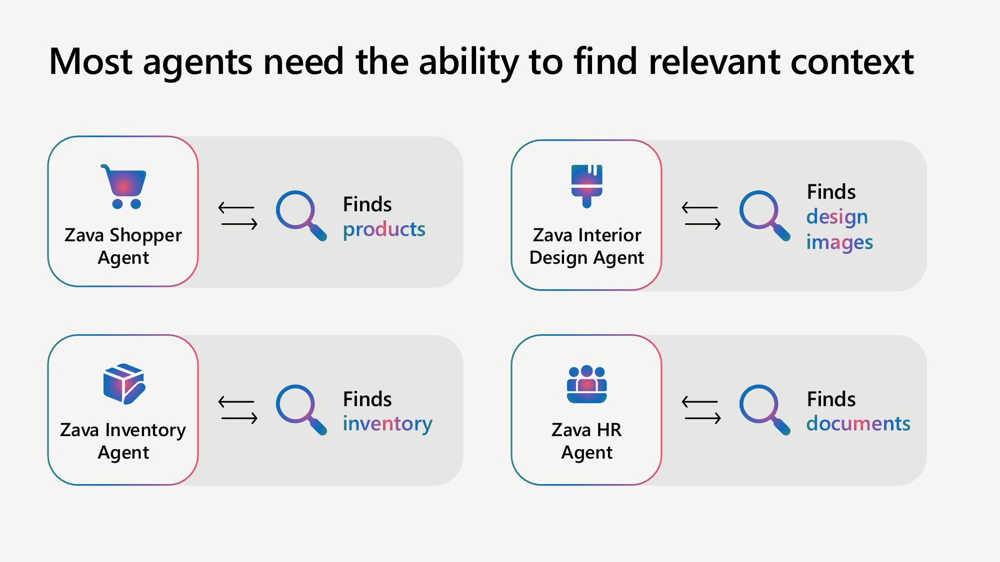

```
Most agents need the ability to find relevant context


                                              Finds
                  Finds
                                              design
 Zava Shopper     products    Zava Interior   images
    Agent                     Design Agent


                  Finds                       Finds
Zava Inventory    inventory     Zava HR       documents
    Agent                        Agent
```

## Slide 4

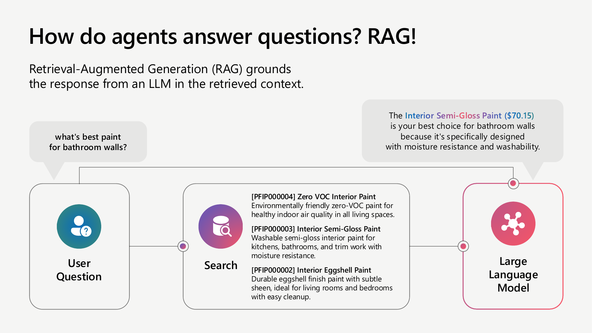

```
How do agents answer questions? RAG!
Retrieval-Augmented Generation (RAG) grounds
the response from an LLM in the retrieved context.

                                                                                      The Interior Semi-Gloss Paint ($70.15)
                                                                                      is your best choice for bathroom walls
     what's best paint                                                                   because it's specifically designed
   for bathroom walls?                                                               with moisture resistance and washability.


                                        [PFIP000004] Zero VOC Interior Paint
                                        Environmentally friendly zero-VOC paint for
                                        healthy indoor air quality in all living spaces.
                                        [PFIP000003] Interior Semi-Gloss Paint
                                        Washable semi-gloss interior paint for
                                        kitchens, bathrooms, and trim work with
                                        moisture resistance.
     User                      Search                                                                             Large
                                        [PFIP000002] Interior Eggshell Paint
    Question                            Durable eggshell finish paint with subtle                               Language
                                        sheen, ideal for living rooms and bedrooms                                Model
                                        with easy cleanup.
```

## Slide 5

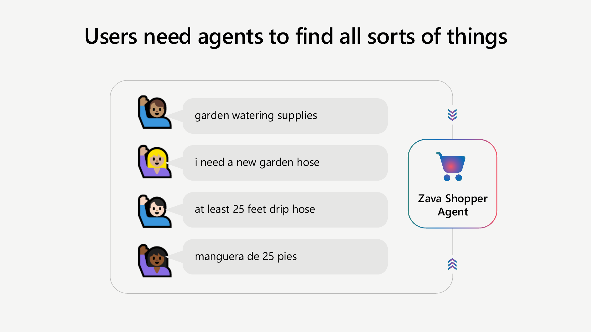

```
Users need agents to find all sorts of things


           garden watering supplies


           i need a new garden hose


                                        Zava Shopper
           at least 25 feet drip hose      Agent


           manguera de 25 pies
```

## Slide 6

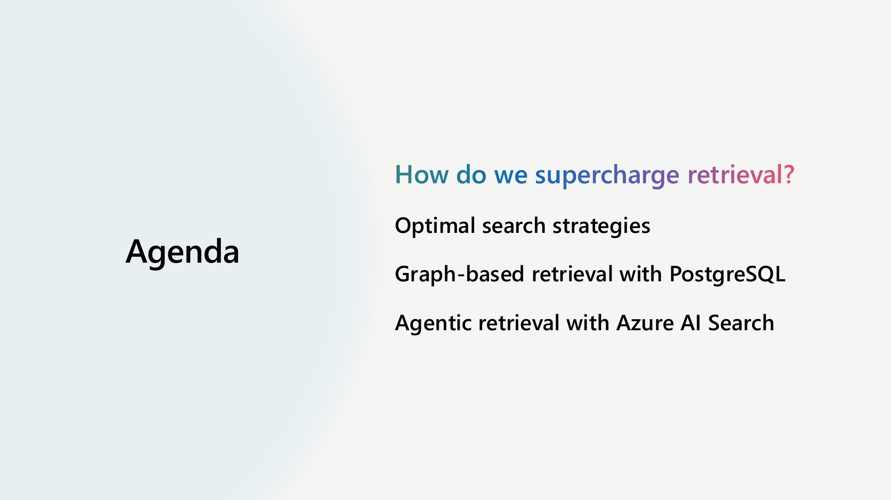

```
How do we supercharge retrieval?
         Optimal search strategies
Agenda
         Graph-based retrieval with PostgreSQL

         Agentic retrieval with Azure AI Search
```

## Slide 7


```
Optimal search strategies
```

## Slide 8

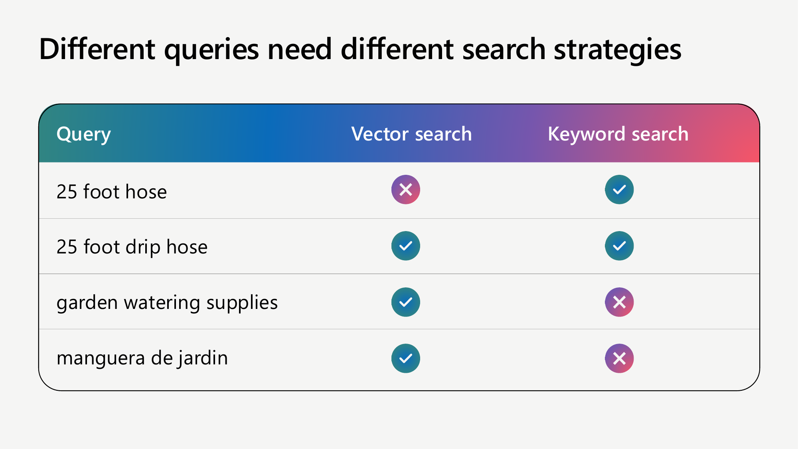

```
Different queries need different search strategies

 Query                      Vector search   Keyword search

 25 foot hose

 25 foot drip hose

 garden watering supplies

 manguera de jardin
```

## Slide 9

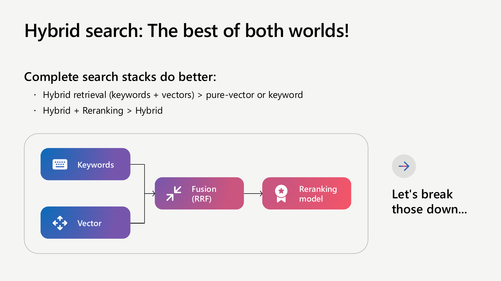

```
Hybrid search: The best of both worlds!

Complete search stacks do better:
  Hybrid retrieval (keywords + vectors) > pure-vector or keyword
  Hybrid + Reranking > Hybrid


           Keywords

                                      Fusion                    Reranking
                                      (RRF)                     model       Let's break
                                                                            those down...
           Vector
```

## Slide 10

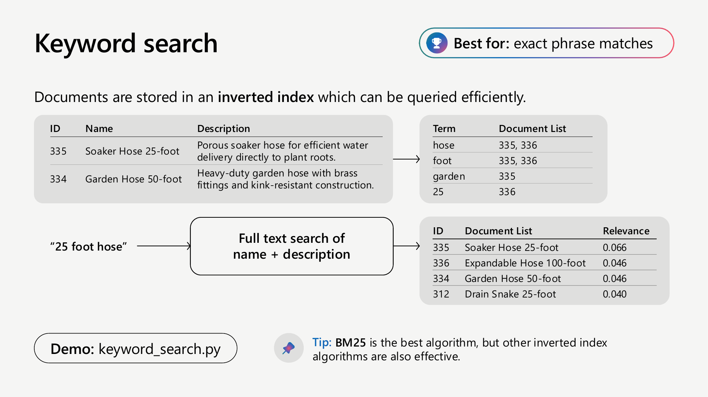

```
Keyword search                                                                        Best for: exact phrase matches


Documents are stored in an inverted index which can be queried efficiently.

  ID    Name                  Description                                      Term           Document List
                              Porous soaker hose for efficient water           hose           335, 336
  335   Soaker Hose 25-foot
                              delivery directly to plant roots.                foot           335, 336
                              Heavy-duty garden hose with brass                garden         335
  334   Garden Hose 50-foot
                              fittings and kink-resistant construction.
                                                                               25             336


                                                                               ID      Document List              Relevance
                                       Full text search of
  “25 foot hose”                                                               335     Soaker Hose 25-foot        0.066
                                      name + description
                                                                               336     Expandable Hose 100-foot   0.046
                                                                               334     Garden Hose 50-foot        0.046
                                                                               312     Drain Snake 25-foot        0.040


                                                        Tip: BM25 is the best algorithm, but other inverted index
  Demo: keyword_search.py                               algorithms are also effective.
```

## Slide 11

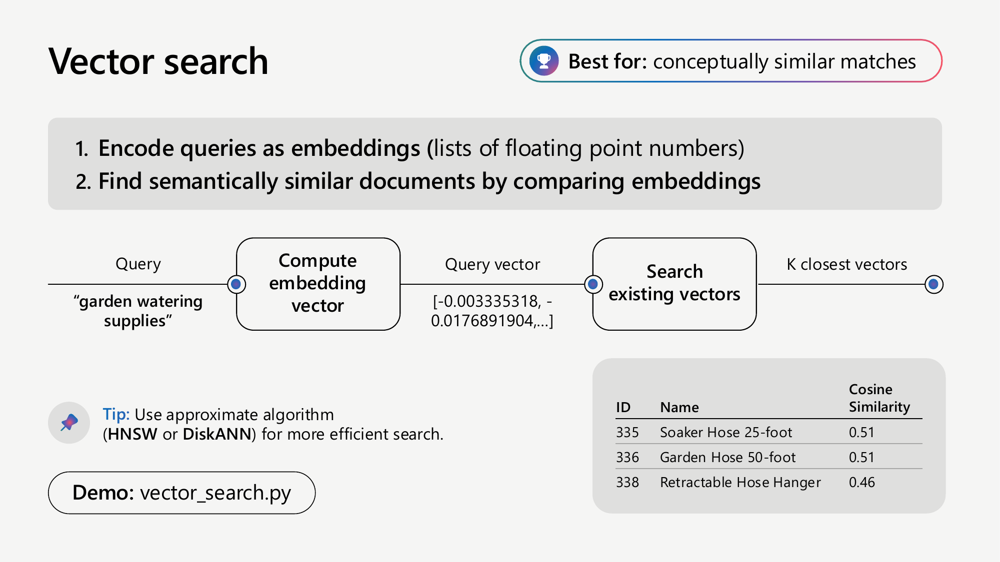

```
Vector search                                                     Best for: conceptually similar matches


 1. Encode queries as embeddings (lists of floating point numbers)
 2. Find semantically similar documents by comparing embeddings


      Query               Compute                  Query vector                                K closest vectors
                                                                           Search
                         embedding
 “garden watering                             [-0.003335318, -        existing vectors
                           vector
     supplies”                                0.0176891904,…]


                                                                                                       Cosine
                                                                       ID    Name                      Similarity
    Tip: Use approximate algorithm
    (HNSW or DiskANN) for more efficient search.                       335   Soaker Hose 25-foot       0.51
                                                                       336   Garden Hose 50-foot       0.51
                                                                       338   Retractable Hose Hanger   0.46
 Demo: vector_search.py
```

## Slide 12

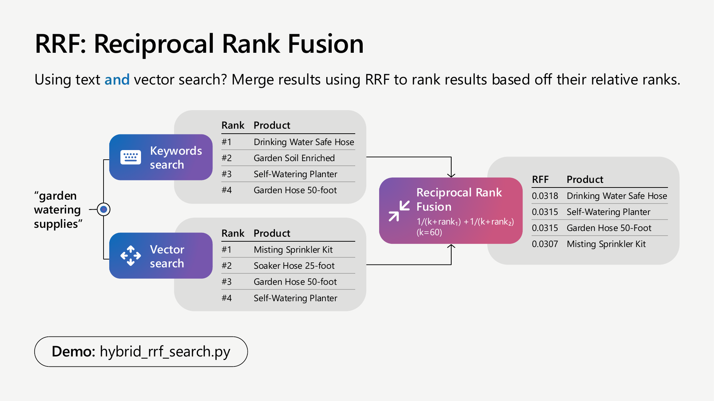

```
RRF: Reciprocal Rank Fusion
Using text and vector search? Merge results using RRF to rank results based off their relative ranks.

                             Rank Product
                             #1   Drinking Water Safe Hose
                  Keywords
                             #2   Garden Soil Enriched
                  search
                             #3   Self-Watering Planter
                                                                                        RFF     Product
                             #4   Garden Hose 50-foot        Reciprocal Rank
“garden                                                                                 0.0318 Drinking Water Safe Hose
watering                                                     Fusion                     0.0315 Self-Watering Planter
supplies”                                                    1/(k+rank₁) +1/(k+rank₂)
                                                             (k=60)                     0.0315 Garden Hose 50-Foot
                             Rank Product
                                                                                        0.0307 Misting Sprinkler Kit
                  Vector     #1   Misting Sprinkler Kit
                  search     #2   Soaker Hose 25-foot
                             #3   Garden Hose 50-foot
                             #4   Self-Watering Planter


   Demo: hybrid_rrf_search.py
```

## Slide 13

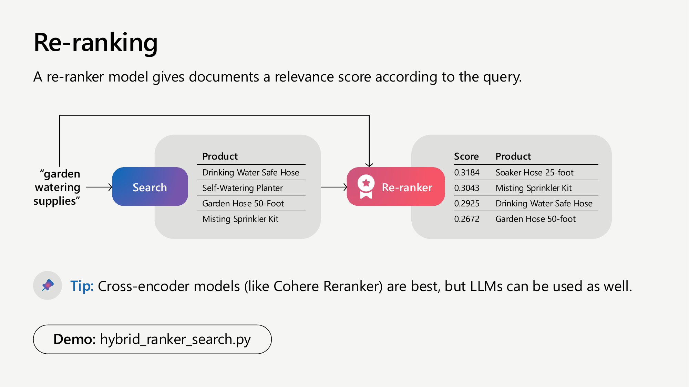

```
Re-ranking
A re-ranker model gives documents a relevance score according to the query.


                           Product                                 Score    Product
 “garden                   Drinking Water Safe Hose                0.3184   Soaker Hose 25-foot
watering        Search     Self-Watering Planter       Re-ranker   0.3043   Misting Sprinkler Kit
supplies”                  Garden Hose 50-Foot                     0.2925   Drinking Water Safe Hose
                           Misting Sprinkler Kit                   0.2672   Garden Hose 50-foot


       Tip: Cross-encoder models (like Cohere Reranker) are best, but LLMs can be used as well.


   Demo: hybrid_ranker_search.py
```

## Slide 14

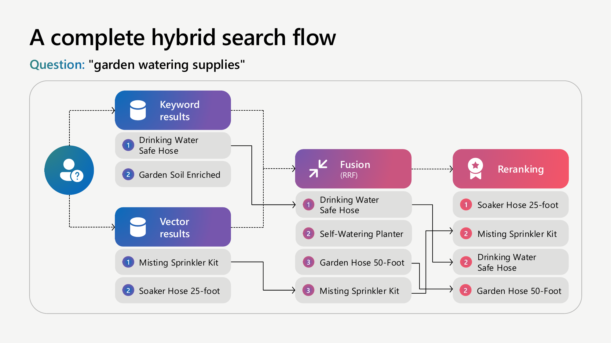

```
A complete hybrid search flow
Question: "garden watering supplies"


                         Keyword
                         results

                    Drinking Water
                1
                    Safe Hose
                                                     Fusion                      Reranking
                2   Garden Soil Enriched             (RRF)


                                                Drinking Water
                                            1                           1   Soaker Hose 25-foot
                                                Safe Hose
                         Vector
                         results            2   Self-Watering Planter   2   Misting Sprinkler Kit

                                                                            Drinking Water
                1   Misting Sprinkler Kit   3   Garden Hose 50-Foot     2
                                                                            Safe Hose

                2   Soaker Hose 25-foot     3   Misting Sprinkler Kit   2   Garden Hose 50-Foot
```

## Slide 15

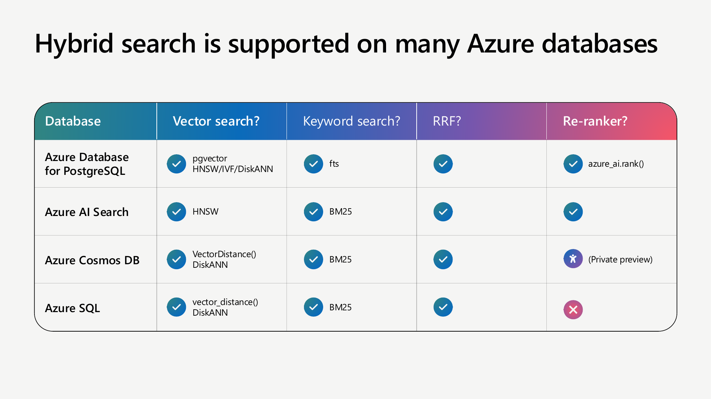

```
Hybrid search is supported on many Azure databases

Database          Vector search?         Keyword search?   RRF?   Re-ranker?

Azure Database       pgvector
                                             fts                     azure_ai.rank()
for PostgreSQL       HNSW/IVF/DiskANN


Azure AI Search      HNSW                    BM25


                     VectorDistance()
Azure Cosmos DB      DiskANN
                                             BM25                    (Private preview)


                     vector_distance()
Azure SQL            DiskANN
                                             BM25
```

## Slide 16

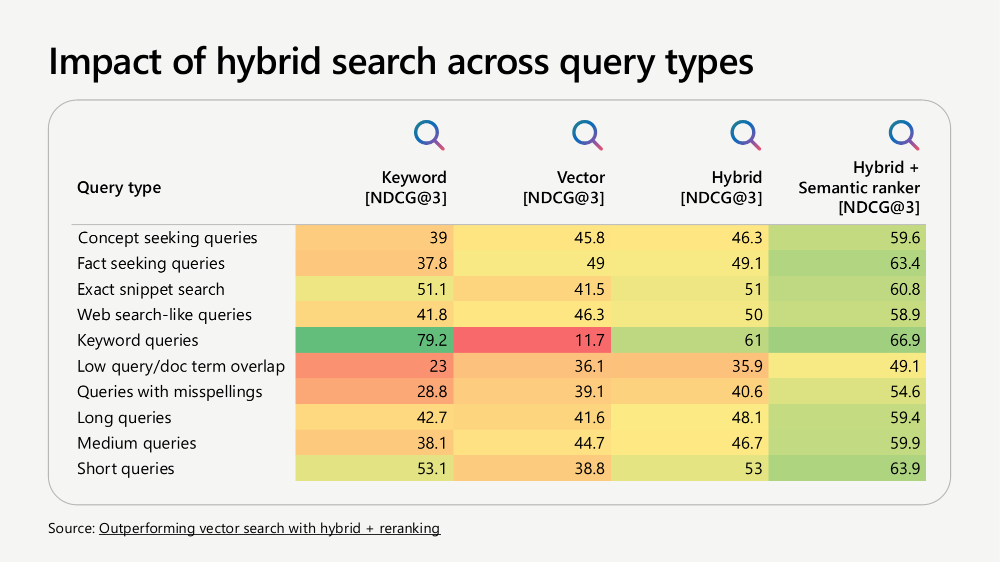

```
Impact of hybrid search across query types

                                                                                            Hybrid +
                                                 Keyword         Vector      Hybrid
    Query type                                                                        Semantic ranker
                                               [NDCG@3]       [NDCG@3]    [NDCG@3]
                                                                                          [NDCG@3]
    Concept seeking queries                              39        45.8        46.3              59.6
    Fact seeking queries                               37.8          49        49.1              63.4
    Exact snippet search                               51.1        41.5          51              60.8
    Web search-like queries                            41.8        46.3          50              58.9
    Keyword queries                                    79.2        11.7          61              66.9
    Low query/doc term overlap                           23        36.1        35.9              49.1
    Queries with misspellings                          28.8        39.1        40.6              54.6
    Long queries                                       42.7        41.6        48.1              59.4
    Medium queries                                     38.1        44.7        46.7              59.9
    Short queries                                      53.1        38.8          53              63.9


Source: Outperforming vector search with hybrid + reranking
```

## Slide 17

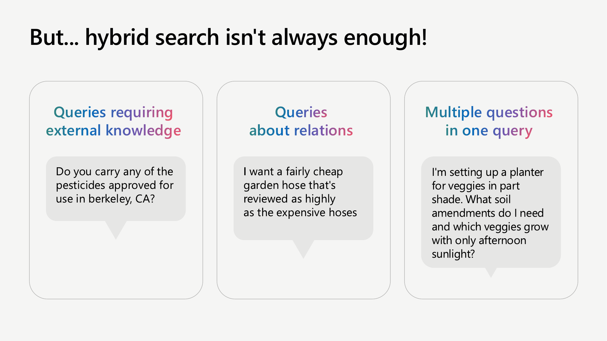

```
But... hybrid search isn't always enough!


  Queries requiring             Queries              Multiple questions
 external knowledge          about relations           in one query

  Do you carry any of the   I want a fairly cheap    I'm setting up a planter
  pesticides approved for   garden hose that's       for veggies in part
  use in berkeley, CA?      reviewed as highly       shade. What soil
                            as the expensive hoses   amendments do I need
                                                     and which veggies grow
                                                     with only afternoon
                                                     sunlight?
```

## Slide 18


```
Agentic Graph RAG
with Azure Database
for PostgreSQL
```

## Slide 19

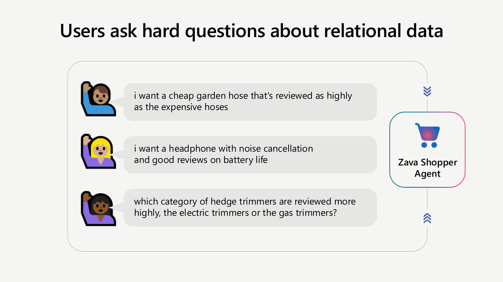

```
Users ask hard questions about relational data


        i want a cheap garden hose that's reviewed as highly
        as the expensive hoses


        i want a headphone with noise cancellation
        and good reviews on battery life                       Zava Shopper
                                                                  Agent

        which category of hedge trimmers are reviewed more
        highly, the electric trimmers or the gas trimmers?
```

## Slide 20

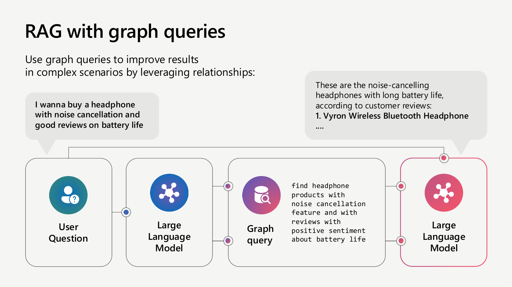

```
RAG with graph queries
Use graph queries to improve results
in complex scenarios by leveraging relationships:
                                                            These are the noise-cancelling
                                                            headphones with long battery life,
  I wanna buy a headphone                                   according to customer reviews:
  with noise cancellation and                               1. Vyron Wireless Bluetooth Headphone
  good reviews on battery life                              ....


                                                       find headphone
                                                       products with
                                                       noise cancellation
                                                       feature and with

      User                         Large       Graph
                                                       reviews with
                                                       positive sentiment
                                                                                       Large
     Question                    Language      query   about battery life            Language
                                   Model                                               Model
```

## Slide 21

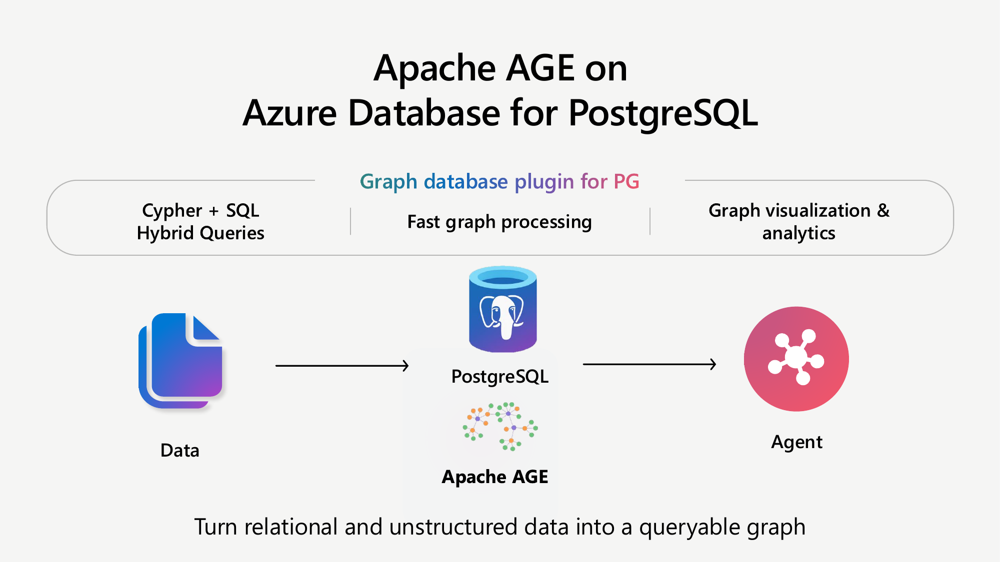

```
Apache AGE on
           Azure Database for PostgreSQL
                      Graph database plugin for PG
Cypher + SQL                                            Graph visualization &
                          Fast graph processing
Hybrid Queries                                               analytics


                               PostgreSQL


  Data                                                         Agent
                              Apache AGE

      Turn relational and unstructured data into a queryable graph
```

## Slide 22

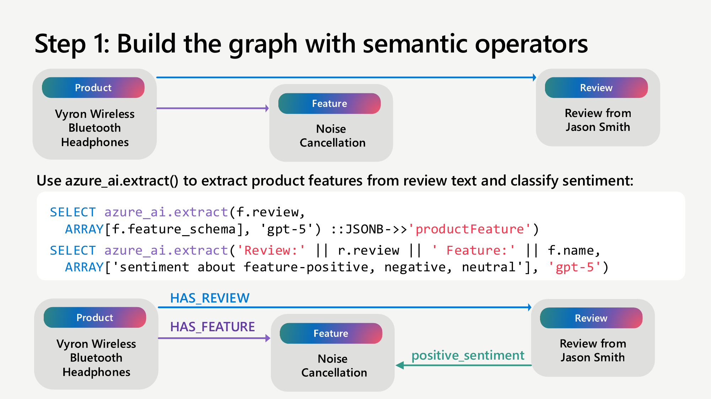

```
Step 1: Build the graph with semantic operators
      Product                                                                     Review
                                          Feature
  Vyron Wireless                                                                Review from
    Bluetooth                             Noise                                 Jason Smith
   Headphones                           Cancellation


Use azure_ai.extract() to extract product features from review text and classify sentiment:

  SELECT azure_ai.extract(f.review,
    ARRAY[f.feature_schema], 'gpt-5') ::JSONB->>'productFeature')
  SELECT azure_ai.extract('Review:' || r.review || ' Feature:' || f.name,
    ARRAY['sentiment about feature-positive, negative, neutral'], 'gpt-5')

                    HAS_REVIEW
      Product                                                                     Review
                    HAS_FEATURE           Feature
   Vyron Wireless                                                              Review from
     Bluetooth                            Noise          positive_sentiment    Jason Smith
    Headphones                          Cancellation
```

## Slide 23

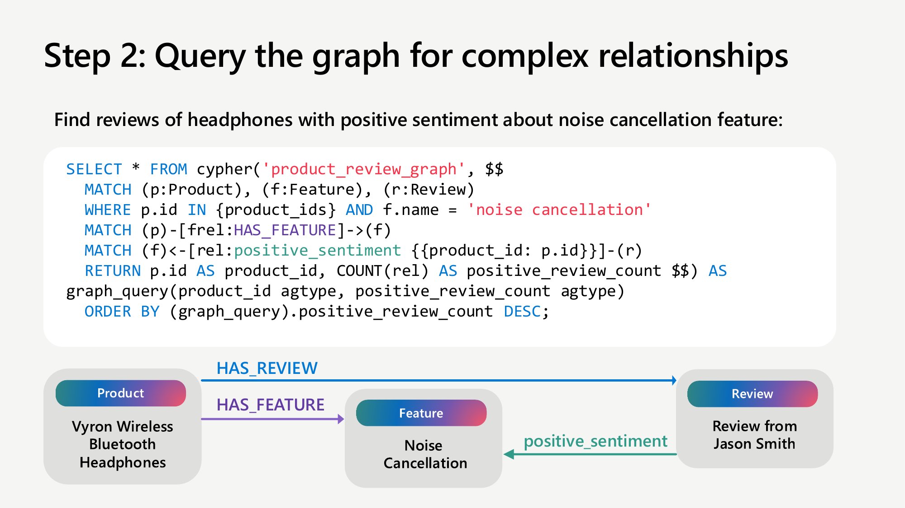

```
Step 2: Query the graph for complex relationships
Find reviews of headphones with positive sentiment about noise cancellation feature:

 SELECT * FROM cypher('product_review_graph', $$
   MATCH (p:Product), (f:Feature), (r:Review)
   WHERE p.id IN {product_ids} AND f.name = 'noise cancellation'
   MATCH (p)-[frel:HAS_FEATURE]->(f)
   MATCH (f)<-[rel:positive_sentiment {{product_id: p.id}}]-(r)
   RETURN p.id AS product_id, COUNT(rel) AS positive_review_count $$) AS
 graph_query(product_id agtype, positive_review_count agtype)
   ORDER BY (graph_query).positive_review_count DESC;


                   HAS_REVIEW
     Product                                                                  Review
                   HAS_FEATURE         Feature
  Vyron Wireless                                                           Review from
    Bluetooth                          Noise          positive_sentiment   Jason Smith
   Headphones                        Cancellation
```

## Slide 24

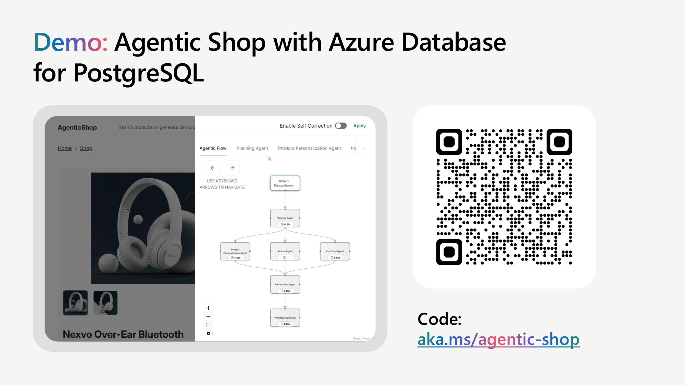

```
Demo: Agentic Shop with Azure Database
for PostgreSQL


                              Code:
                              aka.ms/agentic-shop
```

## Slide 25


```
Blog post: PostgreSQL + AI Agents
                 aka.ms/pg-ai-agents-blog

                 Learning path: Build AI apps with
                 Azure Database for PostgreSQL
Learn more       aka.ms/pg-ai-learn-path

Azure Database   Blog: Azure Database for
for PostgreSQL   PostgreSQL
                 aka.ms/azurepostgresblog


                 Install VS Code Extension for PostgreSQL
                 aka.ms/pgsql-vscode
```

## Slide 26


```
Agentic retrieval
with Azure AI Search
```

## Slide 27

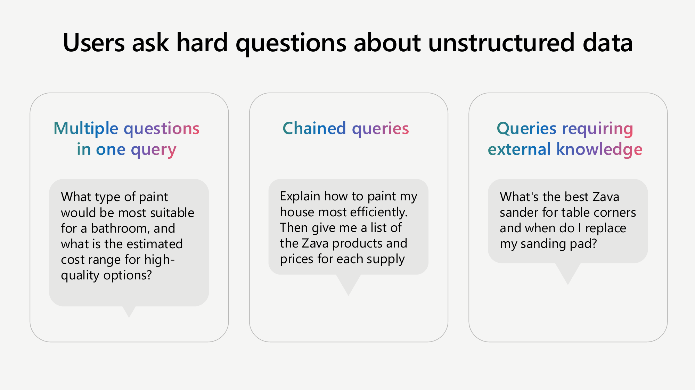

```
Users ask hard questions about unstructured data


Multiple questions       Chained queries            Queries requiring
  in one query                                     external knowledge

What type of paint       Explain how to paint my    What's the best Zava
would be most suitable   house most efficiently.    sander for table corners
for a bathroom, and      Then give me a list of     and when do I replace
what is the estimated    the Zava products and      my sanding pad?
cost range for high-     prices for each supply
quality options?
```

## Slide 28

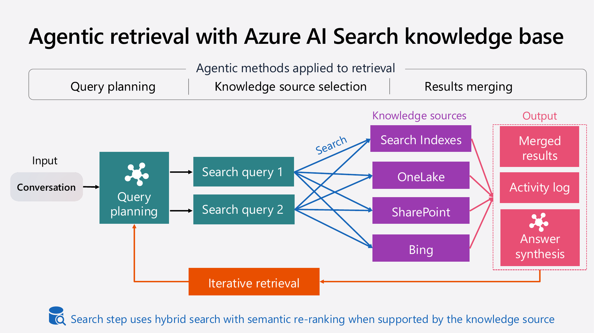

```
Agentic retrieval with Azure AI Search knowledge base
                                   Agentic methods applied to retrieval
           Query planning             Knowledge source selection               Results merging

                                                                     Knowledge sources            Output

                                                                       Search Indexes            Merged
   Input                                                                                         results
                                    Search query 1                        OneLake
Conversation                                                                                    Activity log
                   Query
                  planning          Search query 2                       SharePoint

                                                                                                  Answer
                                                                            Bing                 synthesis

                                     Iterative retrieval

           Search step uses hybrid search with semantic re-ranking when supported by the knowledge source
```

## Slide 29

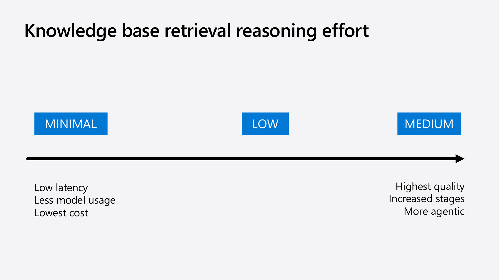

```
Knowledge base retrieval reasoning effort


   MINIMAL                 LOW                 MEDIUM


 Low latency                                  Highest quality
 Less model usage                           Increased stages
 Lowest cost                                   More agentic
```

## Slide 30

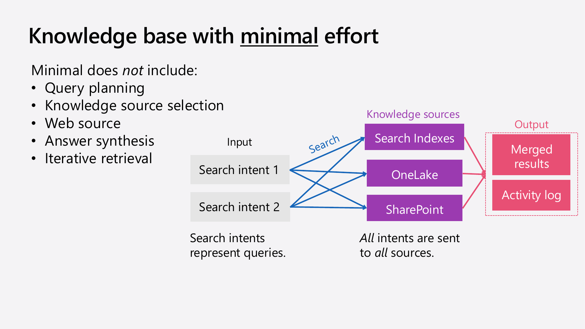

```
Knowledge base with minimal effort
Minimal does not include:
• Query planning
• Knowledge source selection
                                              Knowledge sources
• Web source                                                          Output
• Answer synthesis           Input             Search Indexes
                                                                     Merged
• Iterative retrieval                                                results
                         Search intent 1           OneLake
                                                                    Activity log
                         Search intent 2          SharePoint

                        Search intents       All intents are sent
                        represent queries.   to all sources.
```

## Slide 31

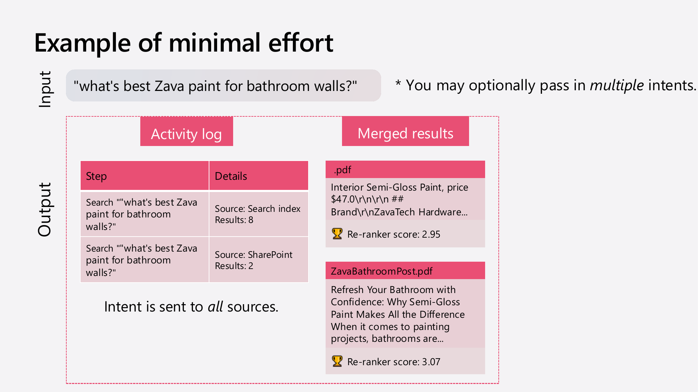

```
Example of minimal effort
Input
         "what's best Zava paint for bathroom walls?"                      * You may optionally pass in multiple intents.


                        Activity log                                Merged results

                                                             .pdf
          Step                        Details
                                                             Interior Semi-Gloss Paint, price


Output
          Search ""what's best Zava                          $47.0\r\n\r\n ##
                                      Source: Search index   Brand\r\nZavaTech Hardware...
          paint for bathroom
                                      Results: 8
          walls?"
                                                                Re-ranker score: 2.95
          Search ""what's best Zava
                                      Source: SharePoint
          paint for bathroom
                                      Results: 2
          walls?"                                            ZavaBathroomPost.pdf
                                                             Refresh Your Bathroom with
                                                             Confidence: Why Semi-Gloss
              Intent is sent to all sources.                 Paint Makes All the Difference
                                                             When it comes to painting
                                                             projects, bathrooms are...

                                                                Re-ranker score: 3.07
```

## Slide 32

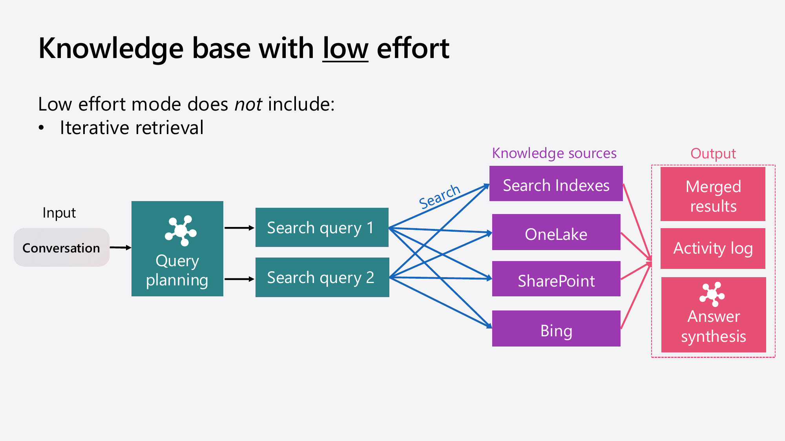

```
Knowledge base with low effort
  Low effort mode does not include:
  • Iterative retrieval
                                            Knowledge sources     Output

                                             Search Indexes      Merged
   Input                                                         results
                           Search query 1       OneLake
Conversation                                                    Activity log
                Query
               planning    Search query 2      SharePoint

                                                                  Answer
                                                  Bing           synthesis
```

## Slide 33

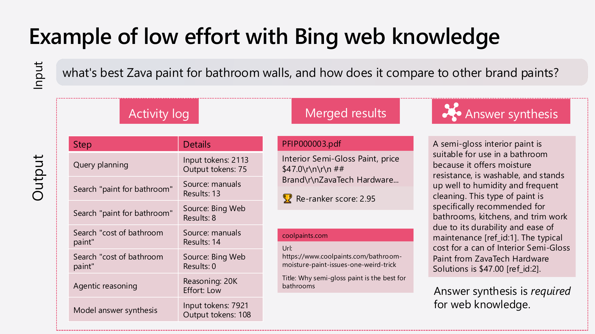

```
Example of low effort with Bing web knowledge
Input
         what's best Zava paint for bathroom walls, and how does it compare to other brand paints?


                           Activity log                             Merged results                                 Answer synthesis

          Step                          Details              PFIP000003.pdf                                A semi-gloss interior paint is
                                                                                                           suitable for use in a bathroom
                                        Input tokens: 2113   Interior Semi-Gloss Paint, price


Output
          Query planning
                                        Output tokens: 75    $47.0\r\n\r\n ##                              because it offers moisture
                                                                                                           resistance, is washable, and stands
                                        Source: manuals
                                                             Brand\r\nZavaTech Hardware...
          Search "paint for bathroom"                                                                      up well to humidity and frequent
                                        Results: 13                                                        cleaning. This type of paint is
                                                                 Re-ranker score: 2.95
                                        Source: Bing Web                                                   specifically recommended for
          Search "paint for bathroom"                                                                      bathrooms, kitchens, and trim work
                                        Results: 8
                                                                                                           due to its durability and ease of
          Search "cost of bathroom      Source: manuals      coolpaints.com
          paint"                        Results: 14
                                                                                                           maintenance [ref_id:1]. The typical
                                                             Url:                                          cost for a can of Interior Semi-Gloss
          Search "cost of bathroom      Source: Bing Web     https://www.coolpaints.com/bathroom-          Paint from ZavaTech Hardware
          paint"                        Results: 0           moisture-paint-issues-one-weird-trick
                                                                                                           Solutions is $47.00 [ref_id:2].
                                                             Title: Why semi-gloss paint is the best for
                                        Reasoning: 20K
          Agentic reasoning                                  bathrooms
                                        Effort: Low                                                        Answer synthesis is required
          Model answer synthesis
                                        Input tokens: 7921                                                 for web knowledge.
                                        Output tokens: 108
```

## Slide 34

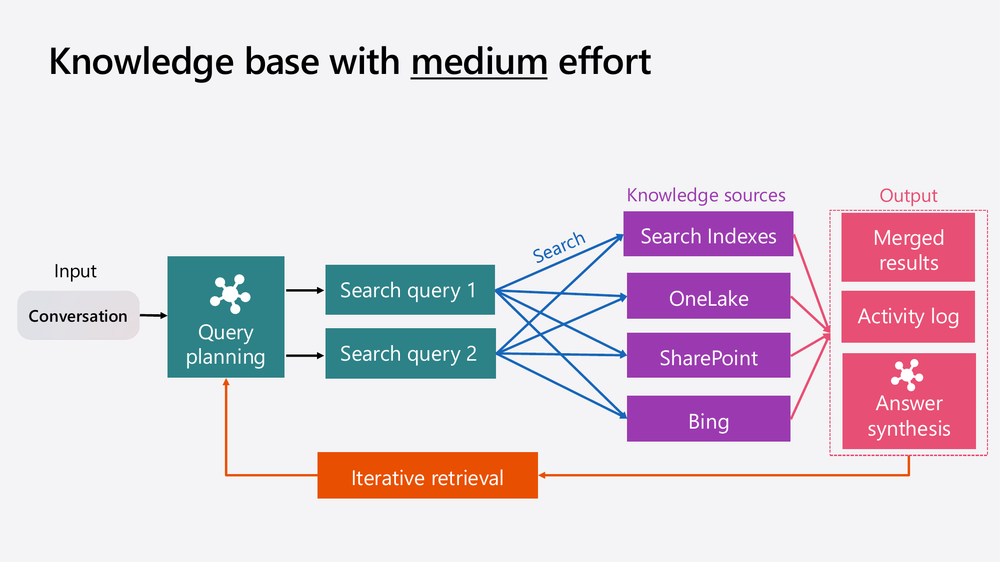

```
Knowledge base with medium effort


                                                 Knowledge sources     Output

                                                  Search Indexes      Merged
   Input                                                              results
                          Search query 1             OneLake
Conversation                                                         Activity log
                Query
               planning   Search query 2            SharePoint

                                                                       Answer
                                                       Bing           synthesis

                           Iterative retrieval
```

## Slide 35

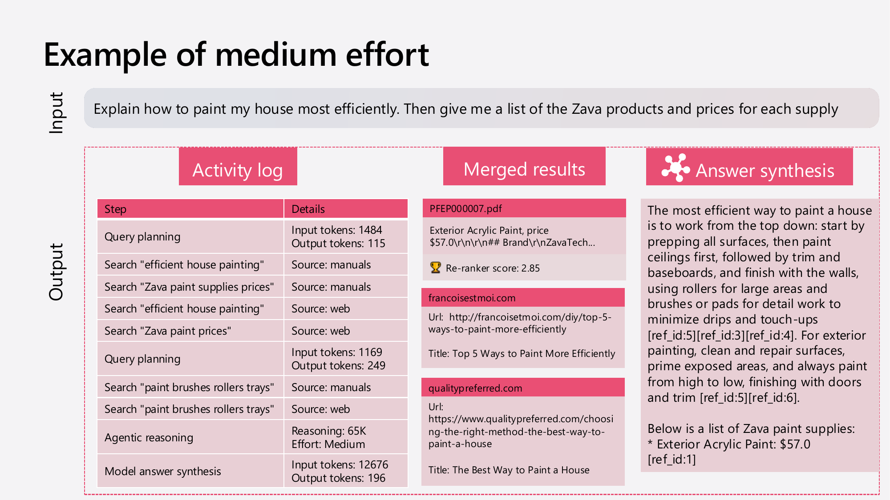

```
Example of medium effort
Input
         Explain how to paint my house most efficiently. Then give me a list of the Zava products and prices for each supply


                            Activity log                                       Merged results                                 Answer synthesis
          Step                                   Details               PFEP000007.pdf                                The most efficient way to paint a house
                                                 Input tokens: 1484    Exterior Acrylic Paint, price                 is to work from the top down: start by
          Query planning                                                                                             prepping all surfaces, then paint
                                                 Output tokens: 115    $57.0\r\n\r\n## Brand\r\nZavaTech...


Output
                                                                                                                     ceilings first, followed by trim and
          Search "efficient house painting"      Source: manuals          Re-ranker score: 2.85
                                                                                                                     baseboards, and finish with the walls,
          Search "Zava paint supplies prices"    Source: manuals                                                     using rollers for large areas and
                                                                       francoisestmoi.com
          Search "efficient house painting"      Source: web                                                         brushes or pads for detail work to
                                                                       Url: http://francoisetmoi.com/diy/top-5-      minimize drips and touch-ups
          Search "Zava paint prices"             Source: web           ways-to-paint-more-efficiently
                                                                                                                     [ref_id:5][ref_id:3][ref_id:4]. For exterior
                                                 Input tokens: 1169    Title: Top 5 Ways to Paint More Efficiently   painting, clean and repair surfaces,
          Query planning
                                                 Output tokens: 249                                                  prime exposed areas, and always paint
          Search "paint brushes rollers trays"   Source: manuals       qualitypreferred.com
                                                                                                                     from high to low, finishing with doors
                                                                                                                     and trim [ref_id:5][ref_id:6].
          Search "paint brushes rollers trays"   Source: web           Url:
                                                                       https://www.qualitypreferred.com/choosi
                                                 Reasoning: 65K        ng-the-right-method-the-best-way-to-          Below is a list of Zava paint supplies:
          Agentic reasoning
                                                 Effort: Medium        paint-a-house                                 * Exterior Acrylic Paint: $57.0
                                                 Input tokens: 12676                                                 [ref_id:1]
          Model answer synthesis                                       Title: The Best Way to Paint a House
                                                 Output tokens: 196
```

## Slide 36

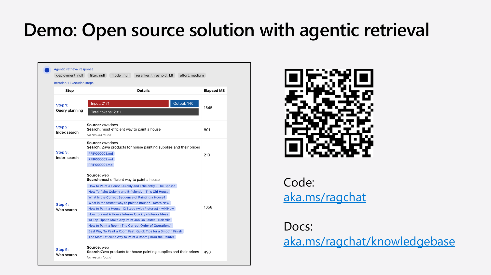

```
Demo: Open source solution with agentic retrieval


                               Code:
                               aka.ms/ragchat

                               Docs:
                               aka.ms/ragchat/knowledgebase
```

## Slide 37


```
Get Started with Azure AI Search
                  aka.ms/AISearch-new

Learn more
                  Foundry IQ Public Preview
Azure AI Search   aka.ms/FoundryIQ


                  GitHub Sample – Quickstart
                  aka.ms/AISearch-ar-pyn
```

## Slide 38


```
What's next?
```

## Slide 39

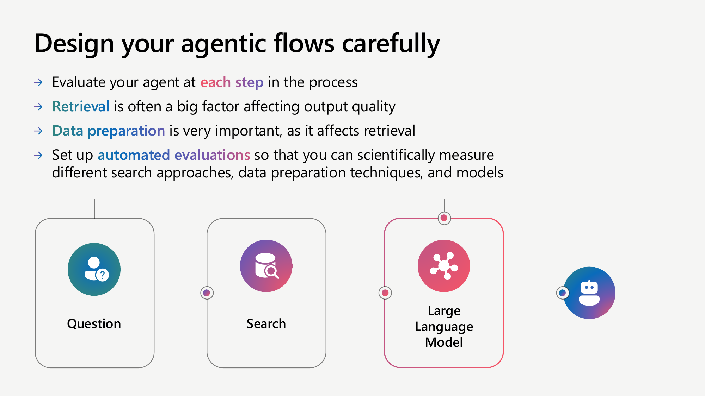

```
Design your agentic flows carefully
 Evaluate your agent at each step in the process
 Retrieval is often a big factor affecting output quality
 Data preparation is very important, as it affects retrieval
 Set up automated evaluations so that you can scientifically measure
 different search approaches, data preparation techniques, and models


                                                              Large
   Question                     Search                      Language
                                                              Model
```

## Slide 40


```
Thank you!

 Download code and slides
```

## Slide 41


```
Q&A
```

## Slide 42


```
Download today’s
presentation
aka.ms/MicrosoftAITour/BRK444

…or scan the QR code.
                                Scan QR code to download
```

## Slide 43


```
Next steps to advance
your AI expertise


 aka.ms/CreateAgenticAISolutions   aka.ms/BRK444GHrepo
```
