# Host your agents on Foundry: Microsoft Agent Framework

📺 [Watch the full recording on YouTube](https://www.youtube.com/watch?v=8N7q0Ucr3rw) |
📑 [Download the slides (PDF)](https://aka.ms/foundryhosted/slides/agentframework)

This write-up includes an annotated version of the presentation slides with timestamps to the video plus a summary of the live Q&A session.

## Table of contents

- [Session description](#session-description)
- [Annotated slides](#annotated-slides)
  - [Overview of the "Host your agents on Foundry" series](#overview-of-the-host-your-agents-on-foundry-series)
  - [Host your agents on Foundry: Microsoft Agent Framework](#host-your-agents-on-foundry-microsoft-agent-framework)
  - [Today's agenda](#todays-agenda)
  - [Following along with the GitHub repo](#following-along-with-the-github-repo)
  - [Agents 101](#agents-101)
  - [What is an agent](#what-is-an-agent)
  - [The agentic loop in action](#the-agentic-loop-in-action)
  - [Python AI agent frameworks](#python-ai-agent-frameworks)
  - [Microsoft Agent Framework](#microsoft-agent-framework)
  - [Installing Agent Framework for Python](#installing-agent-framework-for-python)
  - [A simple local agent with tools](#a-simple-local-agent-with-tools)
  - [Building agents on Foundry](#building-agents-on-foundry)
  - [Ship AI faster with Microsoft Foundry](#ship-ai-faster-with-microsoft-foundry)
  - [Foundry Models](#foundry-models)
  - [An agent with Foundry models](#an-agent-with-foundry-models)
  - [Foundry IQ](#foundry-iq)
  - [Adding Foundry IQ as MCP tool](#adding-foundry-iq-as-mcp-tool)
  - [Foundry Tools](#foundry-tools)
  - [Creating a toolbox from code](#creating-a-toolbox-from-code)
  - [Equipping the agent with the toolbox](#equipping-the-agent-with-the-toolbox)
  - [Foundry Agent Service](#foundry-agent-service)
  - [Hosted MAF agents: architecture](#hosted-maf-agents-architecture)
  - [Hosted MAF agents: ResponsesHostServer](#hosted-maf-agents-responseshostserver)
  - [A Foundry hosted MAF agent](#a-foundry-hosted-maf-agent)
  - [Deploying with azd](#deploying-with-azd)
  - [Interacting with the agent in the playground](#interacting-with-the-agent-in-the-playground)
  - [Interacting with the agent from code](#interacting-with-the-agent-from-code)
  - [Local development loop](#local-development-loop)
  - [Observability](#observability)
  - [Observability with OpenTelemetry](#observability-with-opentelemetry)
  - [Using OpenTelemetry with Agent Framework](#using-opentelemetry-with-agent-framework)
  - [Exporting OTel to App Insights](#exporting-otel-to-app-insights)
  - [Viewing agent traces in Foundry](#viewing-agent-traces-in-foundry)
  - [Viewing agent traces in App Insights](#viewing-agent-traces-in-app-insights)
  - [Multi-agent workflows](#multi-agent-workflows)
  - [What's a workflow](#whats-a-workflow)
  - [Building workflows in Agent Framework](#building-workflows-in-agent-framework)
  - [A simple workflow](#a-simple-workflow)
  - [Using agents inside workflows](#using-agents-inside-workflows)
  - [Using a workflow as an agent](#using-a-workflow-as-an-agent)
  - [A Foundry hosted MAF workflow](#a-foundry-hosted-maf-workflow)
  - [Next steps and resources](#next-steps-and-resources)
- [Live Chat Q&A](#live-chat-qa)
- [Discord OH Q&A](#discord-oh-qa)

## Session description

In this three-part series, we showed how to host your own agents on Microsoft Foundry.

In the first session, we deployed agents built with Microsoft Agent Framework (the successor of AutoGen and Semantic Kernel).

Starting with a simple agent, we added Foundry tools like Code Interpreter, grounded the agent in enterprise data with Foundry IQ, and finally deployed multi-agent workflows.

Along the way, we used the Foundry UI to interact with the hosted agent, testing it out in the playground and observing the traces from the reasoning and tool calls.

## Annotated slides

### Overview of the "Host your agents on Foundry" series


[Watch from 01:24](https://www.youtube.com/watch?v=8N7q0Ucr3rw&t=84s)

This is a three-part live stream series on hosting Python agents on Microsoft Foundry. Session 1 (Apr 27) uses Microsoft Agent Framework, session 2 (Apr 29) covers LangChain and LangGraph, and session 3 (Apr 30) addresses quality and safety evaluations. Register and watch past recordings at [aka.ms/AgentsOnFoundry/series](https://aka.ms/AgentsOnFoundry/series).

### Host your agents on Foundry: Microsoft Agent Framework

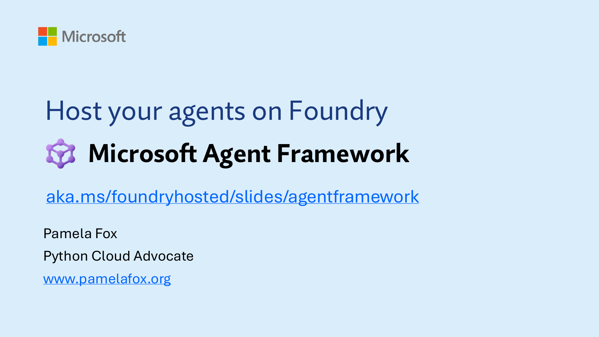
[Watch from 03:17](https://www.youtube.com/watch?v=8N7q0Ucr3rw&t=197s)

Session slides are available at [aka.ms/foundryhosted/slides/agentframework](https://aka.ms/foundryhosted/slides/agentframework).

### Today's agenda

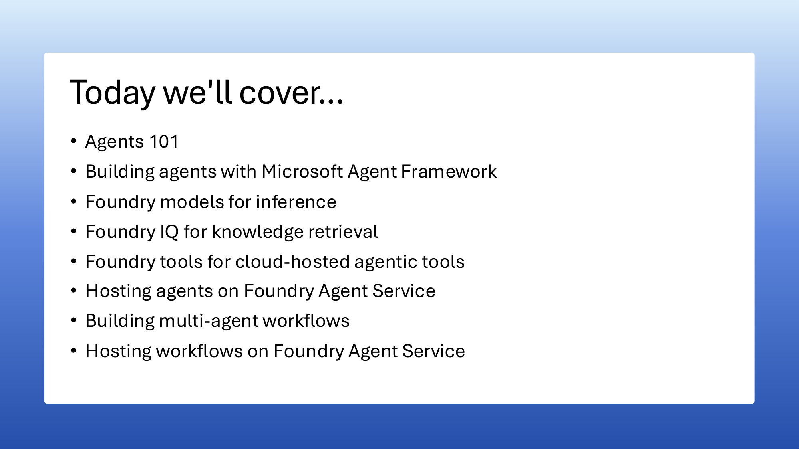
[Watch from 03:31](https://www.youtube.com/watch?v=8N7q0Ucr3rw&t=211s)

The session covers Agents 101, building agents with Microsoft Agent Framework, Foundry Models for inference, Foundry IQ for knowledge retrieval, Foundry Tools for cloud-hosted agentic tools, hosting agents on Foundry Agent Service, and building and hosting multi-agent workflows.

### Following along with the GitHub repo

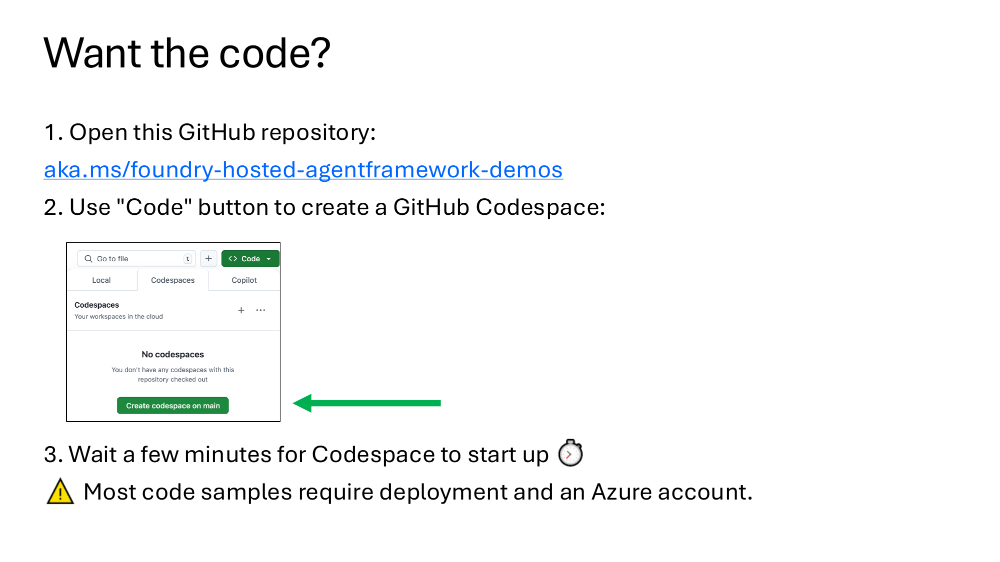
[Watch from 04:13](https://www.youtube.com/watch?v=8N7q0Ucr3rw&t=253s)

All code samples are in the GitHub repository at [aka.ms/foundry-hosted-agentframework-demos](https://aka.ms/foundry-hosted-agentframework-demos). Open it in a GitHub Codespace using the "Code" button, then follow the README to deploy to your own Azure account. All infrastructure, scripts, and code needed to run the samples on Foundry are included.

### Agents 101


[Watch from 05:22](https://www.youtube.com/watch?v=8N7q0Ucr3rw&t=322s)

### What is an agent


[Watch from 05:26](https://www.youtube.com/watch?v=8N7q0Ucr3rw&t=326s)

An AI agent uses an LLM to run tools in a loop to achieve a goal. The loop is what makes agents powerful: the LLM can call one tool or twenty, depending on the complexity of the problem. Agents are commonly augmented with short- or long-term memory, an explicit planning step (or a reasoning model with built-in planning), and human-in-the-loop checkpoints where the agent pauses to ask for input. For a deeper dive into agentic patterns, the previous Python + Agents series is at [aka.ms/pythonagents/rewatch](https://aka.ms/pythonagents/rewatch).

### The agentic loop in action

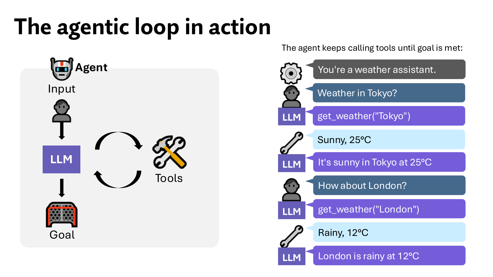
[Watch from 06:57](https://www.youtube.com/watch?v=8N7q0Ucr3rw&t=417s)

When the user asks a weather assistant "What's the weather in Tokyo?", the LLM selects `get_weather("Tokyo")`, receives the result, and responds. When the user follows up with "How about London?", the LLM calls the tool again for London and responds with that result. The agent keeps calling tools until the goal is met.

### Python AI agent frameworks

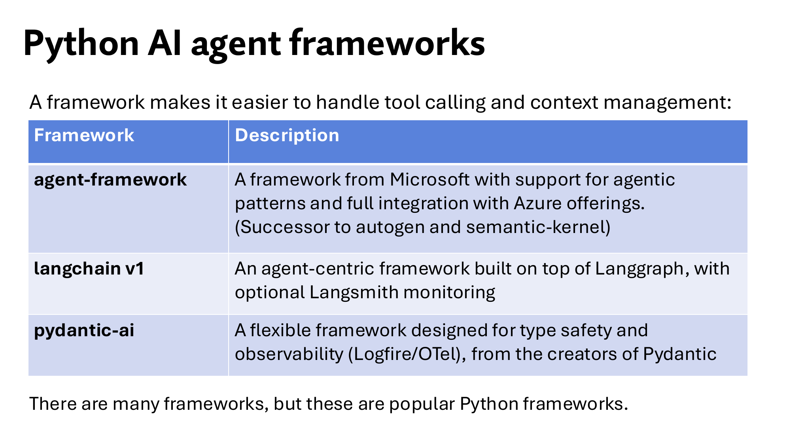
[Watch from 07:40](https://www.youtube.com/watch?v=8N7q0Ucr3rw&t=460s)

Using an agent framework rather than raw LLM calls handles tool-call parsing, context window management, and the agentic loop automatically. Three popular Python frameworks are:

- **agent-framework** — Microsoft's framework, successor to AutoGen and Semantic Kernel, with agentic patterns and full Azure integration.
- **langchain v1** — An agent-centric framework built on LangGraph with optional LangSmith monitoring.
- **pydantic-ai** — Designed for type safety and observability (Logfire/OTel), from the creators of Pydantic.

### Microsoft Agent Framework

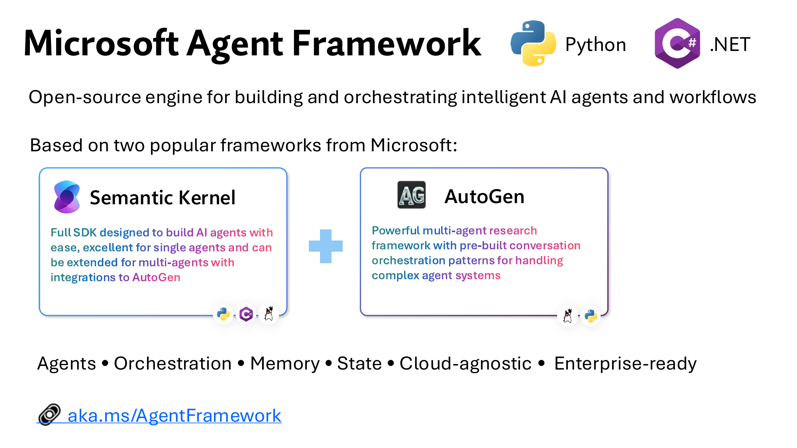
[Watch from 09:00](https://www.youtube.com/watch?v=8N7q0Ucr3rw&t=540s)

Microsoft Agent Framework is an open-source engine available in Python and .NET for building and orchestrating intelligent AI agents and workflows. It merges two previously separate frameworks: Semantic Kernel (enterprise-focused single-agent SDK) and AutoGen (research-focused multi-agent orchestration). The core package is now generally available. Find it at [aka.ms/AgentFramework](https://aka.ms/AgentFramework).

### Installing Agent Framework for Python

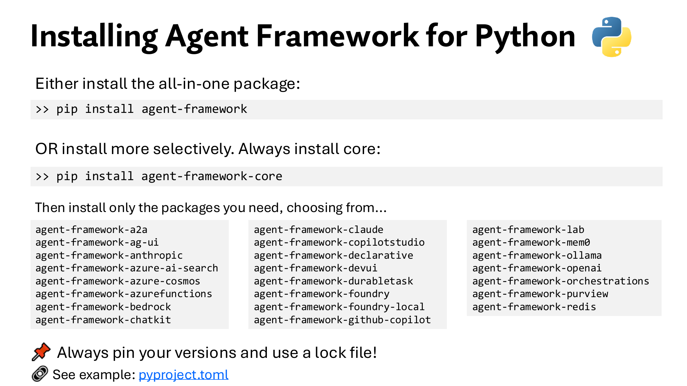
[Watch from 10:17](https://www.youtube.com/watch?v=8N7q0Ucr3rw&t=617s)

Install the all-in-one `agent-framework` package for exploration, or be more selective in production: always install `agent-framework-core` and then only the sub-packages you need (e.g., `agent-framework-foundry`, `agent-framework-openai`, `agent-framework-ollama`). Always pin versions and use a lock file. With uv, `pyproject.toml` specifies minimum versions and `uv.lock` pins the exact versions, so upgrades are explicit and intentional—critical for avoiding supply-chain vulnerabilities.

### A simple local agent with tools

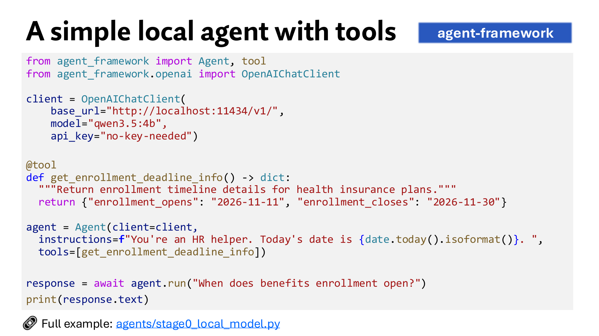
[Watch from 13:15](https://www.youtube.com/watch?v=8N7q0Ucr3rw&t=795s)

The simplest MAF agent uses `OpenAIChatClient` pointed at a local Ollama endpoint (e.g., `http://localhost:11434/v1/`) and a Python function decorated with `@tool`. Agent Framework uses the function name, return type, and docstring to describe the tool to the LLM. The agent is created with a client, a system-prompt `instructions` string, and a `tools` list, then run with `await agent.run(query)`. Full example: [agents/stage0_local_model.py](https://github.com/Azure-Samples/foundry-hosted-agentframework-demos/blob/main/agents/stage0_local_model.py).

### Building agents on Foundry

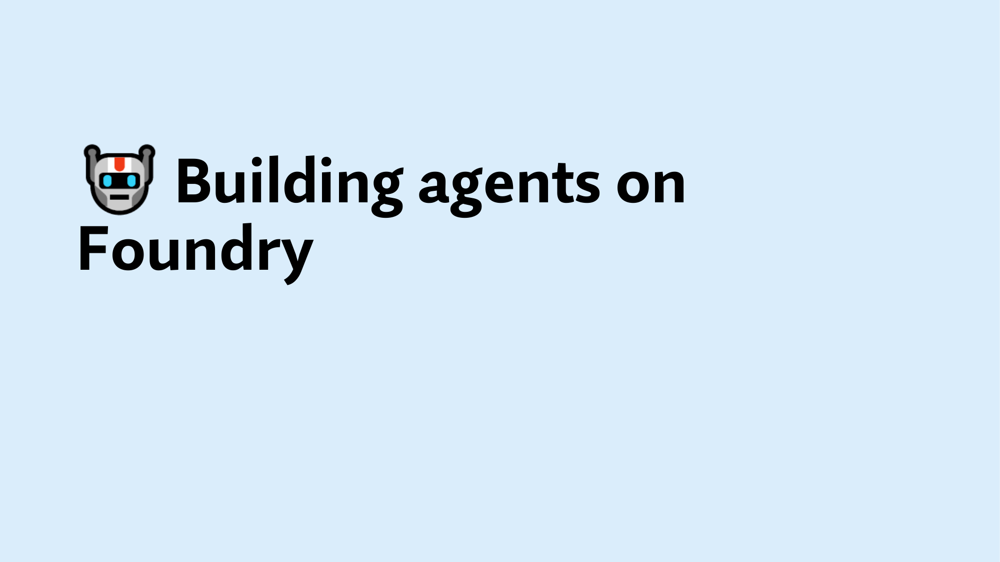
[Watch from 15:59](https://www.youtube.com/watch?v=8N7q0Ucr3rw&t=959s)

### Ship AI faster with Microsoft Foundry

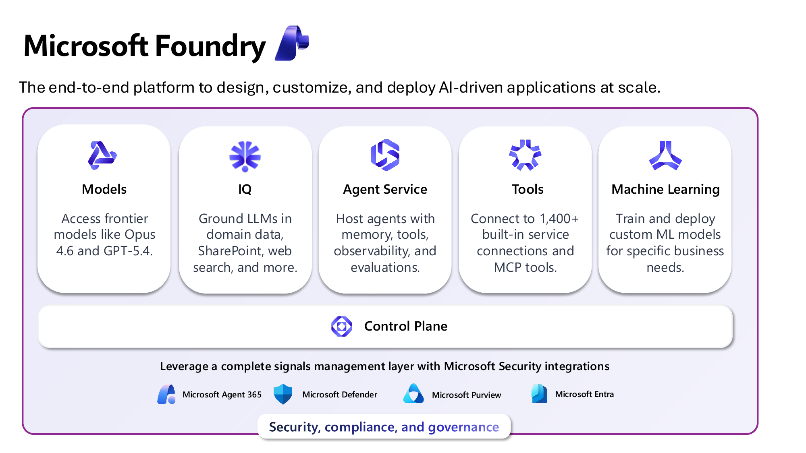
[Watch from 16:26](https://www.youtube.com/watch?v=8N7q0Ucr3rw&t=986s)

Microsoft Foundry is the end-to-end platform for designing, customizing, and deploying AI-driven applications. Key components used in this session:

- **Models** — Frontier models such as GPT-4.1 and Claude Opus 4.6.
- **IQ** — Ground LLMs in domain data from SharePoint, OneLake, web search, and more.
- **Agent Service** — Host agents with memory, tools, observability, and evaluations.
- **Tools** — 1,400+ built-in service connections and MCP tools.

Security, compliance, and governance flow through Microsoft Entra, Defender, and Purview.

### Foundry Models

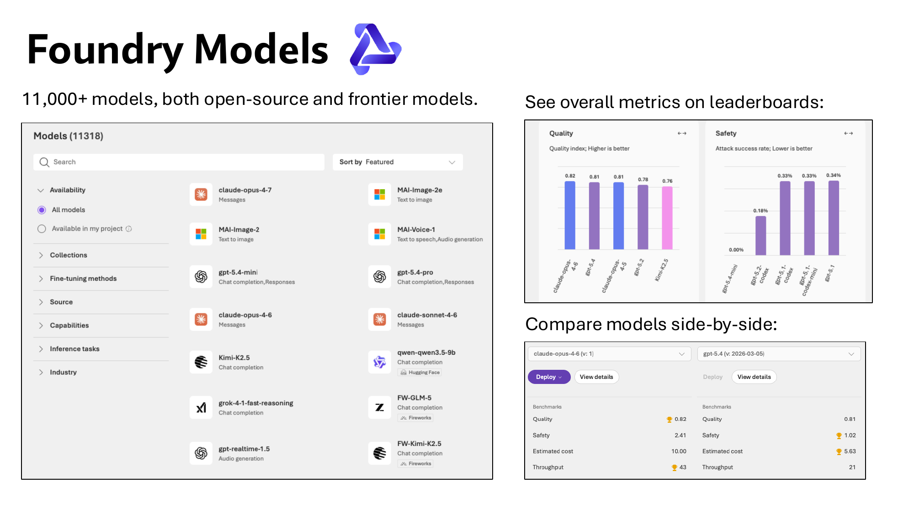
[Watch from 17:09](https://www.youtube.com/watch?v=8N7q0Ucr3rw&t=1029s)

Foundry exposes 11,000+ models, including open-source models from Hugging Face and frontier models from OpenAI, Anthropic, Mistral, and others. From the **Discover > Models** tab you can search, view quality and safety leaderboards, and compare models side by side—useful when evaluating whether a new release (like GPT-5) is worth switching to.

### An agent with Foundry models

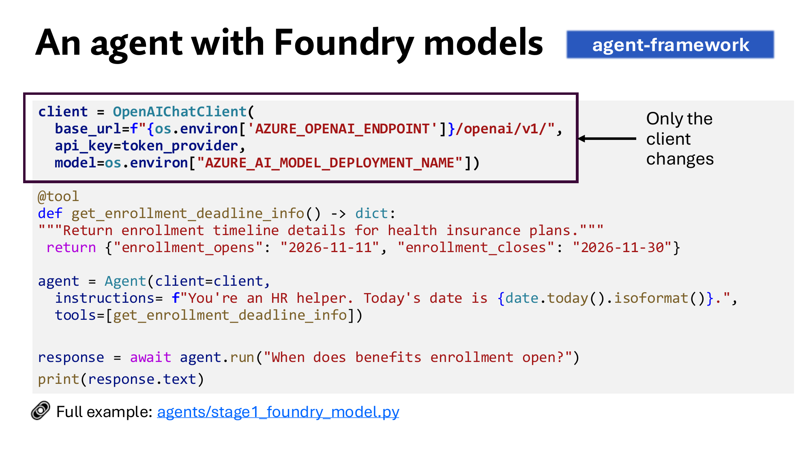
[Watch from 19:48](https://www.youtube.com/watch?v=8N7q0Ucr3rw&t=1188s)

Switching from a local SLM to a Foundry-deployed model requires only one change: point `OpenAIChatClient` at the Azure OpenAI endpoint and pass an Entra token provider for keyless auth. Everything else—tools, agent creation, `agent.run()`—stays the same.

```python
client = OpenAIChatClient(
    base_url=f"{os.environ['AZURE_OPENAI_ENDPOINT']}/openai/v1/",
    api_key=token_provider,
    model=os.environ["AZURE_AI_MODEL_DEPLOYMENT_NAME"])
```

Full example: [agents/stage1_foundry_model.py](https://github.com/Azure-Samples/foundry-hosted-agentframework-demos/blob/main/agents/stage1_foundry_model.py).

### Foundry IQ

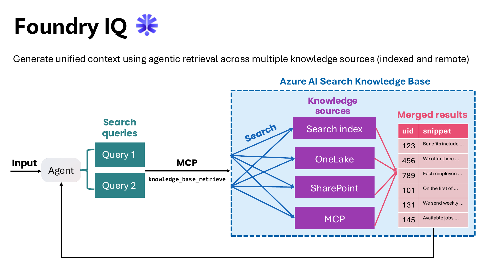
[Watch from 21:20](https://www.youtube.com/watch?v=8N7q0Ucr3rw&t=1280s)

Foundry IQ is Azure AI Search's agentic knowledge base, accessible through Foundry. The agent sends queries to the knowledge base, which fans them out across multiple knowledge sources—Azure AI Search indexes, OneLake, SharePoint, and (in private preview) arbitrary MCP servers. Results from all sources are merged using a semantic ranker and returned to the agent as unified context. The knowledge base is exposed to the agent as an MCP tool called `knowledge_base_retrieve`.

### Adding Foundry IQ as MCP tool

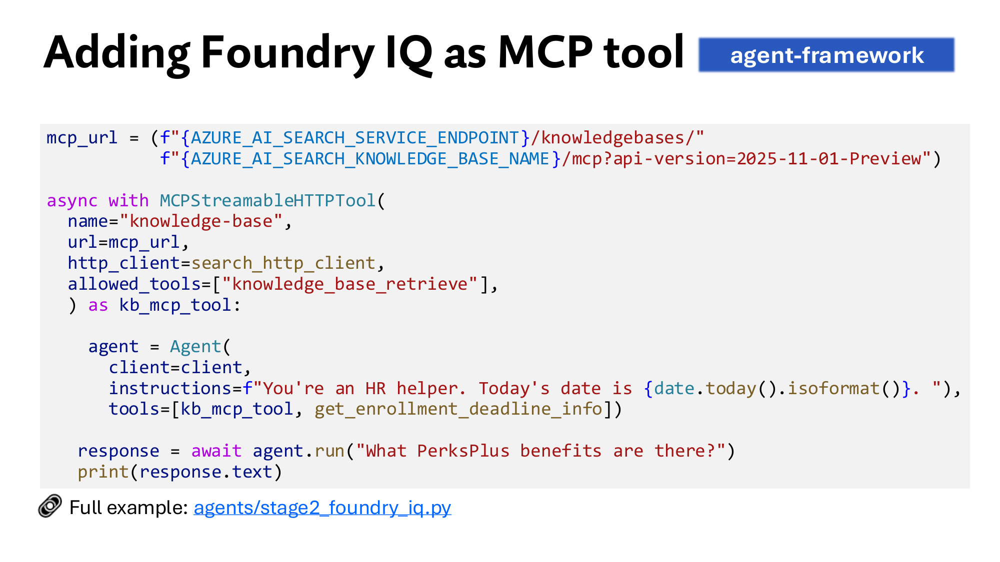
[Watch from 23:23](https://www.youtube.com/watch?v=8N7q0Ucr3rw&t=1403s)

Connect the agent to Foundry IQ using `MCPStreamableHTTPTool` from Agent Framework. The MCP URL follows the pattern `{AZURE_AI_SEARCH_SERVICE_ENDPOINT}/knowledgebases/{KNOWLEDGE_BASE_NAME}/mcp?api-version=2025-11-01-Preview`. Pass an authenticated `http_client` and restrict to the `knowledge_base_retrieve` tool. Add it alongside any local tools:

```python
async with MCPStreamableHTTPTool(
    name="knowledge-base",
    url=mcp_url,
    http_client=search_http_client,
    allowed_tools=["knowledge_base_retrieve"]) as kb_mcp_tool:

    agent = Agent(client=client, instructions=...,
                  tools=[kb_mcp_tool, get_enrollment_deadline_info])
```

When the agent starts up, it does an MCP handshake to discover available tools, adding some overhead. Once connected, it decides each turn which tool to call. Full example: [agents/stage2_foundry_iq.py](https://github.com/Azure-Samples/foundry-hosted-agentframework-demos/blob/main/agents/stage2_foundry_iq.py).

### Foundry Tools

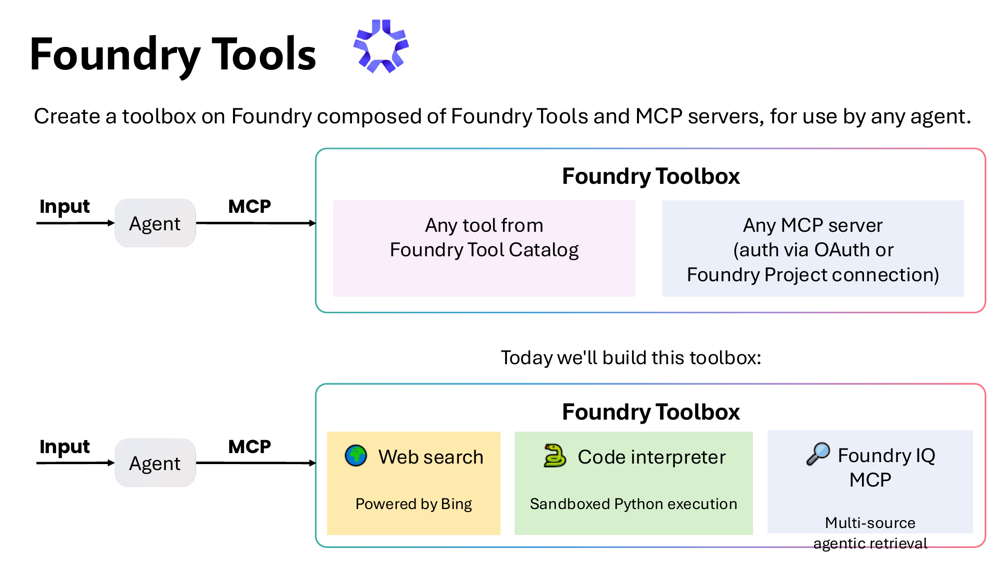
[Watch from 26:54](https://www.youtube.com/watch?v=8N7q0Ucr3rw&t=1614s)

Foundry Tools lets you build a **Foundry Toolbox**—a named collection of tools from the Foundry Tool Catalog and MCP servers. Any agent can then reference the toolbox as a single MCP endpoint rather than wiring up tools individually. Useful built-in tools:

- **Web search** — Bing-powered real-time web search.
- **Code interpreter** — Sandboxed Python execution for math, data analysis, and image manipulation.
- **Foundry IQ** — The knowledge base MCP server.

### Creating a toolbox from code

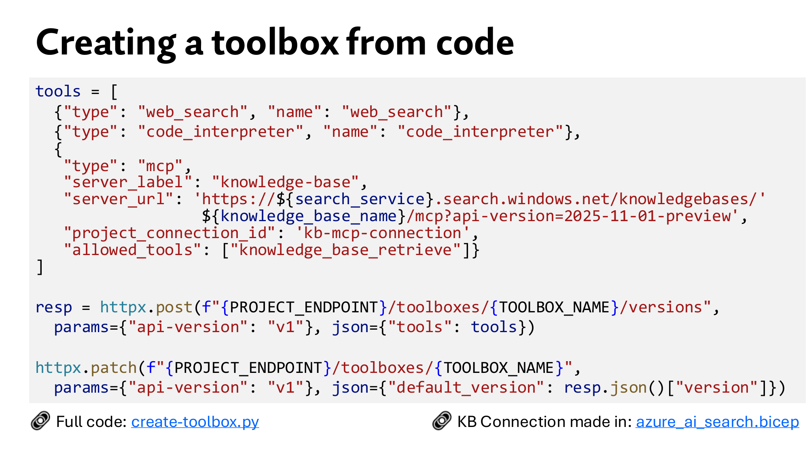
[Watch from 28:44](https://www.youtube.com/watch?v=8N7q0Ucr3rw&t=1724s)

The Foundry Toolbox API is new and currently only available via REST. Create a toolbox by POSTing a list of tool definitions to the toolboxes endpoint, then PATCH to set it as the default version:

```python
tools = [
    {"type": "web_search", "name": "web_search"},
    {"type": "code_interpreter", "name": "code_interpreter"},
    {"type": "mcp", "server_label": "knowledge-base",
     "server_url": "https://${search_service}.search.windows.net/knowledgebases/...",
     "project_connection_id": "kb-mcp-connection",
     "allowed_tools": ["knowledge_base_retrieve"]}
]
resp = httpx.post(f"{PROJECT_ENDPOINT}/toolboxes/{TOOLBOX_NAME}/versions", ...)
httpx.patch(f"{PROJECT_ENDPOINT}/toolboxes/{TOOLBOX_NAME}", ...,
            json={"default_version": resp.json()["version"]})
```

The knowledge base project connection is defined in `azure_ai_search.bicep`. Full code: [infra/create-toolbox.py](https://github.com/Azure-Samples/foundry-hosted-agentframework-demos/blob/main/infra/create-toolbox.py).

### Equipping the agent with the toolbox

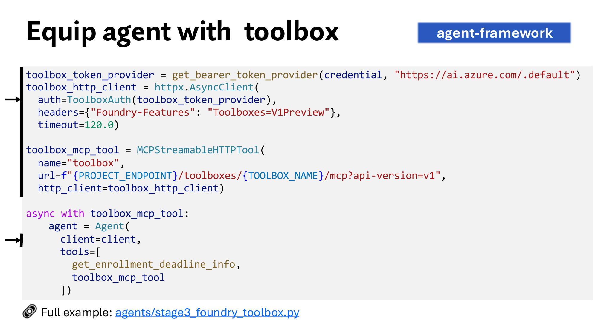
[Watch from 29:30](https://www.youtube.com/watch?v=8N7q0Ucr3rw&t=1770s)

The toolbox itself exposes all its tools via an MCP endpoint, so the agent treats it exactly like any other `MCPStreamableHTTPTool`. Authenticate with `ToolboxAuth` and the Foundry scope, then pass a `Foundry-Features` header to enable the toolbox preview:

```python
toolbox_mcp_tool = MCPStreamableHTTPTool(
    name="toolbox",
    url=f"{PROJECT_ENDPOINT}/toolboxes/{TOOLBOX_NAME}/mcp?api-version=v1",
    http_client=toolbox_http_client)
```

The agent can now call web search, code interpreter, or the IQ knowledge base through one tool. Full example: [agents/stage3_foundry_toolbox.py](https://github.com/Azure-Samples/foundry-hosted-agentframework-demos/blob/main/agents/stage3_foundry_toolbox.py).

### Foundry Agent Service

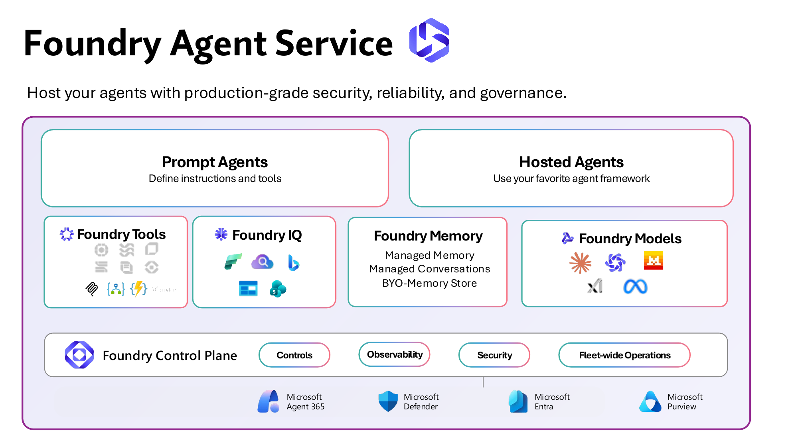
[Watch from 32:12](https://www.youtube.com/watch?v=8N7q0Ucr3rw&t=1932s)

Foundry Agent Service hosts agents with production-grade security, reliability, and governance. It supports two agent types:

- **Prompt agents** — Defined by instructions and tools, using Foundry's built-in agentic loop.
- **Hosted agents** — Bring your own agent framework (MAF, LangChain, etc.) packaged as a container.

Both types can use Foundry Tools, IQ, Memory (managed conversations and BYO-memory stores), and Models. The control plane provides observability, security (Entra, Defender, Purview), and fleet-wide operations.

### Hosted MAF agents: architecture

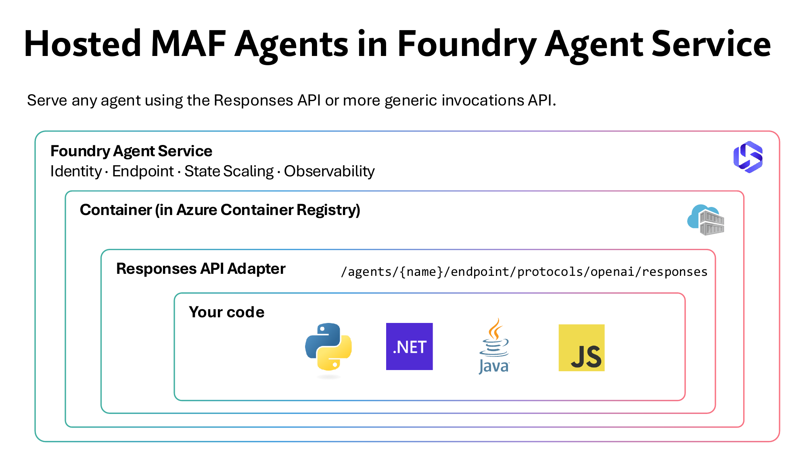
[Watch from 33:31](https://www.youtube.com/watch?v=8N7q0Ucr3rw&t=2011s)

A hosted agent runs inside a container in Azure Container Registry. Foundry Agent Service pulls the container and runs it on a fast microVM platform (released the week before this session) that provides low startup latency and strong session isolation. The Responses API adapter sits in front of the agent code and exposes the endpoint:

```
/agents/{name}/endpoint/protocols/openai/responses
```

Using the Responses API (based on the OpenAI Responses API spec) unlocks more Foundry functionality than the more generic invocations API.

### Hosted MAF agents: ResponsesHostServer

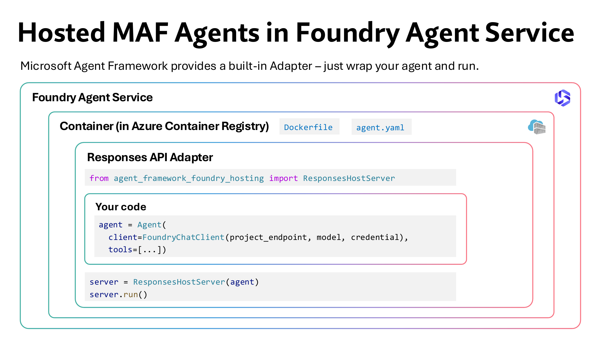
[Watch from 35:37](https://www.youtube.com/watch?v=8N7q0Ucr3rw&t=2137s)

Agent Framework provides `ResponsesHostServer` in the `agent_framework_foundry_hosting` package. It handles the Responses API adapter automatically—just wrap the agent and call `server.run()`. The container also needs a `Dockerfile` that runs the Python file and an `agent.yaml` that declares the agent name, protocol, and resource requirements.

### A Foundry hosted MAF agent

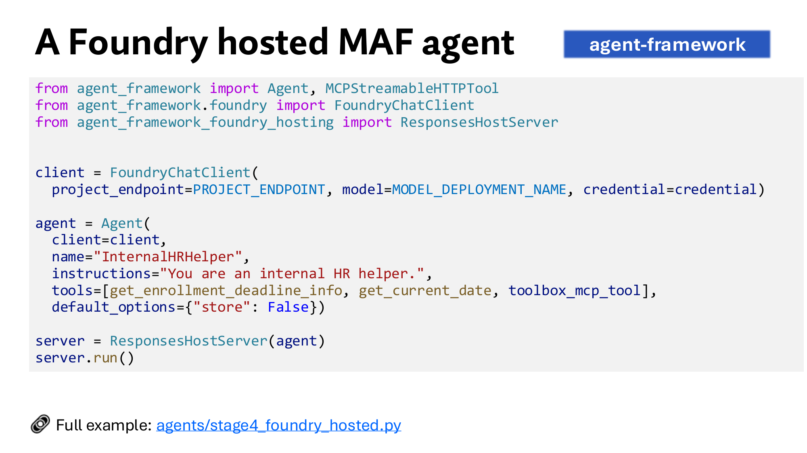
[Watch from 36:37](https://www.youtube.com/watch?v=8N7q0Ucr3rw&t=2197s)

The full hosted agent code uses `FoundryChatClient` (which handles the Foundry project endpoint and model lookup) rather than `OpenAIChatClient`, then wraps the agent in `ResponsesHostServer`:

```python
from agent_framework.foundry import FoundryChatClient
from agent_framework_foundry_hosting import ResponsesHostServer

client = FoundryChatClient(
    project_endpoint=PROJECT_ENDPOINT,
    model=MODEL_DEPLOYMENT_NAME,
    credential=credential)

agent = Agent(client=client, name="InternalHRHelper",
              instructions="You are an internal HR helper.",
              tools=[get_enrollment_deadline_info, get_current_date, toolbox_mcp_tool],
              default_options={"store": False})

server = ResponsesHostServer(agent)
server.run()
```

Full example: [agents/stage4_foundry_hosted.py](https://github.com/Azure-Samples/foundry-hosted-agentframework-demos/blob/main/agents/stage4_foundry_hosted.py).

### Deploying with azd

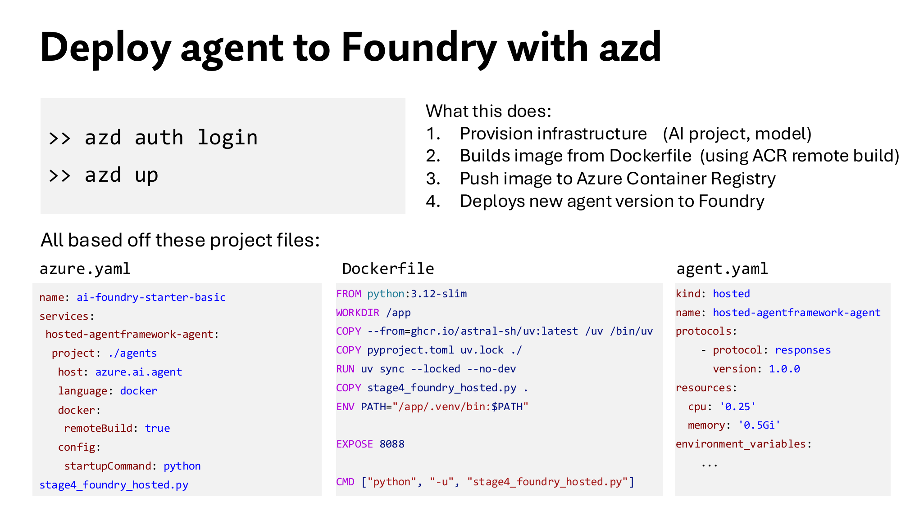
[Watch from 36:59](https://www.youtube.com/watch?v=8N7q0Ucr3rw&t=2219s)

`azd up` provisions infrastructure (AI project, model deployments), builds the Docker image using ACR remote build, pushes it to Azure Container Registry, and deploys a new agent version to Foundry. Three config files drive the deployment:

- **`azure.yaml`** — Lists services; each hosted agent entry specifies the project folder, host (`azure.ai.agent`), language (`docker`), and `remoteBuild: true`.
- **`Dockerfile`** — Standard Python slim container using uv for dependency installation; runs the agent file on startup.
- **`agent.yaml`** — Declares the agent name, `responses` protocol, CPU/memory resources for the microVM, and any environment variables to inject.

After deployment, `azd up` prints a direct link to try the agent in the Foundry playground.

### Interacting with the agent in the playground

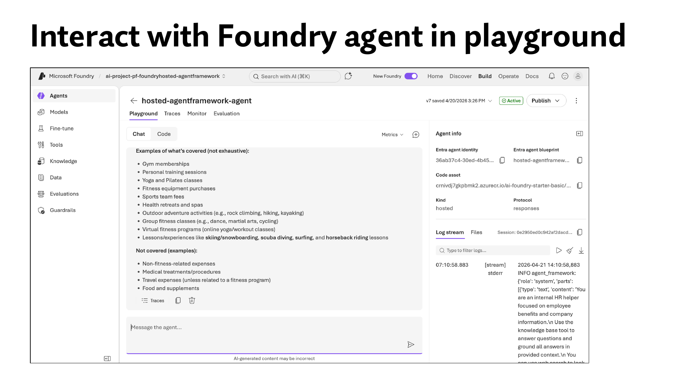
[Watch from 39:10](https://www.youtube.com/watch?v=8N7q0Ucr3rw&t=2350s)

The Foundry playground lets you chat with the deployed agent and watch a live log stream from the microVM container. The log stream shows every tool call and LLM request in real time—a significant improvement over hunting through Azure logs.

### Interacting with the agent from code

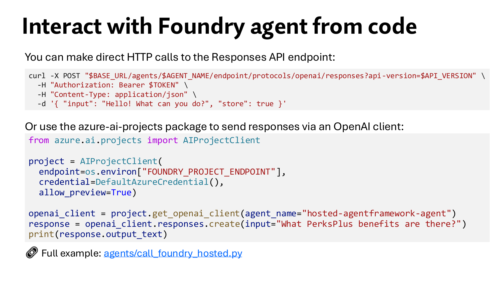
[Watch from 39:53](https://www.youtube.com/watch?v=8N7q0Ucr3rw&t=2393s)

Call the hosted agent via direct HTTP or the `azure-ai-projects` SDK. With the SDK, use `project.get_openai_client(agent_name=...)` to get an OpenAI-compatible client, then call `responses.create()`:

```python
from azure.ai.projects import AIProjectClient

project = AIProjectClient(endpoint=os.environ["FOUNDRY_PROJECT_ENDPOINT"],
                          credential=DefaultAzureCredential(), allow_preview=True)
openai_client = project.get_openai_client(agent_name="hosted-agentframework-agent")
response = openai_client.responses.create(input="What PerksPlus benefits are there?")
print(response.output_text)
```

Any client that can call the OpenAI Responses API—raw HTTP, the OpenAI SDK, or the Azure AI Projects SDK—works with hosted agents. Full example: [agents/call_foundry_hosted.py](https://github.com/Azure-Samples/foundry-hosted-agentframework-demos/blob/main/agents/call_foundry_hosted.py).

### Local development loop

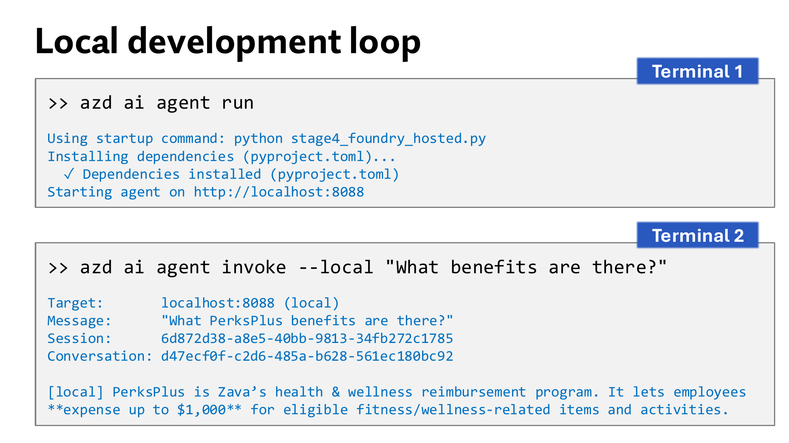
[Watch from 41:01](https://www.youtube.com/watch?v=8N7q0Ucr3rw&t=2461s)

Test the hosted agent locally before deploying. `azd ai agent run` starts the `ResponsesHostServer` locally on port 8088 using the same startup command that the container uses. `azd ai agent invoke --local` sends a message to that local server, giving the same experience as the deployed agent:

```
>> azd ai agent run
Starting agent on http://localhost:8088

>> azd ai agent invoke --local "What benefits are there?"
[local] PerksPlus is Zava's health & wellness reimbursement program...
```

Deploys on the new platform are also very fast, so the iteration cycle is short even when pushing to Foundry.

### Observability


[Watch from 42:09](https://www.youtube.com/watch?v=8N7q0Ucr3rw&t=2529s)

### Observability with OpenTelemetry

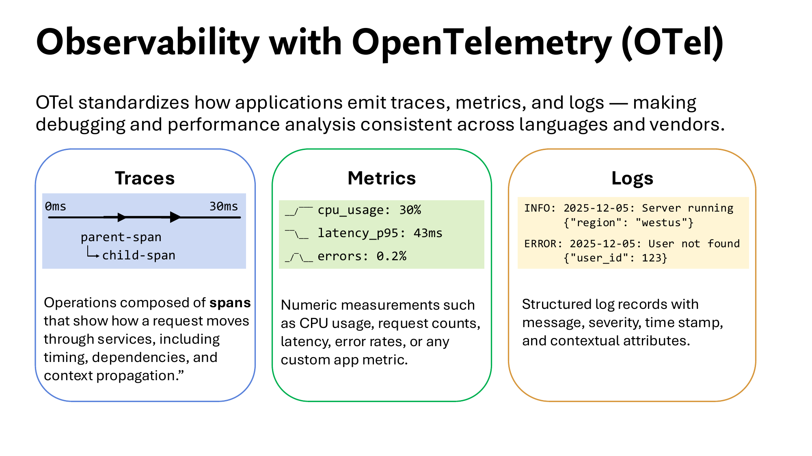
[Watch from 42:20](https://www.youtube.com/watch?v=8N7q0Ucr3rw&t=2540s)

OpenTelemetry (OTel) is the open standard for application observability across languages and vendors. It covers three signal types:

- **Traces** — Parent/child spans showing how a request moves through services, with timing and context propagation.
- **Metrics** — Numeric measurements such as CPU usage, request count, latency percentiles, and error rates.
- **Logs** — Structured log records with message, severity, timestamp, and contextual attributes.

### Using OpenTelemetry with Agent Framework

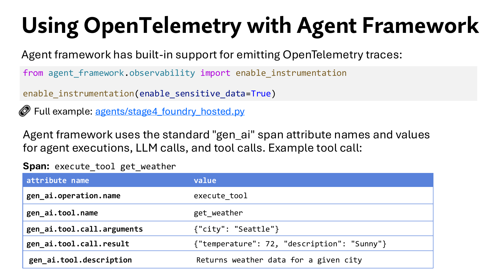
[Watch from 42:48](https://www.youtube.com/watch?v=8N7q0Ucr3rw&t=2568s)

Enable OTel instrumentation by calling `enable_instrumentation` at the very start of the program, before any agent code runs:

```python
from agent_framework.observability import enable_instrumentation
enable_instrumentation(enable_sensitive_data=True)
```

Agent Framework emits spans using the standard `gen_ai` semantic conventions, which are shared across multiple vendors and frameworks. Each tool call produces a span like:

| Attribute | Value |
|---|---|
| `gen_ai.operation.name` | `execute_tool` |
| `gen_ai.tool.name` | `get_weather` |
| `gen_ai.tool.call.arguments` | `{"city": "Seattle"}` |
| `gen_ai.tool.call.result` | `{"temperature": 72, "description": "Sunny"}` |

Set `enable_sensitive_data=False` in production if you don't want tool call arguments and results in traces.

### Exporting OTel to App Insights

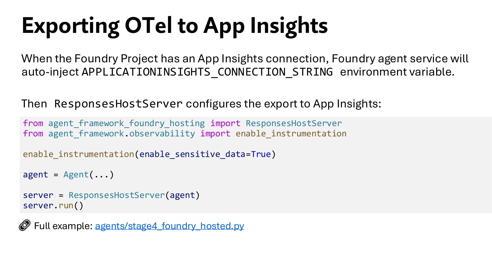
[Watch from 44:31](https://www.youtube.com/watch?v=8N7q0Ucr3rw&t=2671s)

When the Foundry project has an Application Insights connection, Foundry Agent Service auto-injects the `APPLICATIONINSIGHTS_CONNECTION_STRING` environment variable into the container. `ResponsesHostServer` detects this variable and automatically configures the OTel exporter to App Insights—no additional export configuration is needed in the agent code. Full example: [agents/stage4_foundry_hosted.py](https://github.com/Azure-Samples/foundry-hosted-agentframework-demos/blob/main/agents/stage4_foundry_hosted.py).

### Viewing agent traces in Foundry

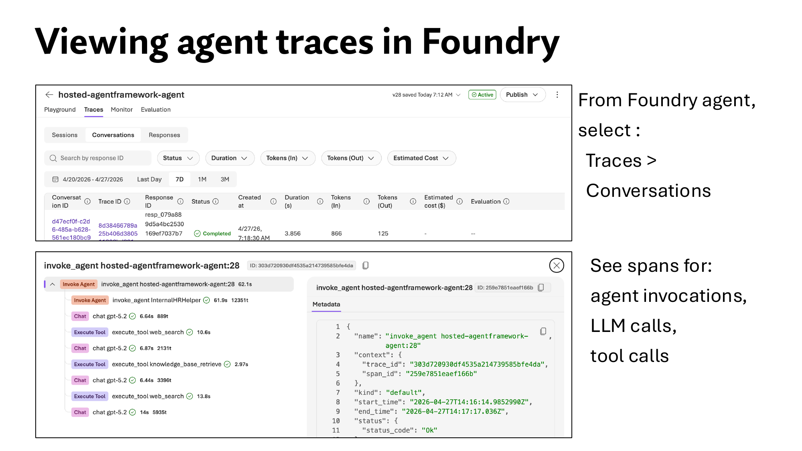
[Watch from 44:56](https://www.youtube.com/watch?v=8N7q0Ucr3rw&t=2696s)

From the Foundry agent, go to **Traces > Conversations** to see all conversations. Clicking a conversation shows the full span tree: agent invocation → LLM call → tool calls → LLM call. Each span includes all `gen_ai` attributes, so you can see exact inputs and outputs at every step.

### Viewing agent traces in App Insights

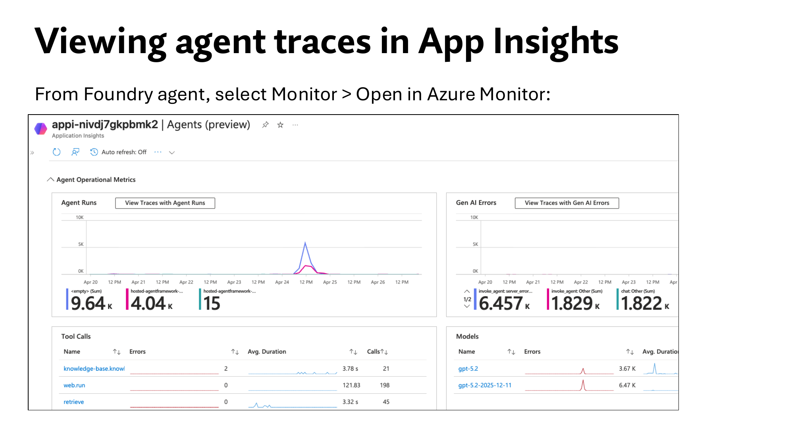
[Watch from 45:49](https://www.youtube.com/watch?v=8N7q0Ucr3rw&t=2749s)

From the Foundry agent, select **Monitor > Open in Azure Monitor** to reach the new **Agents** tab in Application Insights. It shows agent run counts, error rates, the most-called tools, tools with the most errors, and average duration—all as charts. This aggregated view complements the per-conversation trace view in Foundry.

### Multi-agent workflows

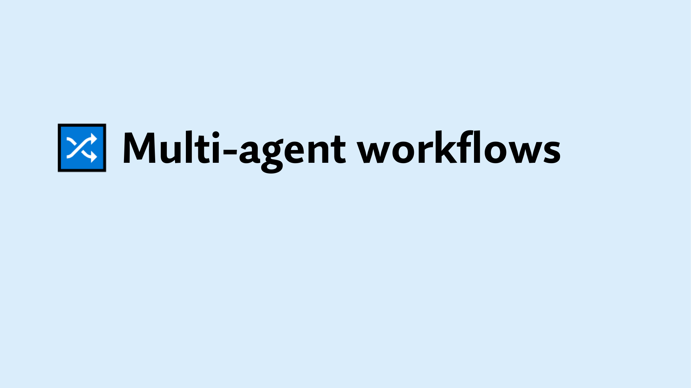
[Watch from 46:38](https://www.youtube.com/watch?v=8N7q0Ucr3rw&t=2798s)

### What's a workflow

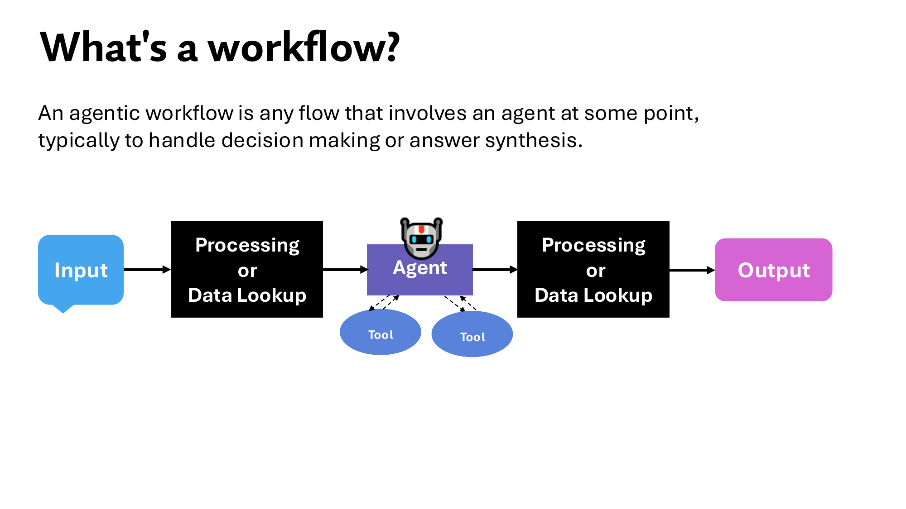
[Watch from 46:57](https://www.youtube.com/watch?v=8N7q0Ucr3rw&t=2817s)

An agentic workflow is any flow that involves an agent at some point—typically for decision-making, answer synthesis, or entity extraction. A workflow might include non-agent processing steps (data lookup, transformation) before and after the agent node.

### Building workflows in Agent Framework

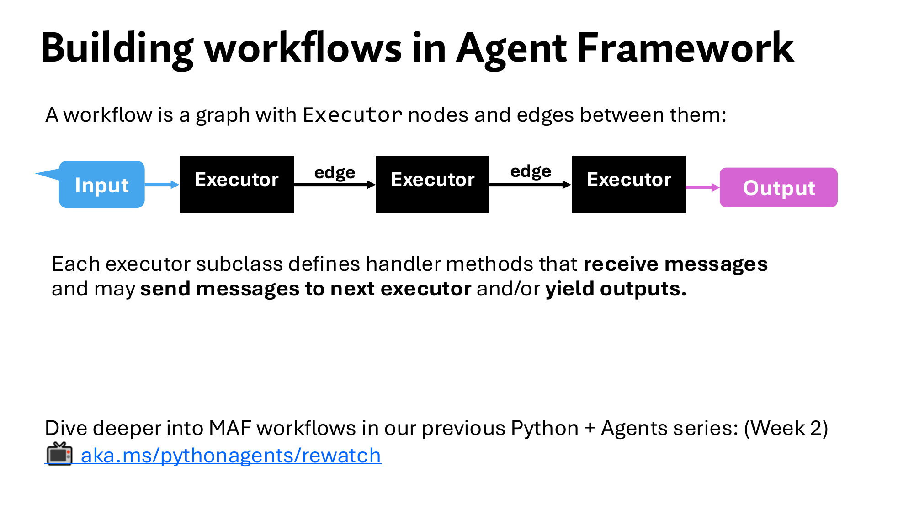
[Watch from 47:25](https://www.youtube.com/watch?v=8N7q0Ucr3rw&t=2845s)

In Agent Framework, a workflow is a directed graph where each node is an `Executor` and edges define message flow between nodes. Each executor defines handler methods that receive messages from the previous node and either send messages to the next node or yield outputs. The previous Python + Agents series (Week 2) covers workflows in depth: [aka.ms/pythonagents/rewatch](https://aka.ms/pythonagents/rewatch).

### A simple workflow

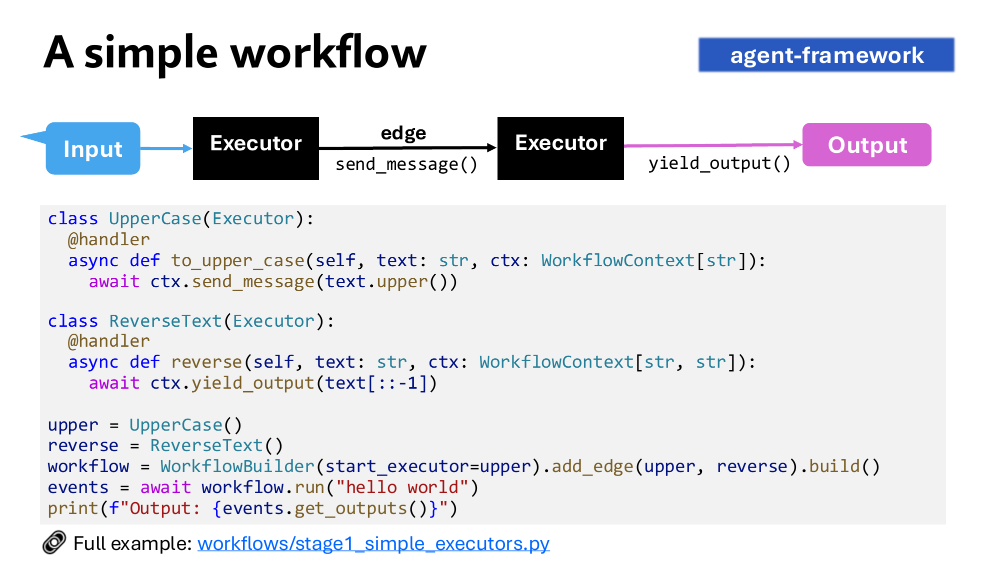
[Watch from 48:18](https://www.youtube.com/watch?v=8N7q0Ucr3rw&t=2898s)

A minimal two-node workflow converts text to uppercase then reverses it:

```python
class UpperCase(Executor):
    @handler
    async def to_upper_case(self, text: str, ctx: WorkflowContext[str]):
        await ctx.send_message(text.upper())

class ReverseText(Executor):
    @handler
    async def reverse(self, text: str, ctx: WorkflowContext[str, str]):
        await ctx.yield_output(text[::-1])

upper = UpperCase()
reverse = ReverseText()
workflow = WorkflowBuilder(start_executor=upper).add_edge(upper, reverse).build()
events = await workflow.run("hello world")
```

`send_message` passes data to the next executor; `yield_output` marks a value as a workflow output that callers can retrieve. Full example: [workflows/stage1_simple_executors.py](https://github.com/Azure-Samples/foundry-hosted-agentframework-demos/blob/main/workflows/stage1_simple_executors.py).

### Using agents inside workflows

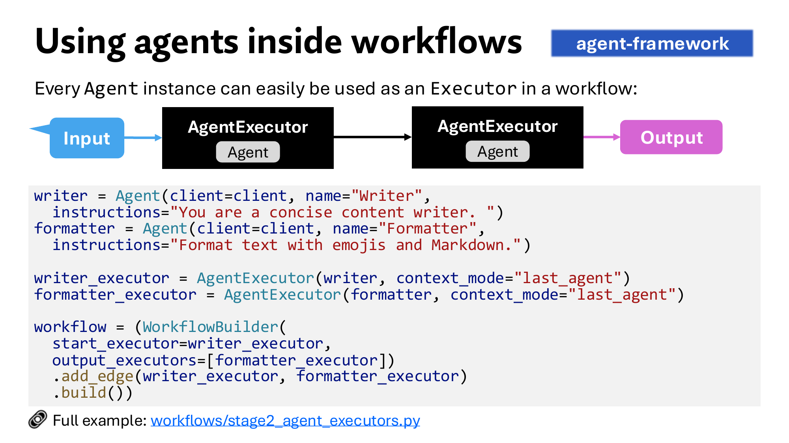
[Watch from 49:15](https://www.youtube.com/watch?v=8N7q0Ucr3rw&t=2955s)

Any `Agent` instance can be used as a workflow node by wrapping it in `AgentExecutor`. Here a Writer agent passes its output to a Formatter agent that adds emoji and Markdown:

```python
writer_executor = AgentExecutor(writer, context_mode="last_agent")
formatter_executor = AgentExecutor(formatter, context_mode="last_agent")

workflow = (WorkflowBuilder(start_executor=writer_executor,
                            output_executors=[formatter_executor])
            .add_edge(writer_executor, formatter_executor)
            .build())
```

Full example: [workflows/stage2_agent_executors.py](https://github.com/Azure-Samples/foundry-hosted-agentframework-demos/blob/main/workflows/stage2_agent_executors.py).

### Using a workflow as an agent

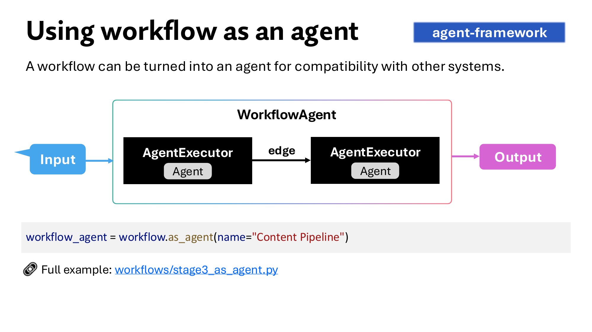
[Watch from 50:13](https://www.youtube.com/watch?v=8N7q0Ucr3rw&t=3013s)

Call `.as_agent(name="Content Pipeline")` on a built workflow to wrap it in an `Agent`-compatible interface. This makes the workflow compatible with any system that expects an `Agent`, including Foundry Agent Service's `ResponsesHostServer`. Full example: [workflows/stage3_as_agent.py](https://github.com/Azure-Samples/foundry-hosted-agentframework-demos/blob/main/workflows/stage3_as_agent.py).

### A Foundry hosted MAF workflow

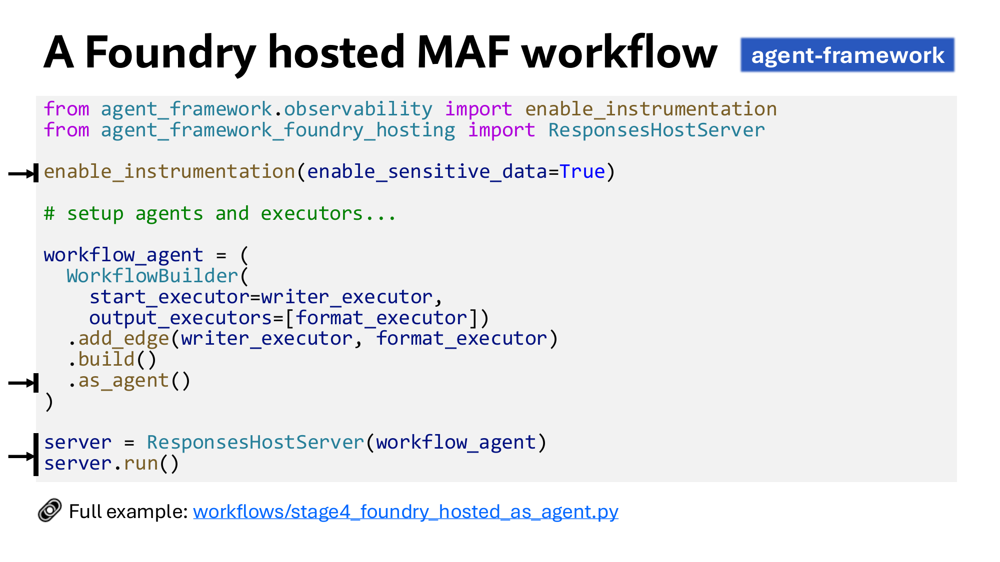
[Watch from 50:43](https://www.youtube.com/watch?v=8N7q0Ucr3rw&t=3043s)

Hosting a workflow on Foundry uses exactly the same pattern as hosting a single agent: build the workflow, call `.as_agent()`, pass it to `ResponsesHostServer`, and run:

```python
workflow_agent = (WorkflowBuilder(start_executor=writer_executor,
                                  output_executors=[format_executor])
                  .add_edge(writer_executor, format_executor)
                  .build()
                  .as_agent())

server = ResponsesHostServer(workflow_agent)
server.run()
```

The workflow lives in its own subfolder with its own `Dockerfile`, `agent.yaml`, and `pyproject.toml`. The repo's top-level `azure.yaml` lists both the agent and the workflow as separate services, so `azd up` deploys both in one command. Full example: [workflows/stage4_foundry_hosted_as_agent.py](https://github.com/Azure-Samples/foundry-hosted-agentframework-demos/blob/main/workflows/stage4_foundry_hosted_as_agent.py).

### Next steps and resources

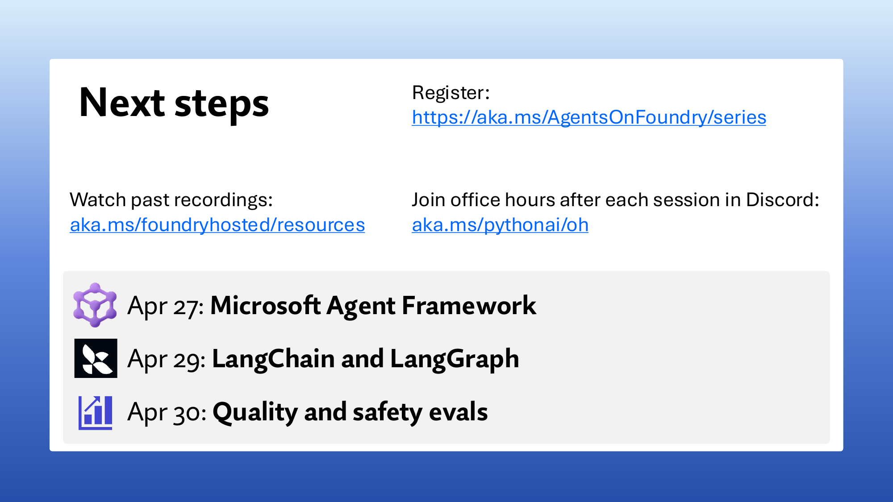
[Watch from 59:32](https://www.youtube.com/watch?v=8N7q0Ucr3rw&t=3572s)

- Register for the series: [aka.ms/AgentsOnFoundry/series](https://aka.ms/AgentsOnFoundry/series)
- Watch past recordings and get resources: [aka.ms/foundryhosted/resources](https://aka.ms/foundryhosted/resources)
- Join Discord office hours after each session: [aka.ms/pythonai/oh](https://aka.ms/pythonai/oh)

Upcoming sessions: LangChain and LangGraph (Apr 29), quality and safety evals (Apr 30).

## Live Chat Q&A

### What about memory?

Foundry does have a hosted memory service. It uses a similar approach to mem0—an LLM extracts and curates memories, handles updates, and removes stale entries—rather than naive storage. The previous Python + Agents series covered mem0 and Redis-based memory. Foundry memory is worth exploring for hosted agents; the [launch blog post](https://devblogs.microsoft.com/foundry/from-local-to-production-the-complete-developer-journey-for-building-composing-and-deploying-ai-agents/#step-3:-make-agents-stateful-with-memory-in-foundry-agent-service-(public-preview)) includes code for making agents stateful with Foundry memory. Redis built-in memory is more naive; the mem0 or Foundry memory approach is better for production.

### Can hosted agents be deployed to specific regions?

At the time of this session, Foundry hosted agents were available in a limited set of regions: Australia East, Canada Central, North Central US, and Sweden Central. More regions will be added as the feature moves toward general availability.

### What tools can be added to the Foundry Toolbox?

The Foundry Toolbox supports any tool from the Foundry Tool Catalog (including web search and code interpreter) and any MCP server reachable via a URL with OAuth or Foundry project connection auth. The toolbox feature was very new at the time of this session and the supported tool list was still expanding.

### Why microVMs instead of Azure Container Apps?

The previous version of Foundry hosted agents ran on Azure Container Apps. The new platform (released the week before this session) uses microVMs for faster startup, better session isolation per agent run, and lower overhead. An official name was not yet announced; more details were expected at Microsoft Build in June.

## Discord OH Q&A

### When would it be better to deploy agents as hosted agents vs. using other Azure compute resources?

📹 [0:28](https://youtube.com/watch?v=o4-1LI3-uqw&t=28)

The number one advantage of deploying as hosted agents is the evaluation story. With hosted agents, it's much easier to set up scheduled evaluation, online/continuous evaluation, and evaluation alerts — that would be significant effort to replicate on your own compute platform.

Another advantage is having everything in the Foundry UI — the playground, traces, and tools all in one location, which can make it easier for other people in your organization to interact with the agent.

That said, if you're currently in production on Container Apps, you should stay there for now since hosted agents are still in public preview. You can test it out in parallel — set up performance tests and load testing to compare. Only move when you're really taking advantage of the hosted agent features like evaluation.

### Are the Foundry evaluations kept in our tenant? That's an important topic in Europe.

📹 [3:06](https://youtube.com/watch?v=o4-1LI3-uqw&t=186)

Evaluation is a per-region thing, and it does create storage behind the scenes. Pamela assumed the storage stays in the region but couldn't find a definitive doc statement confirming it. For organizations that need to be very certain, the recommended approach is to use "bring your own storage" — that way you control exactly where data is stored. She noted this as a follow-up question for the product team.

Links shared:

* [Evaluation regions and limits](https://learn.microsoft.com/en-us/azure/foundry/concepts/evaluation-regions-limits-virtual-network)

### Do you get more customizable orchestration with hosted agents?

📹 [4:51](https://youtube.com/watch?v=o4-1LI3-uqw&t=291)

Yes, compared to prompt agents. Prompt agents are quite limited — you can only configure instructions and tools through the SDK. With hosted agents, you can bring your own framework (Microsoft Agent Framework, LangChain, Pydantic AI, etc.) and build complex workflows, then wrap them as an agent in the responses host server.

However, it's the agent framework that provides the orchestration, not the Foundry Agent Service platform itself. The platform just hosts and runs your containerized agent code.

### Can you connect agents with external MCP tools using the agent platform?

📹 [6:25](https://youtube.com/watch?v=o4-1LI3-uqw&t=385)

Yes. Pamela showed the stage 4 demo code which connects to multiple MCP tools. In this case, the agent connects to both a Foundry toolbox (providing web search and code interpreter) and a separate knowledge base retrieval tool — each as separate MCP server connections.

There is currently a bug where the Foundry toolbox doesn't work with MCP tools when deployed — the team is actively hot-fixing it. In the meantime, you can connect MCP tools separately. You can add any MCP server as long as you handle the authentication (key, Entra, etc.) correctly.

Links shared:

* [Foundry hosted agent demos repo](https://github.com/Azure-Samples/foundry-hosted-agentframework-demos)

### How does safety play a role in using the web search tool regarding prompt injection?

📹 [8:27](https://youtube.com/watch?v=o4-1LI3-uqw&t=507)

All calls go through a Foundry model protected by Foundry guardrails (the RAI policy system). By default, guardrails check for jailbreak detection, hate, violence, sexual content, and self-harm, with blocking set to medium level. You can increase or decrease blocking levels in the Foundry portal under Build > Guardrails.

For web search specifically, the concern is **indirect attacks** (also called "prompt shields") — where a website contains embedded prompt injection that gets pulled into the grounded data. Direct jailbreak detection is always enabled by default, but indirect attack detection may not be. If you're doing any kind of RAG or web search grounding, you should create a custom RAI policy that explicitly enables indirect attack detection.

Links shared:

* [Prompt Shields in Azure AI Content Safety](https://learn.microsoft.com/en-us/azure/ai-services/content-safety/concepts/jailbreak-detection)

### Is there something similar to code mode in Agent Framework, or can I use Pydantic Monty?

📹 [12:43](https://youtube.com/watch?v=o4-1LI3-uqw&t=763)

Pydantic AI has code mode powered by Monty (a Python sandbox rewritten in Rust that only implements safe parts of Python — no file system access, etc.). There isn't a direct equivalent in Agent Framework.

If you want code mode specifically, Pydantic AI is probably the best choice. The Pydantic AI maintainers are working on making it easy to deploy Pydantic AI agents with a generic Responses adapter. Some people have already deployed Pydantic AI to Foundry using the invocations protocol (the simpler HTTP endpoint approach), with AG-UI on top.

Links shared:

* [Pydantic Monty article](https://pydantic.dev/articles/pydantic-monty)
* [Pydantic AI Harness code mode](https://pydantic.dev/docs/ai/harness/code-mode/#_top)
* [Pydantic Monty GitHub](https://github.com/pydantic/monty)

### Live demo: Using Monty as a local tool in Agent Framework

📹 [40:26](https://youtube.com/watch?v=o4-1LI3-uqw&t=2426)

A community member shared that they use Monty as a tool in their Strava MCP server for data analysis. Pamela live-coded a minimal example of integrating Pydantic Monty as a local tool in an Agent Framework agent. The key points:

- Import `pydantic_monty` and create a tool function that accepts code and calls `monty.run(code)`
- `monty.run()` returns the result of the last expression in the code, so instruct the LLM to end with a variable (not a print statement)
- If you need print output, implement a print callback
- This should work fine when deployed as a hosted agent since Monty is just a Python/Rust library

Pamela published the working example as a GitHub Gist.

Links shared:

* [Agent Framework plus Monty tool (Gist)](https://gist.github.com/pamelafox/47c380e63687164fe1748c231f07998f)
* [Strava MCP with Monty example](https://github.com/saxenanurag/strava-mcp/blob/main/strava_mcp/services/analysis.py)

### What would be an efficient way to automatically analyze traces and logs?

📹 [14:54](https://youtube.com/watch?v=o4-1LI3-uqw&t=894)

Several approaches:

- **GitHub Copilot with Azure skills**: You can tell Copilot to grab error logs, find top errors, and report them. Pamela uses this extensively — she asks Copilot to determine whether errors are in her code vs. the platform/SDK, and then has it write detailed bug reports when appropriate. Push back on the LLM when debugging since it can be too quick to blame external factors.
- **Kusto queries in App Insights**: Copilot can write and execute KQL queries using the Azure Monitor tool.
- **Azure skills**: Check if there are relevant Azure skills that can pull in logs directly.
- **Cluster analysis in Foundry**: Foundry also has a built-in cluster analysis feature for evaluation results, which can automatically group and surface patterns in your traces.

The key is to go back and forth with the LLM when analyzing errors — don't accept the first diagnosis.

Links shared:

* [Cluster analysis in Foundry](https://learn.microsoft.com/en-us/azure/foundry/observability/how-to/cluster-analysis)

### Does hosted agent support per-agent identity and is there VNet support?

📹 [16:55](https://youtube.com/watch?v=o4-1LI3-uqw&t=1015)

**Per-agent identity:** Yes. Each hosted agent gets its own identity. The AZD post-deploy stage handles assigning roles to the agent identity automatically. If your agent code needs to access additional Azure services directly (e.g., Azure AI Search), you need to get the agent's principal ID and assign the role yourself. You can get the principal ID using `az di agent show`, which returns JSON containing the instance identity and principal ID. Pamela showed a `post-deploy.sh` script pattern for this.

**VNet support:** Yes, there is VNet support documented for Foundry Agent Service. One caveat noted in the docs is that the ACR must be reachable over a public network endpoint. Pamela recommended trying it out since she hadn't personally tested this flow yet.

Links shared:

* [Set up private networking for Foundry Agent Service](https://learn.microsoft.com/en-us/azure/foundry/agents/how-to/virtual-networks?tabs=portal)

### If we wrap a workflow as an agent and it contains other agents using tools, would tracing still capture all internal information?

📹 [20:09](https://youtube.com/watch?v=o4-1LI3-uqw&t=1209)

Yes, as long as you're using Agent Framework with `enable_instrumentation()` called. The responses host server adds one parent span on top, and then Agent Framework emits spans for all chat client operations, function invocations, and agent operations underneath.

If your workflows do something that Agent Framework doesn't automatically instrument, you can emit your own custom spans. The Agent Framework observability docs list everything that's automatically instrumented.

Links shared:

* [Agent Framework Observability - Spans and Metrics](https://learn.microsoft.com/en-us/agent-framework/agents/observability?pivots=programming-language-python#spans-and-metrics)

### How do you pick a better model for querying a database (NL to SQL)?

📹 [22:32](https://youtube.com/watch?v=o4-1LI3-uqw&t=1352)

Pamela recommended a community-made LLM SQL Benchmark that specifically tests models on NL-to-SQL generation. According to that benchmark, Claude Sonnet, Opus, GLM, and Grok 4.1 all performed well.

More generally, for any specific use case, the best approach is to set up your own evaluation scenarios with your actual data and queries, rather than relying solely on generic benchmarks. GPT-5.5 was also mentioned as worth trying — the prompting guide describes it as a fundamentally different model (not just an incremental improvement over 5.4).

Links shared:

* [LLM SQL Benchmark](https://sql-benchmark.nicklothian.com/?utm_source=breadbox)

### Pros and cons of having each agent of a multi-agent system in its own sandbox?

📹 [25:10](https://youtube.com/watch?v=o4-1LI3-uqw&t=1510)

**Pros:**
- **Isolated file system**: Each sub-agent gets its own file system, so there are no collisions if agents store artifacts (e.g., deep research agents that save files during research, like LangChain's deep agents repo).
- **Isolated context windows**: Each agent maintains its own context without pollution from other agents.
- **Dedicated CPU/memory**: No competition for compute resources when running multiple agents in parallel.
- **Good for highly parallelized deep tasks** with lots of artifact creation and inspection.

**Cons:**
- More effort to set up currently.
- Pamela recommended only going for this approach when you really need the isolation — don't jump to it prematurely. Something coming at Build should make this easier.

### What is the pricing for hosted agents?

📹 [27:14](https://youtube.com/watch?v=o4-1LI3-uqw&t=1634)

Hosted agent billing began April 22nd during preview. You pay only for active execution — there is zero idle cost and faster startup with the new microVM platform. Pricing is:

- **Compute**: $0.0994 per vCPU-hour
- **Memory**: $0.0118 per GiB-hour
- **Model inference and persistent memory**: billed separately

Foundry Memory is free to use until June 1st.

Links shared:

* [Foundry Agent Service pricing page](https://azure.microsoft.com/en-us/pricing/details/foundry-agent-service/)
* [From Local to Production blog post (pricing section)](https://devblogs.microsoft.com/foundry/from-local-to-production-the-complete-developer-journey-for-building-composing-and-deploying-ai-agents/)

### Can you publish prompt agents when you have public network disabled?

📹 [30:05](https://youtube.com/watch?v=o4-1LI3-uqw&t=1805)

We weren't able to answer this during the session, but researched an answer after:

Publishing prompt agents (not hosted agents) with public network access disabled is not reliably supported. The agent's messaging endpoint — an Azure Bot endpoint managed by Foundry — must be reachable by external Microsoft channels such as Teams and Copilot. When you restrict access to private endpoints only, those external services cannot reach the endpoint, so publish flows can fail (for example with HTTP 403).

[Check this blog post for a possible workaround](https://techcommunity.microsoft.com/blog/azure-ai-foundry-blog/foundry-agents-and-custom-engine-agents-through-the-corporate-firewall/4502218): download the prepared agent package from a public Foundry project, update the names and IDs in `manifest.json`, re-zip it, and upload it manually via the [Teams Admin Center](https://admin.teams.microsoft.com). Then go to the [Microsoft 365 Admin Center](https://admin.microsoft.com/), find the agent, and deploy it from there. For routing traffic through a corporate firewall more broadly, the linked blog post describes using Azure API Management (or a YARP reverse proxy) to terminate TLS with your own certificate, validate the Bot Framework JWT on every inbound request, and forward traffic to the agent's private endpoint — while configuring outbound firewall rules to allow replies back to Microsoft's Bot channel adapters.

Links shared:

* [Foundry Agents and custom engine agents through the corporate firewall](https://techcommunity.microsoft.com/blog/azure-ai-foundry-blog/foundry-agents-and-custom-engine-agents-through-the-corporate-firewall/4502218)

### Which endpoint do you use to connect to an agent from an external app?

📹 [30:20](https://youtube.com/watch?v=o4-1LI3-uqw&t=1820)

For calling a hosted agent via the responses API, the endpoint format is: `{base_url}/agents/{agent_name}/protocols/openai/responses`. The exact endpoint depends on whether you're using the invocations protocol or the responses API. The docs on deploying and invoking hosted agents cover both options. It's also possible that multiple endpoint formats are supported simultaneously.

Links shared:

* [Deploy a hosted agent - Invoke the agent](https://learn.microsoft.com/en-us/azure/foundry/agents/how-to/deploy-hosted-agent#invoke-the-agent-1)

### What RBAC roles are typically needed for hosted agents?

📹 [32:48](https://youtube.com/watch?v=o4-1LI3-uqw&t=1968)

Generally, AZD handles assigning the necessary RBAC roles during deployment. You only need to manually assign additional roles when your agent code directly accesses other Azure services.

Key roles Pamela highlighted from her Bicep templates:

- **Log Analytics Reader** on the Foundry project (important for traces to show up)
- **Azure AI User** on the project (for running operations)
- **ACR role** (set up automatically for container registry access)

If you're curious what roles are assigned to your agent's identity after a default deployment, you can get the agent's principal ID and use the Azure CLI to list all role assignments (change `create` to `list` in the role assignment command).

### Can we have agent endpoints proxied with an API gateway and have policies applied at the gateway level (rate limiting, auth)?

📹 [35:51](https://youtube.com/watch?v=o4-1LI3-uqw&t=2151)

For Foundry hosted agents, routing through an API gateway is explicitly supported but applies to model traffic rather than the agent's messaging endpoint. You can apply policies the model calls such as rate limiting, authentication, and governance controls. This supports API keys, managed identity, and OAuth, and works in both public and network-isolated configurations.

You should also be able to manually configure APIM in front of the hosted agent's responses API endpoint itself — since that endpoint uses standard Entra authentication, APIM can proxy it and apply policies at that layer as well.

Links shared:

* [Azure API Management GenAI Gateway capabilities](https://learn.microsoft.com/en-us/azure/api-management/genai-gateway-capabilities)
* [Azure API Management Gateways overview](https://learn.microsoft.com/en-us/azure/api-management/api-management-gateways-overview)