## Slide 1


```
Host your Python agents
on Microsoft Foundry
  Apr 27: Microsoft Agent Framework

  Apr 29: LangChain and LangGraph

  Apr 30: Quality and safety evals

Register at aka.ms/AgentsOnFoundry/series
```

## Slide 2

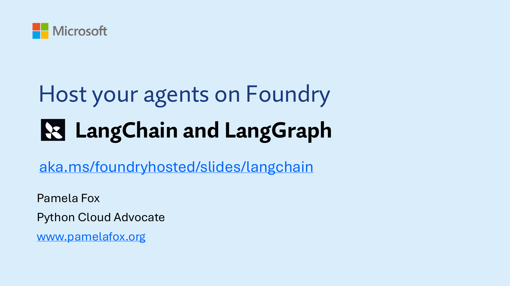

```
Host your agents on Foundry
      LangChain and LangGraph
aka.ms/foundryhosted/slides/langchain
Pamela Fox
Python Cloud Advocate
www.pamelafox.org
```

## Slide 3

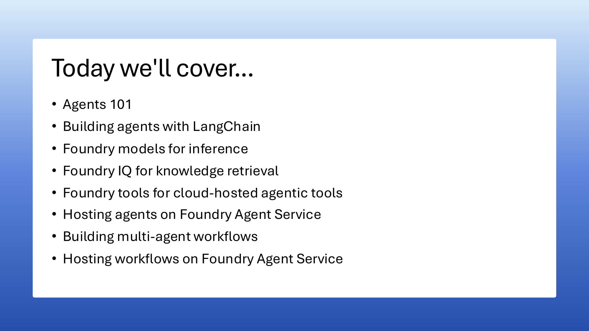

```
Today we'll cover...
• Agents 101
• Building agents with LangChain
• Foundry models for inference
• Foundry IQ for knowledge retrieval
• Foundry tools for cloud-hosted agentic tools
• Hosting agents on Foundry Agent Service
• Building multi-agent workflows
• Hosting workflows on Foundry Agent Service
```

## Slide 4

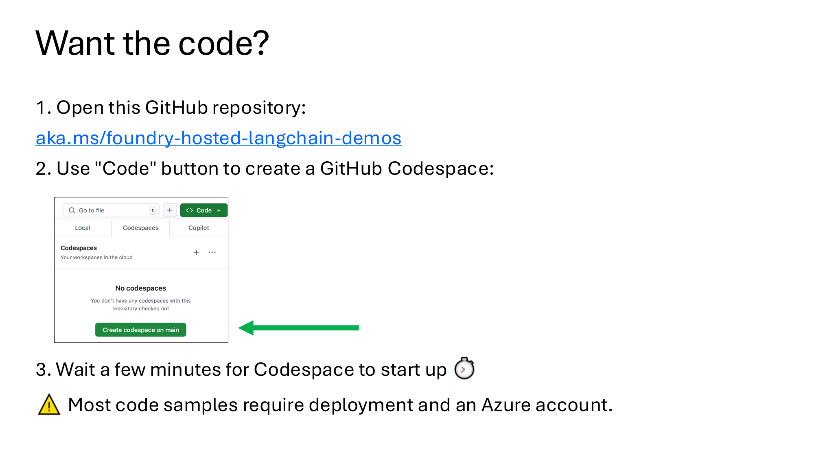

```
Want the code?
1. Open this GitHub repository:
aka.ms/foundry-hosted-langchain-demos
2. Use "Code" button to create a GitHub Codespace:


3. Wait a few minutes for Codespace to start up
   Most code samples require deployment and an Azure account.
```

## Slide 5


```
Agents 101
```

## Slide 6

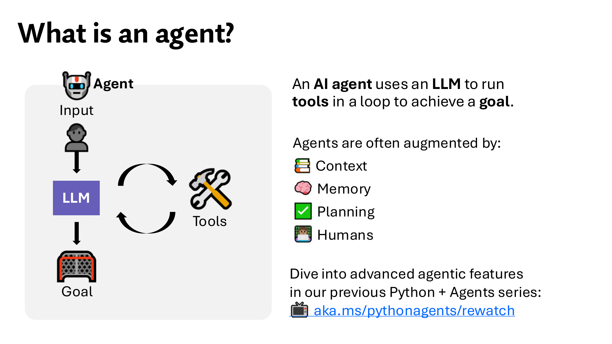

```
What is an agent?
          Agent           An AI agent uses an LLM to run
                          tools in a loop to achieve a goal.
   Input

                          Agents are often augmented by:
                              Context
                              Memory
   LLM
                              Planning
                  Tools
                              Humans

                          Dive into advanced agentic features
   Goal                   in our previous Python + Agents series:
                              aka.ms/pythonagents/rewatch
```

## Slide 7


```
The agentic loop in action
                             The agent keeps calling tools until goal is met:

          Agent                       You're a weather assistant.
   Input                              Weather in Tokyo?

                             LLM      get_weather("Tokyo")

                                      Sunny, 25°C
   LLM                       LLM      It's sunny in Tokyo at 25°C
                  Tools
                                      How about London?

                             LLM      get_weather("London")

   Goal                               Rainy, 12°C

                             LLM      London is rainy at 12°C
```

## Slide 8

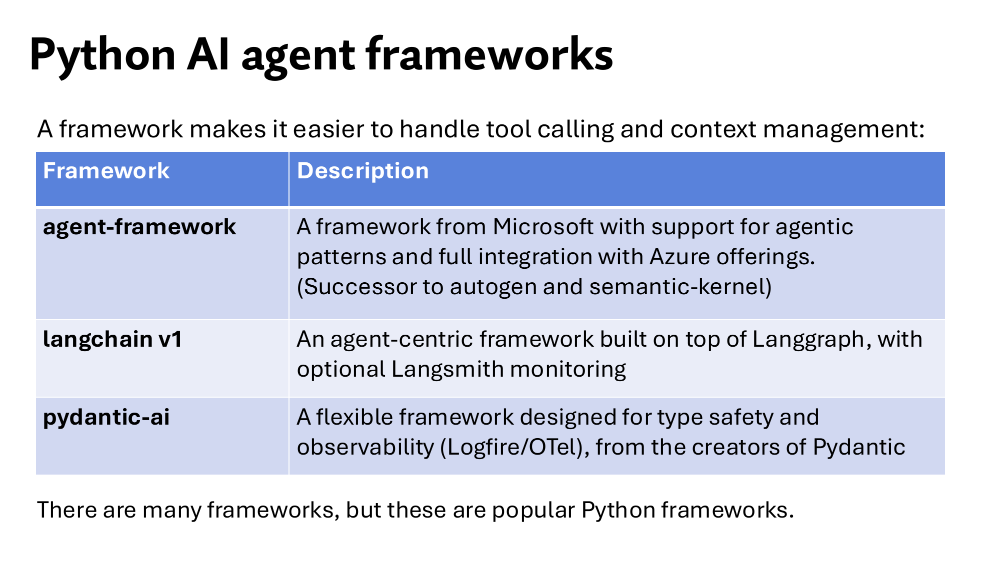

```
Python AI agent frameworks
A framework makes it easier to handle tool calling and context management:
Framework             Description

agent-framework       A framework from Microsoft with support for agentic
                      patterns and full integration with Azure offerings.
                      (Successor to autogen and semantic-kernel)

langchain v1          An agent-centric framework built on top of Langgraph, with
                      optional Langsmith monitoring
pydantic-ai           A flexible framework designed for type safety and
                      observability (Logfire/OTel), from the creators of Pydantic

There are many frameworks, but these are popular Python frameworks.
```

## Slide 9

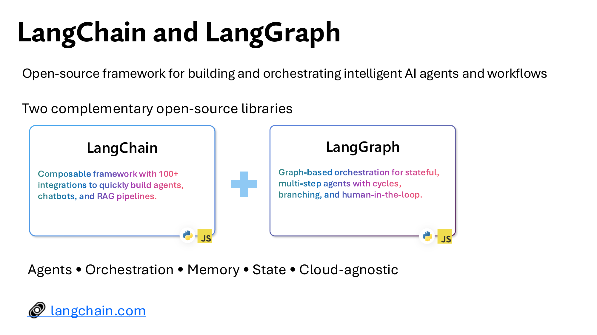

```
LangChain and LangGraph
Open-source framework for building and orchestrating intelligent AI agents and workflows

Two complementary open-source libraries

              LangChain                              LangGraph
  Composable framework with 100+          Graph-based orchestration for stateful,
  integrations to quickly build agents,   multi-step agents with cycles,
  chatbots, and RAG pipelines.            branching, and human-in-the-loop.


Agents • Orchestration • Memory • State • Cloud-agnostic

     langchain.com
```

## Slide 10

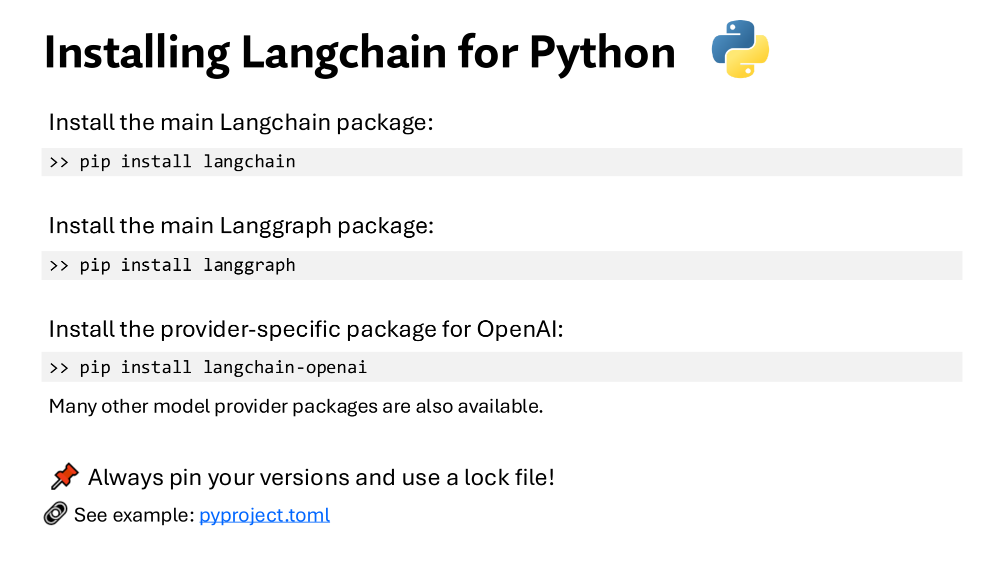

```
Installing Langchain for Python
Install the main Langchain package:
>> pip install langchain


Install the main Langgraph package:
>> pip install langgraph


Install the provider-specific package for OpenAI:
>> pip install langchain-openai

Many other model provider packages are also available.


    Always pin your versions and use a lock file!
  See example: pyproject.toml
```

## Slide 11

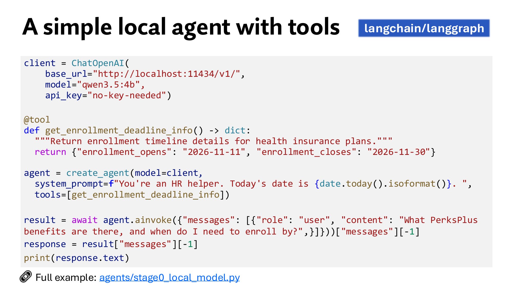

```
A simple local agent with tools                                 langchain/langgraph

client = ChatOpenAI(
    base_url="http://localhost:11434/v1/",
    model="qwen3.5:4b",
    api_key="no-key-needed")

@tool
def get_enrollment_deadline_info() -> dict:
  """Return enrollment timeline details for health insurance plans."""
  return {"enrollment_opens": "2026-11-11", "enrollment_closes": "2026-11-30"}

agent = create_agent(model=client,
  system_prompt=f"You're an HR helper. Today's date is {date.today().isoformat()}. ",
  tools=[get_enrollment_deadline_info])

result = await agent.ainvoke({"messages": [{"role": "user", "content": "What PerksPlus
benefits are there, and when do I need to enroll by?",}]}))["messages"][-1]
response = result["messages"][-1]
print(response.text)

  Full example: agents/stage0_local_model.py
```

## Slide 12

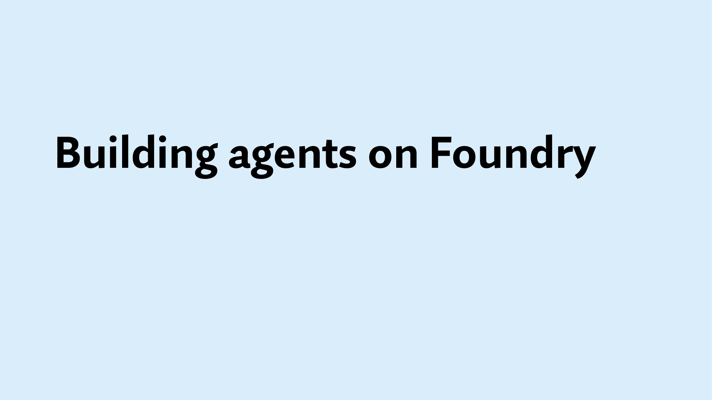

```
Building agents on Foundry
```

## Slide 13

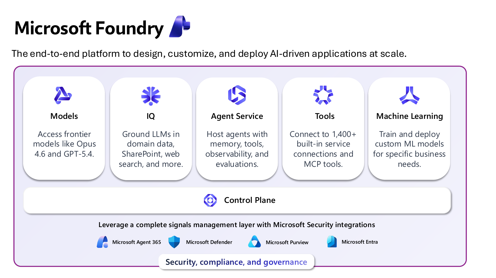

```
Ship AI faster with Microsoft Foundry
Microsoft Foundry
The end-to-end platform to design, customize, and deploy AI-driven applications at scale.


        Models                          IQ                     Agent Service                       Tools                 Machine Learning

     Access frontier          Ground LLMs in                 Host agents with           Connect to 1,400+                 Train and deploy
    models like Opus           domain data,                   memory, tools,              built-in service               custom ML models
    4.6 and GPT-5.4.          SharePoint, web                observability, and          connections and                for specific business
                             search, and more.                 evaluations.                MCP tools.                          needs.


                                                                    Control Plane

                       Leverage a complete signals management layer with Microsoft Security integrations

                           Microsoft Agent 365        Microsoft Defender       Microsoft Purview           Microsoft Entra


                                                 Security, compliance, and governance
```

## Slide 14

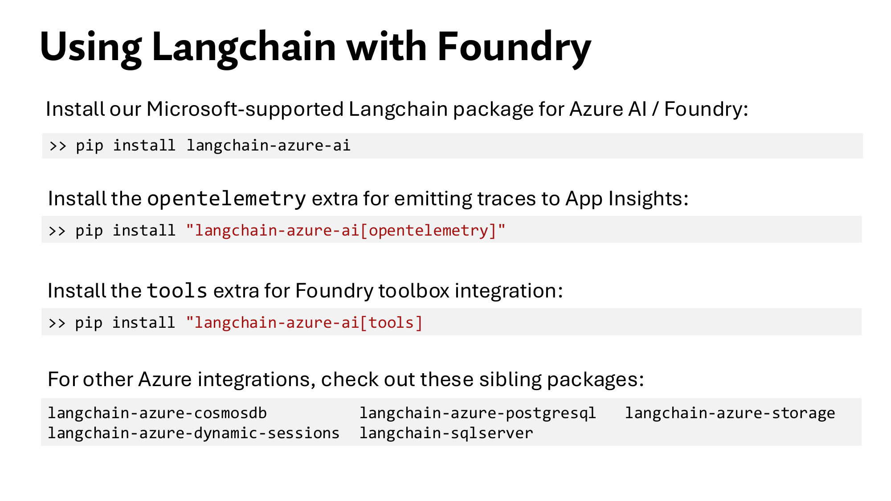

```
Using Langchain with Foundry
Install our Microsoft-supported Langchain package for Azure AI / Foundry:
>> pip install langchain-azure-ai


Install the opentelemetry extra for emitting traces to App Insights:
>> pip install "langchain-azure-ai[opentelemetry]"


Install the tools extra for Foundry toolbox integration:
>> pip install "langchain-azure-ai[tools]


For other Azure integrations, check out these sibling packages:
langchain-azure-cosmosdb            langchain-azure-postgresql   langchain-azure-storage
langchain-azure-dynamic-sessions    langchain-sqlserver
```

## Slide 15

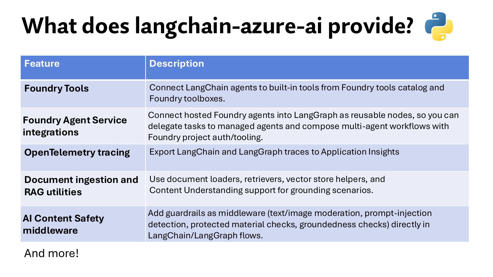

```
What does langchain-azure-ai provide?
Feature                  Description

Foundry Tools            Connect LangChain agents to built-in tools from Foundry tools catalog and
                         Foundry toolboxes.
                         Connect hosted Foundry agents into LangGraph as reusable nodes, so you can
Foundry Agent Service
                         delegate tasks to managed agents and compose multi-agent workflows with
integrations             Foundry project auth/tooling.
OpenTelemetry tracing    Export LangChain and LangGraph traces to Application Insights


Document ingestion and   Use document loaders, retrievers, vector store helpers, and
RAG utilities            Content Understanding support for grounding scenarios.

                         Add guardrails as middleware (text/image moderation, prompt-injection
AI Content Safety
                         detection, protected material checks, groundedness checks) directly in
middleware               LangChain/LangGraph flows.

And more!
```

## Slide 16

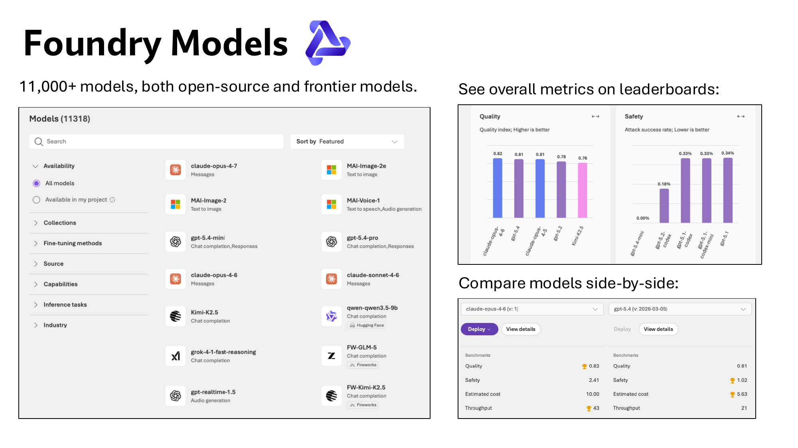

```
Foundry Models
11,000+ models, both open-source and frontier models.   See overall metrics on leaderboards:


                                                        Compare models side-by-side:
```

## Slide 17

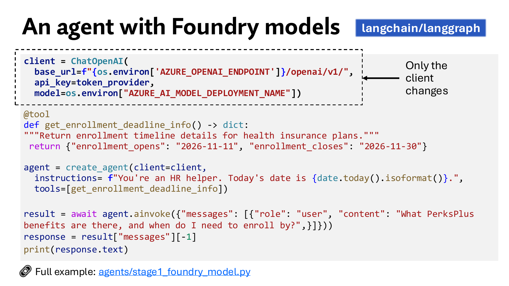

```
An agent with Foundry models                                      langchain/langgraph

client = ChatOpenAI(
  base_url=f"{os.environ['AZURE_OPENAI_ENDPOINT']}/openai/v1/",
                                                                         Only the
  api_key=token_provider,                                                client
  model=os.environ["AZURE_AI_MODEL_DEPLOYMENT_NAME"])                    changes
@tool
def get_enrollment_deadline_info() -> dict:
"""Return enrollment timeline details for health insurance plans."""
 return {"enrollment_opens": "2026-11-11", "enrollment_closes": "2026-11-30"}

agent = create_agent(client=client,
  instructions= f"You're an HR helper. Today's date is {date.today().isoformat()}.",
  tools=[get_enrollment_deadline_info])

result = await agent.ainvoke({"messages": [{"role": "user", "content": "What PerksPlus
benefits are there, and when do I need to enroll by?",}]}))
response = result["messages"][-1]
print(response.text)

  Full example: agents/stage1_foundry_model.py
```

## Slide 18

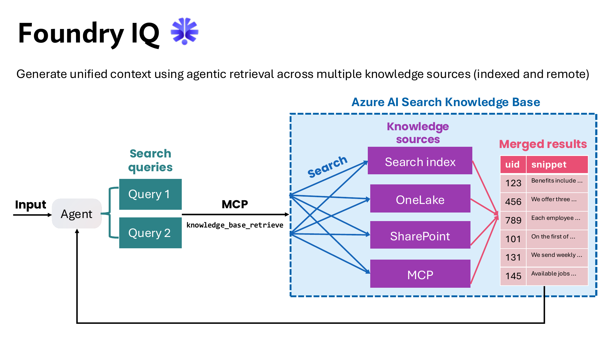

```
Foundry IQ
Generate unified context using agentic retrieval across multiple knowledge sources (indexed and remote)

                                                            Azure AI Search Knowledge Base
                                                                  Knowledge
                                                                   sources            Merged results
                    Search
                    queries                                       Search index         uid   snippet
                                                                                             Benefits include ...
                                                                                       123
                    Query 1                                         OneLake                  We offer three ...
Input                                 MCP                                              456
        Agent                                                                          789   Each employee ...
                              knowledge_base_retrieve
                    Query 2                                        SharePoint          101   On the first of ...

                                                                                             We send weekly ...
                                                                                       131
                                                                      MCP              145   Available jobs ...
```

## Slide 19

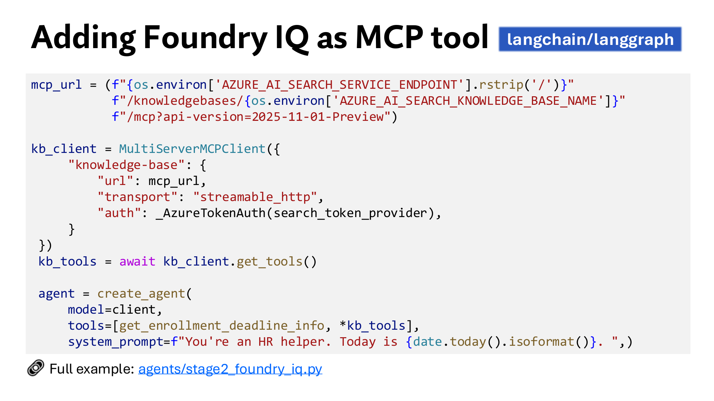

```
Adding Foundry IQ as MCP tool langchain/langgraph
mcp_url = (f"{os.environ['AZURE_AI_SEARCH_SERVICE_ENDPOINT'].rstrip('/')}"
           f"/knowledgebases/{os.environ['AZURE_AI_SEARCH_KNOWLEDGE_BASE_NAME']}"
           f"/mcp?api-version=2025-11-01-Preview")

kb_client = MultiServerMCPClient({
     "knowledge-base": {
         "url": mcp_url,
         "transport": "streamable_http",
         "auth": _AzureTokenAuth(search_token_provider),
     }
 })
 kb_tools = await kb_client.get_tools()

 agent = create_agent(
     model=client,
     tools=[get_enrollment_deadline_info, *kb_tools],
     system_prompt=f"You're an HR helper. Today is {date.today().isoformat()}. ",)

  Full example: agents/stage2_foundry_iq.py
```

## Slide 20

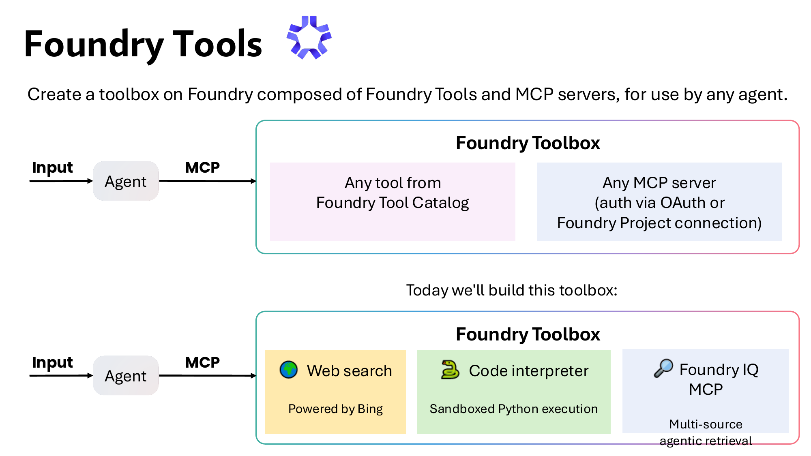

```
Foundry Tools
Create a toolbox on Foundry composed of Foundry Tools and MCP servers, for use by any agent.

                                                        Foundry Toolbox
Input              MCP
         Agent                        Any tool from                         Any MCP server
                                   Foundry Tool Catalog                    (auth via OAuth or
                                                                       Foundry Project connection)


                                                 Today we'll build this toolbox:

                                                        Foundry Toolbox
Input              MCP                                                                 Foundry IQ
         Agent                   Web search               Code interpreter
                                                                                        MCP
                               Powered by Bing      Sandboxed Python execution
                                                                                     Multi-source
                                                                                    agentic retrieval
```

## Slide 21

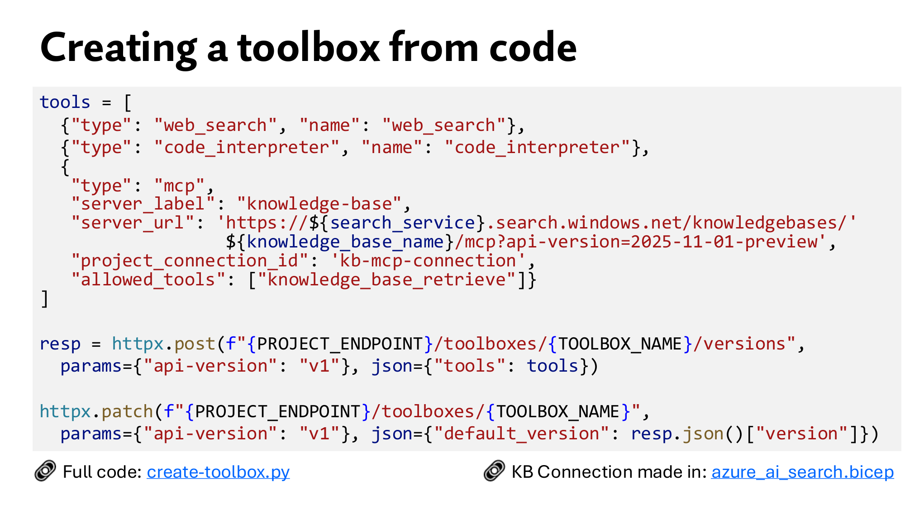

```
Creating a toolbox from code
tools = [
  {"type": "web_search", "name": "web_search"},
  {"type": "code_interpreter", "name": "code_interpreter"},
  {
   "type": "mcp",
   "server_label": "knowledge-base",
   "server_url": 'https://${search_service}.search.windows.net/knowledgebases/'
                  ${knowledge_base_name}/mcp?api-version=2025-11-01-preview',
   "project_connection_id": 'kb-mcp-connection',
   "allowed_tools": ["knowledge_base_retrieve"]}
]

resp = httpx.post(f"{PROJECT_ENDPOINT}/toolboxes/{TOOLBOX_NAME}/versions",
  params={"api-version": "v1"}, json={"tools": tools})

httpx.patch(f"{PROJECT_ENDPOINT}/toolboxes/{TOOLBOX_NAME}",
  params={"api-version": "v1"}, json={"default_version": resp.json()["version"]})

  Full code: create-toolbox.py               KB Connection made in: azure_ai_search.bicep
```

## Slide 22

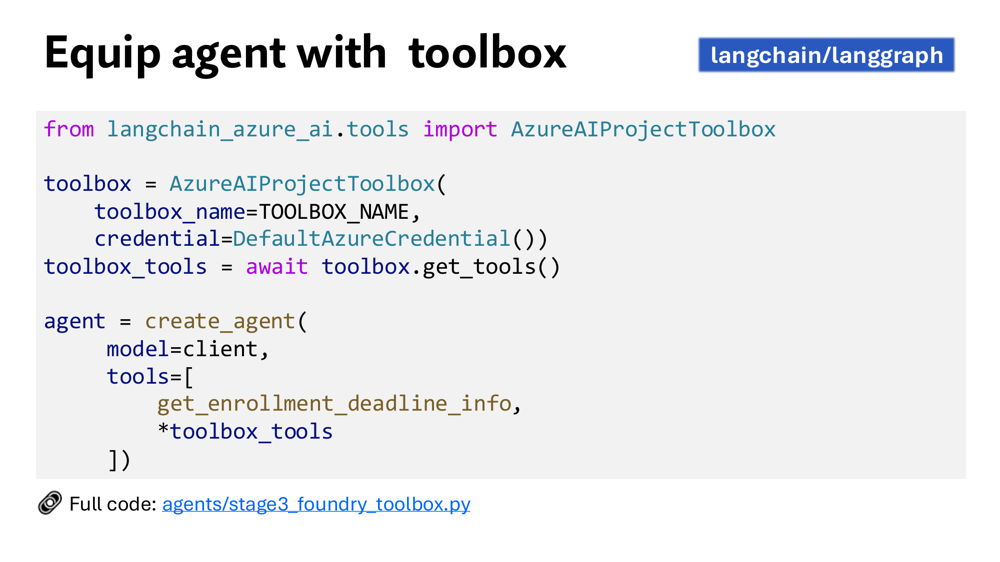

```
Equip agent with toolbox                            langchain/langgraph

from langchain_azure_ai.tools import AzureAIProjectToolbox

toolbox = AzureAIProjectToolbox(
    toolbox_name=TOOLBOX_NAME,
    credential=DefaultAzureCredential())
toolbox_tools = await toolbox.get_tools()

agent = create_agent(
     model=client,
     tools=[
         get_enrollment_deadline_info,
         *toolbox_tools
     ])
  Full code: agents/stage3_foundry_toolbox.py
```

## Slide 23

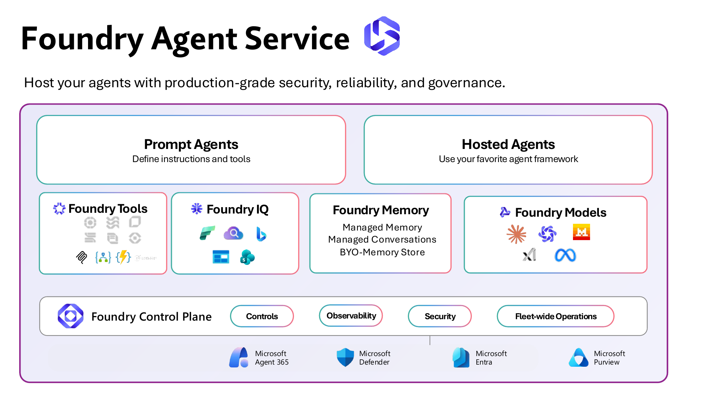

```
Foundry Agent Service
Host your agents with production-grade security, reliability, and governance.


                   Prompt Agents                                                            Hosted Agents
                 Define instructions and tools                                       Use your favorite agent framework


       Foundry Tools               Foundry IQ                 Foundry Memory                             Foundry Models
                                                               Managed Memory
                                                             Managed Conversations
                                                               BYO-Memory Store


          Foundry Control Plane             Controls         Observability       Security                Fleet-wide Operations


                                                 Microsoft           Microsoft               Microsoft                       Microsoft
                                                 Agent 365           Defender                Entra                           Purview
```

## Slide 24

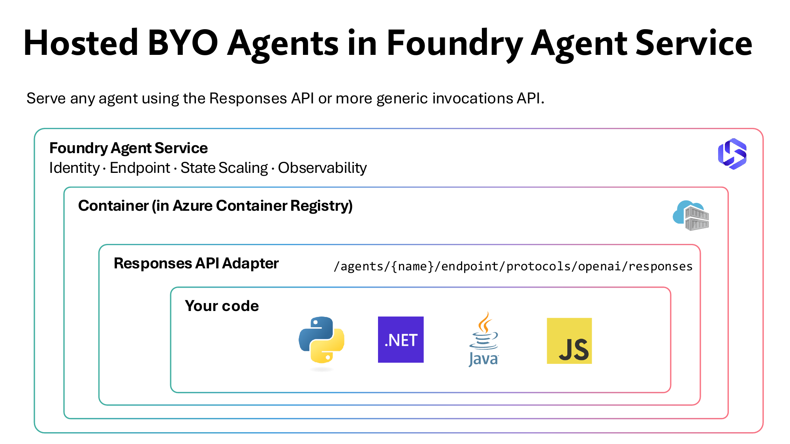

```
Hosted BYO Agents in Foundry Agent Service
Serve any agent using the Responses API or more generic invocations API.


   Foundry Agent Service
   Identity · Endpoint · State Scaling · Observability

       Container (in Azure Container Registry)


             Responses API Adapter              /agents/{name}/endpoint/protocols/openai/responses


                        Your code
```

## Slide 25

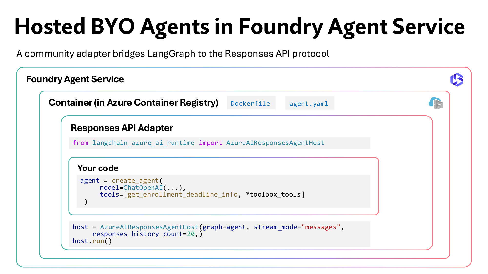

```
Hosted BYO Agents in Foundry Agent Service
A community adapter bridges LangGraph to the Responses API protocol

 Foundry Agent Service

      Container (in Azure Container Registry)       Dockerfile     agent.yaml


           Responses API Adapter
            from langchain_azure_ai_runtime import AzureAIResponsesAgentHost


             Your code
             agent = create_agent(
                  model=ChatOpenAI(...),
                  tools=[get_enrollment_deadline_info, *toolbox_tools]
              )


            host = AzureAIResponsesAgentHost(graph=agent, stream_mode="messages",
                 responses_history_count=20,)
            host.run()
```

## Slide 26

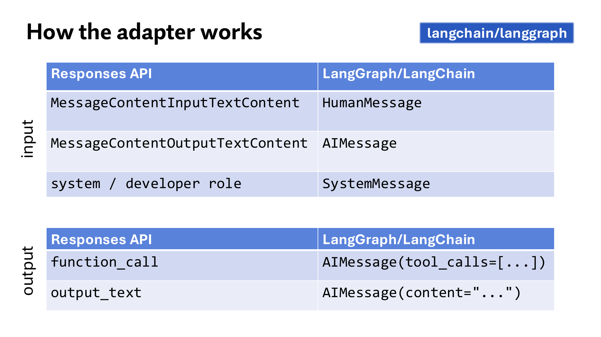

```
How the adapter works                                  langchain/langgraph

         Responses API                    LangGraph/LangChain
         MessageContentInputTextContent   HumanMessage

input    MessageContentOutputTextContent AIMessage

         system / developer role          SystemMessage


         Responses API                    LangGraph/LangChain

output
         function_call                    AIMessage(tool_calls=[...])

         output_text                      AIMessage(content="...")
```

## Slide 27

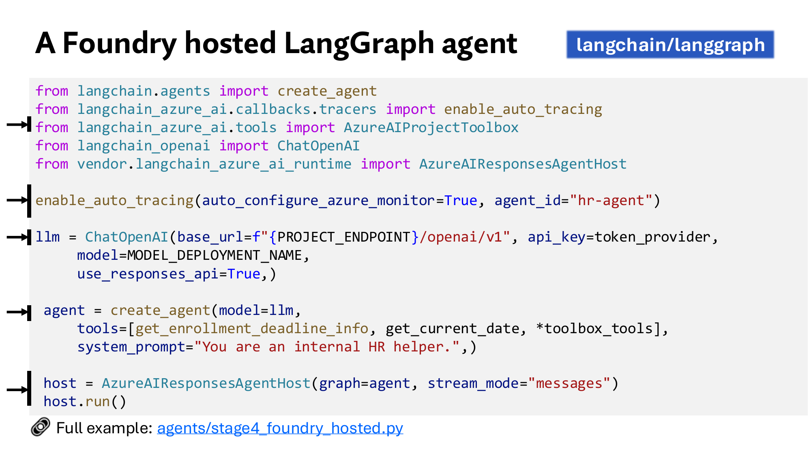

```
A Foundry hosted LangGraph agent                                langchain/langgraph

from langchain.agents import create_agent
from langchain_azure_ai.callbacks.tracers import enable_auto_tracing
from langchain_azure_ai.tools import AzureAIProjectToolbox
from langchain_openai import ChatOpenAI
from vendor.langchain_azure_ai_runtime import AzureAIResponsesAgentHost

enable_auto_tracing(auto_configure_azure_monitor=True, agent_id="hr-agent")

llm = ChatOpenAI(base_url=f"{PROJECT_ENDPOINT}/openai/v1", api_key=token_provider,
     model=MODEL_DEPLOYMENT_NAME,
     use_responses_api=True,)

 agent = create_agent(model=llm,
     tools=[get_enrollment_deadline_info, get_current_date, *toolbox_tools],
     system_prompt="You are an internal HR helper.",)

 host = AzureAIResponsesAgentHost(graph=agent, stream_mode="messages")
 host.run()
  Full example: agents/stage4_foundry_hosted.py
```

## Slide 28

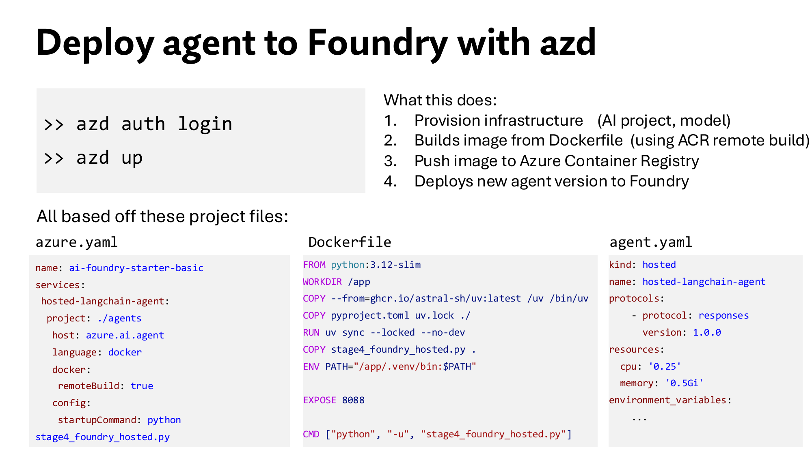

```
Deploy agent to Foundry with azd
                                                    What this does:
 >> azd auth login                                  1. Provision infrastructure (AI project, model)
                                                    2. Builds image from Dockerfile (using ACR remote build)
 >> azd up                                          3. Push image to Azure Container Registry
                                                    4. Deploys new agent version to Foundry

All based off these project files:
azure.yaml                            Dockerfile                                           agent.yaml
name: ai-foundry-starter-basic       FROM python:3.12-slim                                 kind: hosted
services:                            WORKDIR /app                                          name: hosted-langchain-agent
hosted-langchain-agent:              COPY --from=ghcr.io/astral-sh/uv:latest /uv /bin/uv   protocols:
 project: ./agents                   COPY pyproject.toml uv.lock ./                           - protocol: responses
  host: azure.ai.agent               RUN uv sync --locked --no-dev                              version: 1.0.0
  language: docker                   COPY stage4_foundry_hosted.py .                       resources:
  docker:                            ENV PATH="/app/.venv/bin:$PATH"                        cpu: '0.25'
   remoteBuild: true                                                                        memory: '0.5Gi'
  config:                            EXPOSE 8088                                           environment_variables:
   startupCommand: python                                                                     ...
stage4_foundry_hosted.py             CMD ["python", "-u", "stage4_foundry_hosted.py"]
```

## Slide 29

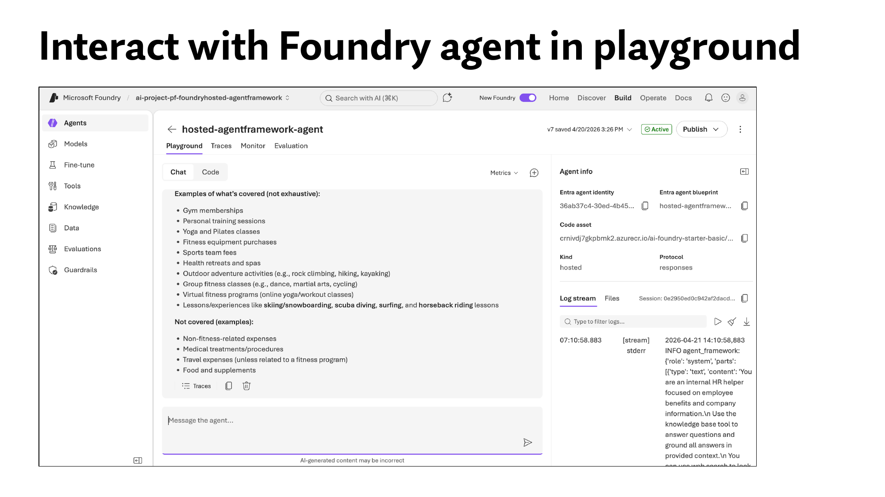

```
Interact with Foundry agent in playground
```

## Slide 30

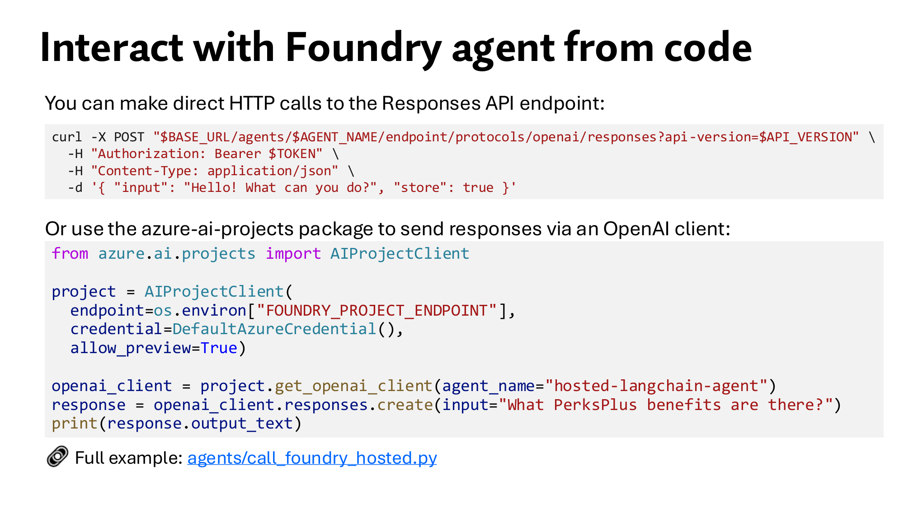

```
Interact with Foundry agent from code
You can make direct HTTP calls to the Responses API endpoint:
curl -X POST "$BASE_URL/agents/$AGENT_NAME/endpoint/protocols/openai/responses?api-version=$API_VERSION" \
  -H "Authorization: Bearer $TOKEN" \
  -H "Content-Type: application/json" \
  -d '{ "input": "Hello! What can you do?", "store": true }'


Or use the azure-ai-projects package to send responses via an OpenAI client:
from azure.ai.projects import AIProjectClient

project = AIProjectClient(
  endpoint=os.environ["FOUNDRY_PROJECT_ENDPOINT"],
  credential=DefaultAzureCredential(),
  allow_preview=True)

openai_client = project.get_openai_client(agent_name="hosted-langchain-agent")
response = openai_client.responses.create(input="What PerksPlus benefits are there?")
print(response.output_text)

   Full example: agents/call_foundry_hosted.py
```

## Slide 31

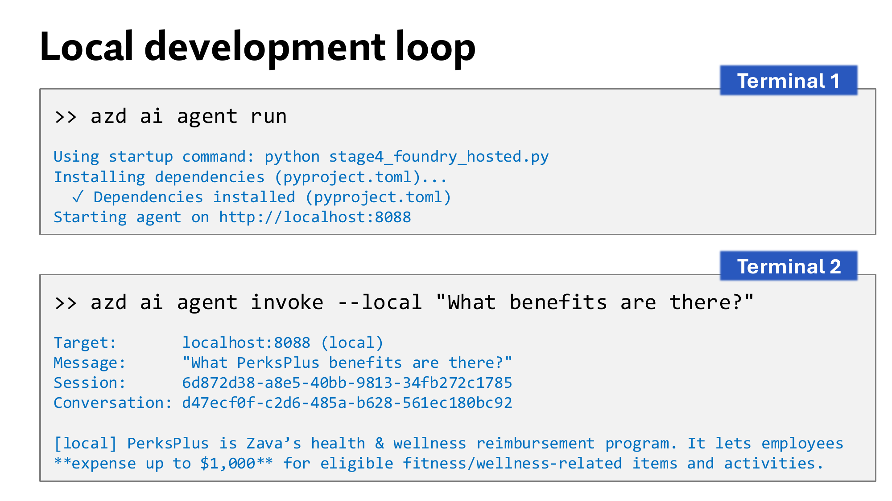

```
Local development loop
                                                                          Terminal 1
>> azd ai agent run
Using startup command: python stage4_foundry_hosted.py
Installing dependencies (pyproject.toml)...
  ✓ Dependencies installed (pyproject.toml)
Starting agent on http://localhost:8088


                                                                          Terminal 2
>> azd ai agent invoke --local "What benefits are there?"
Target:       localhost:8088 (local)
Message:      "What PerksPlus benefits are there?"
Session:      6d872d38-a8e5-40bb-9813-34fb272c1785
Conversation: d47ecf0f-c2d6-485a-b628-561ec180bc92

[local] PerksPlus is Zava’s health & wellness reimbursement program. It lets employees
**expense up to $1,000** for eligible fitness/wellness-related items and activities.
```

## Slide 32

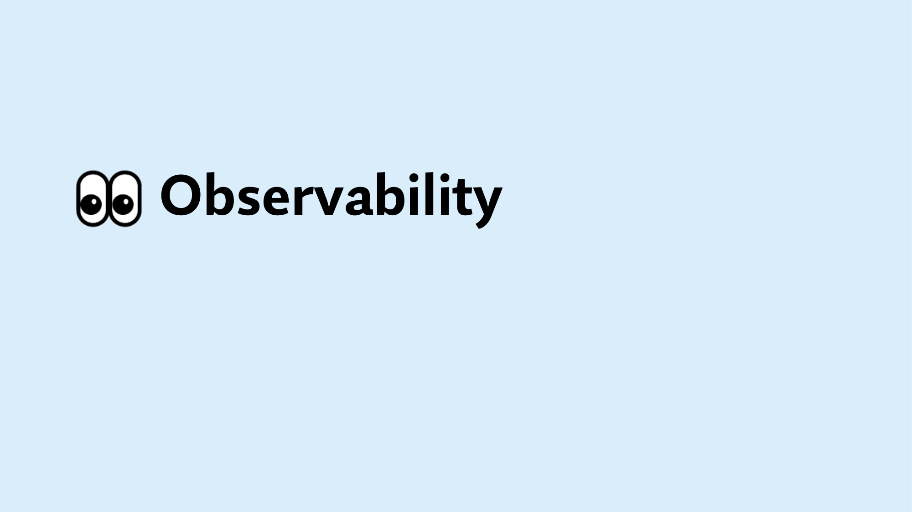

```
Observability
```

## Slide 33

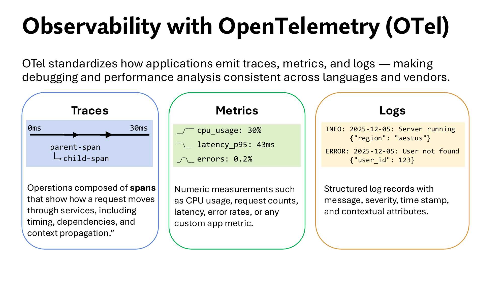

```
Observability with OpenTelemetry (OTel)
OTel standardizes how applications emit traces, metrics, and logs — making
debugging and performance analysis consistent across languages and vendors.

           Traces                           Metrics                          Logs
 0ms                   30ms     __/‾‾‾ cpu_usage:   30%         INFO: 2025-12-05: Server running
                                                                      {"region": "westus"}
       parent-span              ‾‾\__   latency_p95: 43ms
                                                                ERROR: 2025-12-05: User not found
          child-span            _/‾\__ errors:   0.2%                 {"user_id": 123}


Operations composed of spans    Numeric measurements such       Structured log records with
that show how a request moves   as CPU usage, request counts,   message, severity, time stamp,
through services, including     latency, error rates, or any    and contextual attributes.
timing, dependencies, and       custom app metric.
context propagation.”
```

## Slide 34

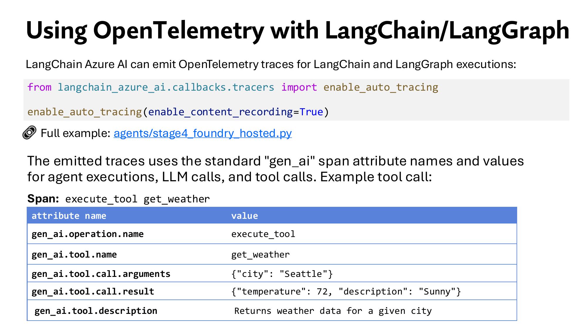

```
Using OpenTelemetry with LangChain/LangGraph
LangChain Azure AI can emit OpenTelemetry traces for LangChain and LangGraph executions:
from langchain_azure_ai.callbacks.tracers import enable_auto_tracing

enable_auto_tracing(enable_content_recording=True)
  Full example: agents/stage4_foundry_hosted.py

The emitted traces uses the standard "gen_ai" span attribute names and values
for agent executions, LLM calls, and tool calls. Example tool call:
Span: execute_tool get_weather
 attribute name                     value
 gen_ai.operation.name              execute_tool

 gen_ai.tool.name                   get_weather
 gen_ai.tool.call.arguments         {"city": "Seattle"}
 gen_ai.tool.call.result            {"temperature": 72, "description": "Sunny"}
 gen_ai.tool.description             Returns weather data for a given city
```

## Slide 35

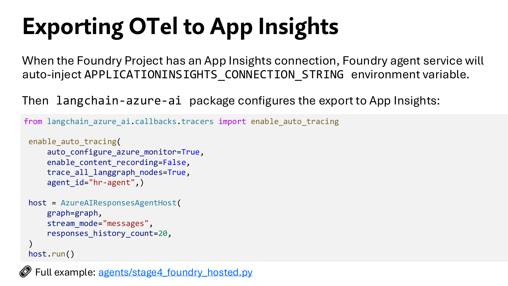

```
Exporting OTel to App Insights
When the Foundry Project has an App Insights connection, Foundry agent service will
auto-inject APPLICATIONINSIGHTS_CONNECTION_STRING environment variable.

Then langchain-azure-ai package configures the export to App Insights:
from langchain_azure_ai.callbacks.tracers import enable_auto_tracing

 enable_auto_tracing(
     auto_configure_azure_monitor=True,
     enable_content_recording=False,
     trace_all_langgraph_nodes=True,
     agent_id="hr-agent",)

 host = AzureAIResponsesAgentHost(
     graph=graph,
     stream_mode="messages",
     responses_history_count=20,
 )
 host.run()

  Full example: agents/stage4_foundry_hosted.py
```

## Slide 36

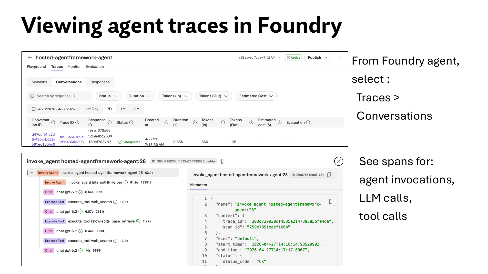

```
Viewing agent traces in Foundry
                                  From Foundry agent,
                                  select :
                                   Traces >
                                   Conversations


                                   See spans for:
                                   agent invocations,
                                   LLM calls,
                                   tool calls
```

## Slide 37


```
Viewing agent traces in App Insights
From Foundry agent, select Monitor > Open in Azure Monitor:
```

## Slide 38

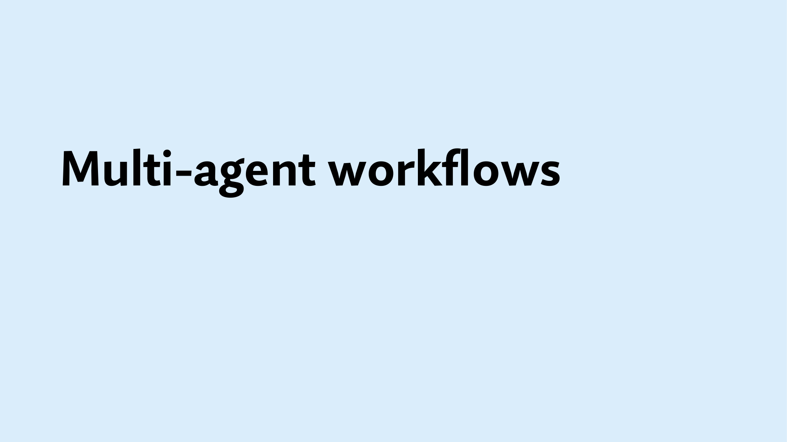

```
Multi-agent workflows
```

## Slide 39

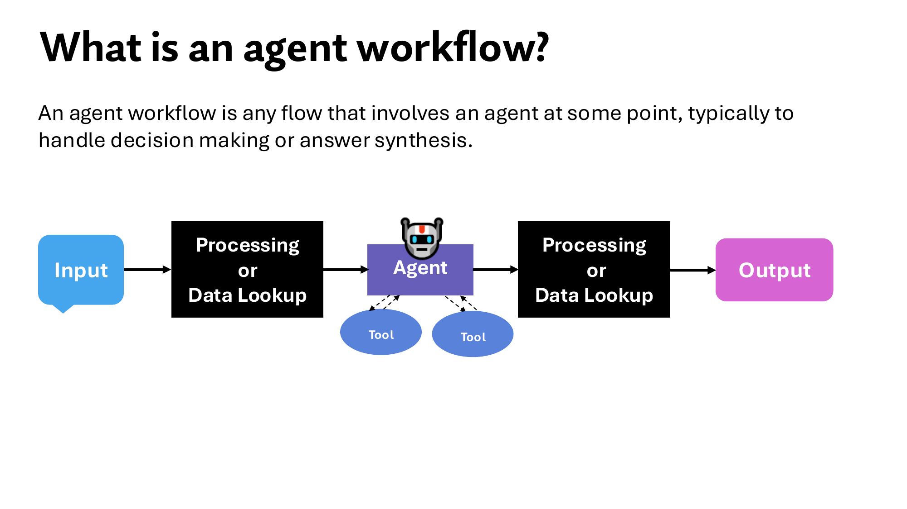

```
What is an agent workflow?
An agent workflow is any flow that involves an agent at some point, typically to
handle decision making or answer synthesis.


               Processing                           Processing
 Input              or               Agent               or               Output
               Data Lookup                          Data Lookup
                                  Tool       Tool
```

## Slide 40

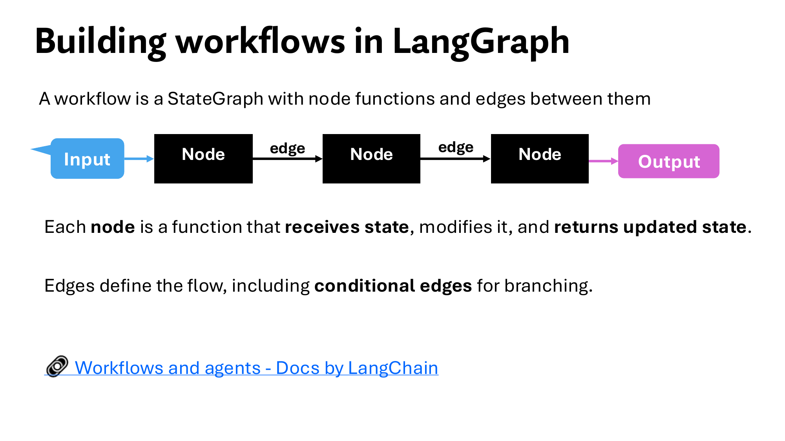

```
Building workflows in LangGraph
A workflow is a StateGraph with node functions and edges between them

                Node      edge      Node      edge      Node
  Input                                                               Output


Each node is a function that receives state, modifies it, and returns updated state.


Edges define the flow, including conditional edges for branching.


    Workflows and agents - Docs by LangChain
```

## Slide 41

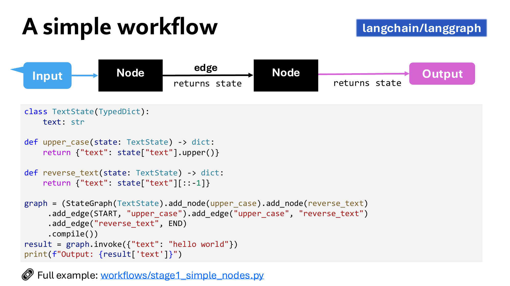

```
A simple workflow                                                       langchain/langgraph


                                    edge
 Input             Node                              Node                         Output
                                returns state                     returns state

class TextState(TypedDict):
    text: str

def upper_case(state: TextState) -> dict:
    return {"text": state["text"].upper()}

def reverse_text(state: TextState) -> dict:
    return {"text": state["text"][::-1]}

graph = (StateGraph(TextState).add_node(upper_case).add_node(reverse_text)
     .add_edge(START, "upper_case").add_edge("upper_case", "reverse_text")
     .add_edge("reverse_text", END)
     .compile())
result = graph.invoke({"text": "hello world"})
print(f"Output: {result['text']}")

  Full example: workflows/stage1_simple_nodes.py
```

## Slide 42

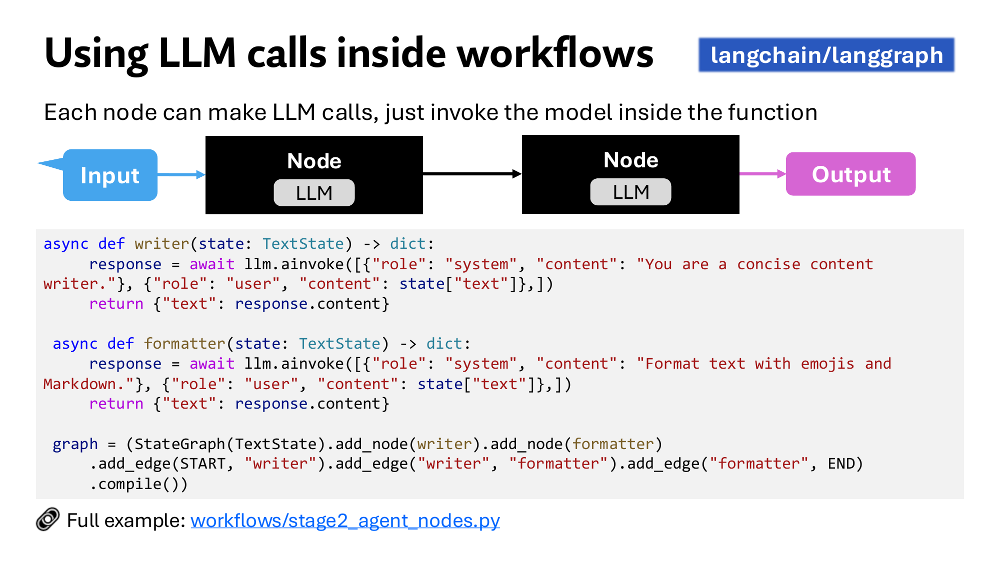

```
Using LLM calls inside workflows                                         langchain/langgraph

Each node can make LLM calls, just invoke the model inside the function
                          Node                               Node
    Input                                                                           Output
                           LLM                                LLM

async def writer(state: TextState) -> dict:
     response = await llm.ainvoke([{"role": "system", "content": "You are a concise content
writer."}, {"role": "user", "content": state["text"]},])
     return {"text": response.content}

 async def formatter(state: TextState) -> dict:
     response = await llm.ainvoke([{"role": "system", "content": "Format text with emojis and
Markdown."}, {"role": "user", "content": state["text"]},])
     return {"text": response.content}

 graph = (StateGraph(TextState).add_node(writer).add_node(formatter)
     .add_edge(START, "writer").add_edge("writer", "formatter").add_edge("formatter", END)
     .compile())

  Full example: workflows/stage2_agent_nodes.py
```

## Slide 43

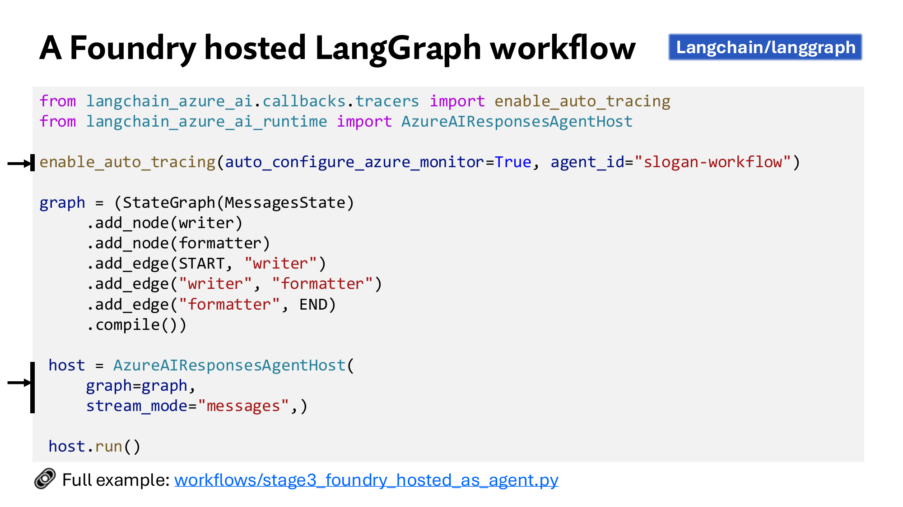

```
A Foundry hosted LangGraph workflow                                    Langchain/langgraph

from langchain_azure_ai.callbacks.tracers import enable_auto_tracing
from langchain_azure_ai_runtime import AzureAIResponsesAgentHost

enable_auto_tracing(auto_configure_azure_monitor=True, agent_id="slogan-workflow")

graph = (StateGraph(MessagesState)
     .add_node(writer)
     .add_node(formatter)
     .add_edge(START, "writer")
     .add_edge("writer", "formatter")
     .add_edge("formatter", END)
     .compile())

 host = AzureAIResponsesAgentHost(
     graph=graph,
     stream_mode="messages",)

 host.run()

  Full example: workflows/stage3_foundry_hosted_as_agent.py
```

## Slide 44


```
Next steps                       Register:
                                 https://aka.ms/AgentsOnFoundry/series


Watch past recordings:           Join office hours after each session in Discord:
aka.ms/foundryhosted/resources   aka.ms/pythonai/oh


     Apr 27: Microsoft Agent Framework

     Apr 29: LangChain and LangGraph

     Apr 30: Quality and safety evals
```
