# Foundry IQ: Querying the multi-source AI knowledge bases

This is the final episode of the IQ Series. I'm Pamela from Developer Advocacy at Microsoft, joined by Matt from the Foundry IQ team. In the previous session, Gia walked us through knowledge sources — the way content enters Foundry IQ. Today we build on that foundation to see how we handle retrieval across multiple sources using knowledge bases.
In today's session, we'll start with what a knowledge base actually is, then cover retrieval reasoning effort — because sometimes you want results fast and cheap, and other times you need the most comprehensive retrieval possible. And we'll see it all in action in the demos.
## Table of contents

- [What is a knowledge base?](#what-is-a-knowledge-base)
- [Three core components: query planning, knowledge sources, output merging](#three-core-components-query-planning-knowledge-sources-output-merging)
- [Indexed and remote knowledge sources](#indexed-and-remote-knowledge-sources)
- [Source selection and descriptions](#source-selection-and-descriptions)
- [Demo: Knowledge base setup in the Foundry IQ portal](#demo-knowledge-base-setup-in-the-foundry-iq-portal)
- [Retrieval reasoning effort](#retrieval-reasoning-effort)
- [Minimal effort: fastest and cheapest](#minimal-effort-fastest-and-cheapest)
- [Demo: Minimal effort with a sample application](#demo-minimal-effort-with-a-sample-application)
- [Demo: Minimal effort with Foundry Agents](#demo-minimal-effort-with-foundry-agents)
- [Low effort: LLM-powered query planning and source selection](#low-effort-llm-powered-query-planning-and-source-selection)
- [Demo: Low effort with a sample application](#demo-low-effort-with-a-sample-application)
- [Medium effort: iterative retrieval](#medium-effort-iterative-retrieval)
- [Demo: Medium effort with iterative retrieval](#demo-medium-effort-with-iterative-retrieval)
- [Summary of effort levels](#summary-of-effort-levels)
- [Knowledge bases as MCP servers](#knowledge-bases-as-mcp-servers)
- [Demo: Knowledge base as MCP server in GitHub Copilot](#demo-knowledge-base-as-mcp-server-in-github-copilot)
- [Recap and resources](#recap-and-resources)
- [Visual doodle summary](#visual-doodle-summary)

## What is a knowledge base?

[Watch from 01:07](https://www.youtube.com/watch?v=BU59cYcz4WU&t=67s)

🧔 *Matt:*

Think of a knowledge base as a single endpoint that sits in front of multiple data sources. When you're building an agent or a RAG application, you often need to search across different repositories — maybe you've got product data in a search index, company policies in SharePoint, and you want to supplement that with real-time updates from the web.

A question we get all the time from developers: how do I query multiple sources at the same time? If you do this yourself, you end up writing a lot of orchestration code — deciding which sources are relevant, calling each in parallel, merging results, handling failures. It's doable, but it gets complex very quickly.

This is the problem knowledge bases solve. We handle all the orchestration for you as part of Foundry IQ. One endpoint, one way to access knowledge across sources.

## Three core components: query planning, knowledge sources, output merging

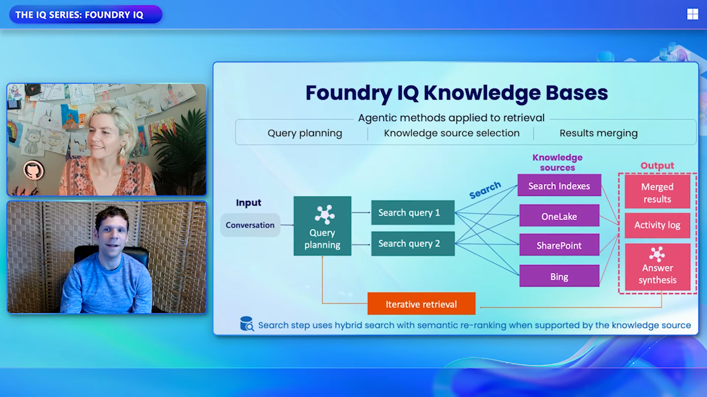
[Watch from 02:24](https://www.youtube.com/watch?v=BU59cYcz4WU&t=144s)

🧔 *Matt:*

We have three core components that work together.

**Query planning**: When a conversation comes in, it could be complex with multiple parts. The knowledge base uses an LLM to analyze it and break it down into focused subqueries. A good example: somebody asks "What Zava paint is best for bathrooms, and how much does it cost?" There are really two separate information needs there. We need to find which paints are best for bathrooms (product specifications) and how much they cost (pricing data), which are potentially in different sources.

**Knowledge sources**: These are all the data repositories your agent has access to — search indexes, OneLake, SharePoint, Bing. When we issue subqueries, they fan out and hit these different sources in parallel. We're not waiting for them sequentially, so your query is only as slow as the slowest knowledge source. When we search, we use full hybrid search — combining vector search (HNSW) and keyword search (BM25) in parallel. I personally love this about Foundry IQ retrieval. The hybrid search stack gives you the best retrieval quality, especially when your knowledge sources contain messy unstructured data like PDFs.

**Output merging**: Once we have results from all sources, they go through semantic reranking to find the most relevant matches, then get merged into a single list. You get back three things: merged content for grounding, source references for citations, and an activity log showing exactly what happened during retrieval.

💁‍♀️ *Pamela:*

I love that activity log — it makes it so much easier to debug retrieval both in local development and when your agents are in production. We'll see it later in the demos.

## Indexed and remote knowledge sources

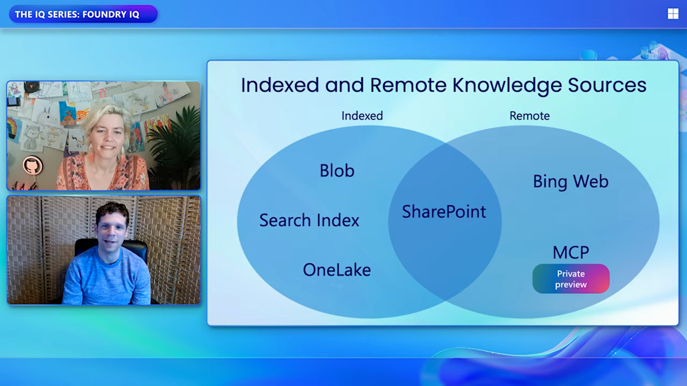
[Watch from 05:48](https://www.youtube.com/watch?v=BU59cYcz4WU&t=348s)

🧔 *Matt:*

There are two main categories of knowledge sources: indexed and remote.

**Indexed sources** are where we actually copy the data into Foundry IQ. You might have PDFs in a blob container, files in a OneLake lakehouse, or documents in SharePoint. We pull those files, chunk them into smaller bits that are easier to retrieve, convert them into vector embeddings, and store them in a search index. This lets us do that hybrid search I talked about, with the extra reranking step that orders chunks by relevance so the LLM sees the most relevant information first.

**Remote sources** work differently — we query them directly at runtime without copying the data. A great example is Bing. If your agent needs real-time web information, we call Bing's API and merge those results with the other sources. MCP-based remote sources are also available in private preview.

SharePoint is interesting because we offer it both ways. You can index it in a search index for hybrid search, or query it directly through the same indexes that Copilot uses, using the end user's identity to ensure the same access control as your regular SharePoint applications.

## Source selection and descriptions

[Watch from 07:31](https://www.youtube.com/watch?v=BU59cYcz4WU&t=451s)

Once you have multiple sources hooked up, you don't want every query hitting every source — that's wasteful and adds noise to your results. When we do query planning using the LLM, there are a couple ways you influence source selection.

First, the name and description of each knowledge source matters a lot. If you name one "HR policies" and describe it as containing employee handbook information, the query planning LLM will understand exactly when to use it. You can also provide retrieval instructions, which work like extra prompts to guide source selection. Plus, you can always override and say "I always want to query this source" if you want it searched on every request.

## Demo: Knowledge base setup in the Foundry IQ portal

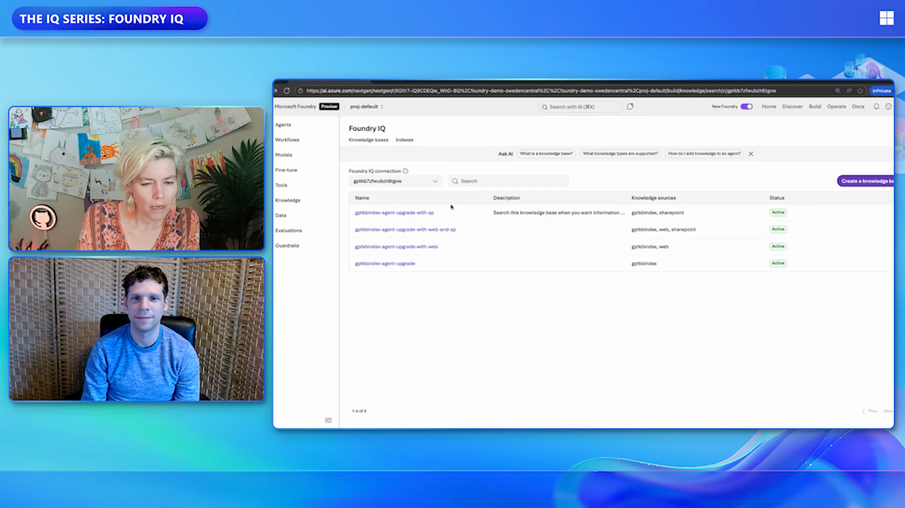
[Watch from 08:22](https://www.youtube.com/watch?v=BU59cYcz4WU&t=502s)

💁‍♀️ *Pamela:*

Here I have Foundry IQ set up with a few different knowledge bases. The most exciting one has three knowledge sources attached, so let's check it out.

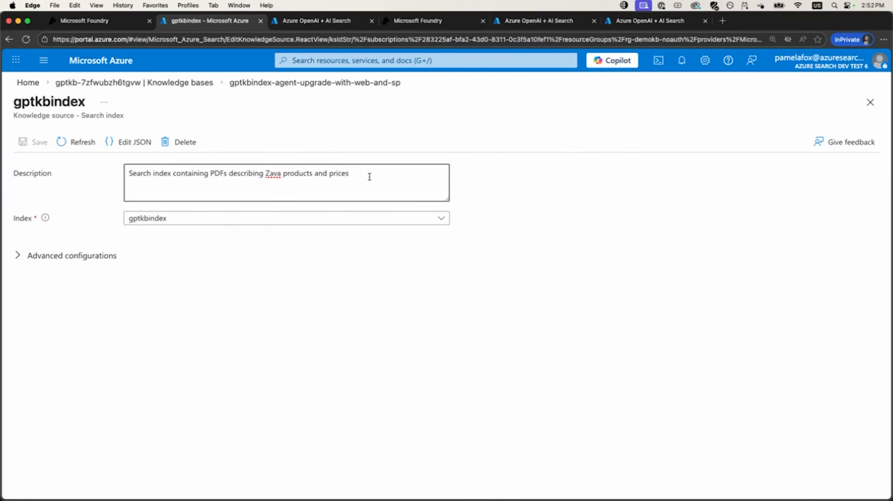

💁‍♀️ *Pamela:*

The first knowledge source is a search index. Its description says it contains PDFs describing Zava products and prices — Zava is a fictional hardware store, like a home improvement store. This index pulls from a blob storage account with one PDF per product, and we can customize additional settings if needed.

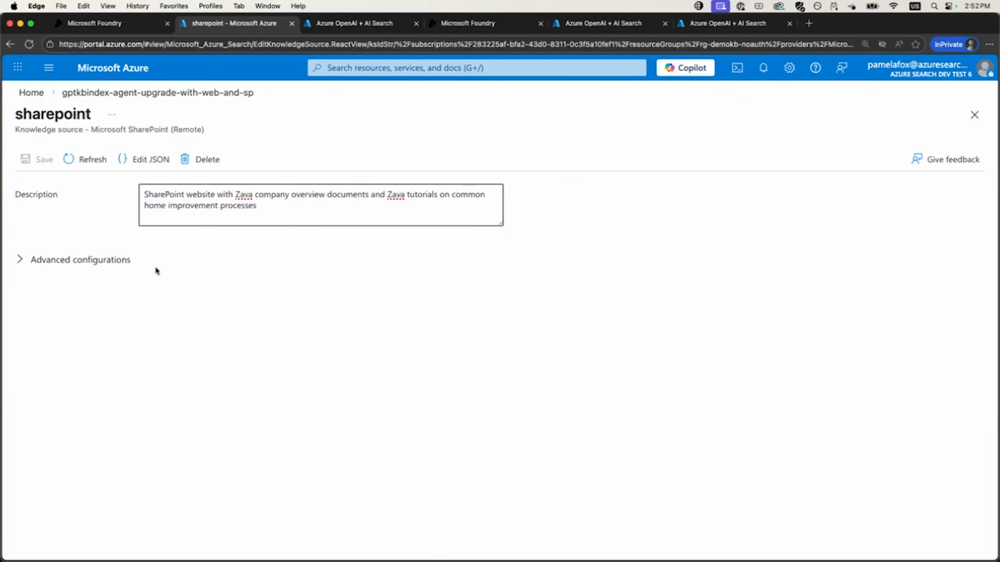

💁‍♀️ *Pamela:*

The second source is a SharePoint site. In the description we say it has "Zava company overview documents and Zava tutorials on common home improvement processes." We could use a filter expression to narrow down which parts of the SharePoint site we index, but here we're indexing the whole site.

The third source is Bing web, with a standard description covering scenarios where you need up-to-date information that isn't in the other sources.

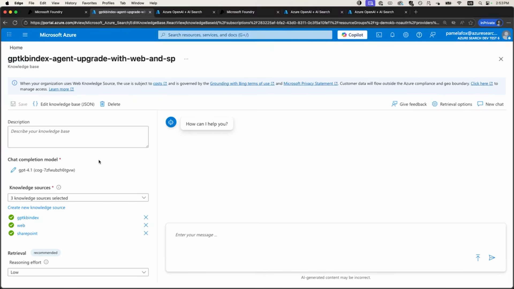

💁‍♀️ *Pamela:*

The knowledge base overview shows the configured model (gpt-4.1), all three sources, and retrieval settings. We should also describe the knowledge base itself — something like "Zava hardware store documents and information." All of this helps give the agentic retrieval process more context to do a good job.

## Retrieval reasoning effort

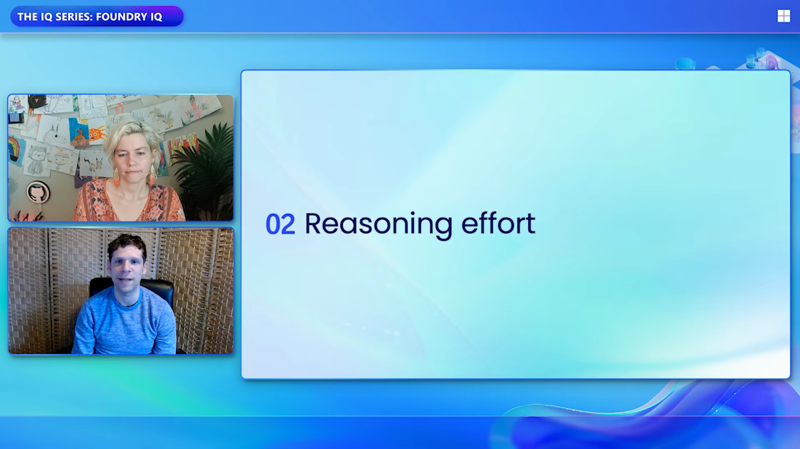
[Watch from 10:24](https://www.youtube.com/watch?v=BU59cYcz4WU&t=624s)

🧔 *Matt:*

One of the first questions developers ask: how long will a query take? How much will it cost? How can I be confident I'll get quality results? We provide a single property called retrieval reasoning effort that controls how much LLM processing happens during retrieval. We offer three levels: minimal, low, and medium.

## Minimal effort: fastest and cheapest

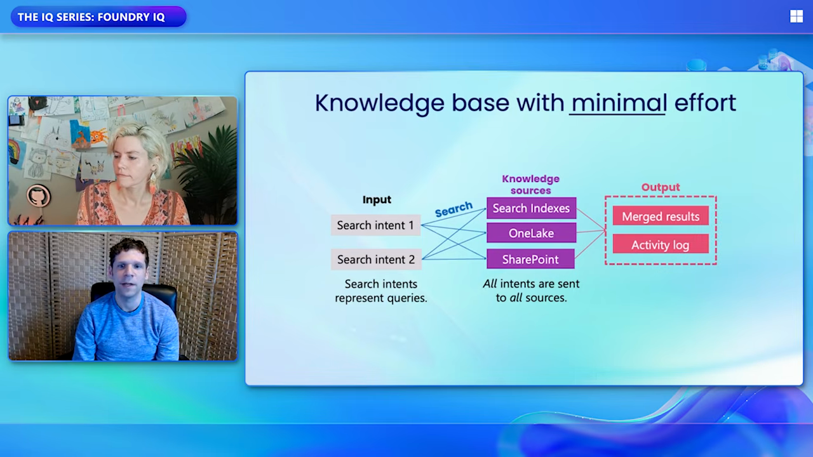
[Watch from 11:07](https://www.youtube.com/watch?v=BU59cYcz4WU&t=667s)

🧔 *Matt:*

Minimal is the fastest and cheapest option because it doesn't use an LLM much at all during retrieval. This makes sense for agent architectures where the outer agent is already doing reasoning — if you're using an LLM to think about the final answer and understand the conversation, you don't necessarily need us to do query planning or answer synthesis for you.

With minimal, you provide us what we call search intents — basically queries — directly. The agent has already figured out what it wants to search for, maybe through its own query planning or by accepting queries from a user search box. Each intent gets sent to every knowledge source, results are merged and reranked, and you get back your grounding data fast. You're effectively using your knowledge base as a unified search layer — we fan out to sources, merge, rerank, but your agent owns the query strategy.

## Demo: Minimal effort with a sample application

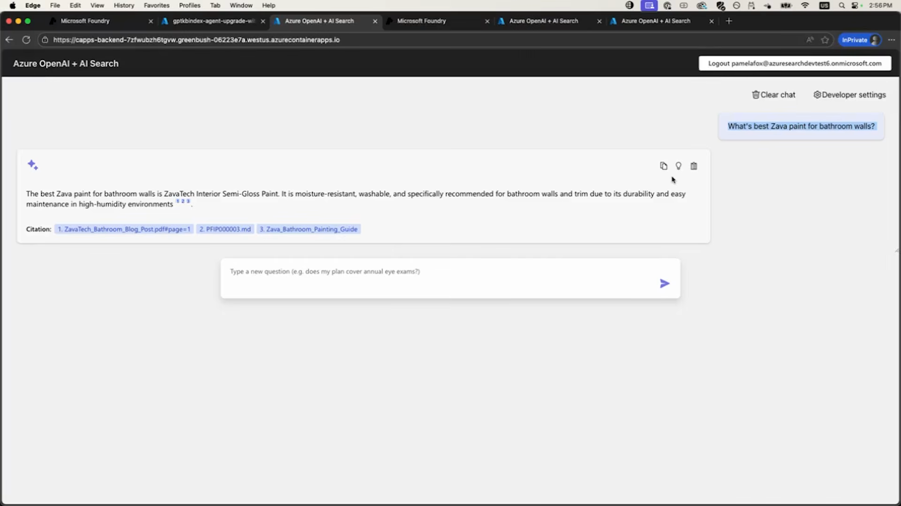
[Watch from 12:15](https://www.youtube.com/watch?v=BU59cYcz4WU&t=735s)

💁‍♀️ *Pamela:*

We're demoing knowledge bases using an open-source application that you could deploy yourself. I've pointed it at the multi-source knowledge base and configured it for minimal mode, so it uses its own LLM for query planning. When I ask "What is the best Zava paint for bathroom walls?", we get back a good response — it recommends the semi-gloss paint for its moisture resistance, with citations from product PDFs and a blog post. We got an answer grounded in our own data with citations, which is exactly what we want.

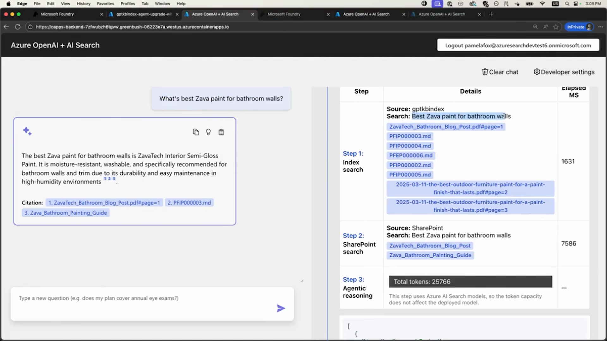

💁‍♀️ *Pamela:*

Now let's look at that activity log I mentioned. The application's own query planning turned the question into a single intent: "best Zava paint for bathroom walls." Then the knowledge base took that intent, sent it to both the search index and SharePoint in parallel, got back results from both, and used the semantic ranking model to merge them together. The index search took 1,631ms, SharePoint took 7,586ms, and the agentic reasoning step used 25,766 tokens for reranking. Then the application used its own LLM to generate the final answer. With minimal mode, there aren't that many steps, but we still get the unified search layer — running searches in parallel across multiple sources — and that on its own is quite powerful.

## Demo: Minimal effort with Foundry Agents

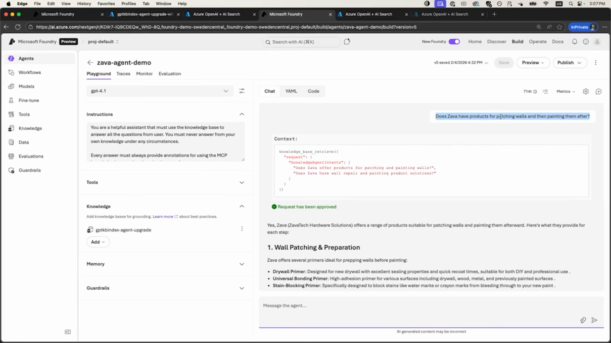
[Watch from 14:27](https://www.youtube.com/watch?v=BU59cYcz4WU&t=867s)

💁‍♀️ *Pamela:*

Another example of minimal mode is Microsoft Foundry Agents. Here I've configured a Foundry agent to point at the Zava knowledge base and asked "Does Zava have products for patching walls and then painting them after?" The Foundry agent, which has its own LLM, decomposed this into two intents — one about patching and painting, one about wall repair — and sent them to the knowledge base. The knowledge base fanned both out to the search index and SharePoint in parallel, merged the results, and the Foundry agent came up with a nice answer listing Drywall Primer, Universal Bonding Primer, Stain-Blocking Primer, Drywall Screws, and Pre-Taped Masking Film.

So here you can see two examples of how we use minimal mode with existing agents and applications — we still get multi-source queries, but use the LLMs in those agents to handle query decomposition.

## Low effort: LLM-powered query planning and source selection

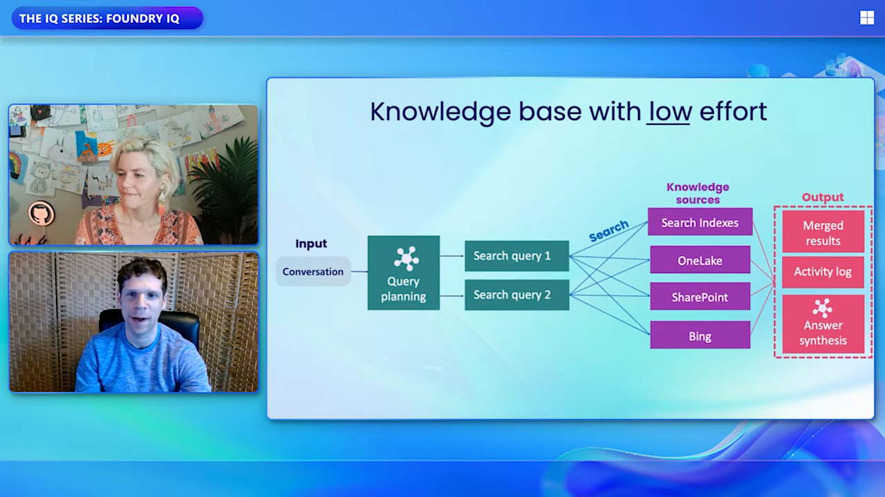
[Watch from 15:56](https://www.youtube.com/watch?v=BU59cYcz4WU&t=956s)

🧔 *Matt:*

Minimal is great, but low effort is where the characteristics of agentic retrieval really start to emerge. This is where you opt in to using an LLM for query planning — you give agentic retrieval a full conversation so it can generate focused subqueries and also select which knowledge sources are most relevant. If you're asking about product prices, maybe it doesn't need to search over all the HR policies.

## Demo: Low effort with a sample application

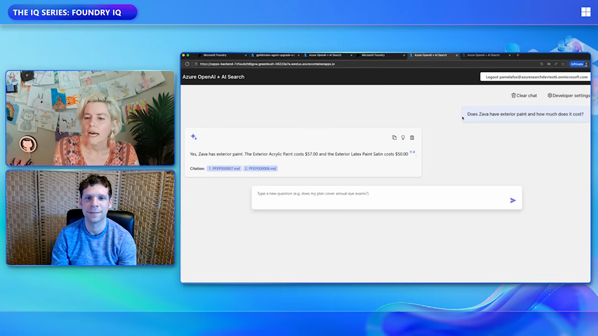
[Watch from 16:47](https://www.youtube.com/watch?v=BU59cYcz4WU&t=1007s)

💁‍♀️ *Pamela:*

We configure the same application to use low effort mode and ask "Does Zava have exterior paint and how much does it cost?" We get back an answer with the price and links to product descriptions from the search index.

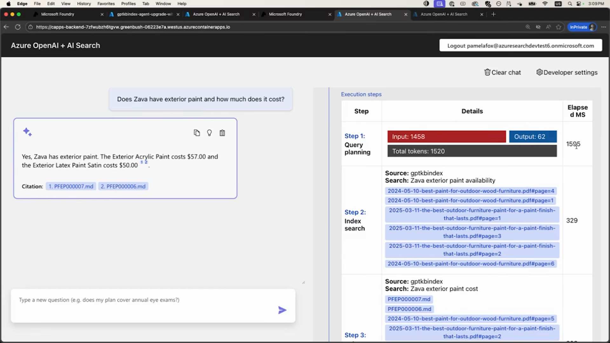

💁‍♀️ *Pamela:*

In the activity log, the very first step is query planning by the knowledge base itself, using about 1,520 tokens. It turned the question into two subqueries: "Zava exterior paint availability" and "Zava exterior paint cost." Then it did source selection — it looked at each source's description and decided it only needed the search index, skipping both the web and SharePoint. The index description says it has all the product descriptions and prices, so that's all it needs.

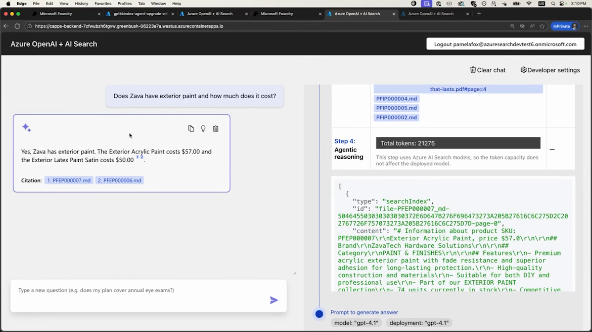

💁‍♀️ *Pamela:*

Both subqueries ran in parallel against just the search index, returning results including the Exterior Acrylic Paint at $57.00. The semantic ranking model merged results with 21,275 tokens, and then the application's own LLM generated the answer with citations.

Low mode is really nice because you get query planning built in — many developers might forget to do that, so you get it using best practices. You get source selection, so you save money — why search the web if you don't need to? Why search SharePoint if you don't need to?

## Medium effort: iterative retrieval

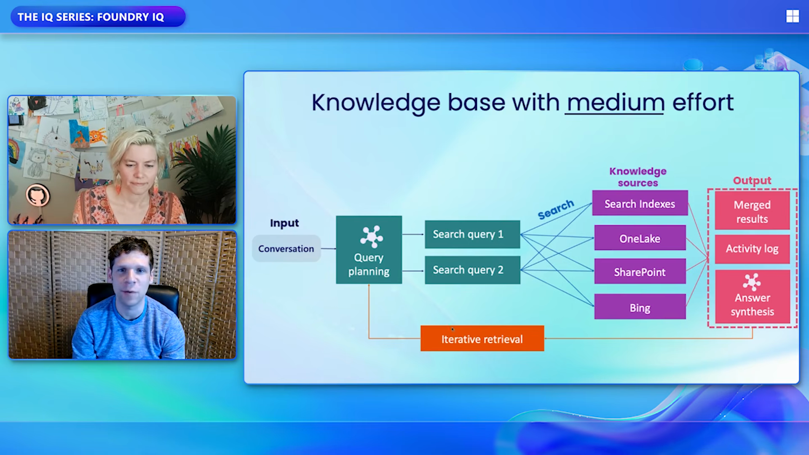
[Watch from 19:05](https://www.youtube.com/watch?v=BU59cYcz4WU&t=1145s)

🧔 *Matt:*

Our final effort level available today is medium, which offers the most comprehensive results. The key feature is iterative retrieval — instead of a single pass over knowledge sources, the system realizes "hey, I need to dig deeper" and performs an additional iteration.

We do a first search very similar to low — query planning, source selection — and then we evaluate the results. We have a special semantic classifier that looks at what we found and asks two questions: Is there enough information to answer the underlying information need? Did we find at least one highly relevant document? If either answer is no, we go back, take the documents we found and the queries we generated, and do query planning again.

This is really similar to how you'd research a problem yourself. You search, see some results, click on something, read it, and realize "Oh, I actually misunderstood something," so you do a second, more informed query. The second iteration benefits from what we found in the first — it knows what's there and what's missing, so it can refine queries in a targeted way. We stop at two iterations to balance thoroughness with latency.

## Demo: Medium effort with iterative retrieval

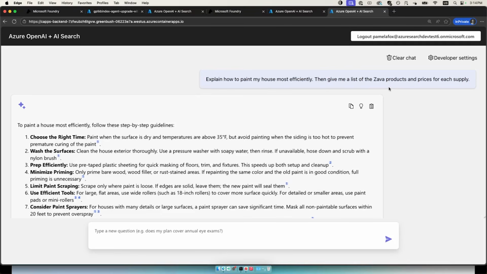
[Watch from 21:12](https://www.youtube.com/watch?v=BU59cYcz4WU&t=1272s)

💁‍♀️ *Pamela:*

This time we have our most complex question: "Explain how to paint my house most efficiently. Then give me a list of the Zava products and prices for each supply." This is what I'd call a dependent question — to answer the second part, we need the first part's answer. It's a two-part sequential question, so hopefully the iterative step will kick in.

We get a very long answer: step-by-step guidelines for efficient painting, tips like "use wide rollers," and then a list of Zava products with prices — Premium Interior Latex Flat ($40), Interior Eggshell Paint ($44), Interior Semi-Gloss Paint ($47). And we can see web sources for painting tips alongside Zava product documents, which is exactly what we'd hope for.

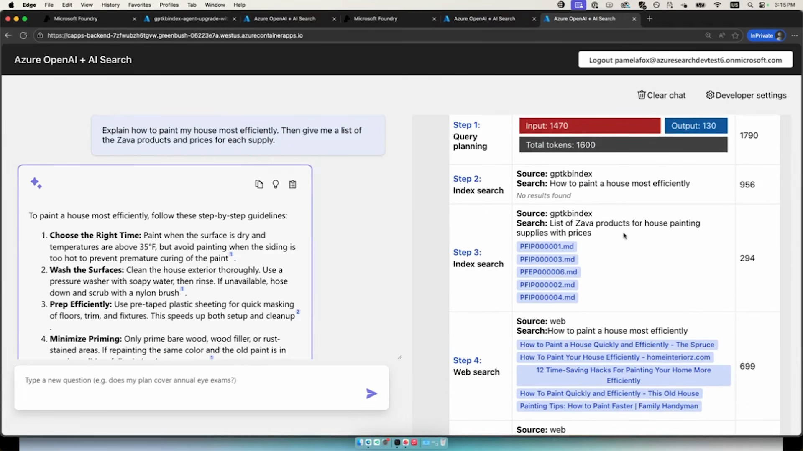

💁‍♀️ *Pamela:*

Let's check that activity log. Query planning took about 1,600 tokens and broke it down into two queries: "How to paint a house most efficiently" and "List of Zava products for house painting supplies with prices." It sent both to all three sources. The search index returned Zava product files, the web returned five painting guide URLs, and SharePoint returned nothing relevant. Bing found nothing for Zava products because Zava is a made-up company — probably a good thing it didn't find anything there.

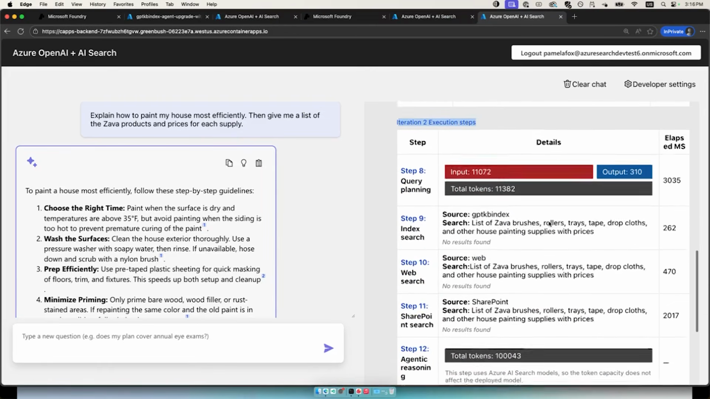

💁‍♀️ *Pamela:*

Then it goes through semantic classification and decides: are these results sufficient, or do we need a second retrieval? It decided yes, do a second retrieval. In this second iteration, it looked at the original query and all the results we got and asked "what's the next query we need?" This is where it gets really interesting — it got really specific: "Zava brushes, rollers, trays, tape, drop cloth, and other house painting supplies." It saw from the blog posts that we need rollers, and it didn't find any rollers earlier, so it searched for them. Unfortunately, it didn't find results because Zava just needs more products — if this was a real company, they'd know "hmm, people want rollers, we should get some."

After iteration two, the system did answer synthesis (11,692 input tokens, 667 output tokens). Answer synthesis is an option you can turn on where the knowledge base uses its own LLM to generate the entire answer — query planning, search, iteration, and response generation, the whole flow in one place. If you don't want it, you can turn it off. As a developer, I like having lots of options.

## Summary of effort levels

[Watch from 25:39](https://www.youtube.com/watch?v=BU59cYcz4WU&t=1539s)

💁‍♀️ *Pamela:*

So to recap: minimal uses the knowledge base as a unified search layer — your agent owns query strategy, we fan out and merge. Low adds LLM-powered query planning and smart source selection, good for most conversational scenarios. Medium adds iterative retrieval for complex queries requiring depth. There's no "high" effort yet — that's still a research question. You can do a lot experimenting with these three options.

## Knowledge bases as MCP servers

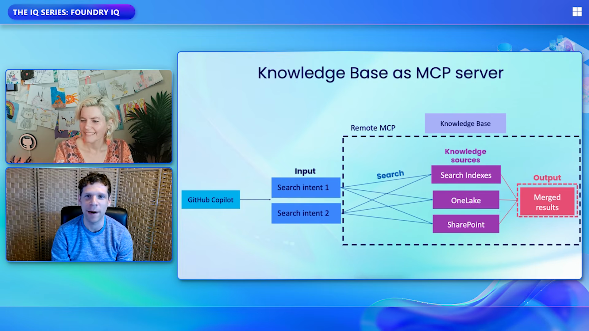
[Watch from 26:01](https://www.youtube.com/watch?v=BU59cYcz4WU&t=1561s)

🧔 *Matt:*

Now here's something cool. If you're using a coding agent — and most of us are — they typically accept what's called an MCP server, which is basically a way to expose a tool a language model can use. You can use a knowledge base as an MCP server. It exposes a `knowledge_base_retrieve` tool, and the same effort levels and capabilities we just covered become available to the coding agent. It can decide how to search, decompose queries into intents, and get back merged results from multiple sources.

## Demo: Knowledge base as MCP server in GitHub Copilot

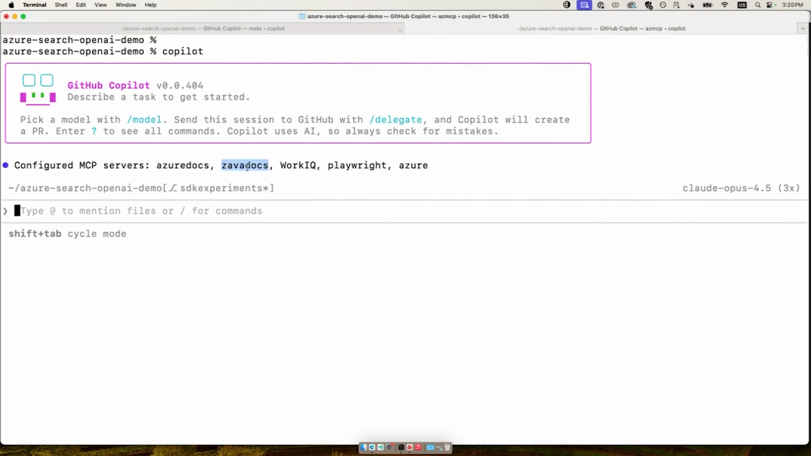
[Watch from 27:08](https://www.youtube.com/watch?v=BU59cYcz4WU&t=1628s)

💁‍♀️ *Pamela:*

I have GitHub Copilot running in my terminal, configured with a few MCP servers. One of them is `zavadocs` — the MCP endpoint for the knowledge base we've been using throughout. I ask "What Zava paint can I use for my bathroom?" and Copilot's LLM thinks about what it has available.

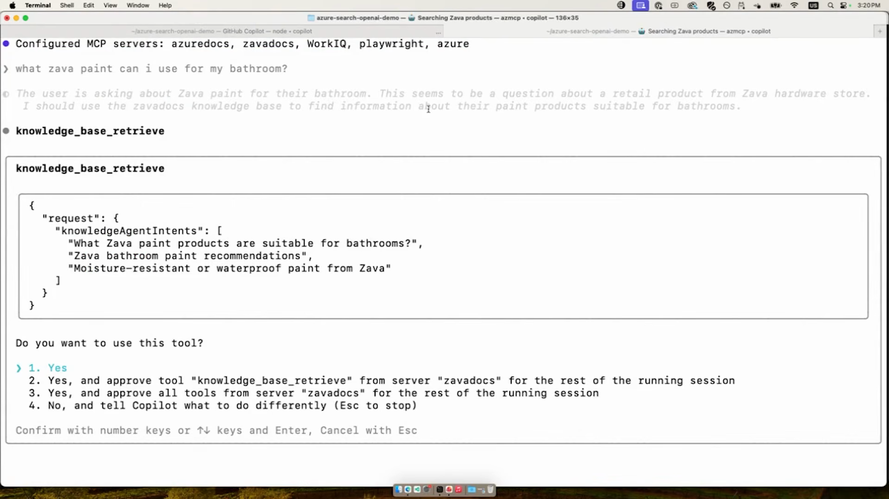

💁‍♀️ *Pamela:*

It decides to use the Zava docs knowledge base and turns my question into three intents: "What Zava paint products are suitable for bathrooms?", "Zava bathroom paint recommendations", and "moisture resistant or waterproof paint." That's actually a pretty clever transformation. After I approve the tool call, it runs the knowledge base retrieval and synthesizes an answer.

If you've got developer documentation, put it in a knowledge base, expose it as an MCP server, and your developers can query it while they're coding.

## Recap and resources

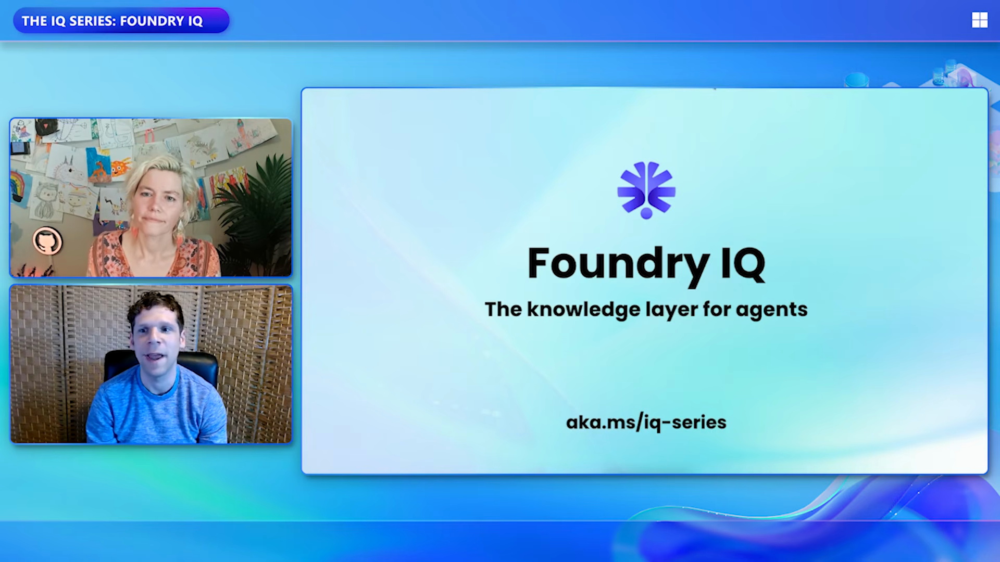
[Watch from 28:56](https://www.youtube.com/watch?v=BU59cYcz4WU&t=1736s)

🧔 *Matt:*

Knowledge bases are all about applying agentic methods of retrieval to your information. You can take complex queries and decompose them into simpler subqueries. Multiple knowledge sources — indexes, SharePoint, web — sit behind a single endpoint. Results merge together using semantic reranking. Effort levels let you control cost and latency: minimal for agent-driven queries where you control the planning, low for most conversational scenarios, and medium when you need iterative depth for really tough queries.

All resources and sample code are at [aka.ms/iqseries](https://aka.ms/iqseries).

💁‍♀️ *Pamela:*

For anyone who wants to dive deeper into Foundry IQ and knowledge bases, you can get all the resources and sample code at [aka.ms/iqseries](https://aka.ms/iqseries). Thank you so much to Matt for sharing all his knowledge, and thank you to everyone for watching today's session.

## Visual doodle summary

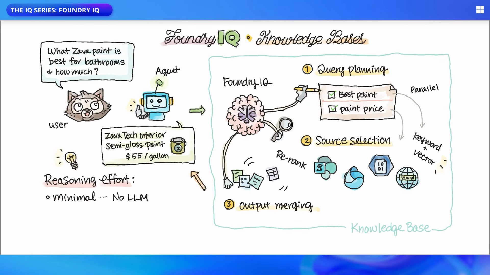
[Watch from 29:57](https://www.youtube.com/watch?v=BU59cYcz4WU&t=1797s)

👩‍🎨 *Tomomi:*

A knowledge base is a single endpoint in front of multiple knowledge sources. Instead of calling SharePoint, OneLake, and other sources separately, your agent makes one call. Inside the knowledge base: query planning breaks questions into intent-specific subqueries, source selection sends them to relevant sources in parallel (not sequentially), each source runs hybrid retrieval (keyword + vector search) with semantic reranking, and output merging combines results from all sources. Reasoning effort controls how much LLM processing happens: minimal uses no LLM inside retrieval, low uses LLM once per subquery for planning, and medium enables iterative retrieval when depth is required.

One endpoint, multi-source reasoning.
