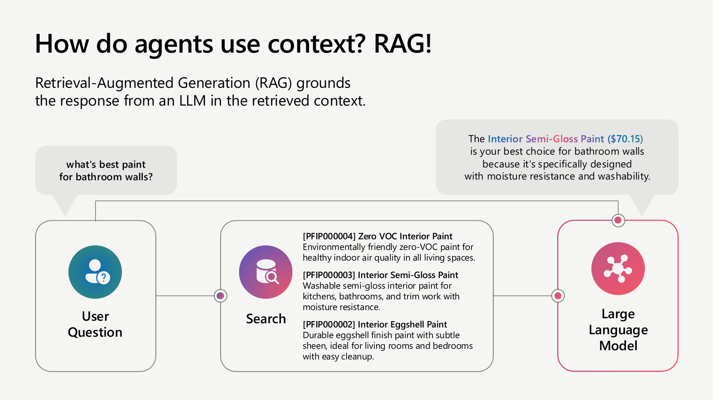
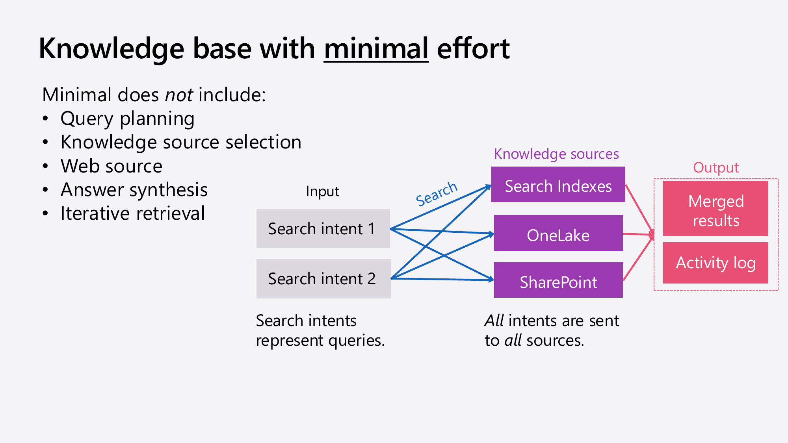
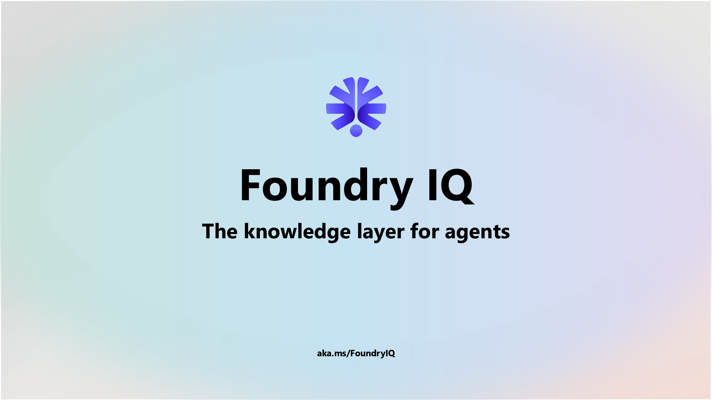
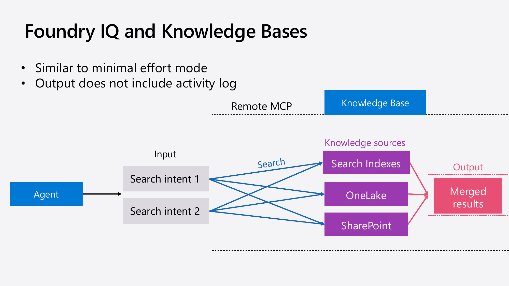

# Build agents with knowledge, agentic RAG and Azure AI Search

Building intelligent agentic applications requires effective integration of domain-specific knowledge with large language models (LLMs). Retrieval-Augmented Generation (RAG) is a key technique enabling LLMs to answer queries based on relevant information retrieved from external data sources. Azure AI Search enhances this approach by offering a robust hybrid search framework that combines keyword and vector search, re-ranking models, and advanced agentic retrieval capabilities. This talk explains how Azure AI Search supports complex retrieval and knowledge base scenarios to power next-generation agents.

## Table of Contents

- [Introduction to Retrieval-Augmented Generation (RAG)](#introduction-to-retrieval-augmented-generation-rag)  
- [The Role of Agents and Context in AI Applications](#the-role-of-agents-and-context-in-ai-applications)  
- [How RAG Grounds Agents Using Domain Knowledge](#how-rag-grounds-agents-using-domain-knowledge)  
- [Azure AI Search: Features for Advanced RAG](#azure-ai-search-features-for-advanced-rag)  
- [Hybrid Search: Combining Keyword and Vector Search](#hybrid-search-combining-keyword-and-vector-search)  
- [Keyword Search Explained](#keyword-search-explained)  
- [Vector Search Explained](#vector-search-explained)  
- [Merging Results with Reciprocal Rank Fusion](#merging-results-with-reciprocal-rank-fusion)  
- [Re-ranking for Improved Search Quality](#re-ranking-for-improved-search-quality)  
- [Complete Hybrid Search Workflow](#complete-hybrid-search-workflow)  
- [Research Supporting Hybrid Search Effectiveness](#research-supporting-hybrid-search-effectiveness)  
- [Limitations of Hybrid Search and Complex Queries](#limitations-of-hybrid-search-and-complex-queries)  
- [Knowledge Bases and Agentic Retrieval in Azure AI Search](#knowledge-bases-and-agentic-retrieval-in-azure-ai-search)  
- [Indexed and Remote Knowledge Sources](#indexed-and-remote-knowledge-sources)  
- [Remote SharePoint Knowledge Source](#remote-sharepoint-knowledge-source)  
- [Indexed SharePoint Data Ingestion](#indexed-sharepoint-data-ingestion)  
- [General Indexed Knowledge Source Strategy and AI Enrichment](#general-indexed-knowledge-source-strategy-and-ai-enrichment)  
- [Content Understanding Feature for Rich Document Representation](#content-understanding-feature-for-rich-document-representation)  
- [Retrieval Reasoning Effort Levels](#retrieval-reasoning-effort-levels)  
- [Minimal Effort Mode](#minimal-effort-mode)  
- [Low Effort Mode and Agentic Retrieval Engine](#low-effort-mode-and-agentic-retrieval-engine)  
- [Knowledge Source Selection in Low Effort Mode](#knowledge-source-selection-in-low-effort-mode)  
- [Customizing Answer Style and Tone](#customizing-answer-style-and-tone)  
- [Web Knowledge Source Integration](#web-knowledge-source-integration)  
- [Medium Effort Mode with Iterative Retrieval](#medium-effort-mode-with-iterative-retrieval)  
- [Demo: Medium Effort Handling Complex Queries](#demo-medium-effort-handling-complex-queries)  
- [Open Source Conversational RAG Repository](#open-source-conversational-rag-repository)  
- [Foundry IQ Integration with Knowledge Bases](#foundry-iq-integration-with-knowledge-bases)  
- [Foundry IQ Agent Demo Using Knowledge Base](#foundry-iq-agent-demo-using-knowledge-base)  

---

## Introduction to Retrieval-Augmented Generation (RAG)  

  
[Watch from 00:49](https://www.youtube.com/watch?v=lW47o2ss3Yg&t=49s)  

Retrieval-Augmented Generation (RAG) is a technique that combines LLMs with external information retrieval to provide grounded, accurate responses. Instead of relying solely on the LLM's internal knowledge, RAG uses a user query to search a knowledge base or search index, retrieving relevant documents or data chunks. These retrieved results are then fed into the LLM along with the original query, enabling the model to generate answers supported by actual source content and citations. This approach is essential for building agents that operate with domain-specific knowledge and ensures that responses reflect the most relevant and current information available.

---

## The Role of Agents and Context in AI Applications  

  
[Watch from 01:05](https://www.youtube.com/watch?v=lW47o2ss3Yg&t=65s)  

Agentic AI applications increasingly handle tasks beyond simple conversation by performing actions grounded in organizational data. Agents require domain-specific context to operate effectively, drawing on relevant information rather than generic knowledge. This context is critical to aligning agent behavior with user intent and organizational requirements. Retrieval mechanisms like RAG provide this grounding by connecting agents to structured or unstructured data repositories, ensuring that their actions and answers are informed by the appropriate knowledge base.

---

## How RAG Grounds Agents Using Domain Knowledge  

  
[Watch from 01:53](https://www.youtube.com/watch?v=lW47o2ss3Yg&t=113s)  

RAG enables grounding of agents by first converting a user question into a search query that retrieves relevant text chunks from a search index. These chunks, often accompanied by metadata like document IDs and scores, are then provided to an LLM alongside the original query. The LLM synthesizes an answer based on this retrieved context, generating responses that include citations to the source documents. This process bridges unstructured data and generative models, allowing agents to respond accurately to specific information needs within an organization's data.

---

## Azure AI Search: Features for Advanced RAG  

  
[Watch from 03:18](https://www.youtube.com/watch?v=lW47o2ss3Yg&t=198s)  

Azure AI Search offers a comprehensive vector database built on a scalable, enterprise-grade platform. It supports end-to-end data ingestion, indexing, and retrieval pipelines for diverse data types. Its full-stack RAG capabilities include hybrid search combining keyword and vector retrieval, advanced re-ranking models, and integration with AI enrichment skills. These features allow developers to build sophisticated retrieval strategies tailored to their use cases, ensuring accurate and relevant information retrieval at scale.

---

## Hybrid Search: Combining Keyword and Vector Search  

  
[Watch from 04:12](https://www.youtube.com/watch?v=lW47o2ss3Yg&t=252s)  

Hybrid search merges keyword-based retrieval, which excels at precise term matching, with vector search, which captures semantic similarity in high-dimensional embedding spaces. Azure AI Search implements this by performing both searches in parallel and merging their results using Reciprocal Rank Fusion (RRF). This combined approach outperforms either method alone, balancing exact matches with conceptually related content and improving overall retrieval relevance.

---

## Keyword Search Explained  

  
[Watch from 05:32](https://www.youtube.com/watch?v=lW47o2ss3Yg&t=332s)  

Keyword search relies on an inverted document index mapping terms to document occurrences. Azure AI Search employs BM25, a top-performing full-text ranking algorithm, to score documents based on term frequency and document length normalization. This method is effective for straightforward queries with explicit keywords, as shown in the demo retrieving a 25-foot hose product. However, keyword search struggles with broader or ambiguous queries where exact term matching is insufficient.

---

## Vector Search Explained  

  
[Watch from 07:00](https://www.youtube.com/watch?v=lW47o2ss3Yg&t=420s)  

Vector search encodes documents and queries into dense numerical vectors representing semantic meaning. Using embedding models like OpenAI’s text embeddings, documents are mapped into a multidimensional space where proximity reflects conceptual similarity. Queries are similarly embedded and matched to the nearest vectors, enabling retrieval of relevant documents even without shared keywords. Azure AI Search supports efficient vector search at scale using approximate nearest neighbor algorithms like HNSW, capable of handling billions of vectors.

---

## Merging Results with Reciprocal Rank Fusion  

  
[Watch from 10:20](https://www.youtube.com/watch?v=lW47o2ss3Yg&t=620s)  

Reciprocal Rank Fusion is a technique for combining ranked lists from different retrieval methods by averaging the reciprocal of their rank positions. It aggregates the relative importance of a document across keyword and vector search results, boosting items consistently ranked highly by both. This simple yet effective fusion strategy balances strengths of each retrieval type and produces a unified, more accurate ranking.

---

## Re-ranking for Improved Search Quality  

  
[Watch from 12:01](https://www.youtube.com/watch?v=lW47o2ss3Yg&t=721s)  

Re-ranking applies a cross-encoder model trained to score the relevance of each document against the user query. Unlike the initial retrieval steps, this model jointly processes the query and candidate document to produce a precise relevance score, learned from human judgments. Azure AI Search uses this semantic re-ranker to refine the fused results, promoting the most relevant documents to the top. The re-ranker's scoring also provides an absolute quality threshold, allowing filtering of low-quality matches.

---

## Complete Hybrid Search Workflow  

  
[Watch from 14:10](https://www.youtube.com/watch?v=lW47o2ss3Yg&t=850s)  

The hybrid search workflow in Azure AI Search consists of executing parallel keyword and vector searches, merging results with Reciprocal Rank Fusion, and refining the merged list with a semantic re-ranking model. This layered approach maximizes retrieval accuracy across diverse query types and data sets. Implementing this stack is critical for high-quality search experiences in generative AI applications.

---

## Research Supporting Hybrid Search Effectiveness  

  
[Watch from 15:16](https://www.youtube.com/watch?v=lW47o2ss3Yg&t=916s)  

Extensive research across short and long queries, keyword-based and conceptual questions, confirms that hybrid search consistently outperforms singular retrieval methods. This robustness is essential for real-world applications where user input is unpredictable and varied. Azure AI Search’s hybrid stack is a proven foundation for reliable, scalable retrieval in agentic AI.

---

## Limitations of Hybrid Search and Complex Queries  

  
[Watch from 15:37](https://www.youtube.com/watch?v=lW47o2ss3Yg&t=937s)  

Hybrid search may falter with complex queries requiring decomposition, chaining, or external knowledge. Examples include multi-part questions needing separate answers, chained queries where one answer informs the next, and queries requiring up-to-date web knowledge. Addressing these requires agentic retrieval strategies that break down intent, select appropriate knowledge sources, and iteratively synthesize answers.

---

## Knowledge Bases and Agentic Retrieval in Azure AI Search  

  
[Watch from 16:57](https://www.youtube.com/watch?v=lW47o2ss3Yg&t=1017s)  

Azure AI Search knowledge bases integrate an Agentic Retrieval engine designed to enhance RAG by managing query planning, knowledge source selection, and result merging. The engine uses LLMs to decompose complex conversations into individual queries, determines which knowledge sources to query, and synthesizes merged output answers with citations. It can perform multi-pass retrieval to improve answer quality when initial results are insufficient.

---

## Indexed and Remote Knowledge Sources  

  
[Watch from 18:49](https://www.youtube.com/watch?v=lW47o2ss3Yg&t=1129s)  

Knowledge sources in Azure AI Search fall into two categories: indexed and remote. Indexed sources involve copying data from repositories like blobs or SharePoint into search indexes with vectorization and AI enrichment. Remote sources maintain data in place and query it live, such as web search or direct SharePoint queries with user identity-based access control. Each type serves different use cases depending on data freshness, access control, and latency requirements.

---

## Remote SharePoint Knowledge Source  

  
[Watch from 19:53](https://www.youtube.com/watch?v=lW47o2ss3Yg&t=1193s)  

Remote SharePoint knowledge sources query SharePoint content live using the end user's identity to enforce access controls. This ensures users only see documents they are authorized to view. The integration mirrors Microsoft Copilot’s data access approach, leveraging the same underlying SharePoint index. This live querying avoids data duplication while maintaining security and compliance.

---

## Indexed SharePoint Data Ingestion  

  
[Watch from 20:44](https://www.youtube.com/watch?v=lW47o2ss3Yg&t=1244s)  

Indexed SharePoint integration extracts files from SharePoint and ingests them into Azure AI Search indexes using indexers and AI enrichment skill sets. The indexer fetches documents, while skill sets chunk and vectorize content, enabling hybrid search. Permission metadata is preserved to allow filtering results by user identity during retrieval, combining the benefits of local indexing with security.

---

## General Indexed Knowledge Source Strategy and AI Enrichment  

  
[Watch from 21:27](https://www.youtube.com/watch?v=lW47o2ss3Yg&t=1287s)  

Indexed knowledge sources leverage reusable AI enrichment components called skills that process and transform raw data into optimized searchable content. These skills perform functions like chunking, vectorization, and metadata extraction, improving retrieval effectiveness. The indexing pipeline supports diverse data types and repositories, enabling consistent, high-quality search across organizational knowledge.

---

## Content Understanding Feature for Rich Document Representation  

  
[Watch from 21:52](https://www.youtube.com/watch?v=lW47o2ss3Yg&t=1312s)  

A new content understanding feature enhances document indexing by extracting rich semantic information from complex elements such as images, tables, and diagrams. Instead of minimal parsing, this approach uses OCR and structural tagging to make embedded text and visuals accessible for LLM reasoning. This results in more comprehensive search and generation capabilities, especially for technical or graphical content.

---

## Retrieval Reasoning Effort Levels  

  
[Watch from 23:00](https://www.youtube.com/watch?v=lW47o2ss3Yg&t=1380s)  

Azure AI Search knowledge bases offer configurable retrieval reasoning effort levels controlling the depth of query processing and retrieval:  
- Minimal effort prioritizes low latency and bypasses LLM planning, directly querying all sources.  
- Low effort engages the agentic retrieval engine with query planning and knowledge source selection using an LLM.  
- Medium effort adds iterative retrieval with a semantic classifier model to re-plan queries when initial results are insufficient, improving answer completeness.

---

## Minimal Effort Mode  

  
[Watch from 23:57](https://www.youtube.com/watch?v=lW47o2ss3Yg&t=1437s)  

Minimal effort mode performs direct querying of all configured knowledge sources without LLM-driven query decomposition. It suits scenarios demanding fast responses with moderate complexity. Queries are sent simultaneously to sources like search indexes and SharePoint, and results are merged using semantic ranking. This mode is easy to integrate into existing applications by swapping retrieval calls for multi-source querying.

---

## Low Effort Mode and Agentic Retrieval Engine  

  
[Watch from 26:32](https://www.youtube.com/watch?v=lW47o2ss3Yg&t=1592s)  

Low effort mode activates the agentic retrieval engine’s core features. It uses an LLM to analyze entire conversations, decomposing them into multiple precise queries. The engine dynamically selects which knowledge sources to query based on metadata and custom instructions, optimizing cost and latency. Retrieved documents from selected sources are synthesized into a unified, citation-backed answer. This mode balances sophistication and efficiency.

---

## Knowledge Source Selection in Low Effort Mode  

  
[Watch from 27:21](https://www.youtube.com/watch?v=lW47o2ss3Yg&t=1641s)  

Knowledge source selection uses three inputs to guide the LLM’s decision: the source name, an optional descriptive summary of its contents or purpose, and custom retrieval instructions phrased in natural language. This contextual information enables the LLM to intelligently choose relevant sources for each decomposed query, preventing unnecessary searches and reducing resource consumption while maintaining answer accuracy.

---

## Customizing Answer Style and Tone  

  
[Watch from 30:02](https://www.youtube.com/watch?v=lW47o2ss3Yg&t=1802s)  

Azure AI Search allows customization of the generated answer’s style and tone via natural language instructions. Examples include default verbose responses, succinct bullet-point formats, or even stylized poetic renditions. This flexibility lets developers tailor agent responses to suit branding, user preferences, or interaction context, enhancing user engagement and experience.

---

## Web Knowledge Source Integration  

  
[Watch from 31:08](https://www.youtube.com/watch?v=lW47o2ss3Yg&t=1868s)  

The Bing Web knowledge source provides access to fresh, public web content to complement internal organizational data. It enables querying the entire web or a curated domain list, expanding knowledge coverage. Answer synthesis is mandatory when using web sources to produce integrated responses with citations linking back to web pages. This enriches agents’ ability to handle questions requiring external or up-to-date information.

---

## Medium Effort Mode with Iterative Retrieval  

  
[Watch from 33:14](https://www.youtube.com/watch?v=lW47o2ss3Yg&t=1994s)  

Medium effort mode extends low effort with an iterative retrieval step guided by a semantic classifier model. This model assesses whether initial retrieval results sufficiently answer the queries and if at least one highly relevant document was found. If not, the engine performs a second pass of query planning and retrieval, informed by previously retrieved documents, to refine and improve results. This approach improves answer completeness for complex or ambiguous queries.

---

## Demo: Medium Effort Handling Complex Queries  

  
[Watch from 35:07](https://www.youtube.com/watch?v=lW47o2ss3Yg&t=2107s)  

A complex query requesting painting instructions and product pricing is decomposed into multiple subqueries. The first iteration retrieves results primarily from the web, while the second iteration refines search queries to target internal product data. This demonstrates medium effort’s ability to iteratively improve answers by combining diverse sources and adjusting retrieval based on partial results, providing comprehensive, accurate responses.

---

## Open Source Conversational RAG Repository  

  
[Watch from 36:52](https://www.youtube.com/watch?v=lW47o2ss3Yg&t=2212s)  

An open source repository implementing conversational RAG with agentic retrieval features is available as a reference and starting point. It supports multimodal data, cloud ingestion, and scalable conversational workflows. Thousands of developers have deployed this solution, making it a valuable resource for teams building domain-specific AI agents using Azure AI Search technologies.

---

## Foundry IQ Integration with Knowledge Bases  

  
[Watch from 37:38](https://www.youtube.com/watch?v=lW47o2ss3Yg&t=2258s)  

Foundry IQ integrates knowledge bases with agents via the Microsoft Communication Protocol (MCP). It acts as a unified knowledge layer, simplifying agent development by delegating retrieval and synthesis tasks to connected knowledge bases. Agents use MCP to send multiple intents or queries to knowledge bases and receive merged, citation-backed results, reducing the complexity of stitching multiple retrieval tools.

---

## Foundry IQ Agent Demo Using Knowledge Base  

  
[Watch from 38:50](https://www.youtube.com/watch?v=lW47o2ss3Yg&t=2330s)  

The Foundry IQ agent playground provides a unified interface for building and testing agents with integrated knowledge sources. It supports customized instructions and real-time evaluation of agent responses. The demo shows querying the same knowledge base used earlier, accessed through MCP, yielding consistent answers with citations. This showcases how Foundry IQ facilitates deployment of knowledge-grounded agents at scale.

---

This detailed breakdown illustrates the layered architecture and advanced retrieval strategies in Azure AI Search that underpin effective RAG applications. Through hybrid search, dynamic knowledge source management, and iterative retrieval reasoning, developers can build intelligent agents capable of handling complex queries with accurate, context-rich answers. Integration with Foundry IQ further streamlines agent creation, enabling unified access to diverse knowledge repositories. The accompanying open source resources provide practical tools to accelerate development of conversational AI grounded in organizational data.