# Building agents with Knowledge Agentic, RAG, and Azure AI Search

This talk introduces techniques for building intelligent agentic applications by combining Retrieval-Augmented Generation (RAG) with Azure AI Search. It covers foundational concepts of RAG, demonstrates hybrid search strategies that merge keyword and vector retrieval with re-ranking for improved accuracy, and explores advanced agentic retrieval features within Azure AI Search knowledge bases. The session also highlights integration with Foundry IQ to create unified knowledge layers for agents, illustrating how to effectively manage complex queries, diverse knowledge sources, and retrieval reasoning efforts.

## Table of contents

- [Introduction and agenda](#introduction-and-agenda)
- [Understanding Retrieval-Augmented Generation (RAG)](#understanding-retrieval-augmented-generation-rag)
- [The need for context in agentic applications](#the-need-for-context-in-agentic-applications)
- [Azure AI Search for advanced generative AI applications](#azure-ai-search-for-advanced-generative-ai-applications)
- [Hybrid search combines keyword and vector retrieval](#hybrid-search-combines-keyword-and-vector-retrieval)
- [Keyword search and its indexing method](#keyword-search-and-its-indexing-method)
- [Vector search and embedding-based similarity](#vector-search-and-embedding-based-similarity)
- [Reciprocal rank fusion to merge search results](#reciprocal-rank-fusion-to-merge-search-results)
- [Re-ranking model for improved search result quality](#re-ranking-model-for-improved-search-result-quality)
- [Complete hybrid search workflow](#complete-hybrid-search-workflow)
- [Importance and research behind hybrid search](#importance-and-research-behind-hybrid-search)
- [When hybrid search isn’t enough: handling complex queries](#when-hybrid-search-isnt-enough-handling-complex-queries)
- [Knowledge bases in Azure AI Search](#knowledge-bases-in-azure-ai-search)
- [Agentic retrieval engine architecture](#agentic-retrieval-engine-architecture)
- [Indexed and remote knowledge sources](#indexed-and-remote-knowledge-sources)
- [Remote SharePoint knowledge source integration](#remote-sharepoint-knowledge-source-integration)
- [Indexed SharePoint knowledge ingestion](#indexed-sharepoint-knowledge-ingestion)
- [General indexed knowledge source strategy and AI enrichment](#general-indexed-knowledge-source-strategy-and-ai-enrichment)
- [New content understanding feature for richer document representation](#new-content-understanding-feature-for-richer-document-representation)
- [Retrieval reasoning effort levels: minimal, low, medium](#retrieval-reasoning-effort-levels-minimal-low-medium)
- [Minimal effort mode and demo](#minimal-effort-mode-and-demo)
- [Low effort mode with agentic retrieval engine](#low-effort-mode-with-agentic-retrieval-engine)
- [Knowledge source selection process in low effort mode](#knowledge-source-selection-process-in-low-effort-mode)
- [Low effort demo with query planning and source selection](#low-effort-demo-with-query-planning-and-source-selection)
- [Customizing answer style and tone with natural language instructions](#customizing-answer-style-and-tone-with-natural-language-instructions)
- [Web knowledge source feature and demo](#web-knowledge-source-feature-and-demo)
- [Medium effort mode with iterative retrieval and semantic classifier](#medium-effort-mode-with-iterative-retrieval-and-semantic-classifier)
- [Medium effort demo: handling complex queries with iteration](#medium-effort-demo-handling-complex-queries-with-iteration)
- [Open source repo for conversational RAG applications](#open-source-repo-for-conversational-rag-applications)
- [Using knowledge bases with Foundry IQ for unified agent knowledge](#using-knowledge-bases-with-foundry-iq-for-unified-agent-knowledge)
- [Demo of Foundry IQ agent using knowledge base via MCP](#demo-of-foundry-iq-agent-using-knowledge-base-via-mcp)
- [Q&A](#qa)

## Introduction and agenda

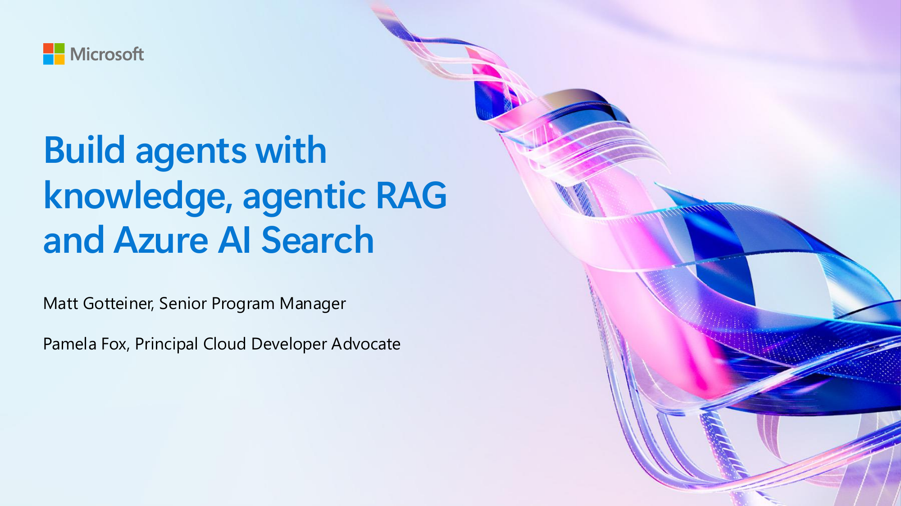
[Watch from 00:00](https://www.youtube.com/watch?v=lW47o2ss3Yg&t=0s)

The session begins by welcoming attendees and outlining the agenda. It covers basics of Retrieval-Augmented Generation (RAG), a deep dive into knowledge bases powered by Azure AI Search, the connection between Foundry and knowledge bases via Foundry IQ, and a Q&A segment. This sets the stage for understanding how to build agentic workflows leveraging search and generative AI.

## Understanding Retrieval-Augmented Generation (RAG)

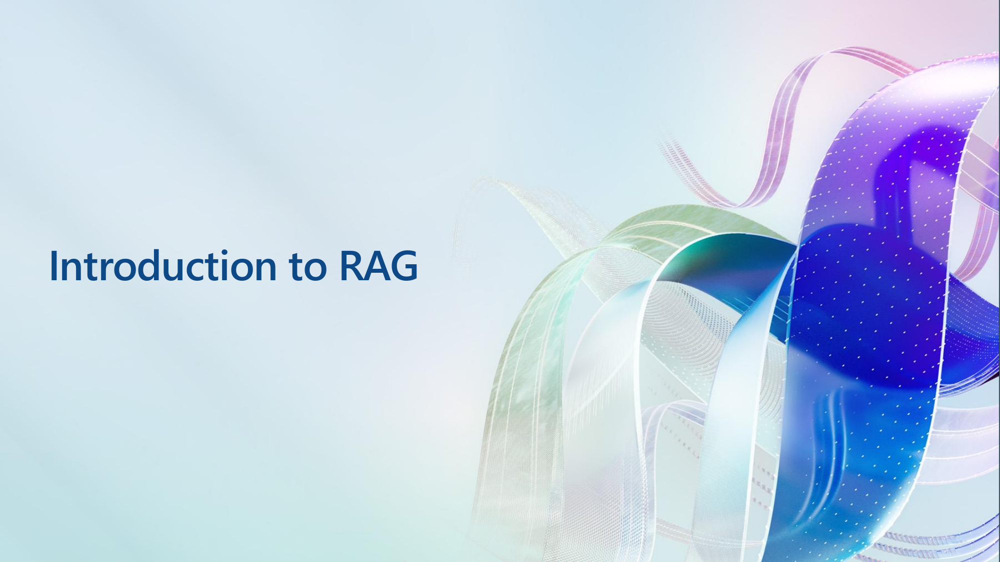
[Watch from 00:49](https://www.youtube.com/watch?v=lW47o2ss3Yg&t=49s)

RAG is a method that enhances large language models (LLMs) by grounding their responses in external data. When a user query is received, it is used to retrieve relevant documents from a search index. The retrieved results are then provided to the LLM along with the original question to generate a precise answer supported by citations. This approach enables agents to access domain-specific knowledge rather than relying solely on the model's pretrained data.

## The need for context in agentic applications

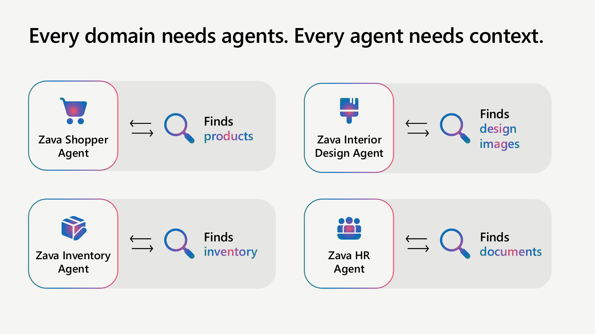
[Watch from 01:11](https://www.youtube.com/watch?v=lW47o2ss3Yg&t=71s)

Agentic applications increasingly require grounding in organizational data to perform tasks effectively. Conversational and task-oriented agents both benefit from having domain-specific context to deliver accurate and relevant responses. Retrieval and RAG techniques provide this grounding by retrieving pertinent information that the agent can reason over, enabling more capable and trustworthy interactions.

## Azure AI Search for advanced generative AI applications

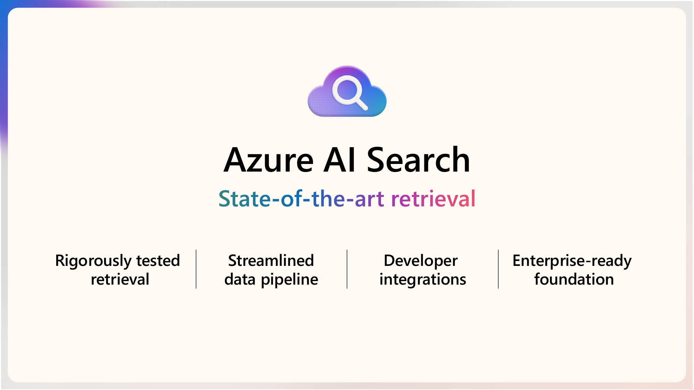
[Watch from 03:18](https://www.youtube.com/watch?v=lW47o2ss3Yg&t=198s)

Azure AI Search offers a feature-rich, enterprise-grade vector database combined with comprehensive data management pipelines. It supports full-stack RAG solutions that allow developers to build retrieval strategies tailored to their data and use cases. Its extensible architecture goes beyond vector search by integrating keyword search, ranking, and advanced agentic retrieval features for improved accuracy and scalability.

## Hybrid search combines keyword and vector retrieval

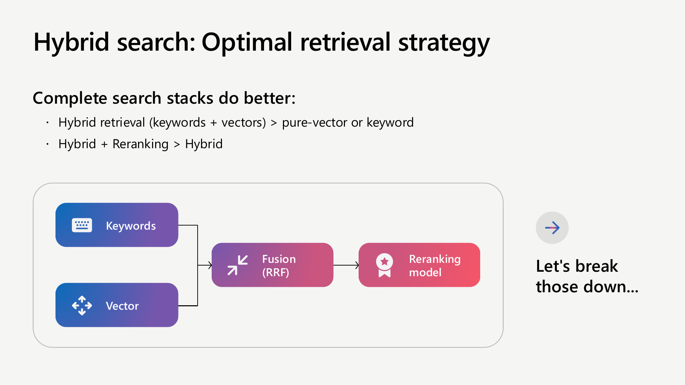
[Watch from 04:12](https://www.youtube.com/watch?v=lW47o2ss3Yg&t=252s)

Hybrid search merges keyword search and vector search to leverage their complementary strengths. Keyword search excels at matching exact terms using inverted indexes and classic ranking algorithms like BM25, while vector search uses embeddings to capture semantic similarity. Azure AI Search combines these with reciprocal rank fusion and a re-ranking step to produce high-quality, relevant results that work well across diverse query types.

## Keyword search and its indexing method

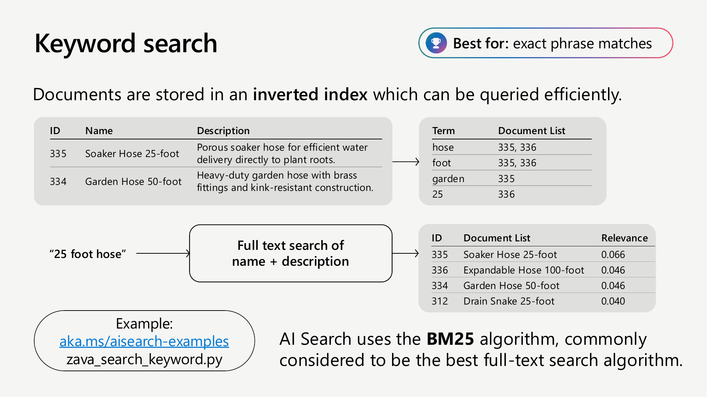
[Watch from 05:32](https://www.youtube.com/watch?v=lW47o2ss3Yg&t=332s)

Keyword search relies on an inverted document index mapping terms to their occurrence frequencies within documents. BM25, a state-of-the-art full-text retrieval algorithm, scores documents based on term frequency and document length to rank results. This approach performs well for precise, keyword-rich queries but struggles with more ambiguous or conceptual searches.

## Vector search and embedding-based similarity

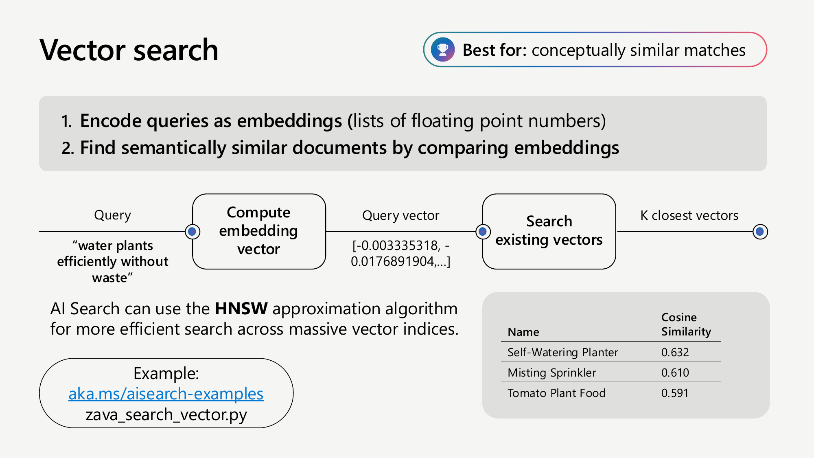
[Watch from 07:00](https://www.youtube.com/watch?v=lW47o2ss3Yg&t=420s)

Vector search transforms documents and queries into high-dimensional vectors using embedding models, capturing semantic meaning beyond exact keywords. Similarity is computed by measuring distance in vector space, enabling retrieval of conceptually related content. Azure AI Search supports large-scale vector search using approximate nearest neighbor algorithms like HNSW, allowing efficient handling of billions of vectors.

## Reciprocal rank fusion to merge search results

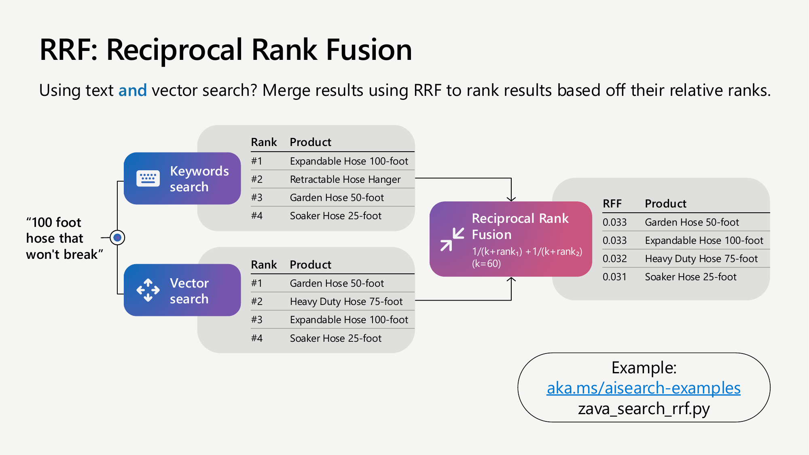
[Watch from 10:20](https://www.youtube.com/watch?v=lW47o2ss3Yg&t=620s)

Reciprocal Rank Fusion (RRF) is a method to combine ranked lists from keyword and vector search by considering the relative ranks of each result. It averages reciprocal ranks to produce a merged ranking that balances the strengths of both retrieval methods. This simple yet effective technique improves overall recall and precision by integrating diverse signals.

## Re-ranking model for improved search result quality

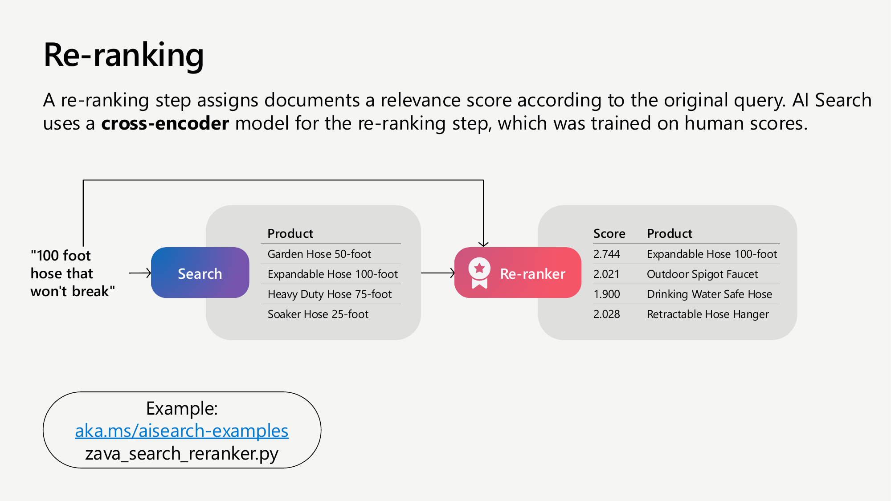
[Watch from 12:01](https://www.youtube.com/watch?v=lW47o2ss3Yg&t=721s)

After merging results, a re-ranking model refines the ordering by scoring each candidate's relevance to the query with a cross-encoder architecture. Unlike embedding-based models, this model jointly considers the query and document to assign fine-grained relevance scores, trained on human-annotated data. The re-ranker boosts the best matches to the top and can filter out poor results by applying score thresholds.

## Complete hybrid search workflow

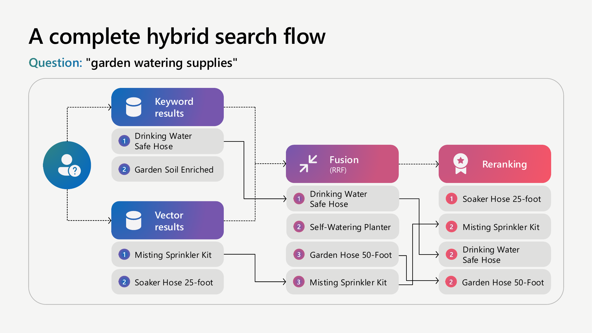
[Watch from 14:10](https://www.youtube.com/watch?v=lW47o2ss3Yg&t=850s)

The hybrid search workflow starts by executing both keyword and vector searches in parallel. Their results are merged using reciprocal rank fusion, then passed through the re-ranking step for quality refinement. This layered approach ensures robust retrieval across query types, maximizing accuracy and relevance for downstream generative AI tasks.

## Importance and research behind hybrid search

[Watch from 15:16](https://www.youtube.com/watch?v=lW47o2ss3Yg&t=916s)

Extensive research confirms that hybrid search consistently outperforms standalone keyword or vector search across diverse query types, including short, long, and conceptual queries. This justifies adopting the full hybrid stack with re-ranking for production-grade applications to deliver reliable, high-quality results in real-world scenarios.

## When hybrid search isn’t enough: handling complex queries

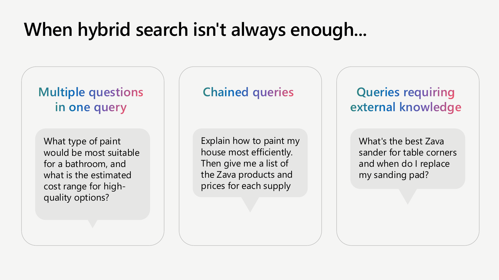
[Watch from 15:37](https://www.youtube.com/watch?v=lW47o2ss3Yg&t=937s)

Certain complex queries require more than retrieval; examples include multi-part questions, chained queries needing sequential retrieval steps, and queries that demand external knowledge beyond organizational data. These cases motivate augmenting hybrid search with agentic retrieval strategies that decompose queries, select relevant sources dynamically, and allow iterative reasoning.

## Knowledge bases in Azure AI Search

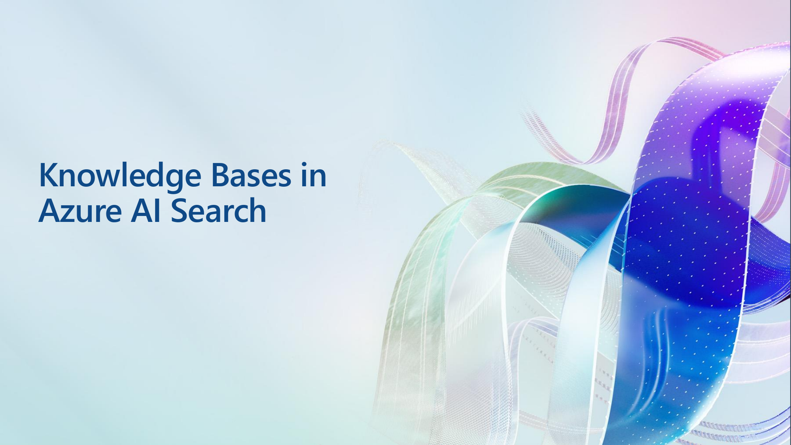
[Watch from 16:57](https://www.youtube.com/watch?v=lW47o2ss3Yg&t=1017s)

Azure AI Search knowledge bases serve as reusable, topic-centric data collections that provide structured context for agents. They enable agents to ground their responses in curated content, improving accuracy and domain relevance. Knowledge bases integrate tightly with agentic retrieval features to support complex conversational and task-oriented workflows.

## Agentic retrieval engine architecture

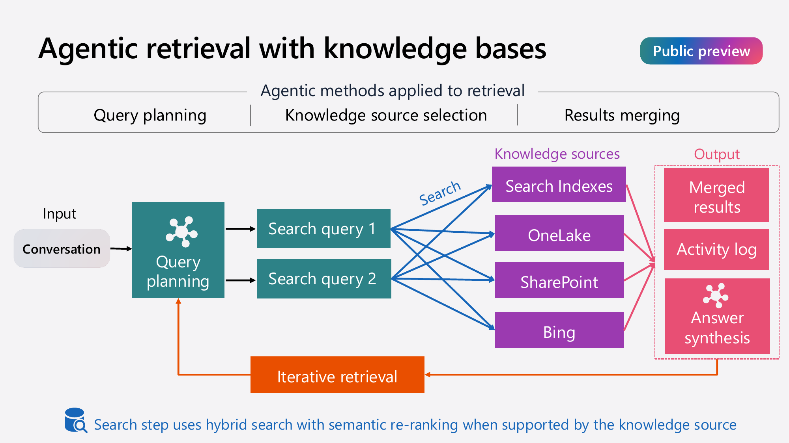
[Watch from 17:33](https://www.youtube.com/watch?v=lW47o2ss3Yg&t=1053s)

The agentic retrieval engine comprises three core components: query planning, knowledge source selection, and merged output generation. It uses an LLM to decompose complex conversations into individual queries, determines which knowledge sources to query, retrieves documents from selected sources, and synthesizes a final answer with citations. It can perform iterative retrieval passes to improve completeness.

## Indexed and remote knowledge sources

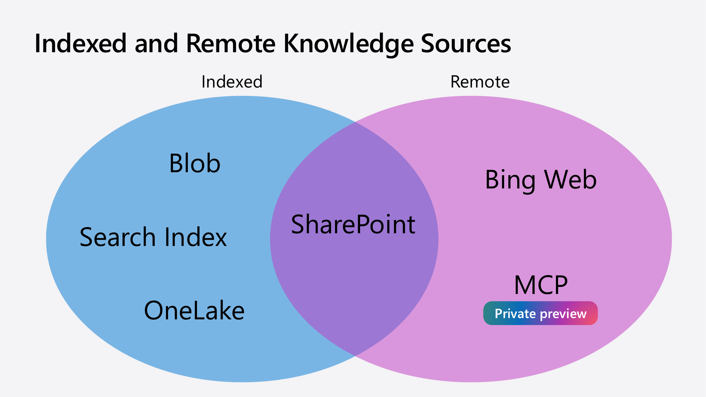
[Watch from 18:49](https://www.youtube.com/watch?v=lW47o2ss3Yg&t=1129s)

Knowledge sources fall into two categories: indexed and remote. Indexed sources involve copying data from original repositories (e.g., PDFs in blob storage) into Azure AI Search indexes optimized for hybrid search. Remote sources maintain data in place and query it live at retrieval time, such as SharePoint accessed via user identity or web content via Bing. Both are integrated seamlessly in agentic retrieval.

## Remote SharePoint knowledge source integration

[Watch from 19:53](https://www.youtube.com/watch?v=lW47o2ss3Yg&t=1193s)

When querying SharePoint as a remote knowledge source, the system uses the end user's identity to enforce access controls, ensuring results respect document permissions. This direct query avoids data duplication and preserves security boundaries. It shares the underlying index technology with Microsoft Copilot, providing a familiar and consistent experience.

## Indexed SharePoint knowledge ingestion

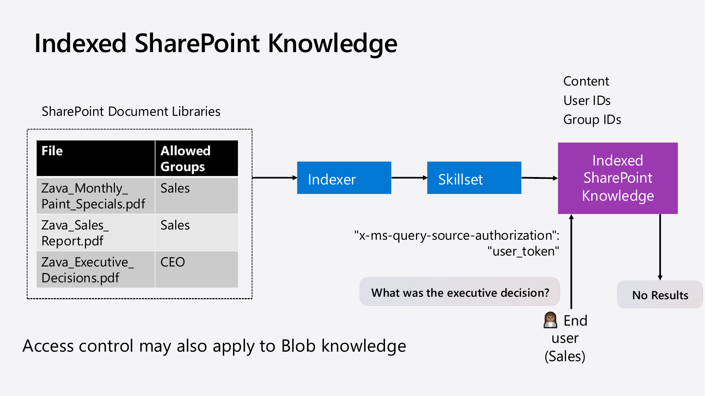
[Watch from 20:44](https://www.youtube.com/watch?v=lW47o2ss3Yg&t=1244s)

Indexed SharePoint knowledge involves extracting files from SharePoint and copying them into an Azure Search index using indexers and skillsets. Indexers fetch documents, while skillsets chunk and vectorize content for hybrid search. Permissions metadata is preserved to enable filtering by user identity, combining the benefits of indexing with secure access control.

## General indexed knowledge source strategy and AI enrichment

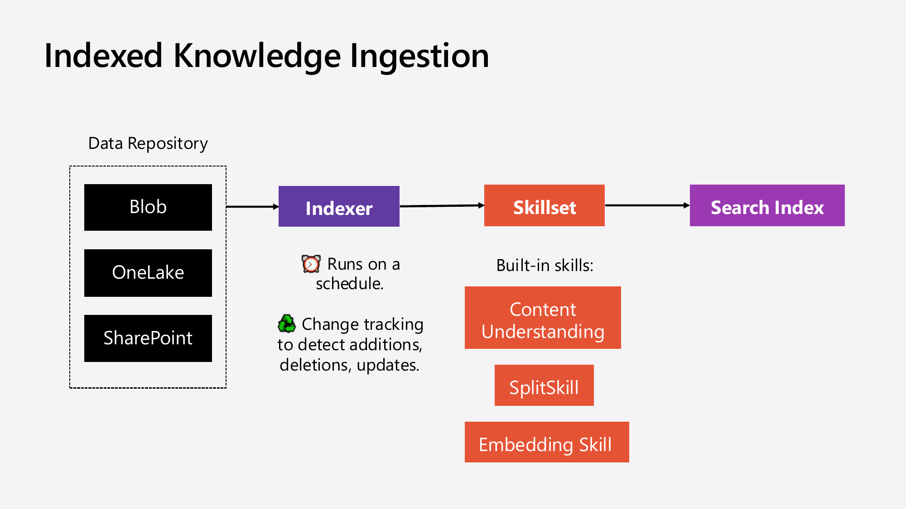
[Watch from 21:27](https://www.youtube.com/watch?v=lW47o2ss3Yg&t=1287s)

Indexed knowledge sources leverage reusable AI enrichment components called skills within skillsets to improve search quality. These enrichments include chunking, vectorization, and content understanding features that transform raw documents into structured, semantically rich representations. This process enables more effective retrieval and reasoning over complex content.

## New content understanding feature for richer document representation

[Watch from 21:52](https://www.youtube.com/watch?v=lW47o2ss3Yg&t=1312s)

A newly announced feature enhances content understanding during indexing by leveraging a dedicated content understanding deployment. This produces richer representations of documents, including embedded images, tables, and diagrams. For example, text in flowcharts is OCR'ed and tagged, making it accessible for LLM reasoning, which improves answer accuracy for visually complex content.

## Retrieval reasoning effort levels: minimal, low, medium

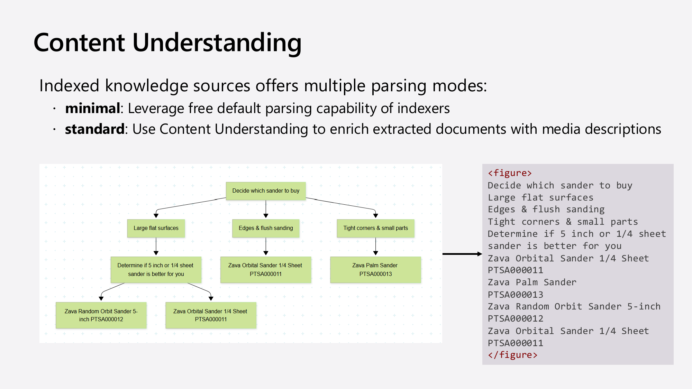
[Watch from 23:00](https://www.youtube.com/watch?v=lW47o2ss3Yg&t=1380s)

Azure AI Search offers three retrieval reasoning effort modes that balance cost, latency, and comprehensiveness. Minimal effort provides fast, low-cost retrieval without LLM-based query planning. Low effort adds query decomposition and knowledge source selection through LLMs for better results. Medium effort includes iterative retrieval with semantic classification to ensure completeness for challenging queries.

## Minimal effort mode and demo

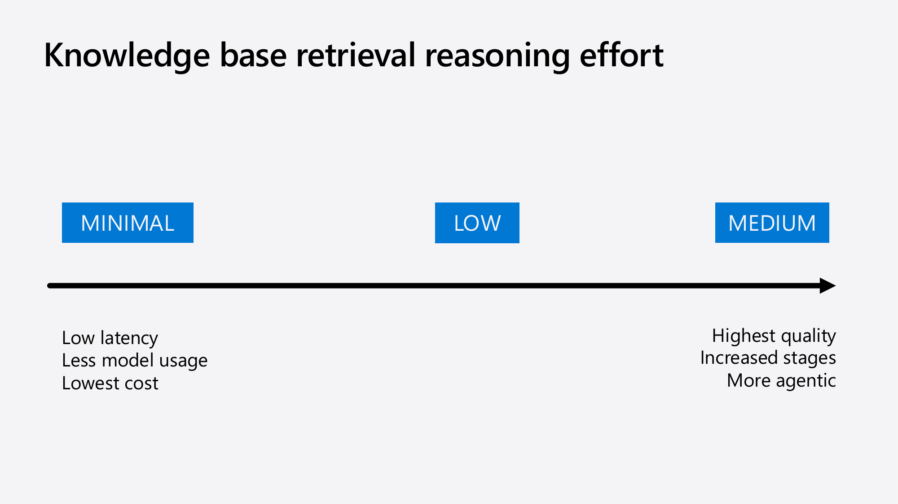
[Watch from 23:57](https://www.youtube.com/watch?v=lW47o2ss3Yg&t=1437s)

Minimal effort mode bypasses query planning by sending the entire user query directly to all configured knowledge sources. It returns results merged by a semantic ranker and synthesizes answers using an application-level model. This mode suits scenarios demanding low latency and simpler retrieval setups, especially when combining multiple data sources like search indexes and SharePoint.

## Low effort mode with agentic retrieval engine

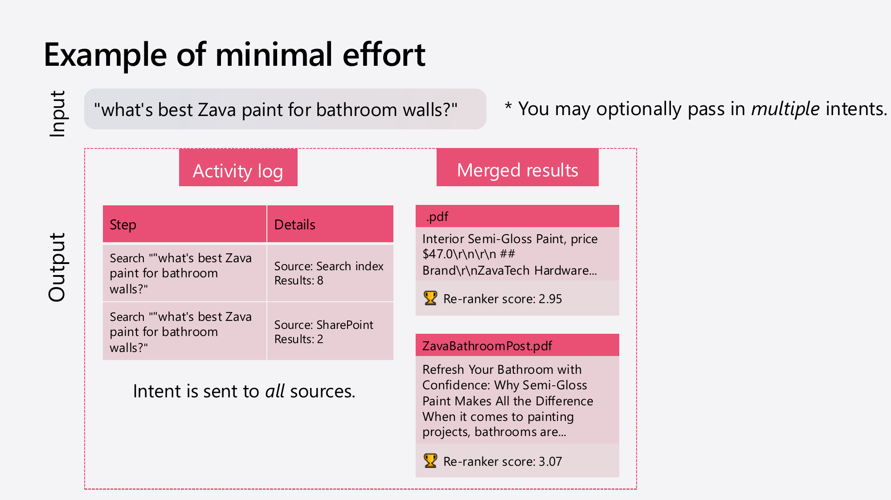
[Watch from 26:32](https://www.youtube.com/watch?v=lW47o2ss3Yg&t=1592s)

Low effort mode leverages the agentic retrieval engine’s LLM to decompose complex conversations into multiple queries and select relevant knowledge sources dynamically. It reduces unnecessary queries to irrelevant sources, optimizing cost and latency. The engine executes the planned queries against selected sources and synthesizes answers with citations, supporting multi-turn and multi-source scenarios.

## Knowledge source selection process in low effort mode

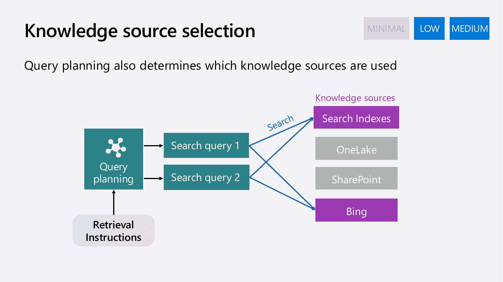
[Watch from 27:21](https://www.youtube.com/watch?v=lW47o2ss3Yg&t=1641s)

Knowledge source selection uses an LLM guided by metadata about each source, including its name, optional descriptive text, and customizable natural language retrieval instructions. These inputs help the model determine which sources are most relevant to each decomposed query, enabling precise and cost-effective retrieval tailored to the user’s information needs.

## Low effort demo with query planning and source selection

[Watch from 28:17](https://www.youtube.com/watch?v=lW47o2ss3Yg&t=1697s)

This demo illustrates how low effort mode breaks down a multi-part query into separate queries, selectively retrieves data from configured knowledge sources, and synthesizes a coherent answer with citations. It demonstrates dynamic source selection by opting to query only the search index when appropriate, saving resources by avoiding unnecessary queries to other sources like SharePoint.

## Customizing answer style and tone with natural language instructions

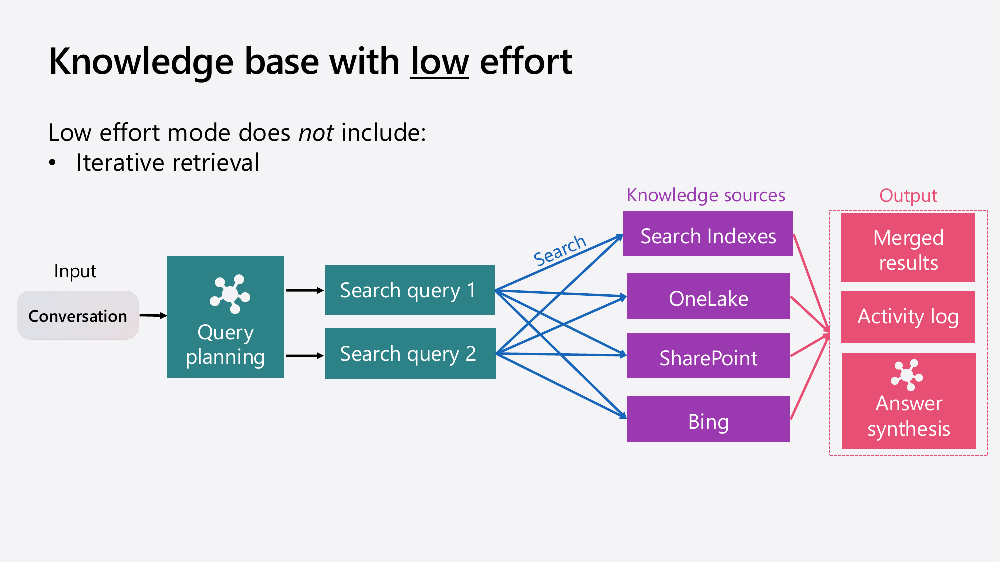
[Watch from 30:02](https://www.youtube.com/watch?v=lW47o2ss3Yg&t=1802s)

Answer synthesis supports customization of style and tone through natural language instructions. Developers can specify directives such as "answer with bullet points only" or request poetic responses. This flexibility enables tailoring the agent’s output to suit brand voice, user preferences, or application context, enhancing user engagement and clarity.

## Web knowledge source feature and demo

[Watch from 31:08](https://www.youtube.com/watch?v=lW47o2ss3Yg&t=1868s)

Adding the Bing Web knowledge source extends agents’ capabilities with up-to-date, public information from the internet. Queries can search the entire web or filtered domains. This feature requires enabling answer synthesis to integrate web results with internal sources. The demo shows a complex query that retrieves and synthesizes information from both organizational data and web content, providing a comprehensive and cited response.

## Medium effort mode with iterative retrieval and semantic classifier

[Watch from 33:14](https://www.youtube.com/watch?v=lW47o2ss3Yg&t=1994s)

Medium effort mode enhances retrieval by adding an optional iterative step. If initial results are insufficient, a semantic classifier model evaluates answer completeness and relevance. When necessary, the engine performs a second retrieval iteration using prior results and queries as additional context to generate refined queries. This process improves answer accuracy for complex or under-specified questions without unnecessary repeated querying.

## Medium effort demo: handling complex queries with iteration

[Watch from 35:07](https://www.youtube.com/watch?v=lW47o2ss3Yg&t=2107s)

This demo illustrates medium effort mode handling a chained query requiring sequential retrieval steps. The agent decomposes the question, performs initial retrievals, identifies gaps, and iterates with refined queries. The second pass yields more focused results from multiple sources, enabling comprehensive, synthesized answers with citations for complex multi-part queries.

## Open source repo for conversational RAG applications

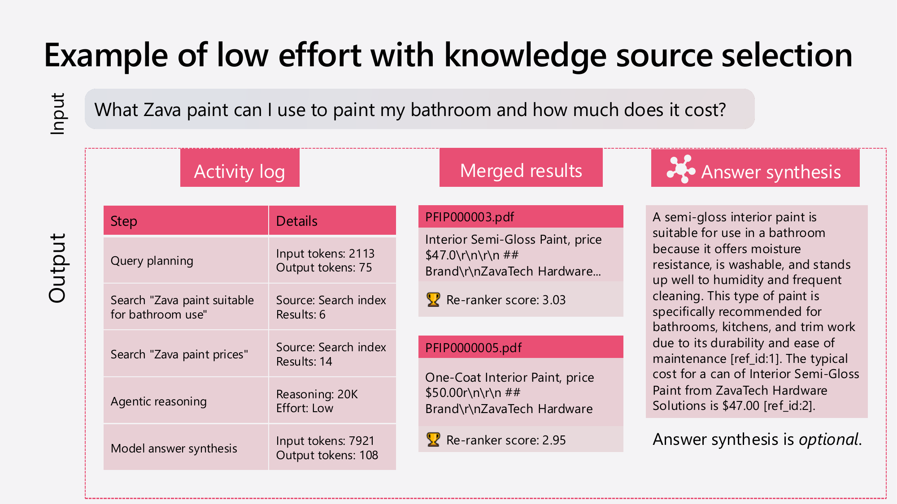
[Watch from 36:52](https://www.youtube.com/watch?v=lW47o2ss3Yg&t=2212s)

An open source repository is available that incorporates the discussed agentic retrieval features. It supports multimodal data access, cloud ingestion, and robust conversational RAG scenarios. This resource offers a practical starting point and reference implementation for developers building domain-specific conversational agents with Azure AI Search.

## Using knowledge bases with Foundry IQ for unified agent knowledge

[Watch from 37:38](https://www.youtube.com/watch?v=lW47o2ss3Yg&t=2258s)

Foundry IQ integrates knowledge bases via the Microsoft Connected Platform (MCP) protocol, enabling agents to access unified knowledge layers. Agents delegate query planning and answer synthesis while MCP connects to external knowledge sources. This simplifies development by avoiding complex stitching of multiple retrieval components and provides a scalable, maintainable approach to agent knowledge management.

## Demo of Foundry IQ agent using knowledge base via MCP

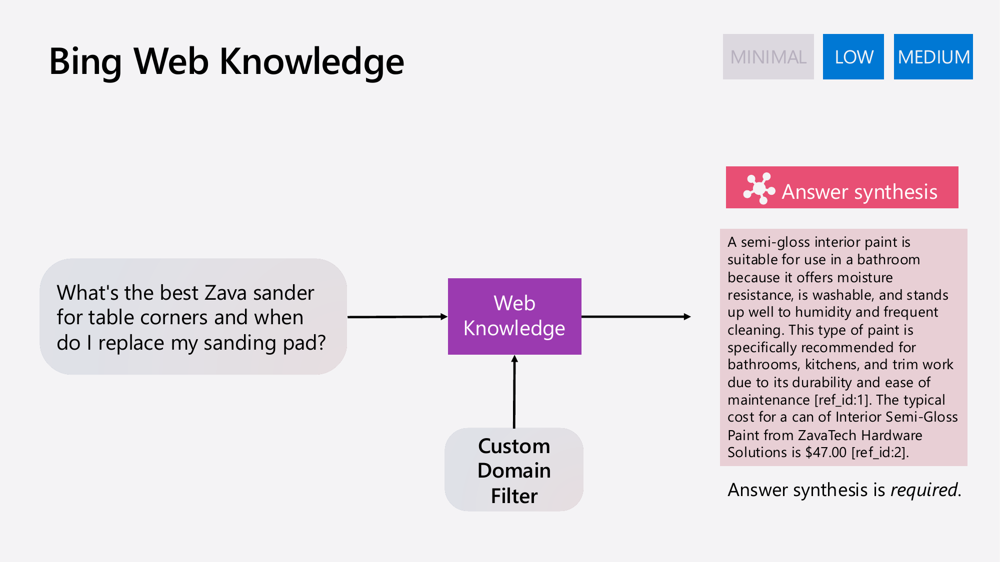
[Watch from 38:50](https://www.youtube.com/watch?v=lW47o2ss3Yg&t=2330s)

The demo shows a Foundry IQ agent interacting with the same knowledge base used in previous examples but accessed through MCP. The agent issues queries, retrieves answers with citations, and demonstrates how knowledge bases can be seamlessly integrated into agent frameworks, enabling reuse and consistency across applications.

## Q&A

### Can knowledge sources in a knowledge base be restricted to specific Azure AI Search indexes?

Index knowledge sources involve creating a dedicated Azure AI Search index by ingesting data from external repositories using indexers and skillsets. Remote knowledge sources directly query external data without ingestion. You cannot add only a specific index from an existing Azure Search resource as a knowledge source; instead, you configure indexers to create dedicated indexes for knowledge bases or use remote connections.

### How can filters be applied to remote knowledge sources like SharePoint or web?

For remote SharePoint sources, filter expressions can restrict queries to particular sites or authors by passing site IDs or other metadata. For web sources, domain filters limit search to approved websites, avoiding unreliable sources. These filters help maintain relevance, security, and trustworthiness of retrieved information.

### Is there support for storing and using graphs or entity relationships in knowledge bases?

While Azure AI Search does not natively support graph databases, the MCP private preview allows connecting external graph databases as knowledge sources. This enables leveraging entity relationships and graph structures within agentic retrieval workflows, complementing traditional document-centric knowledge bases.

### What chunking strategies are recommended when ingesting data via the portal?

The portal provides built-in chunking with default settings. For full control, ingest data pre-chunked into the index directly. Alternatively, use indexers with custom skillsets, including a built-in split skill that can be configured or replaced with custom chunking logic. The open source repo demonstrates usage of custom chunking strategies integrated with Azure AI Search indexers.