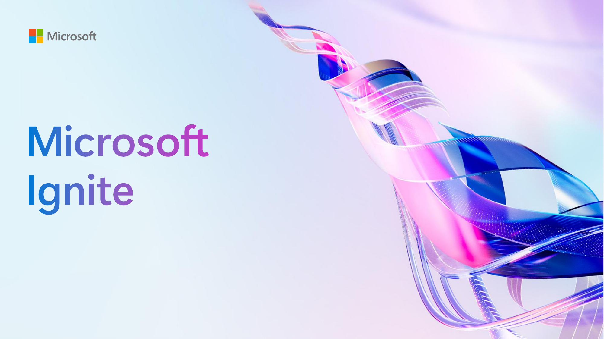
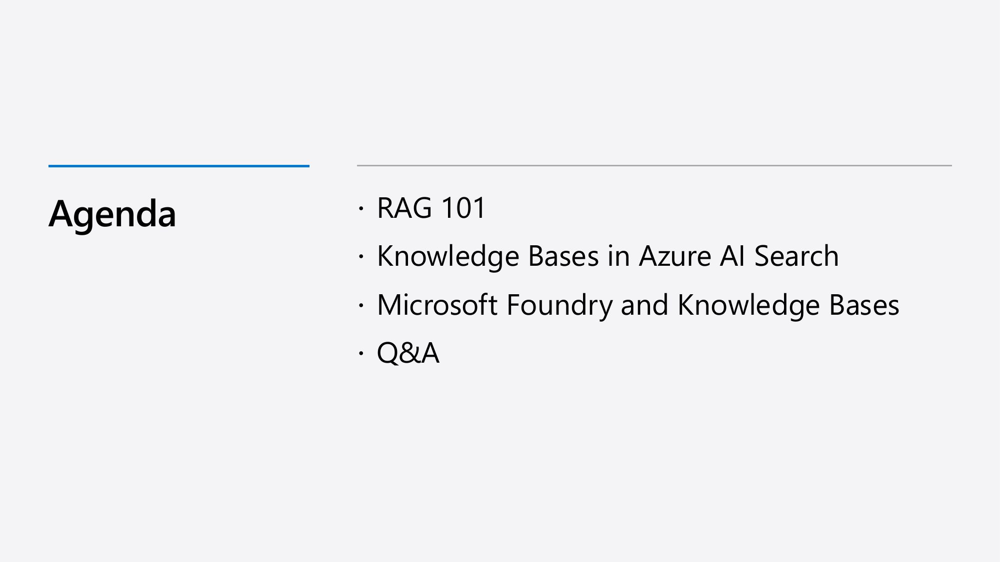

# Building Intelligent Agents with Retrieval-Augmented Generation and Azure AI Search

This blog post presents a comprehensive explanation of building agentic applications using Retrieval-Augmented Generation (RAG) combined with Azure AI Search capabilities. It details the fundamentals of RAG, hybrid search strategies, advanced agentic retrieval features in Azure AI Search knowledge bases, and integration with Foundry IQ for unified agent knowledge layers. Each slide from the original talk is annotated with extended explanations and practical insights.

---

  
[Watch from 00:00](https://www.youtube.com/watch?v=lW47o2ss3Yg&t=0s)

The session introduces the topic of building intelligent agents using Retrieval-Augmented Generation (RAG) together with Azure AI Search. It sets the stage for exploring how to combine large language models (LLMs) with powerful search technologies to create domain-specific, task-oriented agents.

---

  
[Watch from 00:04](https://www.youtube.com/watch?v=lW47o2ss3Yg&t=4s)

The speakers are introduced, representing Azure Search program management and Python cloud advocacy. The focus is on practical application development using Microsoft Azure's AI search capabilities and RAG techniques.

---

  
[Watch from 00:23](https://www.youtube.com/watch?v=lW47o2ss3Yg&t=23s)

The agenda covers four main sections: fundamentals of RAG, deep dive into Azure AI Search knowledge bases, the integration of Foundry IQ with knowledge bases, and a Q&A session. This roadmap prepares the reader for a layered exploration of retrieval and generation techniques in modern AI agents.

---

  
[Watch from 00:49](https://www.youtube.com/watch?v=lW47o2ss3Yg&t=49s)

Retrieval-Augmented Generation (RAG) is a method that enables large language models (LLMs) to generate answers grounded in specific, relevant data retrieved from external sources. It addresses the challenge of LLMs hallucinating or providing generic answers by anchoring responses in real documents. RAG workflows typically involve receiving a natural language query, retrieving pertinent documents from a search index, and then prompting an LLM to synthesize an answer referencing those retrieved documents.

---

  
[Watch from 01:05](https://www.youtube.com/watch?v=lW47o2ss3Yg&t=65s)

Modern AI agents are evolving beyond conversational bots to task-oriented systems that act on behalf of users in specific domains. These agents require precise domain-specific context to operate effectively, which means grounding their knowledge in an organization's proprietary data. Without accurate retrieval of relevant context, agents risk generating irrelevant or incorrect outputs. Thus, retrieval quality directly impacts the usefulness and reliability of agents.

---

  
[Watch from 01:46](https://www.youtube.com/watch?v=lW47o2ss3Yg&t=106s)

RAG operates by first sending user questions to a search index to retrieve relevant document chunks. These chunks are then provided to an LLM alongside the original question. The LLM generates an answer based on the retrieved context and includes citations to the source documents. This approach leverages the strengths of both search engines (precise retrieval) and LLMs (natural language synthesis), delivering grounded and explainable answers.

---

  
[Watch from 03:18](https://www.youtube.com/watch?v=lW47o2ss3Yg&t=198s)

Azure AI Search offers an enterprise-grade vector database and an end-to-end data ingestion and management pipeline for diverse data types. It provides a full-stack RAG solution designed for scalability and production readiness. Its capabilities extend beyond simple vector search by integrating with various data sources, supporting hybrid search strategies, and enabling advanced AI enrichment. This makes it a strong foundation for building robust generative AI applications.

---

  
[Watch from 04:12](https://www.youtube.com/watch?v=lW47o2ss3Yg&t=252s)

Hybrid search combines keyword search and vector search to leverage the strengths of both. Keyword search excels with exact terms and structured queries, while vector search handles semantic similarity and ambiguous queries. Azure AI Search merges results from both using reciprocal rank fusion and applies a re-ranking model to optimize relevance. This layered approach significantly improves retrieval quality across varied query types.

---

  
[Watch from 05:32](https://www.youtube.com/watch?v=lW47o2ss3Yg&t=332s)

Keyword search relies on inverted document indexes, mapping terms to document frequencies and positions. Azure AI Search uses the BM25 ranking function, a state-of-the-art full-text retrieval algorithm that scores documents based on term frequency, inverse document frequency, and document length normalization. Keyword search is highly effective for queries with explicit terms but struggles with ambiguous or concept-based queries.

---

  
[Watch from 07:00](https://www.youtube.com/watch?v=lW47o2ss3Yg&t=420s)

Vector search transforms documents and queries into high-dimensional embeddings that capture semantic meaning. Similarity between query and documents is computed via distance metrics (e.g., cosine similarity). Embedding models like OpenAI's text embedding provide these vector representations. Vector search identifies semantically related documents even if exact keywords are missing, enhancing retrieval for natural language queries. Azure AI Search supports large-scale vector search using HNSW (Hierarchical Navigable Small World) graphs for efficient approximate nearest neighbor retrieval.

---

  
[Watch from 10:20](https://www.youtube.com/watch?v=lW47o2ss3Yg&t=620s)

Reciprocal Rank Fusion (RRF) is a method to combine multiple ranked lists (e.g., keyword and vector search results) into a single ranking. It uses the reciprocal of each result's rank to compute a combined score, effectively averaging ranks while emphasizing higher-ranked items. This simple yet effective technique harmonizes heterogeneous search results, improving overall retrieval performance by balancing precision and recall.

---

  
[Watch from 12:01](https://www.youtube.com/watch?v=lW47o2ss3Yg&t=721s)

Re-ranking refines the merged search results using a specialized model called a cross-encoder, trained to score the relevance of each document relative to the query. Unlike generative LLMs, this model is optimized for ranking tasks and trained on human-annotated data, ensuring more accurate prioritization. The cross-encoder provides absolute relevance scores, enabling filtering of low-quality results by thresholding, which enhances precision and user satisfaction.

---

  
[Watch from 14:10](https://www.youtube.com/watch?v=lW47o2ss3Yg&t=850s)

The hybrid search workflow involves sending a query both to keyword and vector search engines, merging their ranked results with RRF, and then applying the re-ranking model to produce the final ordered list. This pipeline balances fast retrieval with semantic understanding and precise relevance scoring, suitable for diverse query types. Azure AI Search provides this full stack natively, simplifying implementation.

---

  
[Watch from 15:16](https://www.youtube.com/watch?v=lW47o2ss3Yg&t=916s)

Empirical research shows hybrid search consistently outperforms individual keyword or vector search across various query categories, including short, long, and concept-based queries. This confirms that combining complementary retrieval methods with re-ranking addresses the breadth of real-world user requests, reducing failure modes and improving answer accuracy in AI-powered applications.

---

  
[Watch from 15:37](https://www.youtube.com/watch?v=lW47o2ss3Yg&t=937s)

Certain complex queries exceed the capabilities of hybrid search alone. Examples include multi-part questions requiring decomposition, chained queries needing sequential retrieval steps, and queries demanding external knowledge beyond internal data. Addressing these requires agentic retrieval strategies that orchestrate multiple queries and knowledge sources dynamically.

---

  
[Watch from 16:57](https://www.youtube.com/watch?v=lW47o2ss3Yg&t=1017s)

Azure AI Search knowledge bases extend hybrid search by embedding agentic retrieval engines that manage complex query planning, knowledge source selection, and result merging. Knowledge bases act as reusable, topic-centric collections that ground agents in domain-specific data, enabling more sophisticated and context-aware interactions.

---

  
[Watch from 17:33](https://www.youtube.com/watch?v=lW47o2ss3Yg&t=1053s)

The agentic retrieval engine decomposes conversations into atomic queries via an LLM-based query planner, dynamically selects relevant knowledge sources, issues queries to those sources, and merges retrieved documents into a single synthesized answer with citations. If initial results are insufficient, the engine iterates query planning considering prior results to refine retrieval, enhancing answer completeness.

---

  
[Watch from 18:49](https://www.youtube.com/watch?v=lW47o2ss3Yg&t=1129s)

Knowledge sources fall into two categories: indexed and remote. Indexed sources involve copying data from external repositories (e.g., PDFs in Blob storage) into Azure AI Search indexes, enabling full hybrid search and re-ranking. Remote sources connect directly to external services (e.g., SharePoint, web) at query time without data ingestion, supporting live, permission-aware retrieval. SharePoint supports both modes.

---

  
[Watch from 19:53](https://www.youtube.com/watch?v=lW47o2ss3Yg&t=1193s)

Remote SharePoint integration queries SharePoint directly using the end user's identity to enforce access controls, ensuring users see only permitted documents. This approach supports real-time, secure retrieval of SharePoint content for agents, analogous to Microsoft Copilot's underlying SharePoint index, preserving enterprise security and compliance.

---

  
[Watch from 20:44](https://www.youtube.com/watch?v=lW47o2ss3Yg&t=1244s)

Indexed SharePoint ingestion uses Azure Search indexers and skill sets to extract files from SharePoint sites, chunk and vectorize them for efficient hybrid search. This approach copies content into Azure AI Search indexes while preserving permission metadata for post-retrieval filtering. It enables richer AI enrichment and faster search response times at the cost of data duplication.

---

  
[Watch from 21:52](https://www.youtube.com/watch?v=lW47o2ss3Yg&t=1312s)

Azure AI Search offers enhanced content understanding for indexed documents beyond minimal text extraction. Using a dedicated content understanding deployment, it can parse embedded images, tables, and complex elements, converting them into searchable and OCR-processed text. This richer representation allows LLMs to reason over diagrams and non-textual content, improving answer quality in knowledge bases.

---

  
[Watch from 23:00](https://www.youtube.com/watch?v=lW47o2ss3Yg&t=1380s)

Retrieval reasoning effort controls the depth and cost of knowledge base retrieval in Azure AI Search. Minimal effort offers low latency by bypassing LLMs for query planning and source selection. Low effort enables query decomposition and dynamic source selection using LLMs. Medium effort adds iterative retrieval when initial results are insufficient, balancing comprehensiveness against latency and cost. Future plans include higher effort levels.

---

  
[Watch from 23:57](https://www.youtube.com/watch?v=lW47o2ss3Yg&t=1437s)

Minimal effort retrieval performs direct queries across all configured sources without LLM-driven query planning or source selection. This mode sacrifices advanced features for speed and simplicity. It requires the application to provide the queries explicitly. Minimal effort suits scenarios needing rapid retrieval or integration with agents handling their own query logic.

---

  
[Watch from 24:35](https://www.youtube.com/watch?v=lW47o2ss3Yg&t=1475s)

A demonstration shows a conversational RAG application using minimal effort with SharePoint and search index sources. The query is sent directly to all sources, and results are merged and re-ranked. Citations indicate which source each result originates from. Minimal effort can be integrated with minimal code changes, making it a practical entry point for multi-source retrieval.

---

  
[Watch from 26:32](https://www.youtube.com/watch?v=lW47o2ss3Yg&t=1592s)

Low effort retrieval enables the agentic retrieval engine's query planning features. The engine decomposes complex queries into simpler sub-queries and selects only the knowledge sources relevant to those sub-queries. This dynamic selection reduces unnecessary queries, saving latency and cost. The engine also synthesizes answers with citations, delivering coherent responses from multiple data sources.

---

  
[Watch from 33:14](https://www.youtube.com/watch?v=lW47o2ss3Yg&t=1994s)

Medium effort adds iterative retrieval, where the system assesses the sufficiency of initial results using a semantic classifier model. If results are inadequate, it re-plans queries considering prior results and performs a second retrieval pass. This improves answer completeness for complex, multi-faceted questions. The semantic classifier evaluates both the quantity and relevance of retrieved documents to decide on iteration.

---

  
[Watch from 31:08](https://www.youtube.com/watch?v=lW47o2ss3Yg&t=1868s)

The Bing Web knowledge source supplements internal data by providing up-to-date public information from the web. When enabled, queries are decomposed and sent to internal indexes and the web, with results combined and synthesized. This expands agent knowledge beyond organizational data, vital for answering questions involving current events or general knowledge. Answer synthesis with citations maintains transparency.

---

  
[Watch from 36:52](https://www.youtube.com/watch?v=lW47o2ss3Yg&t=2212s)

An open-source repository provides a full conversational RAG solution incorporating agentic retrieval, multi-source access, and cloud data ingestion. The repo serves as a practical foundation for developers to build domain-specific agents using Azure AI Search features. Exploring this codebase accelerates adoption and experimentation with RAG applications.

---

  
[Watch from 37:38](https://www.youtube.com/watch?v=lW47o2ss3Yg&t=2258s)

Foundry IQ integrates knowledge bases with agents using the Microsoft Communication Protocol (MCP), enabling unified knowledge access. Agents act as query planners and answer synthesizers, delegating retrieval to knowledge bases. This modular approach simplifies agent development by consolidating disparate data retrieval tools into a single knowledge layer, improving maintainability and scalability.

---

  
[Watch from 39:54](https://www.youtube.com/watch?v=lW47o2ss3Yg&t=2394s)

The session concludes with an invitation to join the MCP private preview for new knowledge source integrations, followed by a Q&A segment addressing practical questions about knowledge source configuration, indexing strategies, and graph database integration. Feedback is encouraged via a survey, emphasizing community engagement.

---

# Q&A Highlights

**Can specific Azure AI Search indexes be added as knowledge sources, or must the entire search resource be used?**  
Indexed knowledge sources create new Azure Search indexes by copying data from external repositories using indexers and skill sets. Remote knowledge sources connect to external systems directly without ingesting data. Filters can be applied to restrict scope, such as limiting SharePoint queries to specific sites or domains for web sources.

**Is storing graphs and entity relationships in knowledge bases supported or valuable?**  
Graph databases are not natively built into Azure AI Search knowledge bases but can be integrated as remote knowledge sources via MCP in private preview. This allows agents to leverage graph-structured data alongside other sources.

**What chunking strategies are recommended for indexing documents via the portal?**  
Azure AI Search provides a built-in chunking mechanism with default settings. For more control, users can chunk documents externally before ingestion or create custom skills within skill sets to define chunking logic. The open-source repo includes examples of custom chunking strategies for optimized retrieval.
