## Slide 1


```
Microsoft IQ Deep Dive
with Python
July 28: Foundry IQ
July 29: Work IQ
                               Stay
July 30: Fabric IQ         GROUNDED
Register at aka.ms/IQDeepDivePython/series
```

## Slide 2

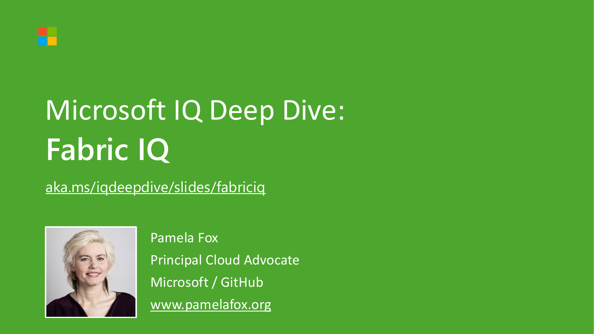

```
Microsoft IQ Deep Dive:
Fabric IQ
aka.ms/iqdeepdive/slides/fabriciq


               Pamela Fox
               Principal Cloud Advocate
               Microsoft / GitHub
               www.pamelafox.org
```

## Slide 3

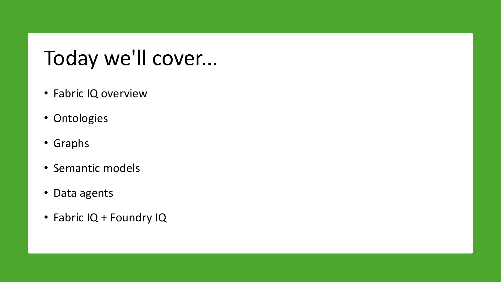

```
Today we'll cover...
• Fabric IQ overview

• Ontologies

• Graphs

• Semantic models

• Data agents
• Fabric IQ + Foundry IQ
```

## Slide 4

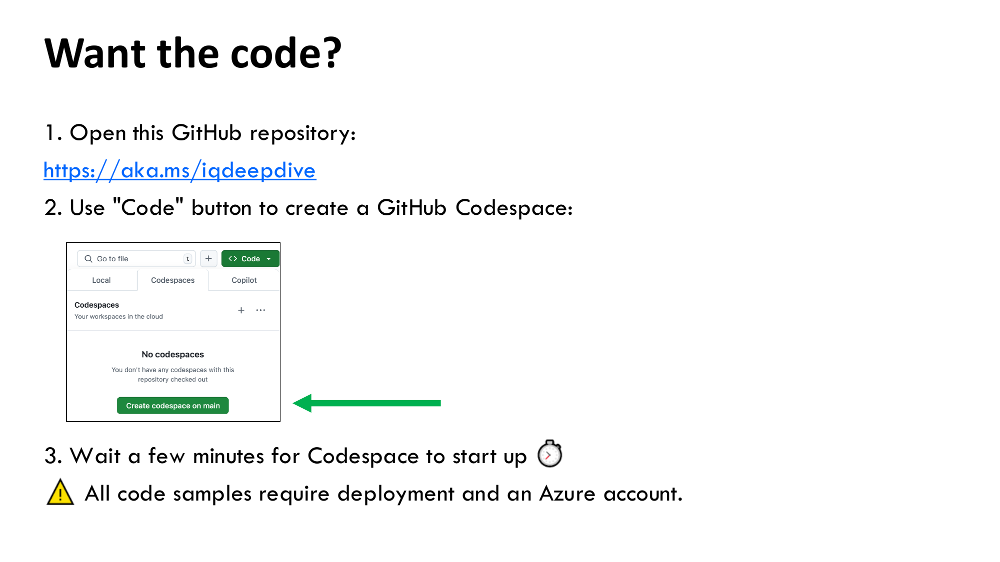

```
Want the code?
1. Open this GitHub repository:
https://aka.ms/iqdeepdive
2. Use "Code" button to create a GitHub Codespace:


3. Wait a few minutes for Codespace to start up
    All code samples require deployment and an Azure account.
```

## Slide 5


```
Microsoft IQ
```

## Slide 6

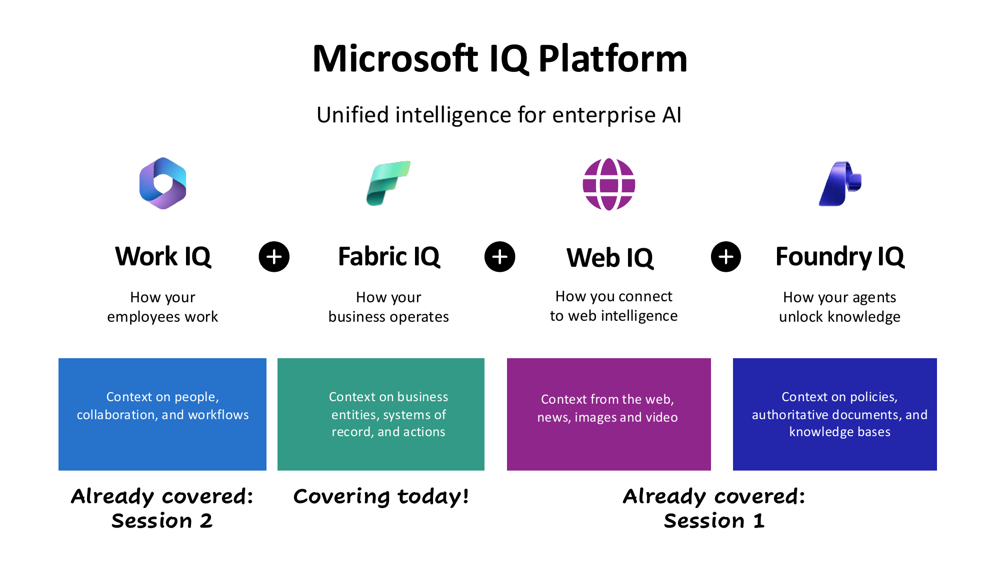

```
Microsoft IQ Platform
                                Unified intelligence for enterprise AI


      Work IQ                      Fabric IQ                 Web IQ                  Foundry IQ
      How your                       How your              How you connect            How your agents
    employees work               business operates        to web intelligence         unlock knowledge


     Context on people,           Context on business     Context from the web,       Context on policies,
collaboration, and workflows      entities, systems of   news, images and video   authoritative documents, and
                                  record, and actions                                  knowledge bases


Already covered:               Covering today!                        Already covered:
    Session 2                                                             Session 1
```

## Slide 7


```
Fabric IQ
```

## Slide 8

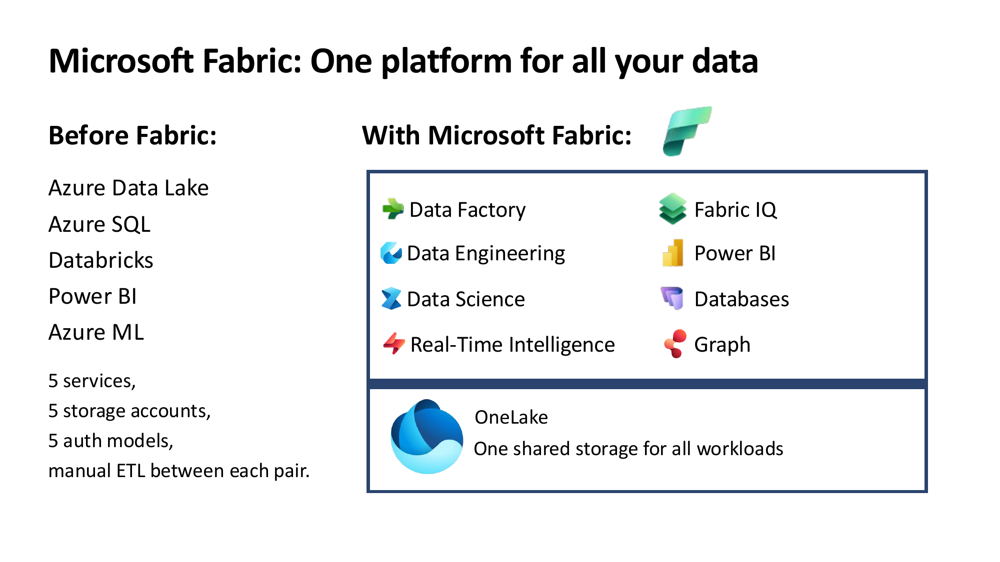

```
Microsoft Fabric: One platform for all your data
Before Fabric:                  With Microsoft Fabric:
Azure Data Lake                     Very low latency
                                   Data Factory                   Fabric IQ
Azure SQL
Databricks                         Data Engineering               Power BI
Power BI                           Data Science                   Databases
Azure ML                           Real-Time Intelligence         Graph
5 services,
5 storage accounts,                      OneLake
5 auth models,                           One shared storage for all workloads
manual ETL between each pair.
```

## Slide 9

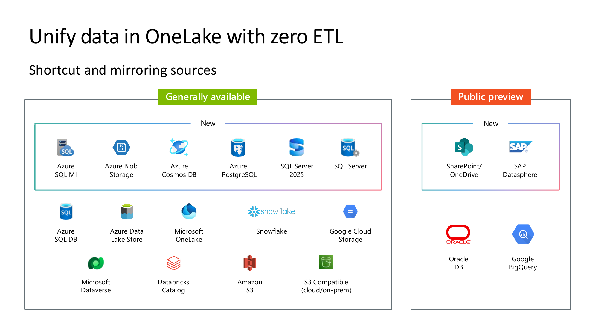

```
Unify data in OneLake with zero ETL
Shortcut and mirroring sources
                                    Generally available                                              Public preview

                                               New                                                              New


     Azure          Azure Blob       Azure             Azure         SQL Server     SQL Server    SharePoint/            SAP
    SQL MI           Storage       Cosmos DB         PostgreSQL        2025                        OneDrive           Datasphere


     Azure           Azure Data        Microsoft              Snowflake            Google Cloud
    SQL DB           Lake Store        OneLake                                       Storage

                                                                                                  Oracle                Google
                                                                                                   DB                  BigQuery

             Microsoft            Databricks             Amazon             S3 Compatible
             Dataverse             Catalog                 S3              (cloud/on-prem)
```

## Slide 10

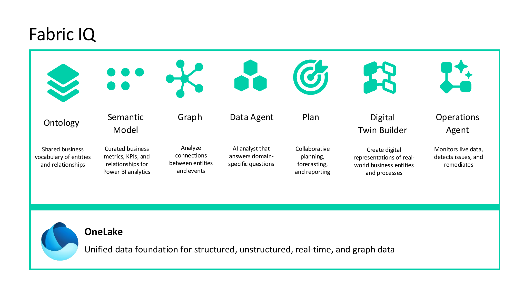

```
Fabric IQ


                          Semantic               Graph           Data Agent             Plan             Digital                 Operations
   Ontology
                           Model                                                                       Twin Builder                Agent
  Shared business        Curated business         Analyze          AI analyst that    Collaborative        Create digital        Monitors live data,
vocabulary of entities   metrics, KPIs, and     connections      answers domain-        planning,     representations of real-   detects issues, and
  and relationships       relationships for   between entities   specific questions    forecasting,   world business entities       remediates
                         Power BI analytics      and events                           and reporting       and processes


                   OneLake
                   Unified data foundation for structured, unstructured, real-time, and graph data
```

## Slide 11

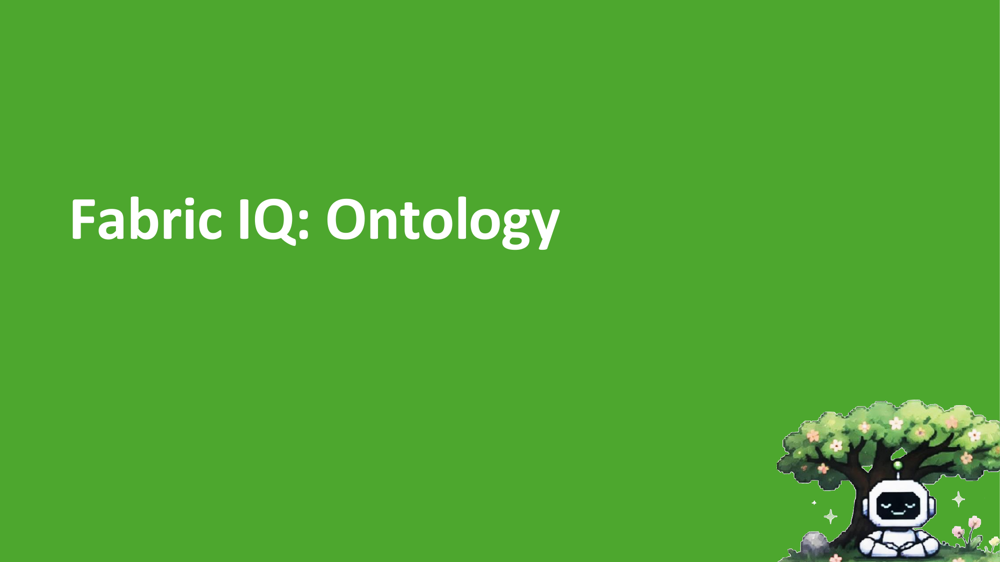

```
Fabric IQ: Ontology
```

## Slide 12

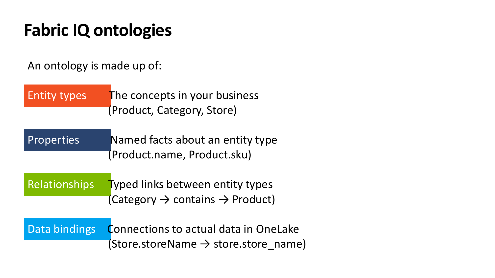

```
Fabric IQ ontologies
An ontology is made up of:

Entity types    The concepts in your business
                (Product, Category, Store)

Properties       Named facts about an entity type
                (Product.name, Product.sku)

Relationships   Typed links between entity types
                (Category → contains → Product)

Data bindings Connections to actual data in OneLake
              (Store.storeName → store.store_name)
```

## Slide 13

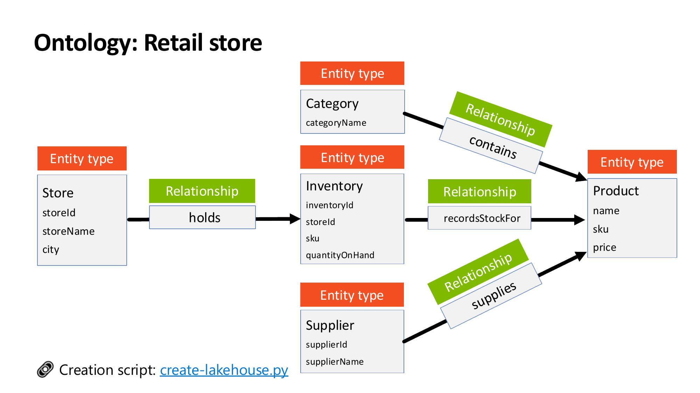

```
Ontology: Retail store
                                                    Entity type

                                              Category
                                              categoryName


 Entity type                                        Entity type                      Entity type

Store                  Relationship           Inventory           Relationship      Product
                                              inventoryId
storeId                                                                             name
                           holds              storeId             recordsStockFor
storeName                                                                           sku
                                              sku
city                                                                                price
                                              quantityOnHand


                                                    Entity type

                                              Supplier
                                              supplierId
                                              supplierName
       Creation script: create-lakehouse.py
```

## Slide 14

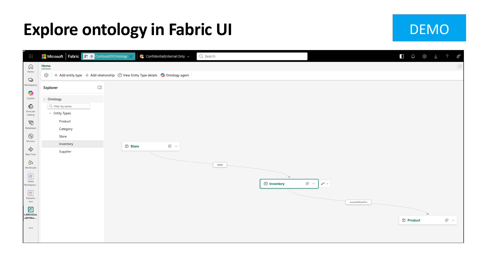

```
Explore ontology in Fabric UI   DEMO
```

## Slide 15

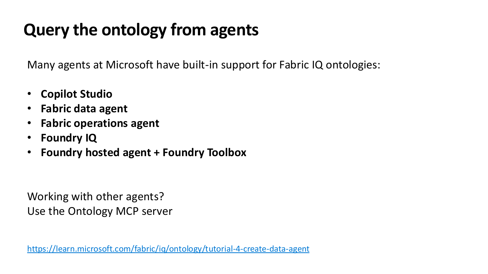

```
Query the ontology from agents
Many agents at Microsoft have built-in support for Fabric IQ ontologies:

•   Copilot Studio
•   Fabric data agent
•   Fabric operations agent
•   Foundry IQ
•   Foundry hosted agent + Foundry Toolbox


Working with other agents?
Use the Ontology MCP server


https://learn.microsoft.com/fabric/iq/ontology/tutorial-4-create-data-agent
```

## Slide 16

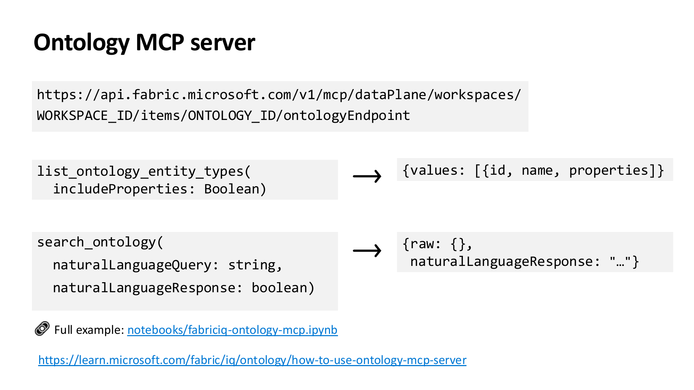

```
Ontology MCP server
https://api.fabric.microsoft.com/v1/mcp/dataPlane/workspaces/
WORKSPACE_ID/items/ONTOLOGY_ID/ontologyEndpoint


list_ontology_entity_types(                                      {values: [{id, name, properties]}
  includeProperties: Boolean)


search_ontology(                                                 {raw: {},
  naturalLanguageQuery: string,                                   naturalLanguageResponse: "…"}
  naturalLanguageResponse: boolean)

  Full example: notebooks/fabriciq-ontology-mcp.ipynb

https://learn.microsoft.com/fabric/iq/ontology/how-to-use-ontology-mcp-server
```

## Slide 17

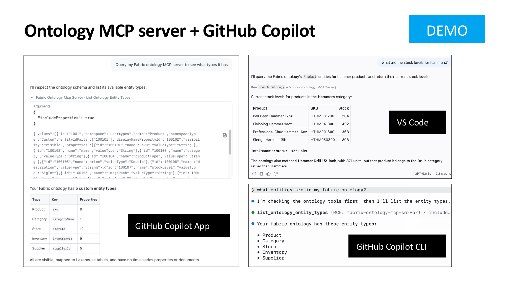

```
Ontology MCP server + GitHub Copilot                    DEMO


                                                 VS Code


             GitHub Copilot App

                                       GitHub Copilot CLI
```

## Slide 18

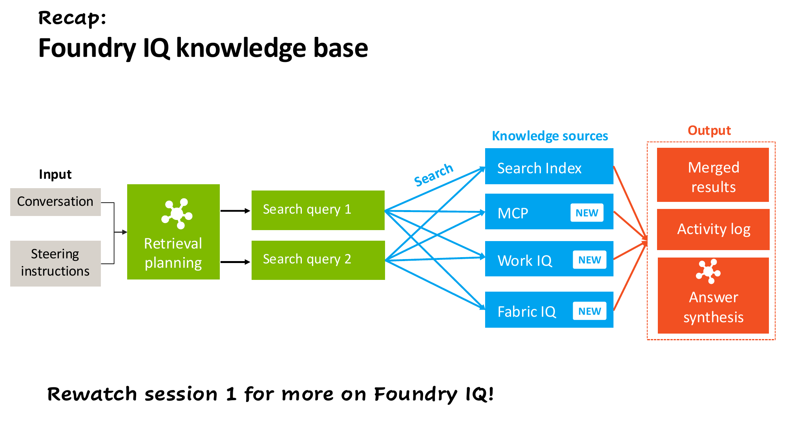

```
Recap:
   Foundry IQ knowledge base

                                            Knowledge sources      Output

   Input                                        Search Index       Merged
                                                                   results
Conversation
                           Search query 1       MCP         NEW
                                                                  Activity log
               Retrieval
  Steering                 Search query 2       Work IQ     NEW
instructions
               planning

                                                                    Answer
                                                Fabric IQ   NEW
                                                                   synthesis


    Rewatch session 1 for more on Foundry IQ!
```

## Slide 19

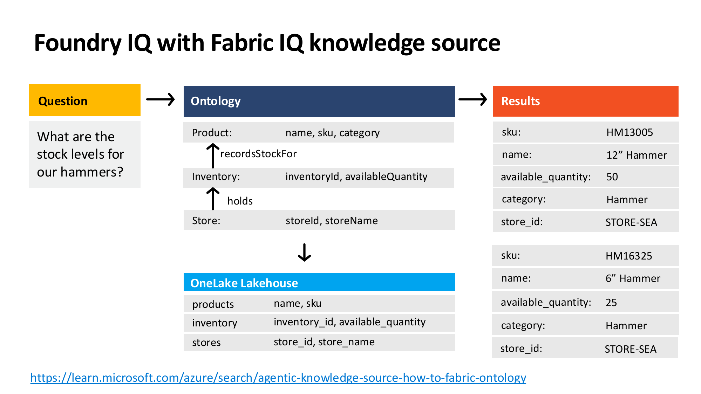

```
Foundry IQ with Fabric IQ knowledge source

 Question                   Ontology                                               Results

 What are the               Product:           name, sku, category                 sku:                  HM13005
 stock levels for                recordsStockFor                                   name:                 12” Hammer
 our hammers?               Inventory:         inventoryId, availableQuantity      available_quantity:   50

                                     holds                                         category:             Hammer
                            Store:             storeId, storeName                  store_id:             STORE-SEA

                                                                                   sku:                  HM16325

                            OneLake Lakehouse                                      name:                 6” Hammer

                            products         name, sku                             available_quantity:   25
                            inventory        inventory_id, available_quantity      category:             Hammer
                            stores           store_id, store_name
                                                                                   store_id:             STORE-SEA

https://learn.microsoft.com/azure/search/agentic-knowledge-source-how-to-fabric-ontology
```

## Slide 20

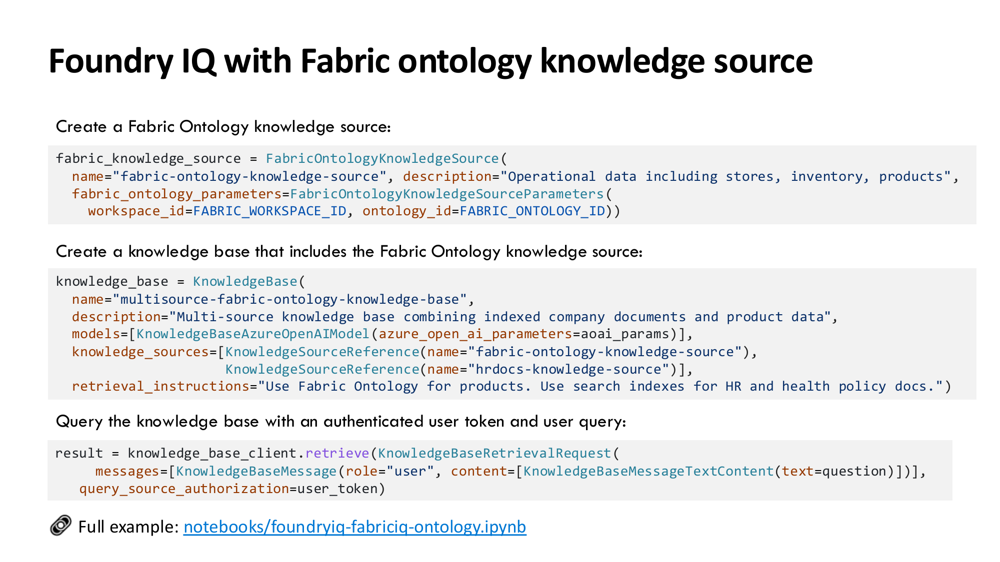

```
Foundry IQ with Fabric ontology knowledge source
Create a Fabric Ontology knowledge source:
fabric_knowledge_source = FabricOntologyKnowledgeSource(
  name="fabric-ontology-knowledge-source", description="Operational data including stores, inventory, products",
  fabric_ontology_parameters=FabricOntologyKnowledgeSourceParameters(
    workspace_id=FABRIC_WORKSPACE_ID, ontology_id=FABRIC_ONTOLOGY_ID))

Create a knowledge base that includes the Fabric Ontology knowledge source:
knowledge_base = KnowledgeBase(
  name="multisource-fabric-ontology-knowledge-base",
  description="Multi-source knowledge base combining indexed company documents and product data",
  models=[KnowledgeBaseAzureOpenAIModel(azure_open_ai_parameters=aoai_params)],
  knowledge_sources=[KnowledgeSourceReference(name="fabric-ontology-knowledge-source"),
                     KnowledgeSourceReference(name="hrdocs-knowledge-source")],
  retrieval_instructions="Use Fabric Ontology for products. Use search indexes for HR and health policy docs.")

Query the knowledge base with an authenticated user token and user query:
result = knowledge_base_client.retrieve(KnowledgeBaseRetrievalRequest(
     messages=[KnowledgeBaseMessage(role="user", content=[KnowledgeBaseMessageTextContent(text=question)])],
   query_source_authorization=user_token)

  Full example: notebooks/foundryiq-fabriciq-ontology.ipynb
```

## Slide 21

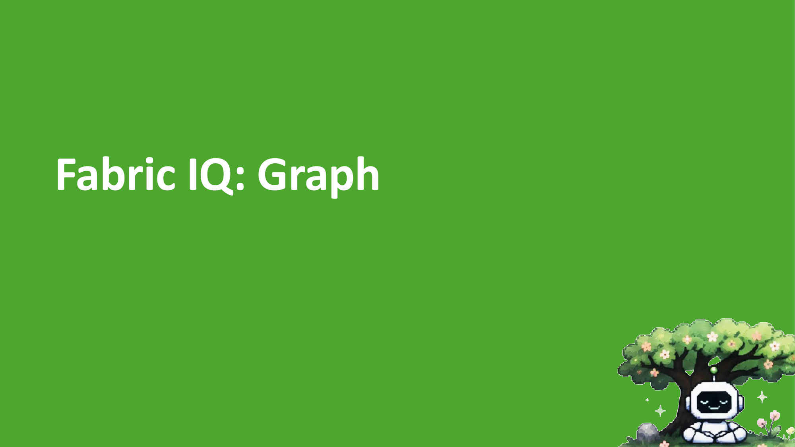

```
Fabric IQ: Graph
```

## Slide 22

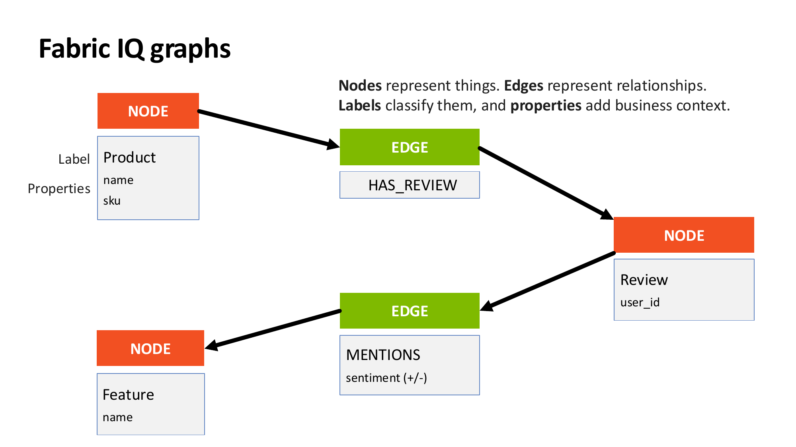

```
Fabric IQ graphs
                          Nodes represent things. Edges represent relationships.
                   NODE   Labels classify them, and properties add business context.

                                   EDGE
    Label Product
             name              HAS_REVIEW
Properties
             sku

                                                                             NODE

                                                                   Review
                                                                   user_id
                                   EDGE

                   NODE    MENTIONS
                           sentiment (+/-)
             Feature
             name
```

## Slide 23

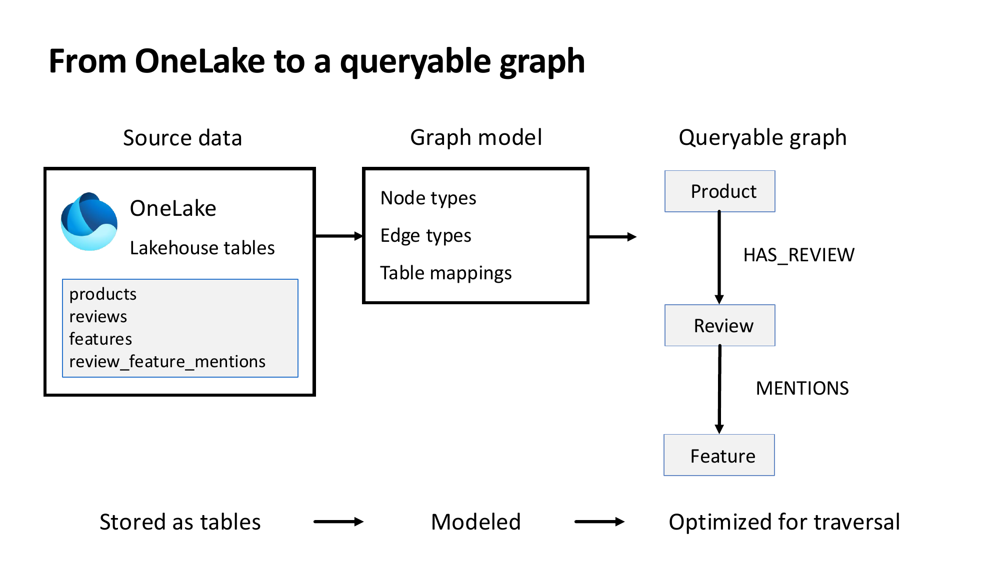

```
From OneLake to a queryable graph
       Source data            Graph model   Queryable graph

                           Node types         Product
        OneLake
                           Edge types
        Lakehouse tables                           HAS_REVIEW
                           Table mappings
 products
 reviews
                                              Review
 features
 review_feature_mentions
                                                       MENTIONS


                                              Feature


    Stored as tables            Modeled     Optimized for traversal
```

## Slide 24

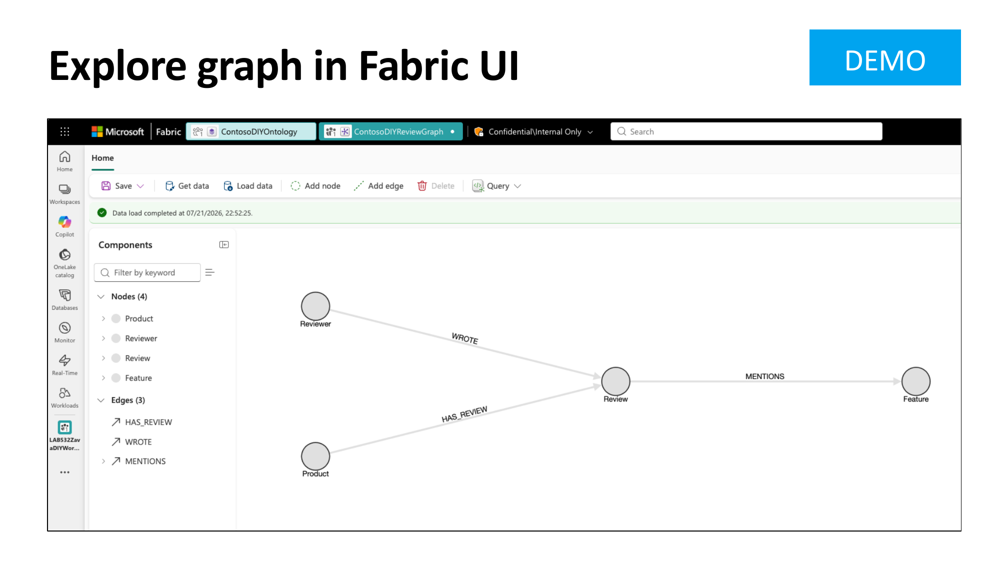

```
Explore graph in Fabric UI   DEMO
```

## Slide 25

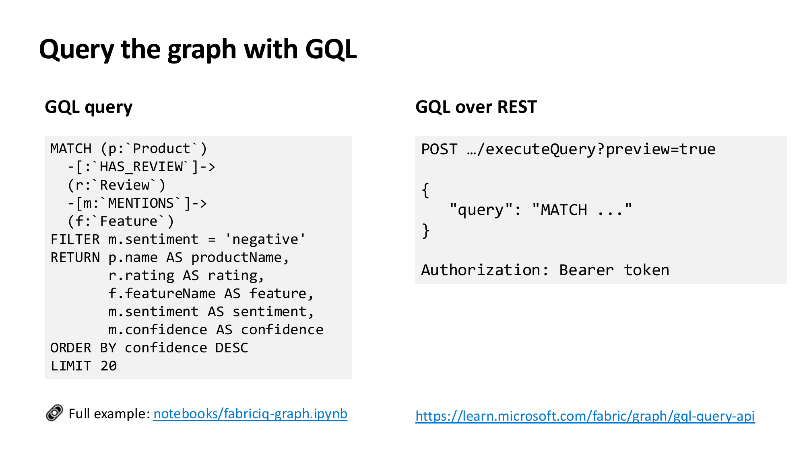

```
Query the graph with GQL
GQL query                                        GQL over REST

MATCH (p:`Product`)                              POST …/executeQuery?preview=true
  -[:`HAS_REVIEW`]->
  (r:`Review`)                                   {
  -[m:`MENTIONS`]->                                   "query": "MATCH ..."
  (f:`Feature`)
                                                 }
FILTER m.sentiment = 'negative'
RETURN p.name AS productName,
       r.rating AS rating,                       Authorization: Bearer token
       f.featureName AS feature,
       m.sentiment AS sentiment,
       m.confidence AS confidence
ORDER BY confidence DESC
LIMIT 20


  Full example: notebooks/fabriciq-graph.ipynb   https://learn.microsoft.com/fabric/graph/gql-query-api
```

## Slide 26

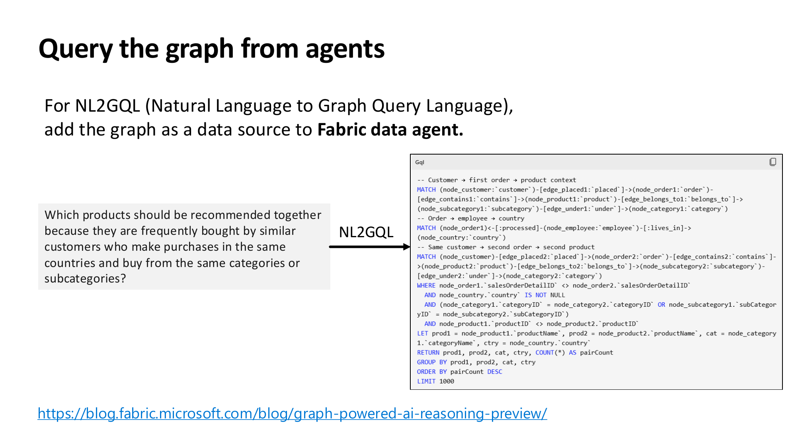

```
Query the graph from agents
For NL2GQL (Natural Language to Graph Query Language),
add the graph as a data source to Fabric data agent.


Which products should be recommended together
because they are frequently bought by similar   NL2GQL
customers who make purchases in the same
countries and buy from the same categories or
subcategories?


https://blog.fabric.microsoft.com/blog/graph-powered-ai-reasoning-preview/
```

## Slide 27

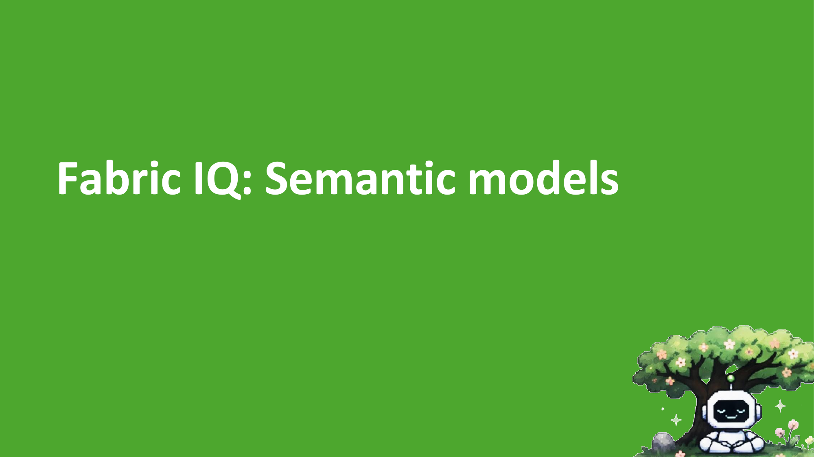

```
Fabric IQ: Semantic models
```

## Slide 28

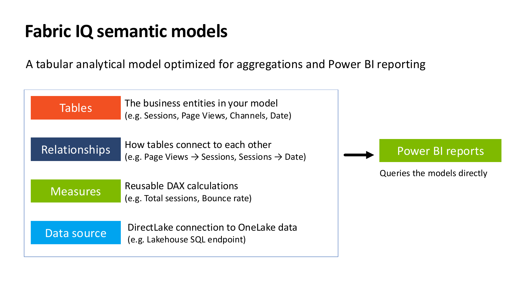

```
Fabric IQ semantic models
A tabular analytical model optimized for aggregations and Power BI reporting


                  The business entities in your model
      Tables
                  (e.g. Sessions, Page Views, Channels, Date)


                  How tables connect to each other
  Relationships   (e.g. Page Views → Sessions, Sessions → Date)
                                                                       Power BI reports
                                                                   Queries the models directly
                  Reusable DAX calculations
    Measures      (e.g. Total sessions, Bounce rate)


                   DirectLake connection to OneLake data
   Data source     (e.g. Lakehouse SQL endpoint)
```

## Slide 29

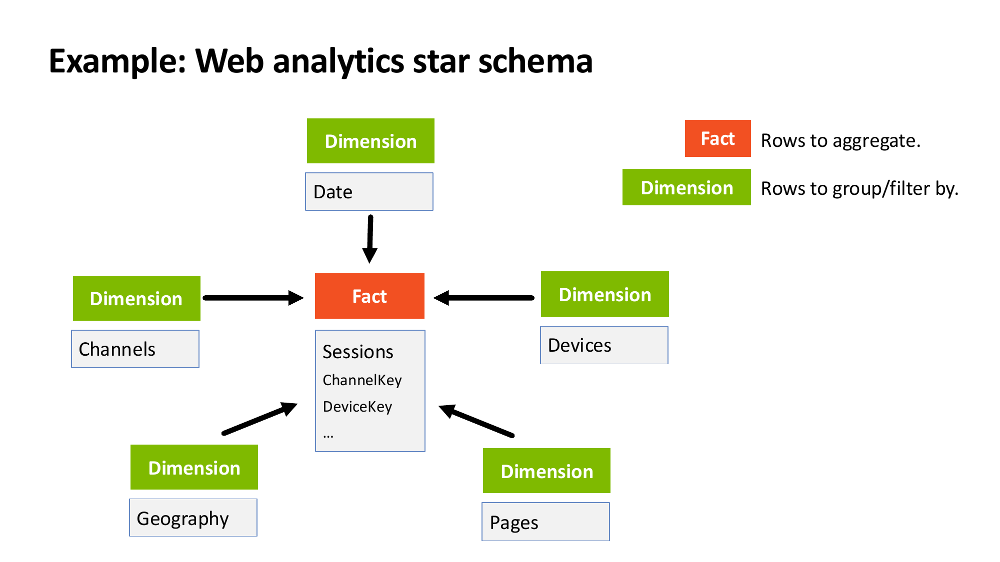

```
Example: Web analytics star schema

                     Dimension                          Fact   Rows to aggregate.

                    Date                           Dimension   Rows to group/filter by.


  Dimension             Fact              Dimension

 Channels           Sessions             Devices
                    ChannelKey
                    DeviceKey
                    …

        Dimension                 Dimension

       Geography                 Pages
```

## Slide 30

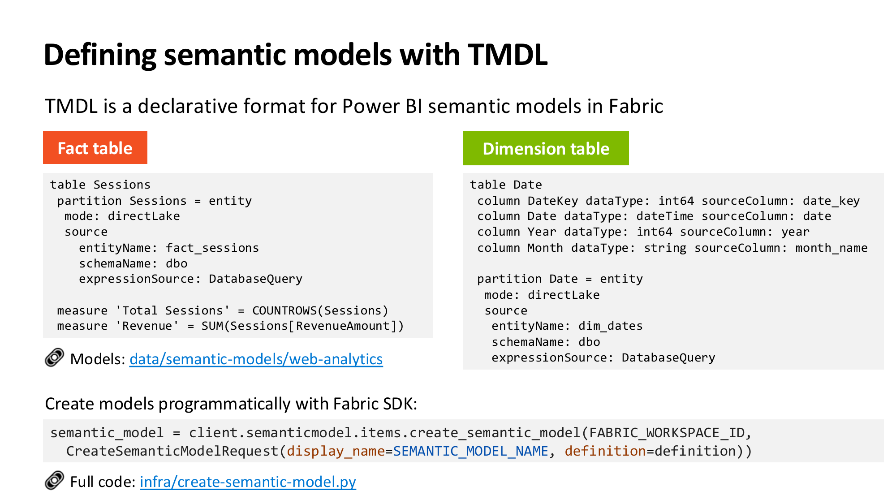

```
Defining semantic models with TMDL
TMDL is a declarative format for Power BI semantic models in Fabric
 Fact table                                          Dimension table
table Sessions                                      table Date
 partition Sessions = entity                         column DateKey dataType: int64 sourceColumn: date_key
  mode: directLake                                   column Date dataType: dateTime sourceColumn: date
  source                                             column Year dataType: int64 sourceColumn: year
    entityName: fact_sessions                        column Month dataType: string sourceColumn: month_name
    schemaName: dbo
    expressionSource: DatabaseQuery                  partition Date = entity
                                                      mode: directLake
 measure 'Total Sessions' = COUNTROWS(Sessions)       source
 measure 'Revenue' = SUM(Sessions[RevenueAmount])      entityName: dim_dates
                                                       schemaName: dbo
   Models: data/semantic-models/web-analytics          expressionSource: DatabaseQuery


Create models programmatically with Fabric SDK:
semantic_model = client.semanticmodel.items.create_semantic_model(FABRIC_WORKSPACE_ID,
  CreateSemanticModelRequest(display_name=SEMANTIC_MODEL_NAME, definition=definition))

   Full code: infra/create-semantic-model.py
```

## Slide 31

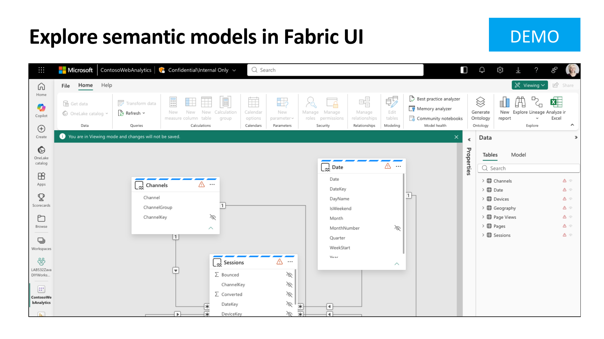

```
Explore semantic models in Fabric UI   DEMO
```

## Slide 32

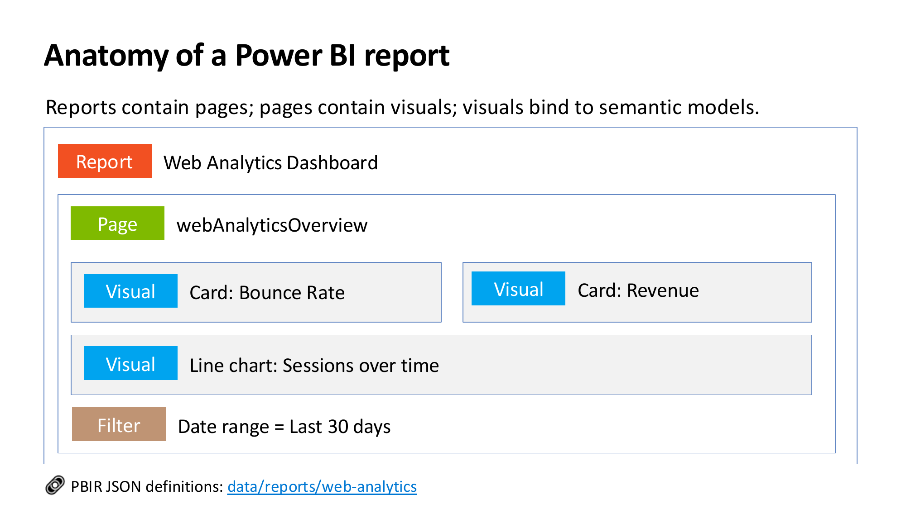

```
Anatomy of a Power BI report
Reports contain pages; pages contain visuals; visuals bind to semantic models.

   Report      Web Analytics Dashboard

     Page       webAnalyticsOverview


      Visual      Card: Bounce Rate                   Visual   Card: Revenue


      Visual      Line chart: Sessions over time

     Filter      Date range = Last 30 days

  PBIR JSON definitions: data/reports/web-analytics
```

## Slide 33

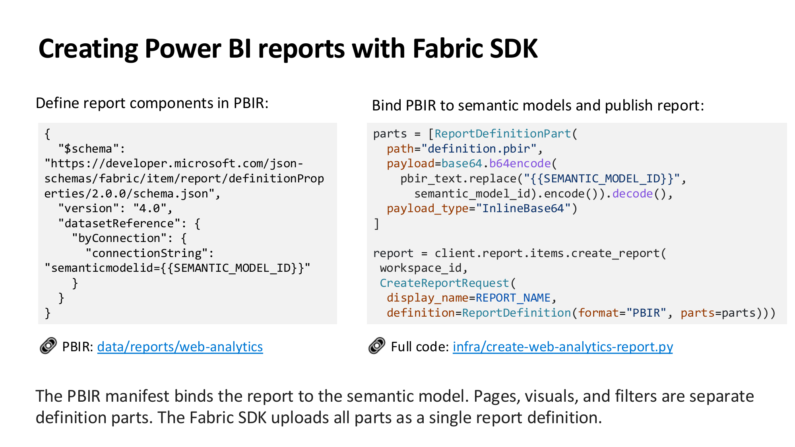

```
Creating Power BI reports with Fabric SDK
Define report components in PBIR:            Bind PBIR to semantic models and publish report:
 {                                            parts = [ReportDefinitionPart(
   "$schema":                                   path="definition.pbir",
 "https://developer.microsoft.com/json-         payload=base64.b64encode(
 schemas/fabric/item/report/definitionProp        pbir_text.replace("{{SEMANTIC_MODEL_ID}}",
 erties/2.0.0/schema.json",                         semantic_model_id).encode()).decode(),
   "version": "4.0",                            payload_type="InlineBase64")
   "datasetReference": {                      ]
     "byConnection": {
       "connectionString":                    report = client.report.items.create_report(
 "semanticmodelid={{SEMANTIC_MODEL_ID}}"       workspace_id,
     }                                         CreateReportRequest(
   }                                            display_name=REPORT_NAME,
 }                                              definition=ReportDefinition(format="PBIR", parts=parts)))

     PBIR: data/reports/web-analytics           Full code: infra/create-web-analytics-report.py


The PBIR manifest binds the report to the semantic model. Pages, visuals, and filters are separate
definition parts. The Fabric SDK uploads all parts as a single report definition.
```

## Slide 34

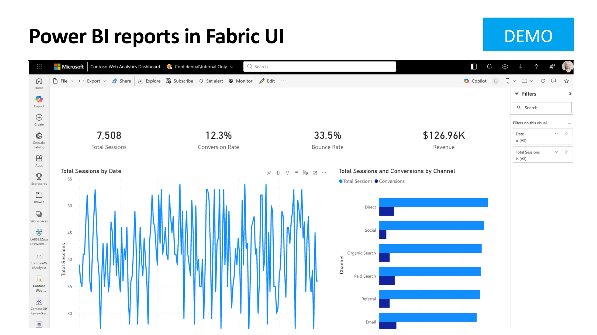

```
Power BI reports in Fabric UI   DEMO
```

## Slide 35

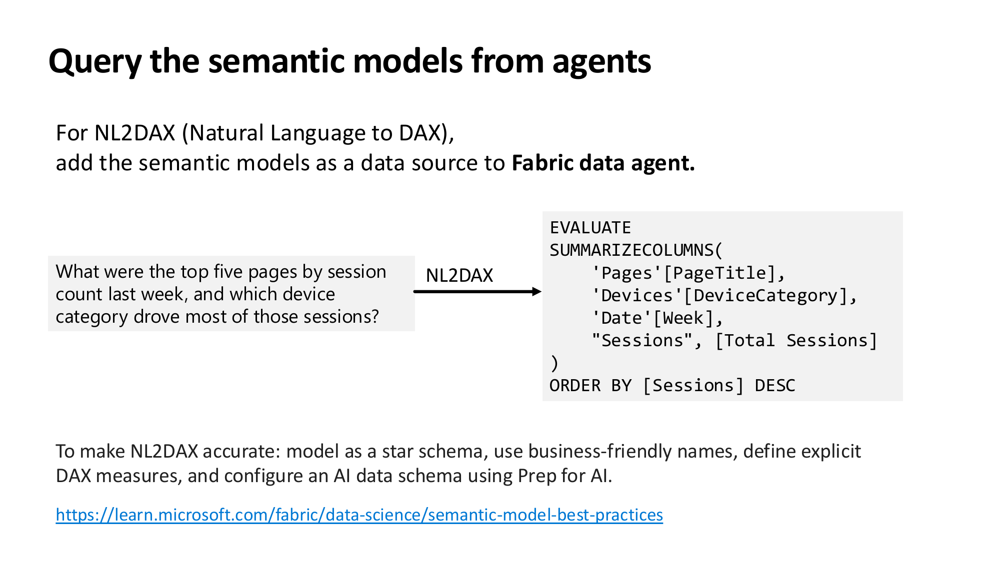

```
Query the semantic models from agents
For NL2DAX (Natural Language to DAX),
add the semantic models as a data source to Fabric data agent.

                                                              EVALUATE
                                                              SUMMARIZECOLUMNS(
What were the top five pages by session       NL2DAX              'Pages'[PageTitle],
count last week, and which device                                 'Devices'[DeviceCategory],
category drove most of those sessions?                            'Date'[Week],
                                                                  "Sessions", [Total Sessions]
                                                              )
                                                              ORDER BY [Sessions] DESC


To make NL2DAX accurate: model as a star schema, use business-friendly names, define explicit
DAX measures, and configure an AI data schema using Prep for AI.
https://learn.microsoft.com/fabric/data-science/semantic-model-best-practices
```

## Slide 36

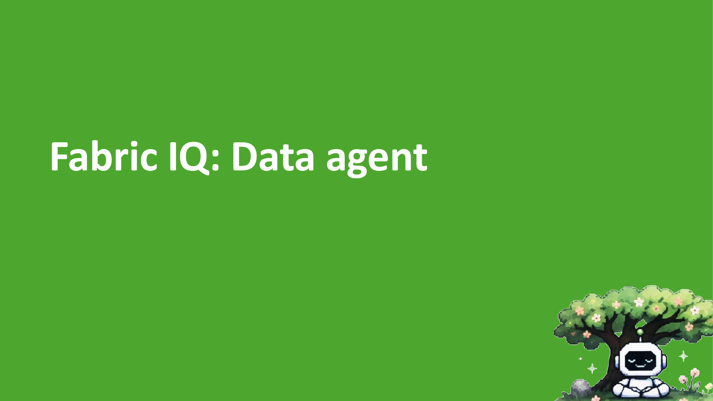

```
Fabric IQ: Data agent
```

## Slide 37

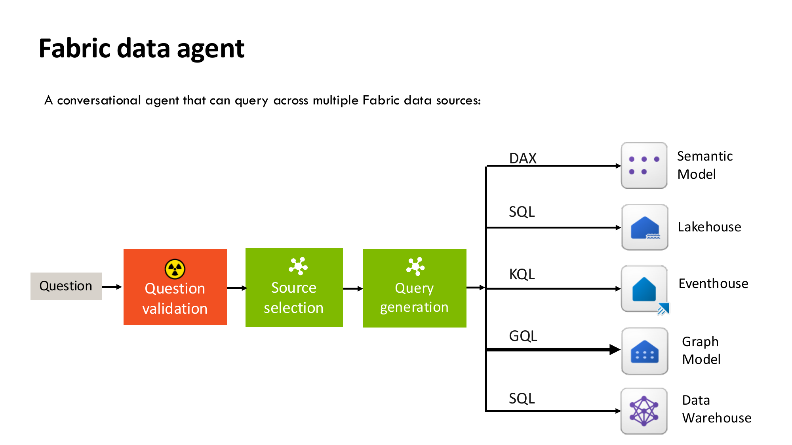

```
Fabric data agent
A conversational agent that can query across multiple Fabric data sources:


                                                                             DAX   Semantic
                                                                                   Model

                                                                             SQL
                                                                                   Lakehouse


                                                                             KQL
Question        Question              Source              Query                    Eventhouse
                validation           selection          generation
                                                                             GQL   Graph
                                                                                   Model

                                                                             SQL   Data
                                                                                   Warehouse
```

## Slide 38

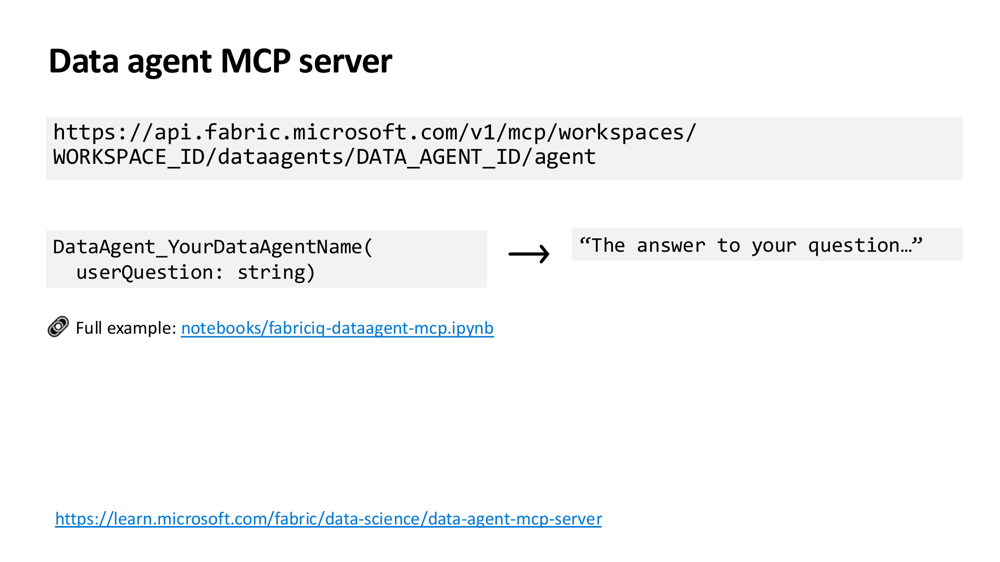

```
Data agent MCP server
https://api.fabric.microsoft.com/v1/mcp/workspaces/
WORKSPACE_ID/dataagents/DATA_AGENT_ID/agent


DataAgent_YourDataAgentName(                                      “The answer to your question…”
  userQuestion: string)

  Full example: notebooks/fabriciq-dataagent-mcp.ipynb


https://learn.microsoft.com/fabric/data-science/data-agent-mcp-server
```

## Slide 39

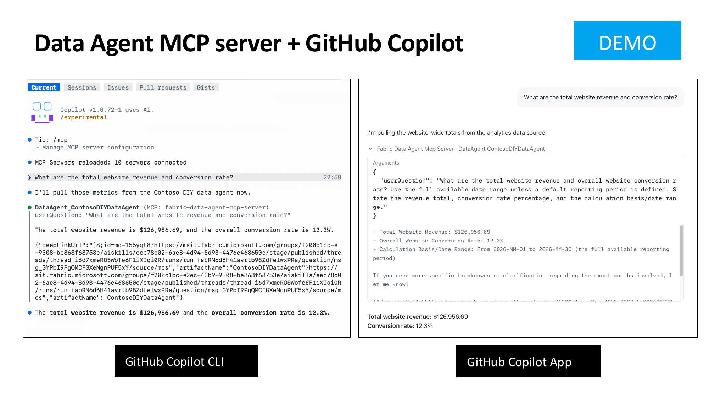

```
Data Agent MCP server + GitHub Copilot                        DEMO


        GitHub Copilot CLI               GitHub Copilot App
```

## Slide 40


```
Recap:
   Foundry IQ knowledge base

                                            Knowledge sources      Output

   Input                                        Search Index       Merged
                                                                   results
Conversation
                           Search query 1       MCP         NEW
                                                                  Activity log
               Retrieval
  Steering                 Search query 2       Work IQ     NEW
instructions
               planning

                                                                   Answer
                                                Fabric IQ   NEW
                                                                  synthesis


    Rewatch session 1 for more on Foundry IQ!
```

## Slide 41

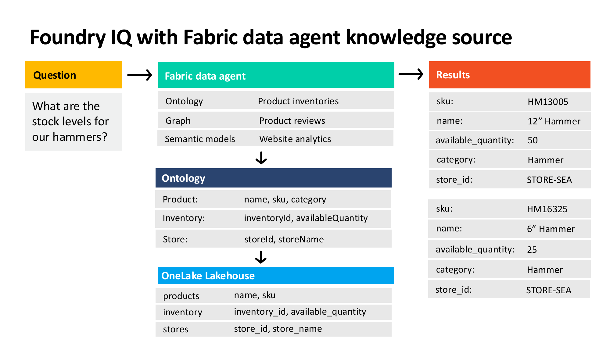

```
Foundry IQ with Fabric data agent knowledge source
Question           Fabric data agent                                  Results

                   Ontology             Product inventories           sku:                  HM13005
What are the
stock levels for   Graph                Product reviews               name:                 12” Hammer
our hammers?       Semantic models      Website analytics             available_quantity:   50
                                                                      category:             Hammer
                   Ontology                                           store_id:             STORE-SEA
                   Product:          name, sku, category
                                                                      sku:                  HM16325
                   Inventory:        inventoryId, availableQuantity
                                                                      name:                 6” Hammer
                   Store:            storeId, storeName
                                                                      available_quantity:   25
                                                                      category:             Hammer
                   OneLake Lakehouse
                                                                      store_id:             STORE-SEA
                   products      name, sku
                   inventory     inventory_id, available_quantity
                   stores        store_id, store_name
```

## Slide 42

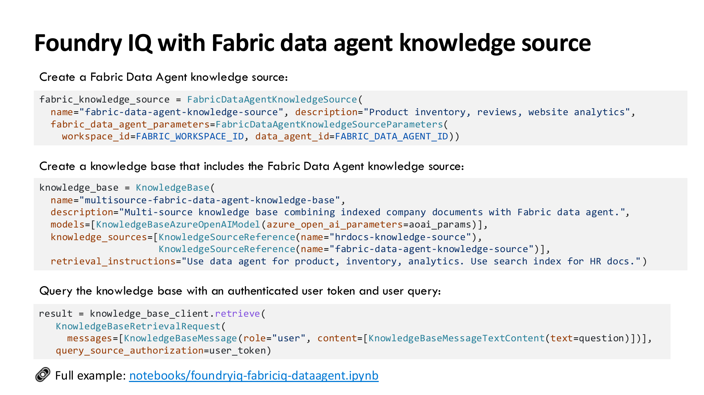

```
Foundry IQ with Fabric data agent knowledge source
Create a Fabric Data Agent knowledge source:
fabric_knowledge_source = FabricDataAgentKnowledgeSource(
  name="fabric-data-agent-knowledge-source", description="Product inventory, reviews, website analytics",
  fabric_data_agent_parameters=FabricDataAgentKnowledgeSourceParameters(
    workspace_id=FABRIC_WORKSPACE_ID, data_agent_id=FABRIC_DATA_AGENT_ID))


Create a knowledge base that includes the Fabric Data Agent knowledge source:
knowledge_base = KnowledgeBase(
  name="multisource-fabric-data-agent-knowledge-base",
  description="Multi-source knowledge base combining indexed company documents with Fabric data agent.",
  models=[KnowledgeBaseAzureOpenAIModel(azure_open_ai_parameters=aoai_params)],
  knowledge_sources=[KnowledgeSourceReference(name="hrdocs-knowledge-source"),
                     KnowledgeSourceReference(name="fabric-data-agent-knowledge-source")],
  retrieval_instructions="Use data agent for product, inventory, analytics. Use search index for HR docs." )


Query the knowledge base with an authenticated user token and user query:
result = knowledge_base_client.retrieve(
   KnowledgeBaseRetrievalRequest(
     messages=[KnowledgeBaseMessage(role="user", content=[KnowledgeBaseMessageTextContent(text=question)])],
   query_source_authorization=user_token)

  Full example: notebooks/foundryiq-fabriciq-dataagent.ipynb
```

## Slide 43

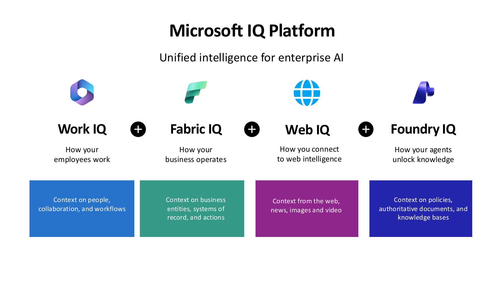

```
Microsoft IQ Platform
                               Unified intelligence for enterprise AI


      Work IQ                    Fabric IQ                 Web IQ                  Foundry IQ
      How your                      How your             How you connect            How your agents
    employees work              business operates       to web intelligence         unlock knowledge


     Context on people,         Context on business     Context from the web,       Context on policies,
collaboration, and workflows    entities, systems of   news, images and video   authoritative documents, and
                                record, and actions                                  knowledge bases
```

## Slide 44


```
JOIN US LIVE


Bi-weekly episodes on Microsoft Reactor, from Aug 6 to Nov 12, 2026.


     Register → aka.ms/MicrosoftIQLive


Follow Microsoft Reactor on YouTube to catch every stream.
```

## Slide 45

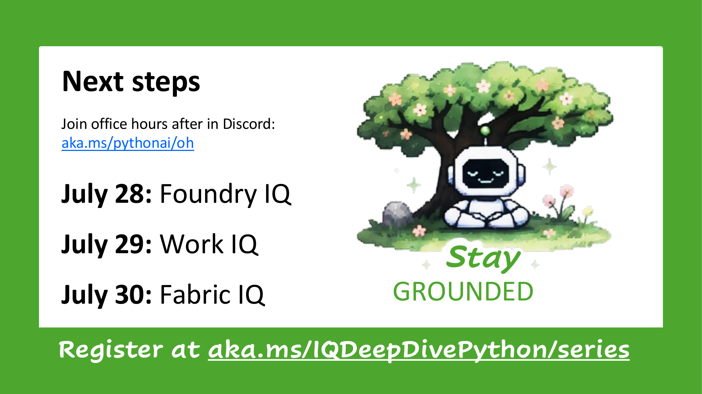

```
Next steps
Join office hours after in Discord:
aka.ms/pythonai/oh


July 28: Foundry IQ
July 29: Work IQ                         Stay
July 30: Fabric IQ                    GROUNDED
Register at aka.ms/IQDeepDivePython/series
```
