# Microsoft IQ Deep Dive with Python: Foundry IQ

📺 [Watch the full recording on YouTube](https://www.youtube.com/watch?v=cbvM3-Xhx90) |
📑 [Download the slides (PDF)](https://aka.ms/iqdeepdive/slides/foundryiq)

This write-up includes an annotated version of the presentation slides with timestamps to the video plus a summary of the live chat Q&A.

## Table of contents

- [Session description](#session-description)
- [Annotated slides](#annotated-slides)
  - [Microsoft IQ Deep Dive with Python series](#microsoft-iq-deep-dive-with-python-series)
  - [Microsoft IQ Deep Dive: Foundry IQ](#microsoft-iq-deep-dive-foundry-iq)
  - [Today's agenda](#todays-agenda)
  - [Getting the code](#getting-the-code)
  - [Microsoft IQ](#microsoft-iq)
  - [The Microsoft IQ platform](#the-microsoft-iq-platform)
  - [Foundry IQ](#foundry-iq)
  - [Knowledge is everywhere](#knowledge-is-everywhere)
  - [Foundry IQ makes knowledge agent-ready](#foundry-iq-makes-knowledge-agent-ready)
  - [Inside a Foundry IQ knowledge base](#inside-a-foundry-iq-knowledge-base)
  - [Indexed knowledge](#indexed-knowledge)
  - [Data ingestion for unstructured data](#data-ingestion-for-unstructured-data)
  - [Two ways to add indexed knowledge](#two-ways-to-add-indexed-knowledge)
  - [Indexed knowledge ingestion pipeline](#indexed-knowledge-ingestion-pipeline)
  - [Hybrid retrieval on indexed knowledge](#hybrid-retrieval-on-indexed-knowledge)
  - [Knowledge bases](#knowledge-bases)
  - [Knowledge base retrieval reasoning effort](#knowledge-base-retrieval-reasoning-effort)
  - [Knowledge base with minimal effort](#knowledge-base-with-minimal-effort)
  - [Example of minimal effort](#example-of-minimal-effort)
  - [Knowledge base with low effort](#knowledge-base-with-low-effort)
  - [Example of low effort](#example-of-low-effort)
  - [Knowledge base with medium effort](#knowledge-base-with-medium-effort)
  - [Example of medium effort](#example-of-medium-effort)
  - [Building a multi-source knowledge base in Python](#building-a-multi-source-knowledge-base-in-python)
  - [Web IQ](#web-iq)
  - [Microsoft Web IQ](#microsoft-web-iq)
  - [Retrieval with the Web IQ MCP server](#retrieval-with-the-web-iq-mcp-server)
  - [Foundry IQ plus Web IQ knowledge source](#foundry-iq-plus-web-iq-knowledge-source)
  - [Foundry IQ inside agents](#foundry-iq-inside-agents)
  - [What is an agent](#what-is-an-agent)
  - [Three ways to use Foundry IQ as an agent tool](#three-ways-to-use-foundry-iq-as-an-agent-tool)
  - [Which retrieval effort to use with agents](#which-retrieval-effort-to-use-with-agents)
  - [Option 1: a custom tool that calls the knowledge base API](#option-1-a-custom-tool-that-calls-the-knowledge-base-api)
  - [Demo: the custom tool agent](#demo-the-custom-tool-agent)
  - [Option 2: the knowledge base MCP endpoint](#option-2-the-knowledge-base-mcp-endpoint)
  - [Wiring the MCP endpoint into an agent](#wiring-the-mcp-endpoint-into-an-agent)
  - [Demo: the MCP agent](#demo-the-mcp-agent)
  - [Option 3: Foundry Toolbox](#option-3-foundry-toolbox)
  - [Creating a Foundry Toolbox from code](#creating-a-foundry-toolbox-from-code)
  - [Using Foundry Toolbox inside an agent](#using-foundry-toolbox-inside-an-agent)
  - [Demo: the toolbox agent](#demo-the-toolbox-agent)
  - [Agent deployment](#agent-deployment)
  - [Foundry Agent Service](#foundry-agent-service)
  - [Foundry hosted agents](#foundry-hosted-agents)
  - [Hosting a Microsoft Agent Framework agent](#hosting-a-microsoft-agent-framework-agent)
  - [Demo: the hosted agent on Foundry](#demo-the-hosted-agent-on-foundry)
  - [Publishing a hosted agent to Teams](#publishing-a-hosted-agent-to-teams)
  - [Next steps and resources](#next-steps-and-resources)
  - [Microsoft IQ Live](#microsoft-iq-live)
- [Live Chat Q&A](#live-chat-qa)

## Session description

In the first session of the Microsoft IQ Deep Dive with Python series, we kicked things off with an introduction to the Microsoft IQ family: Foundry IQ, Work IQ, Fabric IQ, and Web IQ.

We then took a deeper look at Foundry IQ (Azure AI Search), exploring how it helps agents and applications work with curated knowledge and organizational context.

We built knowledge bases in Python and connected them to multiple knowledge sources, including file knowledge sources, search indexes built from ingested data, and the Web IQ MCP server.

Then we performed multi-source agentic retrieval on those knowledge bases, which executes queries in parallel and merges the results with state-of-the-art ranking models.

Finally, we built agents in Python using Microsoft Agent Framework and grounded their responses in Foundry IQ results three different ways: a custom tool calling the knowledge base API, the knowledge base MCP endpoint, and a Foundry Toolbox. We deployed those agents to Foundry Agent Service as hosted agents and published one to Teams.

Work IQ and Fabric IQ knowledge sources were previewed but not connected in this session — those are covered in sessions 2 and 3. All code demos use Python and are available in an open-source repository for you to deploy yourself.

## Annotated slides

### Microsoft IQ Deep Dive with Python series


[Watch from 00:55](https://www.youtube.com/watch?v=cbvM3-Xhx90&t=55s)

This is a three-part live stream series covering all four members of the Microsoft IQ family, with a focus on using them programmatically from Python when building AI applications and agents. Session 1 (July 28) covers Foundry IQ and briefly Web IQ, session 2 (July 29) covers Work IQ, and session 3 (July 30) covers Fabric IQ. Register at [aka.ms/IQDeepDivePython/series](https://aka.ms/IQDeepDivePython/series).

### Microsoft IQ Deep Dive: Foundry IQ

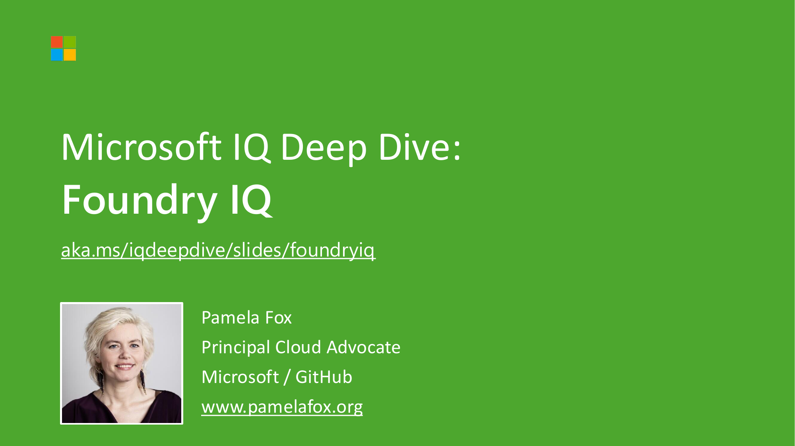
[Watch from 01:52](https://www.youtube.com/watch?v=cbvM3-Xhx90&t=112s)

Slides are at [aka.ms/iqdeepdive/slides/foundryiq](https://aka.ms/iqdeepdive/slides/foundryiq) and are free to reuse for delivering this content to your own community or colleagues. Presented by Pamela Fox, Principal Cloud Advocate at Microsoft and GitHub, focused on building AI applications and agents in Python.

### Today's agenda

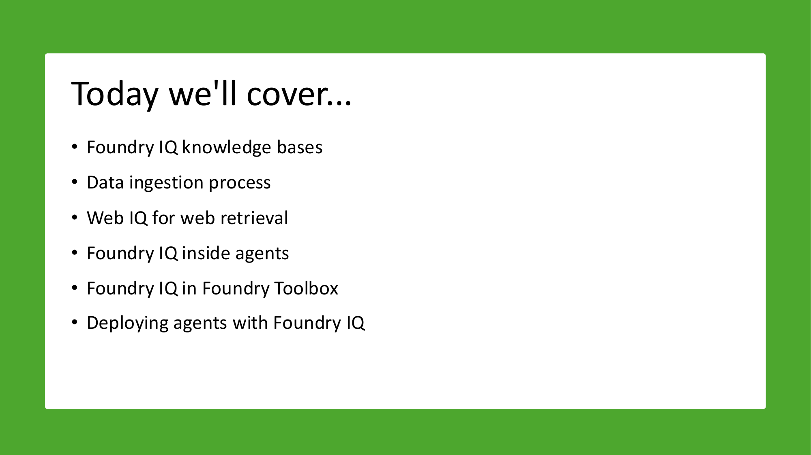
[Watch from 02:42](https://www.youtube.com/watch?v=cbvM3-Xhx90&t=162s)

The session covers Foundry IQ knowledge bases, the data ingestion process, Web IQ for web retrieval, Foundry IQ inside agents, Foundry IQ in Foundry Toolbox, and deploying agents that use Foundry IQ.

### Getting the code


[Watch from 03:51](https://www.youtube.com/watch?v=cbvM3-Xhx90&t=231s)

All code across the three sessions lives in one repository at [aka.ms/iqdeepdive](https://aka.ms/iqdeepdive) — Jupyter notebooks, agents, and infrastructure. Use the "Code" button to open a GitHub Codespace. Running the code requires an Azure account, plus Fabric and Work IQ licenses for the later sessions, so not every sample is runnable by everyone. All notebook output is checked into the repo, so you can read the results without running anything.

### Microsoft IQ


[Watch from 04:56](https://www.youtube.com/watch?v=cbvM3-Xhx90&t=296s)

### The Microsoft IQ platform

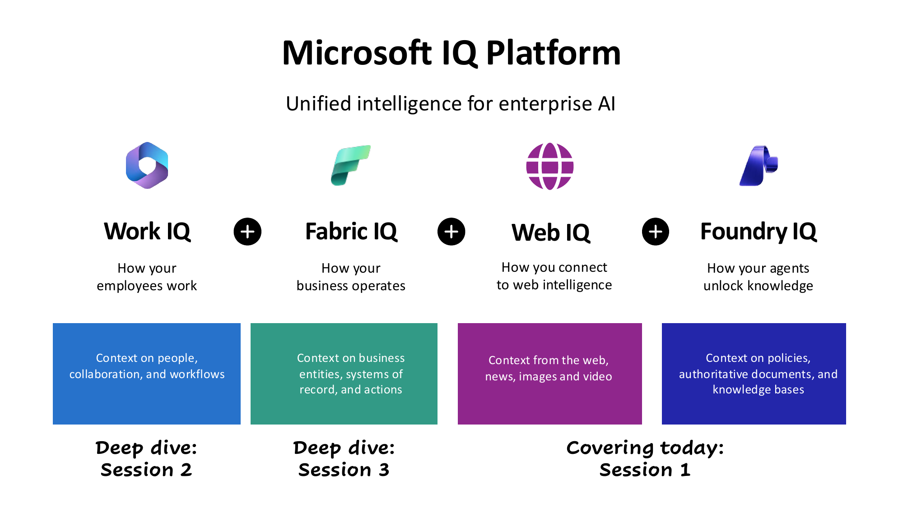
[Watch from 05:49](https://www.youtube.com/watch?v=cbvM3-Xhx90&t=349s)

LLMs are powerful, but they are at their best when grounded in your domain's information. Microsoft IQ is a unified intelligence layer that covers the different kinds of context an AI application needs.

Work IQ covers how your employees work, bringing in Microsoft 365 data: Teams, email, calendar, SharePoint, and Office documents. Fabric IQ covers how your business operates, exposing relational, analytics, and reporting data stored in Microsoft Fabric in an agent-friendly way. Web IQ connects to real-time web intelligence like news, weather, images, and video. Foundry IQ unlocks knowledge from policies, authoritative documents, and knowledge bases, and can also route to the other three.

### Foundry IQ


[Watch from 07:40](https://www.youtube.com/watch?v=cbvM3-Xhx90&t=460s)

### Knowledge is everywhere

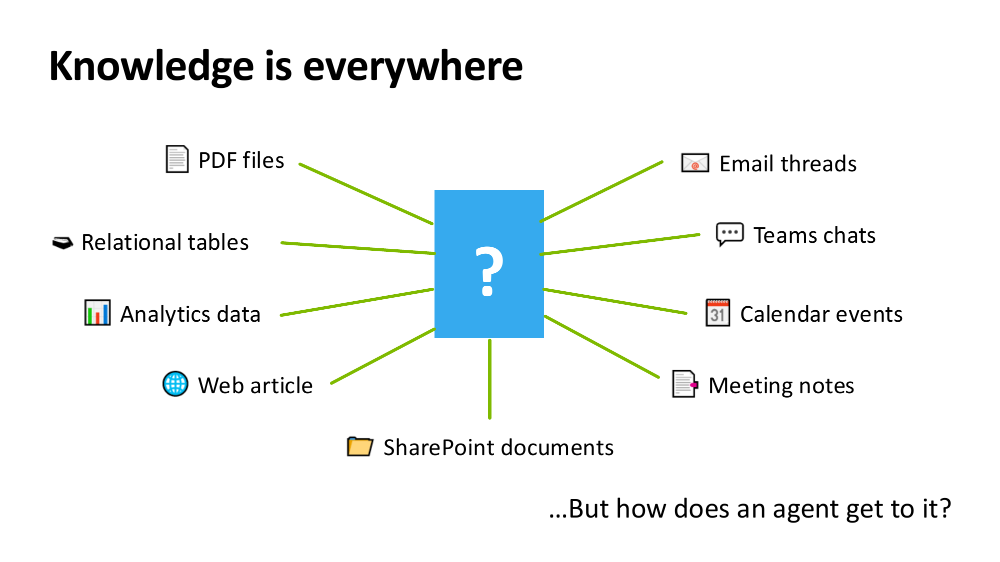
[Watch from 07:46](https://www.youtube.com/watch?v=cbvM3-Xhx90&t=466s)

Knowledge lives in relational tables, analytics data, web articles, SharePoint documents, PDFs, CSVs, text, JSON, markdown, email threads, Teams chats, calendar events, and meeting notes. The problem Foundry IQ tackles is finding the right information efficiently across that many sources and formats.

### Foundry IQ makes knowledge agent-ready

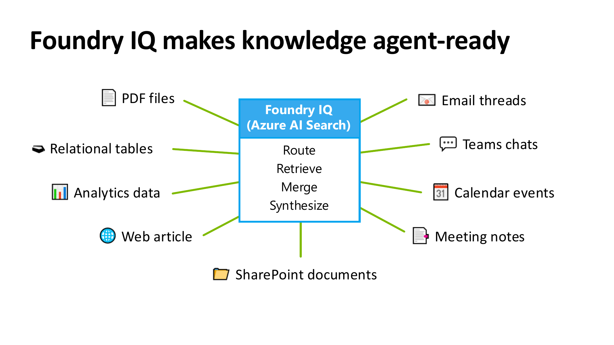
[Watch from 08:23](https://www.youtube.com/watch?v=cbvM3-Xhx90&t=503s)

Foundry IQ is Azure AI Search — treat the two names as the same thing. It handles four steps: routing to the right sources, retrieving from them, merging the results, and optionally synthesizing an answer. That covers the entire retrieval process.

### Inside a Foundry IQ knowledge base

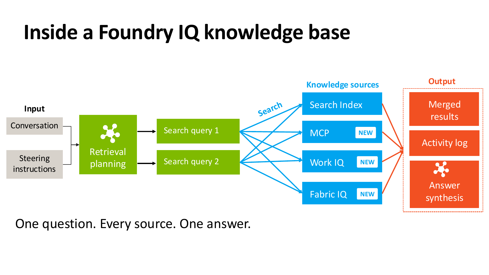
[Watch from 09:11](https://www.youtube.com/watch?v=cbvM3-Xhx90&t=551s)

A knowledge base performs multi-step retrieval across multiple sources. The input is usually an entire conversation rather than a single query, since most applications are chatbots or agents, plus optional steering instructions.

Retrieval planning uses an LLM to turn that conversation into one or more search queries and to select which knowledge sources to hit. Those queries go to the selected sources in parallel, so total retrieval time is bounded by the slowest source rather than the sum of all of them. Knowledge sources can be search indexes, MCP servers, Work IQ, or Fabric IQ.

The results come back, get merged, and get reranked against the original query. The output includes merged results, an activity log of everything that happened, and optionally a synthesized answer. One question, every source, one answer.

### Indexed knowledge

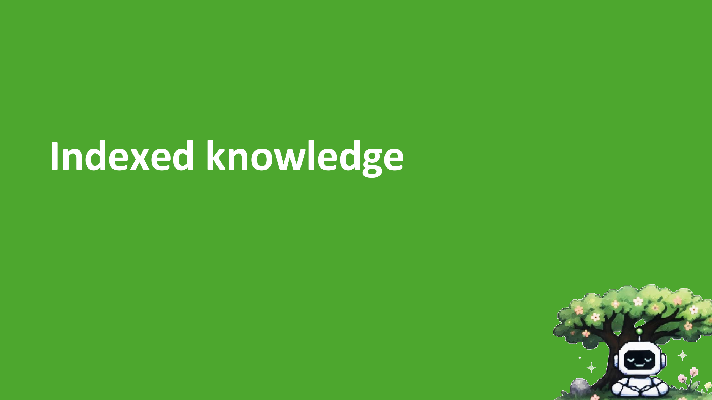
[Watch from 11:39](https://www.youtube.com/watch?v=cbvM3-Xhx90&t=699s)

### Data ingestion for unstructured data

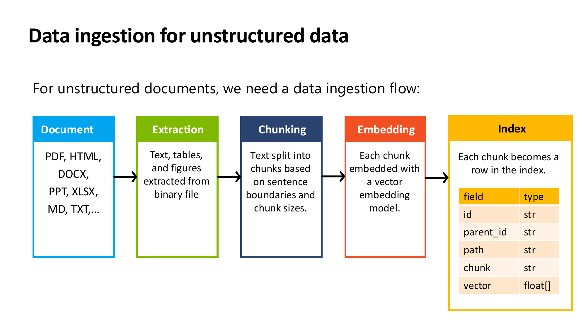
[Watch from 12:08](https://www.youtube.com/watch?v=cbvM3-Xhx90&t=728s)

Unstructured files — PDF, HTML, DOCX, PPT, XLSX, MD, TXT — need an ingestion flow before they can be searched.

Extraction pulls text, tables, and figures out of the binary file while dropping formatting noise. Good extraction also captures figures: the image itself, a description of it, and its position relative to the surrounding text.

Chunking splits the text into pieces sized for LLM consumption, typically 500 to 1000 tokens. Sending a whole 20-page document to the LLM when the answer is one paragraph on page three wastes context. Chunking algorithms can be character-based, token-based, or semantic (chunking on section boundaries).

Embedding turns each chunk into a vector of floating point numbers representing that text in a multi-dimensional semantic space, which enables searching by meaning rather than just keywords.

Each chunk becomes a row in the index with `id`, `parent_id` (the source document), `path` (the file location, often blob storage), `chunk` (the text), and `vector` (the embedding). Additional metadata is optional, but those five fields are the practical minimum.

### Two ways to add indexed knowledge

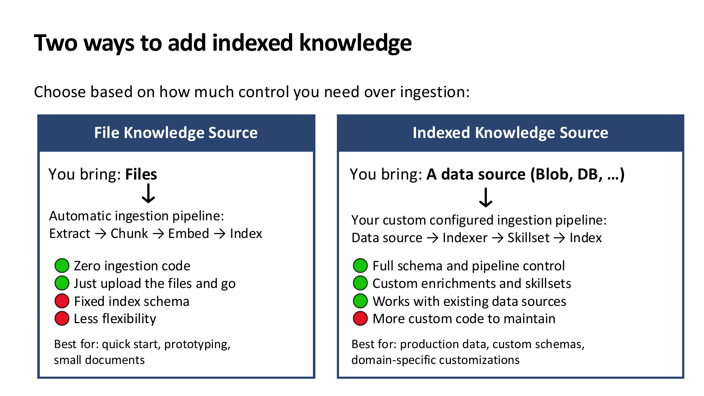
[Watch from 15:00](https://www.youtube.com/watch?v=cbvM3-Xhx90&t=900s)

The **file knowledge source** is the new easy path: you upload files directly, with no data source to configure and zero ingestion code. The pipeline (extract, chunk, embed, index) runs automatically. The tradeoff is a fixed index schema and less flexibility. Best for prototyping, quick starts, and small document sets.

The **indexed knowledge source** is the production path: you bring a data source such as Blob Storage, ADLS Gen2, Cosmos DB, or Postgres, and configure your own pipeline of data source, indexer, and skillset. You get full schema and pipeline control, custom enrichments, and integration with existing data sources, at the cost of more custom code to maintain.

### Indexed knowledge ingestion pipeline

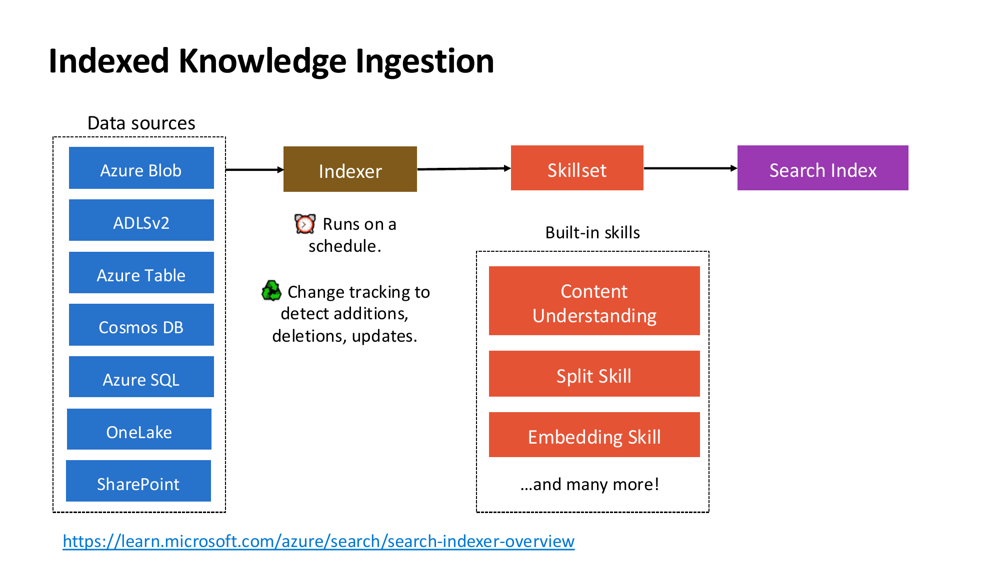
[Watch from 16:24](https://www.youtube.com/watch?v=cbvM3-Xhx90&t=984s)

Built-in indexers connect to Azure Blob, ADLSv2, Azure Table, Cosmos DB, Azure SQL, OneLake, and SharePoint, among others. The indexer runs on a schedule with built-in change tracking, so it detects additions, deletions, and updates and only reprocesses what changed.

When the indexer finds new content, it runs the skillset. Content Understanding handles document extraction including images, figures, and tables. The Split skill handles chunking. The Embedding skill connects to an Azure OpenAI embedding model. Start with built-in skills; they cover most cases and the embedding skill works with any Azure OpenAI embedding model. If you need a different embedding model or logic the built-ins can't express, write a custom skill as an Azure Function that receives the input and returns the enriched output. The final output of the skillset lands in the search index. Reference: [Indexer overview](https://learn.microsoft.com/azure/search/search-indexer-overview).

### Hybrid retrieval on indexed knowledge

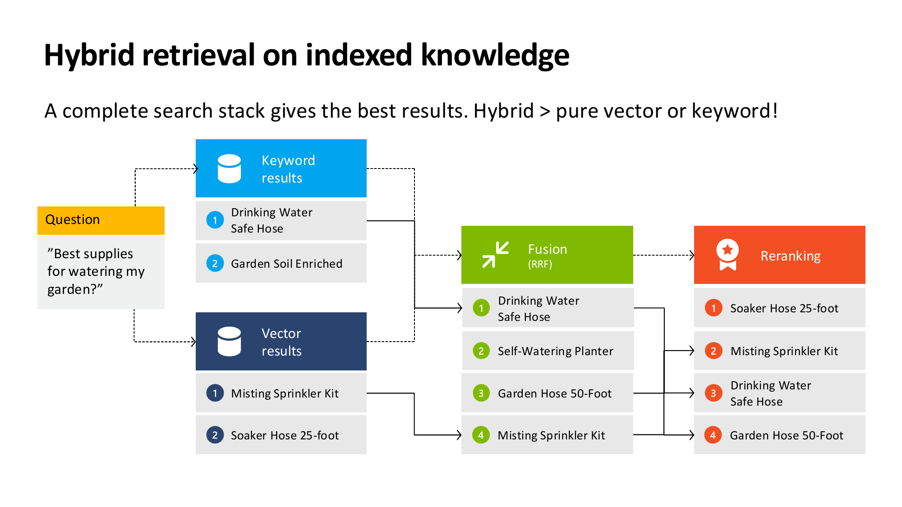
[Watch from 18:43](https://www.youtube.com/watch?v=cbvM3-Xhx90&t=1123s)

Hybrid search combines vector and keyword search, and it beats either one alone. Vector search is excellent but cannot answer every query; exact keyword matches still matter.

The keyword results and vector results are merged with reciprocal rank fusion (RRF), which combines them based on the relative rank of each result in its sub-list. The fused list then goes to a reranking model, which looks at the original query and the results and decides the optimal ordering. That reranker is typically a cross-encoder rather than an LLM, so it is fast. It lets you take 50 merged results and be confident that the top 10 are genuinely the most relevant.

### Knowledge bases

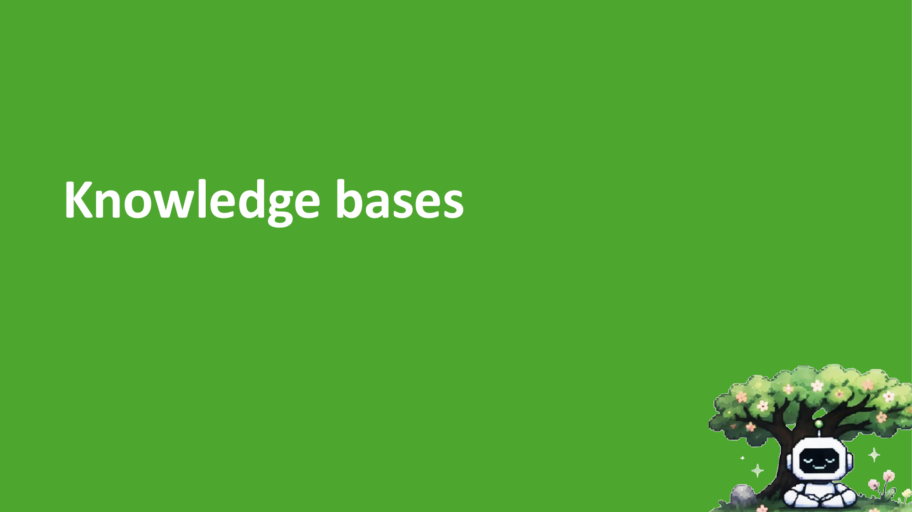
[Watch from 20:40](https://www.youtube.com/watch?v=cbvM3-Xhx90&t=1240s)

### Knowledge base retrieval reasoning effort

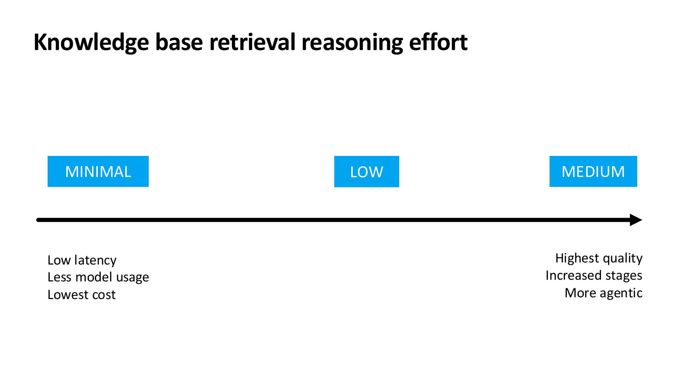
[Watch from 21:01](https://www.youtube.com/watch?v=cbvM3-Xhx90&t=1261s)

Knowledge bases have three retrieval reasoning effort levels: minimal, low, and medium. Minimal gives low latency, less model usage, and lowest cost. Medium gives the highest quality with more stages and more agentic behavior. There is no "high" yet — the likely addition is an "auto" mode that picks the level for you, similar to the GitHub Copilot model picker.

### Knowledge base with minimal effort

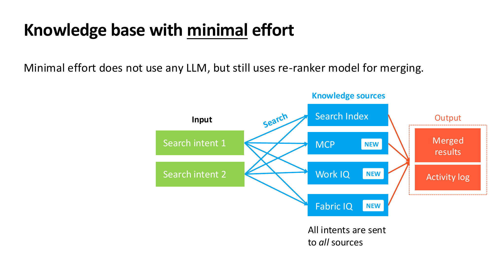
[Watch from 21:24](https://www.youtube.com/watch?v=cbvM3-Xhx90&t=1284s)

Minimal effort uses no LLM at all. You supply the search intents yourself, and every intent is sent to every configured source in parallel. There is no query planning and no source selection.

What you still get is parallel search execution and result merging with the reranker model. That is a lot of value for very little latency and cost, and it is a good fit when the calling agent is already handling query writing.

### Example of minimal effort

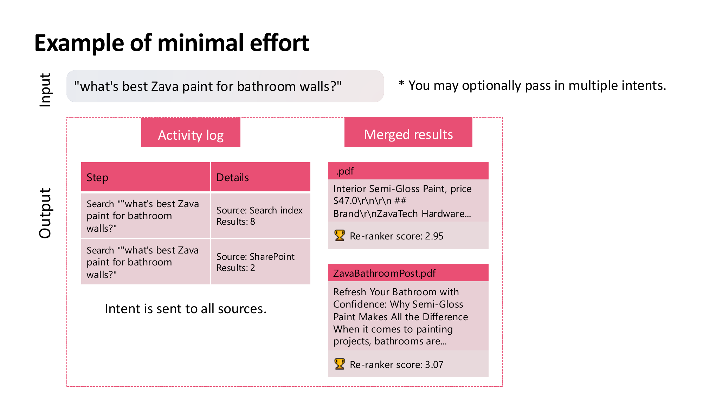
[Watch from 22:38](https://www.youtube.com/watch?v=cbvM3-Xhx90&t=1358s)

For the input "what's best Zava paint for bathroom walls?", the activity log shows the same intent sent to both the search index (8 results) and SharePoint (2 results). The merged results come back with reranker scores — 2.95 for the interior semi-gloss paint product page, 3.07 for the bathroom blog post PDF. You may optionally pass in multiple intents.

### Knowledge base with low effort

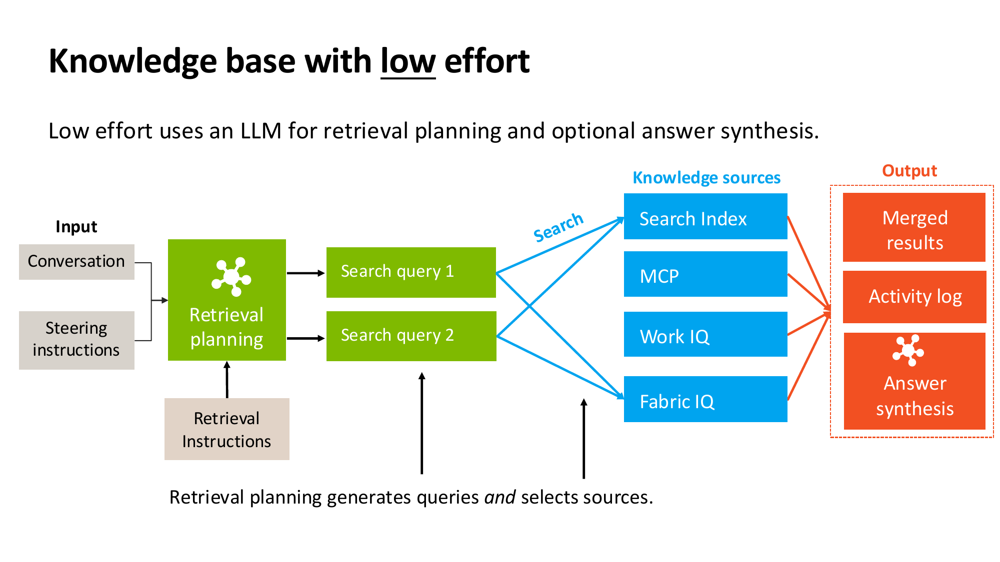
[Watch from 23:06](https://www.youtube.com/watch?v=cbvM3-Xhx90&t=1386s)

Low effort brings in the LLM for retrieval planning: it reads the conversation, generates the search queries, and selects which sources to send them to. Source selection matters most when a knowledge base has many connected sources, since it avoids wasting queries on sources that clearly can't answer. Because there is an LLM in the loop, low effort can also synthesize the final answer, covering the full path from user question to answer.

### Example of low effort

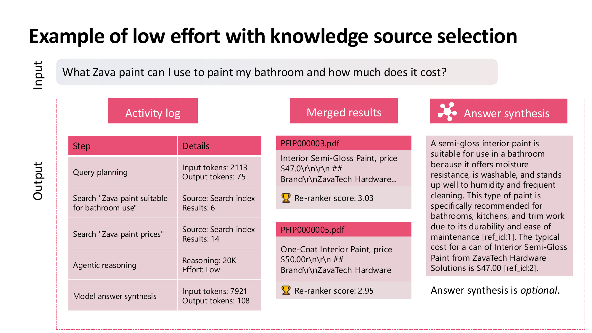
[Watch from 24:22](https://www.youtube.com/watch?v=cbvM3-Xhx90&t=1462s)

For "What Zava paint can I use to paint my bathroom and how much does it cost?", query planning used 2113 input and 75 output tokens to produce two queries: "Zava paint suitable for bathroom use" and "Zava paint prices". Both went to the search index only. Agentic reasoning consumed 20K reasoning tokens at low effort, then answer synthesis used 7921 input and 108 output tokens to produce an answer with `[ref_id:1]` and `[ref_id:2]` citations. Answer synthesis is optional.

### Knowledge base with medium effort

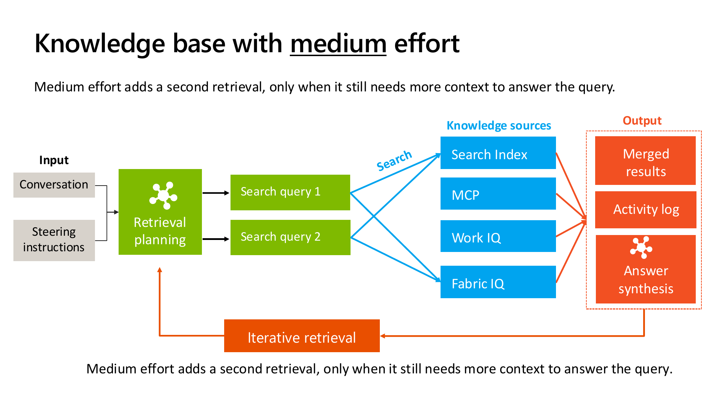
[Watch from 24:59](https://www.youtube.com/watch?v=cbvM3-Xhx90&t=1499s)

Medium effort adds a second retrieval round, but only when it is needed. A purpose-trained model examines the question and the results and decides whether there is enough information to answer. Sometimes the first search missed what was actually needed, or the question is multi-hop and requires information from the first round to formulate the second. When that model says more is needed, the whole retrieval process runs again. It takes longer, but it handles complex multi-hop questions that single-pass retrieval can't.

### Example of medium effort

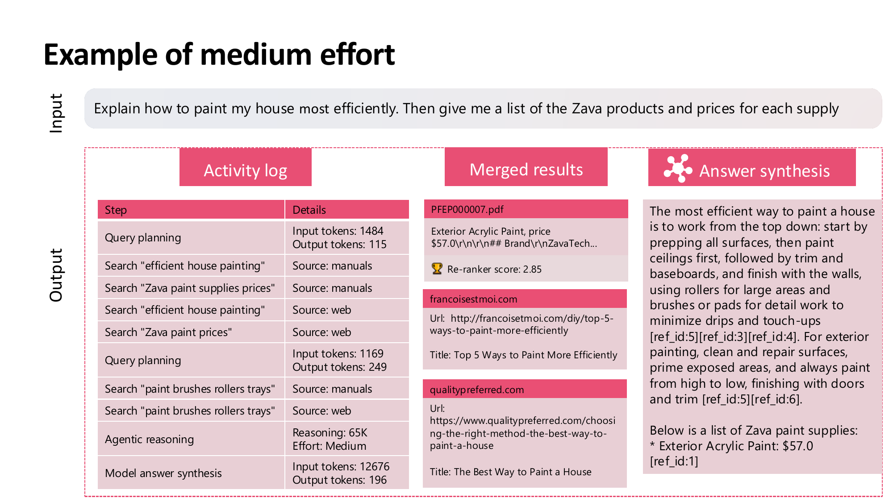
[Watch from 26:23](https://www.youtube.com/watch?v=cbvM3-Xhx90&t=1583s)

For "Explain how to paint my house most efficiently. Then give me a list of the Zava products and prices for each supply", the first round issued two queries against two sources (manuals and web) for four retrievals. The model then determined more context was needed, so a second query planning step issued "paint brushes rollers trays" to both sources. Agentic reasoning at medium effort consumed 65K reasoning tokens, and answer synthesis used 12676 input tokens to produce an answer citing both indexed product data and web articles.

Knowing all three levels matters because different situations call for different tradeoffs, and you want to make that choice deliberately.

### Building a multi-source knowledge base in Python

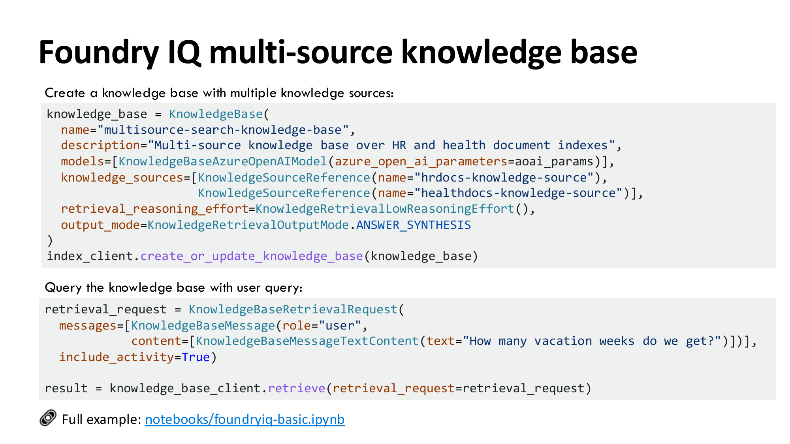
[Watch from 27:37](https://www.youtube.com/watch?v=cbvM3-Xhx90&t=1657s)

Creating a multi-source knowledge base takes one call:

```python
knowledge_base = KnowledgeBase(
  name="multisource-search-knowledge-base",
  description="Multi-source knowledge base over HR and health document indexes",
  models=[KnowledgeBaseAzureOpenAIModel(azure_open_ai_parameters=aoai_params)],
  knowledge_sources=[KnowledgeSourceReference(name="hrdocs-knowledge-source"),
                     KnowledgeSourceReference(name="healthdocs-knowledge-source")],
  retrieval_reasoning_effort=KnowledgeRetrievalLowReasoningEffort(),
  output_mode=KnowledgeRetrievalOutputMode.ANSWER_SYNTHESIS)

index_client.create_or_update_knowledge_base(knowledge_base)

retrieval_request = KnowledgeBaseRetrievalRequest(
  messages=[KnowledgeBaseMessage(role="user",
            content=[KnowledgeBaseMessageTextContent(text="How many vacation weeks do we get?")])],
  include_activity=True)

result = knowledge_base_client.retrieve(retrieval_request=retrieval_request)
```

Full example: `notebooks/foundryiq-basic.ipynb`.

In the live demo, uploading a single local markdown file to a file knowledge source took about 25 seconds, because that upload runs the full extract, chunk, and embed pipeline. Knowledge base models are currently limited to Azure OpenAI models — GPT-4o, 4.1, and 5.4 work well, 5.6 was not yet supported at the time of the session.

Querying the file-backed knowledge base with answer synthesis returned in about 5 seconds with an answer containing inline citations. Answer synthesis mode guarantees citations; if you write your own application, put the citation instruction in your prompt explicitly.

The activity log is the most valuable debugging output. In the demo it showed query planning generating three distinct queries, all three sent to the file knowledge source, then the answer synthesis step and reranking token counts. When you run evaluations, give the evaluator access to the activity log — a failure could come from bad ingestion, bad query planning, or the wrong model, and only the activity log distinguishes them. The references array ties the `[ref_id:N]` citations in the answer back to specific chunks and file paths, so an application can render clickable citations that open the source file.

The demo then switched to two pre-built search indexes (50 chunks and 334 chunks; the index reports "documents" but they are document chunks) wrapped as search index knowledge sources, and combined both into one knowledge base. A deliberately complex question caused the knowledge base to send three queries to each of the two sources — six retrievals total — and still return quickly because they run in parallel.

### Web IQ


[Watch from 37:16](https://www.youtube.com/watch?v=cbvM3-Xhx90&t=2236s)

This is the move from indexed sources to remote sources. With a remote source, the data is never stored in a Foundry IQ index — it stays remote and fresh, and is pulled in at query time and merged through the reranker with your indexed results. Combining indexed and remote data in one retrieval is the point, because realistically some of your data is indexed and some isn't.

### Microsoft Web IQ

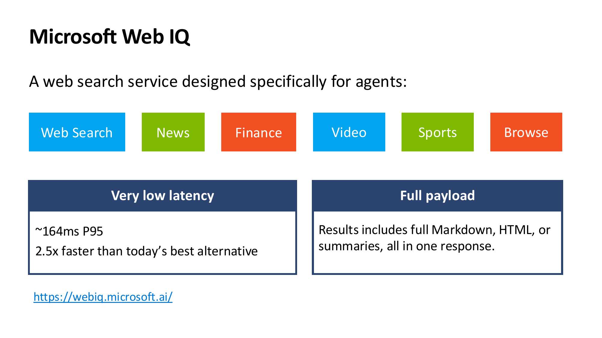
[Watch from 37:46](https://www.youtube.com/watch?v=cbvM3-Xhx90&t=2266s)

Web IQ is a web search service designed specifically for agents, announced at Build. It offers web search, news, finance, video, sports, and browse tools. Latency is roughly 164ms at P95, about 2.5x faster than the best alternative. Results include the full payload — markdown, HTML, or summaries — in a single response, so there is no separate fetch step.

Web IQ is in private preview and available only to allow-listed customers. Microsoft is also working with web publishers so the service works for the people running websites, not just for agents. More at [webiq.microsoft.ai](https://webiq.microsoft.ai/).

### Retrieval with the Web IQ MCP server

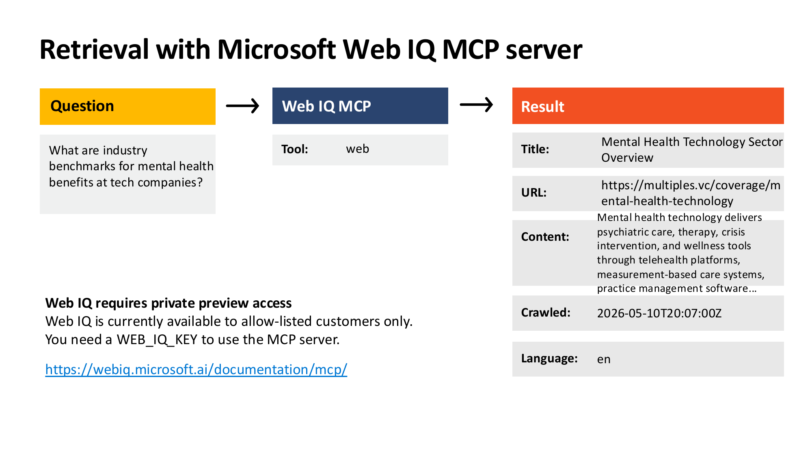
[Watch from 39:12](https://www.youtube.com/watch?v=cbvM3-Xhx90&t=2352s)

Web IQ exposes an MCP server with separate tools for web, news, video, and more. Calling the `web` tool with "What are industry benchmarks for mental health benefits at tech companies?" returns a title, URL, full content, crawl date, and language for each result. Using it requires a `WEB_IQ_KEY`. Documentation: [webiq.microsoft.ai/documentation/mcp](https://webiq.microsoft.ai/documentation/mcp/).

### Foundry IQ plus Web IQ knowledge source

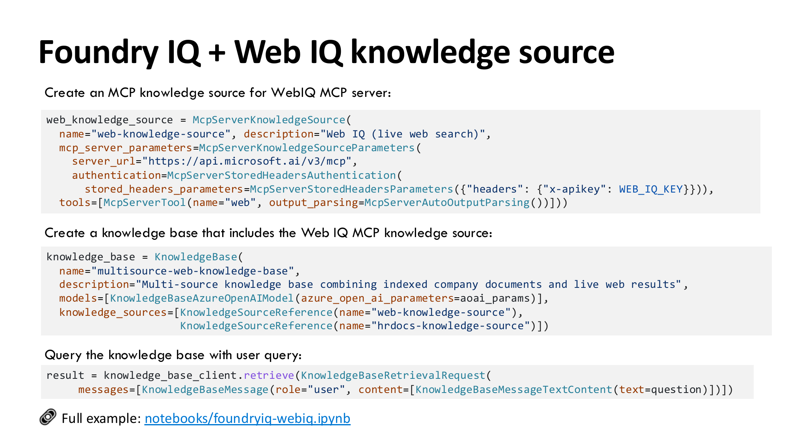
[Watch from 39:45](https://www.youtube.com/watch?v=cbvM3-Xhx90&t=2385s)

Foundry IQ can bring in any MCP server as a knowledge source, as long as you can authenticate to it:

```python
web_knowledge_source = McpServerKnowledgeSource(
  name="web-knowledge-source", description="Web IQ (live web search)",
  mcp_server_parameters=McpServerKnowledgeSourceParameters(
    server_url="https://api.microsoft.ai/v3/mcp",
    authentication=McpServerStoredHeadersAuthentication(
      stored_headers_parameters=McpServerStoredHeadersParameters({"headers": {"x-apikey": WEB_IQ_KEY}})),
    tools=[McpServerTool(name="web", output_parsing=McpServerAutoOutputParsing())]))
```

The knowledge base then combines the indexed HR documents with the web knowledge source. Once a knowledge base has several sources, retrieval instructions become important — the demo used "use the HR source for company policy questions and use the Web IQ tool for context from public web pages" to help source selection.

A question combining internal mental health coverage with industry benchmarks at other tech companies completed in 16 seconds and returned both internal document results and web results in one merged summary. In the activity log, the MCP server entry showed the query it generated for the web tool, and the references for MCP sources come back as JSON containing title, URL, and a large content payload.

### Foundry IQ inside agents

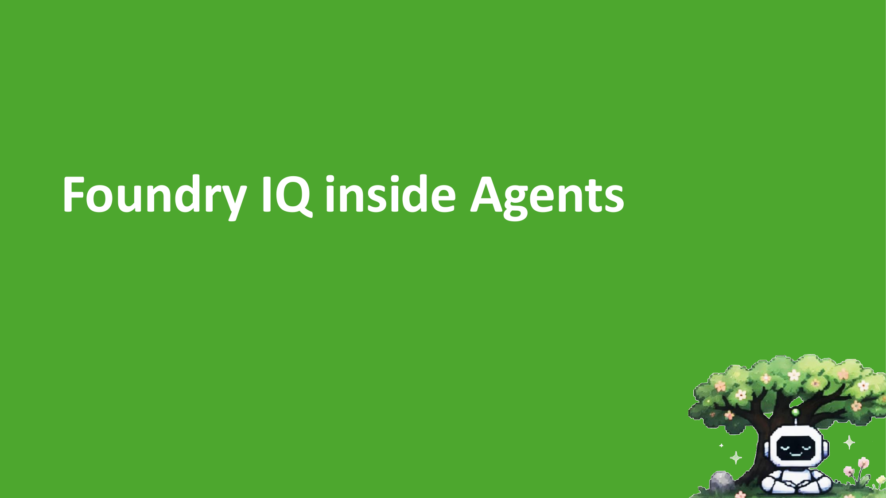
[Watch from 43:35](https://www.youtube.com/watch?v=cbvM3-Xhx90&t=2615s)

### What is an agent

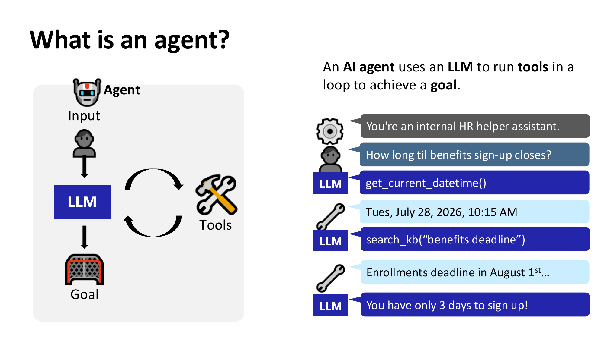
[Watch from 43:48](https://www.youtube.com/watch?v=cbvM3-Xhx90&t=2628s)

An AI agent uses an LLM to run tools in a loop to achieve a goal. For an internal HR helper asked "How long til benefits sign-up closes?", the LLM calls `get_current_datetime()`, gets back "Tues, July 28, 2026, 10:15 AM", calls `search_kb("benefits deadline")`, learns the enrollment deadline is August 1st, and answers "You have only 3 days to sign up!" The loop continues until the LLM has enough information. It is a simple concept that becomes powerful once the agent has the right tools.

### Three ways to use Foundry IQ as an agent tool

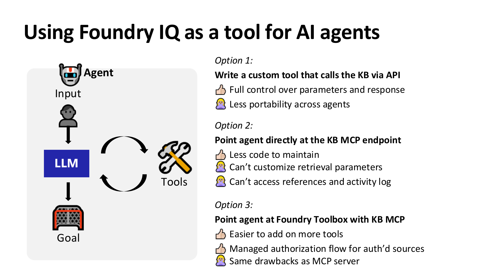
[Watch from 44:48](https://www.youtube.com/watch?v=cbvM3-Xhx90&t=2688s)

Option 1 is a custom tool that calls the knowledge base via the API. You get full control over parameters and response, but less portability across agents.

Option 2 is pointing the agent directly at the knowledge base MCP endpoint — every knowledge base exposes one. Less code to maintain, but you can't customize retrieval parameters and you can't access the references or activity log.

Option 3 is pointing the agent at a Foundry Toolbox containing the knowledge base MCP. It is easier to add more tools and you get a managed authorization flow for authenticated sources, with the same drawbacks as the raw MCP server.

### Which retrieval effort to use with agents

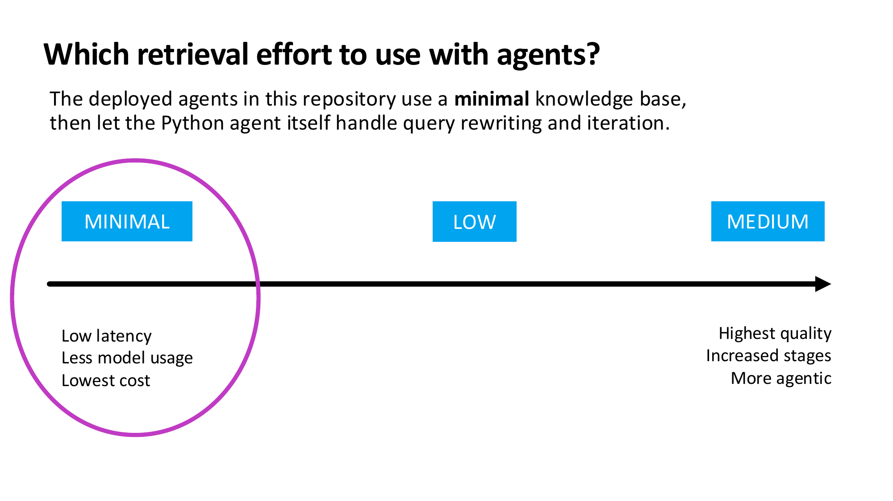
[Watch from 45:42](https://www.youtube.com/watch?v=cbvM3-Xhx90&t=2742s)

The deployed agents in the repository use a minimal-effort knowledge base and let the Python agent handle query rewriting and iteration itself. A knowledge base is itself agentic, so the real decision is how much of the knowledge base's agentic ability you want versus your agent's. The one thing the agent can't replicate is source selection, since that only happens inside the knowledge base. If you value the knowledge base's own query rewriting and iterative retrieval, use low or medium instead.

### Option 1: a custom tool that calls the knowledge base API

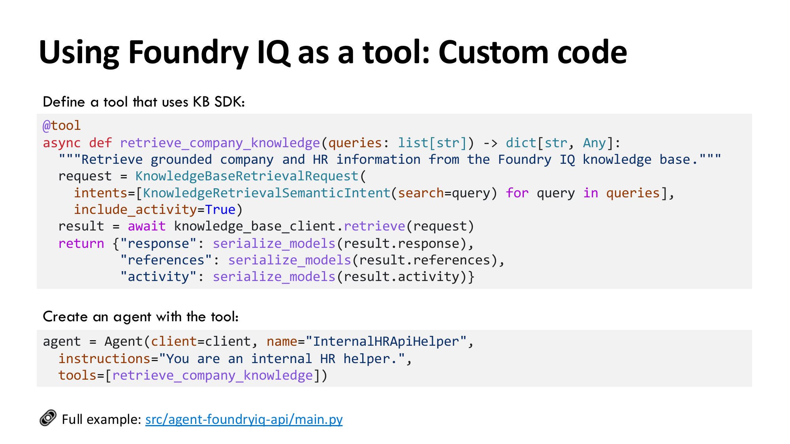
[Watch from 46:58](https://www.youtube.com/watch?v=cbvM3-Xhx90&t=2818s)

```python
@tool
async def retrieve_company_knowledge(queries: list[str]) -> dict[str, Any]:
  """Retrieve grounded company and HR information from the Foundry IQ knowledge base."""
  request = KnowledgeBaseRetrievalRequest(
    intents=[KnowledgeRetrievalSemanticIntent(search=query) for query in queries],
    include_activity=True)
  result = await knowledge_base_client.retrieve(request)
  return {"response": serialize_models(result.response),
          "references": serialize_models(result.references),
          "activity": serialize_models(result.activity)}

agent = Agent(client=client, name="InternalHRApiHelper",
  instructions="You are an internal HR helper.",
  tools=[retrieve_company_knowledge])
```

The tool takes a list of queries and returns the response, references, and activity together, so the agent can reason about whether it needs another call. The demo agent also has two date tools: `get_enrollment_deadline_info` and `get_current_date`. Full example: `src/agent-foundryiq-api/main.py`.

### Demo: the custom tool agent

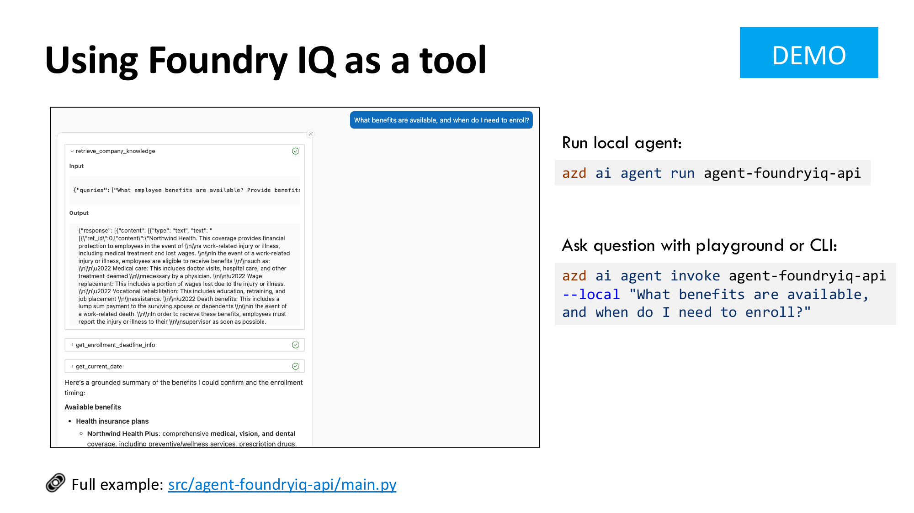
[Watch from 48:20](https://www.youtube.com/watch?v=cbvM3-Xhx90&t=2900s)

Run the agent locally and invoke it:

```shell
azd ai agent run agent-foundryiq-api
azd ai agent invoke agent-foundryiq-api --local \
  "What benefits are available, and when do I need to enroll?"
```

The `azd ai agent` extension opens a local playground with request logs. In the demo, the agent did the query writing itself and produced a single query for that question. Query writing varies dramatically between models and is one of the biggest factors in retrieval quality — if the model under-generates queries, add explicit instructions about how many queries to produce and how to split them.

### Option 2: the knowledge base MCP endpoint

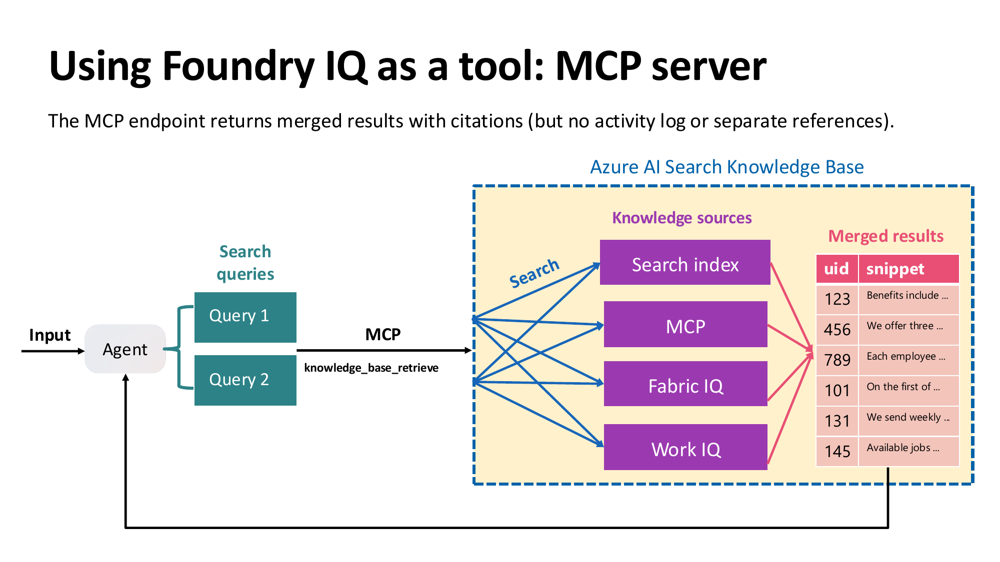
[Watch from 51:31](https://www.youtube.com/watch?v=cbvM3-Xhx90&t=3091s)

The MCP endpoint exposes a `knowledge_base_retrieve` tool that takes search queries and runs the whole knowledge base behind the scenes, at whatever effort level the knowledge base is configured with. It returns merged results with citations as `uid` and `snippet` pairs, but no activity log and no separate references array.

### Wiring the MCP endpoint into an agent

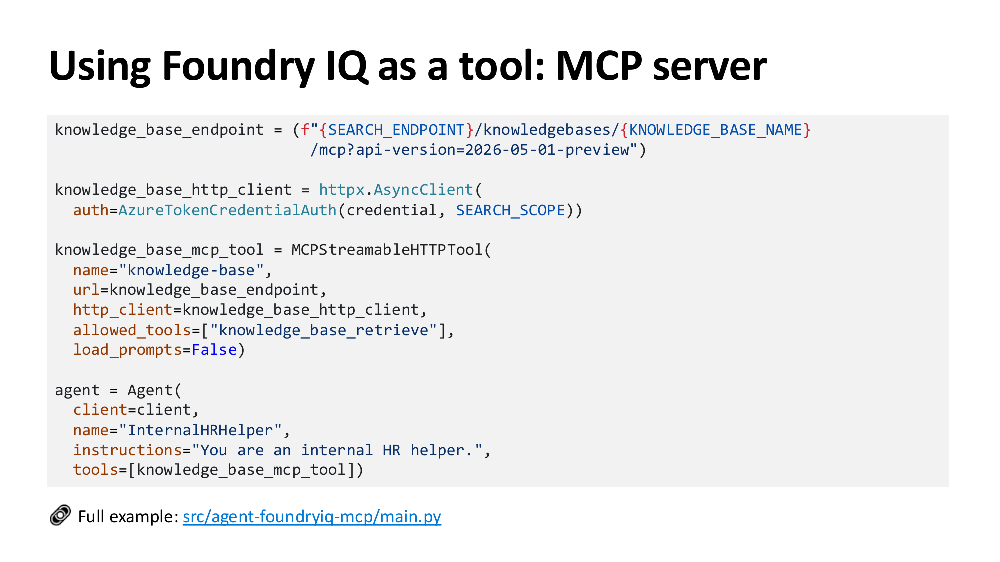
[Watch from 51:58](https://www.youtube.com/watch?v=cbvM3-Xhx90&t=3118s)

You can construct the endpoint URL from just the search endpoint and knowledge base name:

```python
knowledge_base_endpoint = (f"{SEARCH_ENDPOINT}/knowledgebases/{KNOWLEDGE_BASE_NAME}"
                           "/mcp?api-version=2026-05-01-preview")

knowledge_base_http_client = httpx.AsyncClient(
  auth=AzureTokenCredentialAuth(credential, SEARCH_SCOPE))

knowledge_base_mcp_tool = MCPStreamableHTTPTool(
  name="knowledge-base",
  url=knowledge_base_endpoint,
  http_client=knowledge_base_http_client,
  allowed_tools=["knowledge_base_retrieve"],
  load_prompts=False)

agent = Agent(client=client, name="InternalHRHelper",
  instructions="You are an internal HR helper.",
  tools=[knowledge_base_mcp_tool])
```

Authentication uses Entra credentials rather than keys, so the HTTP client attaches a token. Full example: `src/agent-foundryiq-mcp/main.py`.

### Demo: the MCP agent

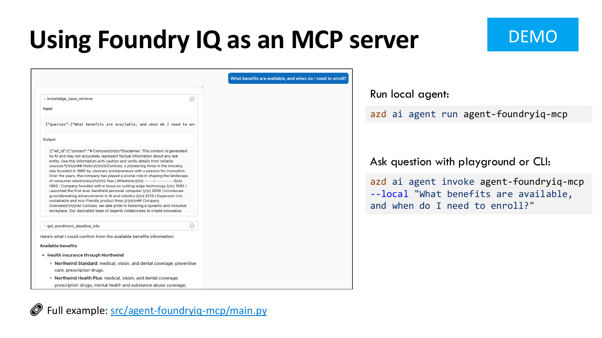
[Watch from 52:45](https://www.youtube.com/watch?v=cbvM3-Xhx90&t=3165s)

```shell
azd ai agent run agent-foundryiq-mcp
azd ai agent invoke agent-foundryiq-mcp --local \
  "What benefits are available, and when do I need to enroll?"
```

Behavior is nearly identical to the custom tool version. The agent calls `knowledge_base_retrieve` with a list of queries and gets back results.

### Option 3: Foundry Toolbox

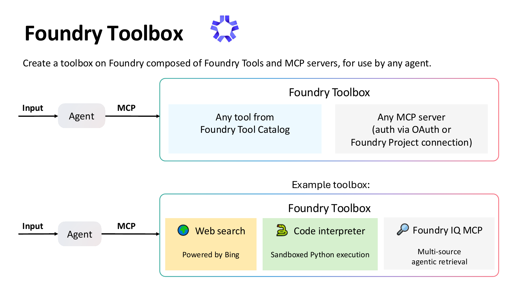
[Watch from 53:12](https://www.youtube.com/watch?v=cbvM3-Xhx90&t=3192s)

Foundry Toolbox composes tools from the Foundry Tool Catalog and any MCP server (authenticated via OAuth or a Foundry project connection) into a single MCP server that agents point at. It makes authentication much easier and gives access to built-in tools. The example toolbox combines web search (powered by Bing, and different from Web IQ, so expect different results), code interpreter (sandboxed Python execution), and the Foundry IQ MCP for multi-source agentic retrieval. Toolboxes are reusable across agents: build one and share it.

### Creating a Foundry Toolbox from code

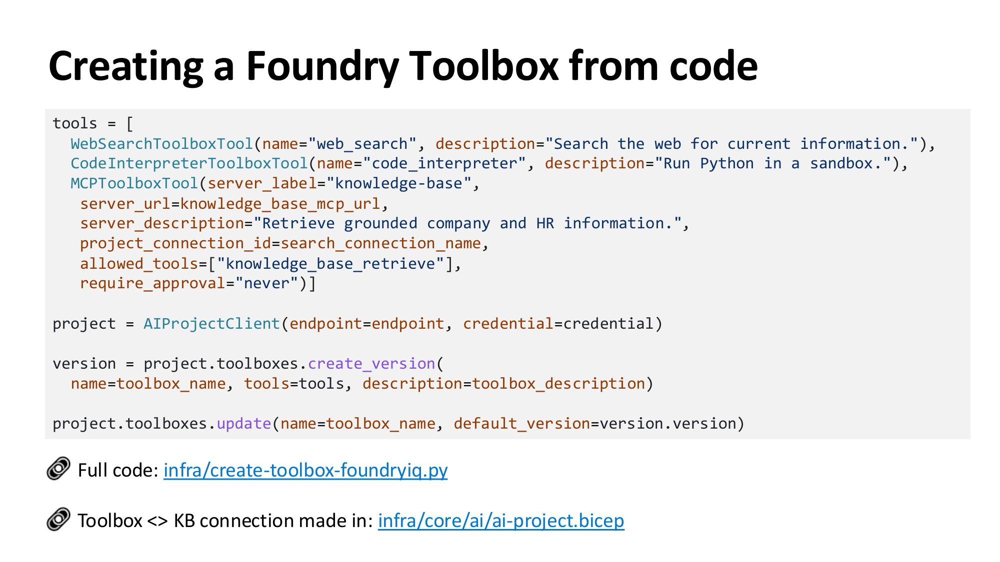
[Watch from 54:13](https://www.youtube.com/watch?v=cbvM3-Xhx90&t=3253s)

```python
tools = [
  WebSearchToolboxTool(name="web_search", description="Search the web for current information."),
  CodeInterpreterToolboxTool(name="code_interpreter", description="Run Python in a sandbox."),
  MCPToolboxTool(server_label="knowledge-base",
   server_url=knowledge_base_mcp_url,
   server_description="Retrieve grounded company and HR information.",
   project_connection_id=search_connection_name,
   allowed_tools=["knowledge_base_retrieve"],
   require_approval="never")]

project = AIProjectClient(endpoint=endpoint, credential=credential)

version = project.toolboxes.create_version(
  name=toolbox_name, tools=tools, description=toolbox_description)

project.toolboxes.update(name=toolbox_name, default_version=version.version)
```

Toolboxes are versioned, and you set which version is the default. You can also build one in the Foundry UI instead. Full code: `infra/create-toolbox-foundryiq.py`, with the toolbox-to-knowledge-base connection made in `infra/core/ai/ai-project.bicep`.

### Using Foundry Toolbox inside an agent

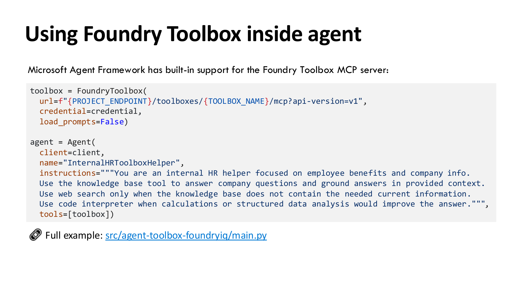
[Watch from 54:41](https://www.youtube.com/watch?v=cbvM3-Xhx90&t=3281s)

Microsoft Agent Framework ships a `FoundryToolbox` class, since the toolbox is itself an MCP server:

```python
toolbox = FoundryToolbox(
  url=f"{PROJECT_ENDPOINT}/toolboxes/{TOOLBOX_NAME}/mcp?api-version=v1",
  credential=credential,
  load_prompts=False)

agent = Agent(
  client=client,
  name="InternalHRToolboxHelper",
  instructions="""You are an internal HR helper focused on employee benefits and company info.
  Use the knowledge base tool to answer company questions and ground answers in provided context.
  Use web search only when the knowledge base does not contain the needed current information.
  Use code interpreter when calculations or structured data analysis would improve the answer.""",
  tools=[toolbox])
```

The instructions matter more here because the agent now has to choose between three quite different tools. Full example: `src/agent-toolbox-foundryiq/main.py`.

### Demo: the toolbox agent

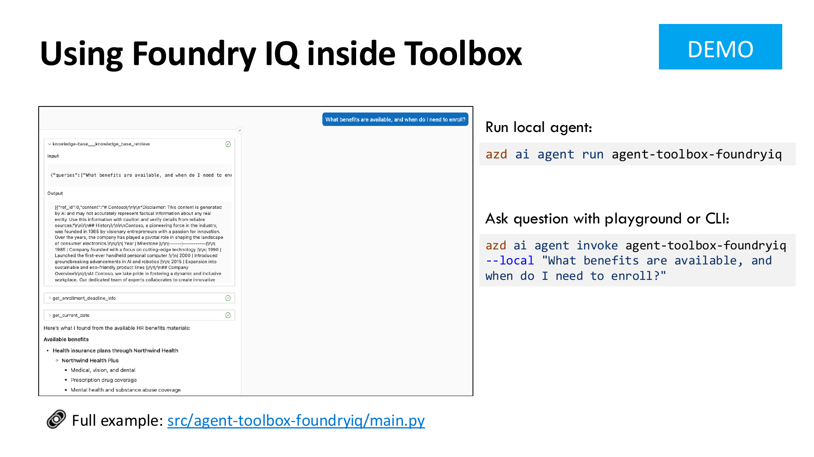
[Watch from 55:24](https://www.youtube.com/watch?v=cbvM3-Xhx90&t=3324s)

```shell
azd ai agent run agent-toolbox-foundryiq
azd ai agent invoke agent-toolbox-foundryiq --local \
  "What benefits are available, and when do I need to enroll?"
```

Tool calls appear with a prefix indicating which sub-tool inside the toolbox was used; everything else looks the same as the direct MCP version.

### Agent deployment

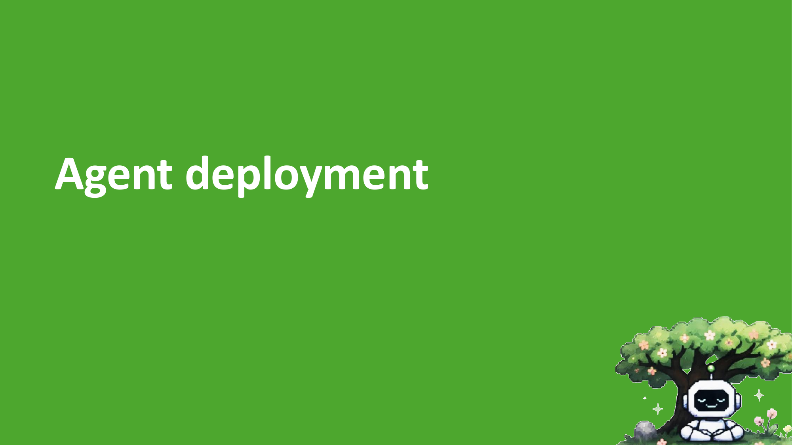
[Watch from 55:59](https://www.youtube.com/watch?v=cbvM3-Xhx90&t=3359s)

### Foundry Agent Service

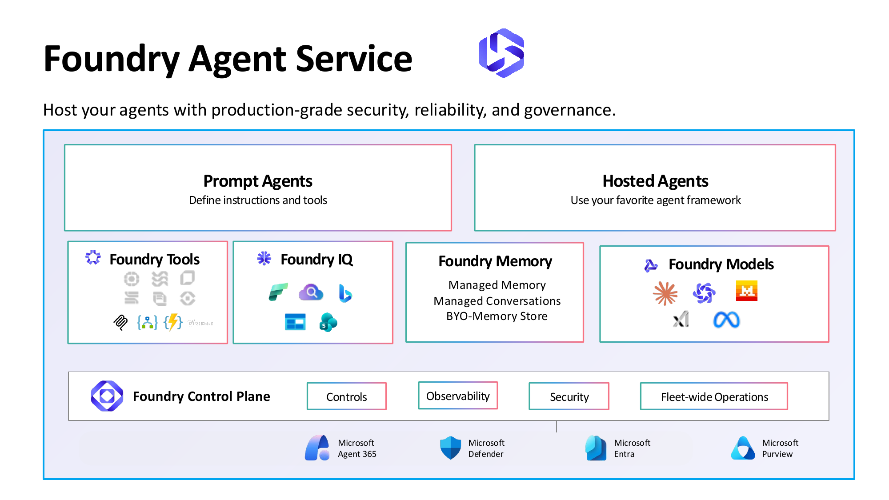
[Watch from 56:14](https://www.youtube.com/watch?v=cbvM3-Xhx90&t=3374s)

Foundry Agent Service hosts agents with production-grade security, reliability, and governance. It offers two kinds of agents: prompt agents, where you define instructions and tools declaratively, and hosted agents, where you bring your own code and favorite agent framework. Both sit on top of Foundry Tools, Foundry IQ, Foundry Memory (managed memory, managed conversations, or bring-your-own memory store), and Foundry Models, with a control plane providing controls, observability, security, and fleet-wide operations, integrated with Microsoft Agent 365, Defender, Entra, and Purview.

### Foundry hosted agents

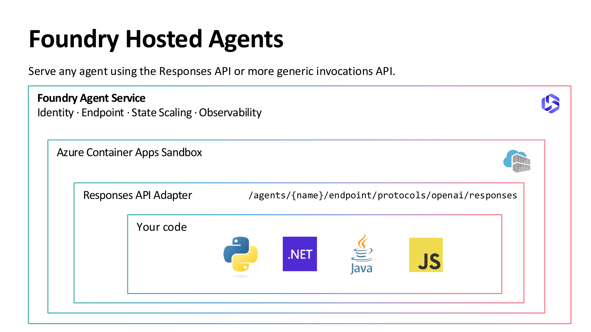
[Watch from 56:37](https://www.youtube.com/watch?v=cbvM3-Xhx90&t=3397s)

Hosted agents can serve any agent that supports the Responses API, which acts as the compatibility layer. Your code runs behind a Responses API adapter inside an Azure Container Apps sandbox — a fast, isolated microVM environment — at `/agents/{name}/endpoint/protocols/openai/responses`. Foundry Agent Service handles identity, endpoint, state, scaling, and observability. Evaluation comes with it too, which is the main reason to choose hosted agents if you want those capabilities without building them.

### Hosting a Microsoft Agent Framework agent

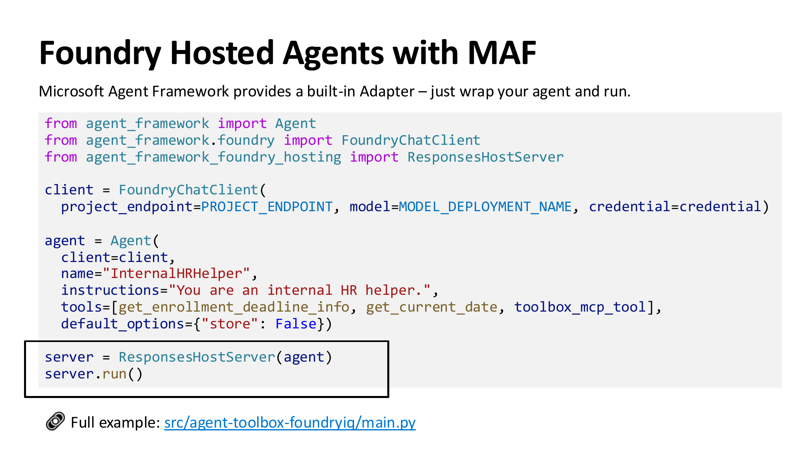
[Watch from 57:25](https://www.youtube.com/watch?v=cbvM3-Xhx90&t=3445s)

Agent Framework has a built-in adapter — wrap your agent and run:

```python
from agent_framework import Agent
from agent_framework.foundry import FoundryChatClient
from agent_framework_foundry_hosting import ResponsesHostServer

client = FoundryChatClient(
  project_endpoint=PROJECT_ENDPOINT, model=MODEL_DEPLOYMENT_NAME, credential=credential)

agent = Agent(
  client=client,
  name="InternalHRHelper",
  instructions="You are an internal HR helper.",
  tools=[get_enrollment_deadline_info, get_current_date, toolbox_mcp_tool],
  default_options={"store": False})

server = ResponsesHostServer(agent)
server.run()
```

Every agent in the repo ends with this wrapper, which is what makes them runnable as Foundry hosted agents. Full example: `src/agent-toolbox-foundryiq/main.py`.

### Demo: the hosted agent on Foundry

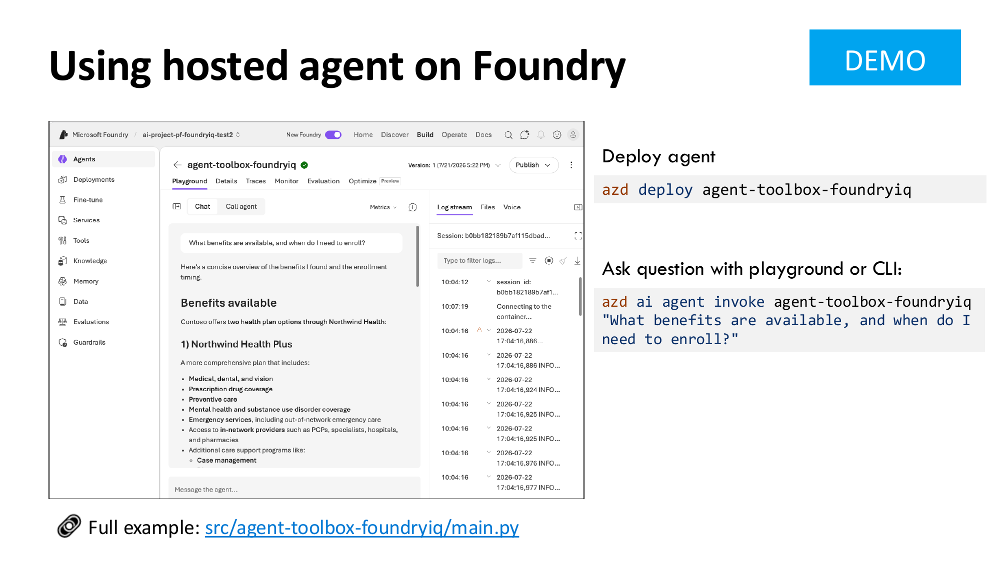
[Watch from 57:58](https://www.youtube.com/watch?v=cbvM3-Xhx90&t=3478s)

```shell
azd deploy agent-toolbox-foundryiq
azd ai agent invoke agent-toolbox-foundryiq \
  "What benefits are available, and when do I need to enroll?"
```

The Foundry playground shows live logs from the container environment plus OpenTelemetry traces. In the demo, the traces confirmed the agent went through Foundry Toolbox to execute the knowledge base tool inside it. Evaluations attach on top of the same telemetry.

### Publishing a hosted agent to Teams

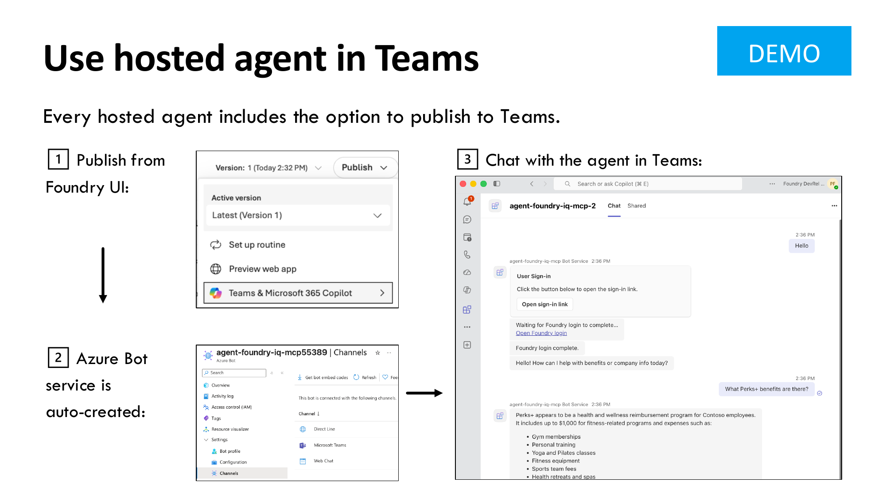
[Watch from 58:55](https://www.youtube.com/watch?v=cbvM3-Xhx90&t=3535s)

Every hosted agent includes a one-click publish to Teams from the Foundry UI. Publishing auto-creates an Azure Bot service behind the scenes, then you add the agent to Teams, sign in, and start chatting.

### Next steps and resources

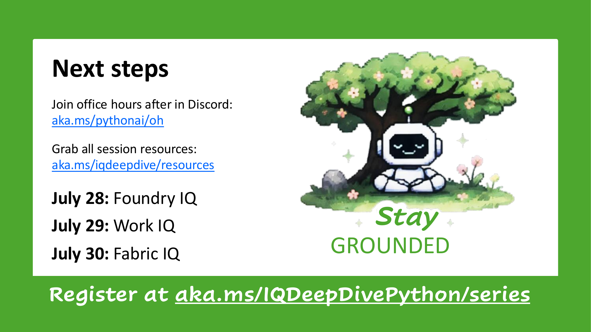
[Watch from 59:36](https://www.youtube.com/watch?v=cbvM3-Xhx90&t=3576s)

- Join office hours right after each session in Discord: [aka.ms/pythonai/oh](https://aka.ms/pythonai/oh)
- Grab all session resources — slides, recordings, write-ups, office hour recordings: [aka.ms/iqdeepdive/resources](https://aka.ms/iqdeepdive/resources)
- Register for the series: [aka.ms/IQDeepDivePython/series](https://aka.ms/IQDeepDivePython/series)

Sessions 2 and 3 cover Work IQ (July 29) and Fabric IQ (July 30). If Discord is blocked by your company, post questions in the resources discussion thread instead.

### Microsoft IQ Live


[Watch from 1:00:41](https://www.youtube.com/watch?v=cbvM3-Xhx90&t=3641s)

Microsoft IQ Live runs bi-weekly episodes on Microsoft Reactor from Aug 6 to Nov 12, 2026. Register at [aka.ms/MicrosoftIQLive](https://aka.ms/MicrosoftIQLive) and follow Microsoft Reactor on YouTube to catch every stream.

## Live Chat Q&A

### Will the series cover Web IQ as well?

Web IQ was covered briefly in this first session as an MCP knowledge source. The three dedicated deep dives are Foundry IQ, Work IQ, and Fabric IQ.

### Is there a "high" reasoning effort coming?

Not currently. The expected addition is an "auto" mode rather than a "high" level, where the knowledge base decides the effort level for you based on the query.

### Will this series include evaluations or LLM-as-judge functionality?

Not in this series — there wasn't time. Evaluations are covered in other Python + AI videos. The recommendation for Foundry IQ specifically is to give your evaluators access to the retrieval activity log, since that is what tells you whether a failure came from ingestion, query planning, or the model.

### Where can I find the code repository?

All sample code shown is at [aka.ms/iqdeepdive](https://aka.ms/iqdeepdive).

### Where can I find Foundry IQ licensing and pricing?

Foundry IQ pricing follows [Azure AI Search pricing](https://azure.microsoft.com/pricing/details/search/).

### Can Web IQ be used on-premises in the near future?

Foundry IQ is built around Azure AI Search, knowledge bases, indexers, and enterprise content sources such as SharePoint, OneLake, Blob Storage, and Cosmos DB. Web IQ itself is a hosted service in private preview.

### Has anything changed with Azure's MCP servers since the protocol changed?

MCP is an open protocol and Microsoft is one of its key contributors, so Microsoft MCP servers are updated in line with the latest protocol updates.

### Foundry Toolbox surfaces an MCP endpoint that itself wraps other MCP endpoints — is there a performance concern with that nesting?

There is minimal overhead. The toolbox acts as a router, and the added latency is not significant in practice.

### For remote sources, where do the indexes reside?

Remote sources are not indexed at all. The data stays where it lives and is fetched at query time, then merged through the reranking model with your indexed results. Nothing from a remote source is persisted in a Foundry IQ index, which is what keeps it fresh.
