## Slide 1

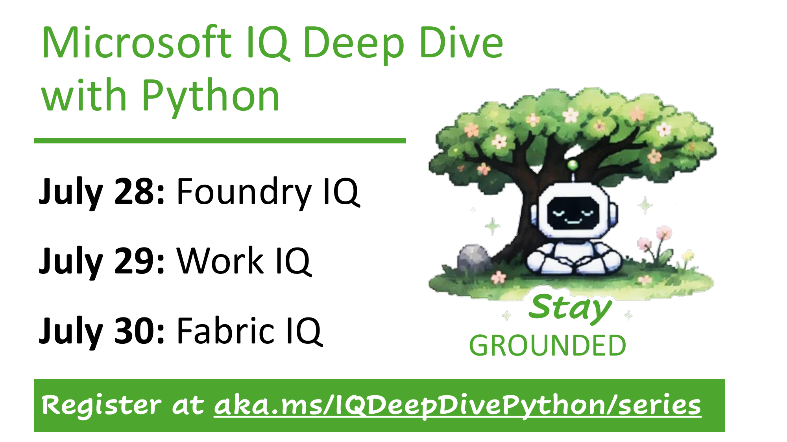

```
Microsoft IQ Deep Dive
with Python
July 28: Foundry IQ
July 29: Work IQ
                               Stay
July 30: Fabric IQ         GROUNDED
Register at aka.ms/IQDeepDivePython/series
```

## Slide 2

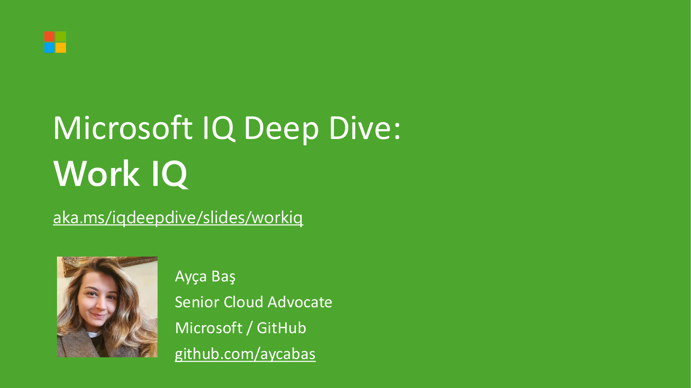

```
Microsoft IQ Deep Dive:
Work IQ
aka.ms/iqdeepdive/slides/workiq


               Ayça Baş
               Senior Cloud Advocate
               Microsoft / GitHub
               github.com/aycabas
```

## Slide 3

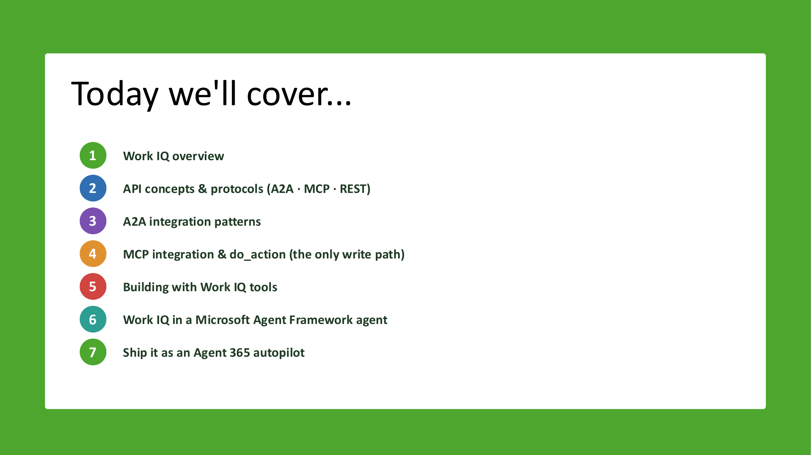

```
Today we'll cover...
 1   Work IQ overview

 2   API concepts & protocols (A2A · MCP · REST)

 3   A2A integration patterns

 4   MCP integration & do_action (the only write path)

 5   Building with Work IQ tools

 6   Work IQ in a Microsoft Agent Framework agent

 7   Ship it as an Agent 365 autopilot
```

## Slide 4

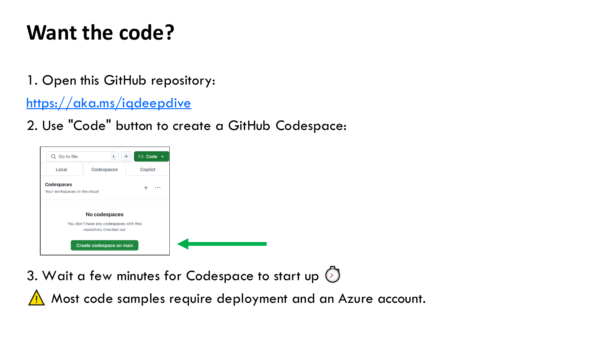

```
Want the code?
1. Open this GitHub repository:
https://aka.ms/iqdeepdive
2. Use "Code" button to create a GitHub Codespace:


3. Wait a few minutes for Codespace to start up
    Most code samples require deployment and an Azure account.
```

## Slide 5


```
Microsoft IQ
```

## Slide 6

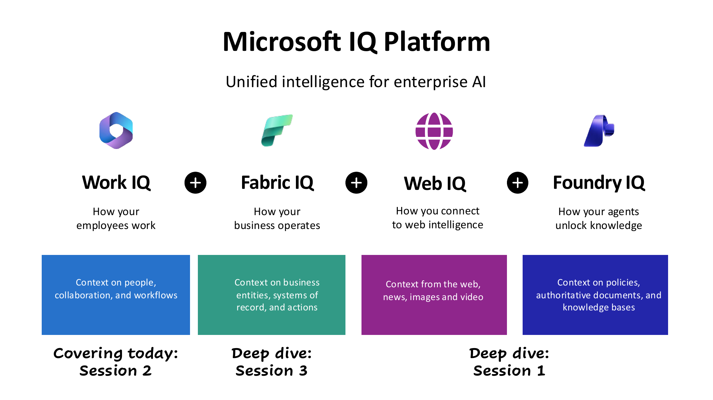

```
Microsoft IQ Platform
                               Unified intelligence for enterprise AI


      Work IQ                    Fabric IQ                 Web IQ                     Foundry IQ
      How your                      How your             How you connect              How your agents
    employees work              business operates       to web intelligence           unlock knowledge


     Context on people,         Context on business     Context from the web,        Context on policies,
collaboration, and workflows    entities, systems of   news, images and video    authoritative documents, and
                                record, and actions                                   knowledge bases


Covering today:                Deep dive:                                Deep dive:
   Session 2                   Session 3                                 Session 1
```

## Slide 7


```
Work IQ
```

## Slide 8

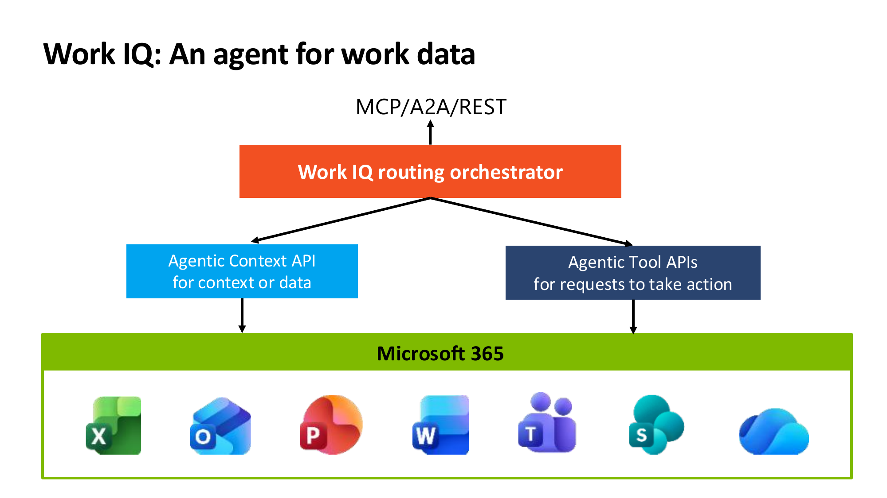

```
Work IQ: An agent for work data
                              MCP/A2A/REST

                        Work IQ routing orchestrator


        Agentic Context API                          Agentic Tool APIs
        for context or data                     for requests to take action


                                Microsoft 365
```

## Slide 9

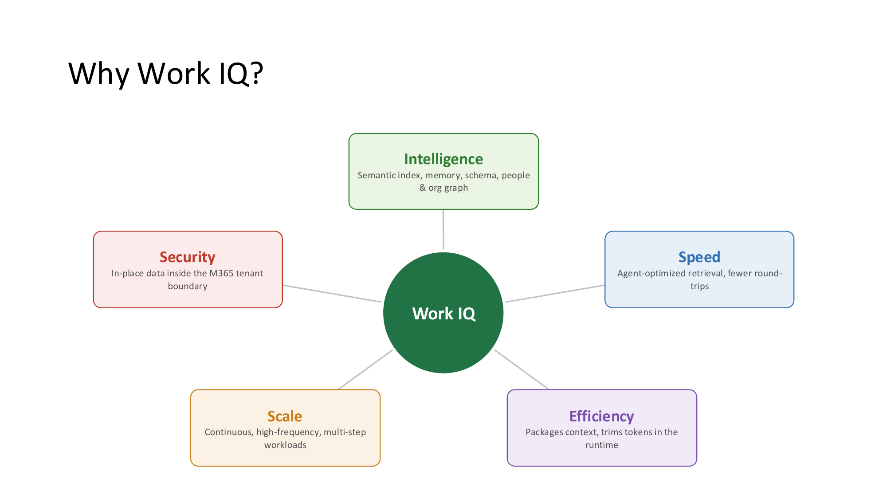

```
Why Work IQ?

                                                                      Intelligence
                                                            Semantic index, memory, schema, people
                                                                          & org graph


             Security                                                                                                                    Speed
  In-place data inside the M365 tenant                                                                                 Agent-optimized retrieval, fewer round-
                boundary                                                                                                                trips


                                                                       Work IQ


                                         Scale                                                             Efficiency
                        Continuous, high-frequency, multi-step                                   Packages context, trims tokens in the
                                      workloads                                                               runtime
```

## Slide 10

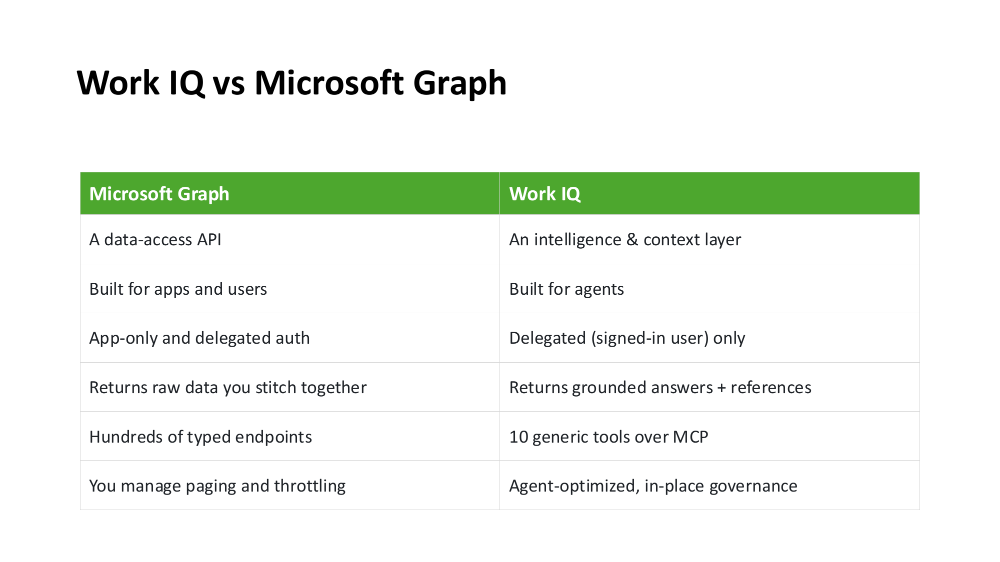

```
Work IQ vs Microsoft Graph

Microsoft Graph                        Work IQ

A data-access API                      An intelligence & context layer

Built for apps and users               Built for agents

App-only and delegated auth            Delegated (signed-in user) only

Returns raw data you stitch together   Returns grounded answers + references

Hundreds of typed endpoints            10 generic tools over MCP

You manage paging and throttling       Agent-optimized, in-place governance
```

## Slide 11

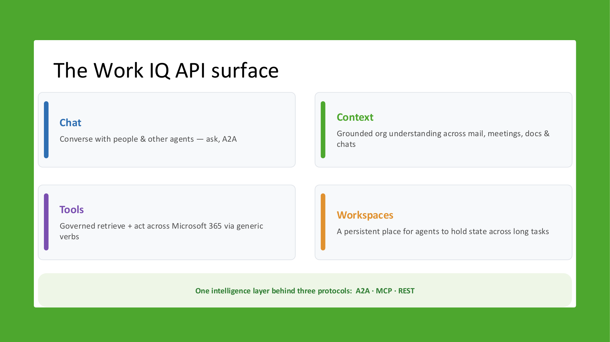

```
The Work IQ API surface

Chat                                                                         Context
                                                                             Grounded org understanding across mail, meetings, docs &
Converse with people & other agents — ask, A2A
                                                                             chats


Tools                                                                        Workspaces
Governed retrieve + act across Microsoft 365 via generic
                                                                             A persistent place for agents to hold state across long tasks
verbs


                                     One intelligence layer behind three protocols: A2A · MCP · REST
```

## Slide 12

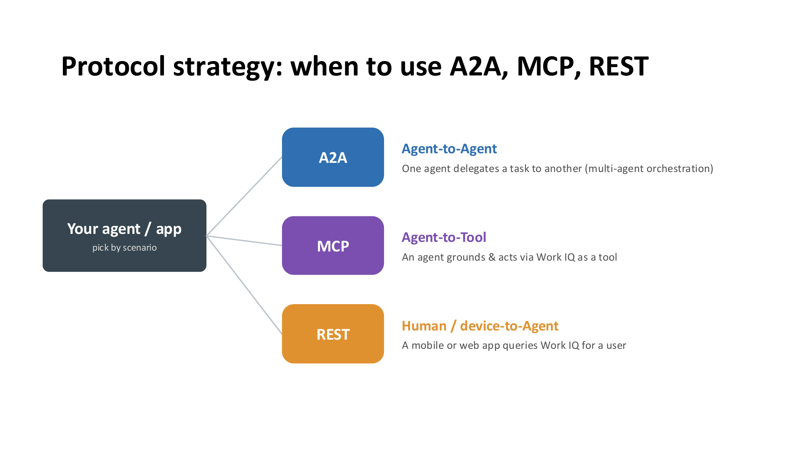

```
Protocol strategy: when to use A2A, MCP, REST

                             Agent-to-Agent
                      A2A
                             One agent delegates a task to another (multi-agent orchestration)


Your agent / app             Agent-to-Tool
   pick by scenario   MCP
                             An agent grounds & acts via Work IQ as a tool


                             Human / device-to-Agent
                      REST
                             A mobile or web app queries Work IQ for a user
```

## Slide 13

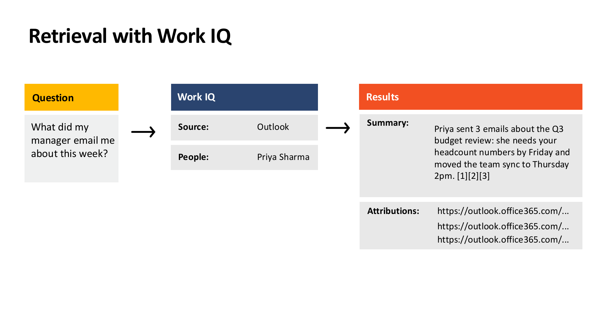

```
Retrieval with Work IQ

Question           Work IQ                  Results

What did my        Source:   Outlook        Summary:
                                                            Priya sent 3 emails about the Q3
manager email me                                            budget review: she needs your
about this week?   People:   Priya Sharma                   headcount numbers by Friday and
                                                            moved the team sync to Thursday
                                                            2pm. [1][2][3]


                                            Attributions:   https://outlook.office365.com/...
                                                            https://outlook.office365.com/...
                                                            https://outlook.office365.com/...
```

## Slide 14

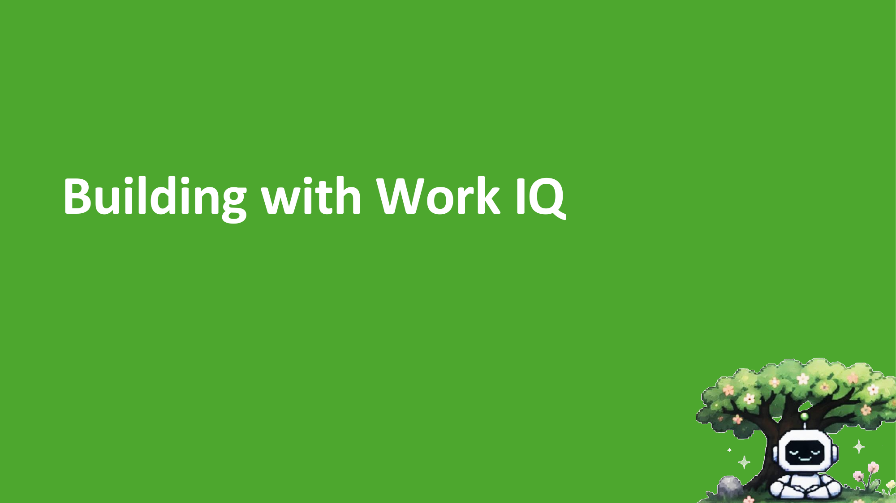

```
Building with Work IQ
```

## Slide 15

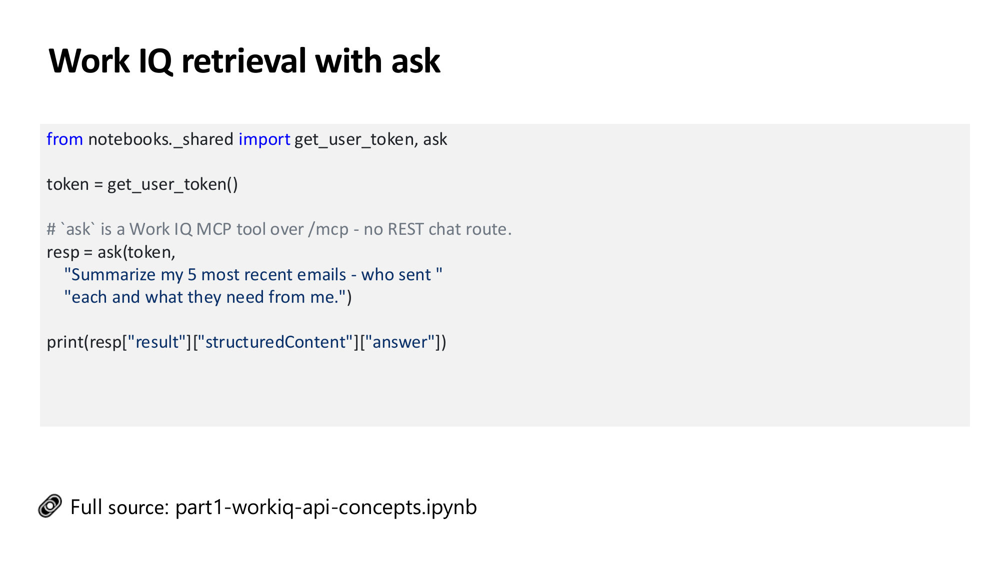

```
Work IQ retrieval with ask
from notebooks._shared import get_user_token, ask

token = get_user_token()

# `ask` is a Work IQ MCP tool over /mcp - no REST chat route.
resp = ask(token,
   "Summarize my 5 most recent emails - who sent "
   "each and what they need from me.")

print(resp["result"]["structuredContent"]["answer"])


   Full source: part1-workiq-api-concepts.ipynb
```

## Slide 16

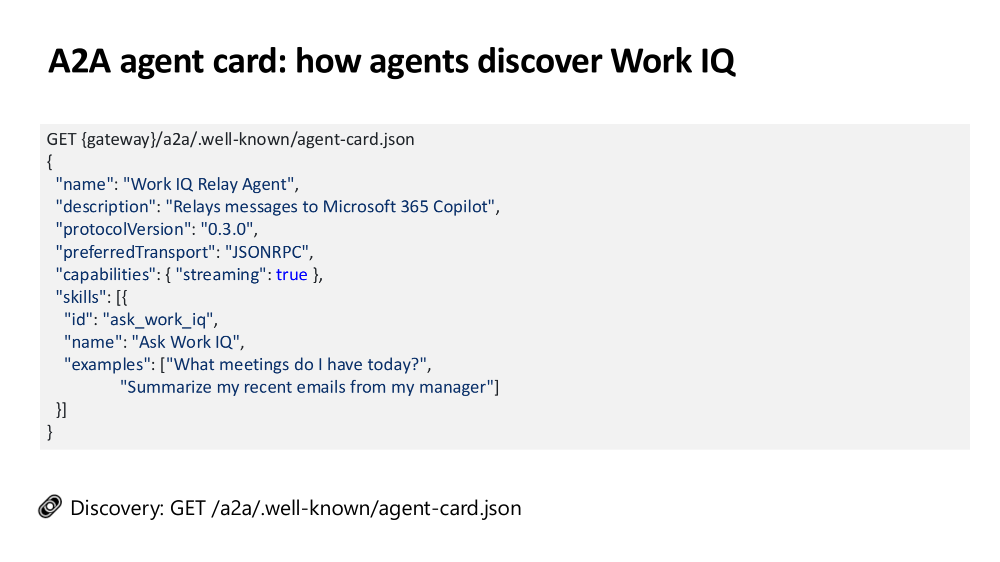

```
A2A agent card: how agents discover Work IQ
GET {gateway}/a2a/.well-known/agent-card.json
{
  "name": "Work IQ Relay Agent",
  "description": "Relays messages to Microsoft 365 Copilot",
  "protocolVersion": "0.3.0",
  "preferredTransport": "JSONRPC",
  "capabilities": { "streaming": true },
  "skills": [{
   "id": "ask_work_iq",
   "name": "Ask Work IQ",
   "examples": ["What meetings do I have today?",
             "Summarize my recent emails from my manager"]
  }]
}


   Discovery: GET /a2a/.well-known/agent-card.json
```

## Slide 17

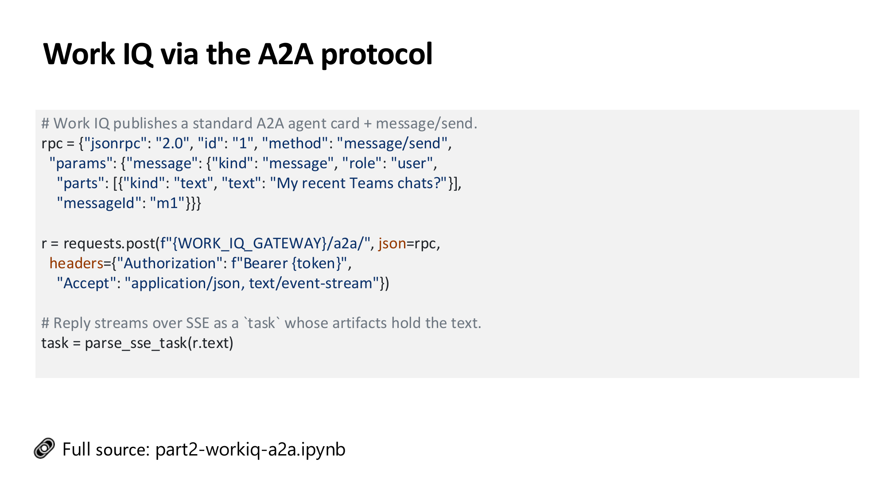

```
Work IQ via the A2A protocol
# Work IQ publishes a standard A2A agent card + message/send.
rpc = {"jsonrpc": "2.0", "id": "1", "method": "message/send",
 "params": {"message": {"kind": "message", "role": "user",
  "parts": [{"kind": "text", "text": "My recent Teams chats?"}],
  "messageId": "m1"}}}

r = requests.post(f"{WORK_IQ_GATEWAY}/a2a/", json=rpc,
  headers={"Authorization": f"Bearer {token}",
   "Accept": "application/json, text/event-stream"})

# Reply streams over SSE as a `task` whose artifacts hold the text.
task = parse_sse_task(r.text)


   Full source: part2-workiq-a2a.ipynb
```

## Slide 18

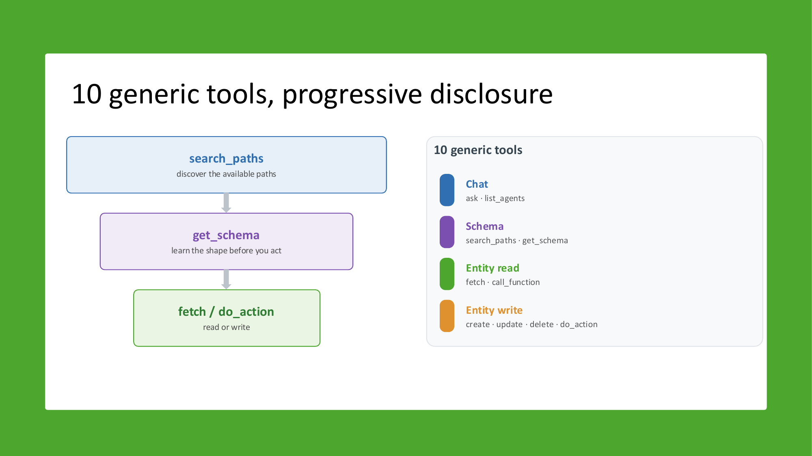

```
10 generic tools, progressive disclosure
                                         10 generic tools
            search_paths
         discover the available paths
                                              Chat
                                              ask · list_agents


                                              Schema
             get_schema                       search_paths · get_schema
        learn the shape before you act

                                              Entity read
                                              fetch · call_function


         fetch / do_action                    Entity write
                read or write                 create · update · delete · do_action
```

## Slide 19

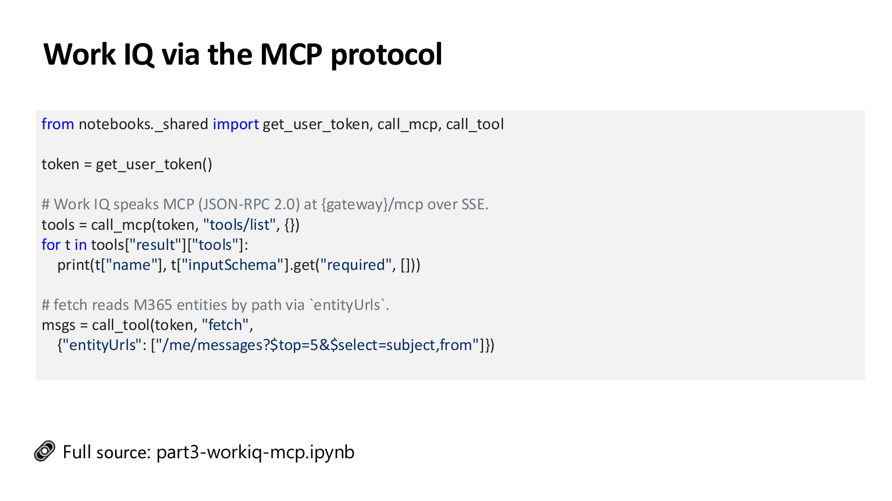

```
Work IQ via the MCP protocol
from notebooks._shared import get_user_token, call_mcp, call_tool

token = get_user_token()

# Work IQ speaks MCP (JSON-RPC 2.0) at {gateway}/mcp over SSE.
tools = call_mcp(token, "tools/list", {})
for t in tools["result"]["tools"]:
  print(t["name"], t["inputSchema"].get("required", []))

# fetch reads M365 entities by path via `entityUrls`.
msgs = call_tool(token, "fetch",
   {"entityUrls": ["/me/messages?$top=5&$select=subject,from"]})


  Full source: part3-workiq-mcp.ipynb
```

## Slide 20

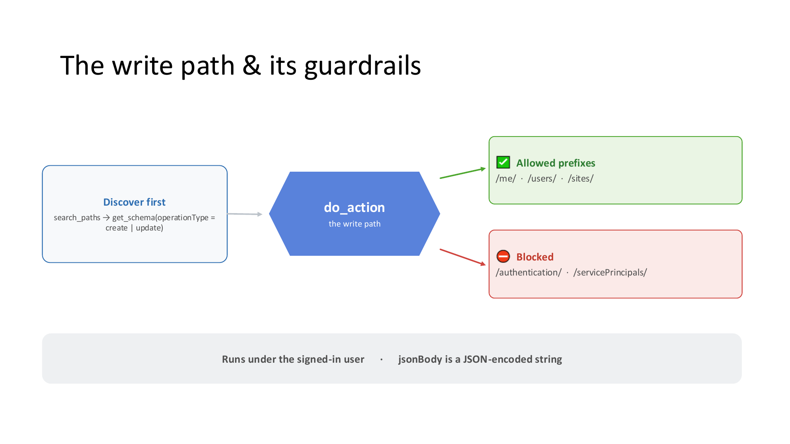

```
The write path & its guardrails


                                                                                                          Allowed prefixes
                                                                                                     /me/ · /users/ · /sites/

            Discover first
                                                                do_action
search_paths → get_schema(operationType =
             create | update)                                    the write path


                                                                                                          Blocked
                                                                                                     /authentication/ · /servicePrincipals/


                                            Runs under the signed-in user     ·   jsonBody is a JSON-encoded string
```

## Slide 21

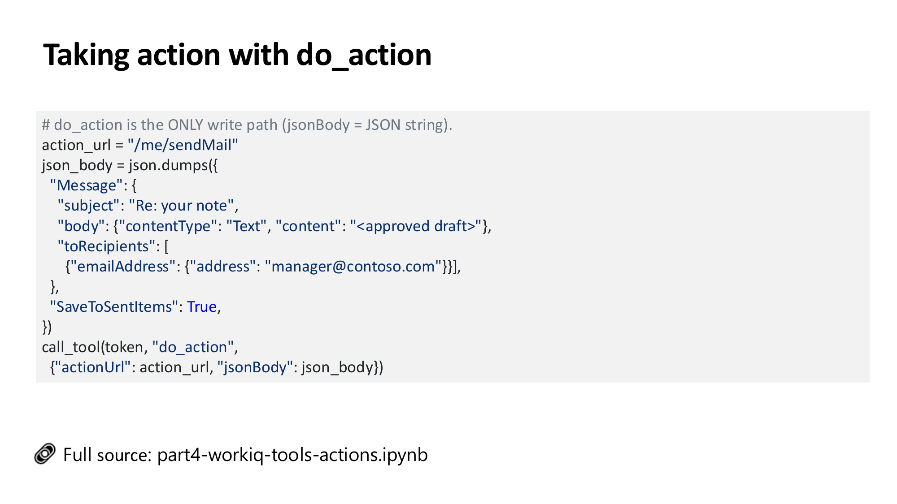

```
Taking action with do_action
# do_action is the ONLY write path (jsonBody = JSON string).
action_url = "/me/sendMail"
json_body = json.dumps({
  "Message": {
    "subject": "Re: your note",
    "body": {"contentType": "Text", "content": "<approved draft>"},
    "toRecipients": [
     {"emailAddress": {"address": "manager@contoso.com"}}],
  },
  "SaveToSentItems": True,
})
call_tool(token, "do_action",
  {"actionUrl": action_url, "jsonBody": json_body})


   Full source: part4-workiq-tools-actions.ipynb
```

## Slide 22

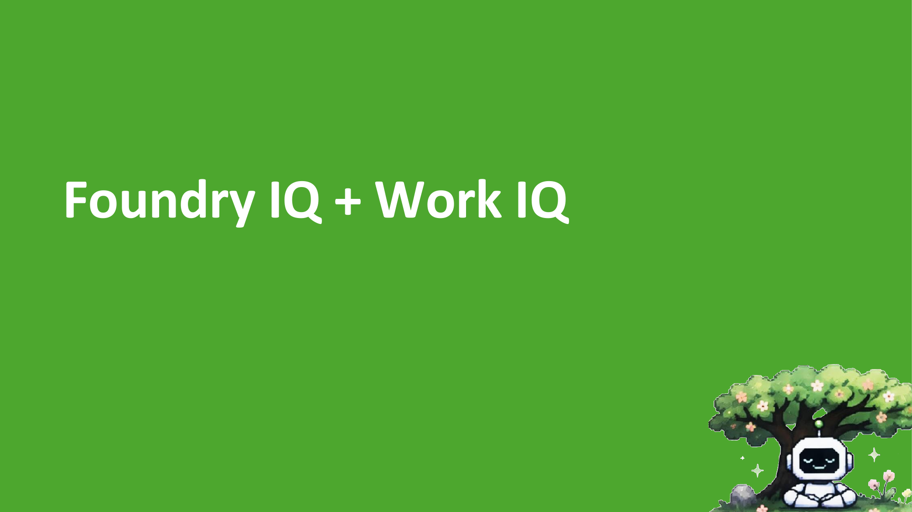

```
Foundry IQ + Work IQ
```

## Slide 23

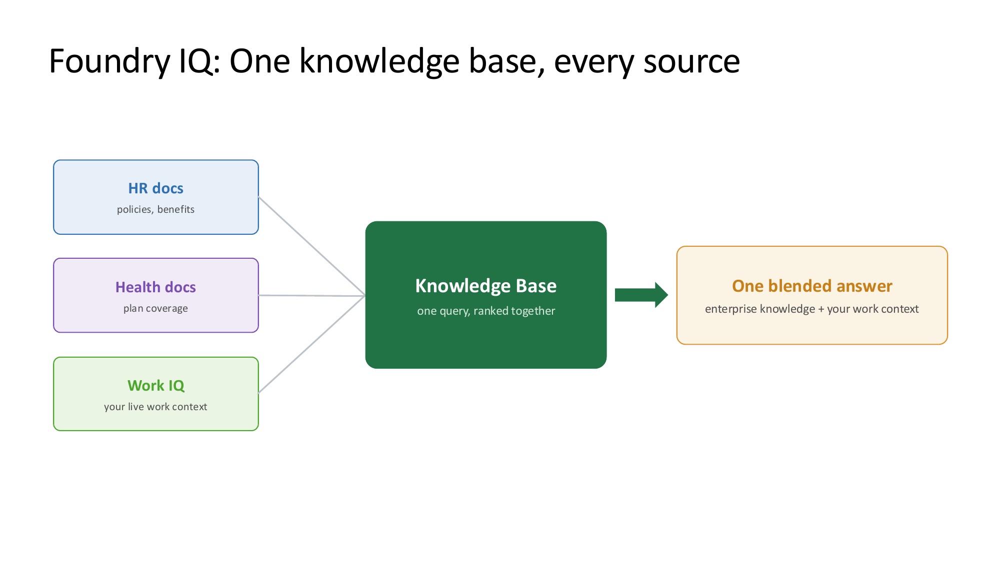

```
Foundry IQ: One knowledge base, every source


        HR docs
     policies, benefits


     Health docs            Knowledge Base                    One blended answer
       plan coverage        one query, ranked together   enterprise knowledge + your work context


       Work IQ
   your live work context
```

## Slide 24

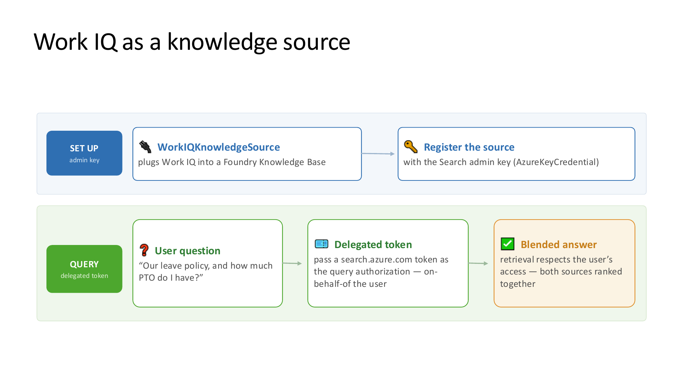

```
Work IQ as a knowledge source


    SET UP              WorkIQKnowledgeSource                                         Register the source
    admin key       plugs Work IQ into a Foundry Knowledge Base                  with the Search admin key (AzureKeyCredential)


                                                                  Delegated token                           Blended answer
                       User question
    QUERY                                                   pass a search.azure.com token as           retrieval respects the user’s
                    “Our leave policy, and how much
  delegated token                                           the query authorization — on-              access — both sources ranked
                    PTO do I have?”
                                                            behalf-of the user                         together
```

## Slide 25

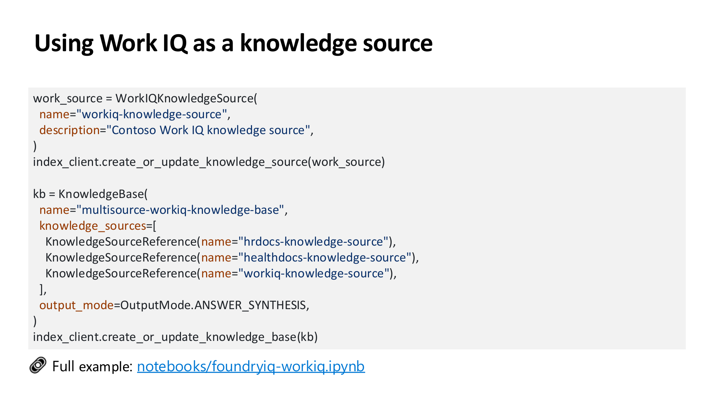

```
Using Work IQ as a knowledge source
work_source = WorkIQKnowledgeSource(
  name="workiq-knowledge-source",
  description="Contoso Work IQ knowledge source",
)
index_client.create_or_update_knowledge_source(work_source)

kb = KnowledgeBase(
  name="multisource-workiq-knowledge-base",
  knowledge_sources=[
    KnowledgeSourceReference(name="hrdocs-knowledge-source"),
    KnowledgeSourceReference(name="healthdocs-knowledge-source"),
    KnowledgeSourceReference(name="workiq-knowledge-source"),
  ],
  output_mode=OutputMode.ANSWER_SYNTHESIS,
)
index_client.create_or_update_knowledge_base(kb)

   Full example: notebooks/foundryiq-workiq.ipynb
```

## Slide 26

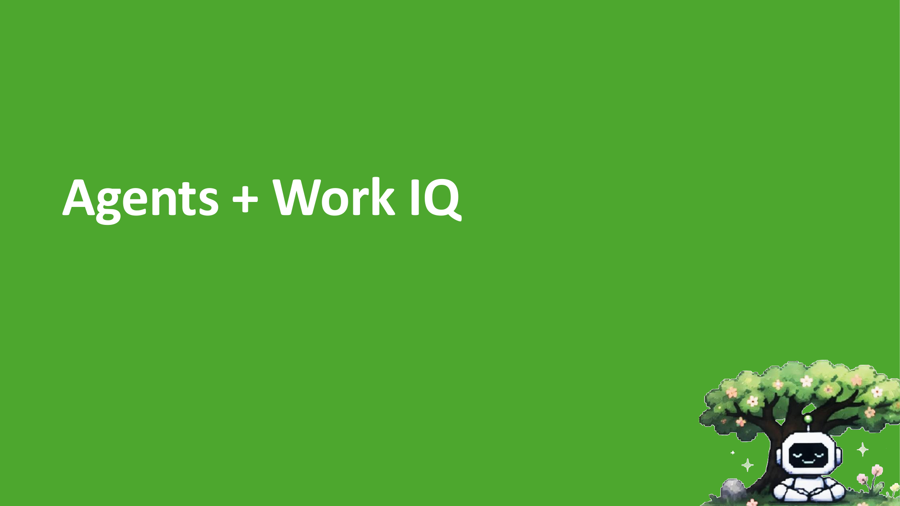

```
Agents + Work IQ
```

## Slide 27

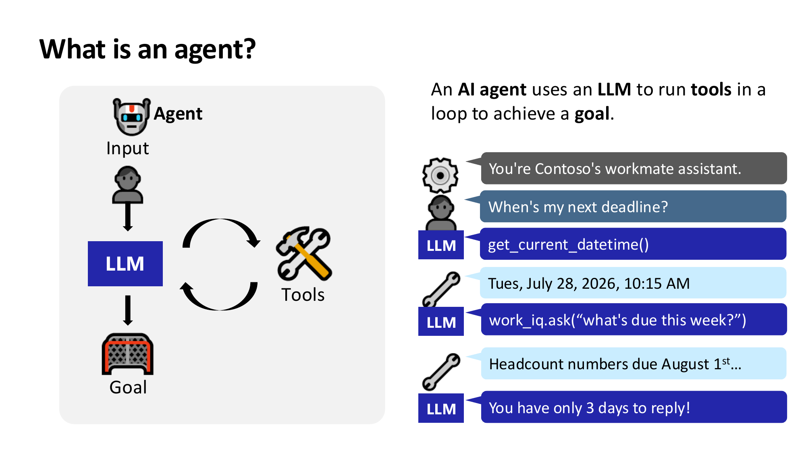

```
What is an agent?
                             An AI agent uses an LLM to run tools in a
             Agent           loop to achieve a goal.
     Input
                                    You're Contoso's workmate assistant.

                                   When's my next deadline?

                             LLM   get_current_datetime()
     LLM
                                   Tues, July 28, 2026, 10:15 AM
                     Tools
                             LLM    work_iq.ask(“what's due this week?”)

                                    Headcount numbers due August 1st…
     Goal
                             LLM    You have only 3 days to reply!
```

## Slide 28

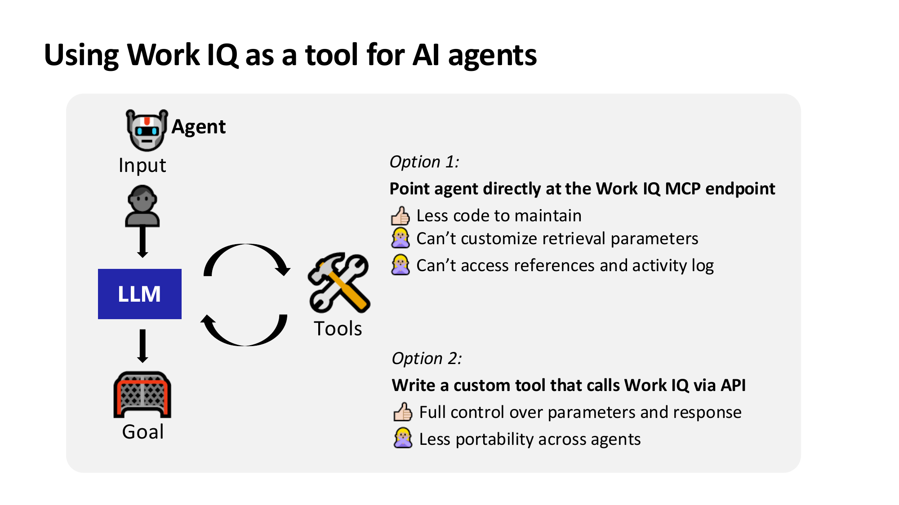

```
Using Work IQ as a tool for AI agents

             Agent
     Input                   Option 1:
                             Point agent directly at the Work IQ MCP endpoint
                                Less code to maintain
                                Can’t customize retrieval parameters
                                Can’t access references and activity log
     LLM
                     Tools
                             Option 2:
                             Write a custom tool that calls Work IQ via API
                                Full control over parameters and response
     Goal                       Less portability across agents
```

## Slide 29

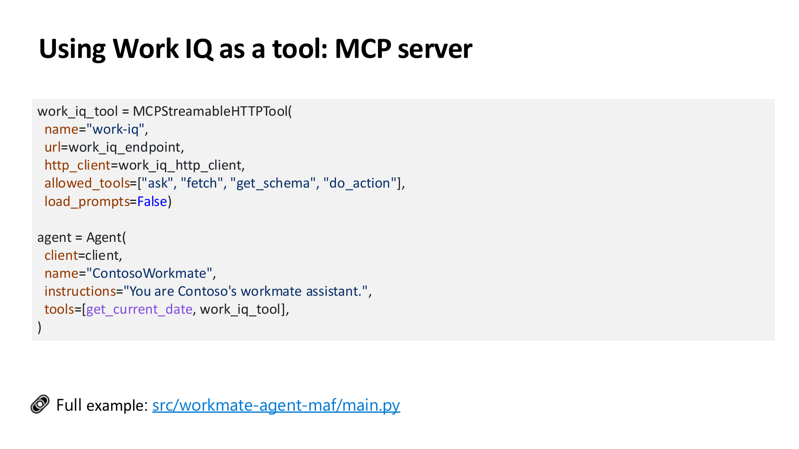

```
Using Work IQ as a tool: MCP server
work_iq_tool = MCPStreamableHTTPTool(
 name="work-iq",
 url=work_iq_endpoint,
 http_client=work_iq_http_client,
 allowed_tools=["ask", "fetch", "get_schema", "do_action"],
 load_prompts=False)

agent = Agent(
  client=client,
  name="ContosoWorkmate",
  instructions="You are Contoso's workmate assistant.",
  tools=[get_current_date, work_iq_tool],
)


   Full example: src/workmate-agent-maf/main.py
```

## Slide 30

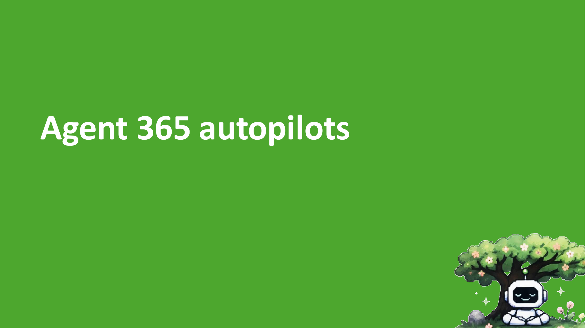

```
Agent 365 autopilots
```

## Slide 31

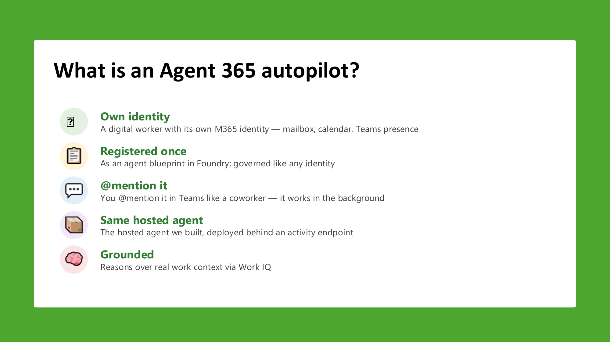

```
What is an Agent 365 autopilot?
     Own identity
 🪪   A digital worker with its own M365 identity — mailbox, calendar, Teams presence

     Registered once
     As an agent blueprint in Foundry; governed like any identity

     @mention it
     You @mention it in Teams like a coworker — it works in the background

     Same hosted agent
     The hosted agent we built, deployed behind an activity endpoint

     Grounded
     Reasons over real work context via Work IQ
```

## Slide 32

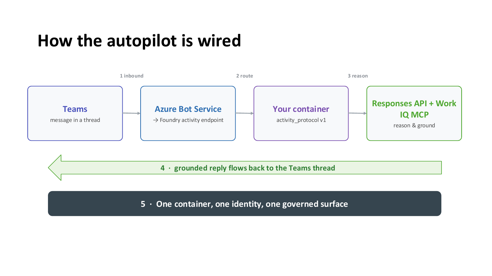

```
How the autopilot is wired
                       1 inbound                                 2 route                          3 reason


                                                                                                             Responses API + Work
     Teams                         Azure Bot Service                       Your container
 message in a thread               → Foundry activity endpoint             activity_protocol v1
                                                                                                                   IQ MCP
                                                                                                                  reason & ground


                                     4 · grounded reply flows back to the Teams thread


                              5 · One container, one identity, one governed surface
```

## Slide 33

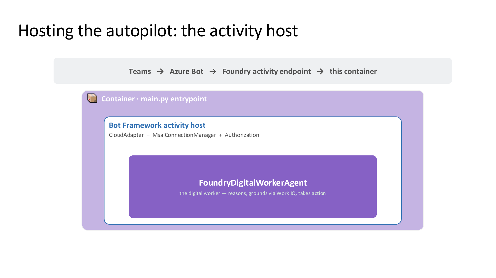

```
Hosting the autopilot: the activity host

                   Teams → Azure Bot → Foundry activity endpoint → this container


           Container · main.py entrypoint


             Bot Framework activity host
             CloudAdapter + MsalConnectionManager + Authorization


                                             FoundryDigitalWorkerAgent
                                     the digital worker — reasons, grounds via Work IQ, takes action
```

## Slide 34

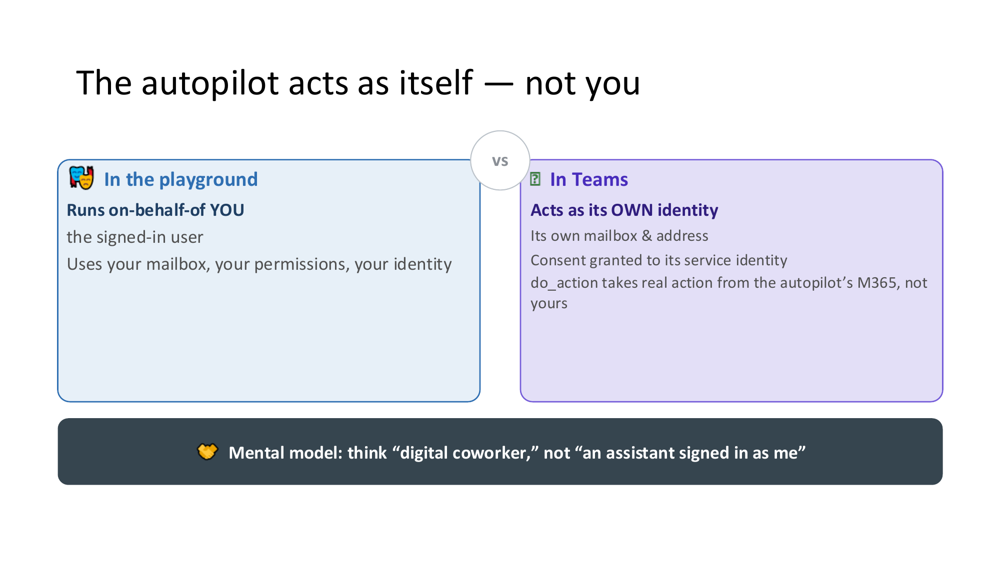

```
The autopilot acts as itself — not you
                                                     vs
    In the playground                                        In Teams
Runs on-behalf-of YOU                                     Acts as its OWN identity
the signed-in user                                        Its own mailbox & address
Uses your mailbox, your permissions, your identity        Consent granted to its service identity
                                                          do_action takes real action from the autopilot’s M365, not
                                                          yours


                    Mental model: think “digital coworker,” not “an assistant signed in as me”
```

## Slide 35

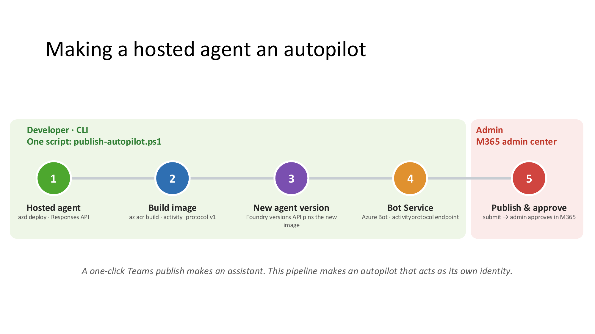

```
Making a hosted agent an autopilot


   Developer · CLI                                                                                                                                  Admin
   One script: publish-autopilot.ps1                                                                                                                M365 admin center


           1                                      2                                    3                                     4                                     5

   Hosted agent                          Build image                      New agent version                          Bot Service                       Publish & approve
azd deploy · Responses API        az acr build · activity_protocol v1   Foundry versions API pins the new   Azure Bot · activityprotocol endpoint    submit → admin approves in M365
                                                                                     image


                       A one-click Teams publish makes an assistant. This pipeline makes an autopilot that acts as its own identity.
```

## Slide 36

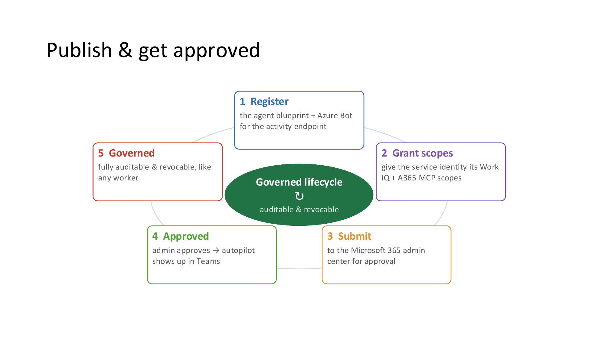

```
Publish & get approved

                                          1 Register
                                          the agent blueprint + Azure Bot
                                          for the activity endpoint


     5 Governed                                                                 2 Grant scopes
     fully auditable & revocable, like                                          give the service identity its Work
     any worker                                                                 IQ + A365 MCP scopes
                                                 Governed lifecycle
                                                        ↻
                                                 auditable & revocable


                    4 Approved                                    3 Submit
                    admin approves → autopilot                    to the Microsoft 365 admin
                    shows up in Teams                             center for approval
```

## Slide 37

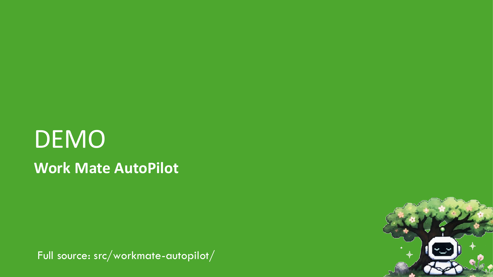

```
DEMO
Work Mate AutoPilot


Full source: src/workmate-autopilot/
```

## Slide 38

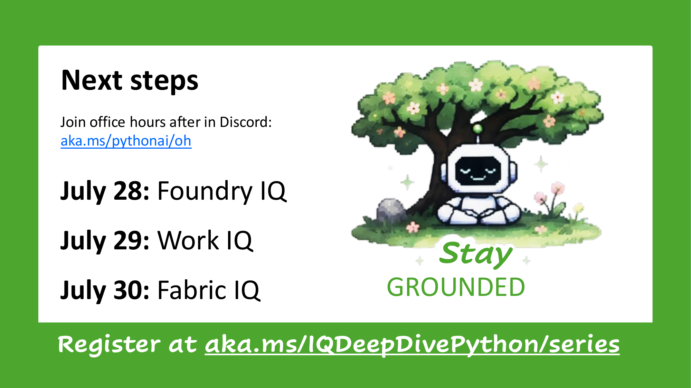

```
Next steps
Join office hours after in Discord:
aka.ms/pythonai/oh


July 28: Foundry IQ
July 29: Work IQ                         Stay
July 30: Fabric IQ                    GROUNDED
Register at aka.ms/IQDeepDivePython/series
```

## Slide 39


```
JOIN US LIVE


Bi-weekly episodes on Microsoft Reactor, from Aug 6 to Nov 12, 2026.


     Register → aka.ms/MicrosoftIQLive


Follow Microsoft Reactor on YouTube to catch every stream.
```
