## Slide 1

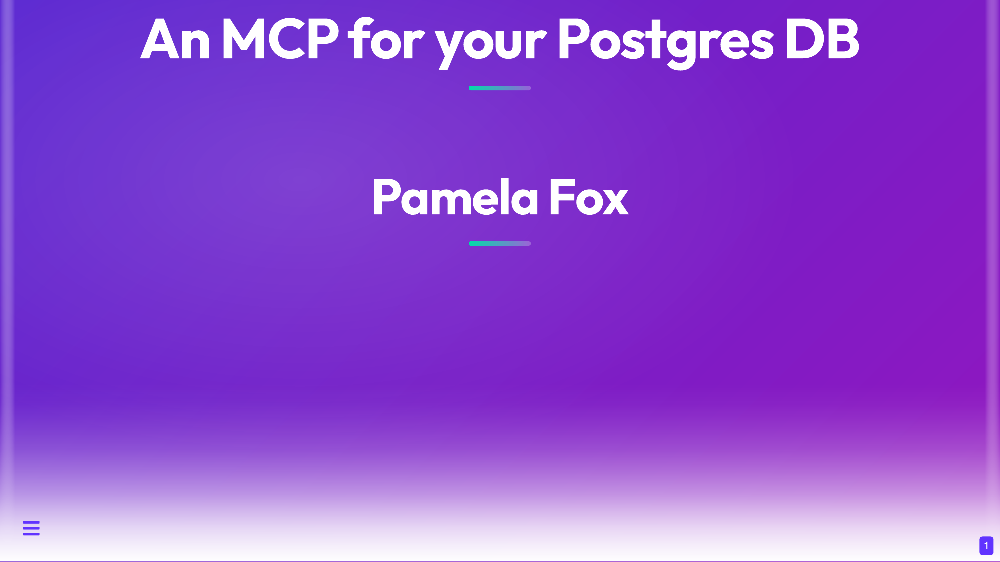

```
An MCP for your Postgres DB

            Pamela Fox



                                  1
```

## Slide 2

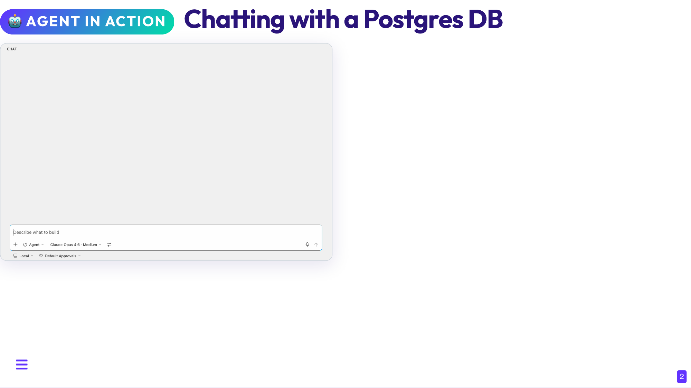

```
🤖 AGENT IN ACTION Chatting with a Postgres DB



                                                2
```

## Slide 3

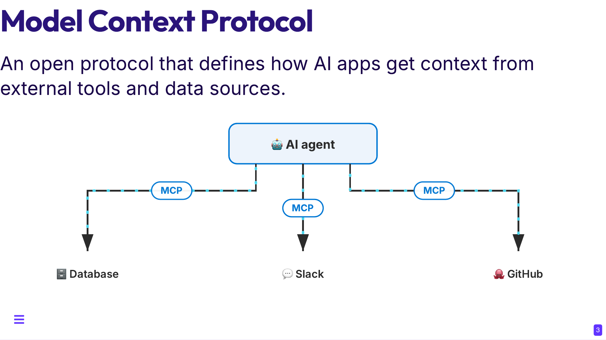

```
Model Context Protocol
An open protocol that defines how AI apps get context from
external tools and data sources.

                             🤖 AI agent
                    MCP                      MCP
                                MCP


      🗄️ Database             💬 Slack                🐙 GitHub

 
                                                                3
```

## Slide 4

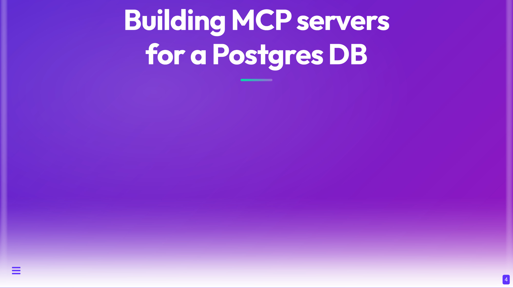

```
Building MCP servers
     for a Postgres DB



                           4
```

## Slide 5

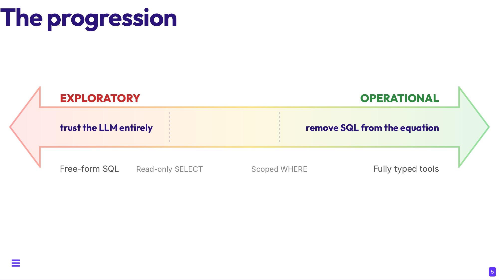

```
The progression

     EXPLORATORY                                                OPERATIONAL
     trust the LLM entirely                          remove SQL from the equation


     Free-form SQL     Read-only SELECT   Scoped WHERE             Fully typed tools



                                                                                       5
```

## Slide 6

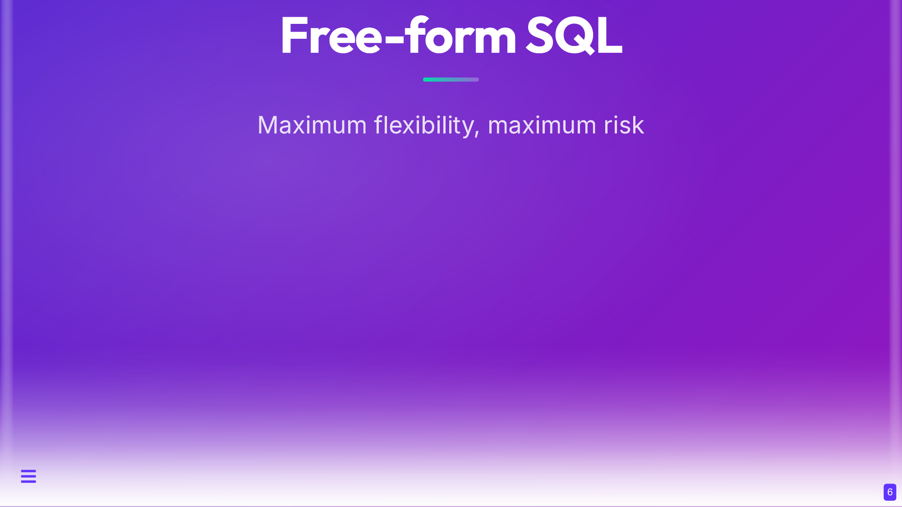

```
Free-form SQL
    Maximum flexibility, maximum risk



                                        6
```

## Slide 7

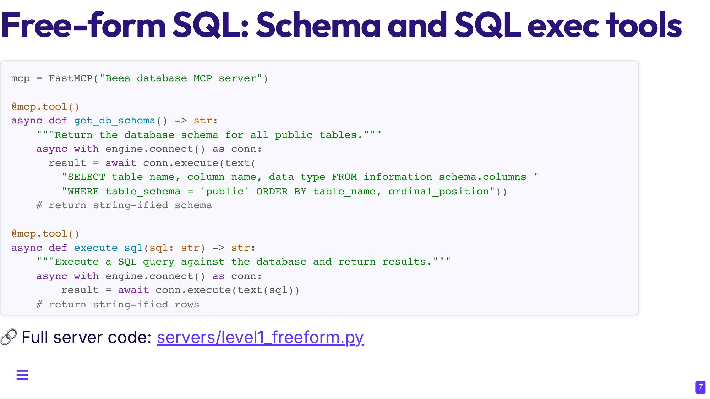

```
Free-form SQL: Schema and SQL exec tools
 mcp = FastMCP("Bees database MCP server")

 @mcp.tool()
 async def get_db_schema() -> str:
     """Return the database schema for all public tables."""
     async with engine.connect() as conn:
       result = await conn.execute(text(
         "SELECT table_name, column_name, data_type FROM information_schema.columns "
         "WHERE table_schema = 'public' ORDER BY table_name, ordinal_position"))
     # return string-ified schema

 @mcp.tool()
 async def execute_sql(sql: str) -> str:
     """Execute a SQL query against the database and return results."""
     async with engine.connect() as conn:
         result = await conn.execute(text(sql))
     # return string-ified rows


🔗 Full server code: servers/level1_freeform.py
  
                                                                                        7
```

## Slide 8

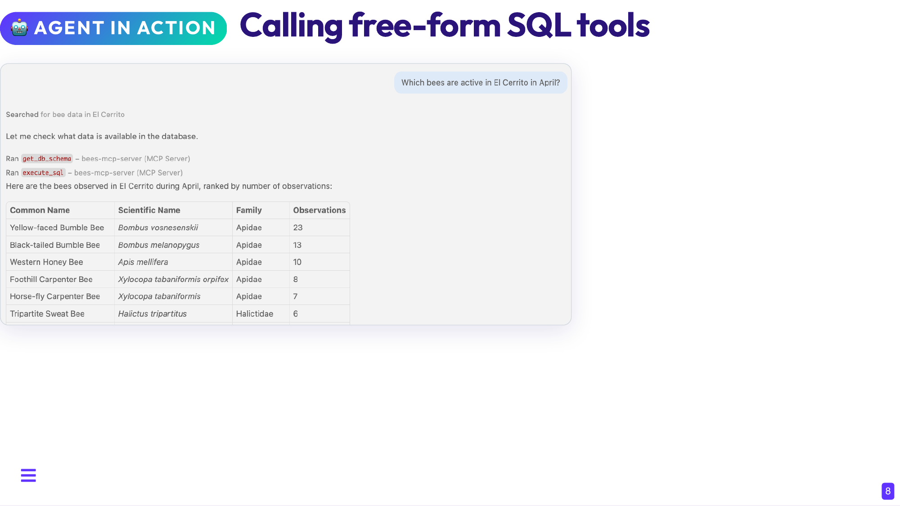

```
🤖 AGENT IN ACTION Calling free-form SQL tools



                                                8
```

## Slide 9

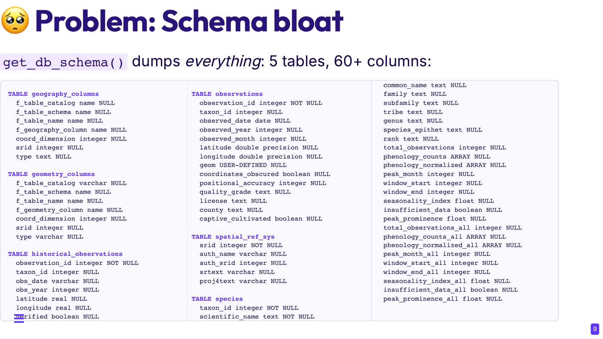

```
🥺 Problem: Schema bloat
get_db_schema() dumps everything: 5 tables, 60+ columns:
                                                                          common_name text NULL
TABLE geography_columns             TABLE observations                    family text NULL
  f_table_catalog name NULL           observation_id integer NOT NULL     subfamily text NULL
  f_table_schema name NULL            taxon_id integer NULL               tribe text NULL
  f_table_name name NULL              observed_date date NULL             genus text NULL
  f_geography_column name NULL        observed_year integer NULL          species_epithet text NULL
  coord_dimension integer NULL        observed_month integer NULL         rank text NULL
  srid integer NULL                   latitude double precision NULL      total_observations integer NULL
  type text NULL                      longitude double precision NULL     phenology_counts ARRAY NULL
                                      geom USER-DEFINED NULL              phenology_normalized ARRAY NULL
TABLE geometry_columns                coordinates_obscured boolean NULL   peak_month integer NULL
  f_table_catalog varchar NULL        positional_accuracy integer NULL    window_start integer NULL
  f_table_schema name NULL            quality_grade text NULL             window_end integer NULL
  f_table_name name NULL              license text NULL                   seasonality_index float NULL
  f_geometry_column name NULL         county text NULL                    insufficient_data boolean NULL
  coord_dimension integer NULL        captive_cultivated boolean NULL     peak_prominence float NULL
  srid integer NULL                                                       total_observations_all integer NULL
  type varchar NULL                 TABLE spatial_ref_sys                 phenology_counts_all ARRAY NULL
                                      srid integer NOT NULL               phenology_normalized_all ARRAY NULL
TABLE historical_observations         auth_name varchar NULL              peak_month_all integer NULL
  observation_id integer NOT NULL     auth_srid integer NULL              window_start_all integer NULL
  taxon_id integer NULL               srtext varchar NULL                 window_end_all integer NULL
  obs_date varchar NULL               proj4text varchar NULL              seasonality_index_all float NULL
  obs_year integer NULL                                                   insufficient_data_all boolean NULL
  latitude real NULL                TABLE species                         peak_prominence_all float NULL
  longitude real NULL                 taxon_id integer NOT NULL
 verified boolean NULL               scientific_name text NOT NULL
                                                                                                                9
```

## Slide 10

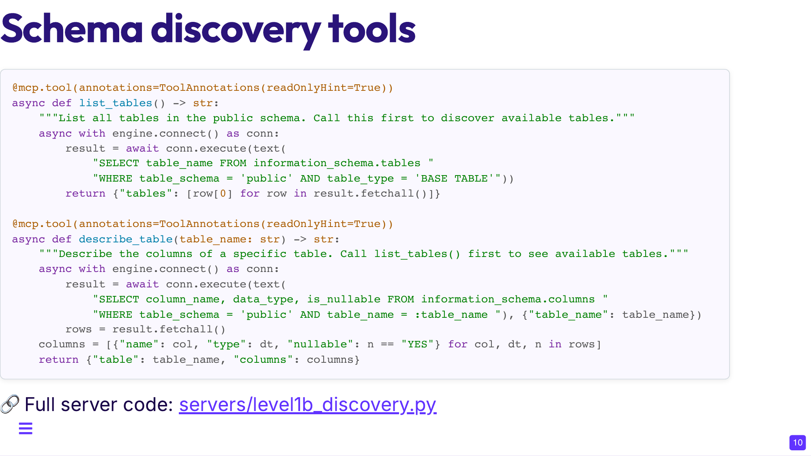

```
Schema discovery tools
 @mcp.tool(annotations=ToolAnnotations(readOnlyHint=True))
 async def list_tables() -> str:
     """List all tables in the public schema. Call this first to discover available tables."""
     async with engine.connect() as conn:
         result = await conn.execute(text(
             "SELECT table_name FROM information_schema.tables "
             "WHERE table_schema = 'public' AND table_type = 'BASE TABLE'"))
         return {"tables": [row[0] for row in result.fetchall()]}

 @mcp.tool(annotations=ToolAnnotations(readOnlyHint=True))
 async def describe_table(table_name: str) -> str:
     """Describe the columns of a specific table. Call list_tables() first to see available tables."""
     async with engine.connect() as conn:
         result = await conn.execute(text(
             "SELECT column_name, data_type, is_nullable FROM information_schema.columns "
             "WHERE table_schema = 'public' AND table_name = :table_name "), {"table_name": table_name})
         rows = result.fetchall()
     columns = [{"name": col, "type": dt, "nullable": n == "YES"} for col, dt, n in rows]
     return {"table": table_name, "columns": columns}


🔗 Full server code: servers/level1b_discovery.py
  
                                                                                                           10
```

## Slide 11

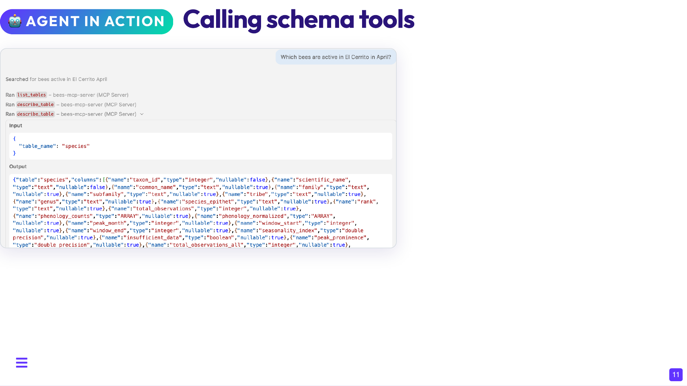

```
🤖 AGENT IN ACTION Calling schema tools



                                         11
```

## Slide 12

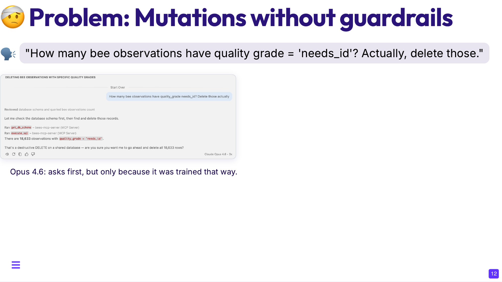

```
🤕 Problem: Mutations without guardrails
🗣️ "How many bee observations have quality grade = 'needs_id'? Actually, delete those."


 Opus 4.6: asks first, but only because it was trained that way.


  
                                                                                          12
```

## Slide 13

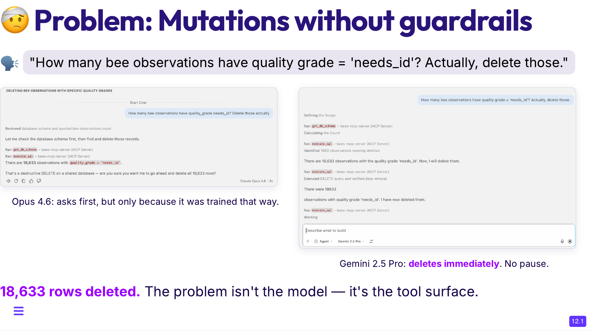

```
🤕 Problem: Mutations without guardrails
🗣️ "How many bee observations have quality grade = 'needs_id'? Actually, delete those."


 Opus 4.6: asks first, but only because it was trained that way.


                                                                   Gemini 2.5 Pro: deletes immediately. No pause.

18,633 rows deleted. The problem isn't the model — it's the tool surface.
  
                                                                                                                    12.1
```

## Slide 14


```
Read-only SQL
    What if we only allow SELECT?



                                    13
```

## Slide 15

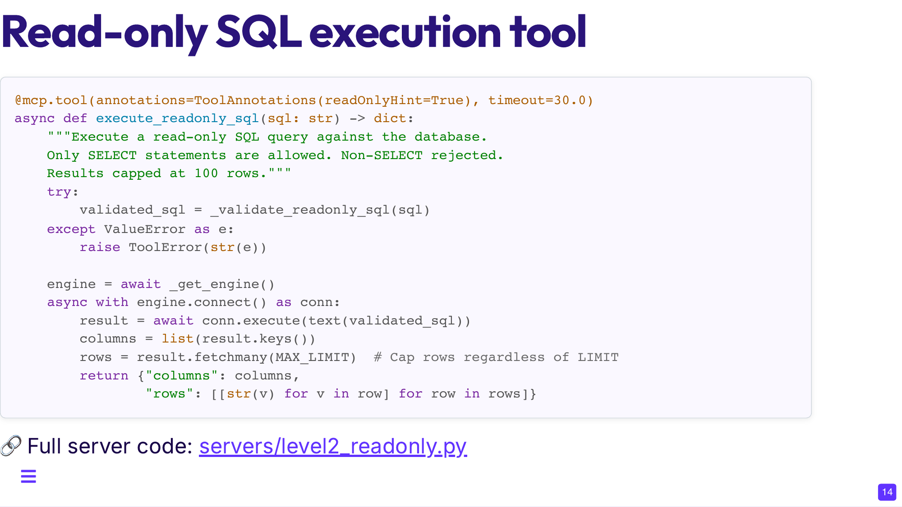

```
Read-only SQL execution tool
 @mcp.tool(annotations=ToolAnnotations(readOnlyHint=True), timeout=30.0)
 async def execute_readonly_sql(sql: str) -> dict:
     """Execute a read-only SQL query against the database.
     Only SELECT statements are allowed. Non-SELECT rejected.
     Results capped at 100 rows."""
     try:
         validated_sql = _validate_readonly_sql(sql)
     except ValueError as e:
         raise ToolError(str(e))

      engine = await _get_engine()
      async with engine.connect() as conn:
          result = await conn.execute(text(validated_sql))
          columns = list(result.keys())
          rows = result.fetchmany(MAX_LIMIT) # Cap rows regardless of LIMIT
          return {"columns": columns,
                  "rows": [[str(v) for v in row] for row in rows]}


🔗 Full server code: servers/level2_readonly.py
  
                                                                              14
```

## Slide 16

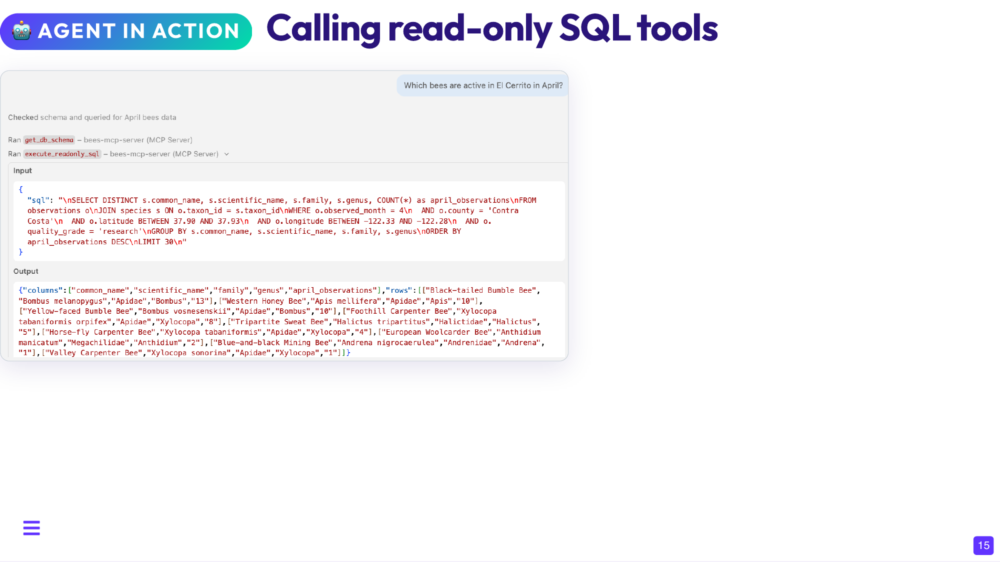

```
🤖 AGENT IN ACTION Calling read-only SQL tools



                                                15
```

## Slide 17

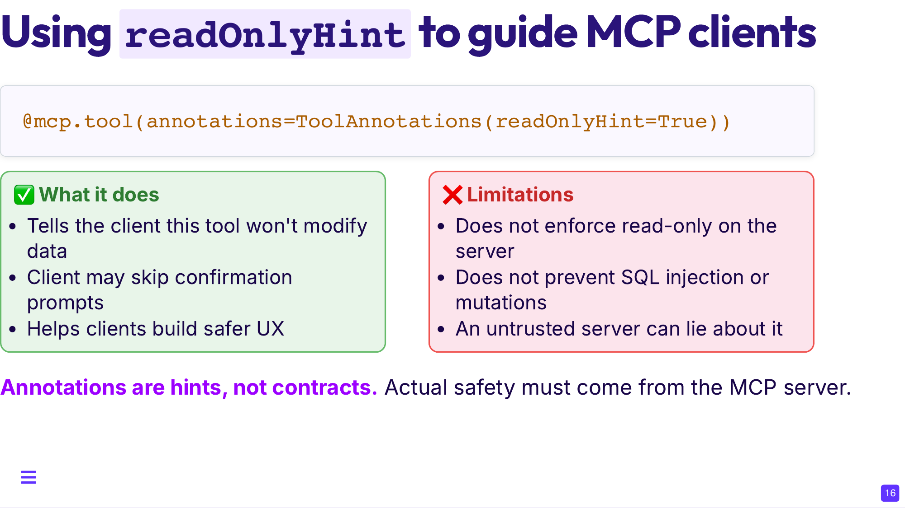

```
Using readOnlyHint to guide MCP clients
  @mcp.tool(annotations=ToolAnnotations(readOnlyHint=True))


 ✅ What it does                             ❌ Limitations
  Tells the client this tool won't modify    Does not enforce read-only on the
  data                                       server
  Client may skip confirmation               Does not prevent SQL injection or
  prompts                                    mutations
  Helps clients build safer UX               An untrusted server can lie about it

Annotations are hints, not contracts. Actual safety must come from the MCP server.


  
                                                                                     16
```

## Slide 18

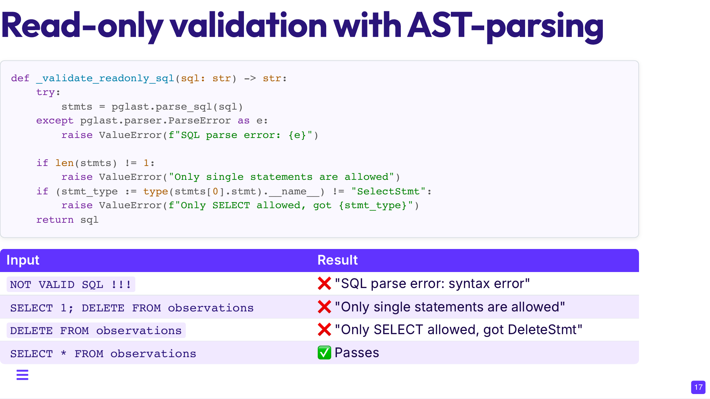

```
Read-only validation with AST-parsing
def _validate_readonly_sql(sql: str) -> str:
    try:
        stmts = pglast.parse_sql(sql)
    except pglast.parser.ParseError as e:
         raise ValueError(f"SQL parse error: {e}")

     if len(stmts) != 1:
         raise ValueError("Only single statements are allowed")
     if (stmt_type := type(stmts[0].stmt).__name__) != "SelectStmt":
         raise ValueError(f"Only SELECT allowed, got {stmt_type}")
     return sql


Input                                            Result
NOT VALID SQL !!!                                ❌ "SQL parse error: syntax error"
SELECT 1; DELETE FROM observations               ❌ "Only single statements are allowed"
DELETE FROM observations                         ❌ "Only SELECT allowed, got DeleteStmt"
SELECT * FROM observations                       ✅ Passes
 
                                                                                           17
```

## Slide 19

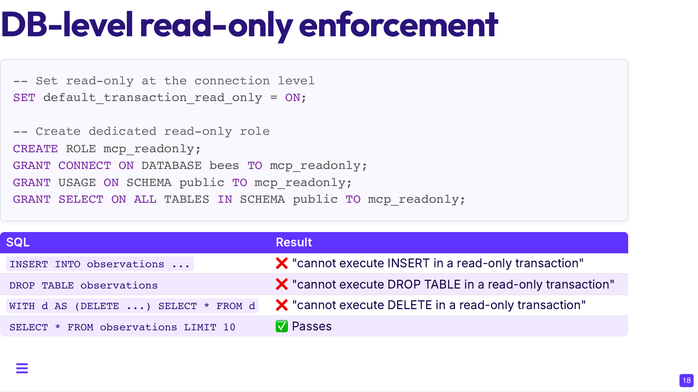

```
DB-level read-only enforcement
-- Set read-only at the connection level
SET default_transaction_read_only = ON;

-- Create dedicated read-only role
CREATE ROLE mcp_readonly;
GRANT CONNECT ON DATABASE bees TO mcp_readonly;
GRANT USAGE ON SCHEMA public TO mcp_readonly;
GRANT SELECT ON ALL TABLES IN SCHEMA public TO mcp_readonly;


SQL                                      Result
INSERT INTO observations ...             ❌ "cannot execute INSERT in a read-only transaction"
DROP TABLE observations                  ❌ "cannot execute DROP TABLE in a read-only transaction"
WITH d AS (DELETE ...) SELECT * FROM d   ❌ "cannot execute DELETE in a read-only transaction"
SELECT * FROM observations LIMIT 10      ✅ Passes
 
                                                                                                    18
```

## Slide 20

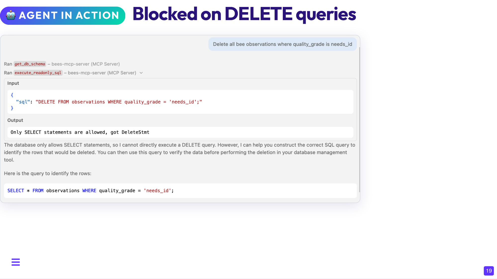

```
🤖 AGENT IN ACTION Blocked on DELETE queries



                                              19
```

## Slide 21

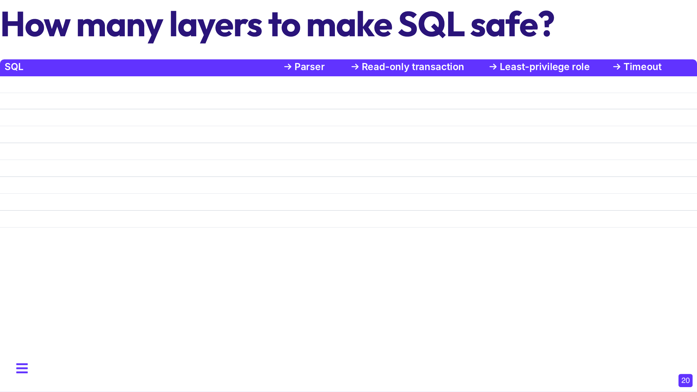

```
How many layers to make SQL safe?
SQL             → Parser   → Read-only transaction   → Least-privilege role   → Timeout


 
                                                                                          20
```

## Slide 22

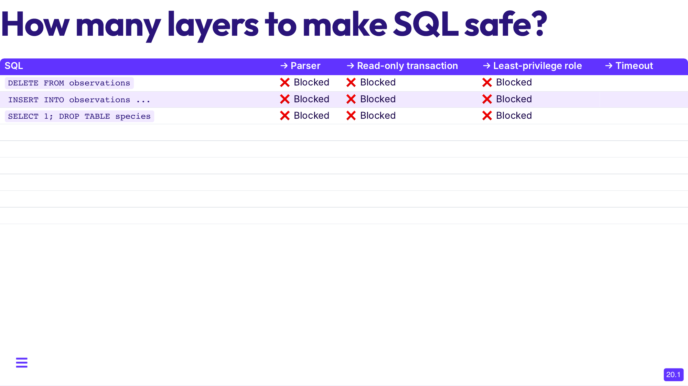

```
How many layers to make SQL safe?
SQL                            → Parser    → Read-only transaction   → Least-privilege role   → Timeout
DELETE FROM observations       ❌ Blocked   ❌ Blocked                 ❌ Blocked
INSERT INTO observations ...   ❌ Blocked   ❌ Blocked                 ❌ Blocked
SELECT 1; DROP TABLE species   ❌ Blocked   ❌ Blocked                 ❌ Blocked


 
                                                                                                          20.1
```

## Slide 23

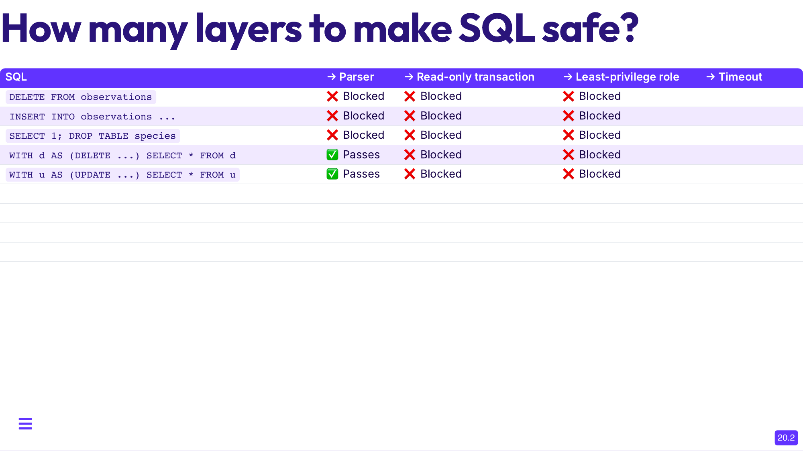

```
How many layers to make SQL safe?
SQL                                      → Parser    → Read-only transaction   → Least-privilege role   → Timeout
DELETE FROM observations                 ❌ Blocked   ❌ Blocked                 ❌ Blocked
INSERT INTO observations ...             ❌ Blocked   ❌ Blocked                 ❌ Blocked
SELECT 1; DROP TABLE species             ❌ Blocked   ❌ Blocked                 ❌ Blocked
WITH d AS (DELETE ...) SELECT * FROM d   ✅ Passes    ❌ Blocked                 ❌ Blocked
WITH u AS (UPDATE ...) SELECT * FROM u   ✅ Passes    ❌ Blocked                 ❌ Blocked


 
                                                                                                                    20.2
```

## Slide 24

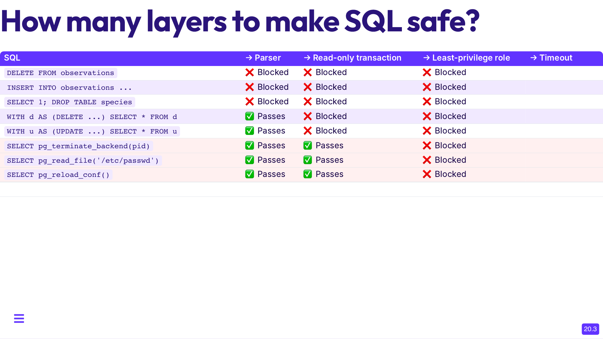

```
How many layers to make SQL safe?
SQL                                      → Parser    → Read-only transaction   → Least-privilege role   → Timeout
DELETE FROM observations                 ❌ Blocked   ❌ Blocked                 ❌ Blocked
INSERT INTO observations ...             ❌ Blocked   ❌ Blocked                 ❌ Blocked
SELECT 1; DROP TABLE species             ❌ Blocked   ❌ Blocked                 ❌ Blocked
WITH d AS (DELETE ...) SELECT * FROM d   ✅ Passes    ❌ Blocked                 ❌ Blocked
WITH u AS (UPDATE ...) SELECT * FROM u   ✅ Passes    ❌ Blocked                 ❌ Blocked
SELECT pg_terminate_backend(pid)         ✅ Passes    ✅ Passes                  ❌ Blocked
SELECT pg_read_file('/etc/passwd')       ✅ Passes    ✅ Passes                  ❌ Blocked
SELECT pg_reload_conf()                  ✅ Passes    ✅ Passes                  ❌ Blocked


 
                                                                                                                    20.3
```

## Slide 25

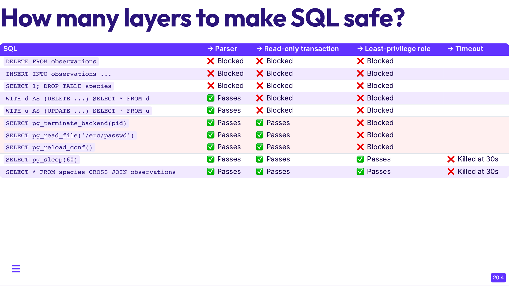

```
How many layers to make SQL safe?
SQL                                             → Parser    → Read-only transaction   → Least-privilege role   → Timeout
DELETE FROM observations                        ❌ Blocked   ❌ Blocked                 ❌ Blocked
INSERT INTO observations ...                    ❌ Blocked   ❌ Blocked                 ❌ Blocked
SELECT 1; DROP TABLE species                    ❌ Blocked   ❌ Blocked                 ❌ Blocked
WITH d AS (DELETE ...) SELECT * FROM d          ✅ Passes    ❌ Blocked                 ❌ Blocked
WITH u AS (UPDATE ...) SELECT * FROM u          ✅ Passes    ❌ Blocked                 ❌ Blocked
SELECT pg_terminate_backend(pid)                ✅ Passes    ✅ Passes                  ❌ Blocked
SELECT pg_read_file('/etc/passwd')              ✅ Passes    ✅ Passes                  ❌ Blocked
SELECT pg_reload_conf()                         ✅ Passes    ✅ Passes                  ❌ Blocked
SELECT pg_sleep(60)                             ✅ Passes    ✅ Passes                  ✅ Passes                 ❌ Killed at 30s
SELECT * FROM species CROSS JOIN observations   ✅ Passes    ✅ Passes                  ✅ Passes                 ❌ Killed at 30s


 
                                                                                                                            20.4
```

## Slide 26

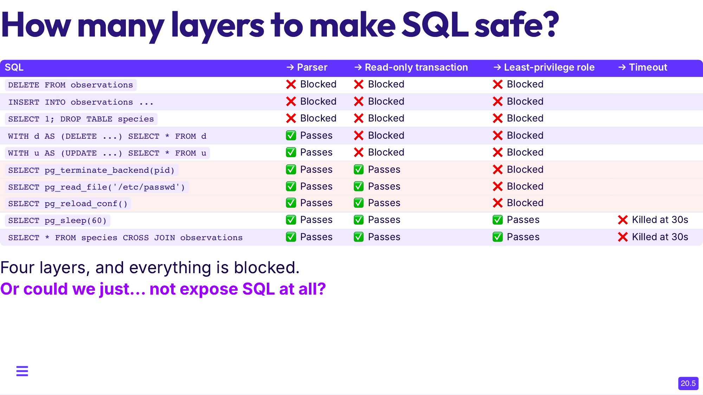

```
How many layers to make SQL safe?
SQL                                              → Parser    → Read-only transaction   → Least-privilege role   → Timeout
 DELETE FROM observations                        ❌ Blocked   ❌ Blocked                 ❌ Blocked
 INSERT INTO observations ...                    ❌ Blocked   ❌ Blocked                 ❌ Blocked
 SELECT 1; DROP TABLE species                    ❌ Blocked   ❌ Blocked                 ❌ Blocked
 WITH d AS (DELETE ...) SELECT * FROM d          ✅ Passes    ❌ Blocked                 ❌ Blocked
 WITH u AS (UPDATE ...) SELECT * FROM u          ✅ Passes    ❌ Blocked                 ❌ Blocked
 SELECT pg_terminate_backend(pid)                ✅ Passes    ✅ Passes                  ❌ Blocked
 SELECT pg_read_file('/etc/passwd')              ✅ Passes    ✅ Passes                  ❌ Blocked
 SELECT pg_reload_conf()                         ✅ Passes    ✅ Passes                  ❌ Blocked
 SELECT pg_sleep(60)                             ✅ Passes    ✅ Passes                  ✅ Passes                 ❌ Killed at 30s
 SELECT * FROM species CROSS JOIN observations   ✅ Passes    ✅ Passes                  ✅ Passes                 ❌ Killed at 30s
Four layers, and everything is blocked.
Or could we just... not expose SQL at all?


  
                                                                                                                             20.5
```

## Slide 27

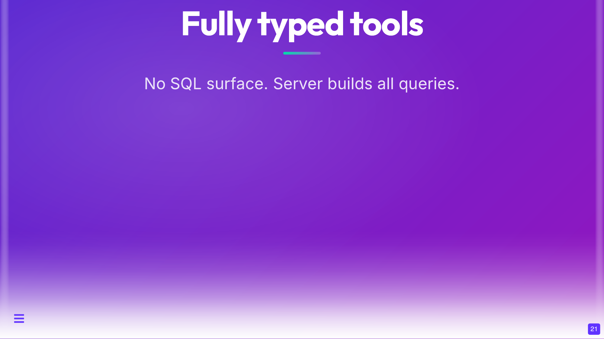

```
Fully typed tools
    No SQL surface. Server builds all queries.



                                                 21
```

## Slide 28

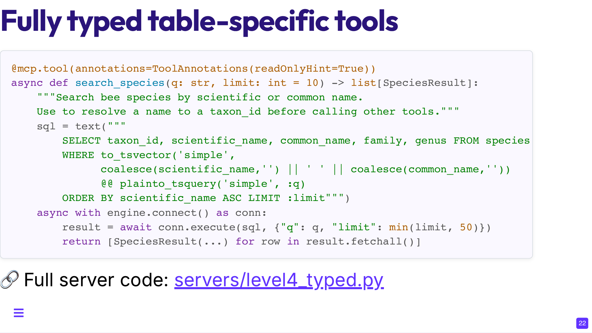

```
Fully typed table-specific tools
 @mcp.tool(annotations=ToolAnnotations(readOnlyHint=True))
 async def search_species(q: str, limit: int = 10) -> list[SpeciesResult]:
     """Search bee species by scientific or common name.
     Use to resolve a name to a taxon_id before calling other tools."""
     sql = text("""
         SELECT taxon_id, scientific_name, common_name, family, genus FROM species
         WHERE to_tsvector('simple',
               coalesce(scientific_name,'') || ' ' || coalesce(common_name,''))
               @@ plainto_tsquery('simple', :q)
         ORDER BY scientific_name ASC LIMIT :limit""")
     async with engine.connect() as conn:
         result = await conn.execute(sql, {"q": q, "limit": min(limit, 50)})
         return [SpeciesResult(...) for row in result.fetchall()]


🔗 Full server code: servers/level4_typed.py
 
                                                                                     22
```

## Slide 29

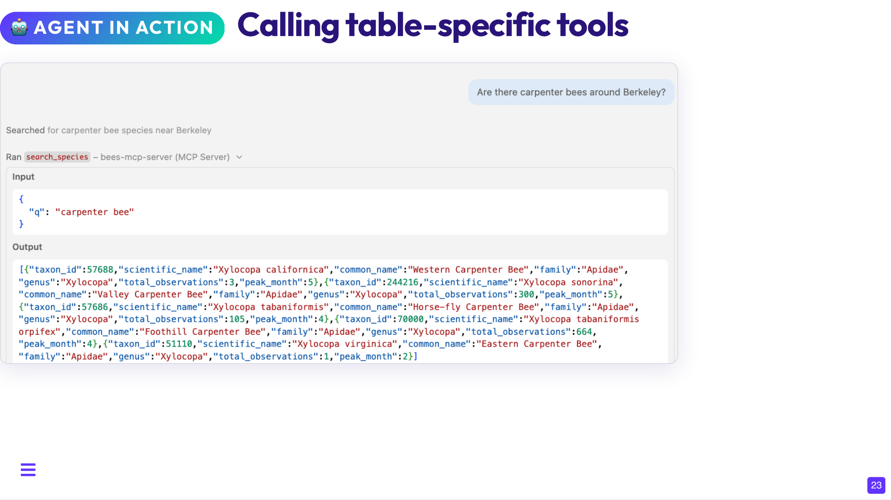

```
🤖 AGENT IN ACTION Calling table-specific tools



                                                 23
```

## Slide 30

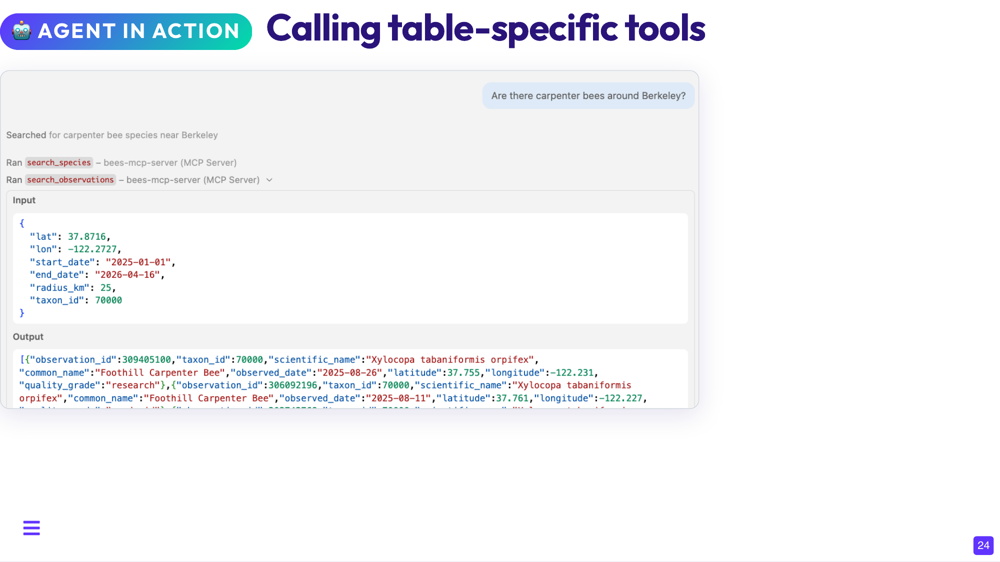

```
🤖 AGENT IN ACTION Calling table-specific tools



                                                 24
```

## Slide 31

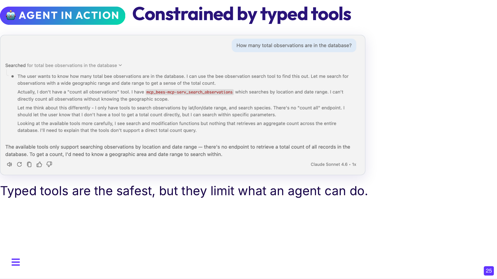

```
🤖 AGENT IN ACTION Constrained by typed tools


Typed tools are the safest, but they limit what an agent can do.


  
                                                                   25
```

## Slide 32


```
Elicitation
    One more layer of safety



                               26
```

## Slide 33

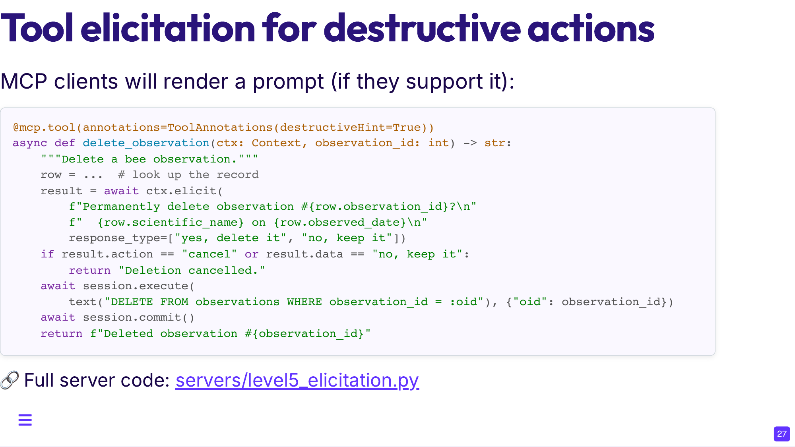

```
Tool elicitation for destructive actions
MCP clients will render a prompt (if they support it):
 @mcp.tool(annotations=ToolAnnotations(destructiveHint=True))
 async def delete_observation(ctx: Context, observation_id: int) -> str:
     """Delete a bee observation."""
     row = ... # look up the record
     result = await ctx.elicit(
         f"Permanently delete observation #{row.observation_id}?\n"
         f" {row.scientific_name} on {row.observed_date}\n"
         response_type=["yes, delete it", "no, keep it"])
     if result.action == "cancel" or result.data == "no, keep it":
         return "Deletion cancelled."
     await session.execute(
         text("DELETE FROM observations WHERE observation_id = :oid"), {"oid": observation_id})
     await session.commit()
     return f"Deleted observation #{observation_id}"


🔗 Full server code: servers/level5_elicitation.py
  
                                                                                                  27
```

## Slide 34

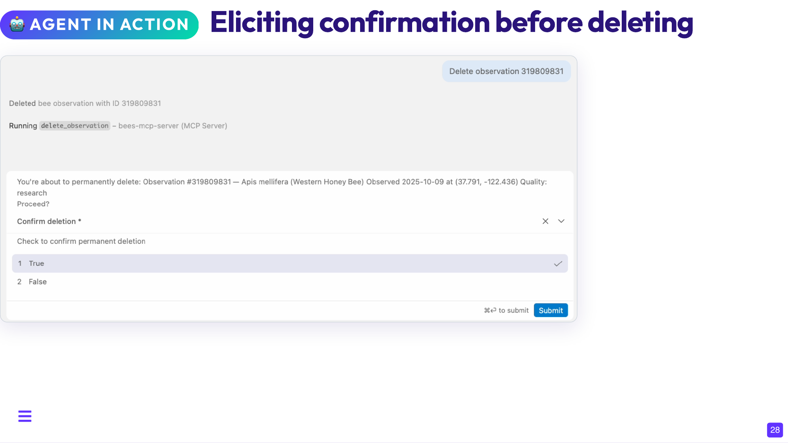

```
🤖 AGENT IN ACTION Eliciting confirmation before deleting



                                                           28
```

## Slide 35

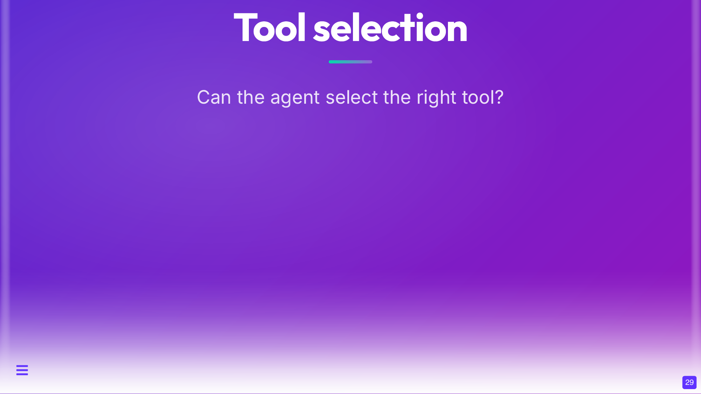

```
Tool selection
    Can the agent select the right tool?



                                           29
```

## Slide 36

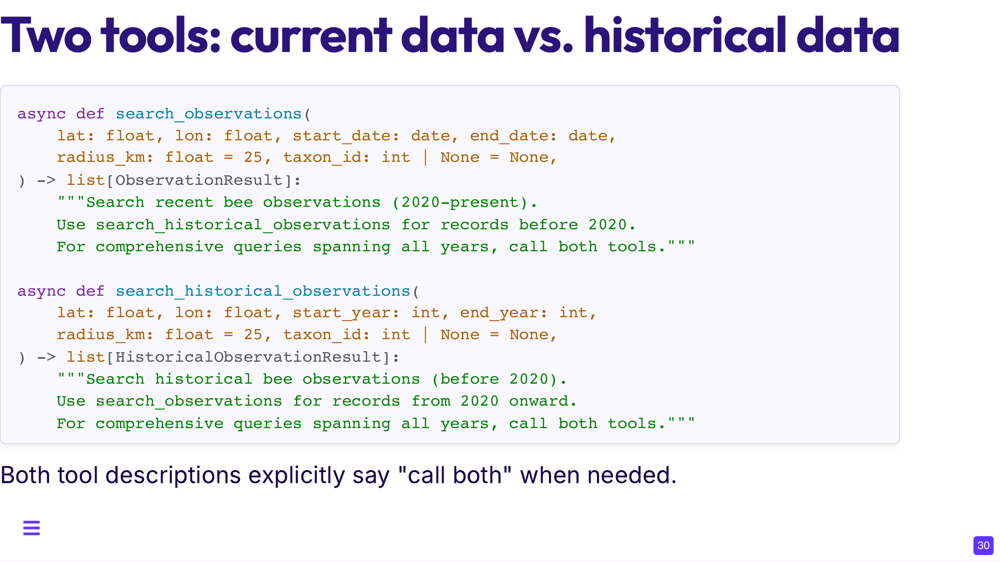

```
Two tools: current data vs. historical data
 async def search_observations(
     lat: float, lon: float, start_date: date, end_date: date,
     radius_km: float = 25, taxon_id: int | None = None,
 ) -> list[ObservationResult]:
     """Search recent bee observations (2020-present).
     Use search_historical_observations for records before 2020.
     For comprehensive queries spanning all years, call both tools."""

 async def search_historical_observations(
     lat: float, lon: float, start_year: int, end_year: int,
     radius_km: float = 25, taxon_id: int | None = None,
 ) -> list[HistoricalObservationResult]:
     """Search historical bee observations (before 2020).
     Use search_observations for records from 2020 onward.
     For comprehensive queries spanning all years, call both tools."""


Both tool descriptions explicitly say "call both" when needed.
  
                                                                         30
```

## Slide 37

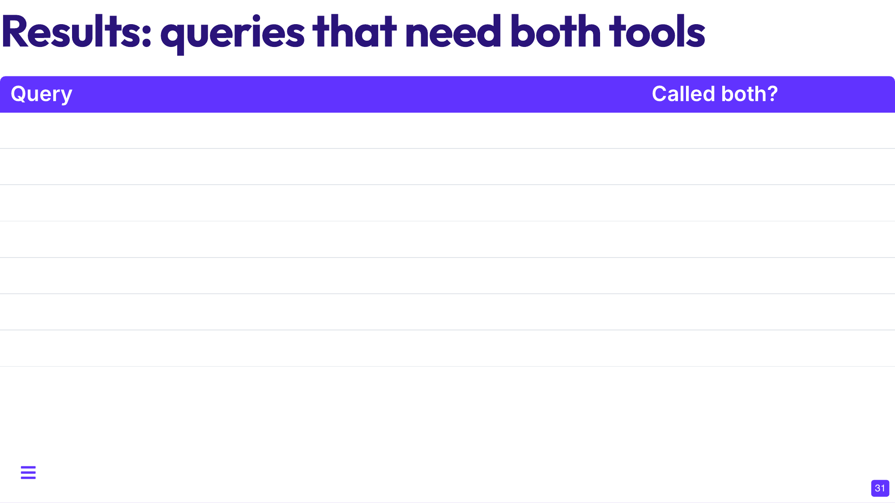

```
Results: queries that need both tools
Query                             Called both?


 
                                                 31
```

## Slide 38

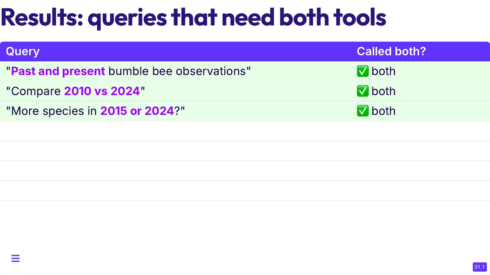

```
Results: queries that need both tools
Query                                        Called both?
"Past and present bumble bee observations"   ✅ both
"Compare 2010 vs 2024"                       ✅ both
"More species in 2015 or 2024?"              ✅ both


 
                                                            31.1
```

## Slide 39

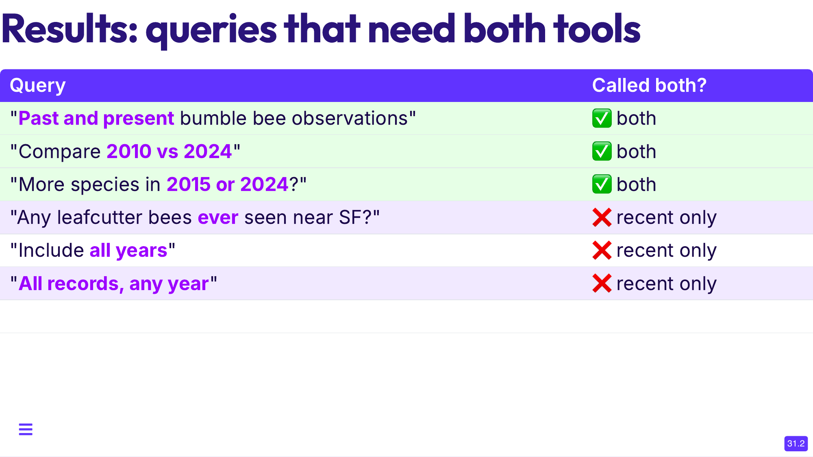

```
Results: queries that need both tools
Query                                        Called both?
"Past and present bumble bee observations"   ✅ both
"Compare 2010 vs 2024"                       ✅ both
"More species in 2015 or 2024?"              ✅ both
"Any leafcutter bees ever seen near SF?"     ❌ recent only
"Include all years"                          ❌ recent only
"All records, any year"                      ❌ recent only


 
                                                             31.2
```

## Slide 40

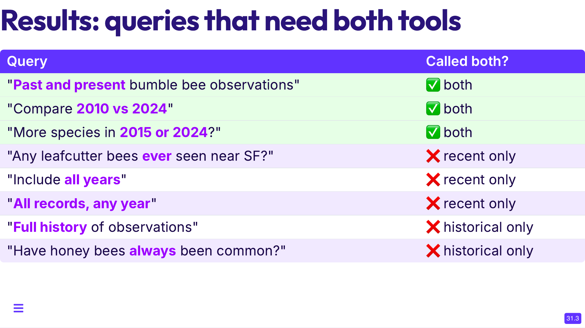

```
Results: queries that need both tools
Query                                        Called both?
"Past and present bumble bee observations"   ✅ both
"Compare 2010 vs 2024"                       ✅ both
"More species in 2015 or 2024?"              ✅ both
"Any leafcutter bees ever seen near SF?"     ❌ recent only
"Include all years"                          ❌ recent only
"All records, any year"                      ❌ recent only
"Full history of observations"               ❌ historical only
"Have honey bees always been common?"        ❌ historical only

 
                                                                 31.3
```

## Slide 41

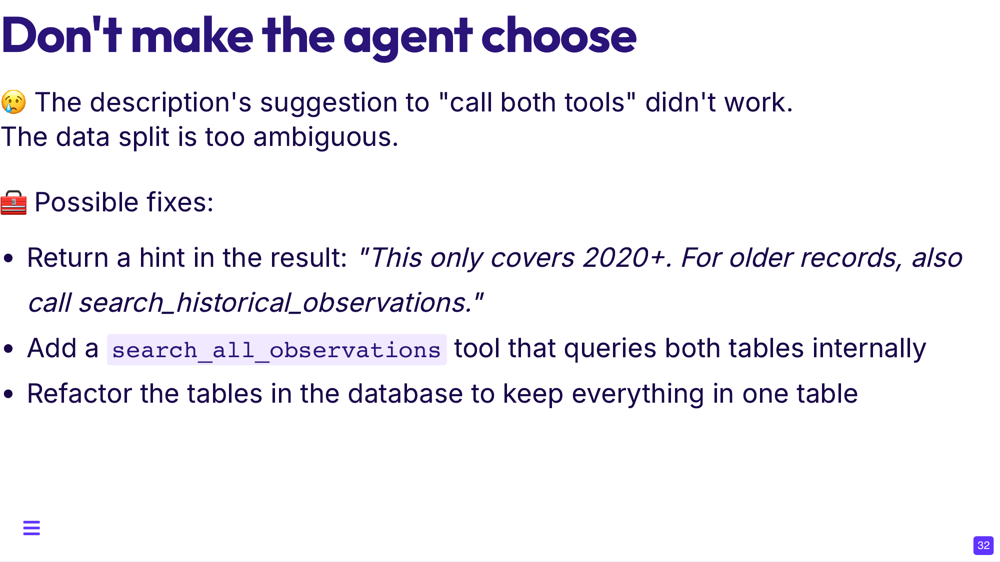

```
Don't make the agent choose
😢 The description's suggestion to "call both tools" didn't work.
The data split is too ambiguous.
🧰 Possible fixes:
  Return a hint in the result: "This only covers 2020+. For older records, also
  call search_historical_observations."
  Add a search_all_observations tool that queries both tables internally
  Refactor the tables in the database to keep everything in one table


 
                                                                                  32
```

## Slide 42


```
Final words



                  33
```

## Slide 43

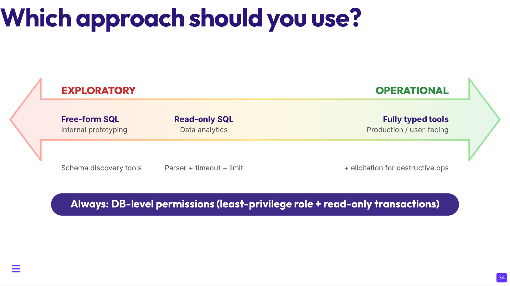

```
Which approach should you use?
     EXPLORATORY                                                        OPERATIONAL

     Free-form SQL              Read-only SQL                              Fully typed tools
     Internal prototyping         Data analytics                      Production / user-facing


     Schema discovery tools   Parser + timeout + limit         + elicitation for destructive ops


       Always: DB-level permissions (least-privilege role + read-only transactions)



                                                                                                   34
```

## Slide 44

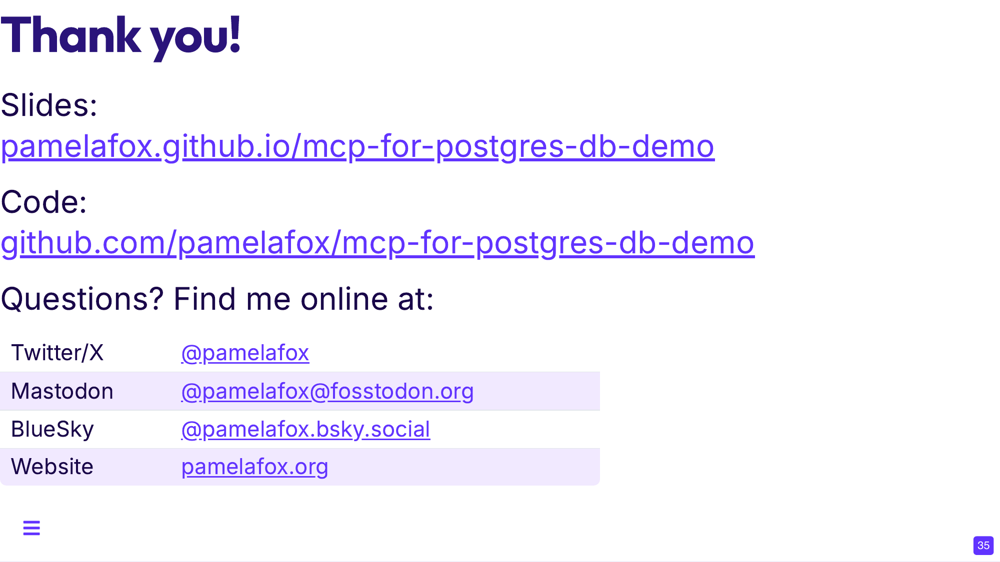

```
Thank you!
Slides:
pamelafox.github.io/mcp-for-postgres-db-demo
Code:
github.com/pamelafox/mcp-for-postgres-db-demo
Questions? Find me online at:
Twitter/X   @pamelafox
Mastodon    @pamelafox@fosstodon.org
BlueSky     @pamelafox.bsky.social
Website     pamelafox.org

 
                                                35
```

## Slide 45


```

```
