# Context engineering with MCP servers

This talk shares lessons from building MotherDuck's MCP server, framing MCP server design as a context engineering problem. Rather than thinking of agents as autonomous loops, the key insight is that an MCP server is a plugin that injects context into a user's conversation — and the challenge is controlling what goes in, when, and how much.

## Table of contents

- [What is MotherDuck](#what-is-motherduck)
- [MCP goes beyond tool calling](#mcp-goes-beyond-tool-calling)
- [Why MCP over CLI plus skills](#why-mcp-over-cli-plus-skills)
- [Evolution of the MotherDuck MCP server](#evolution-of-the-motherduck-mcp-server)
- [An MCP server is a context engineering plugin](#an-mcp-server-is-a-context-engineering-plugin)
- [Ways to inject context through MCP](#ways-to-inject-context-through-mcp)
- [Balancing context efficiency and effectiveness](#balancing-context-efficiency-and-effectiveness)
- [Client fragmentation limits what you can rely on](#client-fragmentation-limits-what-you-can-rely-on)
- [Different user types change the design calculus](#different-user-types-change-the-design-calculus)
- [Finding the right balance through iteration](#finding-the-right-balance-through-iteration)
- [Evaluation and testing are the missing piece](#evaluation-and-testing-are-the-missing-piece)
- [Observability is limited in MCP](#observability-is-limited-in-mcp)
- [What's next: context layers and memory](#whats-next-context-layers-and-memory)

## What is MotherDuck

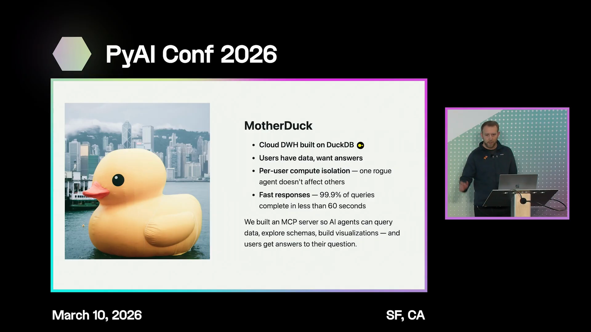
[Watch from 00:12](https://www.youtube.com/watch?v=FV5UJr-Yan8&t=12s)

MotherDuck is a cloud data warehouse built on top of DuckDB, an open-source analytical database system. Its users typically have analytical questions they want answered. MotherDuck differs from traditional data warehouses by providing per-user compute isolation — every user gets their own DuckDB instance in the cloud, insulated from other users' compute. An agent running an inefficient query won't affect anyone else on the platform.

DuckDB excels on small to medium data. "Small" here doesn't mean megabytes — it can handle hundreds of gigabytes or even terabytes, with most queries finishing quickly.

## MCP goes beyond tool calling

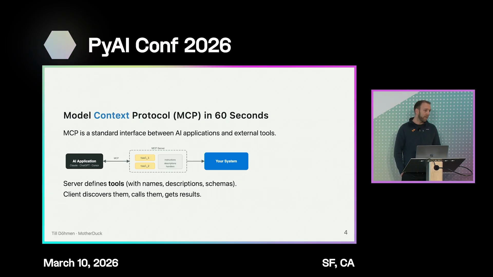
[Watch from 02:01](https://www.youtube.com/watch?v=FV5UJr-Yan8&t=121s)

MCP is a way to connect AI applications to your system. MCP servers define tools with names, descriptions, and input/output schemas. AI applications discover these capabilities and call them to interact with your system.

But MCP enables more than just tool calls.

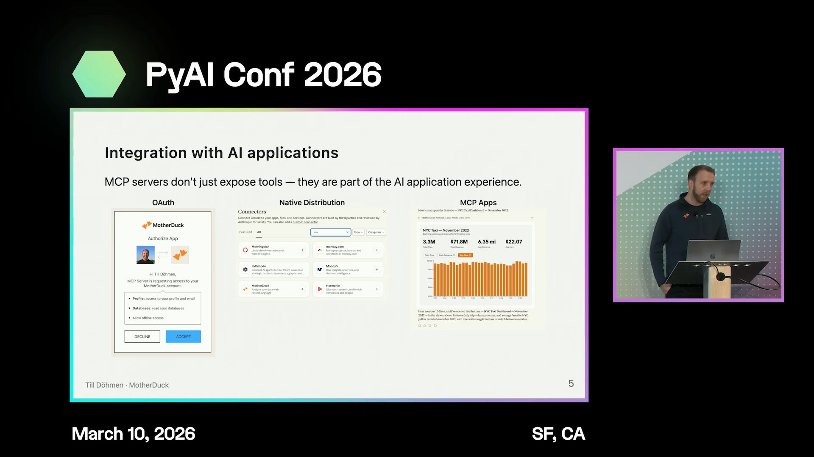

When connecting an MCP server in Claude or ChatGPT, an OAuth flow pops up for authentication. There are connector directories (Claude) and app directories (ChatGPT) where you can list your product. The user experience goes beyond agents calling tools — features like elicitation let the AI application pop up question dialogs or multiple-choice prompts. MCP apps, now supported in ChatGPT and Claude, allow fully custom, interactive UI components natively integrated into the chat.

## Why MCP over CLI plus skills

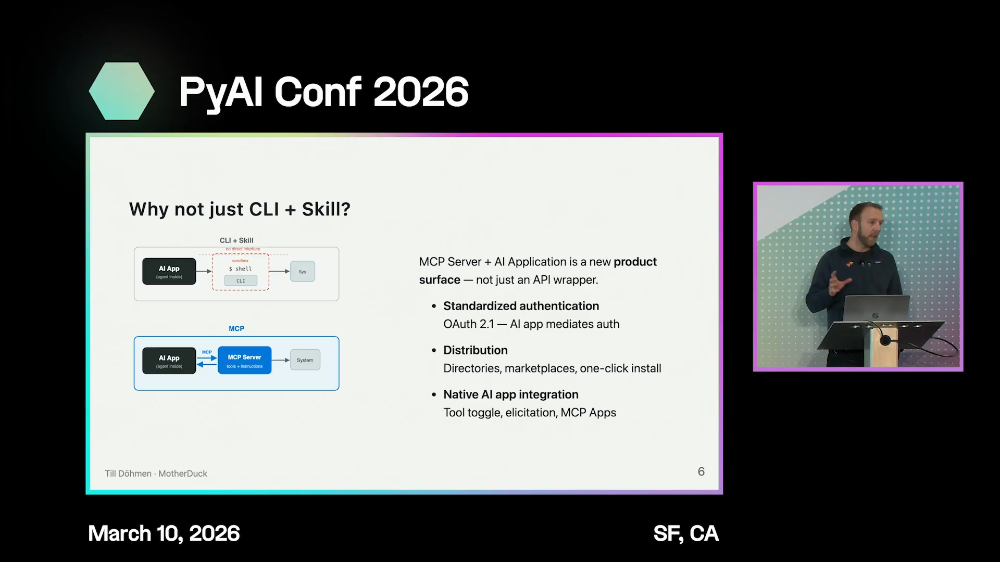
[Watch from 03:44](https://www.youtube.com/watch?v=FV5UJr-Yan8&t=224s)

The features that happen natively in the AI application — authentication, elicitation, custom UI — are what make MCP worth building rather than just providing a CLI and a skill file. Many users also rely on web-based AI clients like Claude AI and ChatGPT web. These web clients may have shell sandboxes, but they're usually restricted when it comes to network communication. MCP makes connecting to external systems much easier in that context.

## Evolution of the MotherDuck MCP server

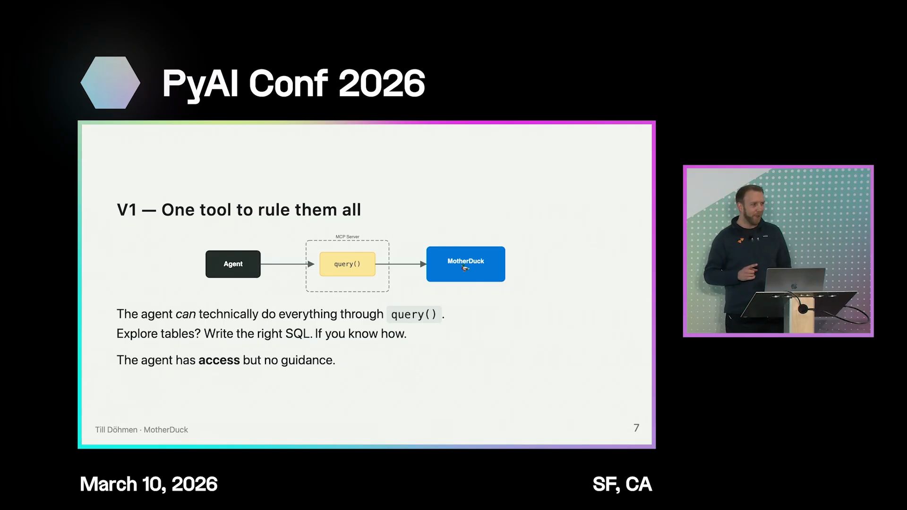
[Watch from 04:41](https://www.youtube.com/watch?v=FV5UJr-Yan8&t=281s)

MotherDuck started building their open-source MCP server shortly after the MCP spec came out. The first version had just one tool: a query tool. The reasoning was simple — since all MotherDuck features are accessible through SQL, agents should be able to do everything with just a query tool.

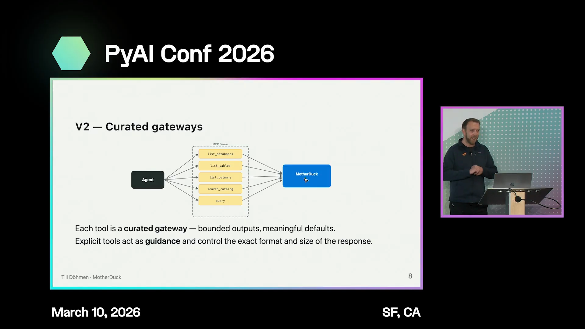

That turned out to be wrong. Users ran into the same problems repeatedly. DuckDB has its own syntax for schema exploration (listing columns, showing databases), and since DuckDB isn't as prevalent in LLM pretraining data, models would fall back to PostgreSQL syntax and run in circles. Adding dedicated schema exploration tools solved this, and also gave control over output — a `list_tables` call in DuckDB returns 11 columns, but the model only needs column names, types, and maybe comments. There's no reason to dump everything else into the context.

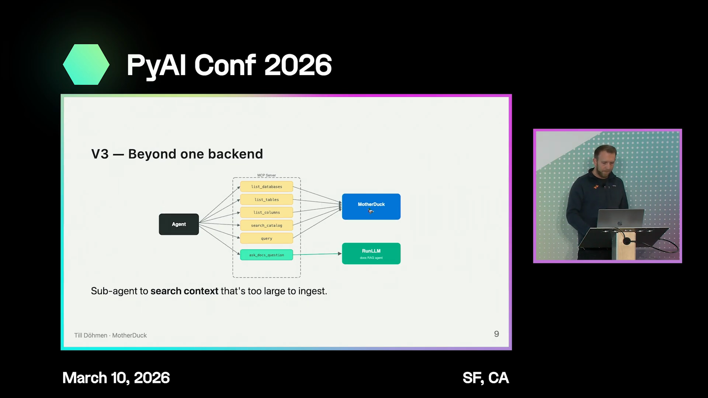

At an internal hackathon, users stopped getting stuck on schema exploration but started asking how to do things like semantic search in MotherDuck. This led to an `ask_docs_question` tool that gives the agent access to documentation. Rather than letting the agent crawl the entire website and stuff it into context, the tool reuses the same RAG chat backend that powers MotherDuck's website, wrapped as an MCP tool. The documentation search is offloaded to a sub-agent to keep the main agent's context clean.

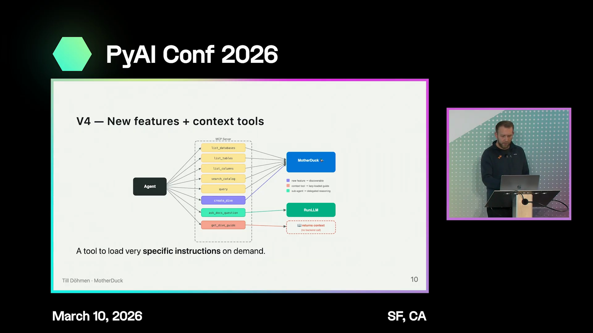

Later, MotherDuck added a feature called Dives — interactive, fully customizable dashboards. Building a Dive requires a lot of agent context, so a `get_dives_guide` tool was added to load a focused app skill when needed. 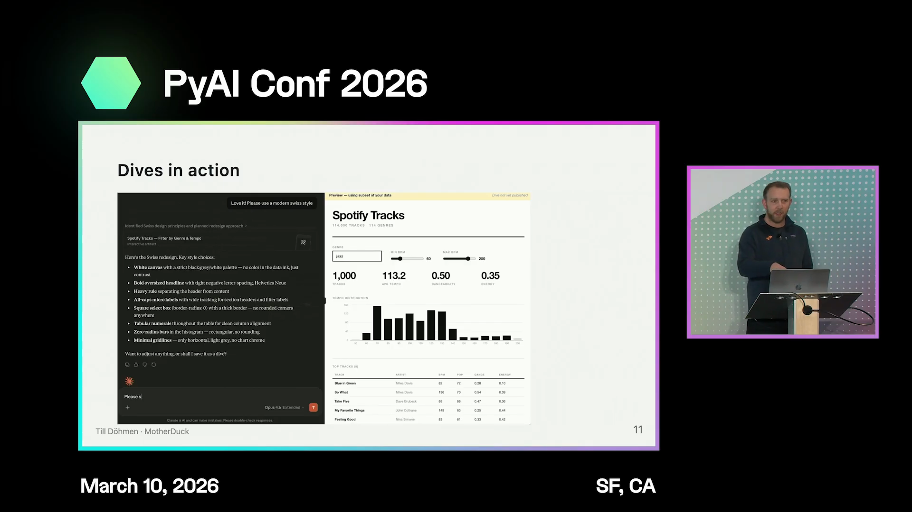

A demo showed the full flow: a user uploads a CSV, asks for a dashboard, the agent builds it using Claude's artifacts for preview, and the user saves it to MotherDuck as a live dashboard with wired-up queries.

## An MCP server is a context engineering plugin

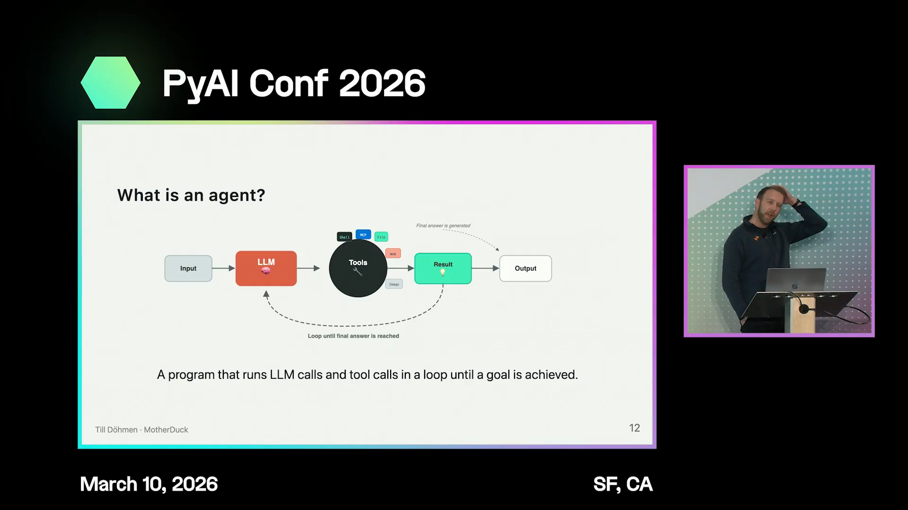
[Watch from 08:50](https://www.youtube.com/watch?v=FV5UJr-Yan8&t=530s)

The common definition of an agent — a loop that calls tools until it reaches a goal — isn't that helpful when designing MCP tools. 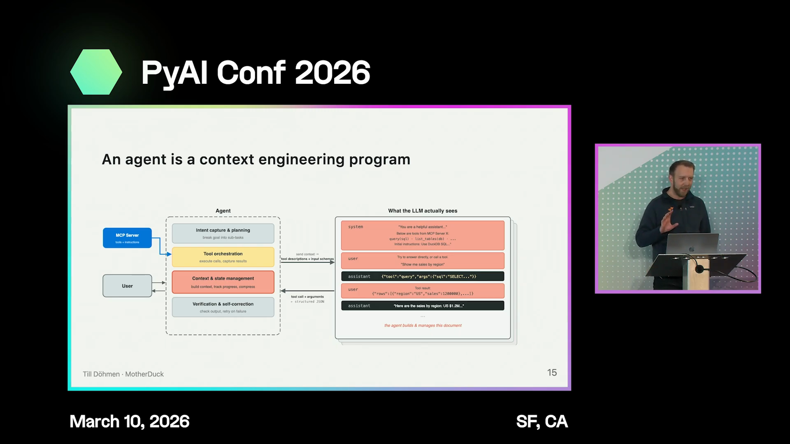

A more useful framing: an agent is a program that does context engineering in the user's context window, and an MCP server is a plugin for that program. You have a small opening into the agent's behavior, and that's all you have to work with. The question becomes: how does adding this tool change how the agent behaves across the entire workflow a user goes through?

## Ways to inject context through MCP

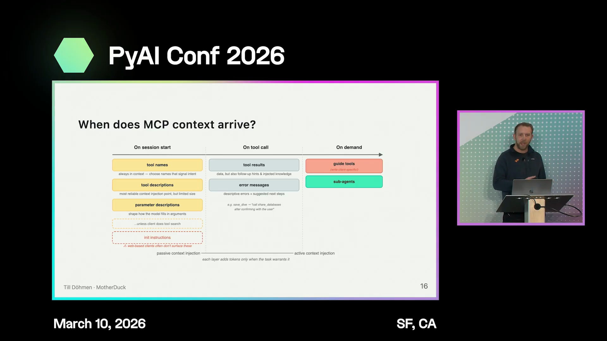
[Watch from 11:07](https://www.youtube.com/watch?v=FV5UJr-Yan8&t=667s)

When a session starts, the agent typically ingests tool names, tool descriptions, and parameter descriptions. These are always in context, so they're one way to inject information. But submission guidelines from Anthropic and OpenAI say descriptions should be human-readable and within size limits — you shouldn't stuff all your instructions into tool descriptions.

Other approaches work indirectly through the tool interface. Just having a tool named "dives" gives the agent a hint that this capability exists, prompting it to call `get_dives_guide` when a user asks about dashboards. For tools like the query tool, error messages are an opportunity: instead of returning a bare error, you can return a descriptive message explaining what went wrong, or even attach documentation about the feature the agent was trying to use. Some knowledge retrieval is best offloaded to a sub-agent to keep the main agent's context clean.

## Balancing context efficiency and effectiveness

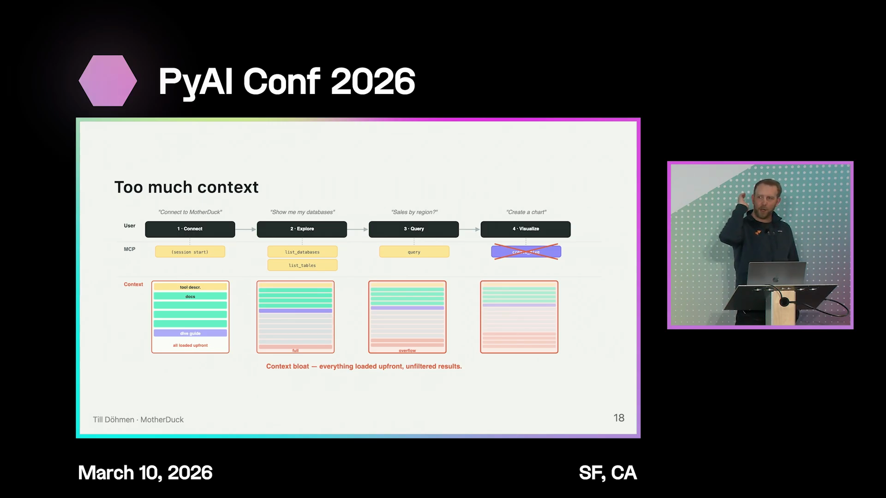
[Watch from 13:03](https://www.youtube.com/watch?v=FV5UJr-Yan8&t=783s)

With just a query tool, the MCP server is context-efficient — it barely adds anything to the context — but it's not effective, because the agent gets stuck. At the other extreme, you can dump all possible context at the start of every conversation. The agent always knows exactly what to do, but the user's context window blows up halfway through.

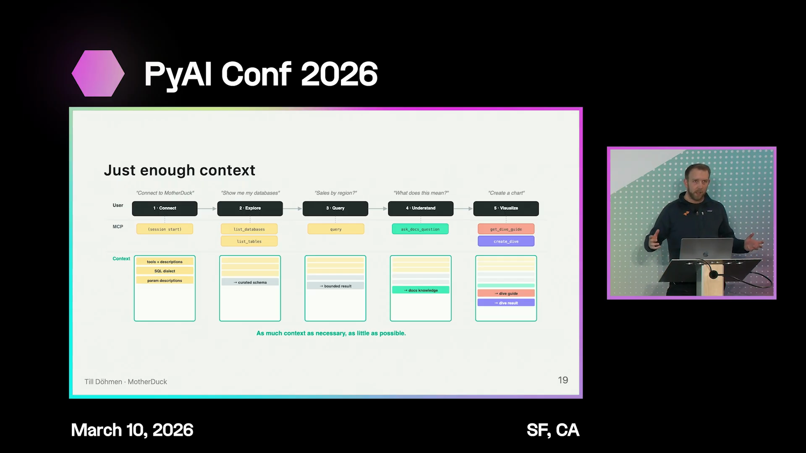

The right approach is somewhere in between. Understanding how users actually use the MCP server across different workflows matters enormously. Giving an iteration of the MCP server to a non-technical user and watching what happens has been revealing — developers build for certain workflows, but users often take completely different paths, causing the agent to miss tool calls or produce an unpolished experience.

## Client fragmentation limits what you can rely on

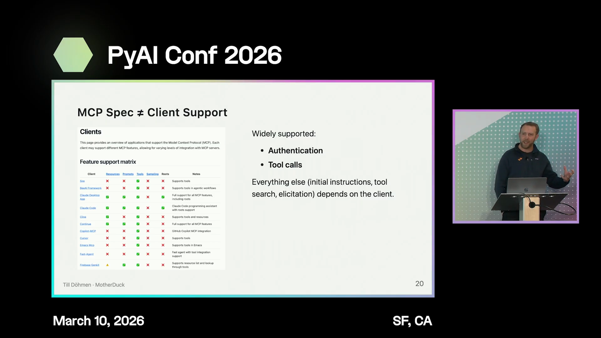
[Watch from 14:45](https://www.youtube.com/watch?v=FV5UJr-Yan8&t=885s)

The MCP spec has many features — initial instructions sent when a server connects, elicitation, MCP apps — but client support is inconsistent. Some clients ignore the initial instructions entirely and don't inject them into context. When 80% of your users connect through Claude and a feature doesn't work there, you can't build on it.

The only universally supported capabilities across all clients are authentication and tool calls. If you want to ship one version of your MCP server, you're working with a very small intersection of what clients actually implement. Features like elicitation and MCP apps add value but can't be relied on everywhere.

## Different user types change the design calculus

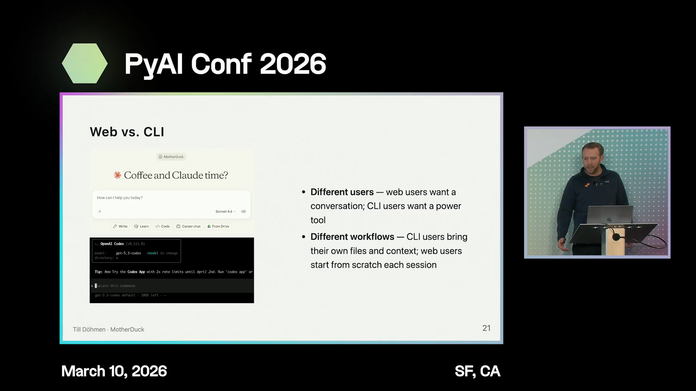
[Watch from 16:02](https://www.youtube.com/watch?v=FV5UJr-Yan8&t=962s)

MCP users fall into different categories. Web-based users who've never used a CLI but love Claude are a significant fraction. For them, the MCP server has been empowering — non-technical people in sales and other areas can now query data, build dashboards, and get insights from internal data warehouses on their own.

Adoption friction matters more than expected. MotherDuck had an open-source MCP server for a year that required pasting a five-line JSON snippet into a Claude config file. That small hurdle was already too much for many users. The same applies to friction during usage. CLI users have local file system access and other capabilities that change the workflow design significantly.

## Finding the right balance through iteration

[Watch from 17:40](https://www.youtube.com/watch?v=FV5UJr-Yan8&t=1060s)

There's no formula for finding the right balance. MotherDuck found theirs through iteration, and it works well enough for their users. As the MCP server matures and tools like the Dives guide accumulate sophisticated prompts, feature requests keep coming — users want slightly different behavior. But there's increasing hesitation to make changes without better ways to ensure they don't break other workflows.

## Evaluation and testing are the missing piece

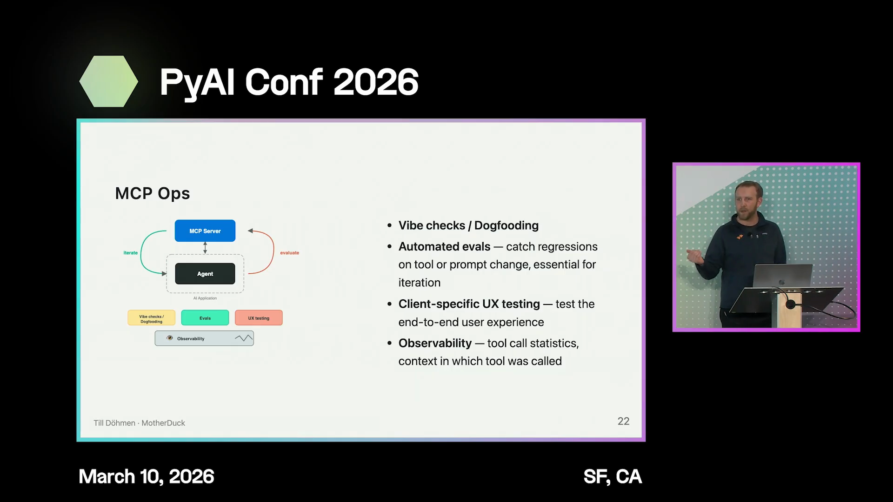
[Watch from 18:27](https://www.youtube.com/watch?v=FV5UJr-Yan8&t=1107s)

Automated evaluation of MCP workflows is the equivalent of unit testing, and it's sorely missing from the MCP development process. If changing a prompt fixes one workflow, another workflow you didn't think about might break. It's not only about evaluating the agent's behavior — it's also about the actual user experience. Clients behave differently, add new features overnight, or run A/B tests. Claude on any given day might look different from the day before. Tool search may appear where it wasn't before, impacting the experience. End-to-end testing across real clients is valuable.

## Observability is limited in MCP

[Watch from 19:38](https://www.youtube.com/watch?v=FV5UJr-Yan8&t=1178s)

Basic observability — which tools get called, how often — is useful. MotherDuck had a tool that was practically never called, so they removed it. But MCP only exposes tool inputs; you don't see what's happening around the tool call in the broader conversation. Self-hosting the AI application gives access to full traces for debugging, but within an MCP server connected to third-party clients, visibility is very limited.

One workaround: add a parameter to tool calls that asks the model to pass in its current context or reasoning. Whether users would be comfortable with that is an open question.

## What's next: context layers and memory

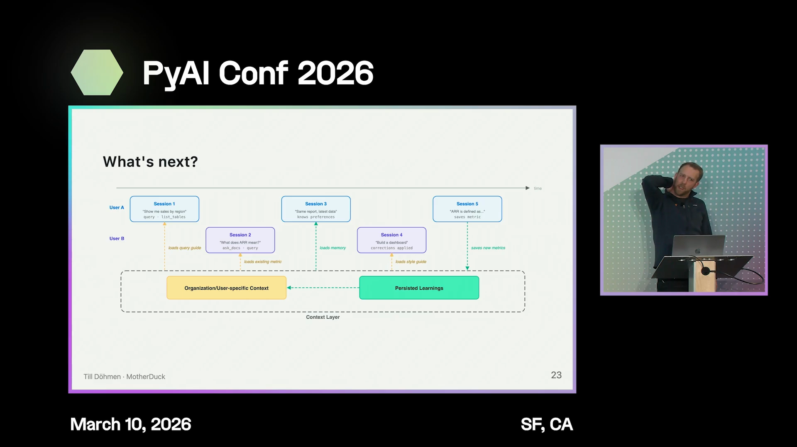
[Watch from 20:23](https://www.youtube.com/watch?v=FV5UJr-Yan8&t=1223s)

The next frontier is how context layers and memory fit together with MCP servers. Users need consistency across sessions, and MCP servers can help by providing save and load tools for specific data. The question is how to customize an MCP server for a specific user or organization in a seamless way.
