# Just because AI can write your tests, should it?

This talk explores the question of whether AI, specifically large language models (LLMs), should be used to write software tests. It examines the capabilities and limitations of AI-generated tests, compares how different LLMs perform in creating tests, and emphasizes the importance of complementing AI assistance with specialized testing tools and human judgment. The talk uses an extended analogy with bees to distinguish between generalist and specialist roles, drawing parallels to AI and testing practices.

## Table of contents

- [Introduction: AI writing tests, is it a good idea?](#introduction-ai-writing-tests-is-it-a-good-idea)
- [Bees as an analogy for generalists and specialists](#bees-as-an-analogy-for-generalists-and-specialists)
- [Specialist bees outperform generalists in certain contexts](#specialist-bees-outperform-generalists-in-certain-contexts)
- [Favorite California specialist bee: the digger bee](#favorite-california-specialist-bee-the-digger-bee)
- [Using iNaturalist data to find specialist bees](#using-inaturalist-data-to-find-specialist-bees)
- [Relating bees to LLMs as generalist models](#relating-bees-to-llms-as-generalist-models)
- [LLMs can write Python tests for API endpoints](#llms-can-write-python-tests-for-api-endpoints)
- [Example: GPT-5 generated tests with partial coverage](#example-gpt-5-generated-tests-with-partial-coverage)
- [Example: Claude Sonnet 4.5 generates more comprehensive tests](#example-claude-sonnet-45-generates-more-comprehensive-tests)
- [Comparative results of different LLMs generating tests](#comparative-results-of-different-llms-generating-tests)
- [Humans achieve 100% coverage by reviewing reports; can LLMs do the same?](#humans-achieve-100-coverage-by-reviewing-reports-can-llms-do-the-same)
- [LLMs can approach full coverage but may stall on edge cases](#llms-can-approach-full-coverage-but-may-stall-on-edge-cases)
- [Remaining problems in AI-generated tests: redundancy, unrealistic fake data, and missing edge cases](#remaining-problems-in-ai-generated-tests-redundancy-unrealistic-fake-data-and-missing-edge-cases)
- [Bringing in specialist tools to improve tests](#bringing-in-specialist-tools-to-improve-tests)
- [Reducing redundant test code with pytest parameterization](#reducing-redundant-test-code-with-pytest-parameterization)
- [Using pytest fixtures to share common test setups](#using-pytest-fixtures-to-share-common-test-setups)
- [Generating realistic fake data with Faker](#generating-realistic-fake-data-with-faker)
- [Faker library produces realistic test data](#faker-library-produces-realistic-test-data)
- [AI-generated tests often only check for field existence, not full output](#ai-generated-tests-often-only-check-for-field-existence-not-full-output)
- [Snapshot testing captures full API responses for verification](#snapshot-testing-captures-full-api-responses-for-verification)
- [Even 100% code coverage is insufficient without edge case testing](#even-100-code-coverage-is-insufficient-without-edge-case-testing)
- [Property-based testing explores wide input spaces automatically](#property-based-testing-explores-wide-input-spaces-automatically)
- [Hypothesis testing of API endpoints with generated inputs](#hypothesis-testing-of-api-endpoints-with-generated-inputs)
- [Hypothesis discovers bugs caused by invalid inputs](#hypothesis-discovers-bugs-caused-by-invalid-inputs)
- [Schemathesis generates API tests from OpenAPI specifications](#schemathesis-generates-api-tests-from-openapi-specifications)
- [Schemathesis reproduces Hypothesis-discovered database error](#schemathesis-reproduces-hypothesis-discovered-database-error)
- [Decision on using LLMs to write tests rests with the developer](#decision-on-using-llms-to-write-tests-rests-with-the-developer)
- [Example prompt to guide LLM test generation with best practices](#example-prompt-to-guide-llm-test-generation-with-best-practices)
- [Returning to bees: importance of specialist pollinators in gardens](#returning-to-bees-importance-of-specialist-pollinators-in-gardens)
- [Q&A](#qa)

## Introduction: AI writing tests, is it a good idea?

  
[Watch from 00:08](https://youtu.be/Lha1741iEjE?t=8)

The question posed is whether AI should write software tests simply because it can. This is a timely topic as AI increasingly assists in coding, raising concerns about test quality and trustworthiness. The goal is to assess AI’s role in generating tests and explore best practices for integrating AI into the testing workflow responsibly.

## Bees as an analogy for generalists and specialists

  
[Watch from 01:17](https://youtu.be/Lha1741iEjE?t=77)

The honeybee represents a generalist pollinator that visits many types of plants. It is flexible and pollinates a broad range of crops, making it valuable but not always the most efficient. This generalist behavior parallels how LLMs function: trained on massive diverse data, they excel at many tasks but may lack depth in specialized areas.

## Specialist bees outperform generalists in certain contexts

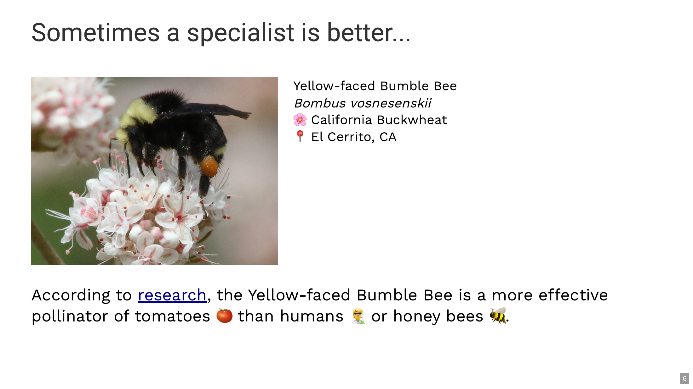  
[Watch from 02:29](https://youtu.be/Lha1741iEjE?t=149)

Specialist bees, such as the yellow-faced bumblebee, are more effective pollinators for specific plants like tomatoes. Their efficiency surpasses honeybees or even humans due to specialized behaviors such as precise timing. This analogy highlights the need to recognize the limits of generalist AI models and the importance of leveraging specialized tools for particular tasks, including testing.

## Favorite California specialist bee: the digger bee

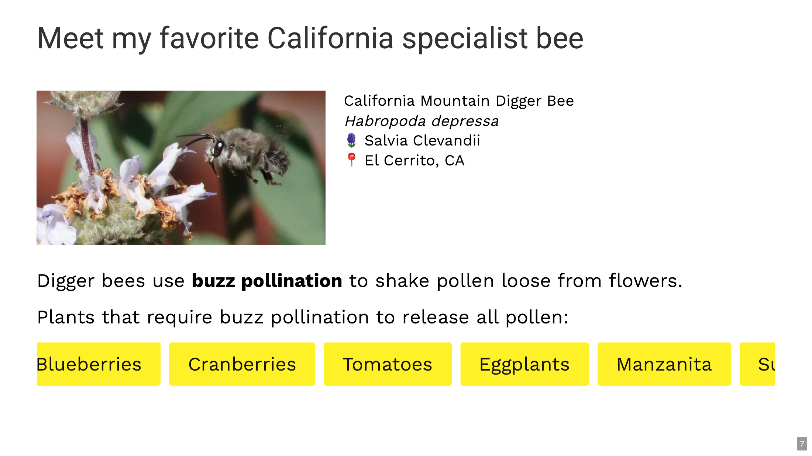  
[Watch from 03:04](https://youtu.be/Lha1741iEjE?t=184)

The California mountain digger bee uses buzz pollination, vibrating flowers to release pollen inaccessible to other bees. This illustrates that some tasks require unique approaches, reinforcing the idea that specialists—whether in nature or software—are crucial for thorough, effective results.

## Using iNaturalist data to find specialist bees

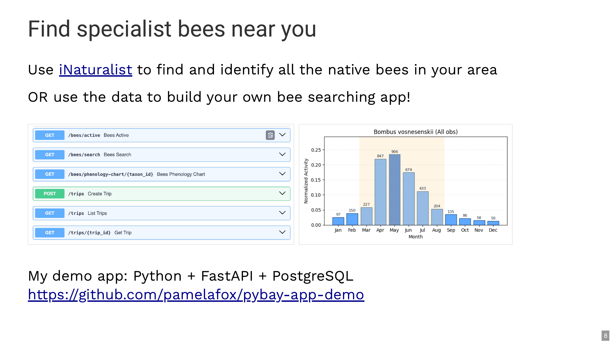  
[Watch from 03:47](https://youtu.be/Lha1741iEjE?t=227)

iNaturalist provides rich observational data and an API for exploring native bee species, enabling developers to build apps that identify and track specialist pollinators. This serves as a practical example of combining generalist tools with domain-specific data to enhance outcomes, an approach applicable to testing as well.

## Relating bees to LLMs as generalist models

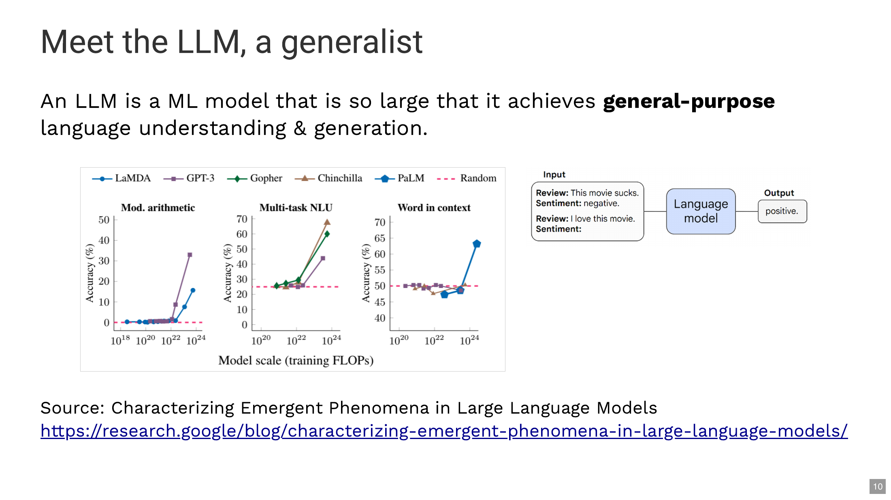  
[Watch from 05:39](https://youtu.be/Lha1741iEjE?t=339)

LLMs are trained on vast datasets with numerous training cycles, enabling emergent general-purpose language understanding and generation. This generalist capability means LLMs can perform many language tasks, including writing code and tests, without task-specific training. However, their breadth can come at the cost of depth and precision.

## LLMs can write Python tests for API endpoints

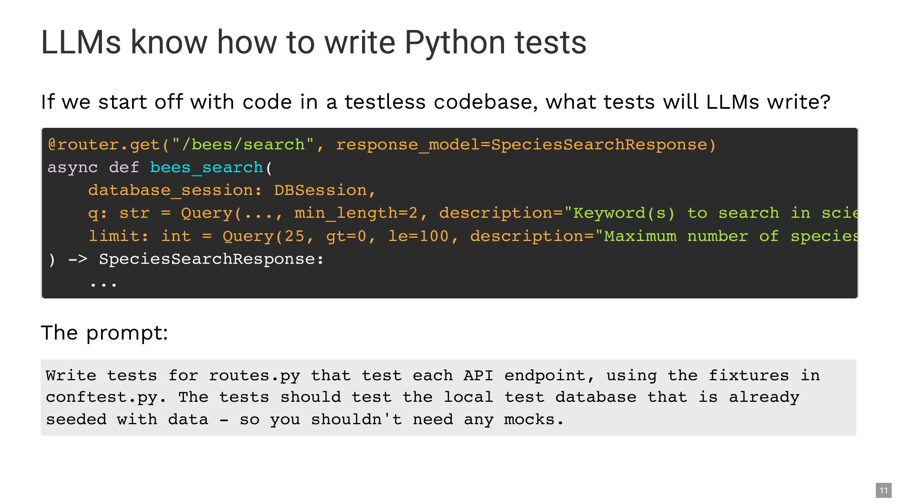  
[Watch from 06:41](https://youtu.be/Lha1741iEjE?t=401)

Given a codebase without tests, LLMs can generate test code for API routes using provided fixtures and seeded test databases. This leverages their understanding of Python and testing conventions. However, the quality and coverage of these tests depend on the model and prompt.

## Example: GPT-5 generated tests with partial coverage

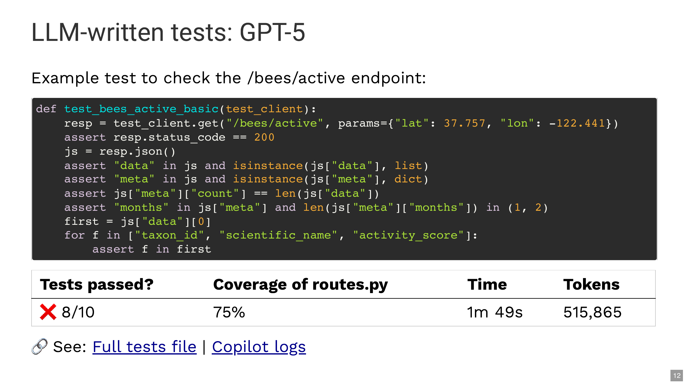  
[Watch from 07:39](https://youtu.be/Lha1741iEjE?t=459)

GPT-5 generated 10 tests for the example API, of which 8 passed, achieving 75% code coverage. Some tests failed due to issues like database state cleanup and uniqueness constraints, showing that AI-generated tests may be incomplete or fragile without refinement.

## Example: Claude Sonnet 4.5 generates more comprehensive tests

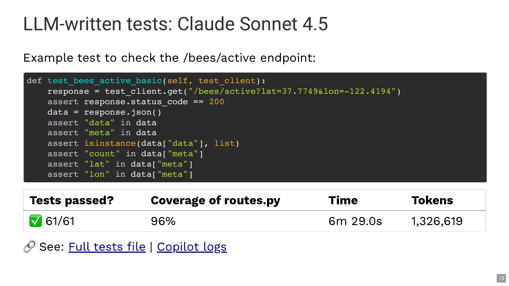  
[Watch from 08:09](https://youtu.be/Lha1741iEjE?t=489)

Claude Sonnet 4.5 generated 61 tests for the same API, all passing with 96% coverage. This demonstrates significant variation between LLMs in test generation capability, with some models producing much more extensive and effective tests, albeit at higher computational cost and time.

## Comparative results of different LLMs generating tests

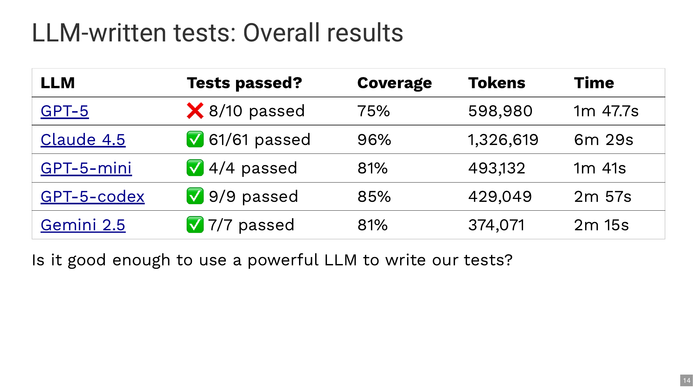  
[Watch from 09:06](https://youtu.be/Lha1741iEjE?t=546)

A summary shows test pass rates, coverage, token usage, and time taken across various LLMs. Coverage ranges from 75% to 96%, and test counts vary widely. This indicates that while LLMs can assist test writing, results depend heavily on model choice and prompting.

## Humans achieve 100% coverage by reviewing reports; can LLMs do the same?

  
[Watch from 10:02](https://youtu.be/Lha1741iEjE?t=602)

Humans use coverage reports to identify untested lines and add tests accordingly. Instructing LLMs to generate coverage reports and iteratively improve tests can increase coverage. This process involves analyzing annotated source files and focusing on lines marked as uncovered.

## LLMs can approach full coverage but may stall on edge cases

  
[Watch from 11:30](https://youtu.be/Lha1741iEjE?t=690)

Even with iterative prompting, LLMs like Sonnet 4.5 may reach 98% coverage but struggle with edge cases requiring unusual or corrupted data. These gaps highlight the limitations of AI test generation without human intervention or specialized test design.

## Remaining problems in AI-generated tests: redundancy, unrealistic fake data, and missing edge cases

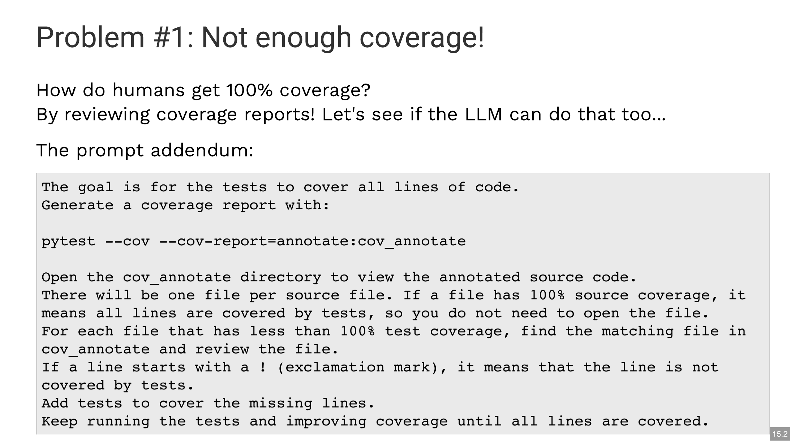  
[Watch from 12:10](https://youtu.be/Lha1741iEjE?t=730)

Despite high coverage, AI-generated tests often contain repeated code, overly simplistic fake data, and fail to test important edge conditions. These issues reduce test maintainability and real-world reliability.

## Bringing in specialist tools to improve tests

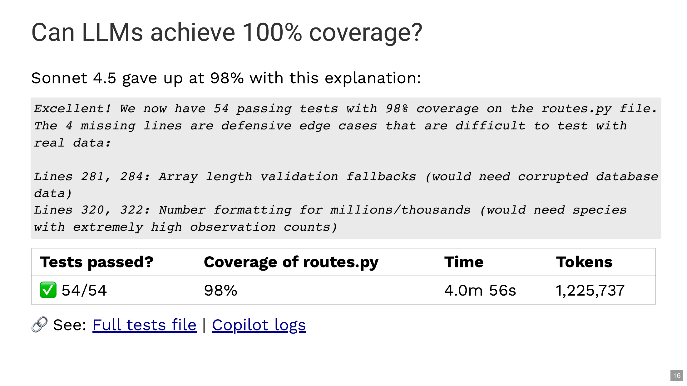  
[Watch from 12:30](https://youtu.be/Lha1741iEjE?t=750)

Analogous to specialist bees, specialized testing techniques and libraries can supplement LLM-generated tests to enhance quality, coverage, and realism.

## Reducing redundant test code with pytest parameterization

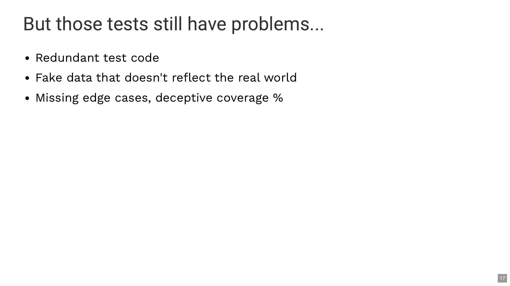  
[Watch from 12:50](https://youtu.be/Lha1741iEjE?t=770)

LLM-generated tests often duplicate similar test logic with minor variations. Pytest’s `@pytest.mark.parametrize` decorator enables combining such tests into one, improving readability and maintainability by running multiple scenarios through a single test function.

## Using pytest fixtures to share common test setups

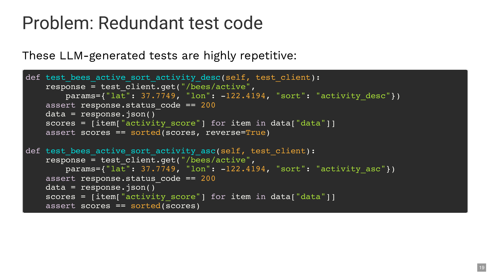  
[Watch from 13:27](https://youtu.be/Lha1741iEjE?t=807)

Pytest fixtures provide reusable test objects, such as database entries, that can be shared across tests. This avoids repeated setup code and ensures consistent test environments. Fixtures can also handle cleanup after tests run.

## Generating realistic fake data with Faker

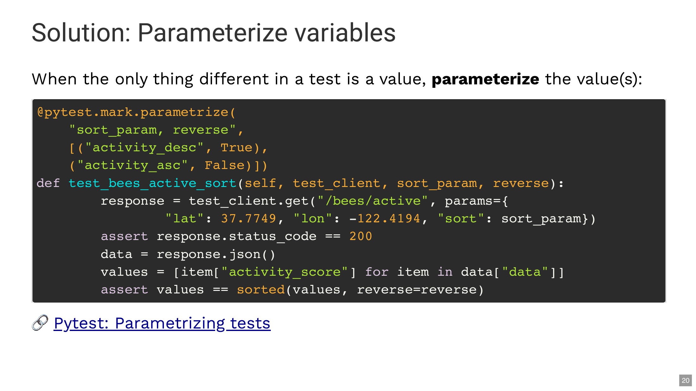  
[Watch from 14:10](https://youtu.be/Lha1741iEjE?t=850)

LLMs tend to produce generic or clichéd fake data, like “John Doe” or “Jane Smith,” lacking the complexity of real-world inputs. Realistic test data should reflect diverse naming conventions, accents, hyphens, and character sets to better simulate real usage.

## Faker library produces realistic test data

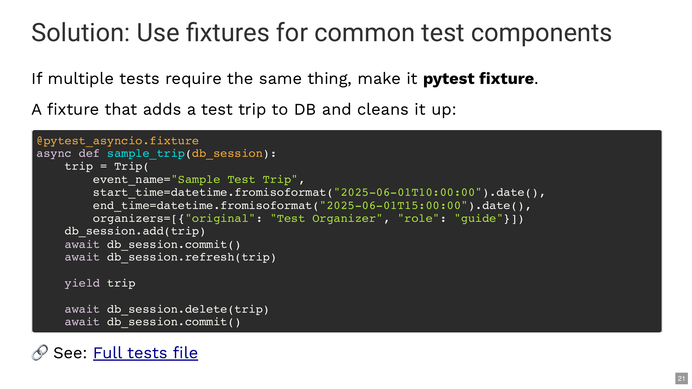  
[Watch from 14:30](https://youtu.be/Lha1741iEjE?t=870)

The Faker library generates plausible names, addresses, phone numbers, and other data types, supporting diverse locales and formats. Incorporating Faker into tests enhances their representativeness and robustness.

## AI-generated tests often only check for field existence, not full output

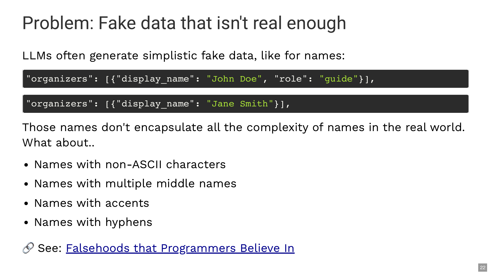  
[Watch from 16:24](https://youtu.be/Lha1741iEjE?t=984)

Many AI-generated tests verify only that expected fields exist in API responses, neglecting to validate the correctness or completeness of the data, which reduces test effectiveness.

## Snapshot testing captures full API responses for verification

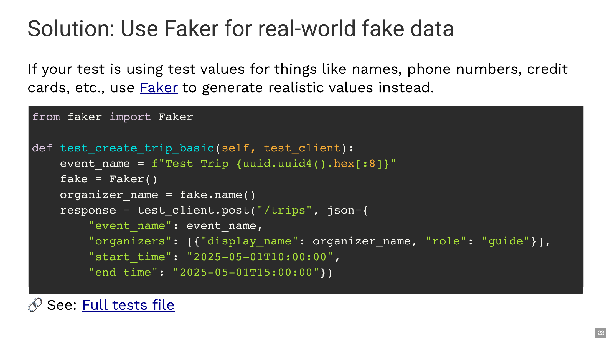  
[Watch from 17:06](https://youtu.be/Lha1741iEjE?t=1026)

Snapshot testing stores entire API responses and compares them on subsequent runs. Tools like pytest-snapshot automate this process, highlighting changes in outputs and helping catch unintended regressions in API behavior.

## Even 100% code coverage is insufficient without edge case testing

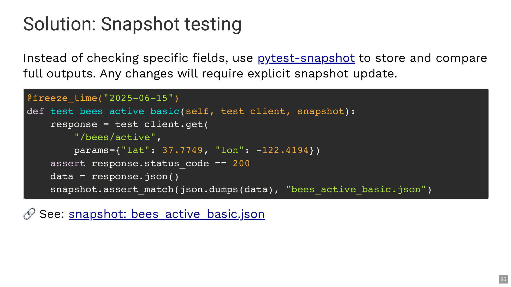  
[Watch from 17:50](https://youtu.be/Lha1741iEjE?t=1070)

Coverage metrics only confirm that lines execute, not that all input variations and edge cases are tested. Inputs outside expected ranges, such as negative values or out-of-bounds coordinates, can cause unhandled exceptions and runtime errors undetected by coverage alone.

## Property-based testing explores wide input spaces automatically

  
[Watch from 18:47](https://youtu.be/Lha1741iEjE?t=1127)

Property-based testing frameworks like Hypothesis generate diverse test inputs programmatically, including edge cases and unusual values. This approach tests program invariants across a broad input domain, increasing confidence in robustness.

## Hypothesis testing of API endpoints with generated inputs

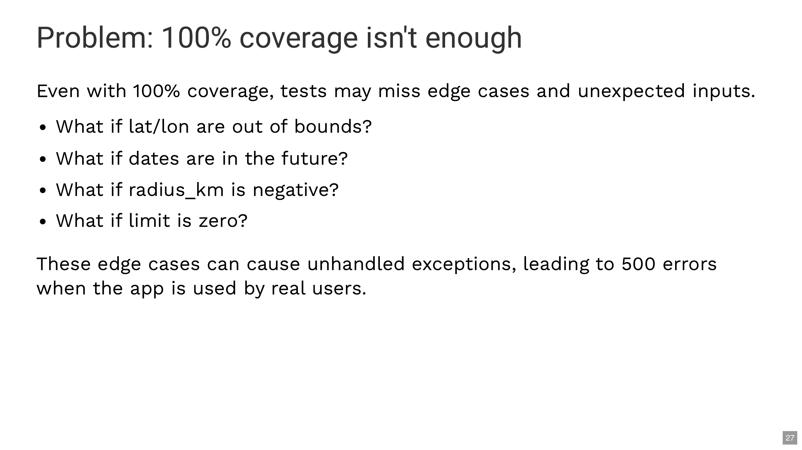  
[Watch from 19:00](https://youtu.be/Lha1741iEjE?t=1140)

Hypothesis tests declaratively specify input types and constraints; the framework then generates many input combinations. For example, it tests API endpoints with a range of floats or integers, validating response correctness or error handling.

## Hypothesis discovers bugs caused by invalid inputs

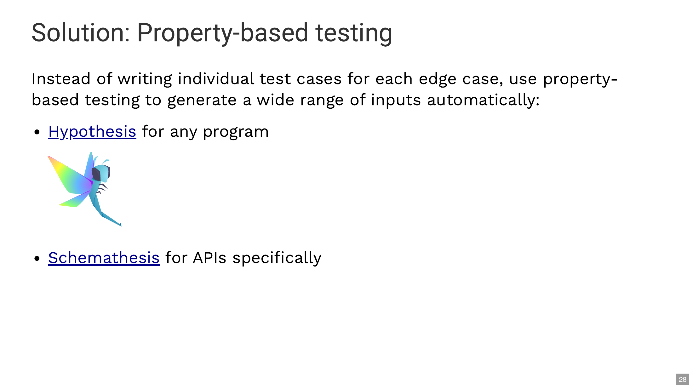  
[Watch from 20:03](https://youtu.be/Lha1741iEjE?t=1203)

Hypothesis found a failure where an API endpoint received an integer exceeding the database’s integer range, causing a server error. This highlights property-based testing’s ability to uncover unexpected edge cases that static tests may miss.

## Schemathesis generates API tests from OpenAPI specifications

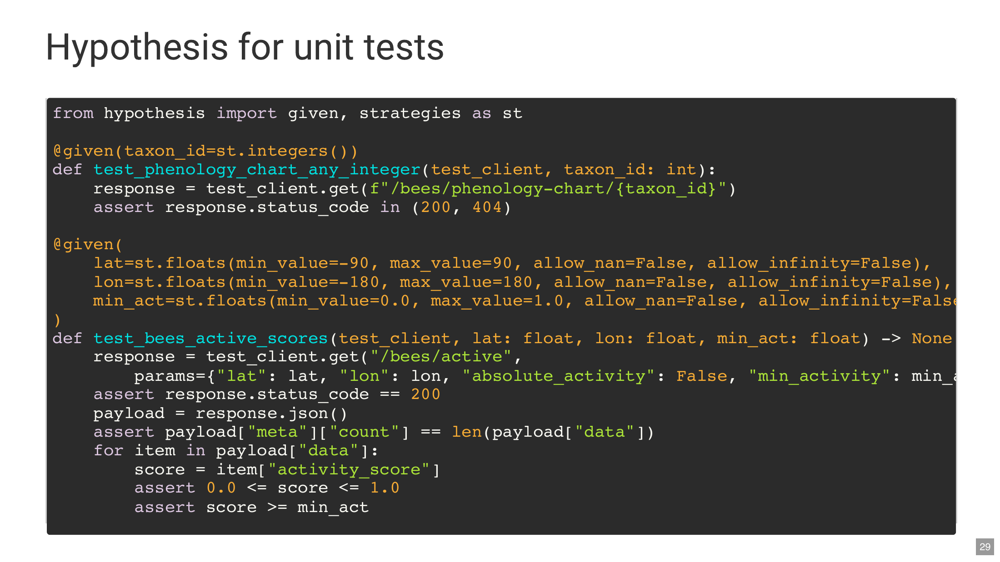  
[Watch from 21:00](https://youtu.be/Lha1741iEjE?t=1260)

Schemathesis integrates with pytest and reads OpenAPI (Swagger) specs to automatically generate test cases for all endpoints, including boundary and invalid inputs. This automates comprehensive API testing based on formal interface definitions.

## Schemathesis reproduces Hypothesis-discovered database error

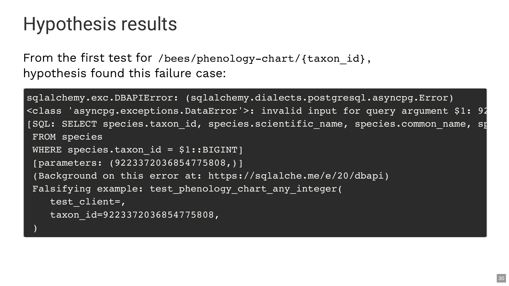  
[Watch from 22:14](https://youtu.be/Lha1741iEjE?t=1334)

Schemathesis also found the invalid integer input error, providing a reproducible curl command to debug. This demonstrates its practical utility in generating real-world API test cases that reveal defects.

## Decision on using LLMs to write tests rests with the developer

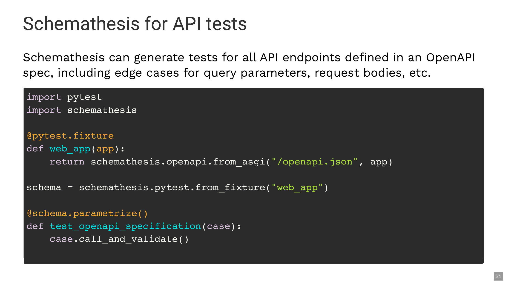  
[Watch from 23:24](https://youtu.be/Lha1741iEjE?t=1404)

Using AI to write tests is a choice. Everyone should be welcome in the Python community regardless of AI usage. If using LLMs, seeding them with best practices and specialized Python testing tools improves results and reliability.

## Example prompt to guide LLM test generation with best practices

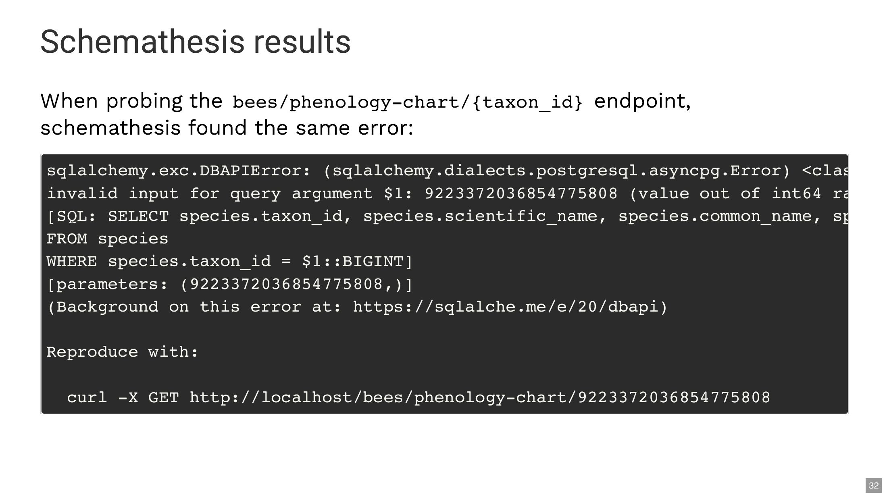  
[Watch from 23:50](https://youtu.be/Lha1741iEjE?t=1430)

A detailed prompt instructs the LLM to write tests using parameterized pytest tests, fixtures, the Faker library for realistic data, snapshot testing for API responses, and iterative coverage improvements. Customizing prompts with your preferred tools and standards yields better AI-generated tests.

## Returning to bees: importance of specialist pollinators in gardens

  
[Watch from 24:04](https://youtu.be/Lha1741iEjE?t=1444)

While honeybees are valuable generalist pollinators, encouraging native specialist bees by planting native flowers improves garden health and pollination effectiveness. This reinforces the talk’s analogy that specialist tools and approaches are critical alongside generalist AI.

## Q&A

### Does test-driven development affect AI-generated test coverage?  
[Watch from 25:16](https://youtu.be/Lha1741iEjE?t=1516)  

Test-driven development (TDD) works best when the product definition is clear and stable, allowing tests to guide implementation. In early exploratory or prototyping phases, maintaining TDD can be cumbersome. Using LLMs to prototype code and then write tests afterward (a kind of "PRD driven development") may be more practical, depending on how concrete the requirements are.

### Can LLMs produce better unit tests if provided with failing tests upfront?  
[Watch from 26:59](https://youtu.be/Lha1741iEjE?t=1619)  

LLMs benefit from rich context and guidance. Providing them with failing tests or precise specifications can improve the quality of generated tests. However, leveraging specialized tools like Hypothesis remains important to cover edge cases beyond simple unit scenarios.

### What is the future of writing and managing tests, especially for user interfaces?  
[Watch from 27:45](https://youtu.be/Lha1741iEjE?t=1665)  

The trend is moving away from unit tests toward more end-to-end and integration tests that validate full user experiences. Tools like Playwright automate user interaction testing, which better reflects real-world usage. As coding practices evolve, especially with AI assistance, focusing on user-facing behavior through comprehensive tests will become increasingly important.

---

This talk highlights that while LLMs can generate useful tests, they are generalists and must be augmented with specialist testing tools and human insight to ensure thorough, maintainable, and realistic testing. Combining AI capabilities with libraries like pytest, Faker, Hypothesis, and Schemathesis enables more robust testing workflows that handle edge cases and complex input scenarios effectively.

For more information, the speaker’s example app and slides are available at:  
- Slides: [https://pamelafox.github.io/my-py-talks/ai-assisted-testing-pybay](https://pamelafox.github.io/my-py-talks/ai-assisted-testing-pybay)  
- Example app: [https://github.com/pamelafox/pybay-app-demo](https://github.com/pamelafox/pybay-app-demo)