## Slide 1


```
Python + Agents
Feb 24: Building your first agent in Python
Feb 25: Adding context and memory to agents
Feb 26: Monitoring and evaluating agents
Mar 3: Building your first AI-driven workflows
Mar 4: Orchestrating advanced multi-agent workflows
Mar 5: Adding a human-in-the-loop to workflows

Register at aka.ms/PythonAgents/series
```

## Slide 2

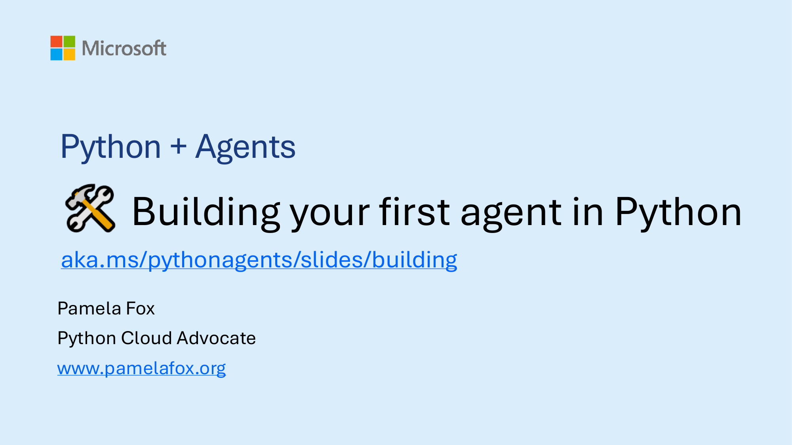

```
Python + Agents
       Building your first agent in Python
aka.ms/pythonagents/slides/building
Pamela Fox
Python Cloud Advocate
www.pamelafox.org
```

## Slide 3


```
Today we'll cover...
• What's an agent?
• How tool-calling works
• Building agents with agent-framework
• Integrating agents with MCP servers tools
• Agent middleware
• Supervisor agent architecture
```

## Slide 4


```
Want to follow along?
1. Open this GitHub repository:
aka.ms/python-agentframework-demos

2. Use "Code" button to create a GitHub Codespace:


3. Wait a few minutes for Codespace to start up
```

## Slide 5


```
Agents 101
```

## Slide 6


```
What is an agent?
          Agent
                          An AI agent uses an LLM to run
   Input                  tools in a loop to achieve a goal.


                          Agents are often augmented by:
                              Context
   LLM
                              Memory
                  Tools
                              Planning
                              Humans

   Goal
                          https://simonwillison.net/2025/Sep/18/agents/
```

## Slide 7


```
Python AI agent frameworks
Framework          Description
We'll be experimenting with these frameworks today:
agent-framework    A framework from Microsoft with support for agentic
                   patterns and full integration with Azure offerings.
                   (Successor to autogen and semantic-kernel)
langchain v1       An agent-centric framework built on top of Langgraph,
                   with optional Langsmith monitoring
pydantic-ai        A flexible framework designed for type safety and
                   observability (Logfire/OTel), from the creators of Pydantic
openai-agents      A framework from OpenAI that is optimized for use with
                   OpenAI models (especially Responses API/reasoning).
```

## Slide 8


```
Calling tools
without a framework
```

## Slide 9


```
What is "tool calling"?
* Also known as "function calling"
• Tool calling permits an LLM to not just
  generate text, but also generate                   What's the weather in Paris?
  function calls based off function
  definitions
• The LLM responds with the function
  name and the arguments necessary
  to satisfy the request                                   get_weather("Paris")
• This makes it easy to connect LLMs        LLM
  with APIs, databases, and arbitrary
  Python logic.

https://platform.openai.com/docs/guides/function-calling
```

## Slide 10


```
Tool calling flow
1. The code tells LLM what tools they can call
2. The LLM responds with suggested tool
name and arguments
3. The code calls function for that tool
4. The code sends prior messages and return
value from tool function to LLM
5. The LLM responds based off full history


https://platform.openai.com/docs/guides/function-calling
```

## Slide 11


```
Step 1) Tell the LLM what functions it can call
tools = [{                                   response = client.chat.completions.create(
  "type": "function",
  "function": {
                                               model="gpt-5",
    "name": "lookup_weather",                  messages=[
    "description": "Lookup the weather for      {"role": "system",
a given city name or zip code.",
                                                 "content": "You're a weather chatbot."},
    "parameters": {
      "type": "object",                         {"role": "user",
      "properties": {                            "content": "is it sunny in LA, CA?"},
        "city_name": {                         ],
           "type": "string",
           "description": "The city name",     tools=tools,
        },                                   )
        "zip_code": {"type": "string",
           "description": "The zip code"
}}}}}]

Full example: openai_tool_calling.py
```

## Slide 12


```
Step 2) Get function name and args from response
if response.choices[0].message.tool_calls:
  tool_call = response.choices[0].message.tool_calls[0]
  function_name = tool_call.function.name
  function_arguments = json.loads(tool_call.function.arguments)
  print(function_name)
  print(function_arguments)
else:
  print(response.choices[0].message.content)

lookup_weather
{"city_name":"Los Angeles"}
```

## Slide 13


```
Step 3) Call a local function based on response
def lookup_weather(city_name=None, zip_code=None):
  print(f"Looking up weather for {city_name or zip_code}...")
  return {"city_name": city_name, "zip_code": zip_code,
          "weather": "sunny", "temperature": 75}

# ..Make call to the LLM here...

if response.choices[0].message.tool_calls:
  tool_call = response.choices[0].message.tool_calls[0]
  function_name = tool_call.function.name
  function_arguments = json.loads(tool_call.function.arguments)
  if function_name == "lookup_weather":
    lookup_weather(**function_arguments)

Looking up weather for Los Angeles...
```

## Slide 14


```
Step 4) Send tool results to LLM for final answer
if response.choices[0].message.tool_calls:
  tool_call = response.choices[0].message.tool_calls[0]
  function_name = tool_call.function.name
  function_arguments = json.loads(tool_call.function.arguments)

  if function_name == "lookup_weather":
    messages.append(response.choices[0].message)
    result = lookup_weather(**function_arguments)
    messages.append({
      "role": "tool", "tool_call_id": tool_call.id, "content": json.dumps(result)})
    response = client.chat.completions.create(
      model="gpt-5", messages=messages, tools=tools)
    print(response.choices[0].message.content)

Yes — it's currently sunny in Los Angeles, CA with a temperature around 75°F.
```

## Slide 15


```
Building agents
with agent-framework
https://learn.microsoft.com/agent-framework/
```

## Slide 16


```
agent-framework

Install agent-framework
We recommend installing the subpackages for agent-framework instead of the
entire agent-framework package, to reduce indirect dependencies.

Today's examples require:
 agent-framework-core
 agent-framework-devui


Our repo installs from a very recent git commit, since MAF had recent big changes:
agent-framework-core @ git+https://github.com/microsoft/agent-
framework.git@11628c3166a1845683c5aef1e0d389eb862bcbaa#subdirectory=python/packages/core


Full requirements: pyproject.toml
```

## Slide 17


```
Agent architecture:

Single agent with tool
The agent can use a tool to help answer a user's question.

  Request                                "how's weather in SF?"


                                                        "San Francisco"

    LLM                    Tool               LLM                              get_weather
                                                        {"temperature": 60,
                                                       "condition": "sunny"}


 Response                               "It's 60 degrees outside and
                                            the sun is shining!  "
```

## Slide 18


```
agent-framework

Single agent with tool
Define tools using Python functions, with typed args, return type, and docstring:
@tool
def get_weather(
  city: Annotated[str, Field(description="City name, spelled out fully")],
  ) -> dict:
  """Returns weather data, a dict with temperature and description."""
  return {"temperature": 72, "description": "Sunny"}

agent = Agent(client=client,
  instructions="You're an info agent. Answer questions cheerfully.",
  tools=[get_weather])
response = await agent.run("Whats weather today in San Francisco?")
print(response.text)

Full example: agent_tool.py
```

## Slide 19


```
Agent architecture:

Single agent with multiple tools
The agent must decide which tool to use and what order to call tools in.

                                                  Weekend planner agent
              LLM                                          LLM


  Tool A       Tool B   Tool C      get_weather         get_activities    get_current_date
```

## Slide 20


```
agent-framework

Single agent with tools
@tool
def get_current_date() -> str:
  return datetime.now().strftime("%Y-%m-%d")

@tool
def get_weather(
  city: Annotated[str, Field(description="The city to get weather for")]) -> dict:
  ...

@tool
def get_activities(
  city: Annotated[str, Field(description="The city to get activities for")],
  date: Annotated[str, Field(description="Date, in format YYYY-MM-DD.")]) -> list:
  ...

agent = Agent(client=client, instructions="You help users plan their weekends.",
  tools=[get_weather, get_activities, get_current_date])

Full example: agent_tools.py
```

## Slide 21


```
agent-framework

Local experimentation with DevUI
DevUI makes it easy to chat with your agents and trace tool calls:
from agent_framework.devui import serve
serve(entities=[agent], auto_open=True)
```

## Slide 22


```
Integrating agents
with MCP server tools
```

## Slide 23


```
Model Context Protocol
An open protocol created by Anthropic that standardizes the interaction
between LLMs and external tools, data sources, and applications.


https://modelcontextprotocol.io/
```

## Slide 24


```
MCP client + server architecture
         MCP Host
    VS Code, Claude Code,
       Your agent!                              MCP Server A

                            MCP        Tools      Prompts      Resources
        MCP Client A


                                                MCP Server B
                            MCP
       MCP Client B                    Tools       Prompts     Resources


https://modelcontextprotocol.io/docs/learn/architecture
```

## Slide 25


```
Agent architecture:

Single agent with MCP servers
First the agent queries each MCP server to discover their tools.
                           tools?
                                                           MCP Server A
                        Tool X, Tool Y

                           tools?
                                                           MCP Server B
                           Tool Z

Then the agent decides which of the MCP tools to call.
                                                       Tool X


            LLM                                        Tool Y


                                                       Tool Z
```

## Slide 26


```
agent-framework

Agent with local MCP server
First run the server:
uv run examples/mcp_server.py

Then run the agent:
async with (
  MCPStreamableHTTPTool(name="Local MCP Server",
     url="http://localhost:8000/mcp") as mcp_server,
  Agent(client=client,
    instructions=f"You help users with tasks using the available tools.
                   Today's date is {datetime.now().strftime('%Y-%m-%d')}.",
    tools=[mcp_server]) as agent,
  ):
    response = await agent.run("I bought laptop today for $1200 on my visa.")

Full example: agent_mcp_local.py
```

## Slide 27


```
agent-framework

Agent with remote MCP server
async with (
  MCPStreamableHTTPTool(
    name="Microsoft Learn MCP",
    url="https://learn.microsoft.com/api/mcp") as mcp_server,
  Agent(
    client=client,
    instructions="You help with Microsoft documentation questions. Use the
available tools to search for relevant docs.",
    tools=[mcp_server]) as agent,
  ):
    response = await agent.run(
       "How do I create an Azure Blob storage account using the az cli?")

Full example: agent_mcp_remote.py
```

## Slide 28

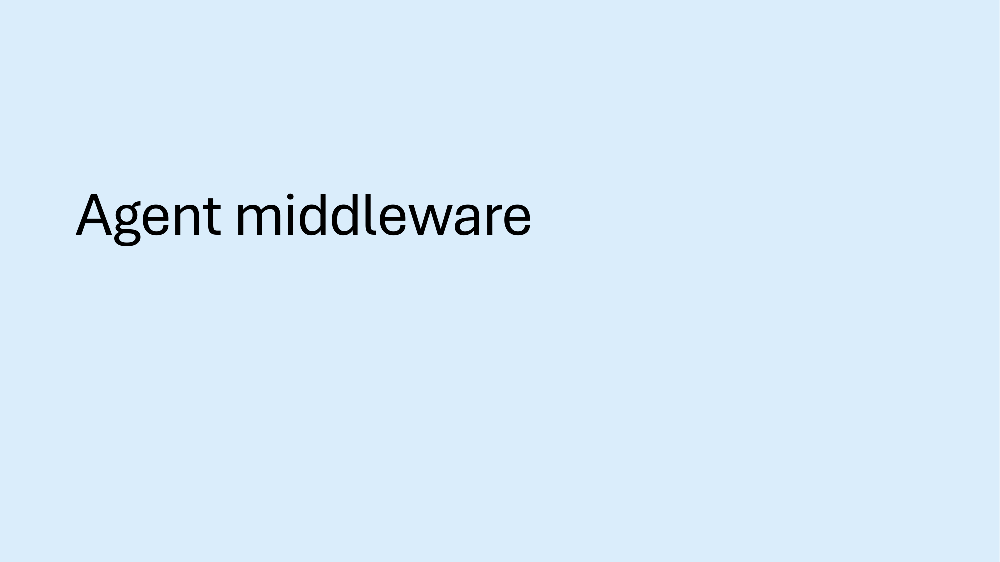

```
Agent middleware
```

## Slide 29


```
Agent architecture:

Agent middleware
Middleware can be called at different stages in the process of running an agent:


                                                                                         Function                      Tool
                                                                                        Middleware
                                Agent                   Chat
Input        Agent           Middleware             Middleware                 LLM
                                                                                      Response

Each middleware        AgentContext:               ChatContext:
                       • messages                  • messages
receives a context:    • is_streaming              • is_streaming                    FunctionInvocationContext:
                       • metadata                  • metadata                        • metadata
                       • agent                     • chat_client                     • function
                       • result: mutate this to    • chat_options                    • arguments
                         change agent              • result: mutate this to          • result: mutate this to change
                         response                    change chat response              the return value
                       • terminate: set this       • terminate: set this             • terminate: set this flag to
                         flag to stop processing     flag to stop processing           stop processing
```

## Slide 30

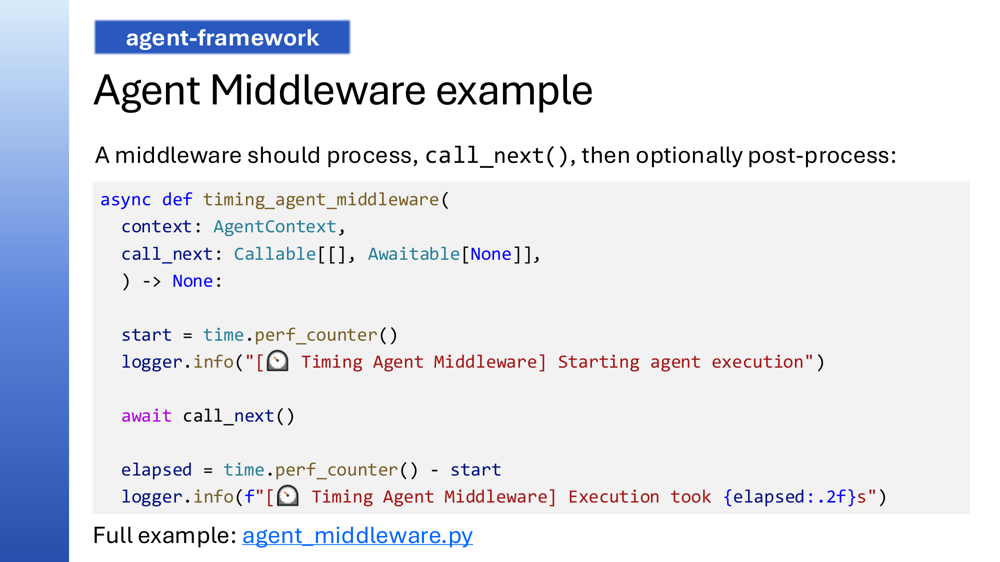

```
agent-framework

Agent Middleware example
A middleware should process, call_next(), then optionally post-process:
async def timing_agent_middleware(
  context: AgentContext,
  call_next: Callable[[], Awaitable[None]],
  ) -> None:

  start = time.perf_counter()
  logger.info("[   Timing Agent Middleware] Starting agent execution")

  await call_next()

  elapsed = time.perf_counter() - start
  logger.info(f"[    Timing Agent Middleware] Execution took {elapsed:.2f}s")

Full example: agent_middleware.py
```

## Slide 31

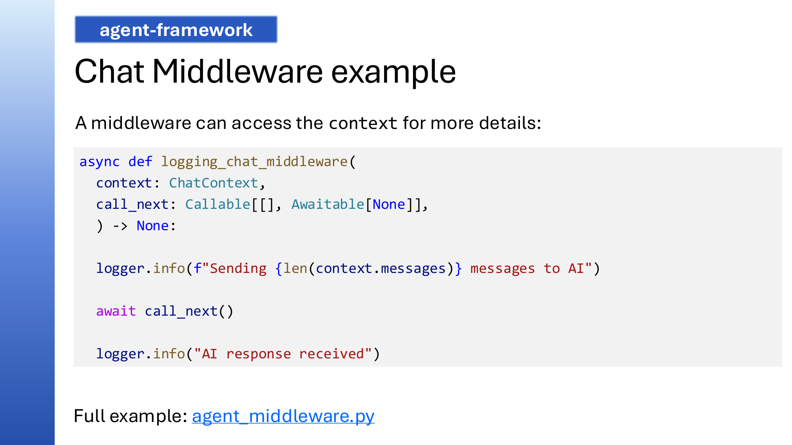

```
agent-framework

Chat Middleware example
A middleware can access the context for more details:
async def logging_chat_middleware(
  context: ChatContext,
  call_next: Callable[[], Awaitable[None]],
  ) -> None:

  logger.info(f"Sending {len(context.messages)} messages to AI")

  await call_next()

  logger.info("AI response received")


Full example: agent_middleware.py
```

## Slide 32

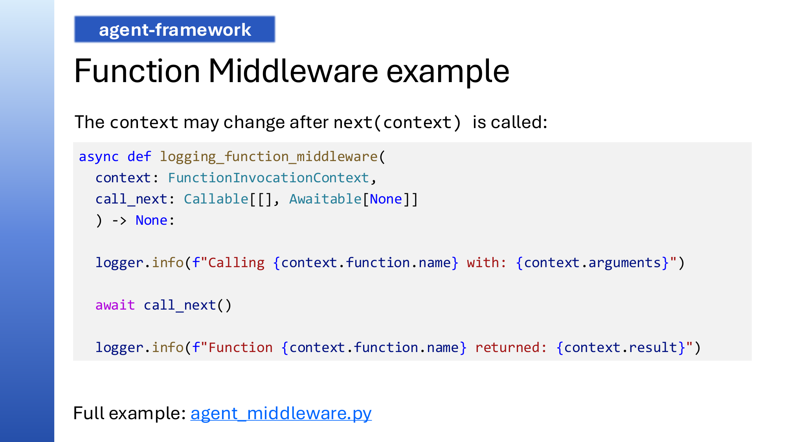

```
agent-framework

Function Middleware example
The context may change after next(context) is called:
async def logging_function_middleware(
  context: FunctionInvocationContext,
  call_next: Callable[[], Awaitable[None]]
  ) -> None:

  logger.info(f"Calling {context.function.name} with: {context.arguments}")

  await call_next()

  logger.info(f"Function {context.function.name} returned: {context.result}")


Full example: agent_middleware.py
```

## Slide 33

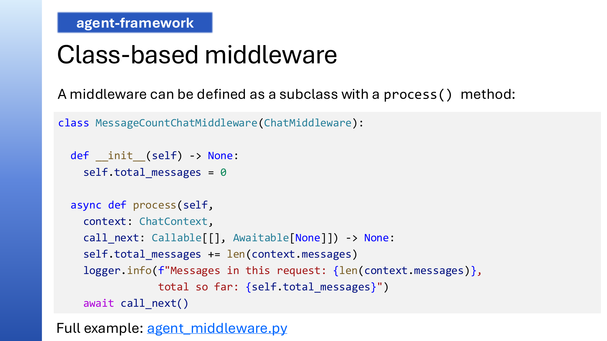

```
agent-framework

Class-based middleware
A middleware can be defined as a subclass with a process() method:
class MessageCountChatMiddleware(ChatMiddleware):

  def __init__(self) -> None:
    self.total_messages = 0

  async def process(self,
    context: ChatContext,
    call_next: Callable[[], Awaitable[None]]) -> None:
    self.total_messages += len(context.messages)
    logger.info(f"Messages in this request: {len(context.messages)},
                total so far: {self.total_messages}")
    await call_next()

Full example: agent_middleware.py
```

## Slide 34

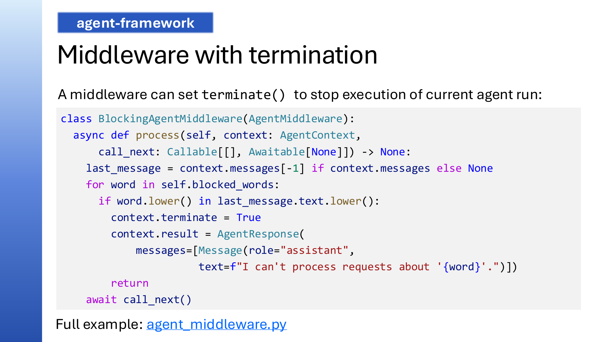

```
agent-framework

Middleware with termination
A middleware can set terminate() to stop execution of current agent run:
class BlockingAgentMiddleware(AgentMiddleware):
  async def process(self, context: AgentContext,
      call_next: Callable[[], Awaitable[None]]) -> None:
    last_message = context.messages[-1] if context.messages else None
    for word in self.blocked_words:
      if word.lower() in last_message.text.lower():
        context.terminate = True
        context.result = AgentResponse(
            messages=[Message(role="assistant",
                      text=f"I can't process requests about '{word}'.")])
        return
    await call_next()

Full example: agent_middleware.py
```

## Slide 35


```
agent-framework

Registering middleware per agent
Register middleware functions and class instances on the ChatAgent:
blocking_middleware = BlockingAgentMiddleware(blocked_words=["nuclear"])
timing_function_middleware = TimingFunctionMiddleware()
message_count_middleware = MessageCountChatMiddleware()

agent = Agent(
  client=client,
  instructions="Help users plan weekends.",
  tools=[get_weather, get_current_date],
  middleware=[
    timing_agent_middleware, blocking_middleware,
    logging_function_middleware, timing_function_middleware,
    logging_chat_middleware, message_count_middleware])

Full example: agent_middleware.py
```

## Slide 36


```
agent-framework

Registering middleware per run
You can also register middleware for a particular run of an agent:
async def extra_agent_middleware(
    context: AgentContext,
    call_next: Callable[[], Awaitable[None]]) -> None:

  logger.info("This middleware only applies to this run")
  await call_next()
  logger.info("Run completed")

response = await agent.run("What's the weather like in Portland?",
  middleware=[extra_agent_middleware])


Full example: agent_middleware.py
```

## Slide 37

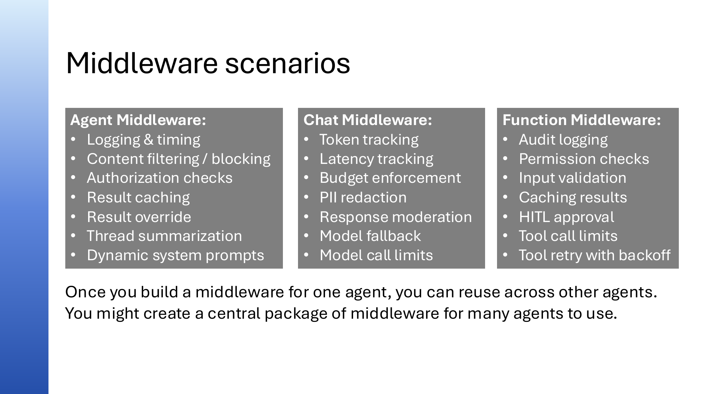

```
Middleware scenarios
Agent Middleware:                Chat Middleware:        Function Middleware:
• Logging & timing               • Token tracking        • Audit logging
• Content filtering / blocking   • Latency tracking      • Permission checks
• Authorization checks           • Budget enforcement    • Input validation
• Result caching                 • PII redaction         • Caching results
• Result override                • Response moderation   • HITL approval
• Thread summarization           • Model fallback        • Tool call limits
• Dynamic system prompts         • Model call limits     • Tool retry with backoff

Once you build a middleware for one agent, you can reuse across other agents.
You might create a central package of middleware for many agents to use.
```

## Slide 38

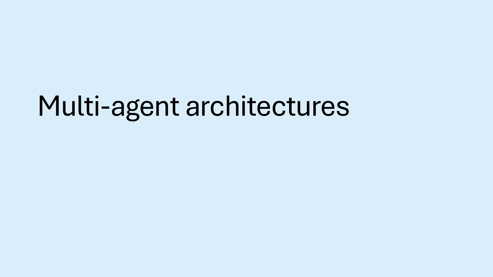

```
Multi-agent architectures
```

## Slide 39

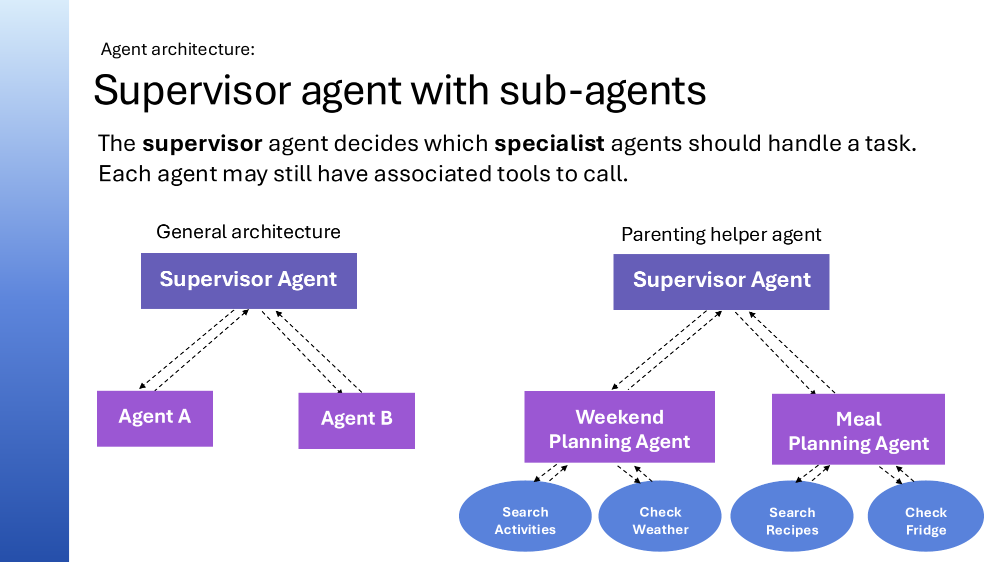

```
Agent architecture:

Supervisor agent with sub-agents
The supervisor agent decides which specialist agents should handle a task.
Each agent may still have associated tools to call.

      General architecture                        Parenting helper agent

       Supervisor Agent                            Supervisor Agent


  Agent A              Agent B                Weekend                   Meal
                                           Planning Agent           Planning Agent


                                    Search          Check        Search        Check
                                   Activities      Weather       Recipes       Fridge
```

## Slide 40


```
agent-framework

Supervisor agent with sub-agents
weekend_agent = Agent(client=client,
  instructions="You help users plan weekend activities based on weather",
  tools=[get_weather, get_activities, get_current_date])
meal_agent = Agent(client=client,
  instructions="You help users plan meals + choose the best recipes",
  tools=[find_recipes, check_fridge])

@tool
async def plan_weekend(query: str) -> str:
  response = await weekend_agent.run(query)
  return response.text
@tool
async def plan_meal(query: str) -> str:
  response = await meal_agent.run(query)
  return response.text

supervisor_agent = Agent(client=client,
  instructions="You're a supervisor managing a weekend planner & meal planner",
  tools=[plan_meal, plan_weekend])

Full example: agent_supervisor.py
```

## Slide 41

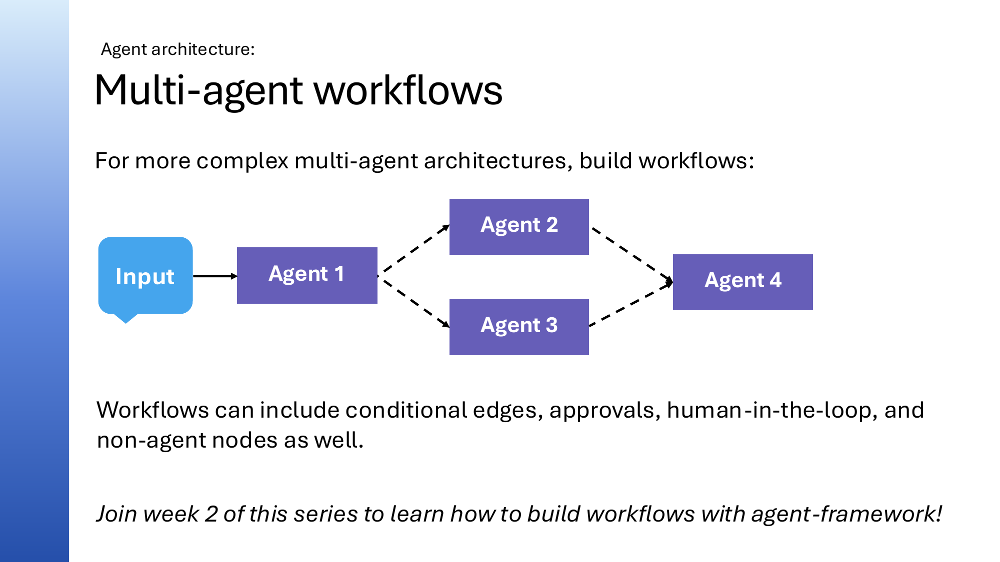

```
Agent architecture:

Multi-agent workflows
For more complex multi-agent architectures, build workflows:

                                    Agent 2

 Input                Agent 1                            Agent 4
                                    Agent 3


Workflows can include conditional edges, approvals, human-in-the-loop, and
non-agent nodes as well.

Join week 2 of this series to learn how to build workflows with agent-framework!
```

## Slide 42

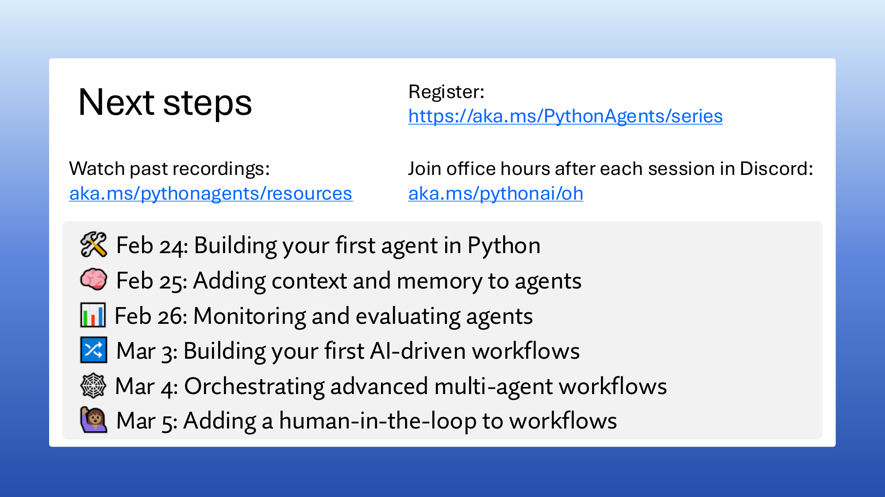

```
Next steps                      Register:
                                https://aka.ms/PythonAgents/series

Watch past recordings:          Join office hours after each session in Discord:
aka.ms/pythonagents/resources   aka.ms/pythonai/oh

    Feb 24: Building your first agent in Python
    Feb 25: Adding context and memory to agents
    Feb 26: Monitoring and evaluating agents
    Mar 3: Building your first AI-driven workflows
    Mar 4: Orchestrating advanced multi-agent workflows
    Mar 5: Adding a human-in-the-loop to workflows
```

## Slide 43

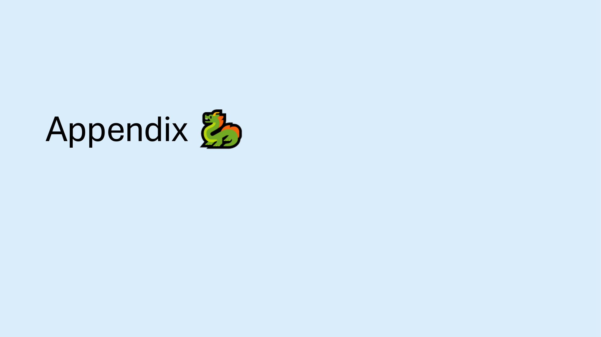

```
Appendix
```

## Slide 44

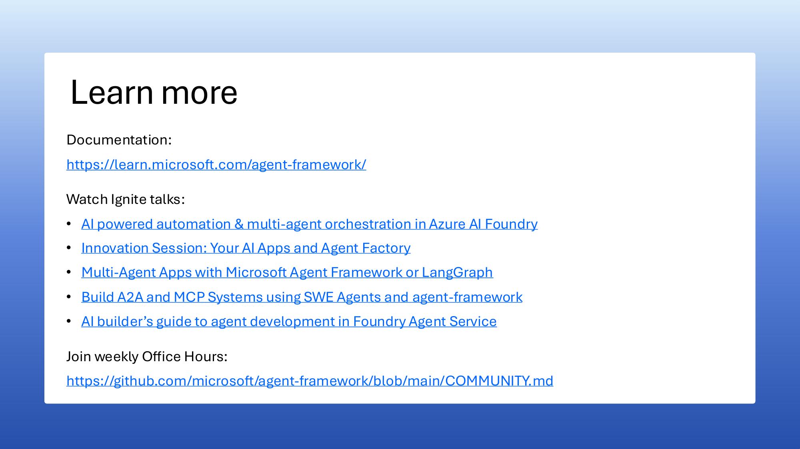

```
Learn more
Documentation:
https://learn.microsoft.com/agent-framework/

Watch Ignite talks:
• AI powered automation & multi-agent orchestration in Azure AI Foundry
• Innovation Session: Your AI Apps and Agent Factory
• Multi-Agent Apps with Microsoft Agent Framework or LangGraph
• Build A2A and MCP Systems using SWE Agents and agent-framework
• AI builder’s guide to agent development in Foundry Agent Service

Join weekly Office Hours:
https://github.com/microsoft/agent-framework/blob/main/COMMUNITY.md
```

## Slide 45

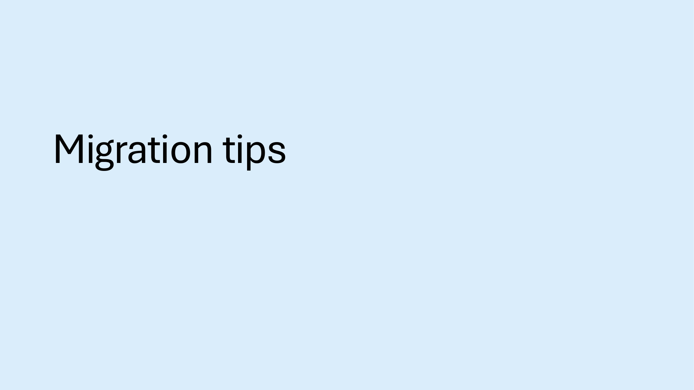

```
Migration tips
```

## Slide 46

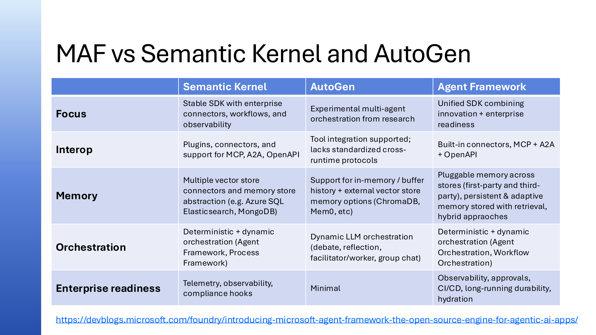

```
MAF vs Semantic Kernel and AutoGen
                             Semantic Kernel                 AutoGen                           Agent Framework
                             Stable SDK with enterprise                                        Unified SDK combining
                                                             Experimental multi-agent
Focus                        connectors, workflows, and
                                                             orchestration from research
                                                                                               innovation + enterprise
                             observability                                                     readiness
                                                             Tool integration supported;
                             Plugins, connectors, and                                          Built-in connectors, MCP + A2A
Interop                      support for MCP, A2A, OpenAPI
                                                             lacks standardized cross-
                                                                                               + OpenAPI
                                                             runtime protocols
                                                                                               Pluggable memory across
                             Multiple vector store           Support for in-memory / buffer
                                                                                               stores (first-party and third-
                             connectors and memory store     history + external vector store
Memory                       abstraction (e.g. Azure SQL     memory options (ChromaDB,
                                                                                               party), persistent & adaptive
                                                                                               memory stored with retrieval,
                             Elasticsearch, MongoDB)         Mem0, etc)
                                                                                               hybrid appraoches
                             Deterministic + dynamic                                           Deterministic + dynamic
                                                             Dynamic LLM orchestration
                             orchestration (Agent                                              orchestration (Agent
Orchestration                Framework, Process
                                                             (debate, reflection,
                                                                                               Orchestration, Workflow
                                                             facilitator/worker, group chat)
                             Framework)                                                        Orchestration)
                                                                                               Observability, approvals,
                             Telemetry, observability,
Enterprise readiness         compliance hooks
                                                             Minimal                           CI/CD, long-running durability,
                                                                                               hydration

https://devblogs.microsoft.com/foundry/introducing-microsoft-agent-framework-the-open-source-engine-for-agentic-ai-apps/
```

## Slide 47

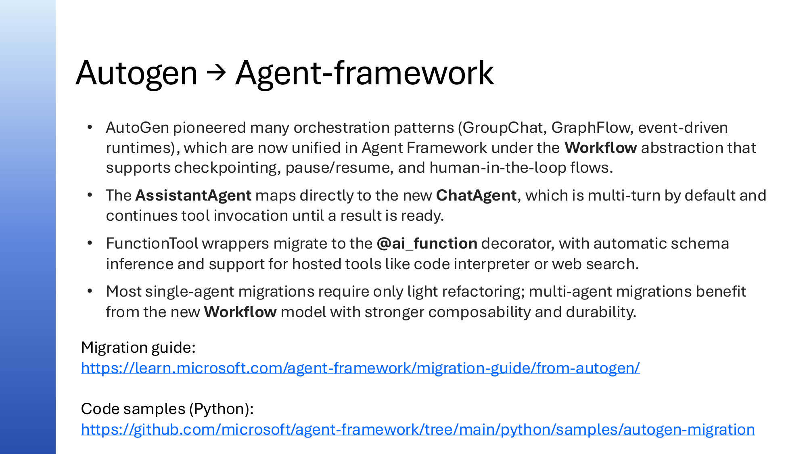

```
Autogen → Agent-framework
• AutoGen pioneered many orchestration patterns (GroupChat, GraphFlow, event-driven
  runtimes), which are now unified in Agent Framework under the Workflow abstraction that
  supports checkpointing, pause/resume, and human-in-the-loop flows.
• The AssistantAgent maps directly to the new ChatAgent, which is multi-turn by default and
  continues tool invocation until a result is ready.
• FunctionTool wrappers migrate to the @ai_function decorator, with automatic schema
  inference and support for hosted tools like code interpreter or web search.
• Most single-agent migrations require only light refactoring; multi-agent migrations benefit
  from the new Workflow model with stronger composability and durability.

Migration guide:
https://learn.microsoft.com/agent-framework/migration-guide/from-autogen/

Code samples (Python):
https://github.com/microsoft/agent-framework/tree/main/python/samples/autogen-migration
```

## Slide 48

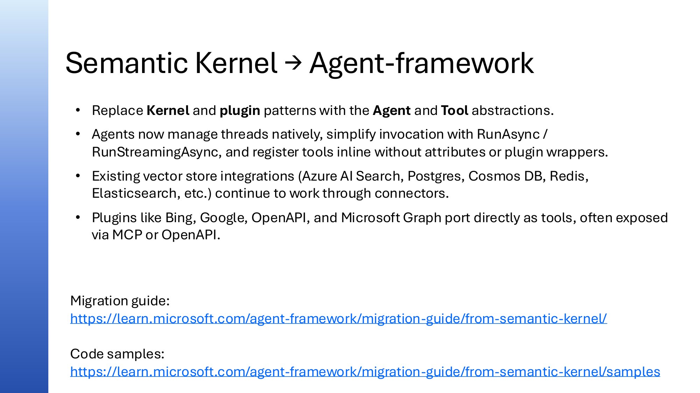

```
Semantic Kernel → Agent-framework
• Replace Kernel and plugin patterns with the Agent and Tool abstractions.
• Agents now manage threads natively, simplify invocation with RunAsync /
  RunStreamingAsync, and register tools inline without attributes or plugin wrappers.
• Existing vector store integrations (Azure AI Search, Postgres, Cosmos DB, Redis,
  Elasticsearch, etc.) continue to work through connectors.
• Plugins like Bing, Google, OpenAPI, and Microsoft Graph port directly as tools, often exposed
  via MCP or OpenAPI.


Migration guide:
https://learn.microsoft.com/agent-framework/migration-guide/from-semantic-kernel/

Code samples:
https://learn.microsoft.com/agent-framework/migration-guide/from-semantic-kernel/samples
```

## Slide 49

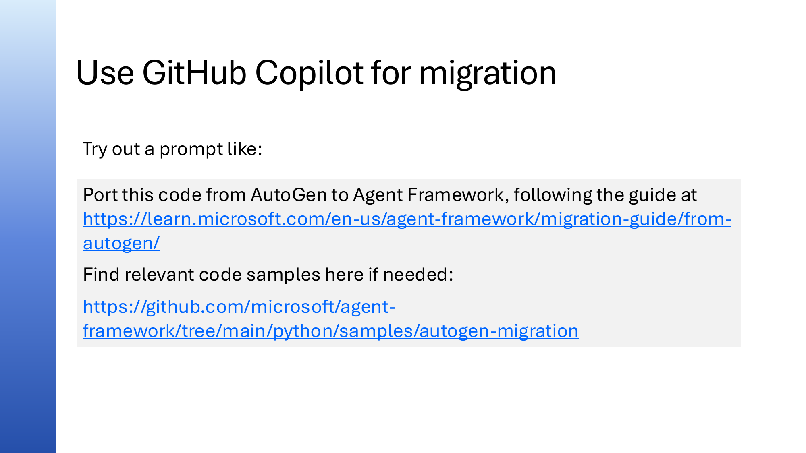

```
Use GitHub Copilot for migration
Try out a prompt like:

Port this code from AutoGen to Agent Framework, following the guide at
https://learn.microsoft.com/en-us/agent-framework/migration-guide/from-
autogen/
Find relevant code samples here if needed:
https://github.com/microsoft/agent-
framework/tree/main/python/samples/autogen-migration
```

## Slide 50

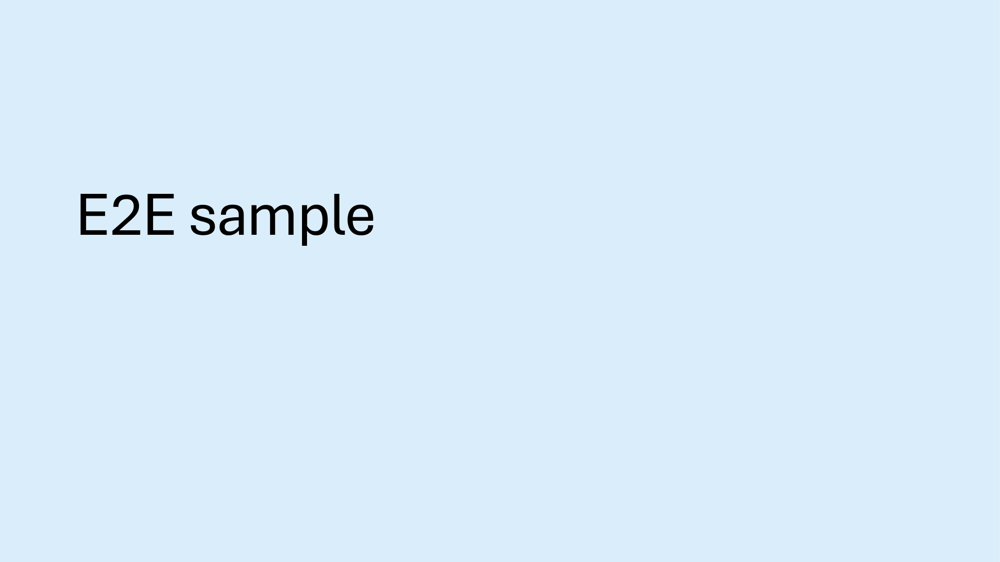

```
E2E sample
```

## Slide 51

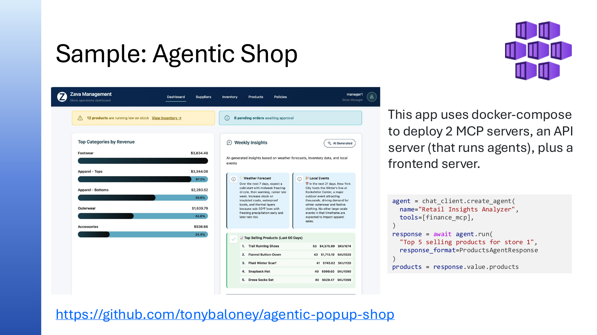

```
Sample: Agentic Shop

                                                This app uses docker-compose
                                                to deploy 2 MCP servers, an API
                                                server (that runs agents), plus a
                                                frontend server.

                                                agent = chat_client.create_agent(
                                                  name="Retail Insights Analyzer",
                                                  tools=[finance_mcp],
                                                )
                                                response = await agent.run(
                                                  "Top 5 selling products for store 1",
                                                  response_format=ProductsAgentResponse
                                                )
                                                products = response.value.products


https://github.com/tonybaloney/agentic-popup-shop
```
