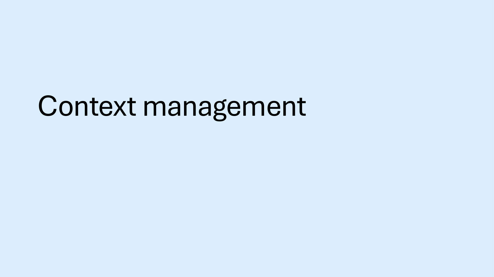
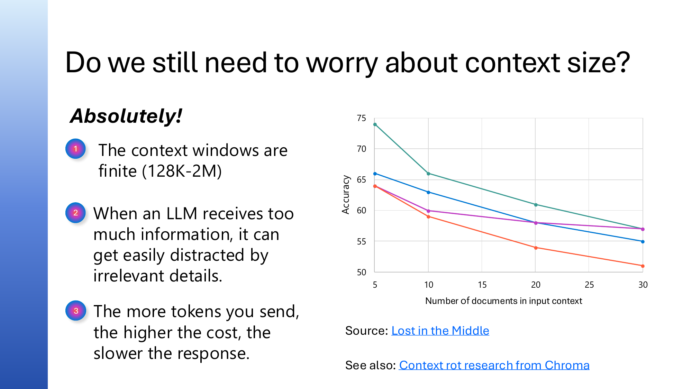

## Slide 1


```
Python + Agents
Feb 24: Building your first agent in Python
Feb 25: Adding context and memory to agents
Feb 26: Monitoring and evaluating agents
Mar 3: Building your first AI-driven workflows
Mar 4: Orchestrating advanced multi-agent workflows
Mar 5: Adding a human-in-the-loop to workflows

Register at aka.ms/PythonAgents/series
```

## Slide 2


```
Python + Agents
       Adding context and memory to agents
aka.ms/pythonagents/slides/contextmemory
Pamela Fox
Python Cloud Advocate
www.pamelafox.org
```

## Slide 3


```
Today we'll cover different kinds of context...
• What is context?
• Memory
  • Sessions
  • Chat history
  • Dynamic memory
• Knowledge providers
• Context management
```

## Slide 4


```
Want to follow along?
1. Open this GitHub repository:
aka.ms/python-agentframework-demos
2. Use "Code" button to create a GitHub Codespace:


3. Wait a few minutes for Codespace to start up
4. Pull the latest changes from the repo:
  git pull
```

## Slide 5


```
Recap: What's an agent?
          Agent
                          An AI agent uses an LLM to run
  Input                   tools in a loop to achieve a goal.


                          Agents are improved by better context:
                             Knowledge
   LLM
                             Memory
                  Tools
                             Humans


   Goal
```

## Slide 6


```
Context is everything
The context to an agent is all the inputs that help the agent decide what
action it will take next and how it will respond.

   Overall instructions                       You're a friendly weather assistant.
    Environment information                   Today's date is Feb 25, 2026.
   Domain-specific knowledge                  There is an emergency alert today
                                              for CA citizens due to wildfire risk.
    Memories from previous conversations      The current user lives in California.
    Past messages in the session             Weather in Tokyo?

    Tool descriptions, calls, results        get_weather("Tokyo")                     LLM
                                             Sunny, 25°C

                                             It's sunny in Tokyo at 25°C              LLM
```

## Slide 7


```
Memory
```

## Slide 8


```
Memory
 Can LLM remember                 Can app remember past           Can LLM remember facts
 past messages?                   conversations?                  from past conversations?


Session                           Chat history                   Dynamic memory
• Within conversation, just       • Must be stored in a          • Must be stored in a
  messages and tool calls           persistent database            persistent database
• Can be stored in-memory         • Across conversations,        • Retrieve memories,
  OR persisted to a database        typically tied to user ID      optionally using search
  to restore conversation later                                    to find most relevant
• May require truncation or
  summarization


https://learn.microsoft.com/agent-framework/user-guide/agents/agent-memory
```

## Slide 9


```
Conversation sessions
```

## Slide 10


```
Conversation sessions     A session includes all the past messages:

                                  You're a weather assistant.
          Agent
                                  Weather in Tokyo?
  Input
                          LLM     get_weather("Tokyo")

                                  Sunny, 25°C

                          LLM     It's sunny in Tokyo at 25°C
   LLM
                  Tools           How about London?

                          LLM     get_weather("London")

                                  Rainy, 12°C
 Response
                          LLM     London is rainy at 12°C
```

## Slide 11


```
agent-framework

Conversation session (In-memory)
By default, a session stores the conversation messages in memory:

from agent_framework import Agent
from agent_framework.openai import OpenAIChatClient

agent = Agent(
  client=OpenAIChatClient(),
  instructions="You are a helpful assistant.")

session = agent.create_session()

response = await agent.run("Hello, my name is Alice", session=session)


Full example: agent_session.py
```

## Slide 12


```
Persistent chat history
```

## Slide 13


```
Persistent chat history
       You're a weather assistant.
                                                id           messages
       Weather in Tokyo?                        session123   system: You're a weather assistant.
                                                             user: Weather in Tokyo?
       get_weather("Tokyo")                                  ...
 LLM

       Sunny, 25°C                   Database   session456   system: You're a weather assistant.
                                                             user: Will it rain in CA?
                                                             ....
 LLM   It's sunny in Tokyo at 25°C

       How about London?                        Implementation details:
                                                • Will entire session fit in one row?
 LLM   get_weather("London")
                                                  If not, how to handle?
       Rainy, 12°C                              • How will sessions be linked to users?
                                                • Will the sessions be searchable?
 LLM   London is rainy at 12°C
```

## Slide 14


```
Persistent chat history in Redis
       You're a weather assistant.
                                             key          value [LIST]
       Weather in Tokyo?
                                             session123    {"role": "system",
 LLM   get_weather("Tokyo")                                 "content": "You're a weather
                                                           assistant."}
       Sunny, 25°C                   Redis                 {"role": "user",
                                                            "content": "Weather in Tokyo?"}
 LLM   It's sunny in Tokyo at 25°C
                                                           {"role": "assistant",
                                                            "tool_call": "get_weather"}
       How about London?

       get_weather("London")                 Implementation details:
 LLM
                                             • Keys are session IDs
       Rainy, 12°C                           • The values are lists of messages that
                                               can be truncated to the most recent N
 LLM   London is rainy at 12°C
```

## Slide 15


```
agent-framework

Persistent chat history
Redis support is built-in, so you can directly use RedisHistoryProvider:
from agent_framework.redis import RedisHistoryProvider

redis_provider = RedisHistoryProvider(
    redis_url="redis://localhost:6379",
    source_id="redis_chat")

agent = Agent(
  client=OpenAIChatClient(),
  instructions="You are a helpful weather agent.",
  tools=[get_weather],
  context_providers=[redis_provider])

session = agent.create_session(session_id=str(uuid.uuid4()))

Full example: agent_history_redis.py
```

## Slide 16


```
Persistent chat history in SQLite
                                              id   thread_id    message
       You're a weather assistant.            1    session123   {"role": "system",
                                                                 "content": "You're a
       Weather in Tokyo?                                        weather assistant."}
                                              2    session123   {"role": "user",

 LLM   get_weather("Tokyo")                                      "content": "Weather in
                                                                Tokyo?"}
                                              3    session123   {"role": "assistant",
       Sunny, 25°C                   SQLite                      "tool_call":
                                                                "get_weather"}

 LLM   It's sunny in Tokyo at 25°C
                                              4    session456   {"role": "system",
                                                                 "content": "You're a
       How about London?                                        weather assistant."}


 LLM   get_weather("London")                  Implementation details:
                                              • Rows are single messages, retrieved
       Rainy, 12°C                              based off incrementing ID order

 LLM   London is rainy at 12°C                • No limits to # of messages in session
```

## Slide 17


```
agent-framework

Persistent chat history with custom storage
For DBs without built-in support, write a subclass that implements BaseHistoryProvider:
class SQLiteHistoryProvider(BaseHistoryProvider):

 def __init__(self, db_path: str):
  ...

 async def get_messages(self, session_id, **kwargs) -> list[Message]:
  cursor = self._conn.execute(
   "SELECT message_json FROM messages WHERE session_id = ? ORDER BY id",
   (session_id,))
 return [Message.from_json(row[0]) for row in cursor.fetchall()]

 async def save_messages(self, session_id, messages, **kwargs) -> None:
  self._conn.executemany(
    "INSERT INTO messages (session_id, message_json) VALUES (?, ?)",
    [(session_id, msg.to_json()) for msg in messages])
   self._conn.commit()

Full example: agent_history_sqlite.py
```

## Slide 18


```
Dynamic memory
```

## Slide 19


```
Dynamic memory
                                       Implementation matters!


                Tools                  Retrieving memories:
                                       • All or only most relevant?
Input   Agent     LLM       Response

                                       Storing memories:
                                       • Whole message?
                                       • LLM-synthesized memory?
                   Memory
                    store
                                       Forgetting memories:
                                       • Oldest? Obsolete?
```

## Slide 20


```
agent-framework

Dynamic memory with Redis
                                                                 RedisProvider:
                      Tools

                                                                 Retrieving memories:
Input   Agent           LLM                       Response
                                                                 • Searches with full-text,
                                                                   vector, or hybrid search

                                                                 Storing memories:
                                                                 • Entire user and assistant
                     RedisProvider                                 messages (no tool calls)
                                key
                                userA_0
                                          value
                                          user: weather in CA?
                                                                 Forgetting memories:
                        Redis
                                userA_1   assistant: sunny       • No mechanism- memories
                                userA_2   user: awesome!
                                                                   remain forever
```

## Slide 21


```
agent-framework

Dynamic memory with Redis
from agent_framework.redis import RedisContextProvider

user_id = str(uuid.uuid4())
memory_provider = RedisContextProvider(
  redis_url=REDIS_URL,
  index_name="agent_memory_demo",
  overwrite_index=True,
  prefix="memory_demo",
  application_id="weather_app",
  agent_id="weather_agent",
  user_id=user_id,
)
agent = Agent(
  client=OpenAIChatClient(),
  instructions="You are a helpful weather assistant.",
  context_providers=[memory_provider],
  tools=[get_weather])
Full example: agent_memory_redis.py
```

## Slide 22


```
agent-framework

Dynamic memory with Mem0
                                                               Mem0Provider:
                      Tools

                                                               Retrieving memories:
Input   Agent           LLM                    Response
                                                               • Searches the associated
                                               LLM               database (Qdrant default)

                                                               Storing memories:
                                                               • LLM suggests new memories
                     Mem0Provider
                                                               Forgetting memories:
                                id   user_id   memory
                                                               • LLM suggests memory
                                1    userA_0   Lives in CA

                       Qdrant   2    userA_1   Loves the sun
                                                                 removal or updating
```

## Slide 23


```
Mem0Provider: Memory update process
                                                         "Compare new memories
                                                             to old memories
             "Review response                             and recommend action
           and suggest memories"                       (ADD/UPDATE/DELETE/NONE)"
                                                                                     new memory         action
Response          LLM              Extracted                        LLM              Hates snow         ADD
                                   memories                                          Lives in NY        UPDATE

                                   new memory      old memory                        Loves the sun      NONE

                                   Hates snow      Lives in CA

                                   Lives in NY     Loves the sun

                                   Loves the sun


                                                                          id   user_id    memory
                                                                          1    userA_0    Lives in NY

                                                                 Qdrant   2    userA_1    Loves the sun

                                                                          3    userA_2    Hates snow
```

## Slide 24


```
agent-framework

Dynamic memory with Mem0
Use a built-in memory provider (like Mem0Provider) or write your own context provider:

from agent_framework.mem0 import Mem0ContextProvider
from mem0 import AsyncMemory

user_id = str(uuid.uuid4())

mem0_client = await AsyncMemory.from_config(mem0_config)

memory_provider = Mem0ContextProvider(user_id=user_id, mem0_client=mem0_client)

agent = Agent(
  client=OpenAIChatClient(),
  instructions="You are a helpful weather assistant.",
  context_providers=[memory_provider],
  tools=[get_weather])

Full example: agent_memory_mem0.py
```

## Slide 25


```
Memory in production: GitHub Copilot


All memories include citations, which are verified for accuracy before memories are used.
A memory which can no longer be verified is removed.

Learn more:
https://github.blog/ai-and-ml/github-copilot/building-an-agentic-memory-system-for-github-copilot/
```

## Slide 26


```
Knowledge
```

## Slide 27


```
Knowledge retrieval
                                                                             The agent retrieves
                                                                             knowledge before asking the
                                                                             LLM to call tools.
                                                          Tools

Input   Agent                                               LLM   Response   Why not just use a tool to
                                                                             retrieve knowledge?

                 search with input   relevant knowledge
                                                                             In many scenarios, the agent
                                                                             always needs domain-
                                                                             specific knowledge to
                                                                             ground its response, so it's
                Knowledge                                                    unnecessary to ask an LLM
                  store                                                      to decide to use the tool.
```

## Slide 28


```
agent-framework

Knowledge retrieval from SQLite database
Create a subclass of BaseContextProvider to retrieve data for the given input:
class SQLiteKnowledgeProvider(BaseContextProvider):
  async def before_run(self, *, agent, session, context, state):
    user_text = context.input_messages[-1].text
    results = self._search(user_text)
    if results:
      context.extend_messages(self.source_id,
        [Message(role="user", text=self._format_results(results))])

agent = Agent(client=client,
  instructions=("You are an outdoor-gear shopping assistant."),
  context_providers=[knowledge_provider])

response = await agent.run("Do you have anything for kayaking?")
Full example: agent_knowledge_sqlite.py
```

## Slide 29


```
Improve retrieval with hybrid search

                    Keyword search

               1 TrailBlaze Hiking Boots
protection                                      Reciprocal Rank Fusion
from rain on   2 SummitPack 40L Backpack                 (RRF)
rocky paths
                                            1   TrailBlaze Hiking Boots
                                            2   SummitPack 40L Backpack
                     Vector search
                                            3   ArcticShield Down Jacket

               1 TrailBlaze Hiking Boots
               2 ArcticShield Down Jacket
               3 SummitPack 40L Backpack
```

## Slide 30


```
agent-framework

Knowledge retrieval from PostgreSQL
PostgreSQL can do a hybrid search with an embedding model and SQL query:
WITH semantic_search AS (
    SELECT id, RANK() OVER (ORDER BY embedding <=> %(embedding)s::vector(256)) AS rank
    FROM products
    ORDER BY embedding <=> %(embedding)s::vector(256)
    LIMIT 20
),
keyword_search AS (
    SELECT id, RANK() OVER (ORDER BY ts_rank_cd(
        to_tsvector('english', name || ' ' || description), query) DESC)
    FROM products, plainto_tsquery('english', %(query)s) query
    WHERE to_tsvector('english', name || ' ' || description) @@ query
    ORDER BY ts_rank_cd(...) DESC
    LIMIT 20
)
SELECT
    COALESCE(semantic_search.id, keyword_search.id) AS id,
    COALESCE(1.0 / (60 + semantic_search.rank), 0.0) +
    COALESCE(1.0 / (60 + keyword_search.rank), 0.0) AS score
FROM semantic_search
FULL OUTER JOIN keyword_search ON semantic_search.id = keyword_search.id
ORDER BY score DESC
LIMIT 3

Full example: agent_knowledge_postgres.py
```

## Slide 31


```
Improve retrieval for multi-turn conversations
  Conversation
                                     Tip: Use a query rewriting step when the input is an
 i need protection                   entire conversation, as the final message may be
from rain on rocky                   missing important context.
       paths.


 Check out our       "Suggest a
Down Jacket and      search query
 Hiking Boots!       based on this      Rewritten query
                     conversation"
                                       protective jackets    search    Knowledge
what similar gear     LLM                and boots for
 do you have for                                                         store
                                        hiking in snow
snowy situations?
```

## Slide 32


```
agent-framework

Query rewriting in a context provider
Use an LLM to rewrite the query based off the user/agent messages so far:
class PostgresQueryRewriteProvider(BaseContextProvider):

  async def before_run(self, agent, session, context, state):
    conversation = [
       m for m in context.get_messages() + context.input_messages
       if m.role in ("user", "assistant") and m.text]
   search_query = await self._rewrite_query(conversation)

    results = self._search(search_query)
    if results:
      context.extend_messages(self.source_id,
        [Message(role="user", text=self._format_results(results))])
Full example: agent_knowledge_pg_rewrite.py
```

## Slide 33


```
Knowledge retrieval with Azure AI Search
Azure AI Search has a knowledge base feature which has query rewriting and
hybrid search built-in, plus multi-source selection and a reflection step.
                                                              Knowledge sources             Output

                                                                Search Indexes             Merged
   Input                                                                                   results
                                    Query 1                        OneLake
Conversation                                                                              Activity log
                   Query
                  planning          Query 2                       SharePoint

                                                                                           Answer
                                                                     Bing                 synthesis

                             Iterative retrieval

   Search step uses hybrid search with semantic re-ranking when supported by the knowledge source
```

## Slide 34


```
agent-framework

Knowledge retrieval from Azure AI Search
Use the built-in AzureAISearchContextProvider to retrieve from a knowledge base:
from agent_framework.azure import AzureAISearchContextProvider
search_provider = AzureAISearchContextProvider(
  endpoint=SEARCH_ENDPOINT, credential=DefaultAzureCredential(),
  knowledge_base_name=KNOWLEDGE_BASE_NAME, mode="agentic")
agent = Agent(
  client=client,
  instructions="You are a helpful shopping assistant.",
  context_providers=[search_provider])
async with search_provider:
  session = agent.create_session()
  response = await agent.run("What interior paint do you have?",
      session=session)
  response = await agent.run("What supplies do I need to apply it?",
      session=session)
Full example: agent_knowledge_aisearch.py
```

## Slide 35



```
Context management
```

## Slide 36


```
Context window
The context window of an LLM is the amount of input tokens that an
LLM can process at a given time.
Context windows have been steadily increasing over time:
Model                    Release date       Context window (tokens)
GPT-3                    2020               2K
GPT-3.5 Turbo            Feb 2024           4K-16K
GPT-4                    Mar 2023           8K-32K
GPT-4 Turbo              Dec 2023           128K
Claude 3 (Sonnet/Opus)   Feb 2025           200K
Claude Opus 4.6          Feb 2026           1M
```

## Slide 37



```
Do we still need to worry about context size?
Absolutely!                                75


1
    The context windows are                70

    finite (128K-2M)                       65

                                Accuracy
2   When an LLM receives too               60


    much information, it can               55
    get easily distracted by
    irrelevant details.                    50
                                                5   10         15           20             25   30
                                                    Number of documents in input context
3   The more tokens you send,
    the higher the cost, the        Source: Lost in the Middle
    slower the response.
                                    See also: Context rot research from Chroma
```

## Slide 38


```
Context compaction with summarization
Context window: 200K                    Context window: 200K

                                          Summary of
                                          past messages
                 25%   "Summarize..."                      25% Implementation details:
                                                               • How often to
                           LLM                                   summarize?
                 50%                                       50% • What's most important
                                                                 to summarize?
                                                                 • Do you store original
                                                                   messages for later?
                 75%                                       75%


                100%                                      100%
```

## Slide 39


```
agent-framework

Summarization middleware
We can subclass AgentMiddleware to summarize messages and replace them.
  agent.run("user message")


    SummarizationMiddleware
                                                       "Summarize..."

    BEFORE RUN:     context tokens > threshold?          LLM

     AGENT RUN:     call_next()
                                                      messages = [summary]


     AFTER RUN:   context tokens += response tokens
```

## Slide 40


```
agent-framework

Summarization middleware
class SummarizationMiddleware(AgentMiddleware):

 async def process(self, context, call_next):
   # Before the agent runs
   if context.session and self.context_tokens > self.token_threshold:
     history = context.session.state["memory"]["messages"]
     summary = await self._summarize(history) # LLM call
     context.session.state["memory"]["messages"] =
      [Message(role="assistant", text=f"[Summary]\n{summary}")]
     self.context_tokens = 0

   await call_next() # Runs the standard agent loop

   # After the agent runs
   if context.result and context.result.usage_details:
     self.context_tokens += context.result.usage_details["total_token_count"]

Full example: agent_summarization.py
```

## Slide 41


```
Context reduction with subagents
A single agent is risky...             Better: Coordinator agent calls sub-agents
                                          Coordinator agent
                   Agent
                                                           LLM
                 LLM                                          10K summary
                                               Sub-agent

                      40K
                                                           LLM

   list_files    read_file   search                             40K


                                              list_files   read_file        search


    Context can explode due to large
                                        Sub-agent returns a summary of tool call results.
tool call results growing over time
```

## Slide 42


```
agent-framework

Coordinator agent with sub-agents
# Sub-agent: researches codebase in its own isolated context
research_agent = Agent(client=client,
  instructions="Read and search files, return a concise summary under 200 words.",
  tools=[list_project_files, read_project_file, search_project_files],
)

@tool
async def research_codebase(question: str) -> str:
  """Delegate research to the sub-agent. Returns only a summary."""
  response = await research_agent.run(question)
  return response.text

# Coordinator agent: only sees summaries, never raw file contents
coordinator = Agent(client=client,
  instructions="Answer questions about code. Use research_codebase to investigate.",
  tools=[research_codebase])


Full example: agent_with_subagent.py
```

## Slide 43


```
Context reduction with subagents: Token usage
The coordinator's context window stays small, despite sub-agent using more tokens.
In multi-turn conversations, this difference would compound with each turn.


                       Single agent     vs.    Coordinator agent     Sub-agent

Input tokens               6,714                       623               8,494

Output tokens              1,598                       514               580

Total tokens               8,312                      1,137              9,074


The final answer returned was a high-quality answer in both scenarios.
```

## Slide 44


```
When to use sub-agents?
     Use sub-agents when...
•   Tools return large outputs
•   Task requires multiple chained tool calls
•   Main agent has multiple responsibilities
•   Long-running, multi-turn conversations
•   Sub-tasks need specialized instructions

     Skip sub-agents when...
•   Tool responses are small and simple
•   Single tool call gets the answer
•   Main agent needs to see raw tool output
•   Low latency is critical (extra LLM round-trip)
```

## Slide 45


```
Next steps                      Register:
                                https://aka.ms/PythonAgents/series

Watch past recordings:          Join office hours after each session in Discord:
aka.ms/pythonagents/resources   aka.ms/pythonai/oh

    Feb 24: Building your first agent in Python
    Feb 25: Adding context and memory to agents
    Feb 26: Monitoring and evaluating agents
    Mar 3: Building your first AI-driven workflows
    Mar 4: Orchestrating advanced multi-agent workflows
    Mar 5: Adding a human-in-the-loop to workflows
```
