# Python + Agents (Session 2): Adding context and memory to agents

📺 [Watch the full recording on YouTube](https://www.youtube.com/watch?v=BMzI9cEaGBM) |
📑 [Download the slides (PPTX)](https://aka.ms/pythonagents/slides/contextmemory)

This write-up includes an annotated version of the presentation slides with timestamps to the video plus a summary of the live Q&A sessions.

## Table of contents

- [Session description](#session-description)
- [Annotated slides](#annotated-slides)
  - [Overview of the Python and agent series](#overview-of-the-python-and-agent-series)
  - [Today's agenda](#todays-agenda)
  - [Following along in GitHub Codespaces](#following-along-in-github-codespaces)
  - [Recap: what is an agent?](#recap-what-is-an-agent)
  - [Context is everything](#context-is-everything)
  - [Memory overview](#memory-overview)
  - [Conversation sessions](#conversation-sessions)
  - [In-memory conversation sessions in agent framework](#in-memory-conversation-sessions-in-agent-framework)
  - [Persistent chat history](#persistent-chat-history)
  - [Persistent chat history concepts](#persistent-chat-history-concepts)
  - [Persistent chat history in Redis](#persistent-chat-history-in-redis)
  - [Persistent chat history with RedisHistoryProvider](#persistent-chat-history-with-redishistoryprovider)
  - [Persistent chat history in SQLite](#persistent-chat-history-in-sqlite)
  - [Persistent chat history with custom storage](#persistent-chat-history-with-custom-storage)
  - [Dynamic memory](#dynamic-memory)
  - [Dynamic memory design decisions](#dynamic-memory-design-decisions)
  - [Dynamic memory with Redis](#dynamic-memory-with-redis)
  - [RedisContextProvider code](#rediscontextprovider-code)
  - [Dynamic memory with Mem0](#dynamic-memory-with-mem0)
  - [Mem0 memory update process](#mem0-memory-update-process)
  - [Mem0ContextProvider code](#mem0contextprovider-code)
  - [Memory in production: GitHub Copilot](#memory-in-production-github-copilot)
  - [Knowledge retrieval](#knowledge-retrieval)
  - [Knowledge retrieval from SQLite](#knowledge-retrieval-from-sqlite)
  - [Hybrid search with keyword and vector retrieval](#hybrid-search-with-keyword-and-vector-retrieval)
  - [Knowledge retrieval from PostgreSQL](#knowledge-retrieval-from-postgresql)
  - [Query rewriting for multi-turn conversations](#query-rewriting-for-multi-turn-conversations)
  - [Query rewriting in a context provider](#query-rewriting-in-a-context-provider)
  - [Knowledge retrieval with Azure AI Search](#knowledge-retrieval-with-azure-ai-search)
  - [AzureAISearchContextProvider code](#azureaisearchcontextprovider-code)
  - [Context management](#context-management)
  - [Context window sizes and why they matter](#context-window-sizes-and-why-they-matter)
  - [Context compaction with summarization](#context-compaction-with-summarization)
  - [Summarization middleware architecture](#summarization-middleware-architecture)
  - [Summarization middleware code](#summarization-middleware-code)
  - [Context reduction with sub-agents](#context-reduction-with-sub-agents)
  - [Coordinator agent with sub-agents code](#coordinator-agent-with-sub-agents-code)
  - [Sub-agent token usage comparison](#sub-agent-token-usage-comparison)
  - [When to use sub-agents](#when-to-use-sub-agents)
  - [Next steps](#next-steps)
- [Live Chat Q&A](#live-chat-qa)
- [Discord Office Hours Q&A](#discord-office-hours-qa)

## Session description

In the second session of our Python + Agents series, we extended agents built with the Microsoft Agent Framework by adding two essential kinds of context: memory and knowledge.

We began with memory—both short‑term, thread‑level context and long‑term, persistent memory.

We showed how agents could store and recall information using solutions like Redis or open‑source libraries such as Mem0, enabling them to remember previous interactions, user preferences, and evolving tasks across sessions.

Next, we explored knowledge, commonly known as Retrieval‑Augmented Generation (RAG), and showed how agents grounded their responses using knowledge retrieved from local data sources such as SQLite or PostgreSQL.

This enabled agents to provide accurate, domain‑specific answers based on real information rather than model hallucination.

By the end, we saw how to build agents that were not only capable but context‑aware and memory‑efficient, resulting in richer, more personalized user experiences.

## Annotated slides

### Overview of the Python and agent series

  
[Watch from 00:05](https://www.youtube.com/watch?v=BMzI9cEaGBM&t=5s)

This series consists of six sessions teaching how to build AI agents using the Microsoft agent framework. It spans two weeks and progressively introduces tools, techniques, and best practices for creating intelligent agents capable of handling complex tasks. Registration remains open during the series, providing access to session recordings and resources.

### Adding context and memory to agents

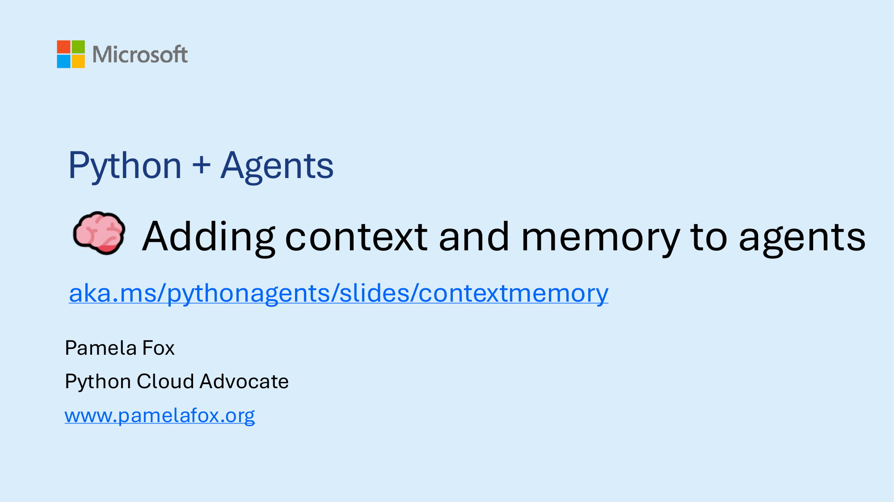  
[Watch from 00:58](https://www.youtube.com/watch?v=BMzI9cEaGBM&t=58s)

This is the second session of a six-part Python + Agents series. The full schedule covers building a first agent, adding context and memory, monitoring and evaluating agents, building AI-driven workflows, orchestrating multi-agent workflows, and adding a human-in-the-loop. Register at [aka.ms/PythonAgents/series](https://aka.ms/PythonAgents/series).

### Today's agenda

[Watch from 01:27](https://www.youtube.com/watch?v=BMzI9cEaGBM&t=87s)

The session covers four main topics: what context means for agents, different kinds of memory (sessions, chat history, dynamic memory), knowledge providers for RAG, and context management techniques. Slides are available at [aka.ms/pythonagents/slides/contextmemory](https://aka.ms/pythonagents/slides/contextmemory).

### Following along in GitHub Codespaces

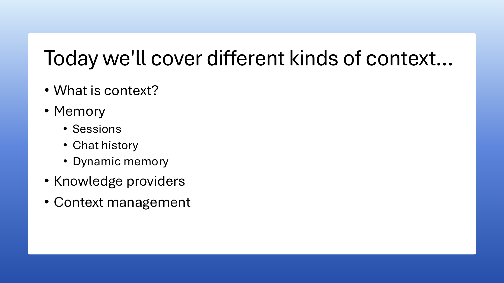
[Watch from 01:42](https://www.youtube.com/watch?v=BMzI9cEaGBM&t=102s)

The agenda breaks down into: what is context, memory (sessions, chat history, dynamic memory), knowledge providers, and context management.

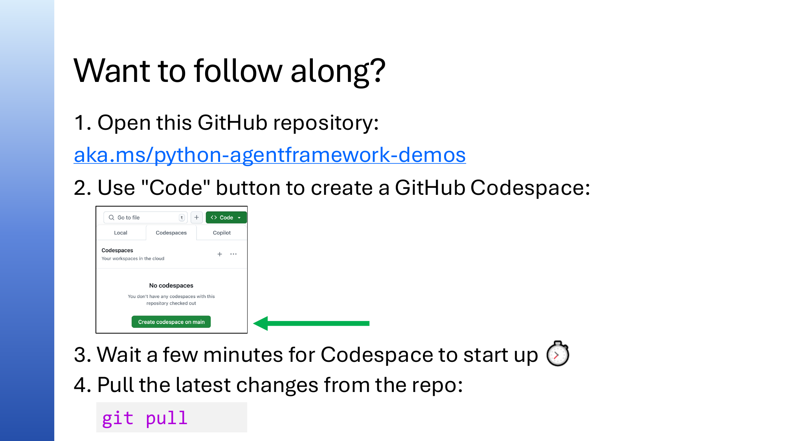
[Watch from 02:28](https://www.youtube.com/watch?v=BMzI9cEaGBM&t=148s)

All examples live in the [python-agentframework-demos](https://aka.ms/python-agentframework-demos) repository. To follow along, open the repo, click the "Code" button, create a GitHub Codespace, wait for it to start, and run `git pull` to get the latest changes. The Codespace comes pre-configured with all dependencies, including a local Redis instance via Docker Compose. Running locally requires manual configuration of model connections per the README.

### Recap: what is an agent?

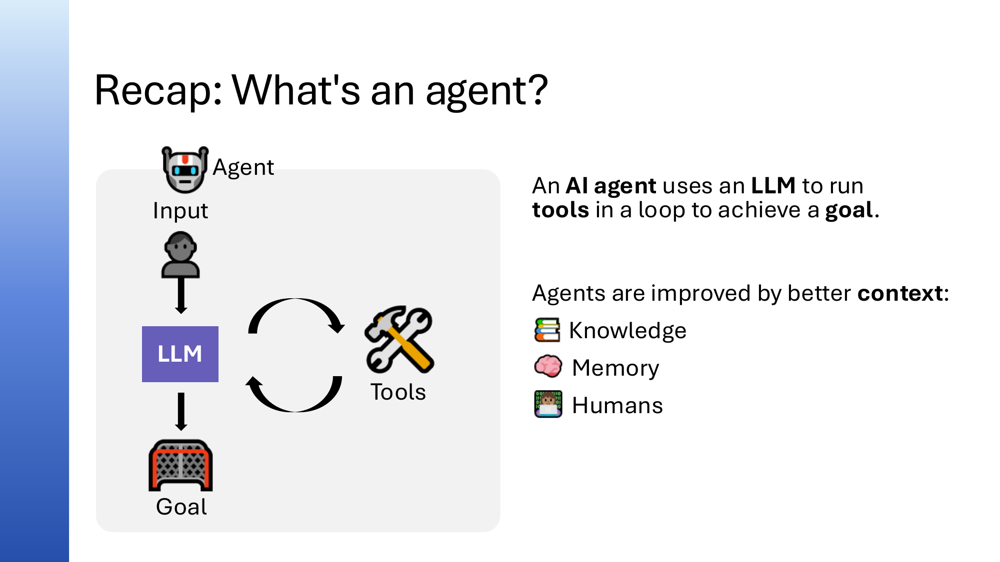
[Watch from 04:28](https://www.youtube.com/watch?v=BMzI9cEaGBM&t=268s)

An AI agent uses an LLM to run tools in a loop to achieve a goal. The previous session covered agents using local functions and MCP servers as tools. Agents become more powerful with better context: knowledge (domain-specific information), memory (remembering past interactions), and humans (providing additional input, covered in a later session).

### Context is everything

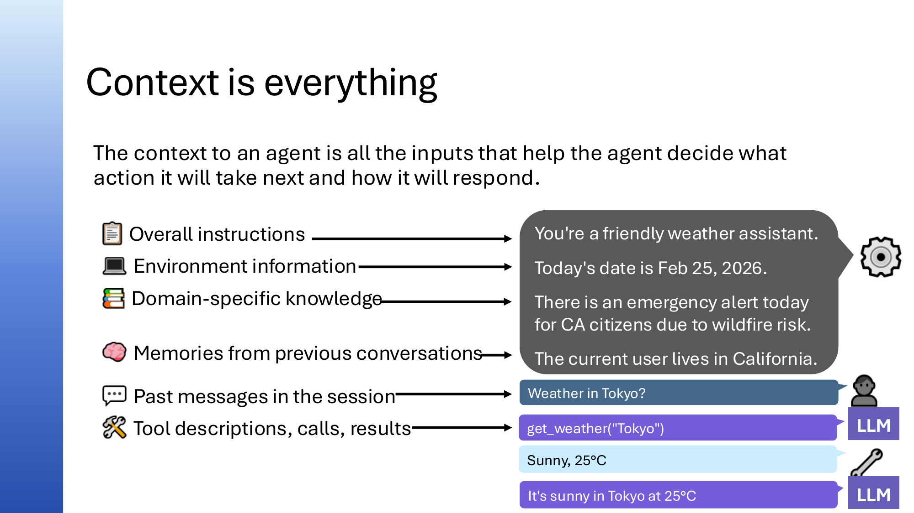
[Watch from 06:22](https://www.youtube.com/watch?v=BMzI9cEaGBM&t=382s)

Context is all the inputs that help an agent decide what action to take next and how to respond. These inputs include: the system prompt (overall instructions like "You're a friendly weather assistant"), environment information (today's date, platform details), domain-specific knowledge (emergency alerts, relevant data that should always be present), memories from previous conversations (e.g., "the current user lives in California"), past messages in the session (the ongoing conversation), and tool descriptions, calls, and results. All of this gets sent to the LLM and helps it produce better answers.

### Memory overview

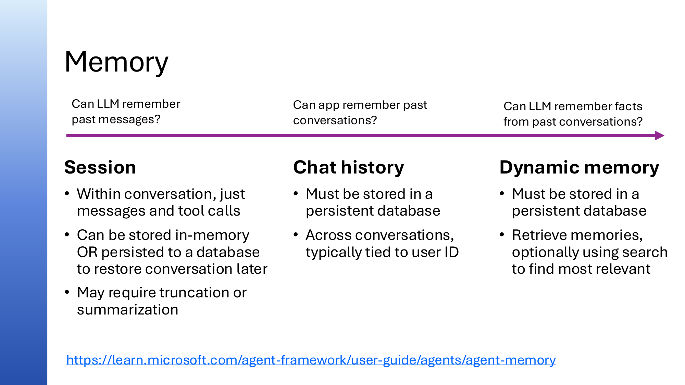
[Watch from 08:48](https://www.youtube.com/watch?v=BMzI9cEaGBM&t=528s)

Memory breaks into three categories along an increasing spectrum of sophistication. **Session memory** is the simplest: can the LLM remember past messages within the current conversation? This requires storing all messages and tool calls, either in-memory or persisted to a database. Long threads may require truncation or summarization. **Chat history** stores conversations persistently so users can find and resume past sessions. This requires a database, user-linked session IDs, and potentially searchable storage. **Dynamic memory** lets the LLM remember facts and preferences across conversations. Memories are stored in a persistent database and retrieved (optionally via search) to personalize responses. See the [agent memory documentation](https://learn.microsoft.com/agent-framework/user-guide/agents/agent-memory) for more.

### Conversation sessions

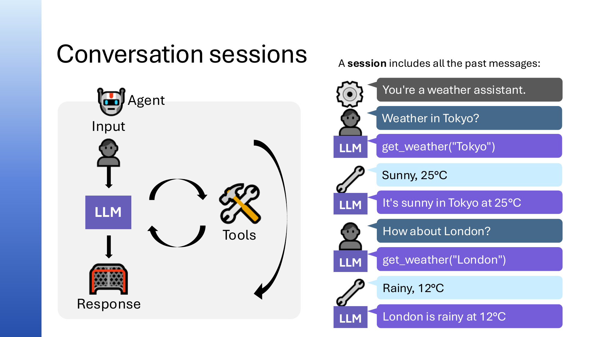
[Watch from 11:55](https://www.youtube.com/watch?v=BMzI9cEaGBM&t=715s)

A session contains all past messages: the system prompt, user messages, LLM responses, tool calls, and tool results. Without a session, the LLM cannot reference earlier parts of the conversation. If a user asks "What's the weather in Seattle?" and then "What was the last city I asked about?", the agent without a session will have no memory of the first question. Sessions are portable across agents -- you can create a session with one agent and pass it to another, enabling shared conversation history.

### In-memory conversation sessions in agent framework

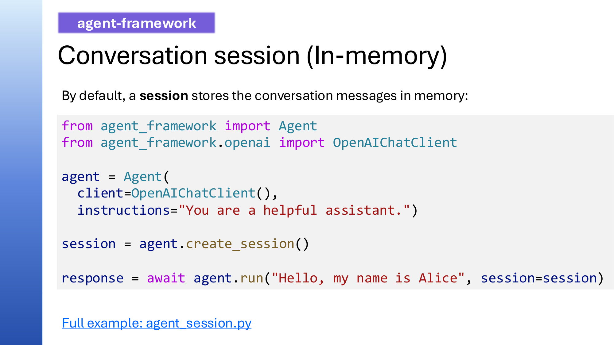
[Watch from 12:35](https://www.youtube.com/watch?v=BMzI9cEaGBM&t=755s)

By default, a session stores conversation messages in memory. Create an `Agent` with an `OpenAIChatClient` and instructions, call `agent.create_session()` to get a session object with a unique ID, then pass that session to each `agent.run()` call. The session accumulates messages so the LLM sees the full conversation history. Sessions can be serialized and deserialized, making them restorable across restarts and even shareable across different agents.

### Persistent chat history

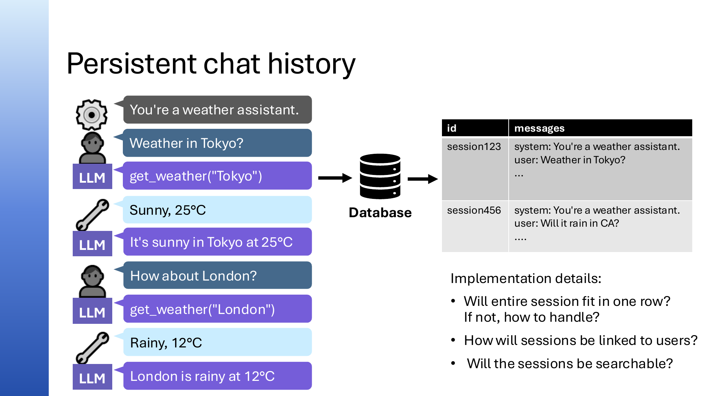
[Watch from 16:18](https://www.youtube.com/watch?v=BMzI9cEaGBM&t=978s)

Persistent chat history enables users to find and resume previous conversations. When designing storage, consider: whether the entire session fits in one row (depends on database size limits), how sessions link to users (use unique identifiers like Entra OIDs for privacy), and whether sessions need to be searchable (requires a database with search support).

### Persistent chat history concepts

[Watch from 16:38](https://www.youtube.com/watch?v=BMzI9cEaGBM&t=998s)

Each session is identified by a unique session ID. The messages can be stored as a complete list per session or as individual rows per message. The choice depends on database constraints and query patterns.

### Persistent chat history in Redis

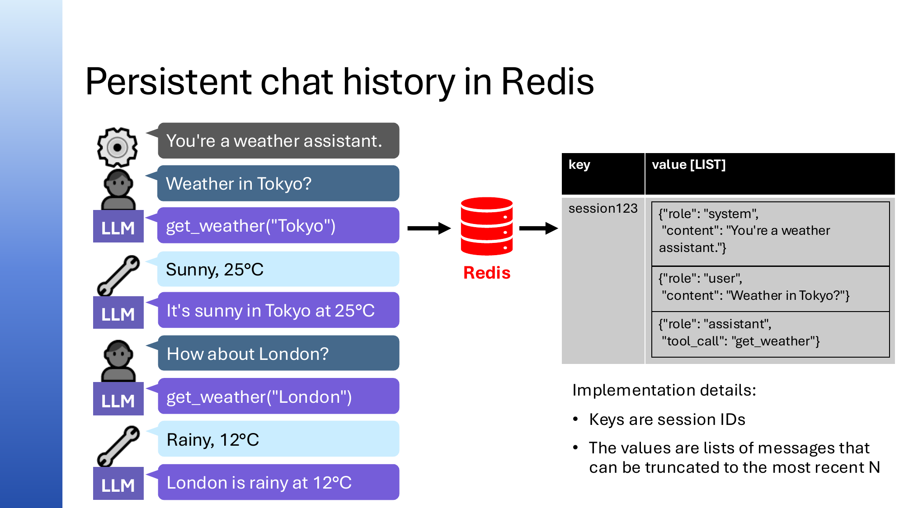
[Watch from 17:27](https://www.youtube.com/watch?v=BMzI9cEaGBM&t=1047s)

Redis stores chat history with session IDs as keys and the entire list of messages as the value using Redis's LIST type. Each message is a JSON object with role, content, and optionally tool_call fields. The list can be truncated to the most recent N messages if needed. Redis is the simplest option since agent framework has built-in support for it via `RedisHistoryProvider`.

### Persistent chat history with RedisHistoryProvider

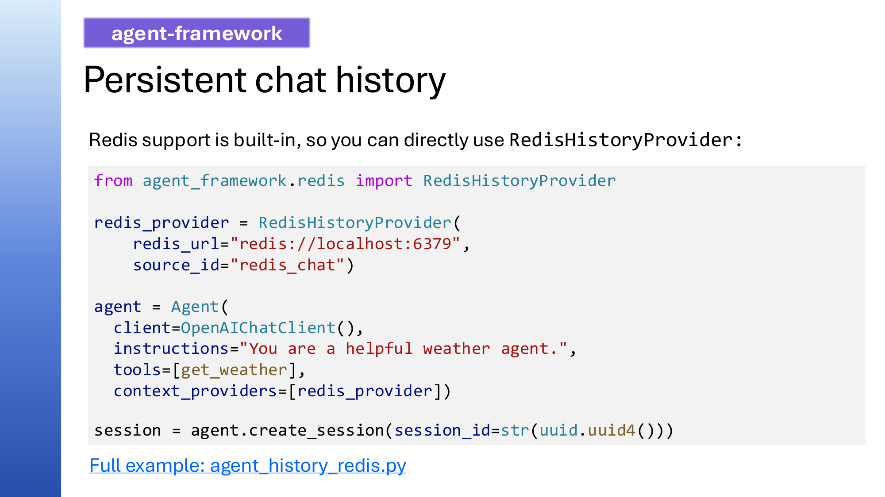
[Watch from 17:59](https://www.youtube.com/watch?v=BMzI9cEaGBM&t=1079s)

Import `RedisHistoryProvider` from `agent_framework.redis`, point it at a Redis URL, and give it a `source_id`. Pass it to the `Agent` as a `context_providers` list item. When creating a session, provide a unique `session_id` (e.g., via `uuid.uuid4()`). The history provider automatically persists and restores conversation history. A simulated restart -- creating a new provider instance and agent with the same session ID -- fully restores the previous conversation. The demo uses a local Redis instance running via Docker Compose; in production, use Azure Redis or another managed Redis service.

### Persistent chat history in SQLite

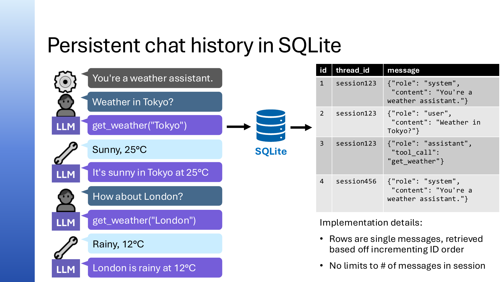
[Watch from 21:41](https://www.youtube.com/watch?v=BMzI9cEaGBM&t=1301s)

An alternative storage layout stores each message as a separate row with an auto-incrementing ID, a `thread_id` column (the session ID), and a `message_json` column. Retrieving a conversation means selecting all rows where `thread_id` matches, ordered by ID. This per-message row approach works well for databases with document size constraints, such as Cosmos DB. There are no built-in limits on the number of messages per session.

### Persistent chat history with custom storage

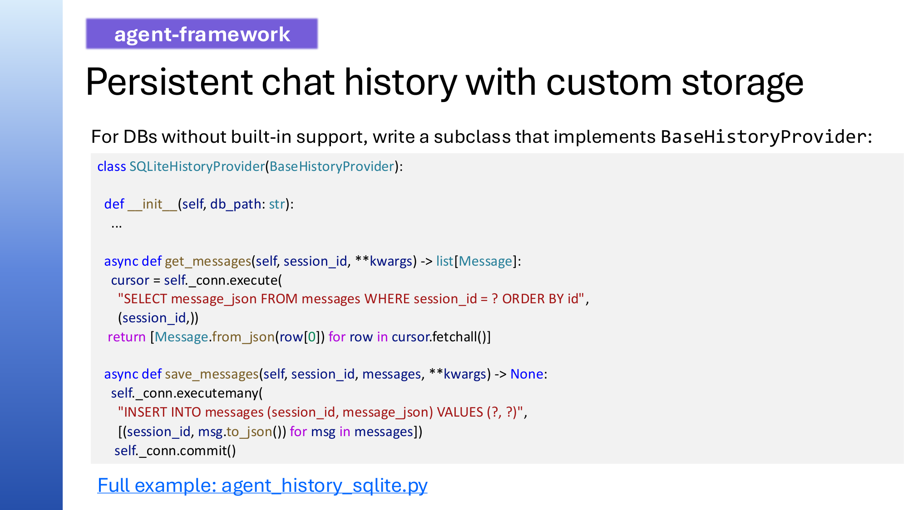
[Watch from 23:06](https://www.youtube.com/watch?v=BMzI9cEaGBM&t=1386s)

For databases without built-in support, create a subclass of `BaseHistoryProvider` from agent framework. The subclass needs two key methods: `get_messages(session_id)` which queries the database and returns a list of `Message` objects, and `save_messages(session_id, messages)` which inserts messages into the database. The same pattern works for PostgreSQL, Cosmos DB, Azure SQL, or any other database. SQLite is used here for development convenience -- in production, use a managed database. The choice between databases depends on whether you need search capabilities: PostgreSQL offers strong full-text and vector search, Azure AI Search provides excellent hybrid search, and Cosmos DB and Azure SQL both support hybrid search.

### Dynamic memory

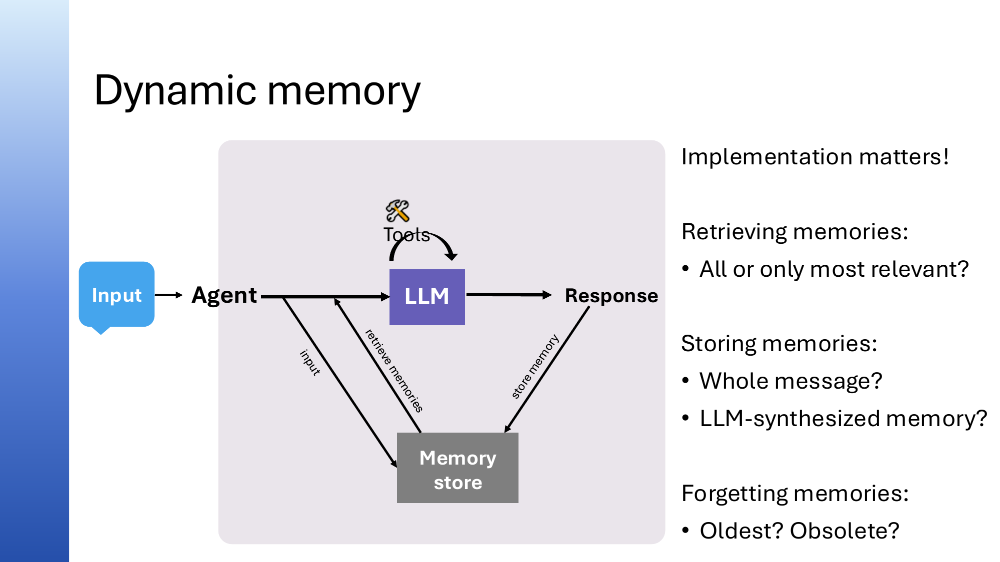
[Watch from 28:27](https://www.youtube.com/watch?v=BMzI9cEaGBM&t=1707s)

Dynamic memory lets an agent remember facts and preferences across conversations. The agent receives input, retrieves relevant memories from a memory store (often via search), and sends those memories to the LLM alongside the user's message. After the LLM responds, the system decides whether to store new memories. Key design decisions include: retrieving all memories vs. only the most relevant ones (via search), storing whole messages vs. LLM-synthesized memory summaries, and whether/how to forget obsolete memories.

### Dynamic memory design decisions

[Watch from 29:02](https://www.youtube.com/watch?v=BMzI9cEaGBM&t=1742s)

Retrieving memories can be done by returning all of them (if the set is small) or searching for the most relevant ones. Storing memories ranges from naive (save every message) to intelligent (use an LLM to extract important facts). Forgetting is optional but important for long-lived systems -- outdated facts (like a user's age or location) need to be updated or removed over time.

### Dynamic memory with Redis

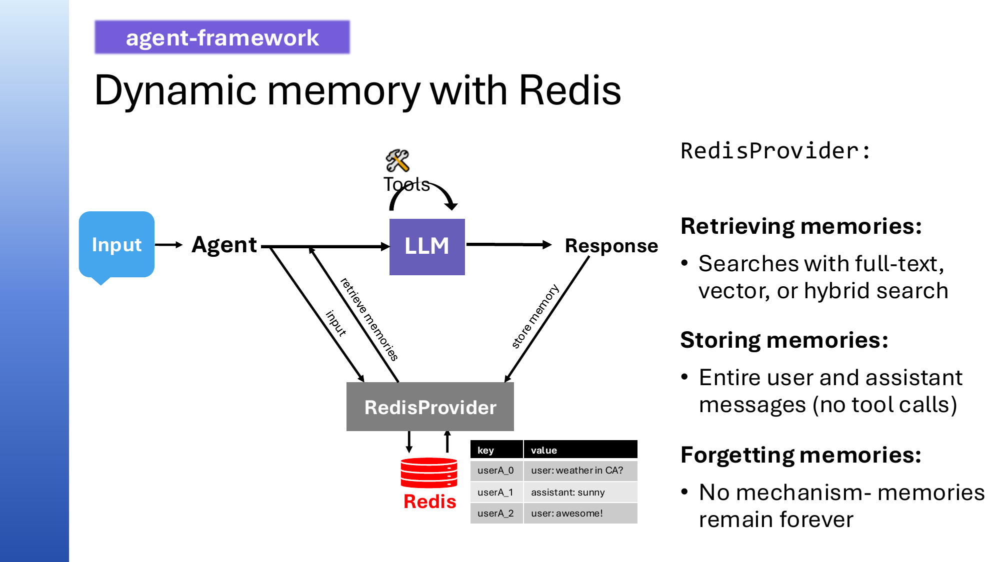
[Watch from 30:22](https://www.youtube.com/watch?v=BMzI9cEaGBM&t=1822s)

The Redis-based dynamic memory provider uses hybrid search (full-text, vector, or combined) to retrieve relevant memories. It stores entire user and assistant messages (excluding tool calls) -- a naive storage approach. There is no built-in mechanism for forgetting memories; they remain forever. Despite the naive storage, the approach works because the hybrid search filters to only relevant memories before sending them to the LLM.

### RedisContextProvider code

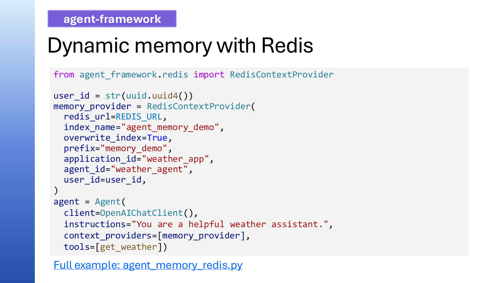
[Watch from 31:27](https://www.youtube.com/watch?v=BMzI9cEaGBM&t=1887s)

Import `RedisContextProvider` from `agent_framework.redis`. Configure it with a Redis URL, index name, prefix, application ID, agent ID, and a unique `user_id`. Memory is user-specific, so the `user_id` must be consistent across sessions -- typically derived from a login system like Microsoft Entra (using the OID). Pass the memory provider as a `context_providers` item to the `Agent`. The agent automatically runs the context provider before and after each interaction.

### Dynamic memory with Mem0

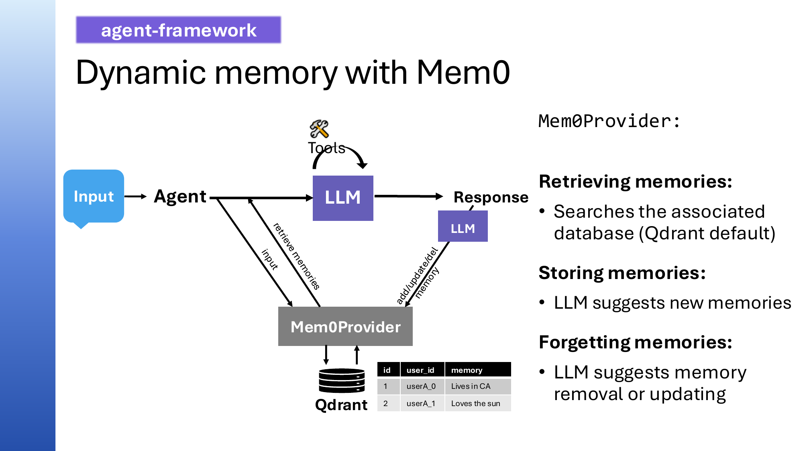
[Watch from 35:05](https://www.youtube.com/watch?v=BMzI9cEaGBM&t=2105s)

[Mem0](https://github.com/mem0ai/mem0) is an open-source memory package (also available as a hosted service) that provides a more sophisticated approach to dynamic memory. It uses an LLM to decide what to store rather than saving every message. By default it uses Qdrant as its vector database, but it can connect to Azure AI Search, PostgreSQL, or other databases. When retrieving memories, it searches the connected database. When storing, an LLM suggests new memories. When forgetting, an LLM recommends memory removal or updates.

### Mem0 memory update process

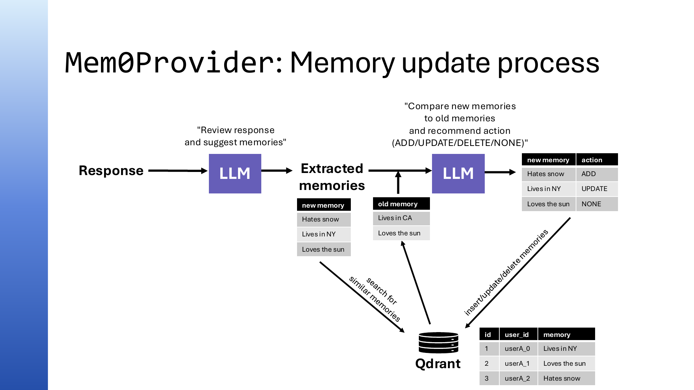
[Watch from 36:23](https://www.youtube.com/watch?v=BMzI9cEaGBM&t=2183s)

Mem0's memory update is a multi-step process. First, an LLM reviews the response and extracts potential new memories (e.g., "Hates snow", "Lives in NY", "Loves the sun"). Then Mem0 searches the database for related existing memories (e.g., "Lives in CA", "Loves the sun"). A second LLM call compares new and old memories and recommends actions: ADD for genuinely new facts, UPDATE when a fact has changed (e.g., moved from CA to NY), DELETE for contradicted memories, or NONE for redundant ones. This ensures memories stay current and non-duplicative. For example, if a user previously said they live in California but now says New York, the memory updates rather than storing both.

### Mem0ContextProvider code

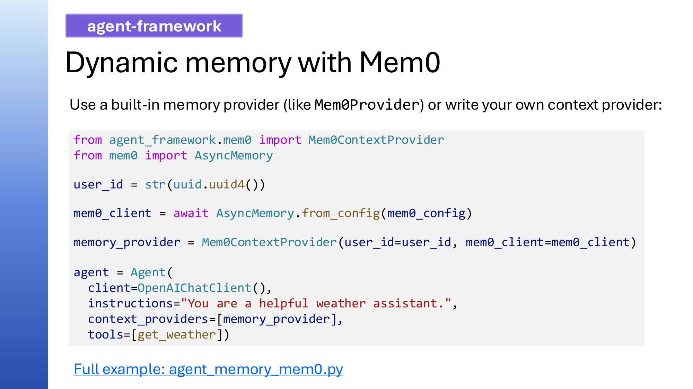
[Watch from 38:12](https://www.youtube.com/watch?v=BMzI9cEaGBM&t=2292s)

Import `Mem0ContextProvider` from `agent_framework.mem0` and `AsyncMemory` from `mem0`. Configure the Mem0 client with LLM connection details (supports Azure OpenAI, GitHub Models, and OpenAI), an embedding model, and optionally a custom database. Create the `Mem0ContextProvider` with a `user_id` and the configured client, then pass it as a `context_providers` item to the `Agent`. In testing, Mem0 stored memories like "Prefers Celsius" and "Favorite city is Tokyo" -- synthesized facts rather than raw messages. The configuration requires specifying both the LLM and embedding model separately from the agent's own model connection.

### Memory in production: GitHub Copilot

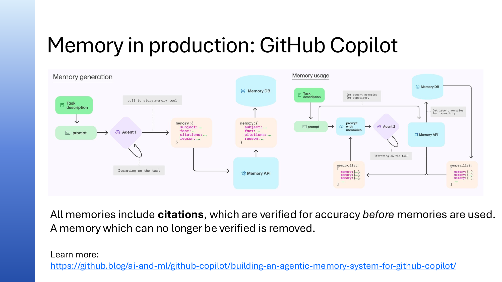
[Watch from 42:33](https://www.youtube.com/watch?v=BMzI9cEaGBM&t=2553s)

GitHub Copilot's memory system ties each memory to citations (line numbers in source code) so it can verify whether referenced code still exists. A memory that can no longer be verified is removed. This is a production-grade approach to memory obsolescence -- rather than keeping memories forever or using time-based expiry, it actively checks whether the source data backing each memory is still valid. See the [blog post on building an agentic memory system for GitHub Copilot](https://github.blog/ai-and-ml/github-copilot/building-an-agentic-memory-system-for-github-copilot/) for details.

### Knowledge retrieval

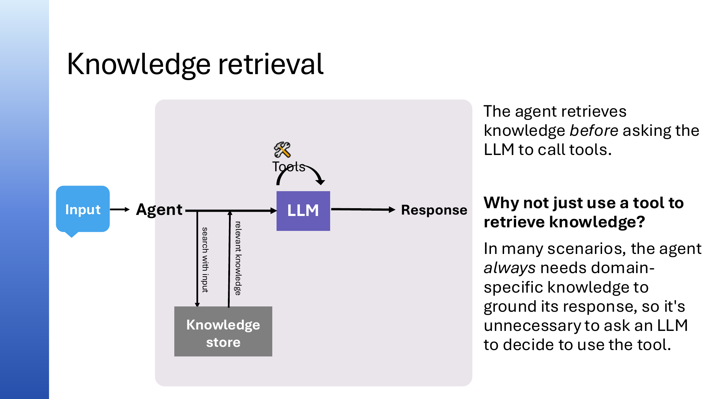
[Watch from 43:49](https://www.youtube.com/watch?v=BMzI9cEaGBM&t=2629s)

Knowledge retrieval as a context provider differs from knowledge retrieval via tools. A context provider always runs before the LLM, so the agent is guaranteed to have domain-specific knowledge for every interaction. A tool only runs when the LLM decides to call it. Use a context provider when the agent is domain-specific and always needs grounding data. Use a tool when knowledge retrieval is optional or one of many possible actions. Both approaches are valid -- the choice depends on the scenario.

### Knowledge retrieval from SQLite

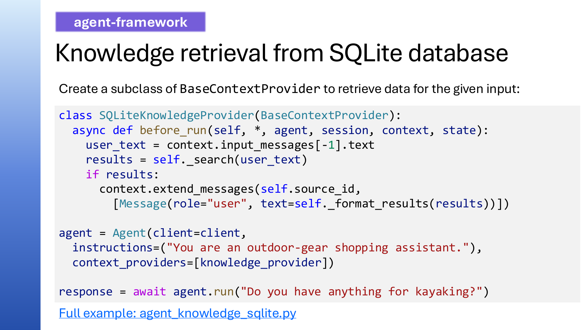
[Watch from 45:17](https://www.youtube.com/watch?v=BMzI9cEaGBM&t=2717s)

Create a subclass of `BaseContextProvider` and implement the `before_run` method. Extract the user's last message text, search the database, and if results are found, extend the conversation messages with the formatted results. Pass the provider to the `Agent` as a `context_providers` item. In the demo, a SQLite database contains outdoor gear products. When the user asks about hiking gear, the provider finds matching products and adds them to the context. When asked about surfboards, no matches are found and the agent responds accordingly.

### Hybrid search with keyword and vector retrieval

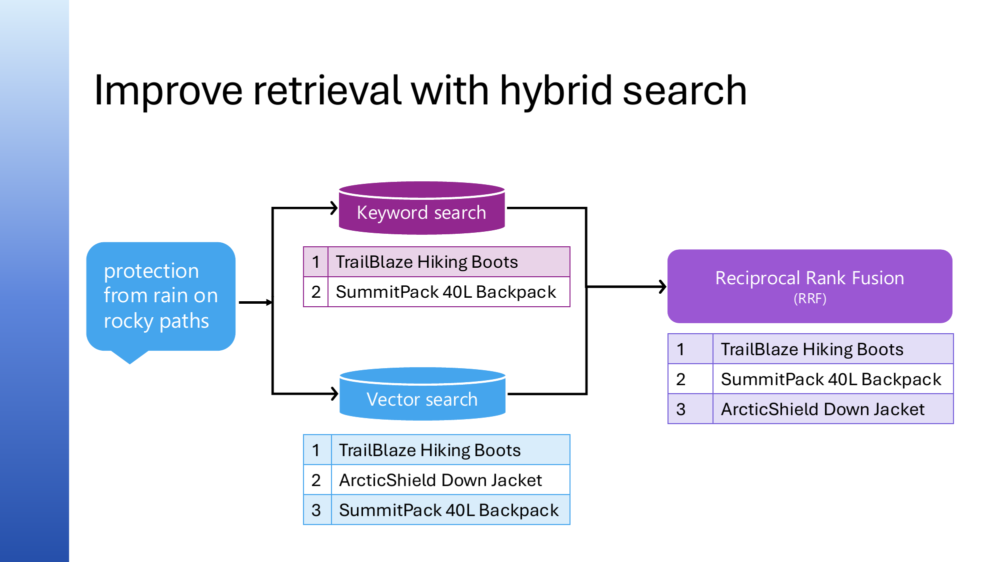
[Watch from 47:08](https://www.youtube.com/watch?v=BMzI9cEaGBM&t=2828s)

Hybrid search combines keyword search (matching exact terms) and vector search (matching semantic similarity) to get the best results. Each search returns a ranked list of results, which are merged using Reciprocal Rank Fusion (RRF). This captures both exact keyword matches and semantically similar results that may use different terminology. Hybrid search is a best practice for any retrieval system.

### Knowledge retrieval from PostgreSQL

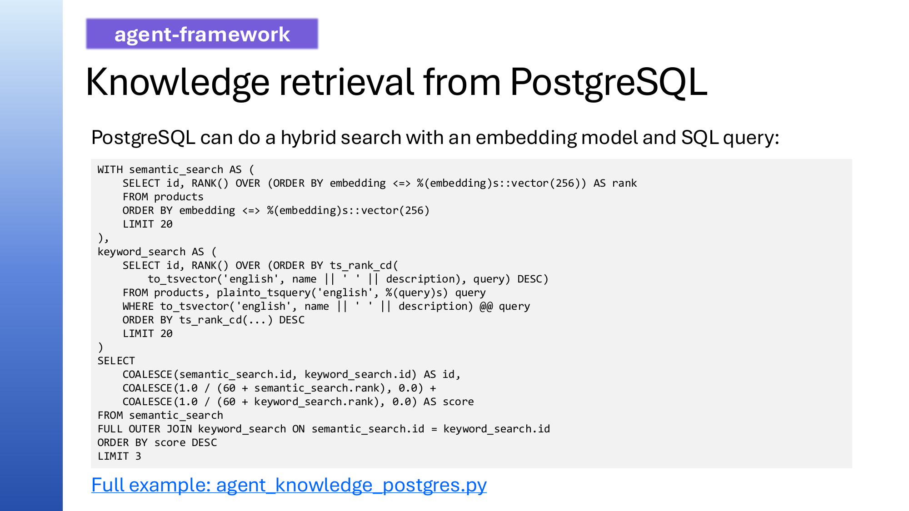
[Watch from 47:42](https://www.youtube.com/watch?v=BMzI9cEaGBM&t=2862s)

PostgreSQL supports both full-text search (via `tsvector` and `tsquery`) and vector search (via `pgvector`). The hybrid search query uses two CTEs: `semantic_search` ranks results by vector distance using `<=>` operator, and `keyword_search` ranks by `ts_rank_cd` score. A `FULL OUTER JOIN` merges results using RRF scoring: `1.0 / (60 + rank)` for each search type, summed together. The top results by combined score are returned.

### Query rewriting for multi-turn conversations

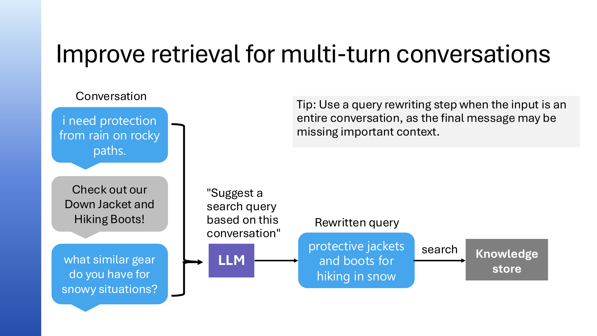
[Watch from 48:28](https://www.youtube.com/watch?v=BMzI9cEaGBM&t=2908s)

When a context provider receives a multi-turn conversation, the most recent user message may lack context. For example, "What similar gear do you have for snowy situations?" only makes sense in the context of a prior conversation about rain protection and hiking. A query rewriting step uses an LLM to transform the full conversation into an optimal search query like "protective jackets and boots for hiking in snow." This improves retrieval quality significantly. Note that if knowledge retrieval is implemented as a tool instead of a context provider, the LLM naturally handles query rewriting when deciding the tool arguments.

### Query rewriting in a context provider

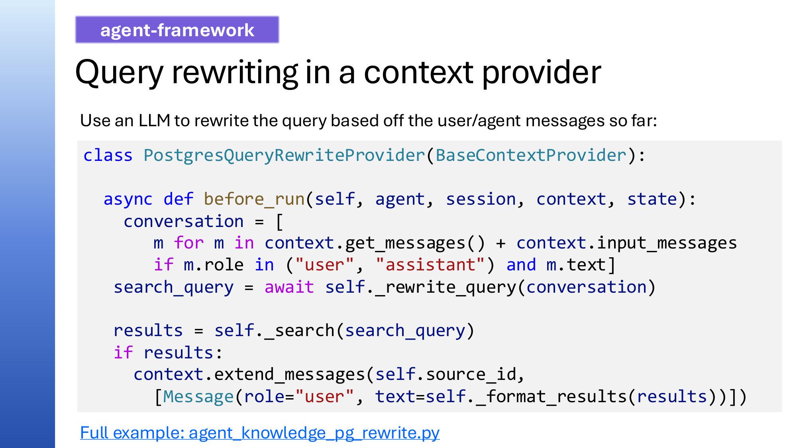
[Watch from 49:00](https://www.youtube.com/watch?v=BMzI9cEaGBM&t=2940s)

The `PostgresQueryRewriteProvider` subclass collects all user and assistant messages from the conversation, sends them to an LLM to rewrite into a search query, then uses that query to search the database. This adds an extra LLM call but produces better search results by incorporating the full conversation context.

### Knowledge retrieval with Azure AI Search

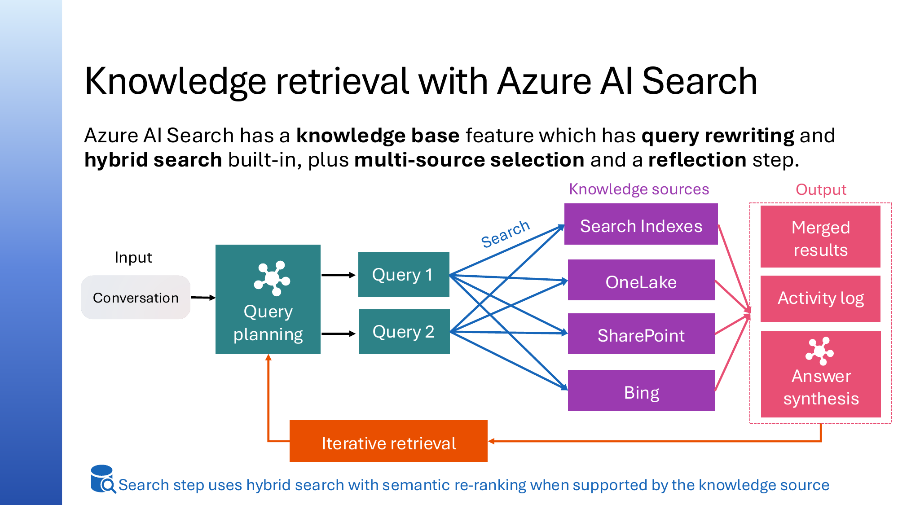
[Watch from 49:47](https://www.youtube.com/watch?v=BMzI9cEaGBM&t=2987s)

Azure AI Search's knowledge base feature combines query planning, hybrid search with semantic re-ranking, multi-source retrieval (Search Indexes, OneLake, SharePoint, Bing), iterative retrieval with a reflection step, and answer synthesis. It handles query rewriting automatically. This is a production-grade solution that encapsulates all the retrieval best practices shown earlier into a managed service.

### AzureAISearchContextProvider code

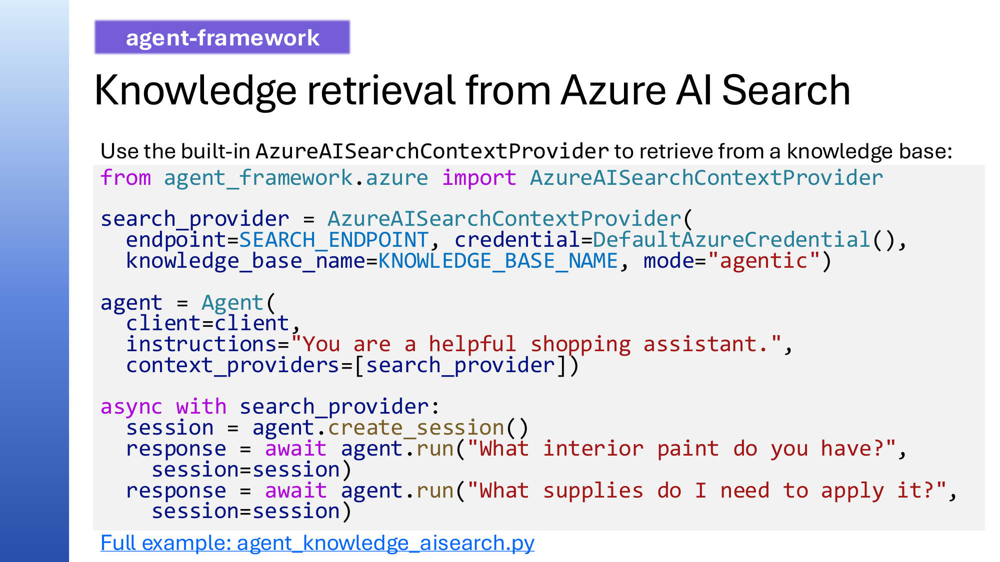
[Watch from 50:22](https://www.youtube.com/watch?v=BMzI9cEaGBM&t=3022s)

Import `AzureAISearchContextProvider` from `agent_framework.azure`. Configure it with an endpoint, credential (`DefaultAzureCredential`), knowledge base name, and mode (`"agentic"` for the full iterative retrieval pipeline). Pass it as a `context_providers` item. Use it within an `async with` block. This requires an Azure AI Search resource with a configured knowledge base -- it will not work in GitHub Codespaces without Azure setup. The key takeaway: context providers always run, tools run only when the LLM decides to call them.

### Context management

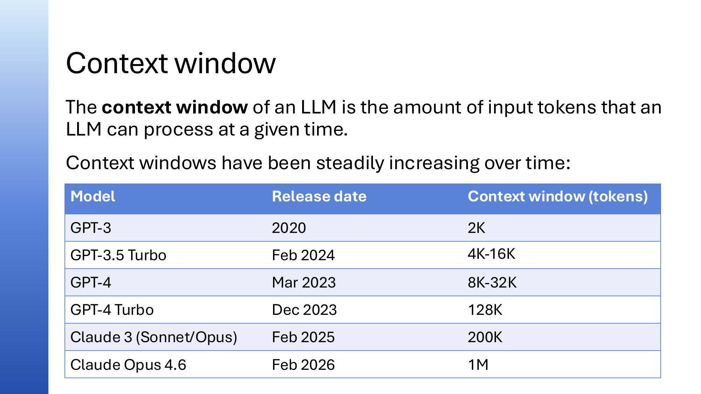
[Watch from 52:05](https://www.youtube.com/watch?v=BMzI9cEaGBM&t=3125s)

Every LLM has a finite context window -- the maximum input tokens it can process. Context windows have grown dramatically (GPT-3 at 2K tokens to Claude Opus 4.6 at 1M), but three problems remain. First, the windows are still finite (128K-2M). Second, LLM accuracy degrades as context grows -- research (including "Lost in the Middle" and Chroma's context rot research) shows that more input information leads to more missed details. Third, more tokens means higher cost and slower responses. The goal is to send only relevant context to the LLM.

### Context compaction with summarization

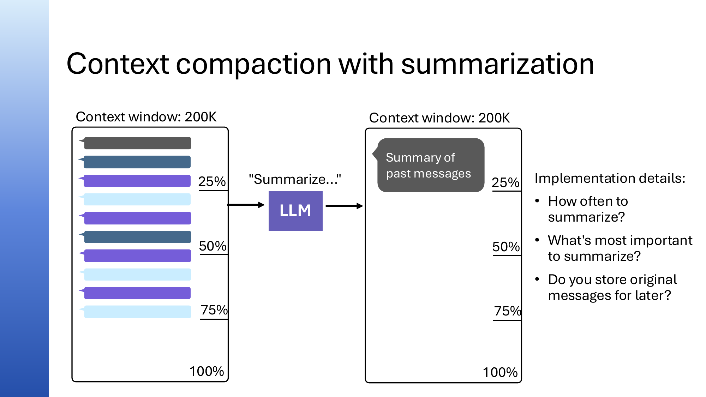
[Watch from 54:01](https://www.youtube.com/watch?v=BMzI9cEaGBM&t=3241s)

When the context approaches a threshold (e.g., 75% of the context window), the conversation is sent to an LLM for summarization. The summary replaces the original messages, dramatically reducing context size. This enables effectively infinite conversations because the history keeps getting compacted. Implementation decisions include how often to summarize, what to prioritize in the summary, and whether to store original messages elsewhere for later reference. This is the same technique used by GitHub Copilot when it displays "compacting conversation."

### Summarization middleware architecture

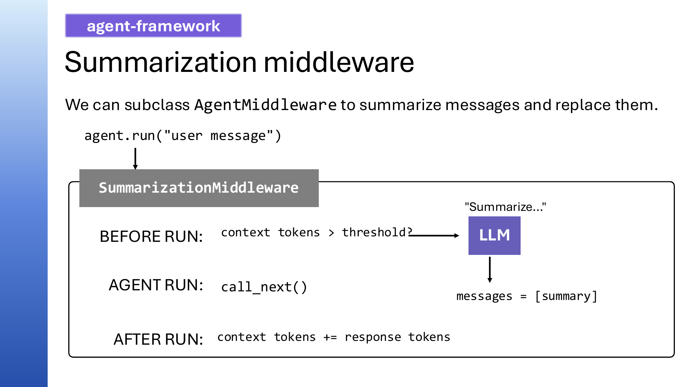
[Watch from 55:00](https://www.youtube.com/watch?v=BMzI9cEaGBM&t=3300s)

Middleware in agent framework intercepts stages of the agent's processing pipeline. The `SummarizationMiddleware` works in three phases: before the agent runs, it checks if token usage exceeds the threshold and if so, summarizes the history and replaces messages with the summary; during the agent run, it calls `call_next()` to proceed normally; after the agent runs, it tracks the total tokens used for the next threshold check.

### Summarization middleware code

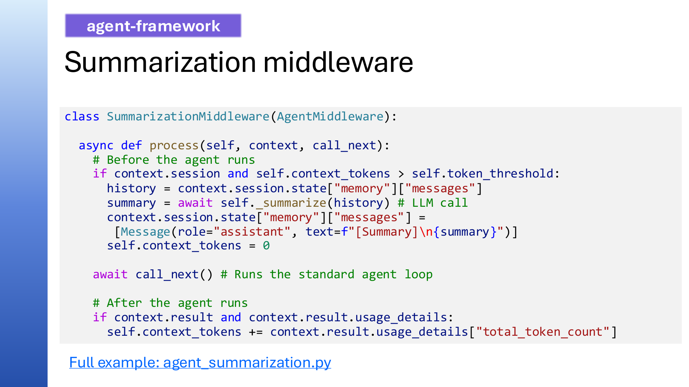
[Watch from 56:13](https://www.youtube.com/watch?v=BMzI9cEaGBM&t=3373s)

The `SummarizationMiddleware` subclass of `AgentMiddleware` keeps a running `context_tokens` count and a `token_threshold`. In the `process` method, if `context_tokens` exceeds the threshold, it gets all messages from session state, calls an LLM to summarize them, and replaces the session's messages with a single summary message prefixed with `[Summary]`. After `call_next()` runs the agent, it updates `context_tokens` from the response's `usage_details["total_token_count"]`. In the demo, the threshold is set very low (500 tokens) to trigger summarization frequently; in production, set it to a percentage of the model's context window (e.g., 75%).

### Context reduction with sub-agents

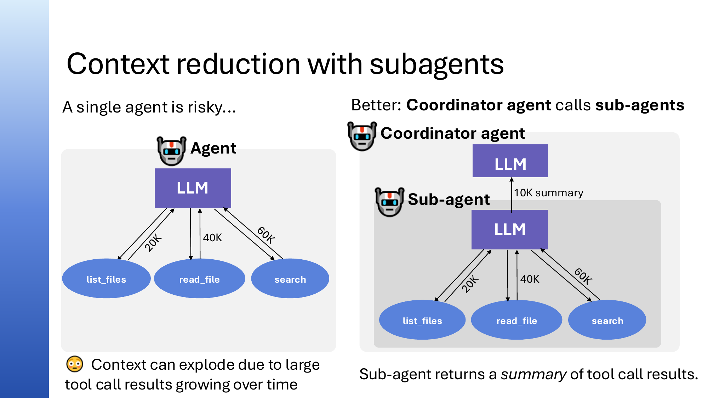
[Watch from 58:55](https://www.youtube.com/watch?v=BMzI9cEaGBM&t=3535s)

A single agent accumulates all tool call results in its context, which can grow large when tools return substantial data (e.g., reading entire source files). A coordinator-agent pattern delegates research to sub-agents that return only summaries. The coordinator never sees raw file contents -- only concise summaries. This keeps the coordinator's context small and focused, producing better responses because the LLM is not overwhelmed by irrelevant details.

### Coordinator agent with sub-agents code

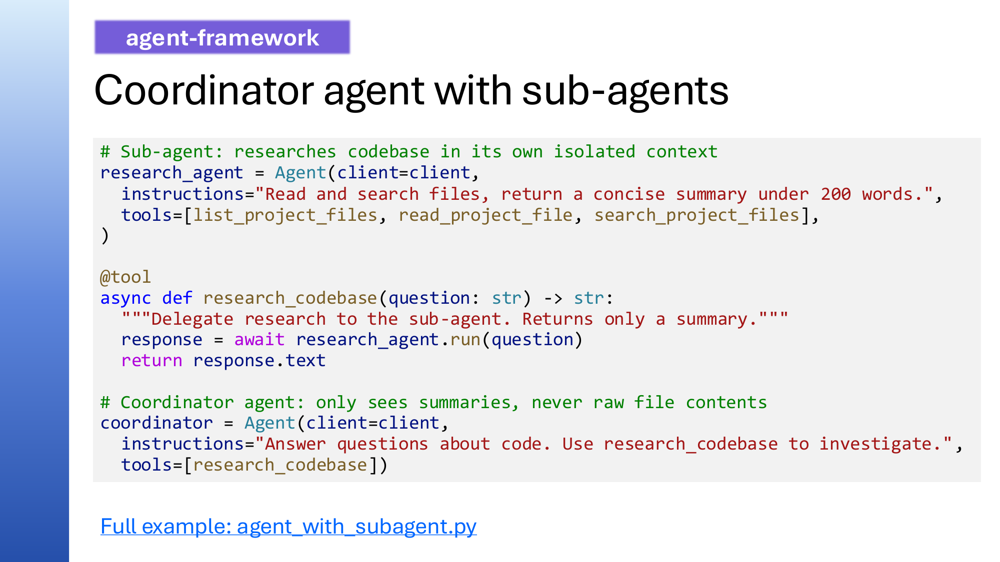
[Watch from 01:00:21](https://www.youtube.com/watch?v=BMzI9cEaGBM&t=3621s)

Define a research sub-agent with file-reading tools and instructions to return summaries under 200 words. Wrap it in a tool function (`research_codebase`) that runs the sub-agent and returns `response.text`. The coordinator agent has only the `research_codebase` tool and answers questions based on the summaries it receives. This is a common pattern for code agents where research can involve reading large files.

### Sub-agent token usage comparison

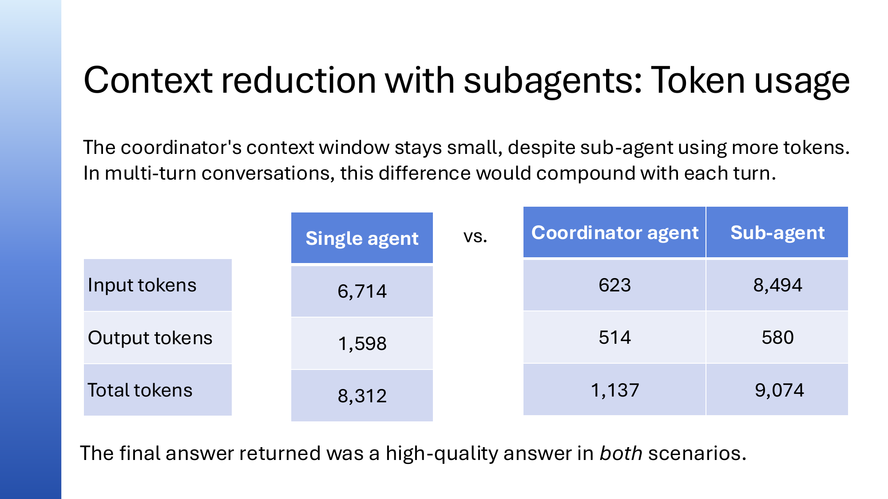
[Watch from 01:01:07](https://www.youtube.com/watch?v=BMzI9cEaGBM&t=3667s)

Comparing a single agent to the coordinator + sub-agent pattern: the single agent used 6,714 input tokens and 1,598 output tokens (8,312 total). The coordinator used only 623 input tokens and 514 output tokens (1,137 total), while the sub-agent used 8,494 input and 580 output (9,074 total). The coordinator received far fewer tokens, enabling a more focused response. The total token count across both agents was similar, but the coordinator's small context window is the key advantage -- especially in multi-turn conversations where context compounds with each turn. Both approaches produced high-quality answers.

### When to use sub-agents

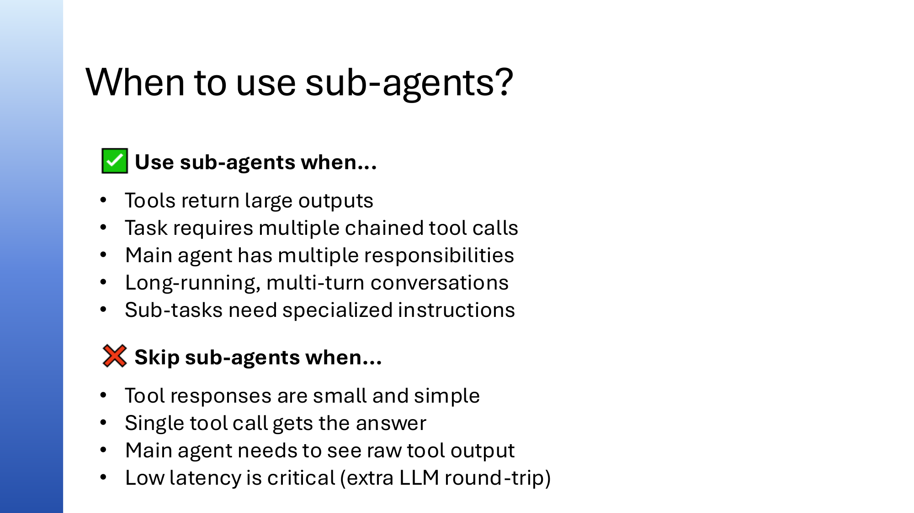
[Watch from 01:01:48](https://www.youtube.com/watch?v=BMzI9cEaGBM&t=3708s)

Use sub-agents when tools return large outputs, tasks require multiple chained tool calls, the main agent has multiple responsibilities, conversations are long-running and multi-turn, or sub-tasks need specialized instructions. Skip sub-agents when tool responses are small and simple, a single tool call gets the answer, the main agent needs to see raw tool output, or low latency is critical (sub-agents add an extra LLM round-trip).

### Next steps

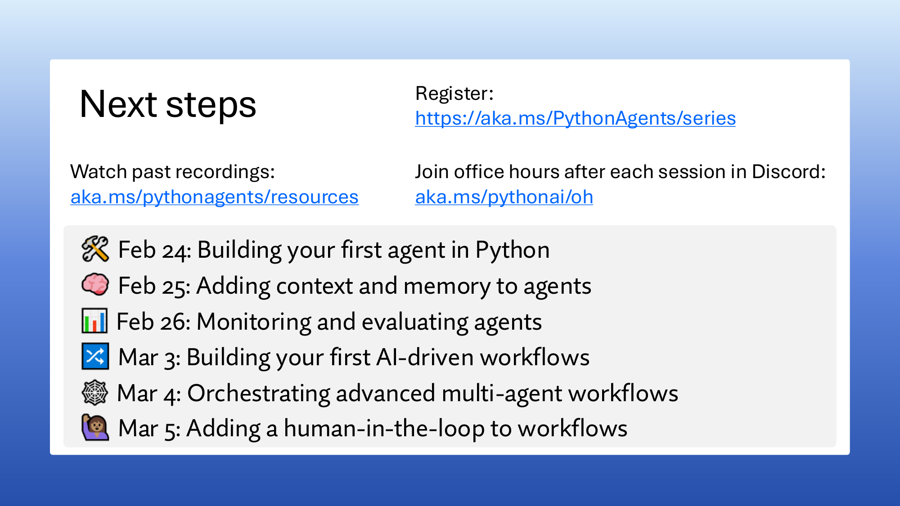
[Watch from 01:02:07](https://www.youtube.com/watch?v=BMzI9cEaGBM&t=3727s)

Register for the series at [aka.ms/PythonAgents/series](https://aka.ms/PythonAgents/series). Watch past recordings at [aka.ms/pythonagents/resources](https://aka.ms/pythonagents/resources). Join office hours after each session in Discord at [aka.ms/pythonai/oh](https://aka.ms/pythonai/oh). The next session covers monitoring and evaluating agents.

## Live Chat Q&A

### How do memory systems handle conflicting or changed user preferences?

Memory systems like MemZero use an LLM to reason about conflicts. If a new memory contradicts an old one (e.g., user previously hated sun but now loves it), the system updates the memory to reflect the latest preference rather than storing both. This dynamic update ensures memories remain accurate over time.

### Is blob storage suitable for chat history persistence?

Blob storage is generally not ideal for chat history due to the high frequency of reads and writes and the need to update conversations incrementally. Blob storage is optimized for large, immutable objects rather than many small updates. Databases with native support for incremental updates and search are preferred.

### What is the difference between using SQLite and vector databases like Chroma for storing chat history?

SQLite stores chat history as structured message records without native vector search capabilities. Vector databases like Chroma enable semantic similarity search on embedding vectors, improving retrieval for dynamic memory or knowledge but may not be optimized for storing full conversation logs. The choice depends on whether semantic search is required.

### When should knowledge retrieval be implemented as a context provider versus a tool?

Use a context provider when knowledge must always be retrieved and injected before agent processing, ensuring consistent domain context. Use a tool when retrieval is conditional and should be invoked selectively by the agent. The decision depends on how integral the knowledge is to every interaction.

### How often should summarization middleware compact conversations?

Summarization frequency depends on the token limit of the LLM and the application’s tolerance for latency. Typically, summarization triggers when the conversation approaches a threshold (e.g., 75% of the context window). Balancing summary detail and freshness is important to maintain response quality.

### Can sessions be shared across multiple agents?

Yes, sessions are portable conversation histories identified by unique IDs. Different agents can load the same session, enabling continuity across agents or devices. Serialization and deserialization of sessions ensure persistence and transferability.

## Discord Office Hours Q&A

### How can we configure the GitHub workspace to call paid, authenticated Azure LLMs?

📹 [0:54](https://youtube.com/watch?v=X0m0GxJRT0Y&t=54)

The [python-agentframework-demos](https://github.com/Azure-Samples/python-agentframework-demos) repo README has instructions for configuring model providers. If you're not using GitHub Models in a Codespace, you need to set up a `.env` file. Options:

- **GitHub Models locally**: Set up a personal access token as described in the README.
- **Azure AI Foundry models**: Use the Bicep provisioning included in the repo (`azd up`) which will write the `.env` file for you automatically. Or manually create a `.env` with your endpoint and chat deployment name.
- **Other providers**: OpenAI, Ollama, etc. are also supported with similar `.env` configuration.

The `.env.sample` shows the required variables: endpoint and chat deployment. By default, keyless authentication is used (no API key). If you want to use a key, you'd need to modify the code. Running `azd up` as suggested in the README will provision the resources and write the `.env` file automatically.

Links shared:

- [python-agentframework-demos README - Using Azure AI Foundry Models](https://github.com/Azure-Samples/python-agentframework-demos?tab=readme-ov-file#using-azure-ai-foundry-models)

### Will this series cover hosting agents in Azure, such as options and best practices?

📹 [4:11](https://youtube.com/watch?v=X0m0GxJRT0Y&t=251)

The original plan was to do a separate follow-up series specifically about hosting agents on Azure, since this series emphasizes code you can run locally (mostly free with GitHub Models). However, there's been a lot of demand for deployment content.

Next week's session (Session 3) will include one deployment example using Azure Container Apps. But there are many more options:

- **Azure Container Apps** — just requires writing a Dockerfile for your Python agent
- **Azure Functions**
- **Container App Jobs** — for long-running workflows
- **Foundry Hosted Agents**

For Container Apps specifically, it's really about writing the right Dockerfile. For example, deploying an agent using the Playwright MCP server requires a Dockerfile that installs both Python and npm/Playwright.

The [official documentation on hosting options](https://learn.microsoft.com/en-us/agent-framework/get-started/hosting?pivots=programming-language-python) covers some of these, though it doesn't mention Container Apps specifically (since that's just a Docker container).

Links shared:

- [Agent Framework hosting documentation](https://learn.microsoft.com/en-us/agent-framework/get-started/hosting?pivots=programming-language-python)
- [Playwright MCP on Azure Container Apps example](https://github.com/simonjj/playwright-mcp-on-aca)

### How should you manage multi-tier memory to store lots of information while keeping local storage manageable?

📹 [7:09](https://youtube.com/watch?v=X0m0GxJRT0Y&t=429)

The session demos used mem0's basic option, but mem0 offers more advanced features including **graph memory** for remembering entities and relationships. User memories typically go into the system prompt, while conversation history stays as messages in the thread — these are handled separately.

For inspiration, look at existing memory systems. For example, you can inspect GitHub Copilot's memory to see what memories are being stored and how summarization works.

Links shared:

- [mem0 Graph Memory documentation](https://docs.mem0.ai/open-source/features/graph-memory)

### Should the original conversation be saved when summarizing, or is it useful to toss the details?

📹 [21:55](https://youtube.com/watch?v=X0m0GxJRT0Y&t=1315)

You could definitely store the original in memory as long as you're not worried about memory constraints (it's just text). For inspiration on how to implement summarization, look at LangChain's built-in summarization middleware — the session's middleware example was inspired by it, though simplified.

A cautionary tale about summarization: Pamela shared an experience where GitHub Copilot compacted a conversation and lost critical context. She said "yes please" to a one-line caption request, but after summarization, Copilot interpreted the "yes please" as agreement to implement an entire plan. Key takeaways:

- Be very careful that summarization retains the most recent context
- Consider only summarizing everything *before* the last message
- In your summarizer prompt, account for short follow-up messages like "yes please" that reference specific prior context
- Set up example conversations as test cases for your summarization to evaluate edge cases like this

Links shared:

- [LangChain context editing middleware](https://github.com/langchain-ai/langchain/blob/94a58825d352e15b2f5a132859b08827f7b208fb/libs/langchain_v1/langchain/agents/middleware/context_editing.py)

### What's a good plan to learn how to build agents with the Agent Framework?

📹 [9:01](https://youtube.com/watch?v=X0m0GxJRT0Y&t=541)

1. **Run all the examples** from the session and make sure you understand them
2. **Ask Copilot questions** about code you don't understand — it can dig into the Agent Framework source code and explain things
3. **Pick one example and build on it** — extend something that already works for a scenario relevant to you (home life, developer workflows, etc.)
4. **Choose a domain you have expertise in** — this is critical because LLMs can be convincingly wrong, so you need to be able to evaluate whether the agent's answers are good

Links shared:

- [Python + Agents Session 1 write-up](https://github.com/pamelafox/presentation-writeups/blob/main/presentations/python-agents-session1/outputs/writeup.md)

### VS Code often forgets you have a venv in your project — does it swap that knowledge out of its memory?

📹 [11:18](https://youtube.com/watch?v=X0m0GxJRT0Y&t=678)

To investigate what information Copilot actually receives, use the **Chat Debug View**: click the "..." menu in the Copilot chat panel and select "Show Chat Debug View." This reveals everything sent to the LLM, including:

- All available tools
- The full system prompt from GitHub Copilot
- Memory guidelines and stored memories (user and repository memories)
- Environment info (OS, workspace folders)
- Current date, terminal info, last command run

In the demo, the environment info listed the OS as Linux (because of the dev container) and showed workspace folders, but did *not* mention the venv — even though one existed. This might be because the venv is in `.gitignore`. The Python environment tools *should* return this info, but it may not always work correctly. If you encounter this bug, use the thumbs-down button to report an issue — it pre-fills your VS Code info and routes it to the right repo.

### Why would you use Agent Framework instead of the Foundry SDK, and why consider non-Foundry hosting options?

📹 [15:01](https://youtube.com/watch?v=X0m0GxJRT0Y&t=901)

**Foundry SDK / Foundry Agents** run the entire agent loop in the cloud. Benefits:

- Built-in tools (Bing search, code interpreter) are easy to use since the agent is already running in Azure
- Built-in session management with threads — no need to set up your own database
- Less setup overall

**Drawbacks of hosted agents:**

- Less flexibility — you can't add middleware at as many points as with Agent Framework
- If the agentic loop runs in the cloud, it's harder to insert yourself into it and customize
- The portal experience may not expose all SDK capabilities
- Foundry is undergoing significant changes (Classic vs New UI, hub-based vs new projects, agents v1 vs v2)

**When to choose Agent Framework:** If you need deep customization, extensive middleware, or find yourself hitting limitations with the hosted service. You can also host Agent Framework apps on Foundry as "hosted agents" to get some Foundry management benefits.

**When Foundry SDK is fine:** If it has everything you need and you don't find yourself needing more customization.

Links shared:

- [Azure AI Foundry SDK overview](https://learn.microsoft.com/en-us/azure/ai-foundry/how-to/develop/sdk-overview?view=foundry-classic&pivots=programming-language-python)

### Can you confirm that designing your overall project cannot be LLM agnostic?

📹 [17:45](https://youtube.com/watch?v=X0m0GxJRT0Y&t=1065)

The demos use the OpenAI chat completions API, which is widely supported (OpenAI models, Azure OpenAI, Ollama, many others). However, OpenAI has introduced the **Responses API**, which is more agentic:

- Supports built-in tools (code interpreter, web search on Azure)
- Has a notion of state (stateful or stateless)
- Azure is standardizing on Responses API
- Foundry provides a generic Responses API layer across *all* its models (DeepSeek, Mistral, Llama, etc.)

The series used chat completions because **GitHub Models doesn't support Responses API yet**, and the demos were designed to run on GitHub Models. In production, the recommendation is to use **Responses API** for maximum model agnosticism when models are on Foundry — you can then point at any Foundry model and your code will work.

Links shared:

- [AI Model Starter Kit (Responses API examples)](https://github.com/Azure-Samples/ai-model-start?tab=readme-ov-file#the-ai-model-starter-kit)

### What are the issues with Foundry?

📹 [30:27](https://youtube.com/watch?v=X0m0GxJRT0Y&t=1827)

There's a lot changing in the Foundry ecosystem:

- **Two kinds of projects**: hub-based projects and the new Foundry projects
- **Two UIs**: Foundry Classic and Foundry New — some features work in one but not the other
- **Two agent service versions**: agents v1 and agents v2
- **Breaking changes** as things evolve

You need to keep track of which kind of project you're in, which UI you're using, and which agent service version you're on.

### Is Foundry IQ using GraphRAG with knowledge graphs?

📹 [31:34](https://youtube.com/watch?v=X0m0GxJRT0Y&t=1894)

First, clarification on the three "IQ" services at Microsoft:

- **Foundry IQ** — basically Azure AI Search's knowledge-base feature
- **Fabric IQ** — built on top of Microsoft Fabric ontologies
- **Work IQ** — built on top of Microsoft Graph, available as an MCP server

Foundry IQ does **not** use GraphRAG at this point. The AI Search team has looked into it but hasn't found a good way to productionize graph RAG queries efficiently with consistent results. The team is also exploring other retrieval improvements like **ColBERT** (multi-vector embeddings), but the challenge is always making research approaches work at production scale for everyone.

Links shared:

- [Weaviate multi-vector embeddings tutorial](https://docs.weaviate.io/weaviate/tutorials/multi-vector-embeddings)

### Is there any middleware for context caching that can cut down on token usage?

📹 [33:32](https://youtube.com/watch?v=X0m0GxJRT0Y&t=2012)

There are two different kinds of caching to consider:

**LLM-level caching** (handled by the model provider):

- Anthropic models have long-context caching
- OpenAI models cache structured output JSON schemas (first call is slow, subsequent calls are faster)
- Many LLMs implement system prompt caching — if you keep the first N tokens of the system prompt the same, they'll be cached
- You can take advantage of this by keeping your system prompt prefix stable

**Middleware-level token reduction** (your code):

- Truncation — removing oldest messages (risks losing important context)
- Heuristic-based removal — e.g., LangChain's context editing middleware clears older tool results after a certain number
- The key is having a heuristic that doesn't require an LLM call to determine what to remove
- Always evaluate whether your heuristic still produces good results

### Does model routing save tokens?

📹 [39:45](https://youtube.com/watch?v=X0m0GxJRT0Y&t=2385)

Model routing can save costs by using cheaper LLMs for simpler questions. It can also indirectly reduce token usage because some LLMs are more verbose than others — for example, some models generate 10 different queries for AI Search while others generate only 2. You can also control verbosity through system prompts or by cutting off excessive tool calls.

Links shared:

- [Performance Benchmarking LLM Models (Anthony Shaw)](https://tonybaloney.github.io/posts/performance-benchmarking-llm-models.html)

### Do we have examples with App Service and UV on Azure?

📹 [36:54](https://youtube.com/watch?v=X0m0GxJRT0Y&t=2214)

App Service for Linux announced UV support in November 2025 via a [blog post](https://techcommunity.microsoft.com/blog/appsonazureblog/what%E2%80%99s-new-for-python-on-app-service-for-linux-pyproject-toml-uv-and-more/4468903). Gwen Sadler (from the team) has been working with the App Service team on this. Attendees reported issues getting it to work — Gwen and others were encouraged to collaborate and report any bugs to the App Service team.

Links shared:

- [What's new for Python on App Service for Linux: pyproject.toml, UV, and more](https://techcommunity.microsoft.com/blog/appsonazureblog/what%E2%80%99s-new-for-python-on-app-service-for-linux-pyproject-toml-uv-and-more/4468903)

### Is it possible to use skills (like GitHub Copilot skills) in the Microsoft Agent Framework?

📹 [38:17](https://youtube.com/watch?v=X0m0GxJRT0Y&t=2297)

Yes! Support was just recently added. The .NET support shipped first, and Python support was merged as a [PR #4210](https://github.com/microsoft/agent-framework/pull/4210). It's implemented as a **context provider** — if you have skills defined in the file system, you can advertise them to the agent. To try it, you'll need to point your dependency at the latest main branch of the Agent Framework, update the git hash, run `uv sync`, and test it out.

Links shared:

- [Agent Framework PR #4210 - Python agent skills support](https://github.com/microsoft/agent-framework/pull/4210)

### What about the TOON notation format for reducing token usage?

📹 [41:44](https://youtube.com/watch?v=X0m0GxJRT0Y&t=2504)

Be cautious about new notation formats designed to save tokens. Research (shared by Drew Brunig) found that **saving a handful of tokens in the data format is wasted if models are not trained on the format**. In testing, TOON actually consumed *more* tokens because models didn't understand the syntax and couldn't use it well.

The same principle applies generally: we benefit enormously from the fact that LLMs know existing formats like YAML deeply — they understand its syntax, know PyYAML for parsing, and can interact with it in many ways. Even if everyone "silently hates YAML," it works well with LLMs because they're trained on it extensively.

For context-related topics, Pamela recommended following Drew Brunig, who is writing a book on the subject.

Links shared:

- [TOON format](https://github.com/toon-format/toon)
