# Python + Agents (Session 5): Orchestrating advanced multi-agent workflows

📺 [Watch the full recording on YouTube](https://www.youtube.com/watch?v=WtZbDrd-RJg) |
📑 [Download the slides (PDF)](https://aka.ms/pythonagents/slides/advancedworkflows)

This write-up includes an annotated version of the presentation slides with timestamps to the video plus a summary of the live Q&A sessions.

## Table of contents

- [Session description](#session-description)
- [Annotated slides](#annotated-slides)
  - [Overview of the Python and Agents series](#overview-of-the-python-and-agents-series)
  - [Orchestrating advanced multi-agent workflows](#orchestrating-advanced-multi-agent-workflows)
  - [Agenda: advanced workflow patterns](#agenda-advanced-workflow-patterns)
  - [Following along with the GitHub repo and Codespaces](#following-along-with-the-github-repo-and-codespaces)
  - [Recap: what is an agentic workflow](#recap-what-is-an-agentic-workflow)
  - [Concurrent execution](#concurrent-execution)
  - [Sequential execution vs. concurrent execution](#sequential-execution-vs-concurrent-execution)
  - [Anatomy of a concurrent workflow](#anatomy-of-a-concurrent-workflow)
  - [Using fan-in and fan-out edges in workflows](#using-fan-in-and-fan-out-edges-in-workflows)
  - [Aggregating results from fan-out edges](#aggregating-results-from-fan-out-edges)
  - [Aggregation](#aggregation)
  - [Aggregation patterns for fan-in agents](#aggregation-patterns-for-fan-in-agents)
  - [Aggregation with LLM summary](#aggregation-with-llm-summary)
  - [Aggregation with structured extraction](#aggregation-with-structured-extraction)
  - [Aggregation with LLM ranking](#aggregation-with-llm-ranking)
  - [Aggregation with majority vote](#aggregation-with-majority-vote)
  - [Conditional routing + concurrency](#conditional-routing--concurrency)
  - [Conditional routing with concurrent execution](#conditional-routing-with-concurrent-execution)
  - [Workflows with multi-selection edge groups](#workflows-with-multi-selection-edge-groups)
  - [Built-in workflow orchestrations](#built-in-workflow-orchestrations)
  - [ConcurrentBuilder](#concurrentbuilder)
  - [Using the built-in ConcurrentBuilder workflow](#using-the-built-in-concurrentbuilder-workflow)
  - [MagenticBuilder for dynamic planning](#magenticbuilder-for-dynamic-planning)
  - [Magentic-One workflow orchestration](#magentic-one-workflow-orchestration)
  - [Magentic-One: initial plan development](#magentic-one-initial-plan-development)
  - [Magentic-One: progress ledger updates](#magentic-one-progress-ledger-updates)
  - [Using the built-in MagenticBuilder workflow](#using-the-built-in-magenticbuilder-workflow)
  - [Magentic orchestration vs. Agent-as-tools](#magentic-orchestration-vs-agent-as-tools)
  - [Dynamic routing with HandoffBuilder](#dynamic-routing-with-handoffbuilder)
  - [From fixed graphs to dynamic routing](#from-fixed-graphs-to-dynamic-routing)
  - [Handoff orchestration](#handoff-orchestration)
  - [Using the built-in HandoffBuilder workflow](#using-the-built-in-handoffbuilder-workflow)
  - [HandoffBuilder with handoff rules](#handoffbuilder-with-handoff-rules)
  - [Handoff orchestration vs. Agent-as-tools](#handoff-orchestration-vs-agent-as-tools)
  - [End-to-end application](#end-to-end-application)
  - [Agentic AI investment analysis](#agentic-ai-investment-analysis)
  - [Investment workflow with fan-out and fan-in](#investment-workflow-with-fan-out-and-fan-in)
  - [What-if workflow with fan-in and fan-out](#what-if-workflow-with-fan-in-and-fan-out)
  - [Next steps and resources](#next-steps-and-resources)
- [Live Chat Q&A](#live-chat-qa)
- [Discord Office Hours Q&A](#discord-office-hours-qa)

## Session description

In session 5 of the Python + Agents series, the focus moved beyond workflow fundamentals to explore how to orchestrate advanced, multi-agent workflows using the Microsoft Agent Framework.

The session began by comparing sequential vs. concurrent execution, then dove into techniques for running workflow steps in parallel. Fan-out and fan-in edges enabled multiple branches to run at the same time, with several aggregation patterns for combining their results — including LLM summarization, structured extraction, ranking, and majority voting.

From there, the session introduced three multi-agent orchestration approaches built into the framework: ConcurrentBuilder for simplified fan-out/fan-in, HandoffBuilder where control moves entirely from one agent to another based on workflow logic, and MagenticBuilder, a planning-oriented supervisor that generates a high-level plan and delegates portions to other agents. The session wrapped up with a demo of an end-to-end application showcasing a concurrent multi-agent workflow in action.

## Annotated slides

### Overview of the Python and Agents series


[Watch from 00:50](https://www.youtube.com/watch?v=WtZbDrd-RJg&t=50s)

This is a six-part live stream series on building AI agents with the Microsoft Agent Framework in Python. Week one covered building agents, adding context and memory, and monitoring and evaluation. Week two focuses on workflows: session 4 introduced workflow fundamentals, session 5 (this one) covers advanced multi-agent workflows, and session 6 adds human-in-the-loop. All sessions are recorded and available with slides and code. Registration at [aka.ms/PythonAgents/series](https://aka.ms/PythonAgents/series) provides email notifications.

### Orchestrating advanced multi-agent workflows

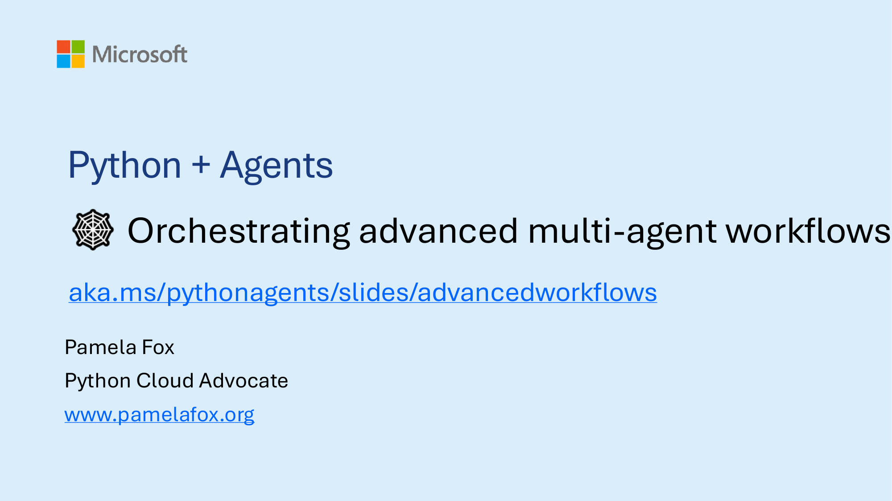
[Watch from 01:01](https://www.youtube.com/watch?v=WtZbDrd-RJg&t=61s)

This session covers orchestrating advanced multi-agent workflows using the Microsoft Agent Framework. Slides are available at [aka.ms/pythonagents/slides/advancedworkflows](https://aka.ms/pythonagents/slides/advancedworkflows).

### Agenda: advanced workflow patterns

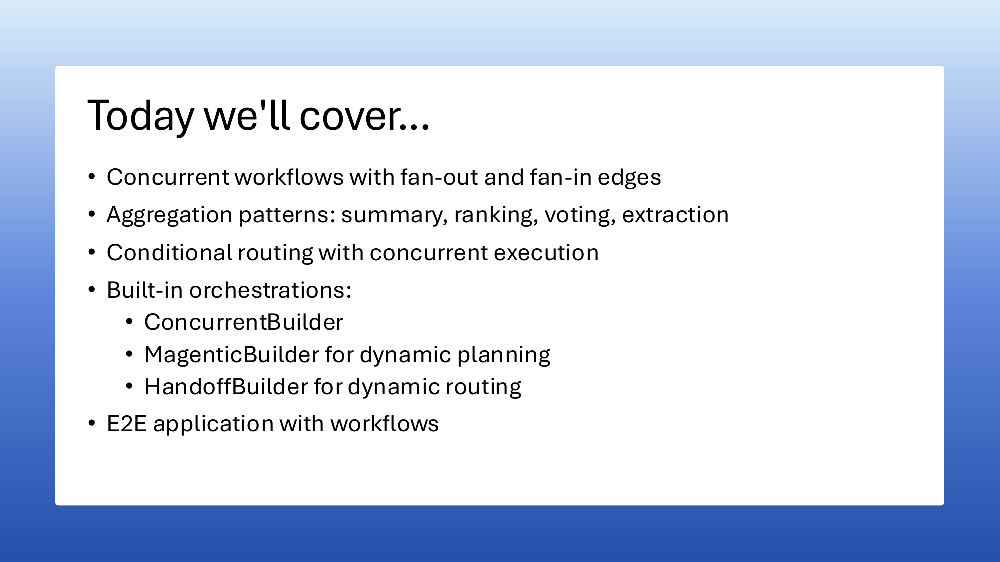
[Watch from 01:36](https://www.youtube.com/watch?v=WtZbDrd-RJg&t=96s)

The agenda covers concurrent workflows with fan-out and fan-in edges, aggregation patterns (summary, ranking, voting, extraction), conditional routing with concurrent execution, three built-in orchestrations (ConcurrentBuilder, MagenticBuilder, HandoffBuilder), and a demo of an end-to-end application with workflows.

### Following along with the GitHub repo and Codespaces

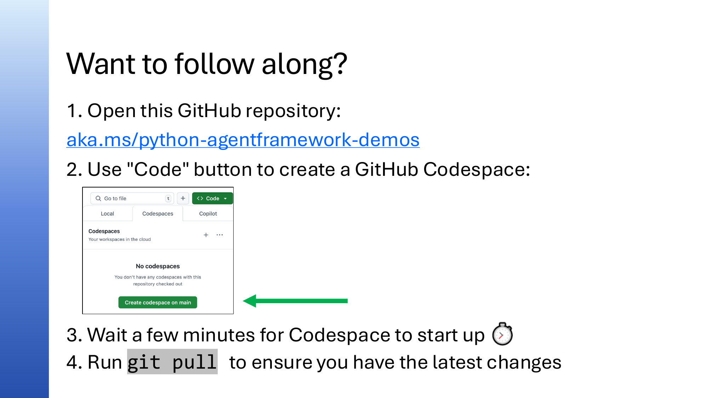
[Watch from 02:05](https://www.youtube.com/watch?v=WtZbDrd-RJg&t=125s)

All code is in the same GitHub repository used throughout the series at [aka.ms/python-agentframework-demos](https://aka.ms/python-agentframework-demos). Clicking the "Code" button and selecting "Create codespace on main" opens a preconfigured VS Code environment in the browser with Python, UV, and all dependencies installed. The Codespace uses GitHub Models for LLM calls, which are free with a GitHub account but rate-limited. Running `git pull` is recommended to get the latest examples. The code also works with Microsoft Foundry models and OpenAI.

### Recap: what is an agentic workflow

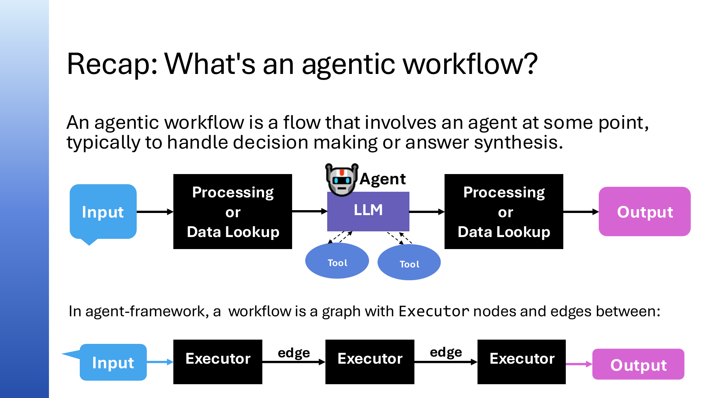
[Watch from 04:05](https://www.youtube.com/watch?v=WtZbDrd-RJg&t=245s)

An agentic workflow is a flow that involves an agent at some point, typically for decision-making or answer synthesis. In the Microsoft Agent Framework, a workflow is a graph with Executor nodes and edges between them. Executors can be agents (with LLM calls), pure processing steps, or data lookups. Session 4 covered the basics of building workflows with sequential executors, edges, conditional branching, structured outputs, and state management. This session builds on those concepts with concurrent execution and multi-agent orchestration.

### Concurrent execution

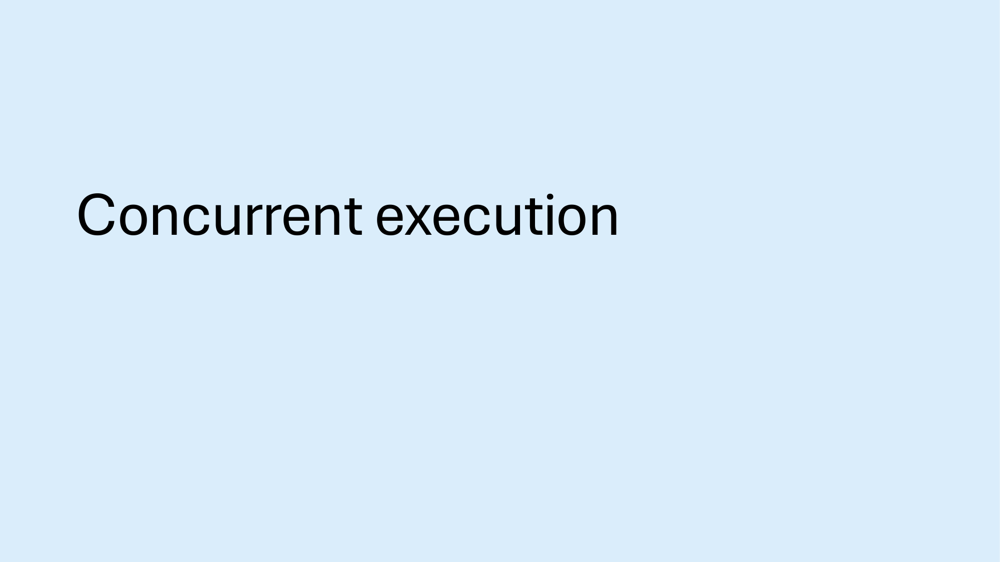
[Watch from 04:54](https://www.youtube.com/watch?v=WtZbDrd-RJg&t=294s)

This section introduces concurrent execution in workflows, where multiple executors run in parallel instead of sequentially.

### Sequential execution vs. concurrent execution

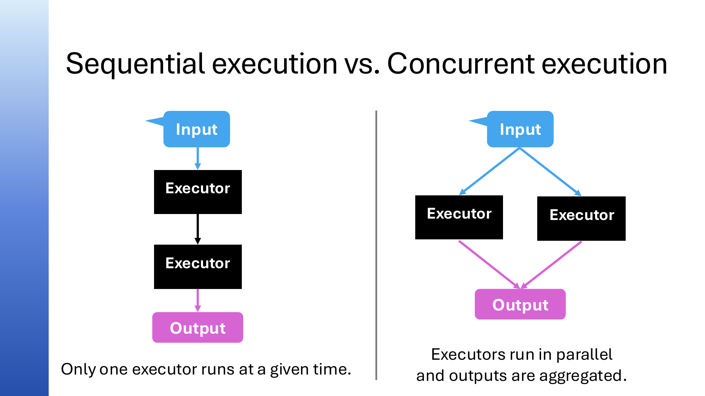
[Watch from 05:00](https://www.youtube.com/watch?v=WtZbDrd-RJg&t=300s)

In sequential execution, only one executor runs at a time — input flows through executors one after another. Even with conditional routing (introduced in session 4), execution is still one-at-a-time. In concurrent execution, the input fans out to multiple executors that run in parallel, and their outputs are aggregated. This is useful when executors have independent tasks with no dependencies between them, enabling faster completion through parallel computing. Each concurrent executor may make its own LLM calls, so the LLM endpoint needs enough capacity to handle simultaneous requests.

### Anatomy of a concurrent workflow

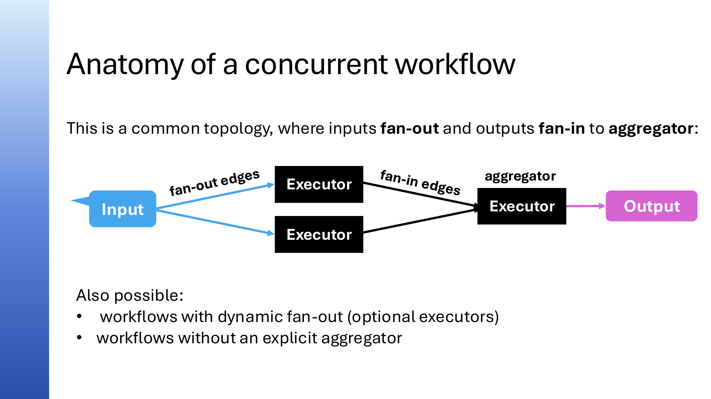
[Watch from 06:32](https://www.youtube.com/watch?v=WtZbDrd-RJg&t=392s)

The most common concurrent workflow topology has three stages: input fans out to multiple executors via fan-out edges, those executors process in parallel, and their outputs fan back in to an aggregator via fan-in edges. Variations include dynamic fan-out (where some executors are optional) and workflows without an explicit aggregator.

### Using fan-in and fan-out edges in workflows

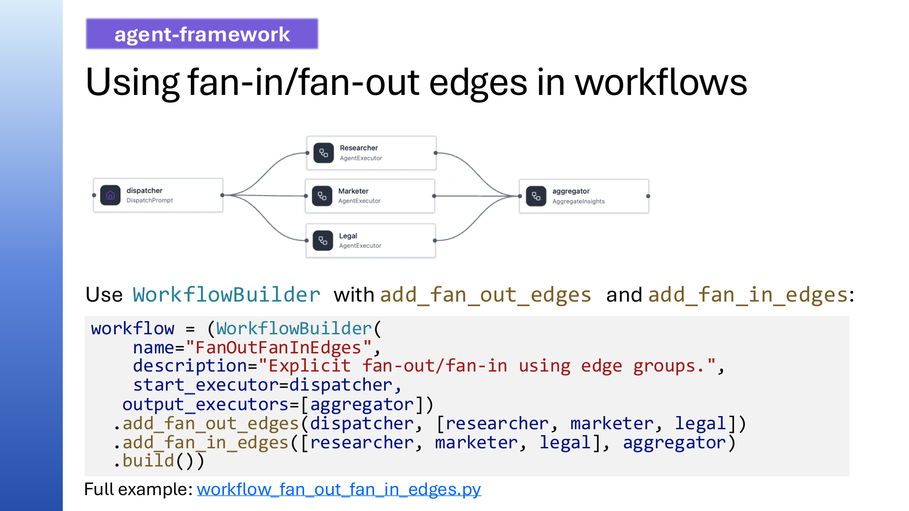
[Watch from 07:12](https://www.youtube.com/watch?v=WtZbDrd-RJg&t=432s)

`WorkflowBuilder` supports concurrent workflows through `add_fan_out_edges` and `add_fan_in_edges`. The builder takes a start executor, output executors (the aggregator), and the fan-out/fan-in edge definitions. Fan-out edges connect the start executor to a list of concurrent executors (e.g., researcher, marketer, legal). Fan-in edges connect those executors back to the aggregator. The full example is in `workflow_fan_out_fan_in_edges.py`.

### Aggregating results from fan-out edges

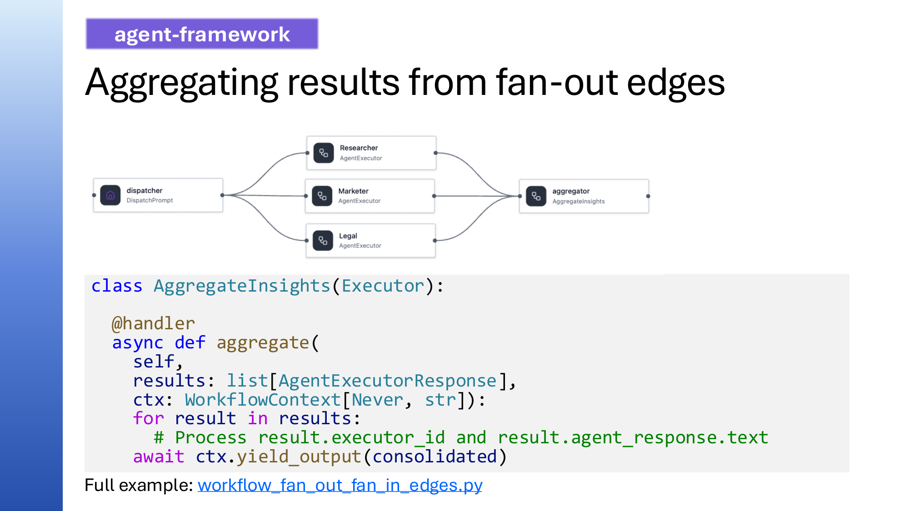
[Watch from 10:17](https://www.youtube.com/watch?v=WtZbDrd-RJg&t=617s)

The aggregator is a custom `Executor` subclass with a `@handler`-decorated method that receives `list[AgentExecutorResponse]`. Each response contains `executor_id` (which agent produced it) and `agent_response.text` (the output). The simplest aggregator concatenates all results into a single string and yields it as output. The aggregator only processes results once all concurrent executors have returned — concurrent duration equals the slowest executor. The full example is in `workflow_fan_out_fan_in_edges.py`.

### Aggregation

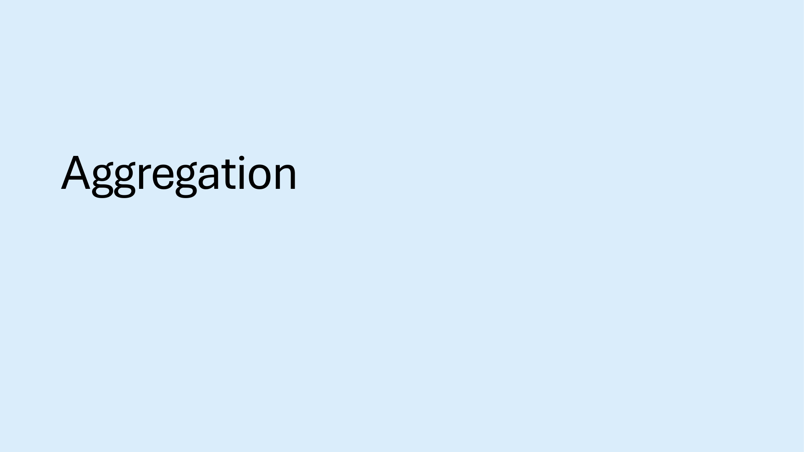
[Watch from 11:43](https://www.youtube.com/watch?v=WtZbDrd-RJg&t=703s)

This section explores different patterns for aggregating results from concurrent agents.

### Aggregation patterns for fan-in agents

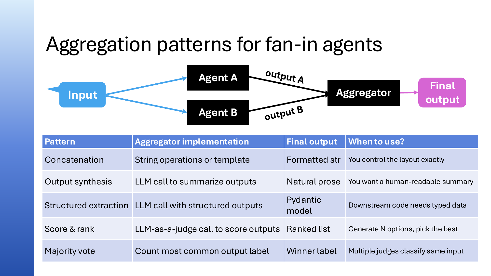
[Watch from 11:55](https://www.youtube.com/watch?v=WtZbDrd-RJg&t=715s)

Five aggregation patterns are available for fan-in workflows. **Concatenation** uses string operations or templates to produce a formatted string — useful when you control the layout exactly. **Output synthesis** uses an LLM call to summarize outputs into natural prose — good for human-readable summaries. **Structured extraction** uses an LLM call with structured outputs to produce a Pydantic model — useful when downstream code needs typed data. **Score & rank** uses an LLM-as-judge to score outputs and produce a ranked list — good for generating multiple options and picking the best. **Majority vote** counts the most common output label to produce a winner — useful when multiple judges classify the same input.

### Aggregation with LLM summary

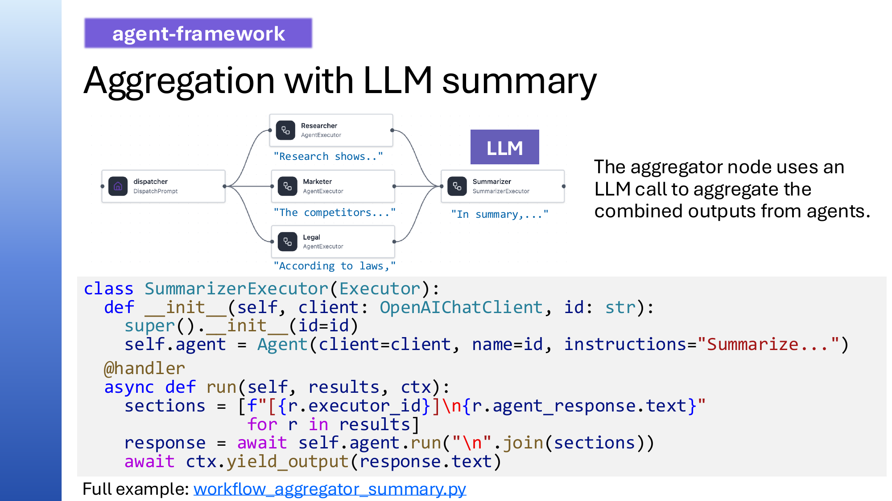
[Watch from 13:15](https://www.youtube.com/watch?v=WtZbDrd-RJg&t=795s)

The `SummarizerExecutor` creates an internal `Agent` with summarization instructions. When it receives the list of concurrent agent responses, it formats them as labeled sections (e.g., `[researcher]\n...`) and passes them to the agent. The agent synthesizes all outputs into a concise summary. In the demo, three concurrent agents (researcher, marketer, legal) analyze a product, and the summarizer produces a three-sentence executive brief. This pattern is common when you want to condense multiple perspectives into a readable summary. The full example is in `workflow_aggregator_summary.py`.

### Aggregation with structured extraction

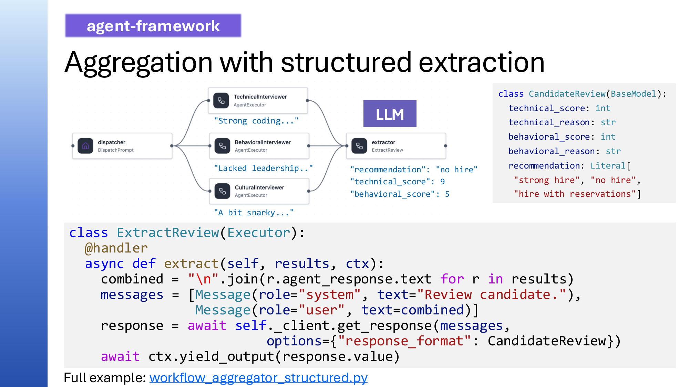
[Watch from 15:41](https://www.youtube.com/watch?v=WtZbDrd-RJg&t=941s)

The structured extraction pattern uses an LLM call with a `response_format` parameter set to a Pydantic model. In this example, three agents (technical interviewer, behavioral interviewer, cultural interviewer) each produce text reviews of a candidate. The `ExtractReview` executor combines their outputs, sends them to the LLM with a `CandidateReview` response format, and gets back a structured object with `technical_score`, `technical_reason`, `behavioral_score`, `behavioral_reason`, and a `recommendation` (one of "strong hire", "no hire", "hire with reservations"). As a best practice, always include reason fields alongside scores — seeing the LLM's justification helps identify prompt improvements when you disagree with a score. The structured output is a Python object, making it easy to write conditional logic or store in a database. The full example is in `workflow_aggregator_structured.py`.

### Aggregation with LLM ranking

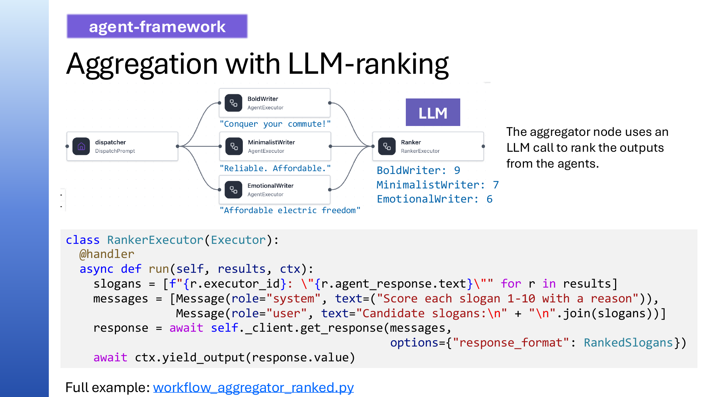
[Watch from 19:32](https://www.youtube.com/watch?v=WtZbDrd-RJg&t=1172s)

The ranking pattern fans out to multiple agents with different system prompts (or different models) and uses an LLM-as-judge to score and rank the results. The `RankerExecutor` collects slogans from agents (BoldWriter, MinimalistWriter, EmotionalWriter), formats them, and asks the LLM to score each on a 1-10 scale with justification. The response format is a `RankedSlogans` model containing a list of `RankedSlogan` objects with rank, agent name, slogan text, score, and justification. This pattern applies broadly: trying the same prompt with different models and picking the best, running code review with multiple models, or generating creative options and selecting a winner. The full example is in `workflow_aggregator_ranked.py`.

### Aggregation with majority vote

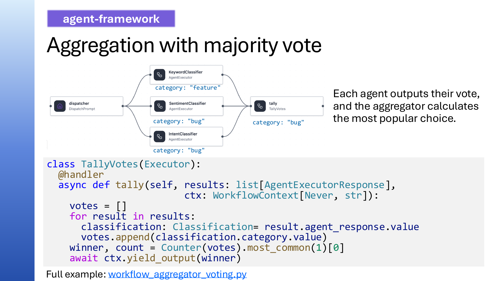
[Watch from 23:03](https://www.youtube.com/watch?v=WtZbDrd-RJg&t=1383s)

The majority vote pattern uses structured outputs from the concurrent agents themselves rather than from the aggregator. Each concurrent agent outputs a `Classification` with a `category` field (bug, billing, feature_request, or general). The `TallyVotes` executor collects these structured results, counts occurrences using Python's `Counter`, and picks the winner via `most_common(1)`. No LLM call is needed in the aggregator since the classification structure makes counting straightforward. In the demo, a customer support ticket gets classified by three independent agents, and the majority vote determines the final category. The full example is in `workflow_aggregator_voting.py`.

### Conditional routing + concurrency

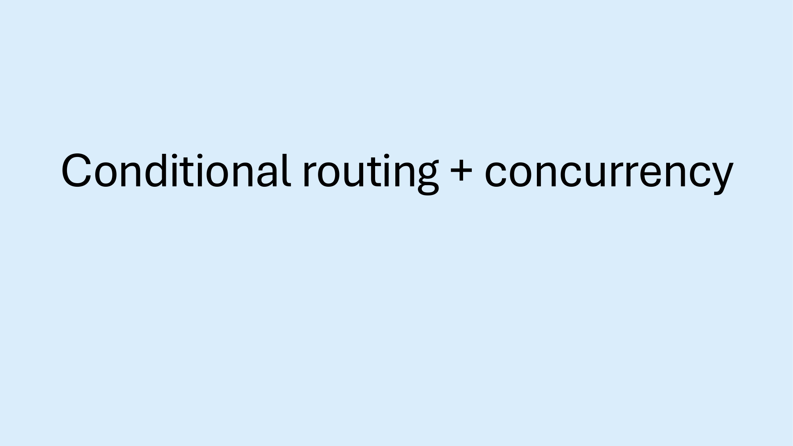
[Watch from 25:28](https://www.youtube.com/watch?v=WtZbDrd-RJg&t=1528s)

This section combines conditional routing (from session 4) with concurrent execution.

### Conditional routing with concurrent execution

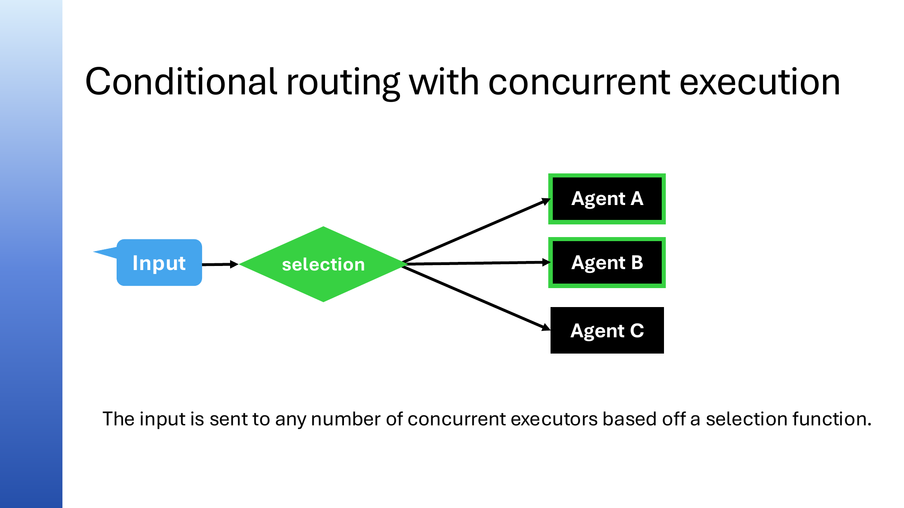
[Watch from 25:56](https://www.youtube.com/watch?v=WtZbDrd-RJg&t=1556s)

Conditional routing with concurrency sends input to a subset of concurrent executors based on a selection function. The input goes to a selection step that determines which agents are relevant, then those selected agents run in parallel. This differs from standard fan-out where all agents always receive the input.

### Workflows with multi-selection edge groups

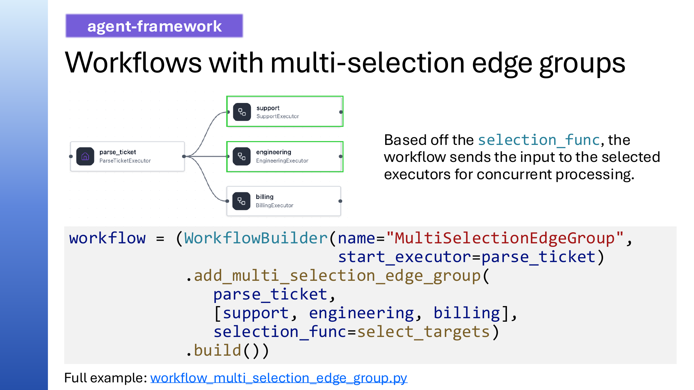
[Watch from 26:42](https://www.youtube.com/watch?v=WtZbDrd-RJg&t=1602s)

`WorkflowBuilder.add_multi_selection_edge_group` takes a start executor, a list of candidate executors, and a `selection_func` that determines which executors receive the input. In the demo, the start executor uses structured outputs to parse a support ticket into a `Ticket` object with `is_bug`, `is_billing`, and `is_urgent` fields. The selection function inspects these fields to determine routing: support always receives the ticket, engineering receives it if it's a bug, and billing receives it if it's billing-related. Using structured outputs from the first executor makes the selection function clean — it can check exact field values instead of fuzzy string matching. The full example is in `workflow_multi_selection_edge_group.py`.

### Built-in workflow orchestrations

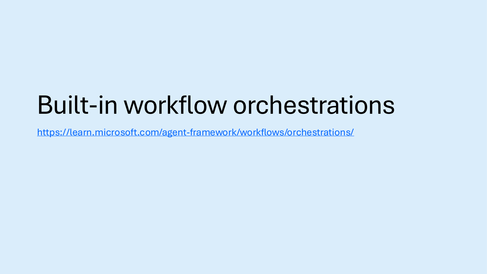
[Watch from 29:58](https://www.youtube.com/watch?v=WtZbDrd-RJg&t=1798s)

The Microsoft Agent Framework includes built-in orchestrations that implement common workflow patterns on top of the core `WorkflowBuilder` primitives. Documentation is at [learn.microsoft.com/agent-framework/workflows/orchestrations/](https://learn.microsoft.com/agent-framework/workflows/orchestrations/).

### ConcurrentBuilder

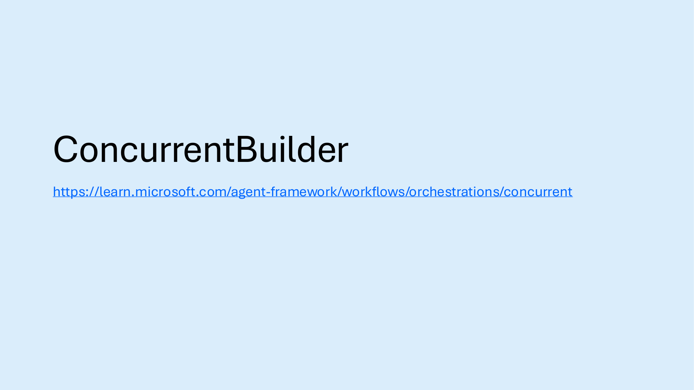
[Watch from 30:25](https://www.youtube.com/watch?v=WtZbDrd-RJg&t=1825s)

`ConcurrentBuilder` provides a simplified way to create fan-out/fan-in workflows. Documentation at [learn.microsoft.com/agent-framework/workflows/orchestrations/concurrent](https://learn.microsoft.com/agent-framework/workflows/orchestrations/concurrent).

### Using the built-in ConcurrentBuilder workflow

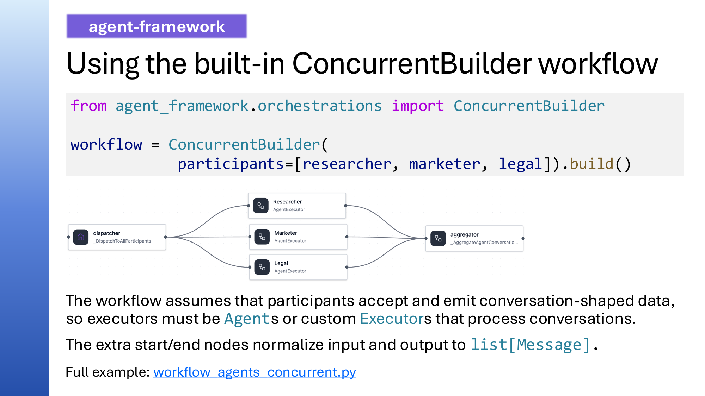
[Watch from 31:09](https://www.youtube.com/watch?v=WtZbDrd-RJg&t=1869s)

`ConcurrentBuilder` takes a list of `participants` and automatically adds a dispatcher node (which sends the prompt to all agents) and an aggregator node (which concatenates output messages). The code is minimal: `ConcurrentBuilder(participants=[researcher, marketer, legal]).build()`. Participants must be `Agent` instances or custom `Executor` subclasses that process conversations, since the builder normalizes input and output to `list[Message]`. The default aggregator performs simple concatenation; `ConcurrentBuilder` supports overriding it with a custom aggregator for more sophisticated merging. The full example is in `workflow_agents_concurrent.py`.

### MagenticBuilder for dynamic planning

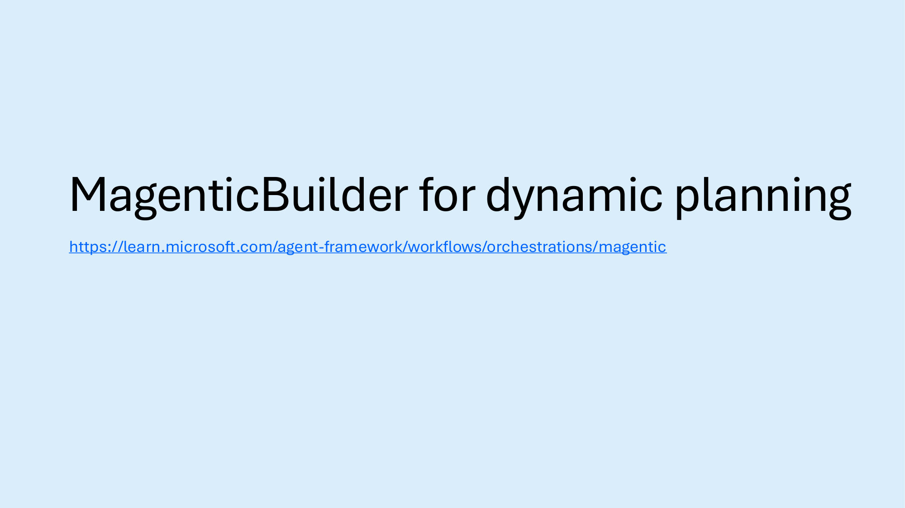
[Watch from 33:12](https://www.youtube.com/watch?v=WtZbDrd-RJg&t=1992s)

`MagenticBuilder` implements the Magentic-One orchestration pattern, based on [research from Microsoft Research](https://arxiv.org/abs/2411.04468). Documentation at [learn.microsoft.com/agent-framework/workflows/orchestrations/magentic](https://learn.microsoft.com/agent-framework/workflows/orchestrations/magentic).

### Magentic-One workflow orchestration

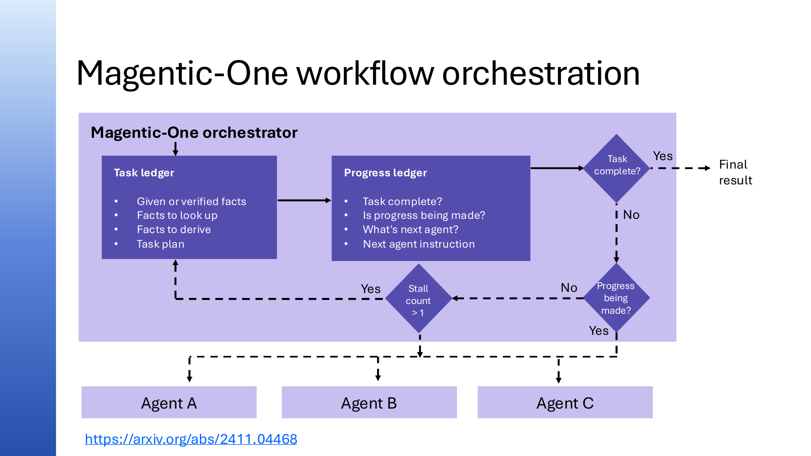
[Watch from 33:36](https://www.youtube.com/watch?v=WtZbDrd-RJg&t=2016s)

Magentic-One uses an orchestrator that manages a task ledger and a progress ledger. The task ledger contains given/verified facts, facts to look up, facts to derive, and the task plan. After each agent turn, the orchestrator checks the progress ledger: is the task complete? Is progress being made? If the task is complete, it produces the final result. If not, it checks for stalls — if the stall count exceeds the threshold, it can reset. If progress is being made, it selects the next agent and provides instructions. This explicit planning loop produces higher-quality results for complex multi-step tasks but uses more tokens and takes longer than simpler patterns.

### Magentic-One: initial plan development

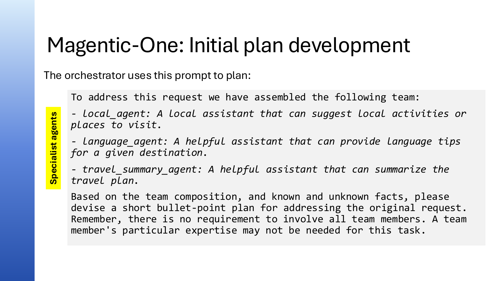
[Watch from 34:36](https://www.youtube.com/watch?v=WtZbDrd-RJg&t=2076s)

The orchestrator creates an initial plan by sending the LLM a description of the assembled team — each agent's name and capabilities — and asking it to devise a bullet-point plan. The prompt explicitly notes that not all team members need to be involved. This plan-first approach means the orchestrator has a roadmap before delegating any work.

### Magentic-One: progress ledger updates

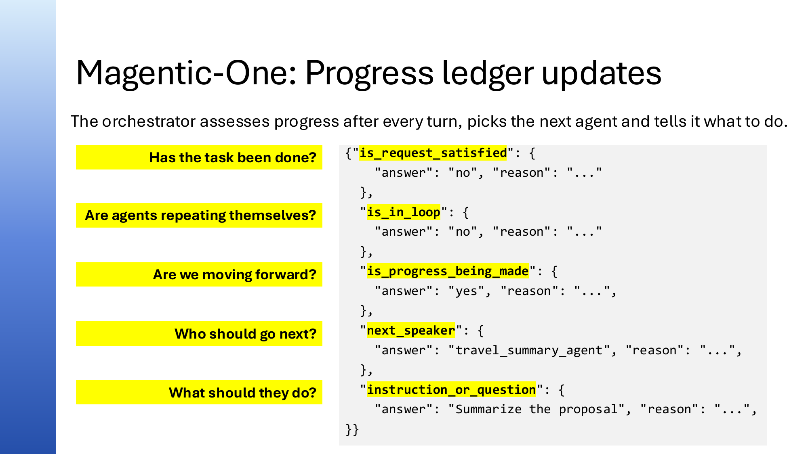
[Watch from 35:17](https://www.youtube.com/watch?v=WtZbDrd-RJg&t=2117s)

After every agent turn, the orchestrator produces a structured JSON progress ledger with five fields: `is_request_satisfied` (is the task done?), `is_in_loop` (are agents repeating themselves?), `is_progress_being_made` (is there any point continuing?), `next_speaker` (which agent should go next?), and `instruction_or_question` (what should that agent do?). Each field includes a reason. This explicit tracking enables loop detection and stall recovery that reactive architectures lack.

### Using the built-in MagenticBuilder workflow

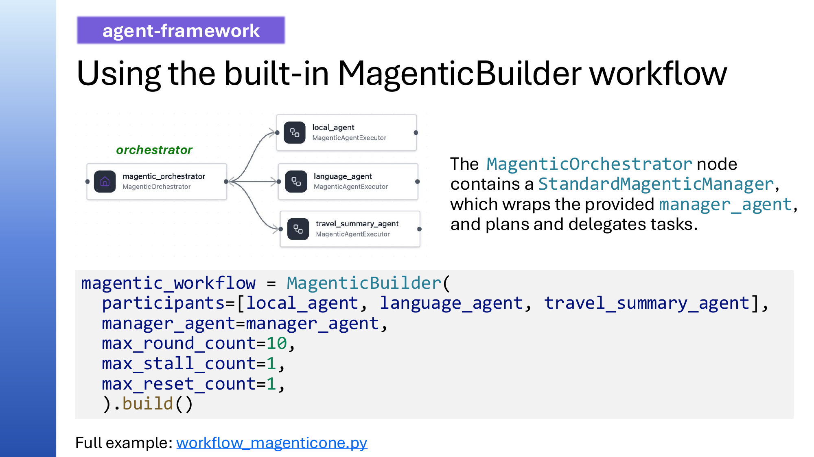
[Watch from 36:02](https://www.youtube.com/watch?v=WtZbDrd-RJg&t=2162s)

`MagenticBuilder` takes `participants` (the specialist agents), a `manager_agent` (which gets wrapped in a `StandardMagenticManager`), and configuration parameters: `max_round_count` (maximum turns), `max_stall_count` (stalls before reset), and `max_reset_count` (resets before termination). The manager agent itself needs only a minimal prompt because the framework enhances it with the full Magentic-One orchestration prompts for plan development and progress ledger management. Token management can be applied via middleware on individual agents; for workflow-level token control, use custom executor nodes. The full example is in `workflow_magenticone.py`.

### Magentic orchestration vs. Agent-as-tools

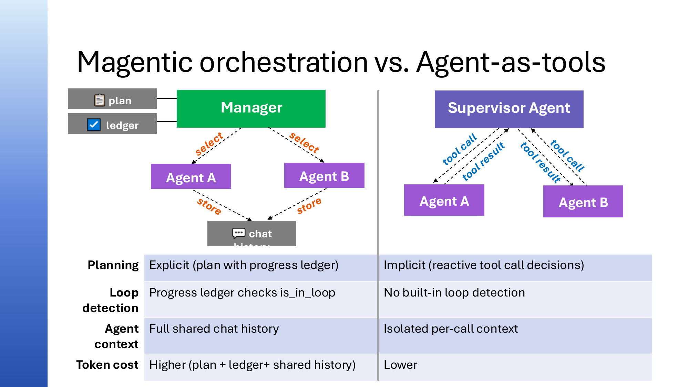
[Watch from 43:22](https://www.youtube.com/watch?v=WtZbDrd-RJg&t=2602s)

Magentic-One uses explicit planning (task ledger + progress ledger), while the agent-as-tools (supervisor) pattern relies on implicit planning through reactive tool-call decisions. Magentic-One has built-in loop detection via the progress ledger; the supervisor pattern has none by default. In Magentic-One, agents share the full chat history, which increases context quality but raises token cost. In the supervisor pattern, each sub-agent gets only the context passed in the tool call, keeping costs lower. Magentic-One is worth the overhead when thoroughness matters and the task is complex enough to benefit from explicit planning. For simpler delegation, the supervisor pattern is faster and cheaper. Modern reasoning models (like the o-series) perform some planning implicitly during inference, which narrows the gap. Consider these built-in orchestrations as both ready-to-use solutions and inspiration for custom workflow designs.

### Dynamic routing with HandoffBuilder

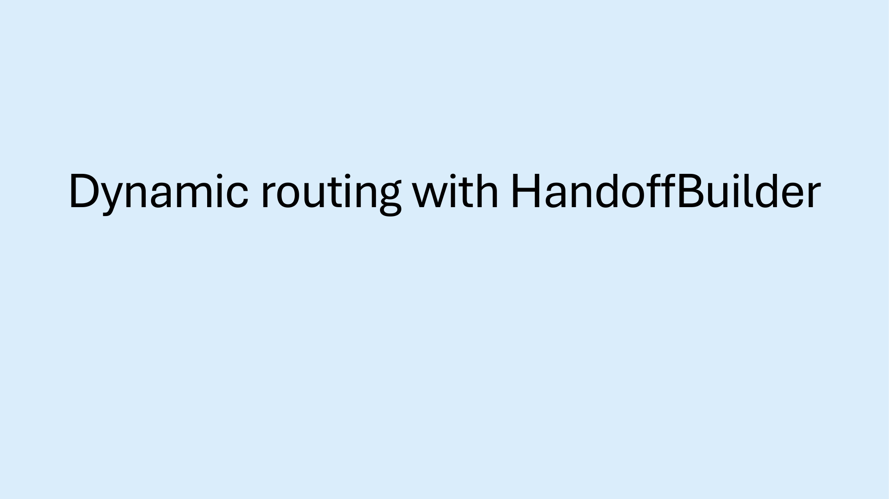
[Watch from 46:39](https://www.youtube.com/watch?v=WtZbDrd-RJg&t=2799s)

This section introduces `HandoffBuilder`, which enables fully dynamic routing where agents decide the next step at runtime.

### From fixed graphs to dynamic routing

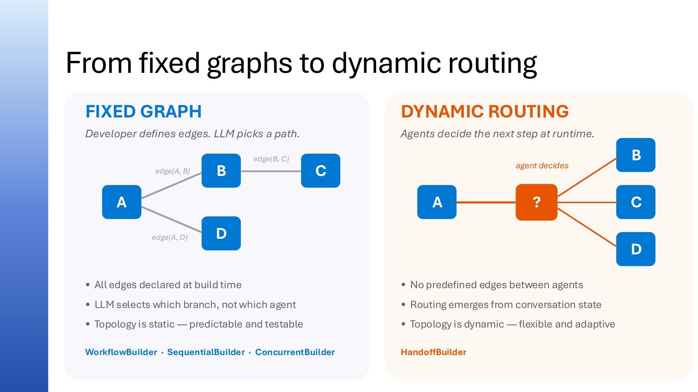
[Watch from 47:45](https://www.youtube.com/watch?v=WtZbDrd-RJg&t=2865s)

In fixed-graph workflows (`WorkflowBuilder`, `SequentialBuilder`, `ConcurrentBuilder`), the developer defines all edges at build time. The LLM picks which path to take, but the topology is static and predictable. In dynamic routing (`HandoffBuilder`), there are no predefined edges between agents. Routing emerges from the conversation state as agents decide at runtime which agent should handle the task next. This is more flexible and adaptive but less predictable and harder to test.

### Handoff orchestration

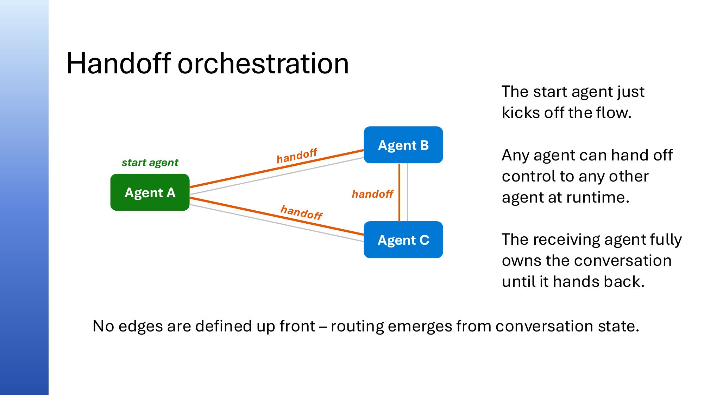
[Watch from 47:47](https://www.youtube.com/watch?v=WtZbDrd-RJg&t=2867s)

In a handoff orchestration, a start agent kicks off the workflow. Any agent can then hand off control to any other agent at runtime. The receiving agent fully owns the conversation until it decides to hand back or hand off to someone else. No edges are defined up front — routing emerges entirely from conversation state. This is peer-to-peer control transfer, fundamentally different from the supervisor pattern where control always returns to a central agent.

### Using the built-in HandoffBuilder workflow

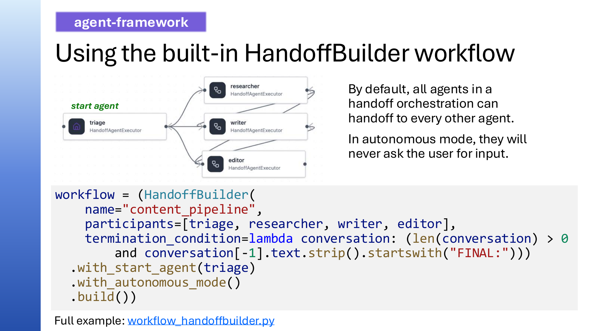
[Watch from 48:22](https://www.youtube.com/watch?v=WtZbDrd-RJg&t=2902s)

`HandoffBuilder` takes `participants` (all agents that can participate), a `termination_condition` (a function that inspects the conversation to decide when to stop), and a `start_agent` (the entry point). By default, all agents can hand off to every other agent. The `with_autonomous_mode()` flag tells the framework that no user is available to answer clarification questions. In the demo, a triage-researcher-writer-editor pipeline processes a request to write a LinkedIn post. The triage agent routes to the researcher, who hands off to the writer, who hands off to the editor, who produces the final output. In practice, handoff flows can be unpredictable — agents may hand back and forth multiple times before converging. The full example is in `workflow_handoffbuilder.py`.

### HandoffBuilder with handoff rules

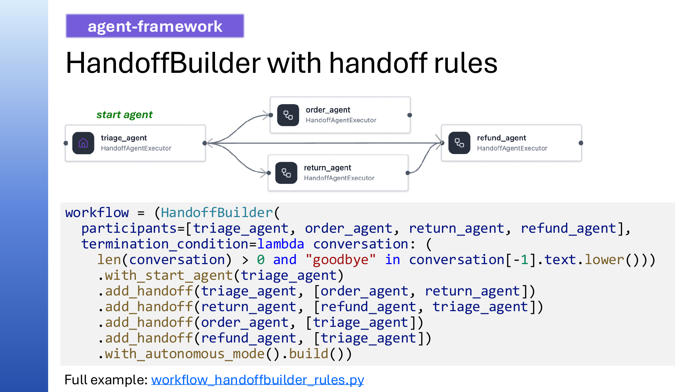
[Watch from 52:53](https://www.youtube.com/watch?v=WtZbDrd-RJg&t=3173s)

`HandoffBuilder` supports explicit handoff rules that constrain which agents can hand off to which. The `add_handoff` method specifies allowed targets for each agent. In the demo, a customer support workflow has triage, order, return, and refund agents. Triage can hand off to order or return. Return can hand off to refund or back to triage. Order can only hand back to triage. Refund can only hand back to triage. This provides the flexibility of dynamic routing while preventing undesirable transitions. Even with rules, handoff flows can involve multiple back-and-forth exchanges as agents gather information. The full example is in `workflow_handoffbuilder_rules.py`.

### Handoff orchestration vs. Agent-as-tools

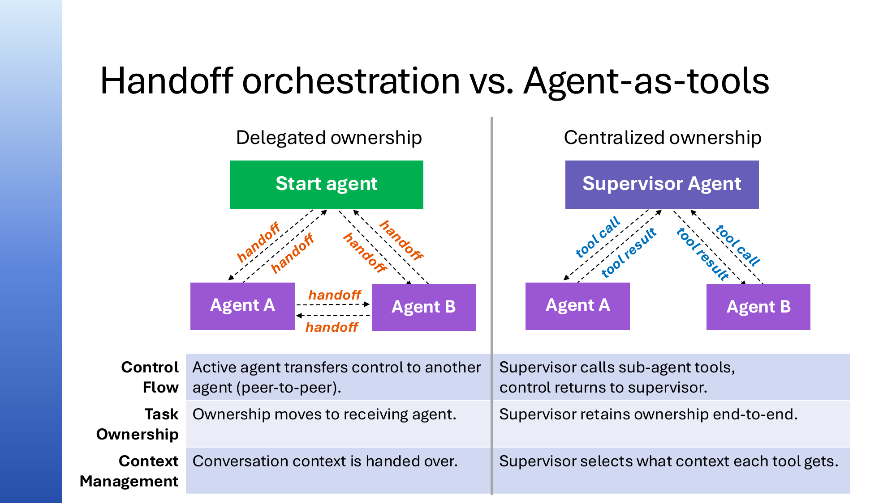
[Watch from 56:21](https://www.youtube.com/watch?v=WtZbDrd-RJg&t=3381s)

In handoff orchestration, the active agent transfers control to another agent (peer-to-peer), and ownership moves to the receiving agent. Conversation context is handed over entirely. In the agent-as-tools (supervisor) pattern, the supervisor calls sub-agent tools and control always returns to the supervisor, which retains end-to-end ownership. The supervisor selects what context each tool gets. Handoff works well when agents need full conversational context and autonomy. The supervisor pattern works better when centralized control and selective context passing are important.

### End-to-end application

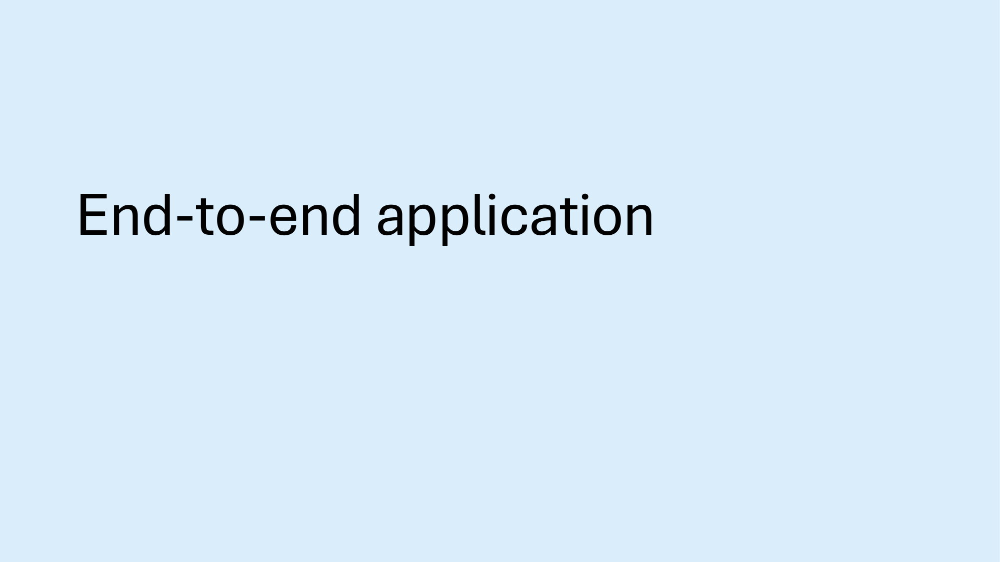
[Watch from 57:18](https://www.youtube.com/watch?v=WtZbDrd-RJg&t=3438s)

This section demonstrates a full-stack application built with concurrent workflows.

### Agentic AI investment analysis

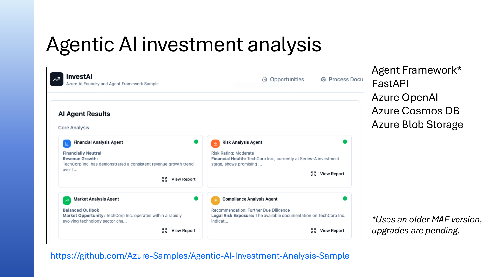
[Watch from 57:27](https://www.youtube.com/watch?v=WtZbDrd-RJg&t=3447s)

The [Agentic AI Investment Analysis](https://github.com/Azure-Samples/Agentic-AI-Investment-Analysis-Sample) sample application uses the Microsoft Agent Framework, FastAPI, Azure OpenAI, Azure Cosmos DB, and Azure Blob Storage. It demonstrates how concurrent workflows integrate into a user-facing application with React Flow for visualizing workflow execution graphs. The app shows investment opportunities with detailed analysis generated by multiple concurrent agents. It uses an older Agent Framework version with upgrades pending.

### Investment workflow with fan-out and fan-in

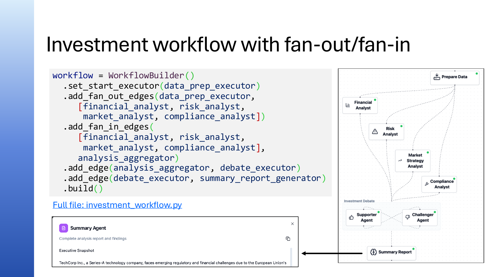
[Watch from 59:55](https://www.youtube.com/watch?v=WtZbDrd-RJg&t=3595s)

The investment workflow starts with a `data_prep_executor`, fans out to four concurrent analyst agents (financial, risk, market, compliance), fans back in to an `analysis_aggregator`, then flows through a `debate_executor` (with supporter and challenger agents running concurrently) and finally to a `summary_report_generator`. This combines multiple workflow patterns: fan-out/fan-in for parallel analysis, sequential edges for the debate and summary stages, and aggregation to consolidate analyst outputs. The full code is in `investment_workflow.py`.

### What-if workflow with fan-in and fan-out

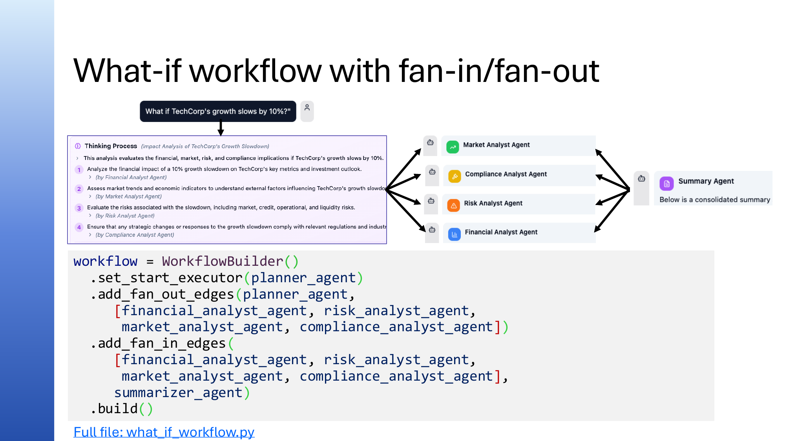
[Watch from 01:00:10](https://www.youtube.com/watch?v=WtZbDrd-RJg&t=3610s)

The what-if workflow handles speculative questions (e.g., "what if the stock drops 10%?") through a chat interface. It starts with a `planner_agent`, fans out to the same four analyst agents (financial, risk, market, compliance), and fans back in to a `summarizer_agent`. The architecture mirrors the investment workflow but is triggered interactively. Results stream as events to the frontend, showing each agent's progress in real time.

### Next steps and resources

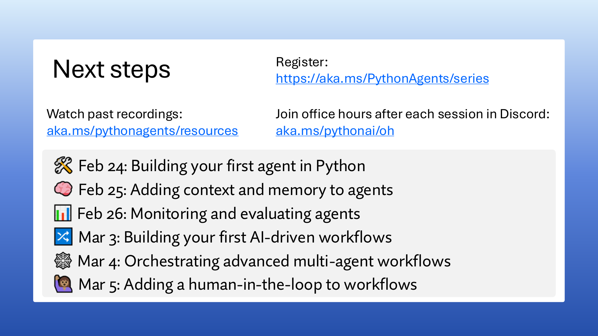
[Watch from 01:01:32](https://www.youtube.com/watch?v=WtZbDrd-RJg&t=3692s)

The final session in the series covers adding a human-in-the-loop to workflows — particularly relevant for handoff orchestrations. Past recordings are available at [aka.ms/pythonagents/resources](https://aka.ms/pythonagents/resources). Office hours are held after each session in the Foundry Discord at [aka.ms/pythonai/oh](https://aka.ms/pythonai/oh).

## Live Chat Q&A

### How do you handle token limits when using concurrent workflows?

When building agents, you can add middleware for token management. For custom workflows, add executor nodes that check token usage. For built-in orchestrations like MagenticBuilder, use the configuration parameters (`max_round_count`, `max_stall_count`, `max_reset_count`) to limit iterations. With concurrent workflows, remember that all concurrent executors make LLM calls simultaneously, so the LLM endpoint needs enough token capacity to handle the parallel requests.

### Is Magentic-One still useful now that reasoning models exist?

Modern reasoning models (like the o-series) do perform some implicit planning during inference, which narrows the gap. However, Magentic-One makes planning fully explicit with its task ledger and progress ledger, which provides transparency and loop detection that reasoning models don't expose. For complex multi-step tasks where thoroughness matters, Magentic-One can still produce higher-quality results. For simpler tasks, a supervisor pattern with a reasoning model may suffice. Evaluate both approaches with your specific use case to determine which is worth the token cost.

### Can handoff agents pass back to the triage agent?

Yes. By default, any agent can hand off to any other agent, including back to the start/triage agent. This can lead to back-and-forth exchanges. Using `add_handoff` rules lets you constrain which handoffs are allowed. Adding a human-in-the-loop (covered in session 6) also helps reduce unnecessary back-and-forth by letting agents ask the user for clarification instead of bouncing between themselves.

### How do you decide between Magentic-One, handoff, and the supervisor (agent-as-tools) pattern?

Use the supervisor (agent-as-tools) pattern when you want centralized control and lower token costs — the supervisor always retains ownership and selectively passes context to sub-agents. Use handoff when agents need full conversational context and autonomy, and when the task benefits from peer-to-peer delegation. Use Magentic-One when you need explicit planning, progress tracking, and loop detection for complex multi-step tasks. Think of the built-in orchestrations as both ready solutions and inspiration for custom workflows tailored to your specific requirements.

## Discord Office Hours Q&A

### How do you increase the performance (latency) of a multi-agent system?

📹 [0:30](https://youtube.com/watch?v=txskCy6Vmzc&t=30)

The first step is to set up **quality evaluations** with a ground truth baseline, so you can make performance changes and confirm quality doesn't regress. Once evaluations are in place, you can try several optimizations:

- **Use smaller/faster models**: Try quicker models or, if using a reasoning model like GPT-5.2 or GPT-5.3, set reasoning effort to "none" to save time.
- **Reduce input tokens**: Use context management techniques like sub-agents to keep context windows small. This was covered in the second session of the series.
- **Reduce output tokens**: Have the LLM output shorter responses (e.g., a one-sentence summary instead of a paragraph).

Always check evaluations after each change — sometimes a quality improvement causes latency to spike, making it not worth it. You need evaluations to reason about the latency/quality trade-off.

### How do you incorporate A2A protocols into model orchestrations to integrate other agent providers into Foundry orchestration?

📹 [3:47](https://youtube.com/watch?v=txskCy6Vmzc&t=227)

Microsoft Agent Framework has a sub-package specifically for A2A (Agent-to-Agent) integration. It lets you connect to an A2A agent and get responses from it. The documentation on [hosting your agent with A2A protocol](https://learn.microsoft.com/en-us/agent-framework/workflows/) covers this integration. However, the specifics depend on whether you're trying to communicate with an A2A agent or host one yourself.

### Are there limitations in workflow evaluation using Microsoft Foundry if you deploy your agent as a hosted agent?

📹 [5:48](https://youtube.com/watch?v=txskCy6Vmzc&t=348)

Pamela hasn't personally deployed an agent as a hosted agent yet and couldn't speak to specific limitations. If anyone has experience with hosted agents and evaluation, they were encouraged to share. A follow-up series about hosting agents may provide the opportunity to explore this.

### What evaluation framework do you recommend — DeepEval, Ragas, others?

📹 [6:42](https://youtube.com/watch?v=txskCy6Vmzc&t=402)

For workflows, the same principles as agent evaluation apply: evaluate the final output of the workflow against ground truth, but also evaluate each individual agent along the way.

Recommended options:

- **Azure AI Evaluation**: What Pamela primarily uses. The advantage of using it (or OpenAI Evals with Foundry projects) is that results show up in the Foundry portal.
- **OpenAI Evals**: Microsoft is moving towards using OpenAI Evals with Foundry projects — worth trying.
- **Agent Framework lab packages**: Includes TAU2 (specifically for customer service agent benchmarks) and GAIA (for agents and workflows), though documentation for GAIA is limited.
- **Custom evaluations**: Remember the core principles — you're either using an LLM as a judge (outputting yes/no or 1-5 with reasoning) or some other heuristic, then doing batch evaluation. You can ask GitHub Copilot to write a custom eval framework if existing ones don't fit your needs.

For .NET developers, [Agent Eval](https://github.com/) (a .NET evaluation framework) was recommended by another attendee — it includes latency and cost checking plus built-in red teaming.

Pamela also recommended subscribing to [Hamel Husain's blog](https://hamel.dev/) for everything related to LLM evaluation.

### Is there a more native way to access workflow context from middleware, rather than manually injecting it?

📹 [10:50](https://youtube.com/watch?v=txskCy6Vmzc&t=650)

This question was about middleware needing to save data to workflow shared state, but middleware doesn't have access to the workflow context. The attendee was manually injecting the context.

Pamela acknowledged this is a deep question and suggested posting it as a discussion on the [Agent Framework GitHub repo](https://github.com/orgs/microsoft-foundry/discussions/165), since the middleware story for workflows specifically may need improvement. The discussions and issues on the agent framework repo have been very helpful for getting answers from the team.

### How does tracing/logging work with workflows?

📹 [12:14](https://youtube.com/watch?v=txskCy6Vmzc&t=734)

It works the same way as with agents — just call `configure_otel_providers()` from agent framework. Pamela demonstrated this live by adding OpenTelemetry tracing to a workflow example and viewing the traces in DebUI.

The traces show parent spans for each workflow step: the agent execution, the edge (transition between agents), and each subsequent agent. So you can see the full workflow flow in the trace viewer. This also works with Aspire or App Insights. All you need is:

```python
from agent_framework import configure_otel_providers
configure_otel_providers()
```

### Will Microsoft Agent Framework be submitted to the AI Foundation (which has MCP, Goose, and agents.md)?

📹 [17:54](https://youtube.com/watch?v=txskCy6Vmzc&t=1074)

Pamela hasn't heard anything about this and isn't sure how projects get added to the foundation. Microsoft Agent Framework has a lot of Microsoft/Azure-specific integration, so it's unclear whether it would fit. Her observation is that protocols (A2A from Google, MCP from Anthropic) tend to come from companies developing frontier LLM models, and Microsoft doesn't have its own frontier models yet. Agent Framework tends to adopt emerging industry patterns (A2A, AGUI, MCP) rather than originating them. It would be nice if the industry agreed on common terminology, but terms like "magentic" originated from Microsoft (via AutoGen), while other frameworks like LangChain have their own orchestration concepts (e.g., Deep Agents).

### How should you version prompts and tool descriptions for agent systems?

📹 [23:21](https://youtube.com/watch?v=txskCy6Vmzc&t=1401)

Since tool descriptions are in code and are part of what the LLM processes, it's hard to separate prompt versioning from code versioning. Pamela's recommendation: keep prompts in your codebase. You can put system prompts in separate files (markdown or Jinja2 templates) and pull them in, but version them alongside your code.

Tie evaluations to your PRs — Pamela showed a GitHub Actions workflow that can be triggered on PRs to run evaluations against the local app inside the runner, upload results as artifacts, and summarize them. This way, changes to prompts or tools get evaluated as part of the normal code review process.

Links shared:

* [Python Agent Framework demos - GitHub Actions](https://github.com/Azure-Samples/python-agentframework-demos/actions)
* [Evaluation GitHub Actions workflow](https://github.com/Azure-Samples/azure-search-openai-demo/blob/main/.github/workflows/evaluate.yaml)

### What real-world problems do these workflow patterns solve architecturally?

📹 [33:31](https://youtube.com/watch?v=txskCy6Vmzc&t=2011)

Pamela acknowledged that while she can show the patterns, she can only speak to scenarios from her own job as an advocate. She plans to automate more of her own workflows with agent-framework in the future, possibly in conjunction with the Copilot SDK for coding tasks.

Known strong use cases:

- **Coding agents**: The best-proven use case for LLMs — code is structured, and LLMs know coding languages extremely well.
- **Fuzzy matching**: LLMs can be much better than regular expressions for fuzzy matching tasks.
- **New automation**: Some workflows may not have existed before and are only possible now with LLM access.

She encouraged attendees using workflows and agents in production to share what works and what doesn't to help inspire others.

### Can you use the OpenAI real-time API with Microsoft Agent Framework?

📹 [36:41](https://youtube.com/watch?v=txskCy6Vmzc&t=2201)

Pamela hasn't played with the newest OpenAI real-time models yet. Another advocate, Bruno Capuano, has a sample that combines real-time audio with agent framework in .NET, using whisper for speech-to-text and text-to-speech with voice activity detection. Pamela suggested reaching out to Bruno on LinkedIn for additional advice or samples, and noted that showing the overlap of agent framework with different communication modalities (WhatsApp, real-time audio) is a common request.

Links shared:

* [ElBruno.Realtime - Pluggable real-time audio conversation framework for .NET](https://github.com/elbruno/ElBruno.Realtime)
* [Azure OpenAI Realtime Audio SDK samples](https://github.com/Azure-Samples/aoai-realtime-audio-sdk)

### Can we get the full stack code for the AI finance agent?

📹 [40:50](https://youtube.com/watch?v=txskCy6Vmzc&t=2450)

Yes — the [Agentic AI Investment Analysis Sample](https://github.com/Azure-Samples/Agentic-AI-Investment-Analysis-Sample) is the full-stack repo. It uses React (with React Flow), Tailwind for the frontend, and FastAPI for the backend.

**Important caveat**: The repo currently uses an old version of agent framework and does not pin the version in requirements, so it's hard to run right now, unless you change requirements.txt to specify the old version `1.0.0b260212`. The team working on it said it should be updated within the next few weeks.

### Can you do breakpoint debugging with workflows in VS Code?

📹 [27:34](https://youtube.com/watch?v=txskCy6Vmzc&t=1654)

Yes! Pamela demonstrated this live. Key tips:

- Set breakpoints on the **first line of code** in edge functions — not on docstrings or function signatures (putting a breakpoint on a docstring moves it to the function signature, which doesn't work well).
- For agent-level debugging, you'd need to write debugging middleware since agents are just classes without a convenient place to break.
- At a breakpoint, you can inspect the agent response, see the text output, and examine the workflow state.
- If you have OpenTelemetry console exporter enabled, you'll see OTEL spans in the debug console output as well.

Tip: You could even ask GitHub Copilot to write VS Code debug middleware for you.
