## Slide 1


```
Python + Agents
Feb 24: Building your first agent in Python
Feb 25: Adding context and memory to agents
Feb 26: Monitoring and evaluating agents
Mar 3: Building your first AI-driven workflows
Mar 4: Orchestrating advanced multi-agent workflows
Mar 5: Adding a human-in-the-loop to workflows

Register at aka.ms/PythonAgents/series
```

## Slide 2

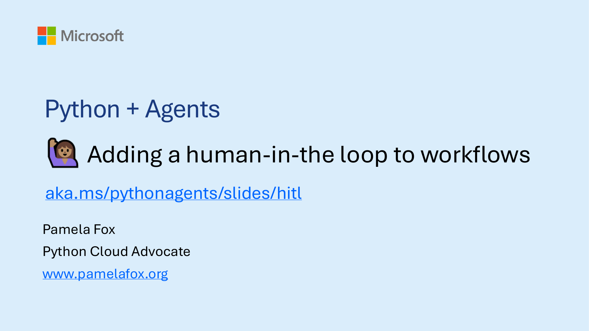

```
Python + Agents
      Adding a human-in-the loop to workflows
aka.ms/pythonagents/slides/hitl
Pamela Fox
Python Cloud Advocate
www.pamelafox.org
```

## Slide 3

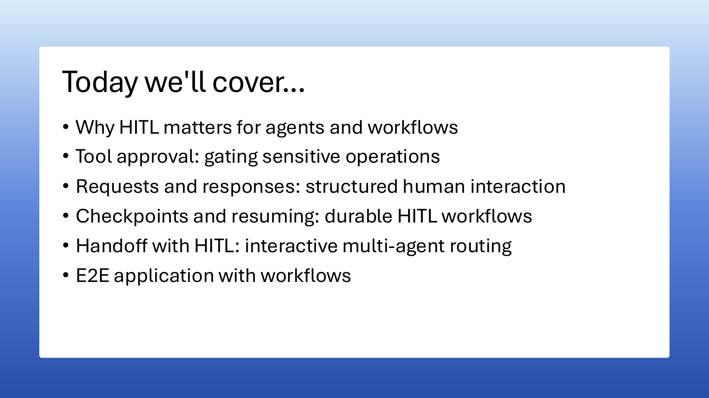

```
Today we'll cover...
• Why HITL matters for agents and workflows
• Tool approval: gating sensitive operations
• Requests and responses: structured human interaction
• Checkpoints and resuming: durable HITL workflows
• Handoff with HITL: interactive multi-agent routing
• E2E application with workflows
```

## Slide 4

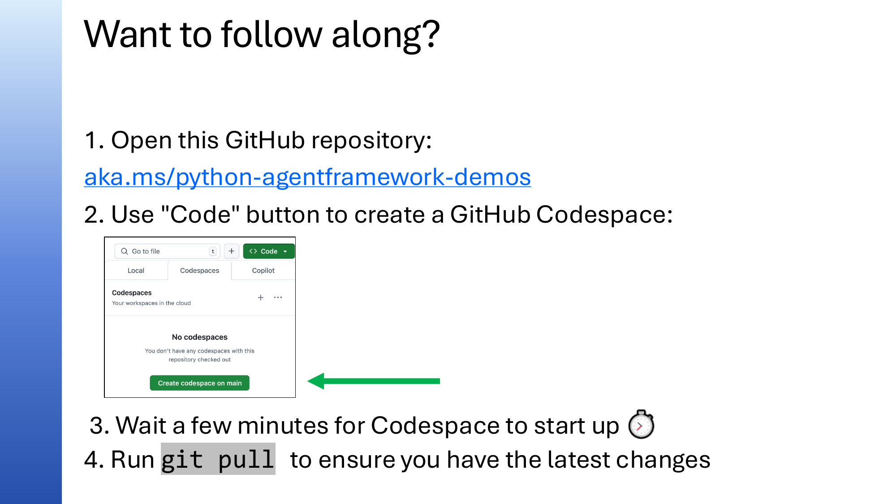

```
Want to follow along?

1. Open this GitHub repository:
aka.ms/python-agentframework-demos
2. Use "Code" button to create a GitHub Codespace:


3. Wait a few minutes for Codespace to start up
4. Run git pull to ensure you have the latest changes
```

## Slide 5

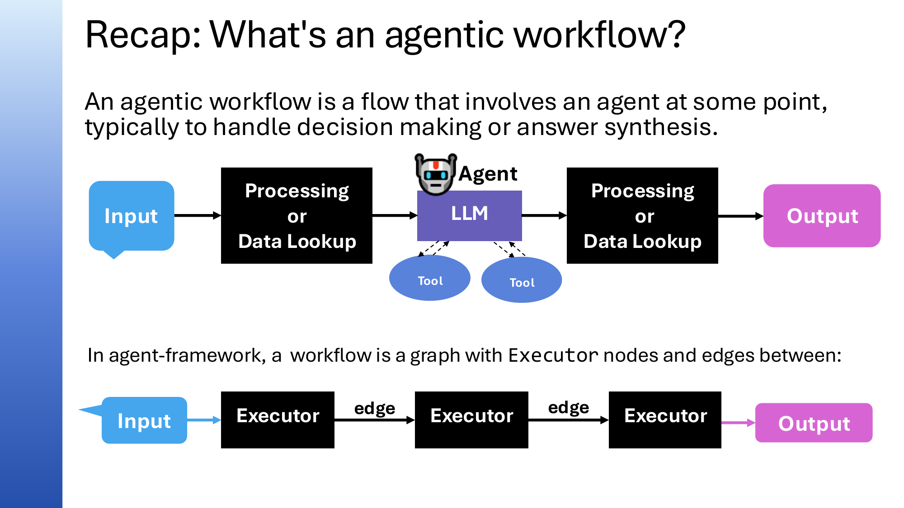

```
Recap: What's an agentic workflow?
An agentic workflow is a flow that involves an agent at some point,
typically to handle decision making or answer synthesis.
                                          Agent
               Processing                                 Processing
 Input              or                    LLM                  or         Output
               Data Lookup                                Data Lookup
                                   Tool         Tool


In agent-framework, a workflow is a graph with Executor nodes and edges between:

               Executor     edge    Executor           edge   Executor
   Input                                                                 Output
```

## Slide 6

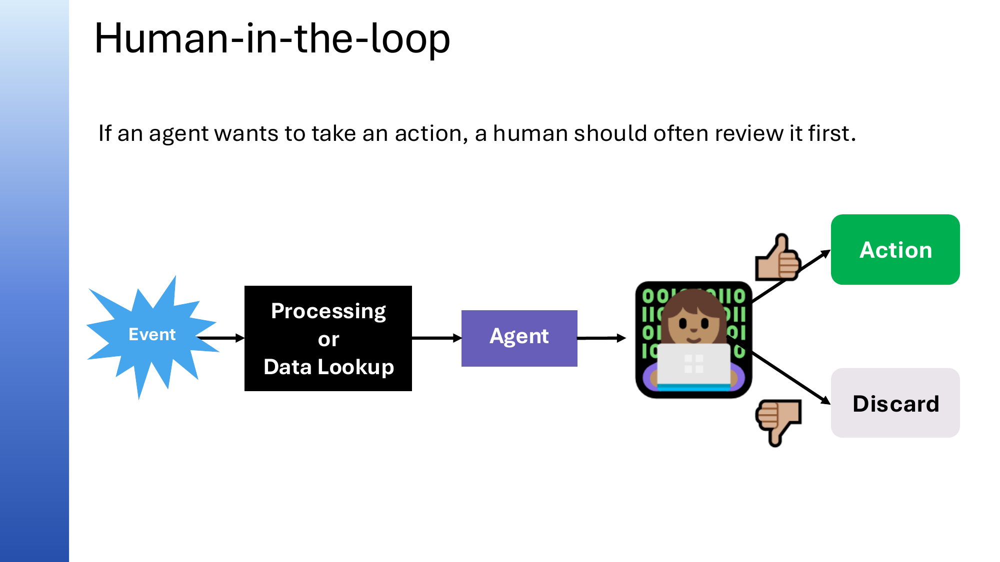

```
Human-in-the-loop
If an agent wants to take an action, a human should often review it first.


                                                                             Action

                Processing
  Event              or               Agent
                Data Lookup
                                                                         Discard
```

## Slide 7


```
Why add a human in the loop?
```

## Slide 8

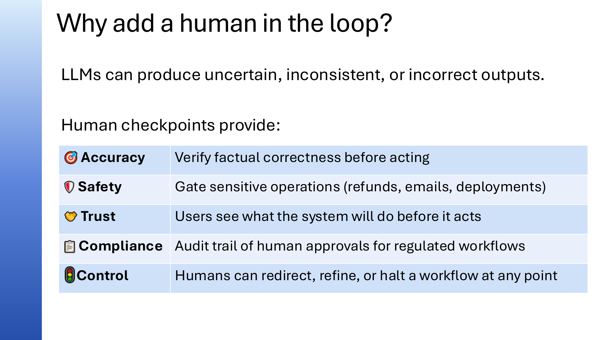

```
Why add a human in the loop?
LLMs can produce uncertain, inconsistent, or incorrect outputs.

Human checkpoints provide:
  Accuracy     Verify factual correctness before acting
  Safety       Gate sensitive operations (refunds, emails, deployments)
  Trust        Users see what the system will do before it acts
  Compliance Audit trail of human approvals for regulated workflows
 Control       Humans can redirect, refine, or halt a workflow at any point
```

## Slide 9

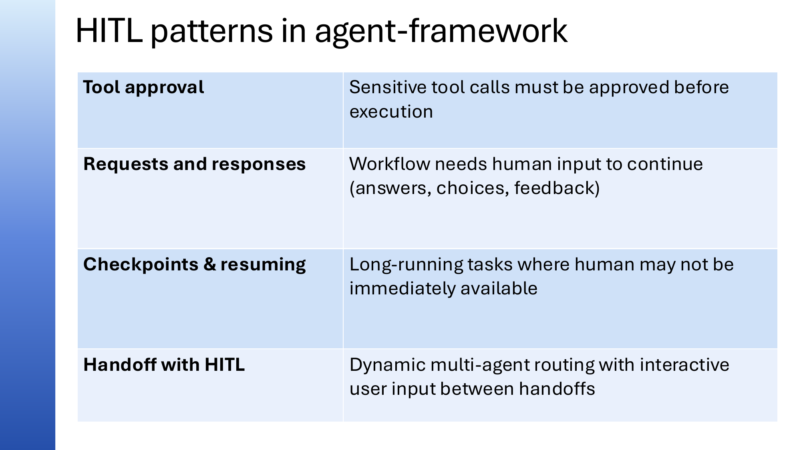

```
HITL patterns in agent-framework
Tool approval            Sensitive tool calls must be approved before
                         execution

Requests and responses   Workflow needs human input to continue
                         (answers, choices, feedback)


Checkpoints & resuming   Long-running tasks where human may not be
                         immediately available


Handoff with HITL        Dynamic multi-agent routing with interactive
                         user input between handoffs
```

## Slide 10

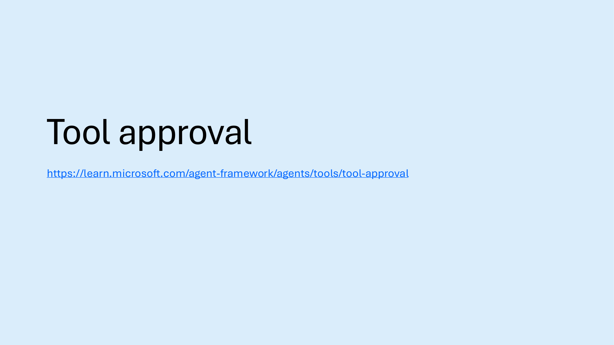

```
Tool approval
https://learn.microsoft.com/agent-framework/agents/tools/tool-approval
```

## Slide 11

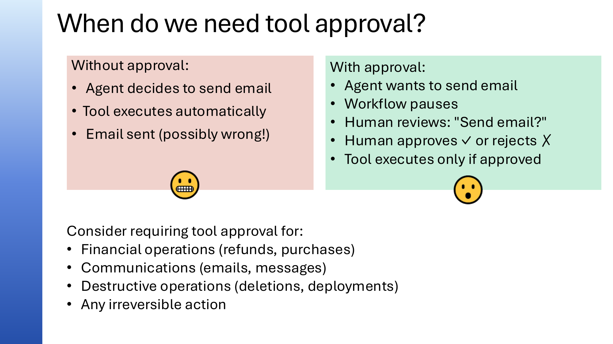

```
When do we need tool approval?
 Without approval:                    With approval:
 • Agent decides to send email        • Agent wants to send email
 • Tool executes automatically        • Workflow pauses
                                      • Human reviews: "Send email?"
 • Email sent (possibly wrong!)       • Human approves ✓ or rejects ✗
                                      • Tool executes only if approved


Consider requiring tool approval for:
• Financial operations (refunds, purchases)
• Communications (emails, messages)
• Destructive operations (deletions, deployments)
• Any irreversible action
```

## Slide 12

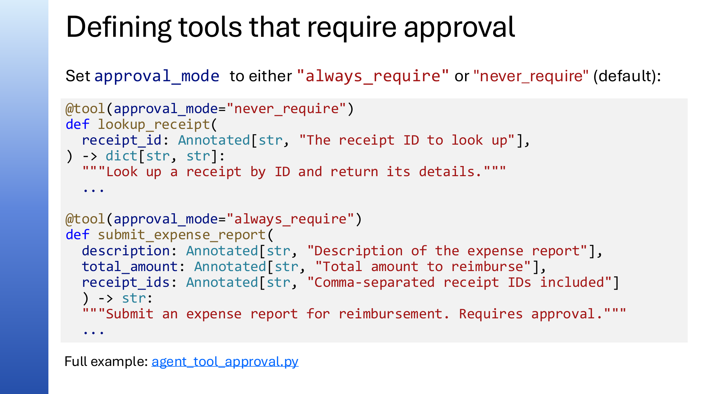

```
Defining tools that require approval
Set approval_mode to either "always_require" or "never_require" (default):
@tool(approval_mode="never_require")
def lookup_receipt(
  receipt_id: Annotated[str, "The receipt ID to look up"],
) -> dict[str, str]:
  """Look up a receipt by ID and return its details."""
  ...

@tool(approval_mode="always_require")
def submit_expense_report(
  description: Annotated[str, "Description of the expense report"],
  total_amount: Annotated[str, "Total amount to reimburse"],
  receipt_ids: Annotated[str, "Comma-separated receipt IDs included"]
  ) -> str:
  """Submit an expense report for reimbursement. Requires approval."""
  ...

Full example: agent_tool_approval.py
```

## Slide 13

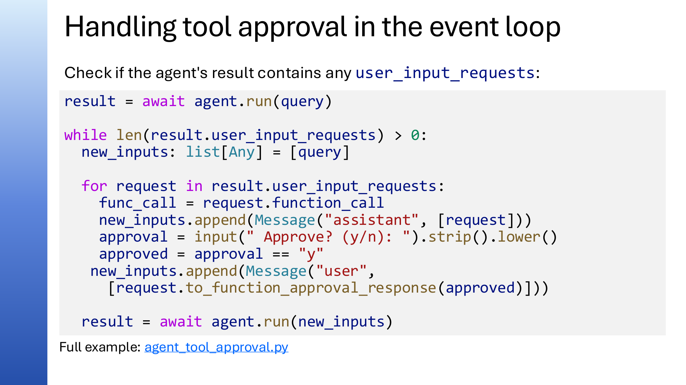

```
Handling tool approval in the event loop
Check if the agent's result contains any user_input_requests:
result = await agent.run(query)

while len(result.user_input_requests) > 0:
  new_inputs: list[Any] = [query]

   for request in result.user_input_requests:
     func_call = request.function_call
     new_inputs.append(Message("assistant", [request]))
     approval = input(" Approve? (y/n): ").strip().lower()
     approved = approval == "y"
    new_inputs.append(Message("user",
      [request.to_function_approval_response(approved)]))

   result = await agent.run(new_inputs)
Full example: agent_tool_approval.py
```

## Slide 14

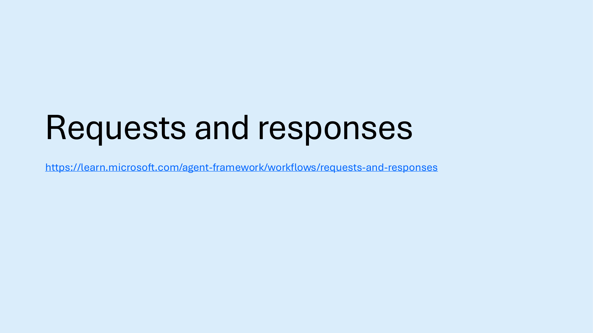

```
Requests and responses
https://learn.microsoft.com/agent-framework/workflows/requests-and-responses
```

## Slide 15

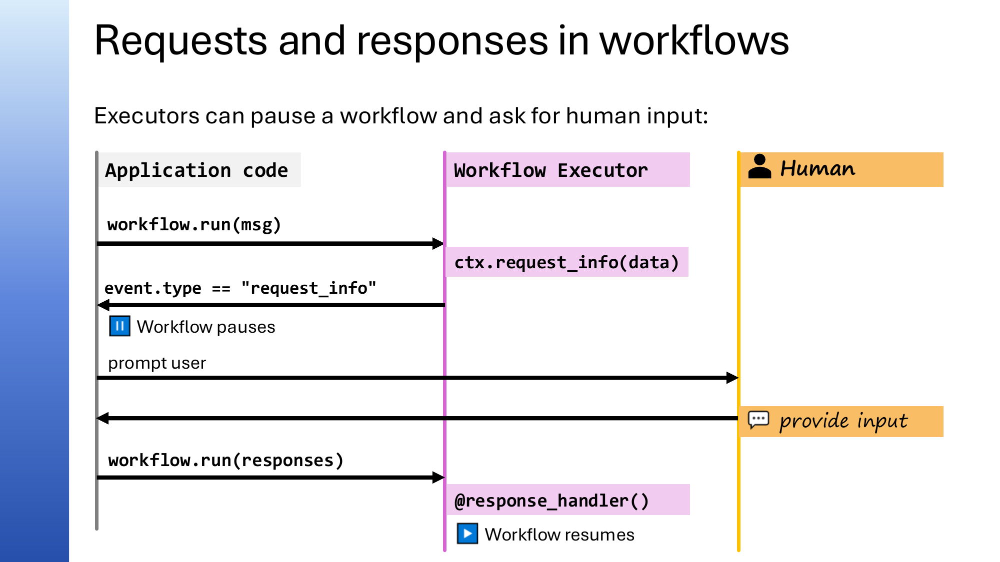

```
Requests and responses in workflows
Executors can pause a workflow and ask for human input:

 Application code               Workflow Executor         Human

 workflow.run(msg)

                                ctx.request_info(data)
event.type == "request_info"

    Workflow pauses
 prompt user


                                                          provide input

 workflow.run(responses)

                                @response_handler()
                                  Workflow resumes
```

## Slide 16

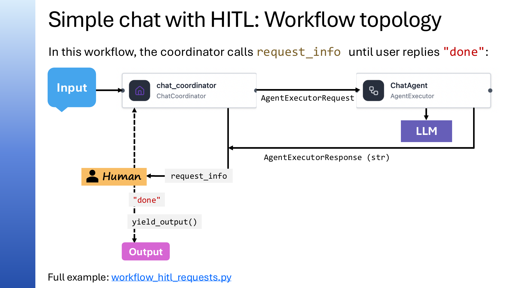

```
Simple chat with HITL: Workflow topology
In this workflow, the coordinator calls request_info until user replies "done":

 Input
                                          AgentExecutorRequest


                                                                        LLM

                                          AgentExecutorResponse (str)

           Human           request_info

                  "done"

                 yield_output()


                 Output

Full example: workflow_hitl_requests.py
```

## Slide 17

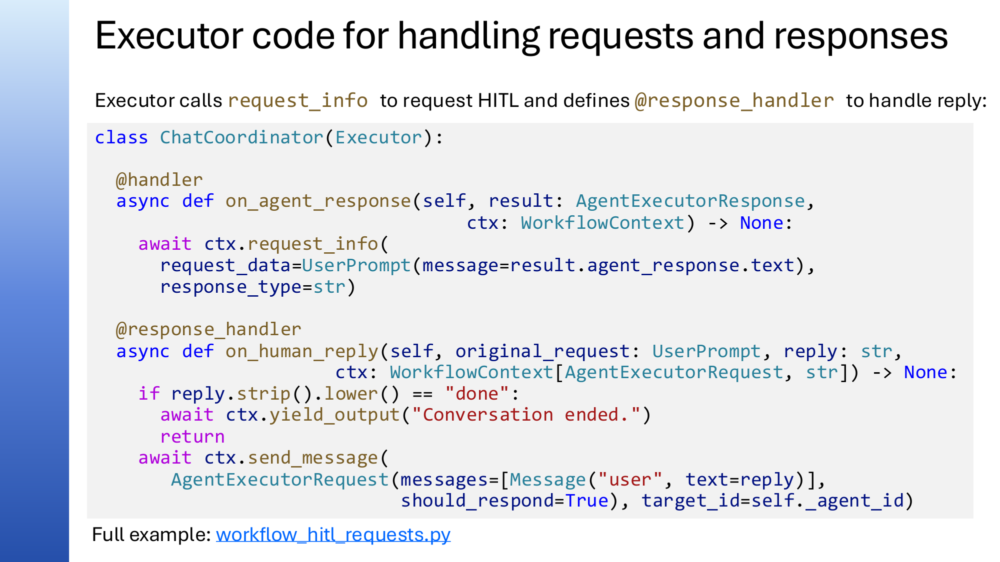

```
Executor code for handling requests and responses
Executor calls request_info to request HITL and defines @response_handler to handle reply:
class ChatCoordinator(Executor):

  @handler
  async def on_agent_response(self, result: AgentExecutorResponse,
                                  ctx: WorkflowContext) -> None:
    await ctx.request_info(
      request_data=UserPrompt(message=result.agent_response.text),
      response_type=str)

  @response_handler
  async def on_human_reply(self, original_request: UserPrompt, reply: str,
                      ctx: WorkflowContext[AgentExecutorRequest, str]) -> None:
    if reply.strip().lower() == "done":
      await ctx.yield_output("Conversation ended.")
      return
    await ctx.send_message(
       AgentExecutorRequest(messages=[Message("user", text=reply)],
                            should_respond=True), target_id=self._agent_id)
Full example: workflow_hitl_requests.py
```

## Slide 18

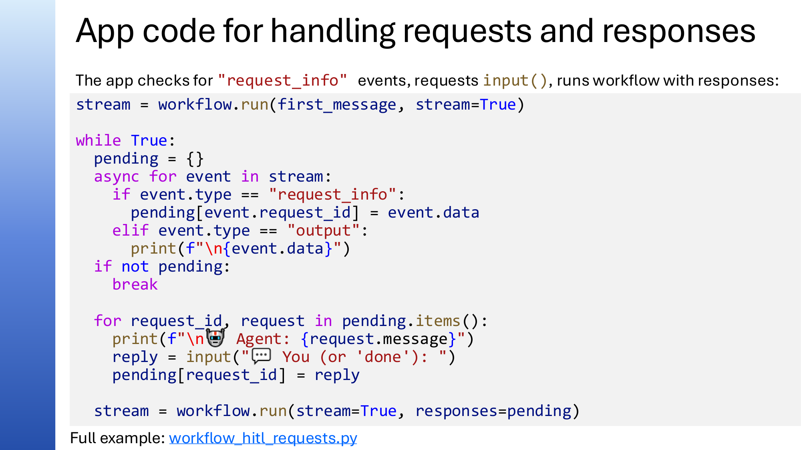

```
App code for handling requests and responses
The app checks for "request_info" events, requests input(), runs workflow with responses:
stream = workflow.run(first_message, stream=True)

while True:
  pending = {}
  async for event in stream:
    if event.type == "request_info":
      pending[event.request_id] = event.data
    elif event.type == "output":
      print(f"\n{event.data}")
  if not pending:
    break

   for request_id, request in pending.items():
     print(f"\n    Agent: {request.message}")
     reply = input("    You (or 'done'): ")
     pending[request_id] = reply

   stream = workflow.run(stream=True, responses=pending)
Full example: workflow_hitl_requests.py
```

## Slide 19

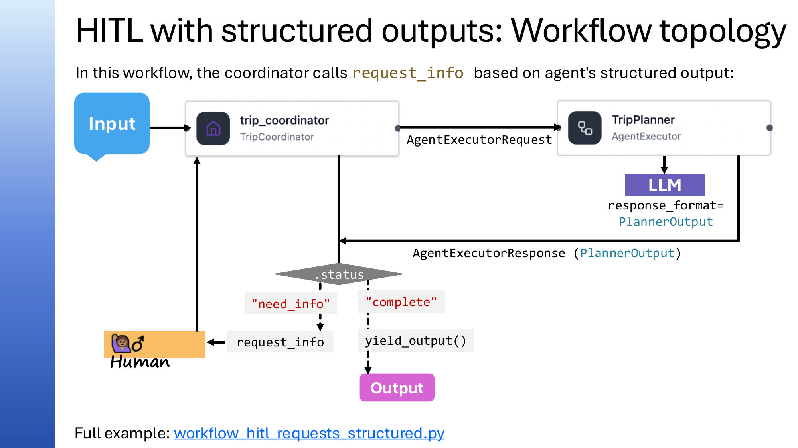

```
HITL with structured outputs: Workflow topology
In this workflow, the coordinator calls request_info based on agent's structured output:


 Input
                                               AgentExecutorRequest


                                                                                LLM
                                                                          response_format=
                                                                            PlannerOutput

                                                AgentExecutorResponse (PlannerOutput)
                                .status

                       "need_info"        "complete"


                     request_info         yield_output()
    Human
                                          Output

Full example: workflow_hitl_requests_structured.py
```

## Slide 20

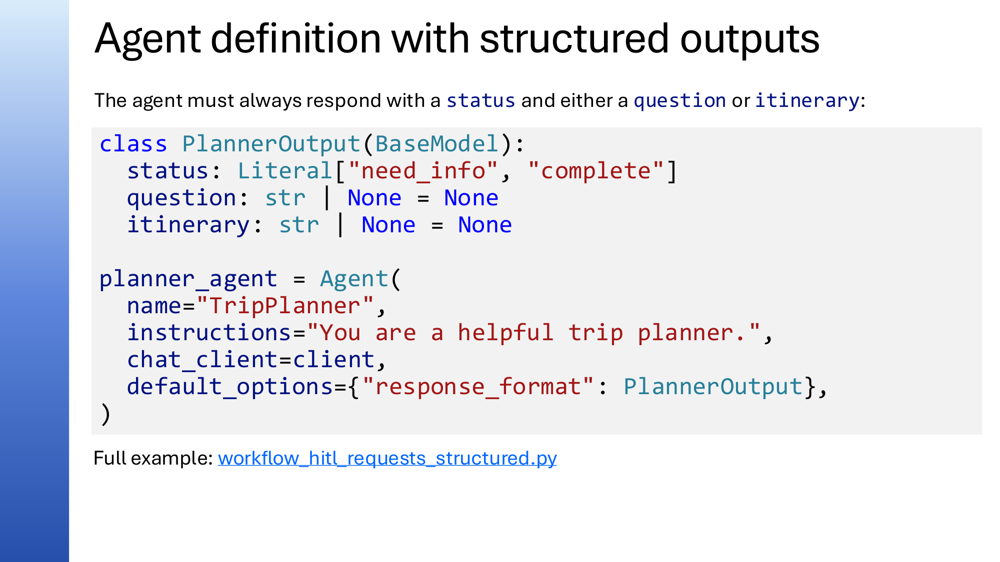

```
Agent definition with structured outputs
The agent must always respond with a status and either a question or itinerary:

class PlannerOutput(BaseModel):
  status: Literal["need_info", "complete"]
  question: str | None = None
  itinerary: str | None = None

planner_agent = Agent(
  name="TripPlanner",
  instructions="You are a helpful trip planner.",
  chat_client=client,
  default_options={"response_format": PlannerOutput},
)
Full example: workflow_hitl_requests_structured.py
```

## Slide 21

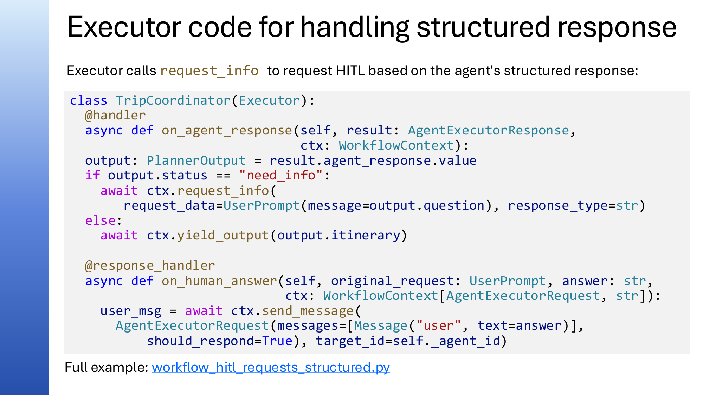

```
Executor code for handling structured response
Executor calls request_info to request HITL based on the agent's structured response:

class TripCoordinator(Executor):
  @handler
  async def on_agent_response(self, result: AgentExecutorResponse,
                               ctx: WorkflowContext):
  output: PlannerOutput = result.agent_response.value
  if output.status == "need_info":
    await ctx.request_info(
        request_data=UserPrompt(message=output.question), response_type=str)
  else:
    await ctx.yield_output(output.itinerary)

   @response_handler
   async def on_human_answer(self, original_request: UserPrompt, answer: str,
                             ctx: WorkflowContext[AgentExecutorRequest, str]):
     user_msg = await ctx.send_message(
       AgentExecutorRequest(messages=[Message("user", text=answer)],
           should_respond=True), target_id=self._agent_id)
Full example: workflow_hitl_requests_structured.py
```

## Slide 22


```
Checkpoints and resuming
https://learn.microsoft.com/agent-framework/workflows/checkpoints
```

## Slide 23

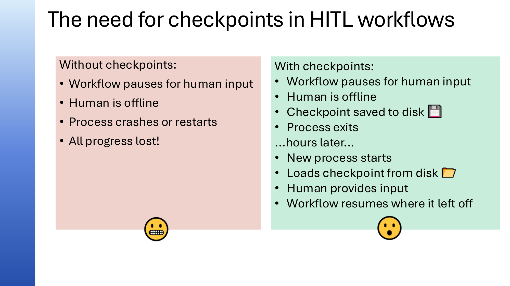

```
The need for checkpoints in HITL workflows
 Without checkpoints:                With checkpoints:
 • Workflow pauses for human input   • Workflow pauses for human input
 • Human is offline                  • Human is offline
                                     • Checkpoint saved to disk
 • Process crashes or restarts       • Process exits
 • All progress lost!                ...hours later...
                                     • New process starts
                                     • Loads checkpoint from disk
                                     • Human provides input
                                     • Workflow resumes where it left off
```

## Slide 24

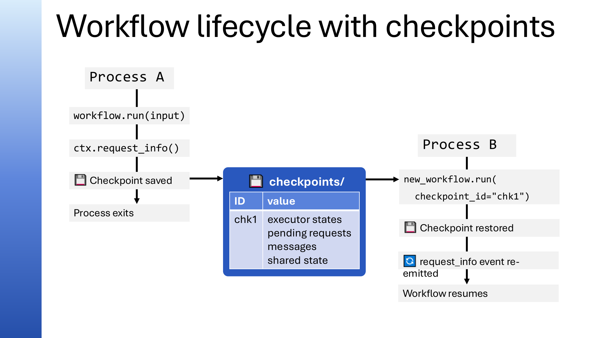

```
Workflow lifecycle with checkpoints
    Process A

 workflow.run(input)

 ctx.request_info()                                Process B

    Checkpoint saved         checkpoints/      new_workflow.run(
                                                 checkpoint_id="chk1")
                       ID   value
 Process exits
                       chk1 executor states
                            pending requests      Checkpoint restored
                            messages
                            shared state          request_info event re-
                                               emitted
                                               Workflow resumes
```

## Slide 25

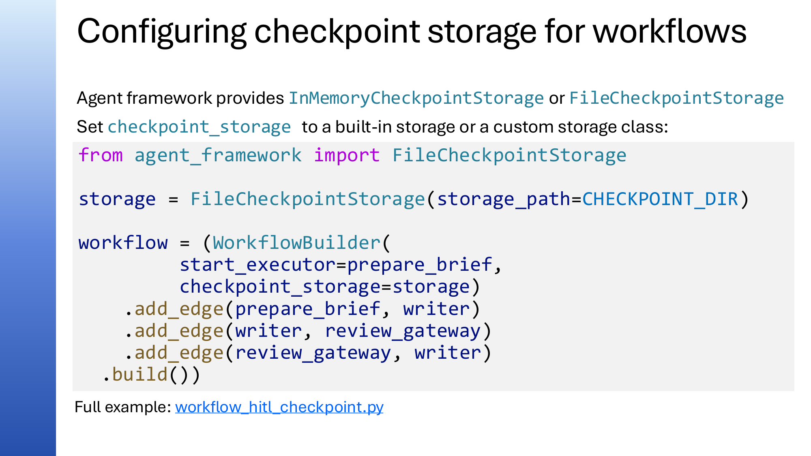

```
Configuring checkpoint storage for workflows
Agent framework provides InMemoryCheckpointStorage or FileCheckpointStorage
Set checkpoint_storage to a built-in storage or a custom storage class:
from agent_framework import FileCheckpointStorage

storage = FileCheckpointStorage(storage_path=CHECKPOINT_DIR)

workflow = (WorkflowBuilder(
         start_executor=prepare_brief,
         checkpoint_storage=storage)
    .add_edge(prepare_brief, writer)
    .add_edge(writer, review_gateway)
    .add_edge(review_gateway, writer)
  .build())
Full example: workflow_hitl_checkpoint.py
```

## Slide 26

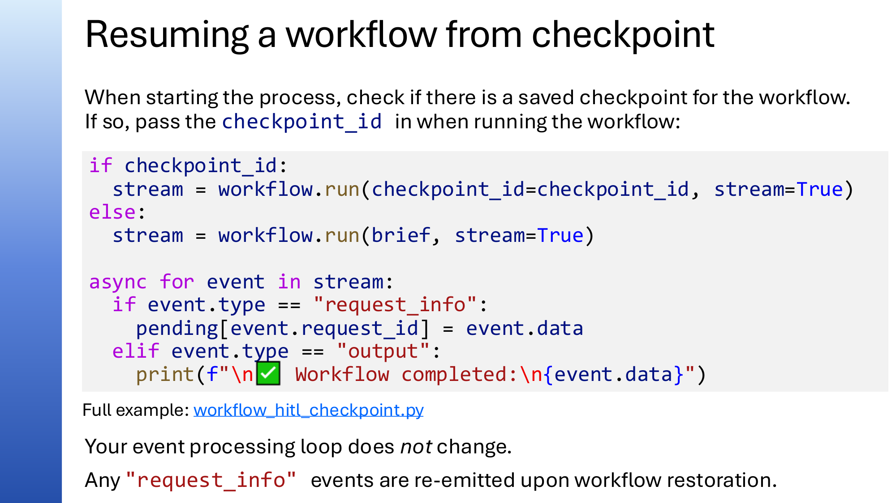

```
Resuming a workflow from checkpoint
When starting the process, check if there is a saved checkpoint for the workflow.
If so, pass the checkpoint_id in when running the workflow:
if checkpoint_id:
  stream = workflow.run(checkpoint_id=checkpoint_id, stream=True)
else:
  stream = workflow.run(brief, stream=True)

async for event in stream:
  if event.type == "request_info":
    pending[event.request_id] = event.data
  elif event.type == "output":
    print(f"\n    Workflow completed:\n{event.data}")
Full example: workflow_hitl_checkpoint.py

Your event processing loop does not change.
Any "request_info" events are re-emitted upon workflow restoration.
```

## Slide 27

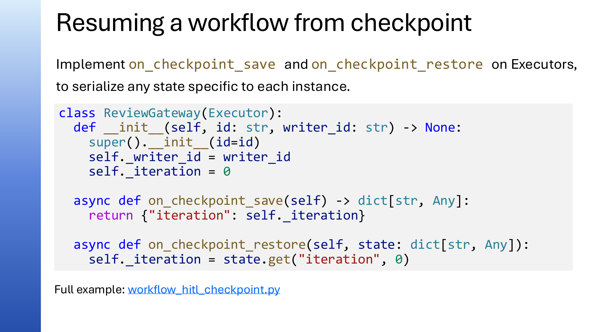

```
Resuming a workflow from checkpoint
Implement on_checkpoint_save and on_checkpoint_restore on Executors,
to serialize any state specific to each instance.
class ReviewGateway(Executor):
  def __init__(self, id: str, writer_id: str) -> None:
    super().__init__(id=id)
    self._writer_id = writer_id
    self._iteration = 0

   async def on_checkpoint_save(self) -> dict[str, Any]:
     return {"iteration": self._iteration}

   async def on_checkpoint_restore(self, state: dict[str, Any]):
     self._iteration = state.get("iteration", 0)

Full example: workflow_hitl_checkpoint.py
```

## Slide 28

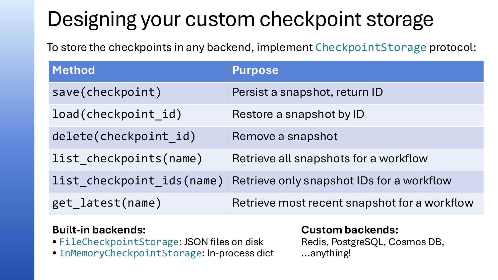

```
Designing your custom checkpoint storage
To store the checkpoints in any backend, implement CheckpointStorage protocol:
Method                             Purpose
save(checkpoint)                   Persist a snapshot, return ID
load(checkpoint_id)                Restore a snapshot by ID
delete(checkpoint_id)              Remove a snapshot
list_checkpoints(name)             Retrieve all snapshots for a workflow
list_checkpoint_ids(name) Retrieve only snapshot IDs for a workflow
get_latest(name)                   Retrieve most recent snapshot for a workflow

Built-in backends:                              Custom backends:
• FileCheckpointStorage: JSON files on disk     Redis, PostgreSQL, Cosmos DB,
• InMemoryCheckpointStorage: In-process dict    ...anything!
```

## Slide 29

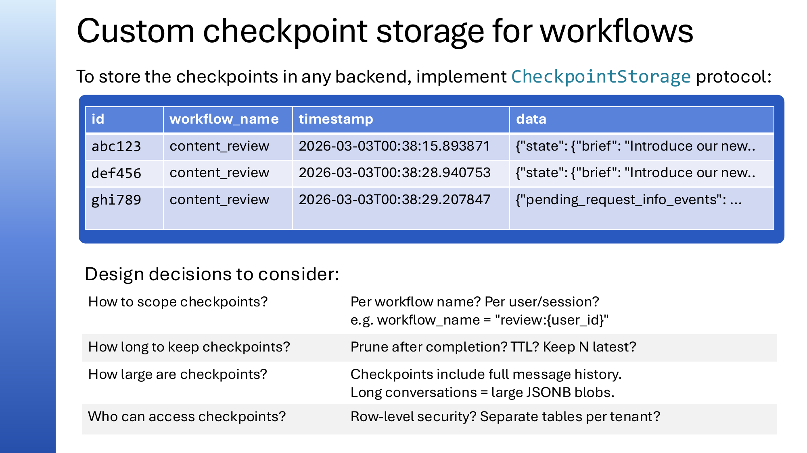

```
Custom checkpoint storage for workflows
To store the checkpoints in any backend, implement CheckpointStorage protocol:

 id         workflow_name        timestamp                      data
 abc123     content_review       2026-03-03T00:38:15.893871     {"state": {"brief": "Introduce our new..
 def456     content_review       2026-03-03T00:38:28.940753     {"state": {"brief": "Introduce our new..
 ghi789     content_review       2026-03-03T00:38:29.207847     {"pending_request_info_events": ...


Design decisions to consider:
 How to scope checkpoints?             Per workflow name? Per user/session?
                                       e.g. workflow_name = "review:{user_id}"
 How long to keep checkpoints?         Prune after completion? TTL? Keep N latest?
 How large are checkpoints?            Checkpoints include full message history.
                                       Long conversations = large JSONB blobs.
 Who can access checkpoints?           Row-level security? Separate tables per tenant?
```

## Slide 30

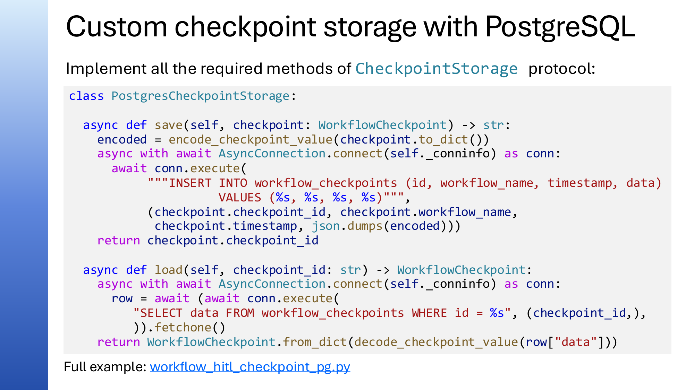

```
Custom checkpoint storage with PostgreSQL
Implement all the required methods of CheckpointStorage protocol:
class PostgresCheckpointStorage:

  async def save(self, checkpoint: WorkflowCheckpoint) -> str:
    encoded = encode_checkpoint_value(checkpoint.to_dict())
    async with await AsyncConnection.connect(self._conninfo) as conn:
      await conn.execute(
           """INSERT INTO workflow_checkpoints (id, workflow_name, timestamp, data)
                     VALUES (%s, %s, %s, %s)""",
           (checkpoint.checkpoint_id, checkpoint.workflow_name,
            checkpoint.timestamp, json.dumps(encoded)))
    return checkpoint.checkpoint_id

  async def load(self, checkpoint_id: str) -> WorkflowCheckpoint:
    async with await AsyncConnection.connect(self._conninfo) as conn:
      row = await (await conn.execute(
         "SELECT data FROM workflow_checkpoints WHERE id = %s", (checkpoint_id,),
         )).fetchone()
    return WorkflowCheckpoint.from_dict(decode_checkpoint_value(row["data"]))
Full example: workflow_hitl_checkpoint_pg.py
```

## Slide 31

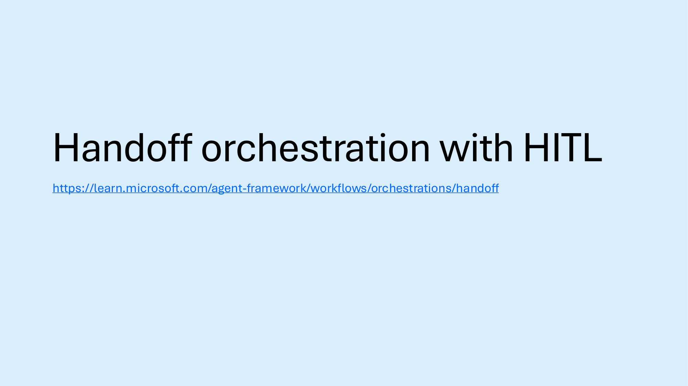

```
Handoff orchestration with HITL
https://learn.microsoft.com/agent-framework/workflows/orchestrations/handoff
```

## Slide 32

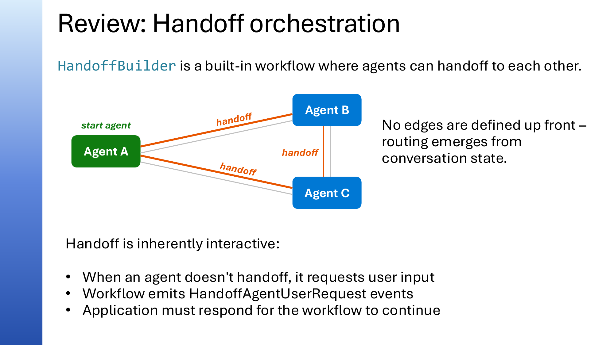

```
Review: Handoff orchestration
HandoffBuilder is a built-in workflow where agents can handoff to each other.

                                          Agent B
   start agent                                      No edges are defined up front –
                                                    routing emerges from
   Agent A                            handoff
                                                    conversation state.

                                          Agent C


 Handoff is inherently interactive:

 • When an agent doesn't handoff, it requests user input
 • Workflow emits HandoffAgentUserRequest events
 • Application must respond for the workflow to continue
```

## Slide 33

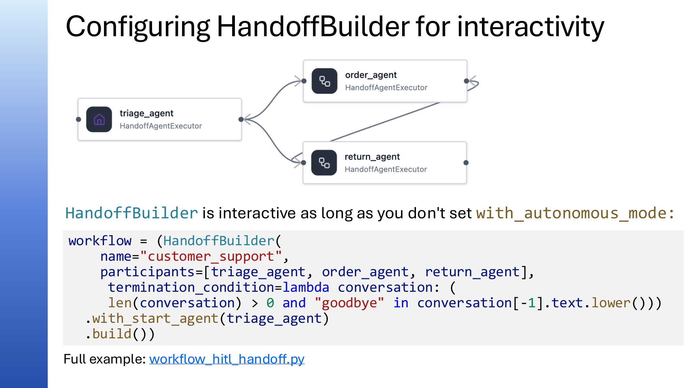

```
Configuring HandoffBuilder for interactivity


HandoffBuilder is interactive as long as you don't set with_autonomous_mode:
workflow = (HandoffBuilder(
    name="customer_support",
    participants=[triage_agent, order_agent, return_agent],
     termination_condition=lambda conversation: (
     len(conversation) > 0 and "goodbye" in conversation[-1].text.lower()))
  .with_start_agent(triage_agent)
  .build())
Full example: workflow_hitl_handoff.py
```

## Slide 34

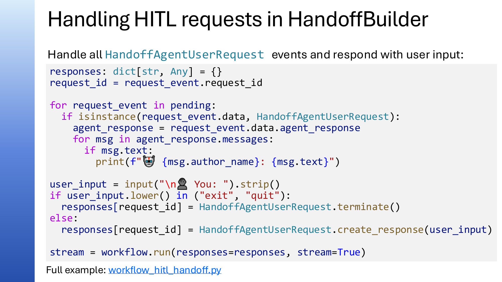

```
Handling HITL requests in HandoffBuilder
Handle all HandoffAgentUserRequest events and respond with user input:
responses: dict[str, Any] = {}
request_id = request_event.request_id

for request_event in pending:
  if isinstance(request_event.data, HandoffAgentUserRequest):
    agent_response = request_event.data.agent_response
    for msg in agent_response.messages:
      if msg.text:
        print(f"    {msg.author_name}: {msg.text}")

user_input = input("\n   You: ").strip()
if user_input.lower() in ("exit", "quit"):
  responses[request_id] = HandoffAgentUserRequest.terminate()
else:
  responses[request_id] = HandoffAgentUserRequest.create_response(user_input)

stream = workflow.run(responses=responses, stream=True)
Full example: workflow_hitl_handoff.py
```

## Slide 35


```
End-to-end application
```

## Slide 36

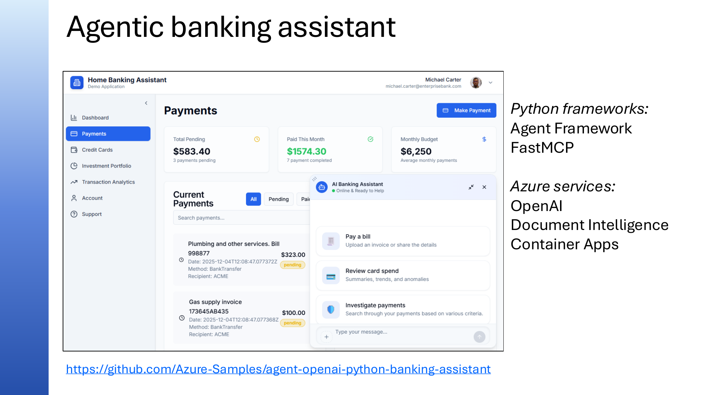

```
Agentic banking assistant

                                                                         Python frameworks:
                                                                         Agent Framework
                                                                         FastMCP

                                                                         Azure services:
                                                                         OpenAI
                                                                         Document Intelligence
                                                                         Container Apps


https://github.com/Azure-Samples/agent-openai-python-banking-assistant
```

## Slide 37

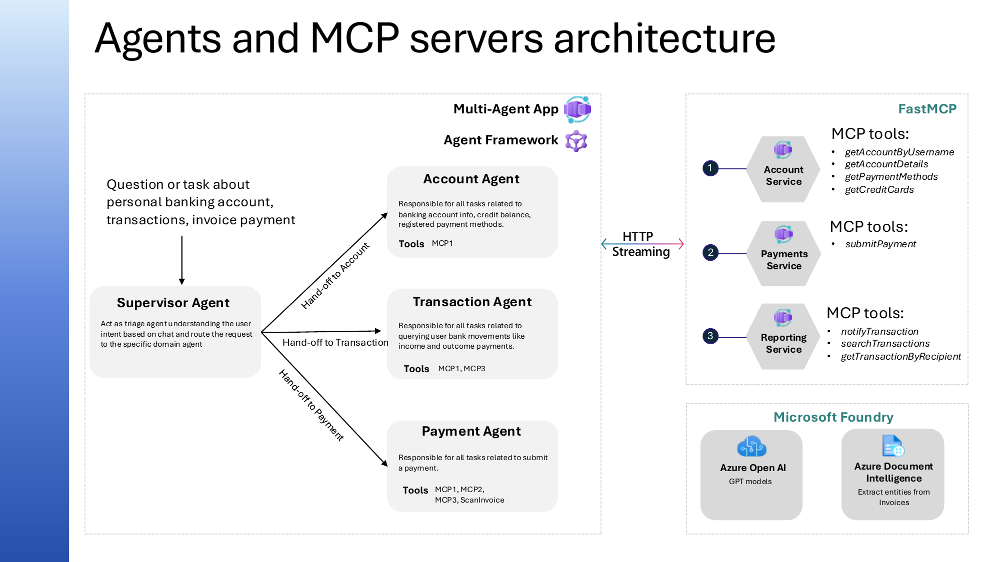

```
Agents and MCP servers architecture
                                                                                      Multi-Agent App                                                                    FastMCP
                                                                                                                                                        MCP tools:
           Users                                                                    Agent Framework
                                                                                                                                                        •   getAccountByUsername
                                                                                                                                 1                      •   getAccountDetails
                                                                                                                                             Account
 Question or task about                                                       Account Agent                                      1           Service    •
                                                                                                                                                        •
                                                                                                                                                            getPaymentMethods
                                                                                                                                                            getCreditCards
 personal banking account,                                             Responsible for all tasks related to
                                                                       banking account info, credit balance,
 transactions, invoice payment                                         registered payment methods.
                                                                                                                                                        MCP tools:
                                                                                                                       HTTP
                                                                       Tools MCP1                                                                       • submitPayment
                                                                                                                     Streaming   2           Payments
                                                                                                                                 1            Service


    Supervisor Agent                                                       Transaction Agent
                                                                                                                                                        MCP tools:
Act as triage agent understanding the user                             Responsible for all tasks related to
intent based on chat and route the request                                                                                       3                      • notifyTransaction
                                             Hand-off to Transaction
                                                                       querying user bank movements like                                    Reporting
to the specific domain agent                                           income and outcome payments.
                                                                                                                                 1           Service
                                                                                                                                                        • searchTransactions
                                                                                                                                                        • getTransactionByRecipient
                                                                        Tools     MCP1, MCP3


                                                                                                                                               Microsoft Foundry
                                                                             Payment Agent
                                                                       Responsible for all tasks related to submit
                                                                       a payment.                                                    Azure Open AI           Azure Document
                                                                                                                                     GPT models
                                                                                                                                 GPT and embeddings            Intelligence
                                                                        Tools MCP1, MCP2,                                              models                 Extract entities from
                                                                                 MCP3, ScanInvoice                                                                  Invoices
```

## Slide 38

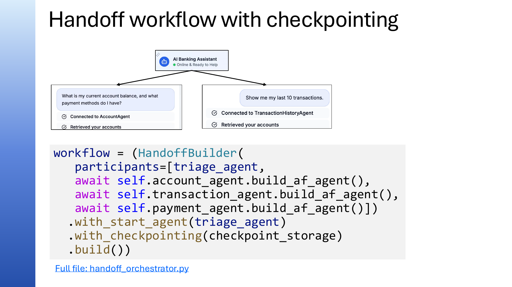

```
Handoff workflow with checkpointing


workflow = (HandoffBuilder(
   participants=[triage_agent,
   await self.account_agent.build_af_agent(),
   await self.transaction_agent.build_af_agent(),
   await self.payment_agent.build_af_agent()])
  .with_start_agent(triage_agent)
  .with_checkpointing(checkpoint_storage)
  .build())
Full file: handoff_orchestrator.py
```

## Slide 39

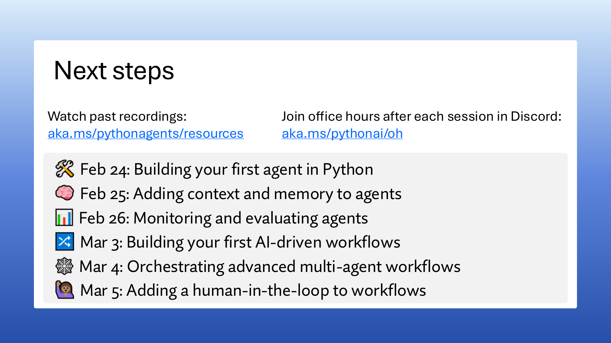

```
Next steps
Watch past recordings:          Join office hours after each session in Discord:
aka.ms/pythonagents/resources   aka.ms/pythonai/oh

    Feb 24: Building your first agent in Python
    Feb 25: Adding context and memory to agents
    Feb 26: Monitoring and evaluating agents
    Mar 3: Building your first AI-driven workflows
    Mar 4: Orchestrating advanced multi-agent workflows
    Mar 5: Adding a human-in-the-loop to workflows
```
