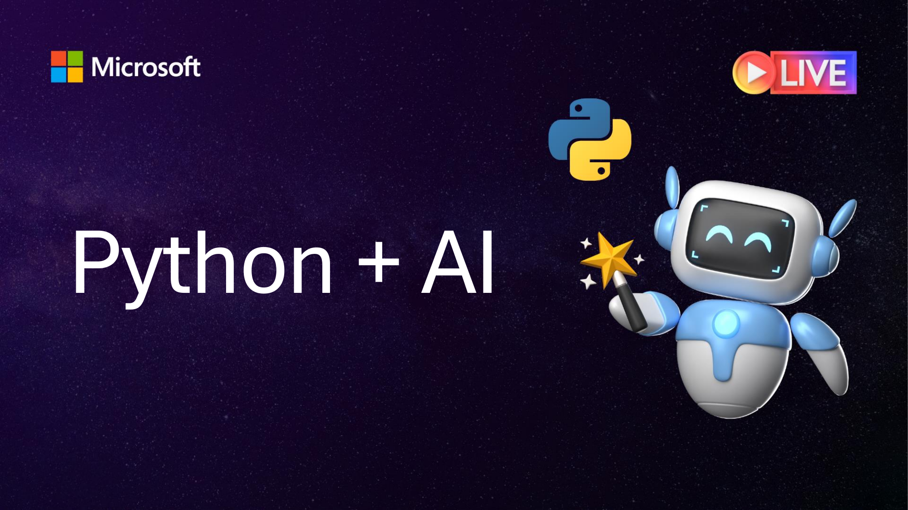
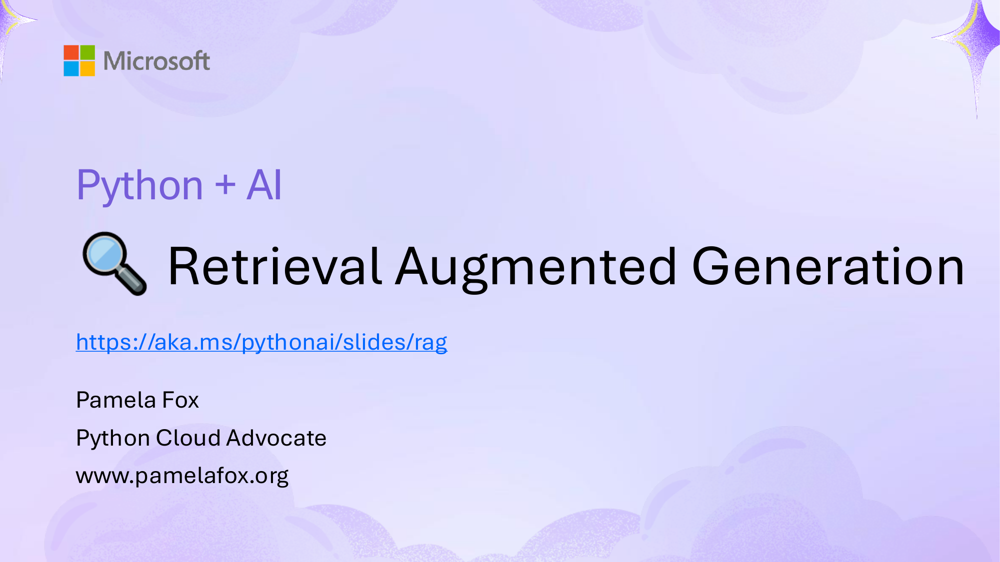

## Slide 1



```
Python + AI
```

## Slide 2


```
Python + AI
    Oct 7: LLMs
  Oct 8: Vector embeddings
    Oct 9: RAG
    Oct 14: Vision models
    Oct 15: Structured outputs
   Oct 16: AI Quality & Safety
    Oct 21: Tool calling
    Oct 22: Agents                   Register @ aka.ms/PythonAI/series
    Oct 23: Model Context Protocol
```

## Slide 3



```
Python + AI
        Retrieval Augmented Generation
https://aka.ms/pythonai/slides/rag

Pamela Fox
Python Cloud Advocate
www.pamelafox.org
```

## Slide 4


```
Today we'll cover...
• Retrieval Augmented Generation
• RAG flows, simple and advanced
• RAG on PostgreSQL database
• RAG on documents with Azure AI Search
• More ways to build RAG
```

## Slide 5


```
Want to follow along?
1. Open this GitHub repository:
https://aka.ms/python-openai-demos
2. Use "Code" button to create a GitHub Codespace:


3. Wait a few minutes for Codespace to start up
```

## Slide 6


```
Why RAG?
```

## Slide 7


```
The limitations of LLMs
                           Outdated public knowledge


   No internal knowledge
```

## Slide 8


```
Integrating domain knowledge


       Fine                     Retrieval
      tuning                   Augmented
   Learn new skills
                               Generation
    (permanently)              Learn new facts
                                (temporarily)

    High cost, time
```

## Slide 9


```
RAG in the wild
                                    GitHub Copilot (RAG on VS Code workspace)
Teams Copilot (RAG on your chats)


     Bing + Copilot
  (RAG on the web)
```

## Slide 10


```
RAG 101
```

## Slide 11


```
RAG: Retrieval Augmented Generation

                                                                       The Prius V has an
                                                                       acceleration of 9.51
How fast is the Prius V?                                               seconds from 0 to 60 mph.


                                    vehicle | year | msrp | acceleration |
                                    --- | --- | --- | --- | --- | ---
                                    Prius (1st Gen) | 1997 | 24509.74 | 7.46 |
    User                   Search   Prius (2nd Gen) | 2000 | 26832.25 | 7.97 |
                                                                                 Language Model
                                    Prius (3rd Gen) | 2009 | 24641.18 | 9.6 |
   Question                         Prius V | 2011 | 27272.28 | 9.51 |
                                    Prius C | 2012 | 19006.62 | 9.35 |
                                    Prius PHV | 2012 | 32095.61 | 8.82 |
                                    Prius C | 2013 | 19080.0 | 8.7 |
                                    Prius | 2013 | 24200.0 | 10.2 |
                                    Prius Plug-in | 2013 | 32000.0 | 9.17 |
```

## Slide 12


```
RAG with OpenAI Python SDK
user_query = "How fast is the Prius V?"
retrieved_content = "vehicle | year | msrp | acceleration | mpg | class
 --- | --- | --- | --- | --- | ---
Prius (1st Gen) | 1997 | 24509.74 | 7.46 | 41.26 | Compact
Prius (2nd Gen) | 2000 | 26832.25 | 7.97 | 45.23 | Compact..."

response = openai.chat.completions.create(
   messages = [
   {
    "role": "system",
    "content": "You must answer questions according to sources provided."
   },
   {
    "role": "user",
    "content": user_query + "\n Sources: \n" + retrieved_content
   }
])


rag_csv.py
```

## Slide 13


```
RAG with multiturn support
How fast is the Prius V?                                                             Here are the acceleration times for
                                                                                     the Honda Insight models:
                                                                                     - Insight (2010): 9.17 seconds
The Prius V has an                                                                   - Insight (2011): 9.52 seconds
acceleration of 9.51                                                                 ...
seconds from 0 to 60 mph.


how fast is Insight?


                       "how fast is insight"            vehicle | year | msrp | acceleration | mpg
                                                        --- | --- | --- | --- | --- | ---
    User                                       Search   Insight | 2010 | 19859.16 | 9.17 | 41.0        Large
                                                        Insight | 2011 | 18254.38 | 9.52 | 41.0
   Question                                             Insight | 2012 | 18555.28 | 9.42 | 42.0      Language
                                                                                                      Model
```

## Slide 14


```
RAG with multiturn support (Code)
messages = [{"role": "system", "content": SYSTEM_MESSAGE}]

while True:
 question = input("\nYour question: ")
 matches = search(question)

 messages.append({"role": "user", "content": f"{question}\nSources: {matches}"})
 response = client.chat.completions.create(
   model=MODEL_NAME,
   temperature=0.3,
   messages=messages
 )

 bot_response = response.choices[0].message.content
 messages.append({"role": "assistant", "content": bot_response})


rag_multiturn.py
```

## Slide 15


```
RAG with multiturn + query rewriting
How fast is the Prius V?

                                                                                    The 2011 Insight has an
 The Prius V has an                                                                 acceleration time of 9.52
 acceleration of 9.51                                                               seconds.
 seconds from 0 to 60 mph.


 what about the insigt?


                                      insight speed            vehicle | year | msrp | acceleration | mpg
                                                               --- | --- | --- | --- | --- | ---
    User                     Large                    Search   Insight | 2010 | 19859.16 | 9.17 | 41.0
                                                               Insight | 2011 | 18254.38 | 9.52 | 41.0
                                                                                                              Large
   Question                Language                            Insight | 2012 | 18555.28 | 9.42 | 42.0      Language
                            Model                                                                            Model
```

## Slide 16


```
RAG with multiturn + query rewriting (Code)
messages = [{"role": "system", "content": SYSTEM_MESSAGE}]

while True:
 question = input("\nYour question: ")
 response = client.chat.completions.create(
  model=MODEL_NAME,
  messages=[
   {"role": "system", "content": QUERY_REWRITE_SYSTEM_MESSAGE},
   {"role": "user", "content": f"New question: {question}\nHistory:{messages}"}])
 search_query = response.choices[0].message.content

 matches = search(search_query)
 messages.append({"role": "user", "content": f"{question}\nSources: {matches}"})
 response = client.chat.completions.create(
  model=MODEL_NAME,
  messages=messages)
 bot_response = response.choices[0].message.content
 messages.append({"role": "assistant", "content": bot_response})

rag_queryrewrite.py
```

## Slide 17


```
RAG document ingestion
For long/unstructured documents, we need an ingestion flow such as this one:
                                                                                                      [{"id": "chunk1",
                                                                                                         "doc": "bee.pdf",
                                                                                                         "text": "the bee...",
                                                                                                          "vec": [0.1234..]}]

PDF            pymupdf                         Langchain                    Azure OpenAI                        JSON


      Extract text from PDF              Split data into chunks          Vectorize chunks           Store chunks
      Other options for this step:       Split text based on sentence    Compute embeddings using   This is where you'd typically use
      Azure Document Intelligence,       boundaries and token lengths.   embedding model of your    a search service like
      Langchain document loaders,                                        choosing.                  Azure AI Search or a database
      OCR services, Unstructured, etc.   You could also use "semantic"                              like PostgreSQL.
                                         splitters and your own custom
                                         splitters.
```

## Slide 18


```
Why do we need to split documents?
1
    LLMs have limited context              75

    windows (4K – 128K)                    70


    When an LLM receives too               65

                                Accuracy
2

    much information, it can               60
    get easily distracted by
    irrelevant details.                    55


                                           50
3   The more tokens you send,                   5             10              15               20              25               30

    the higher the cost, the                                  Number of documents in input context
    slower the response.
                                    Source: Lost in the Middle: How Language Models Use Long Contexts, Liu et al. arXiv:2307.03172
```

## Slide 19


```
Optimal size of document chunk
How big should chunks be?                        Where to split chunks?

# of tokens per chunk              Recall@50     Chunk boundary strategy         Recall@50
512                                       42.4   Break at token boundary                40.9
1024                                      37.5   Preserve sentence boundaries           42.4
4096                                      36.4   10% overlapping chunks                 43.1
8191                                      34.9   25% overlapping chunks                 43.9
Source: aka.ms/ragrelevance                      Source: aka.ms/ragrelevance

A token is the unit of measurement for an        A chunking algorithm should also consider
LLM's input/output. ~1 token/word for            tables, and avoid splitting tables when
English, higher ratios for other languages.      possible.
More on token ratios: aka.ms/genai-cjk
```

## Slide 20


```
RAG document ingestion (Code)
filenames = ["data/California_carpenter_bee.pdf", "data/Centris_pallida.pdf"] all_chunks = []
for filename in filenames:
  md_text = pymupdf4llm.to_markdown(filename)

 text_splitter = RecursiveCharacterTextSplitter.from_tiktoken_encoder(
    model_name="gpt-4o", chunk_size=500, chunk_overlap=0)
 texts = text_splitter.create_documents([md_text])
 file_chunks = [{"id": f"{filename}-{(i + 1)}", "text": text.page_content}
    for i, text in enumerate(texts)]

 for file_chunk in file_chunks:
  file_chunk["embedding"] = (client.embeddings.create(
     model="text-embedding-3-small", input=file_chunk["text"])
     .data[0].embedding)

all_chunks.extend(file_chunks)


rag_documents_ingestion.py
```

## Slide 21


```
Simple RAG flow on documents (Code)
user_question = "where do digger bees live?"

docs = index.search(user_question)
context = "\n".join([f"{doc['id']}: {doc['text']}" for doc in docs[0:5]])

SYSTEM_MESSAGE = """
You must use the data set to answer the questions,
you should not provide any info that is not in the provided sources.
Cite the sources you used to answer the question inside square brackets.
The sources are in the format: <id>: <text>.
"""
response = client.chat.completions.create(
 model= "gpt-4o",
 temperature=0.3,
 messages=[
  {"role": "system", "content": SYSTEM_MESSAGE},
  {"role": "user", "content": f"{user_question}\nSources: {context}"}])


rag_documents_flow.py
```

## Slide 22


```
RAG with hybrid retrieval
Complete search stacks do better:
  • Hybrid retrieval (keywords + vectors)          Vector                     Keywords
    > vectors-only or keywords-only
  • Hybrid + Reranking > Hybrid

                                                                Fusion
search mode             groundedness   relevance                 (RRF)
vector only             2.79           1.81
text only               4.87           4.74
hybrid                  3.26           2.15
                                                            Reranking model
hybrid with reranking   4.89           4.78

Source: aka.ms/vector-search-not-enough
```

## Slide 23


```
Hybrid retrieval flow
Question: "cute gray fuzzy bee"

          Keyword search

      1   Carpenter bee
                                          Fusion               Reranking model
      2   Pacific digger bee               (RRF)
      3   Western Honeybee
                                  1   Carpenter bee        1   Pacific Digger Bee
                                  2   Pacific digger bee   2   Carpenter Bee
           Vector search
                                  3   Western Honeybee     3   Western Honeybee
      1   Carpenter bee           4   Hoverfly             4   Hoverfly
      2   Pacific digger bee
      3   Hoverfly
      4   Western Honeybee
```

## Slide 24


```
RAG with hybrid retrieval (Code)
def full_text_search(query, limit):

def vector_search(query, limit):

def reciprocal_rank_fusion(text_results, vector_results, alpha=0.5):

def rerank(query, retrieved_documents):
 encoder = CrossEncoder("cross-encoder/ms-marco-MiniLM-L-6-v2")
 scores = encoder.predict([(query, doc["text"]) for doc in retrieved_documents])
 return [v for _, v in sorted(zip(scores, retrieved_documents), reverse=True)]

def hybrid_search(query, limit):
 text_results = full_text_search(query, limit * 2)
 vector_results = vector_search(query, limit * 2)
 combined_results = reciprocal_rank_fusion(text_results, vector_results)
 combined_results = rerank(query, combined_results)
 return combined_results[:limit]


rag_documents_hybrid.py
```

## Slide 25


```
RAG data source types


             Database rows                                          Documents
            (Structured data)                                   (Unstructured data)
                                                            PDFs, docx, pptx, md, html, images

You need a way to vectorize target columns with   You need an ingestion process
an embedding model.                               for extracting, splitting, vectorizing,
                                                  and storing document chunks.

You need a way to search the vectorized rows.     You need a way to search the vectorized chunks.
```

## Slide 26


```
RAG on PostgreSQL
```

## Slide 27


```
RAG on PostgreSQL in Python: Simplified
 question = "any cheap climbing shoes?"

 cur.execute("SELECT ... ")
 results = cur.fetchall()
 for result in results:
  formatted_results += f"## {result[1]}\n\n{result[2]}\n"

 response = openai.chat.completions.create(
   messages = [
   {
    "role": "system",
    "content": "Answer questions according to sources provided."
   },
   {
    "role": "user",
    "content": question + "\n Sources: \n" + formatted _content
   }])
```

## Slide 28


```
RAG on PostgreSQL: Open-source template

                           Azure OpenAI +
                           Azure PostgreSQL Flexible Server +
                           Azure Container Apps


                           Code:
                           aka.ms/rag-postgres

                           Demo:
                           aka.ms/rag-postgres/demo
```

## Slide 29


```
RAG on PostgreSQL: flow with query rewriting
                                                                             For great hiking shoes,
                                                                             consider the TrekExtreme
                                                                             Hiking Shoes 1 or the Trailblaze
                                                                             Steel-Blue Hiking Shoes 2
what's a good shoe
for a mountain trale?


                             mountain trail shoe            [101]:
                                                            Name: TrekExtreme Hiking Shoes
   User             Large                          Search   Price: 135.99                        Large
                                                            Brand: Raptor Elite
  Question        Language                                  Type: Footwear                     Language
                   Model                                    Description: The Trek Extreme hikingModel
                                                            shoes by Raptor Elite are built to
                                                            ensure any trail.
                                                            …
```

## Slide 30


```
RAG on Azure AI Search
```

## Slide 31


```
RAG with AI Search in Python: Simplified
user_question = "What does a product manager do?"


user_question_vector = get_embedding(user_question)
r = search_client.search(user_question,
    vector_queries=[VectorizedQuery(vector=user_question_vector, fields="vector")],
sources = "\n\n".join([f"[{doc['sourcepage']}]: {doc['content']}\n" for doc in r])
response = openai_client.chat.completions.create(
  model="gpt-4o",
  messages=[
     {"role": "system",
     "content": "Answer ONLY with the facts from sources below. Cite sources with brackets."""},
     {"role": "user",
      "content": user_question + "\nSources: " + sources}])

rag-with-azure-ai-search-notebooks: rag.ipynb
```

## Slide 32


```
RAG with AI Search: Open source template
                          Azure OpenAI +
                          Azure AI Search +
                          Azure App Service/Container Apps


                          Supports simple and advanced flows
                          (Ask tab vs. Chat tab)


                          Code:
                          aka.ms/ragchat

                          Demo:
                          aka.ms/ragchat/demo
```

## Slide 33


```
RAG with AI Search: flow with query rewriting
Does the Northwind Health Plus plan
cover eye exams?

Yes, the Northwind Health Plus plan                                            Yes, the Northwind Health Plus plan
covers eye exams. 1                                                            also covers hearing tests. 1

 Hearing too?


                                             “Northwind Health                     “BenefitOptions1.pdf: Health
                                             Plus plan coverage                    Plus is a comprehensive plan       Question
Conversation                                 for eye exams and
                                                                  Retrieval with   that offers more coverage than
                                                                                                                    answering with
                           Query rewriting   hearing”                              Northwind Standard.
                                                                   AI Search       Northwind Health Plus offers      OpenAI LLM
                          with OpenAI LLM                                          coverage for emergency
                                                                                   services, mental health and
                                                                                   substance abuse coverage,
                                                                                   and out-of-network services,
                                                                                   while Northwind Standard
                                                                                   does not.”
```

## Slide 34


```
RAG with AI Search: Data ingestion
The ingestion process is handled by a Python script:


   Azure Blob          Azure Document                    Python                      Azure                   Azure
    Storage              Intelligence                                               OpenAI                  AI Search


Upload                 Extract data from           Split data into            Vectorize                 Indexing
documents              documents                   chunks                     chunks

An online version of   Supports PDF, HTML,         Split text                 Compute embeddings        ・ Document index
                       docx, pptx, xlsx, images,   based on sentence          using OpenAI embedding    ・ Chunk index
each document is
                       plus can OCR when           boundaries and token       model of your choosing.   ・ Both
necessary for          needed.                     lengths.
clickable citations.
                       Local parsers also          Langchain splitters
                       available for PDF, HTML,    could also be used here.
                       JSON, txt.
```

## Slide 35


```
Learn more
```

## Slide 36


```
More ways to build a RAG app
Component                                             Examples
Ingestion: Tools for processing data into a format    Azure: Document Intelligence
that can be indexed and processed by LLM              Local: PyMuPDF, BeautifulSoup

Retriever: A knowledge base that can efficiently      Azure: Azure AI Search, Azure CosmosDB,
retrieve sources that match a user query              Local: PostgreSQL, Qdrant, Pinecone
(Ideally supports both vector and full-text search)
LLM: A model that can answer questions based on       OpenAI: GPT-4o, GPT-4.1-mini, GPT-5
the query based on the provided sources, and can      Azure AI Studio: Meta Llama3, Mistral, Cohere R+
include citations                                     Anthropic: Claude 4.5
                                                      Google: Gemini 2.5
Orchestrator (optional): A way to organize calls to   Microsoft: Agent Framework
the retriever and LLM                                 Community: Llamaindex, Langchain

Features                                              Chat history, Feedback buttons, Text-to-speech,
                                                      User login, File upload, Access control, etc.
```

## Slide 37


```
Watch more talks about RAG
RAG Deep Dive (January 2025): 11 streams about azure-search-openai-demo
aka.ms/ragdeepdive/watch

RAGHack (August 2024): 25+ streams about building RAG on Azure
aka.ms/raghack/streams

RAG Time (March 2025): Advanced topics on RAG with Azure AI Search
aka.ms/rag-time

Building RAG from Scratch with GitHub Models
aka.ms/rag-vs-code-github-models
```

## Slide 38


```
Next steps                     Oct 7: LLMs
                             Oct 8: Vector embeddings
Join upcoming streams →       Oct 9: RAG
                              Oct 14: Vision models
Watch past recordings:        Oct 15: Structured outputs
aka.ms/pythonai/resources     Oct 16: AI Quality & Safety
                              Oct 21: Tool calling
Come to office hours on       Oct 22: Agents
Tuesdays in Discord:
                              Oct 23: Model Context Protocol
aka.ms/pythonai/oh
                            Register @ aka.ms/PythonAI/series
```

## Slide 39


```
Thank you!
```
