# Python + AI: Retrieval augmented generation

This session is part of a nine-part Python + AI series covering generative AI fundamentals with Python. This third session focuses on retrieval augmented generation (RAG) — a technique that gives LLMs access to external data so they can provide grounded, accurate answers. The talk progresses from basic RAG with a CSV file through multi-turn conversations, query rewriting, document ingestion, and hybrid search, culminating in full-stack RAG applications deployed on PostgreSQL and Azure AI Search.

## Table of contents

- [Python + AI series overview](#python--ai-series-overview)
- [Session agenda](#session-agenda)
- [Following along in GitHub Codespaces](#following-along-in-github-codespaces)
- [Why RAG?](#why-rag)
- [The limitations of LLMs](#the-limitations-of-llms)
- [Fine-tuning vs. RAG](#fine-tuning-vs-rag)
- [RAG in the wild](#rag-in-the-wild)
- [RAG 101: How retrieval augmented generation works](#rag-101-how-retrieval-augmented-generation-works)
- [Basic RAG with a CSV using the OpenAI Python SDK](#basic-rag-with-a-csv-using-the-openai-python-sdk)
- [RAG with multi-turn conversation support](#rag-with-multi-turn-conversation-support)
- [Multi-turn RAG code](#multi-turn-rag-code)
- [Query rewriting for better search results](#query-rewriting-for-better-search-results)
- [Query rewriting code](#query-rewriting-code)
- [RAG document ingestion pipeline](#rag-document-ingestion-pipeline)
- [Why split documents into chunks](#why-split-documents-into-chunks)
- [Optimal chunk size and splitting strategy](#optimal-chunk-size-and-splitting-strategy)
- [Document ingestion code](#document-ingestion-code)
- [Simple RAG flow on documents](#simple-rag-flow-on-documents)
- [Hybrid retrieval outperforms single-mode search](#hybrid-retrieval-outperforms-single-mode-search)
- [Hybrid retrieval flow](#hybrid-retrieval-flow)
- [Hybrid retrieval code](#hybrid-retrieval-code)
- [RAG data source types](#rag-data-source-types)
- [RAG on PostgreSQL](#rag-on-postgresql)
- [RAG on PostgreSQL: Simplified code](#rag-on-postgresql-simplified-code)
- [RAG on PostgreSQL: Open-source template](#rag-on-postgresql-open-source-template)
- [RAG on PostgreSQL: Flow with query rewriting](#rag-on-postgresql-flow-with-query-rewriting)
- [RAG on Azure AI Search](#rag-on-azure-ai-search)
- [RAG with AI Search: Simplified code](#rag-with-ai-search-simplified-code)
- [RAG with AI Search: Open-source template](#rag-with-ai-search-open-source-template)
- [RAG with AI Search: Flow with query rewriting](#rag-with-ai-search-flow-with-query-rewriting)
- [Data ingestion for RAG with AI Search](#data-ingestion-for-rag-with-ai-search)
- [More ways to build a RAG app](#more-ways-to-build-a-rag-app)
- [Watch more talks about RAG](#watch-more-talks-about-rag)
- [Next steps](#next-steps)
- [Q&A](#qa)

## Python + AI series overview

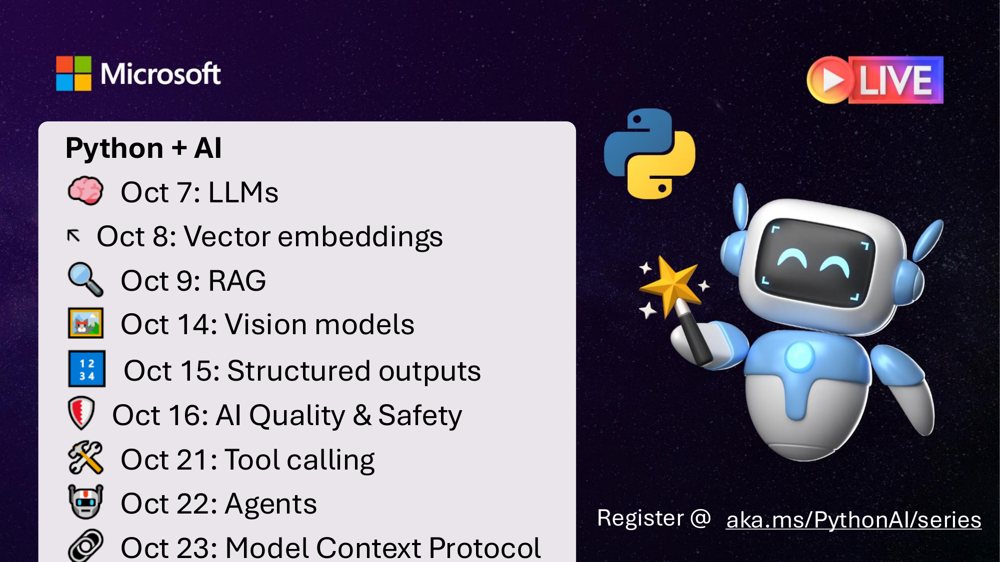
[Watch from 01:02](https://www.youtube.com/watch?v=DHebceyjCbk&t=62s)

This session is the third in a nine-part series covering generative AI with Python. The full schedule covers LLMs, vector embeddings, RAG, vision models, structured outputs, AI quality and safety, tool calling, agents, and Model Context Protocol. All slides, code samples, and recordings are linked from [aka.ms/PythonAI/series](https://aka.ms/PythonAI/series).

## Session agenda

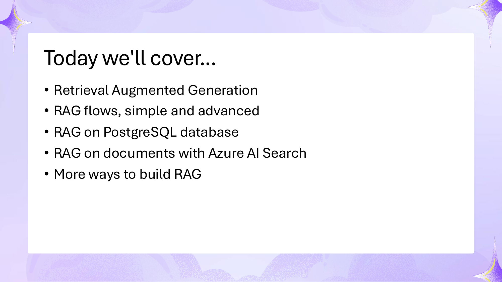
[Watch from 01:45](https://www.youtube.com/watch?v=DHebceyjCbk&t=105s)

The session covers RAG fundamentals, simple and advanced RAG flows in Python, RAG on a PostgreSQL database, RAG on documents with Azure AI Search, and additional ways to build RAG applications.

## Following along in GitHub Codespaces

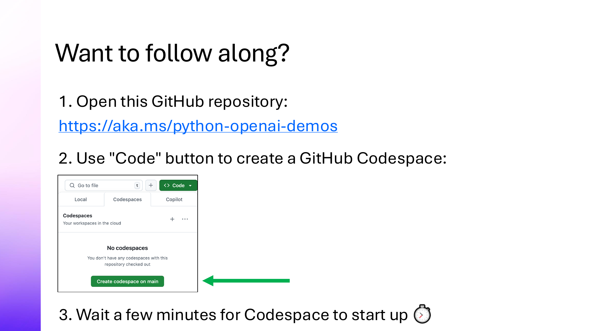
[Watch from 02:56](https://www.youtube.com/watch?v=DHebceyjCbk&t=176s)

All code examples are available in a GitHub repository at [aka.ms/python-openai-demos](https://aka.ms/python-openai-demos). Opening the repo in a GitHub Codespace provides a containerized VS Code environment with all Python packages installed and environment variables configured. When running in GitHub Codespaces, the examples use GitHub Models, which are free with a GitHub account. The repo can also be opened locally with manual configuration for any model host.

## Why RAG?

[Watch from 04:35](https://www.youtube.com/watch?v=DHebceyjCbk&t=275s)

## The limitations of LLMs

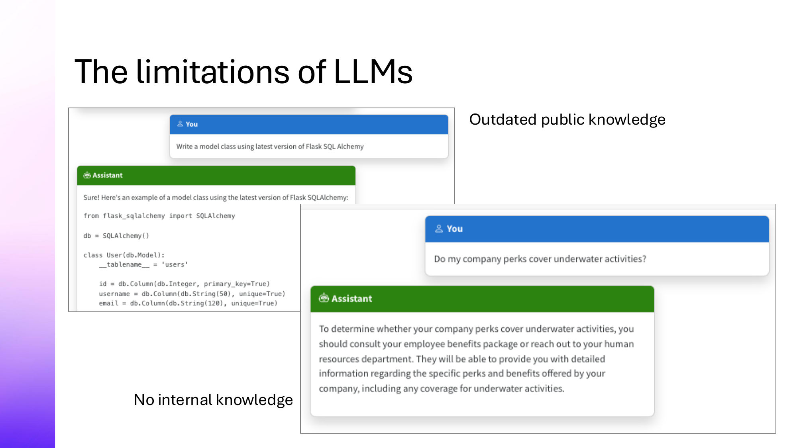
[Watch from 04:35](https://www.youtube.com/watch?v=DHebceyjCbk&t=275s)

LLMs have two fundamental limitations. First, they have outdated public knowledge — they are trained on data up to a cutoff point and cannot answer questions about anything after that date. Even when newer information exists in training data, the model is biased toward older, more abundant data. Second, LLMs have no internal knowledge at all. They have never seen private company documents, internal databases, or proprietary information. These limitations make LLMs unreliable for accurate, domain-specific answers without additional techniques.

## Fine-tuning vs. RAG

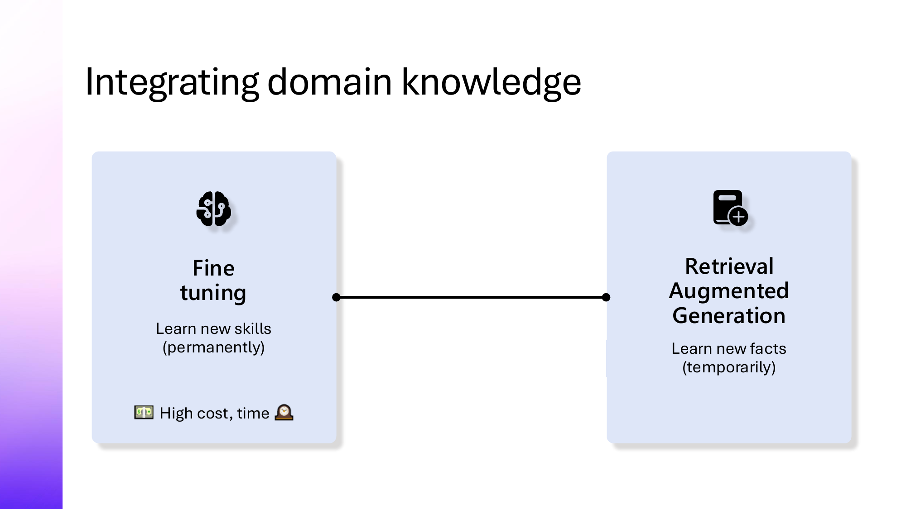
[Watch from 06:30](https://www.youtube.com/watch?v=DHebceyjCbk&t=390s)

There are two main techniques for giving LLMs domain knowledge. Fine-tuning retrains the model's outer weight layers using new data (typically around 200,000 examples), permanently encoding information into the model weights. This is expensive and time-consuming — training can take several days, and running a fine-tuned model incurs ongoing costs. Azure AI offers fine-tuning for niche domains where it makes sense. RAG, by contrast, provides information to the model on demand at query time without any training. It is more cost-effective, easier to get started with, and sufficient for most use cases.

## RAG in the wild

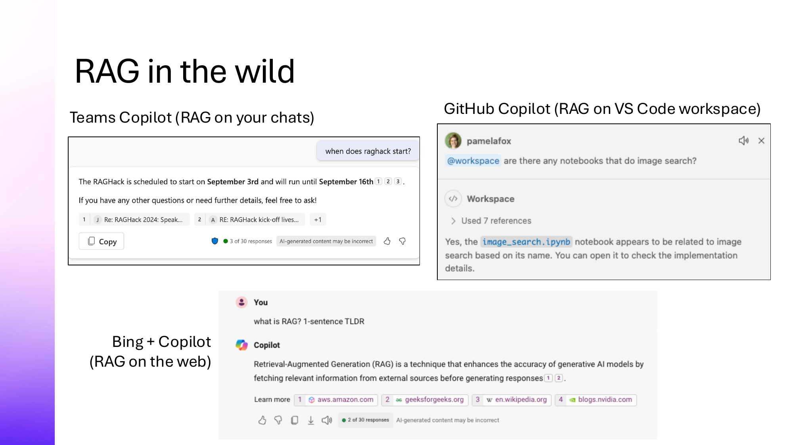
[Watch from 08:02](https://www.youtube.com/watch?v=DHebceyjCbk&t=482s)

RAG is already widely used in production. GitHub Copilot performs RAG on the VS Code workspace to answer questions about code. Teams Copilot does RAG on chat history. Bing and Copilot do RAG on the web. The telltale sign of RAG is citations, references, or footnotes in the response — these indicate the system retrieved information and answered based on it. ChatGPT's web search is also a form of RAG.

## RAG 101: How retrieval augmented generation works

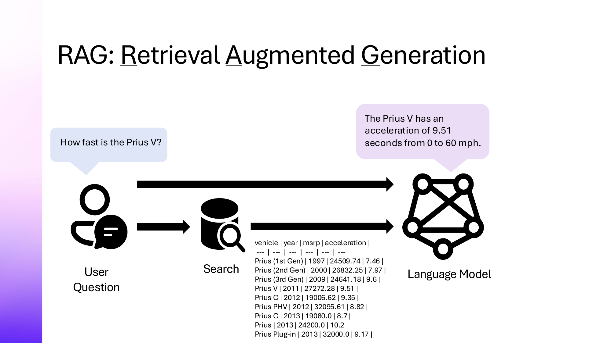
[Watch from 09:29](https://www.youtube.com/watch?v=DHebceyjCbk&t=569s)

The basic RAG flow has three steps. A user asks a question (e.g., "How fast is the Prius V?"). The system uses that question to search an authoritative data store — this could be a database, a search engine, or the web. The search returns relevant data (in this case, a table of car statistics). The user's question and the retrieved data are sent together to the LLM. The LLM then synthesizes an answer based on the retrieved data rather than relying on its own weights. The key insight is that the LLM is used for its ability to synthesize information, not for its knowledge of the world. This is analogous to a web search that opens 10 tabs and reads them all instantly, producing a synthesized answer much faster than a human could.

## Basic RAG with a CSV using the OpenAI Python SDK

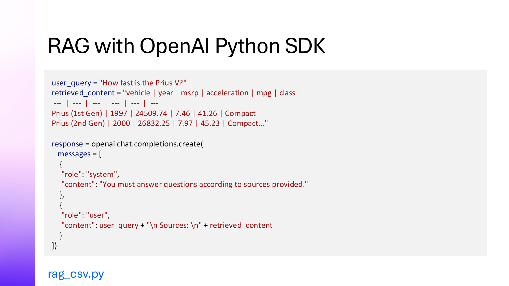
[Watch from 12:04](https://www.youtube.com/watch?v=DHebceyjCbk&t=724s)

The first code example demonstrates RAG using a simple CSV file of electric car data. The code reads the CSV, creates a small keyword search index using the Lunr Python package (a smaller alternative to Solr), and searches it with the user's question. The matching results are formatted as markdown and sent to the LLM along with a system message that instructs: "Do not provide any information that is not in the provided sources." This instruction is critical for RAG — without it, the LLM will fall back to answering from its own weights. The example uses GPT-4o with a temperature of 0.3 (lower temperatures between 0 and 0.3 work well for RAG). Even though this tiny CSV could fit entirely in the LLM's context window, the retrieval step matters for larger datasets. Sending too much information to the LLM increases cost, adds latency, and causes distraction that leads to inaccurate answers.

## RAG with multi-turn conversation support

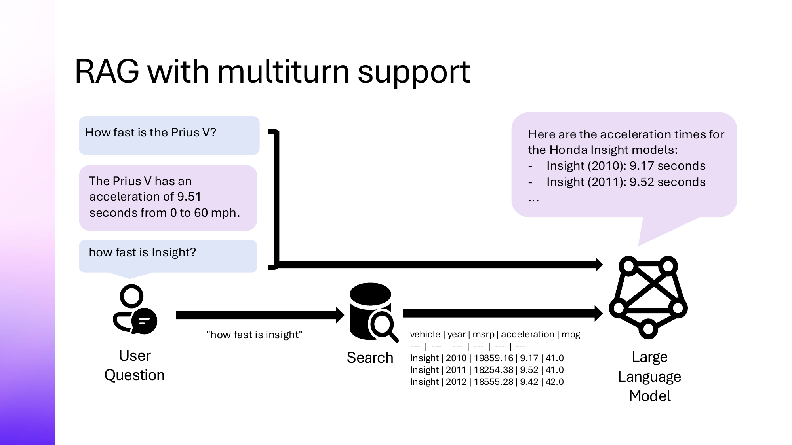
[Watch from 18:18](https://www.youtube.com/watch?v=DHebceyjCbk&t=1098s)

For conversational AI and chatbots, RAG needs multi-turn support to handle follow-up questions. In a multi-turn flow, the full conversation history is sent to the LLM with each request so it can reference earlier messages. When a user asks "how fast is the Prius V?" and then follows up with "how fast is the Insight?", the system searches for each new question and adds both the question and answer to the growing message history.

## Multi-turn RAG code

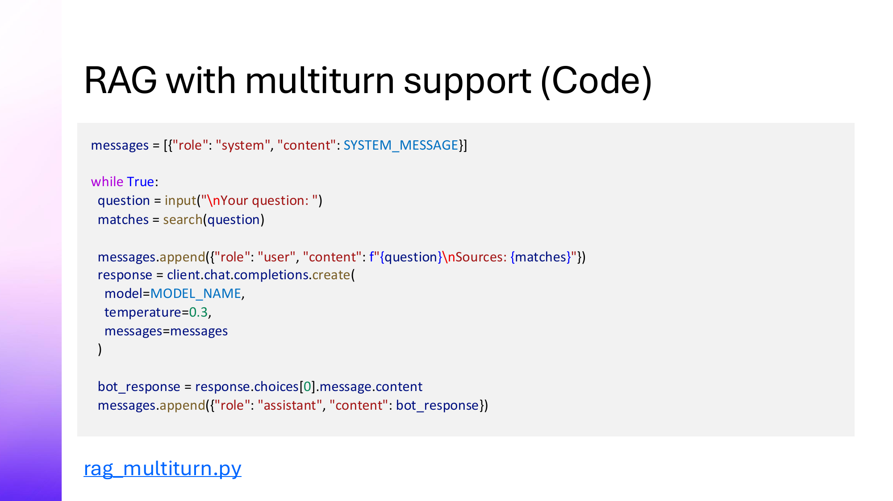
[Watch from 19:27](https://www.youtube.com/watch?v=DHebceyjCbk&t=1167s)

The multi-turn implementation uses a while loop that continuously accepts user questions. For each question, it searches the index, appends the question and sources to the messages list, sends the full message history to the LLM, and then appends the LLM's response to the messages list. This ensures subsequent questions have access to the full conversation context.

## Query rewriting for better search results

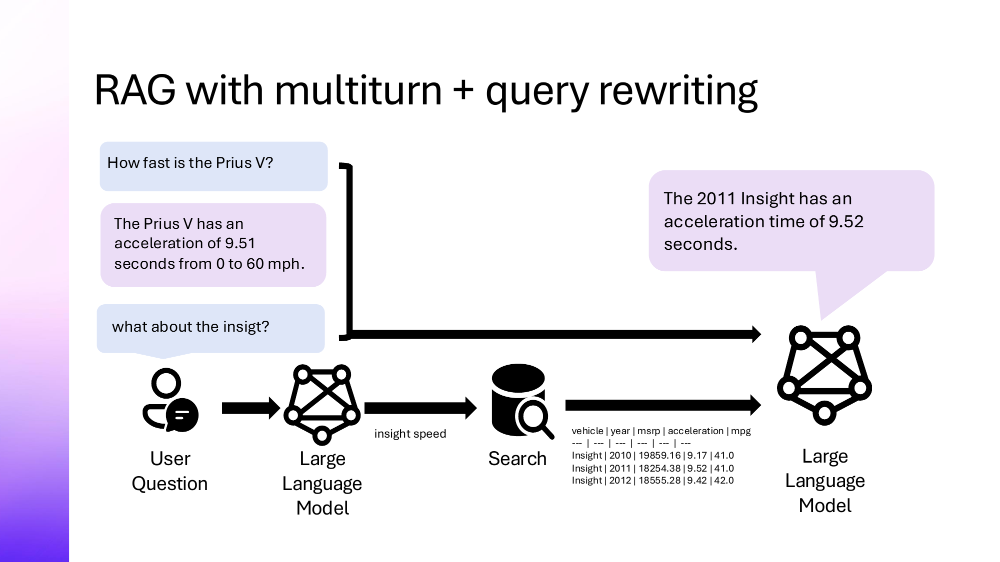
[Watch from 20:46](https://www.youtube.com/watch?v=DHebceyjCbk&t=1246s)

Follow-up questions in conversations often lack context. "What about the insight?" is meaningless without the earlier conversation about speed. Query rewriting adds an LLM call before the search step that rewrites the user's question into a better search query using the conversation context. In this example, the question "what about the insigt?" (with a spelling mistake) gets rewritten to "insight speed" — fixing the typo and extracting the relevant intent. This rewritten query produces much better search results. The two LLM calls in this flow serve different purposes: the first improves search quality through query rewriting, and the second answers the question based on the retrieved results.

## Query rewriting code

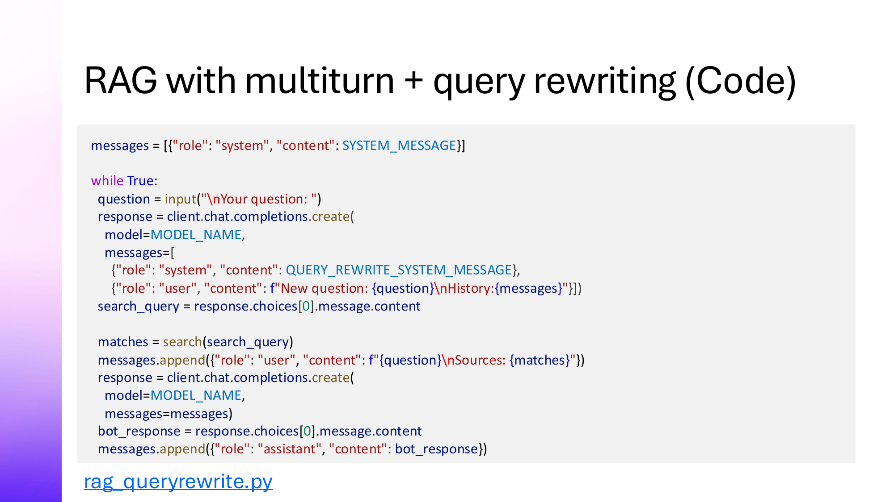
[Watch from 22:54](https://www.youtube.com/watch?v=DHebceyjCbk&t=1374s)

The query rewriting implementation adds a separate system message for the rewriting step that instructs the LLM to act as an assistant that rewrites questions into good keyword queries. It specifies no punctuation, no casing, and to respond with only the suggested query. The first LLM call takes the new user question and the conversation history and returns a rewritten search query. That query is used to search the index. The rest of the flow remains the same — results are sent to the second LLM call for answer generation.

## RAG document ingestion pipeline

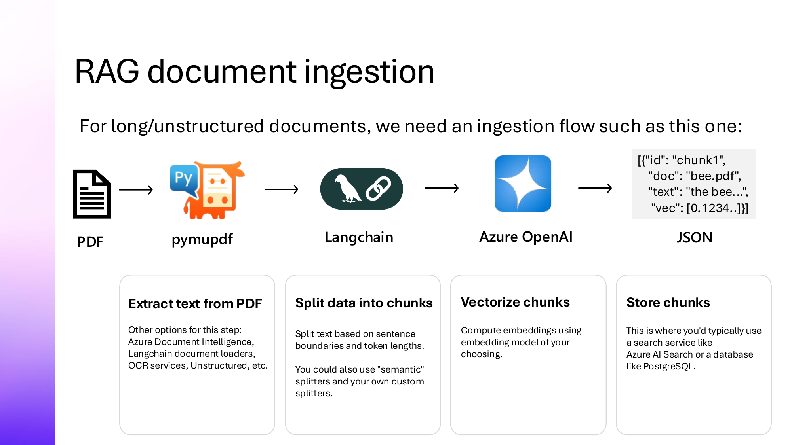
[Watch from 25:14](https://www.youtube.com/watch?v=DHebceyjCbk&t=1514s)

For unstructured documents like PDFs, a document ingestion pipeline is needed before RAG can work. The pipeline has four steps: extract text from the PDF (using PyMuPDF locally or Azure Document Intelligence in production), split the text into chunks (using LangChain's text splitters that respect sentence boundaries), vectorize each chunk using an embedding model (like text-embedding-3-small from OpenAI), and store the chunks with their embeddings in a search index (JSON locally, or Azure AI Search / PostgreSQL in production).

## Why split documents into chunks

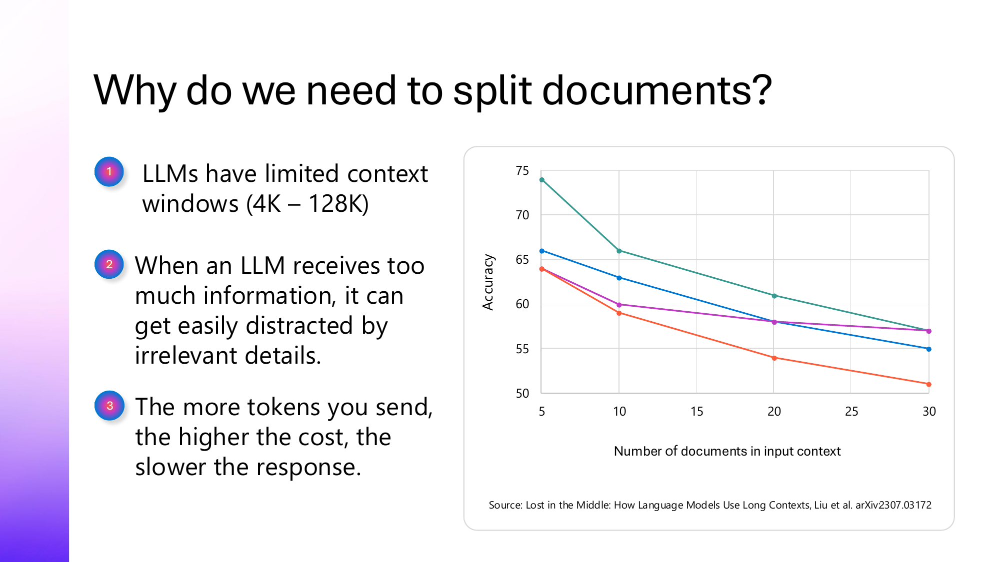
[Watch from 28:11](https://www.youtube.com/watch?v=DHebceyjCbk&t=1691s)

Splitting documents into chunks is essential for three reasons. LLMs have limited context windows — around 128,000 tokens for most current models, roughly equivalent to a 300-page document. Research shows that when an LLM receives too much information, accuracy drops because it gets distracted by irrelevant details (a finding documented in "Lost in the Middle: How Language Models Use Long Contexts" by Liu et al.). Sending more tokens also increases cost and latency. Chunking allows the system to retrieve and send only the relevant portions of documents.

## Optimal chunk size and splitting strategy

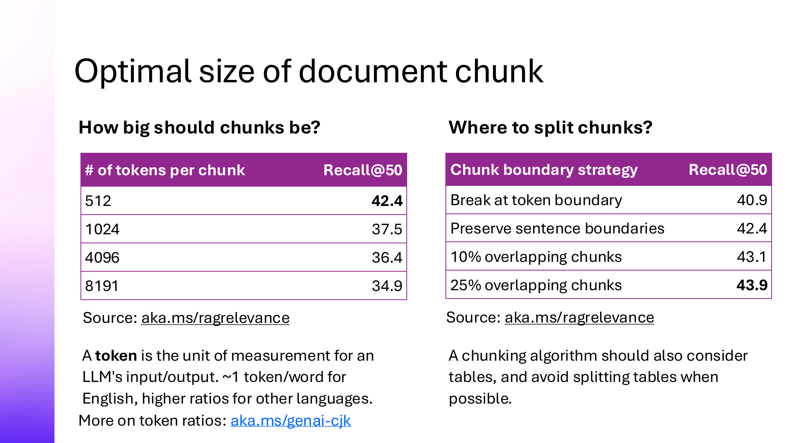
[Watch from 29:03](https://www.youtube.com/watch?v=DHebceyjCbk&t=1743s)

Research from the Azure AI Search team (documented at [aka.ms/ragrelevance](https://aka.ms/ragrelevance)) found that 512 tokens per chunk yielded the best recall at 42.4, compared to 37.5 for 1024 tokens and 34.9 for 8191 tokens. For splitting strategy, preserving sentence boundaries (recall 42.4) outperformed breaking at token boundaries (40.9), and adding 25% overlapping chunks improved recall to 43.9. With newer models and larger context windows, some practitioners are experimenting with 1024-token chunks. Non-English languages require attention because they consume more tokens per word. Tables should be kept intact and not split across chunks.

## Document ingestion code

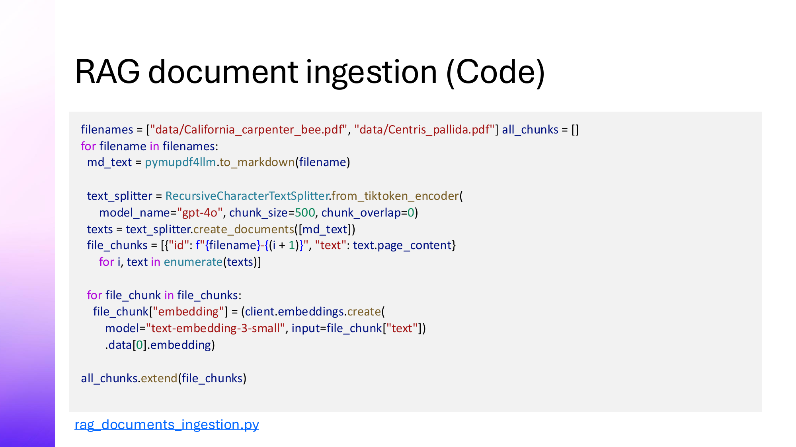
[Watch from 31:19](https://www.youtube.com/watch?v=DHebceyjCbk&t=1879s)

The ingestion code processes Wikipedia articles about bees as PDFs. For each file, `pymupdf4llm.to_markdown()` extracts text as markdown. LangChain's `RecursiveCharacterTextSplitter` splits the text with a chunk size of 500 tokens and 125-token overlap (25%). Each chunk gets assigned an ID with the filename and chunk number, then an embedding is computed using `text-embedding-3-small`. The resulting chunks (with text, ID, and embedding) are saved to a JSON file.

## Simple RAG flow on documents

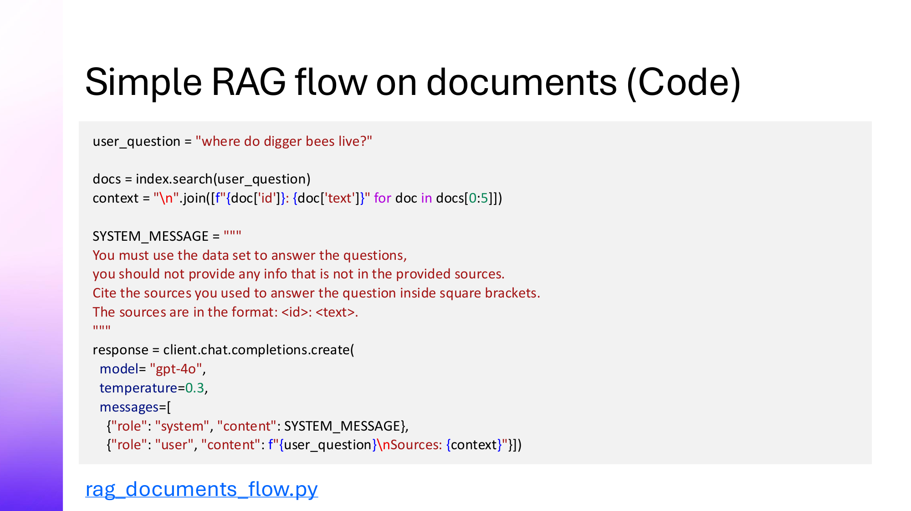
[Watch from 33:49](https://www.youtube.com/watch?v=DHebceyjCbk&t=2029s)

The RAG flow over ingested documents opens the JSON file and builds a keyword search index with Lunr. Given a user question, it searches the index, takes the top 5 results, and formats each with its document ID and text. The system message instructs the LLM to cite sources inside square brackets. When asked "Where do digger bees live?", the system returns an accurate answer with a citation pointing to the source PDF chunk, allowing users to verify the answer against the original document.

## Hybrid retrieval outperforms single-mode search

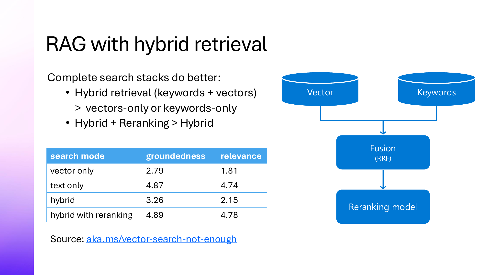
[Watch from 37:11](https://www.youtube.com/watch?v=DHebceyjCbk&t=2231s)

A complete search stack combines keyword search, vector search, result fusion, and reranking. Research (documented at [aka.ms/vector-search-not-enough](https://aka.ms/vector-search-not-enough)) shows this outperforms any single approach. In a comparison of search modes, hybrid retrieval with reranking achieved groundedness of 4.89 and relevance of 4.78, compared to vector-only (2.79 groundedness, 1.81 relevance) or text-only (4.87, 4.74). Some queries work better with keyword search (exact proper nouns), while others benefit from vector search (semantic similarity like "cute fuzzy" matching bee descriptions that don't contain those exact words). Using both together captures the strengths of each approach.

## Hybrid retrieval flow

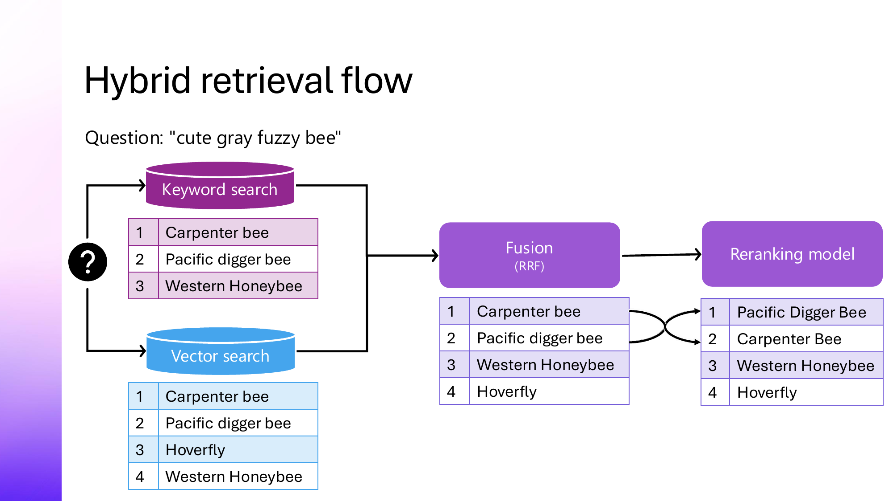
[Watch from 38:19](https://www.youtube.com/watch?v=DHebceyjCbk&t=2299s)

For the query "cute gray fuzzy bee", keyword search finds results matching "bee" while vector search additionally finds "hoverfly" (which mimics bees). Reciprocal rank fusion (RRF) merges results by scoring each based on its position in each sub-query — items ranked highly in both lists score highest, while items appearing in only one list get deprioritized. A reranking model (a cross-encoder, not an LLM) then examines each result against the original query and reorders them. In this case, reranking correctly promotes "Pacific Digger Bee" above "Carpenter Bee" because digger bees are a better match for "cute gray fuzzy."

## Hybrid retrieval code

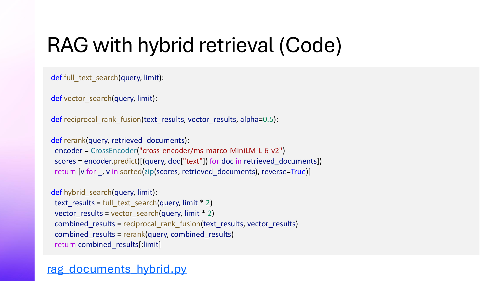
[Watch from 40:10](https://www.youtube.com/watch?v=DHebceyjCbk&t=2410s)

The hybrid search implementation has four functions. `full_text_search` uses Lunr for keyword matching. `vector_search` computes cosine similarity between the query embedding and all document embeddings (an exhaustive search — production systems use approximate methods). `reciprocal_rank_fusion` merges results using position-based scoring with no model involved. `rerank` uses a cross-encoder model (`cross-encoder/ms-marco-MiniLM-L-6-v2` from Hugging Face) that scores each document against the query. In production, a deployed reranking model like Cohere Rank avoids the latency of loading the model locally. The `hybrid_search` function chains all four steps: text search, vector search, fusion, and reranking.

## RAG data source types

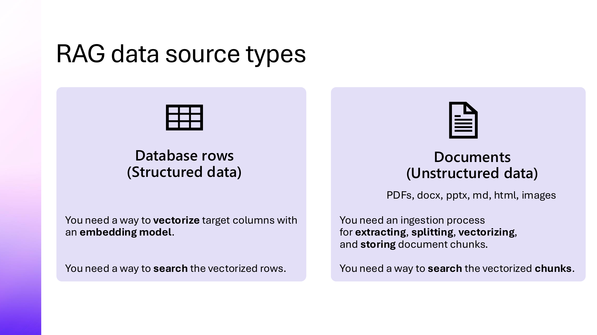
[Watch from 45:46](https://www.youtube.com/watch?v=DHebceyjCbk&t=2746s)

RAG data sources fall into two categories. Structured data (database rows) requires adding an embedding column to target columns and setting up vector search on that column. Most modern databases support this. Unstructured data (PDFs, DOCX, PPTX, markdown, HTML, images) requires a full ingestion process for extracting, splitting, vectorizing, and storing document chunks. Structured data tends to be cleaner and may not need as sophisticated a search stack as chunked document data.

## RAG on PostgreSQL

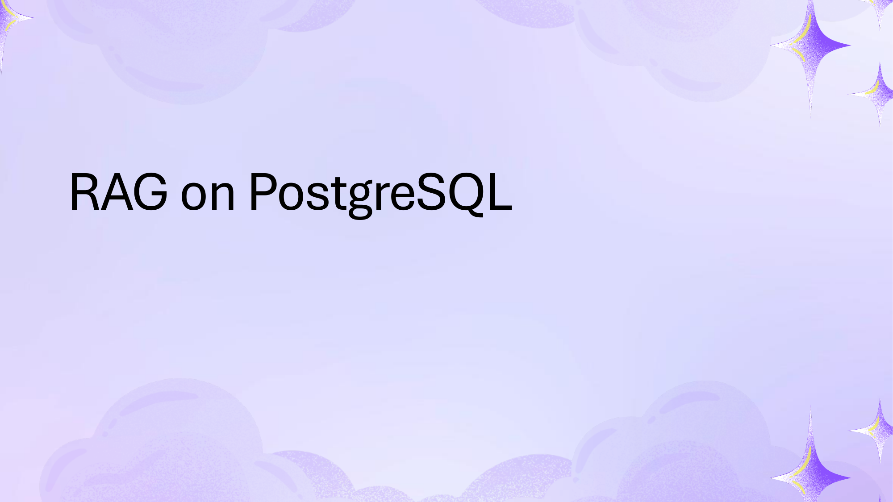
[Watch from 47:20](https://www.youtube.com/watch?v=DHebceyjCbk&t=2840s)

## RAG on PostgreSQL: Simplified code

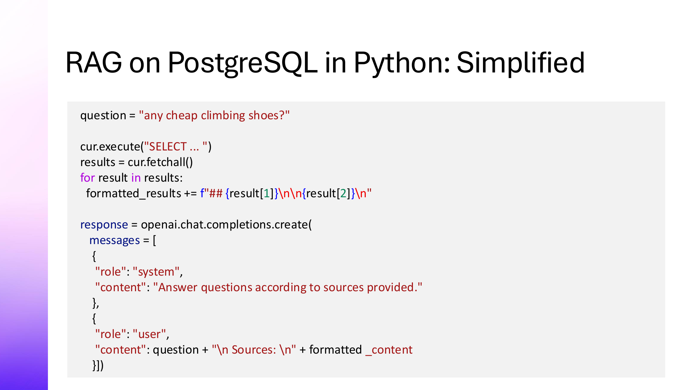
[Watch from 47:20](https://www.youtube.com/watch?v=DHebceyjCbk&t=2840s)

The simplified PostgreSQL RAG code executes a SQL query to search the database, formats the results (each row becomes a section with the product name and description), and sends the formatted results to the LLM with the user's question. The searches are SQL queries — a vector query, a full text query, and a merge query that combines both. The system uses hybrid search (both vector and full text) on the database rows.

## RAG on PostgreSQL: Open-source template

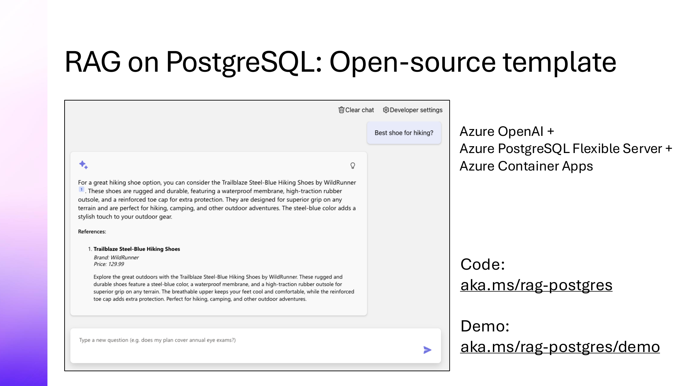
[Watch from 48:01](https://www.youtube.com/watch?v=DHebceyjCbk&t=2881s)

A full open-source template is available at [aka.ms/rag-postgres](https://aka.ms/rag-postgres) with a live demo at [aka.ms/rag-postgres/demo](https://aka.ms/rag-postgres/demo). It features a React frontend and Python FastAPI backend connected to Azure PostgreSQL Flexible Server, deployed on Azure Container Apps with Azure OpenAI. The application supports query rewriting, hybrid search, and returns results with references that link back to specific database rows.

## RAG on PostgreSQL: Flow with query rewriting

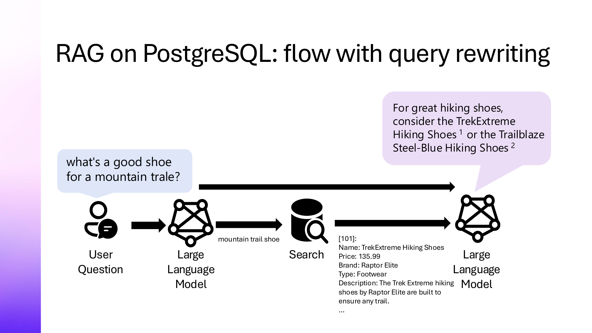
[Watch from 48:31](https://www.youtube.com/watch?v=DHebceyjCbk&t=2911s)

The PostgreSQL RAG flow includes query rewriting. When a user asks "what's a good shoe for a mountain trale?" (with a typo), the rewriting step produces "mountain trail shoe." The hybrid search (vector + full text) finds matching products from the database, and the LLM generates an answer with numbered citations referencing specific product records. The thought process view in the application reveals both the rewritten query and the retrieved database rows.

## RAG on Azure AI Search

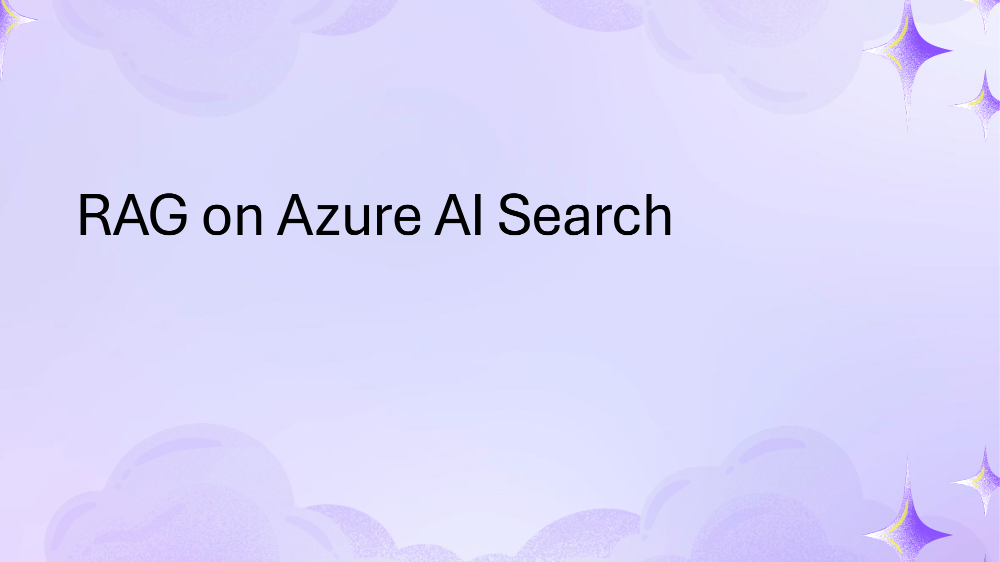
[Watch from 50:05](https://www.youtube.com/watch?v=DHebceyjCbk&t=3005s)

## RAG with AI Search: Simplified code

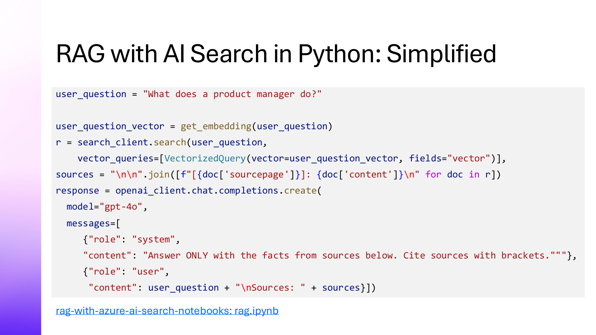
[Watch from 50:05](https://www.youtube.com/watch?v=DHebceyjCbk&t=3005s)

The simplified Azure AI Search RAG code vectorizes the user question, performs a hybrid search using the Azure AI Search SDK with `VectorizedQuery`, formats the results with source page references, and sends them to GPT-4o. The system message instructs the LLM to answer only from the provided sources and cite them with brackets. Azure AI Search is preferred for document-based RAG because it provides high-quality full text search, vector search, and semantic reranking.

## RAG with AI Search: Open-source template

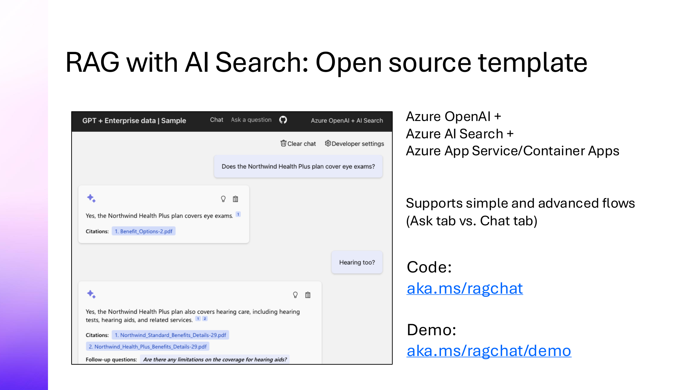
[Watch from 51:01](https://www.youtube.com/watch?v=DHebceyjCbk&t=3061s)

A full open-source template is available at [aka.ms/ragchat](https://aka.ms/ragchat) with a live demo at [aka.ms/ragchat/demo](https://aka.ms/ragchat/demo). It uses Azure OpenAI + Azure AI Search + Azure App Service or Container Apps. The application supports both simple and advanced RAG flows (Ask tab vs. Chat tab). It provides clickable citations that open the original PDF documents, lets users verify answers against source material, and supports features like image extraction from PDFs.

## RAG with AI Search: Flow with query rewriting

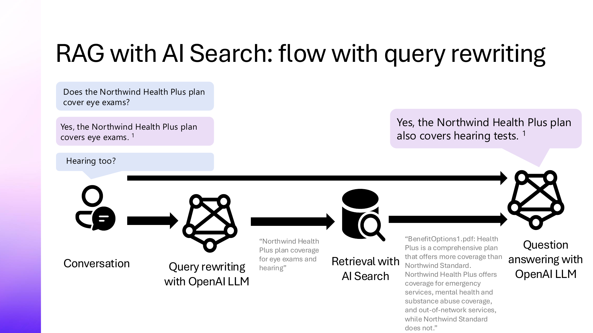
[Watch from 52:32](https://www.youtube.com/watch?v=DHebceyjCbk&t=3152s)

The AI Search RAG flow follows the same pattern as the PostgreSQL version. Given "Does the Northwind Health Plus plan cover eye exams?" and a follow-up "Hearing too?", the query rewriting step produces "Northwind Health Plus plan coverage for eye exams and hearing." The full hybrid search of the search index returns text chunks (some containing tables that were preserved during ingestion). Each chunk has both text and embeddings. The LLM answers with citations, and a best practice is to filter results by a minimum reranker score of approximately 1.8 (on a 0–4 scale) to avoid sending irrelevant results.

## Data ingestion for RAG with AI Search

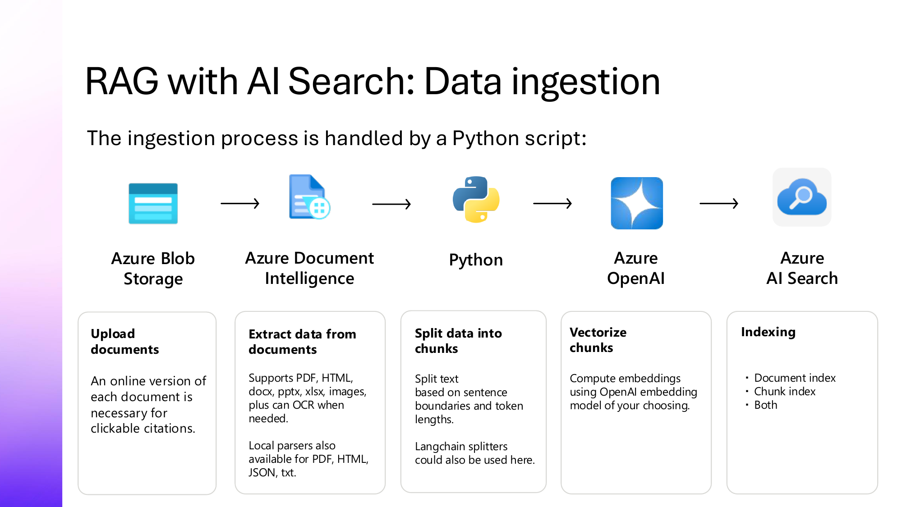
[Watch from 53:38](https://www.youtube.com/watch?v=DHebceyjCbk&t=3218s)

The production ingestion pipeline for the AI Search RAG application stores documents in Azure Blob Storage. Azure Document Intelligence extracts data from documents (PDF, HTML, DOCX, PPTX, XLSX, images) and can also extract figures and images. A Python script splits the extracted text into chunks based on sentence boundaries and token lengths. Azure OpenAI vectorizes the chunks, and they are indexed in Azure AI Search. The application supports both document-level and chunk-level indexes. Online versions of documents are stored in blob storage for clickable citations in the frontend.

## More ways to build a RAG app

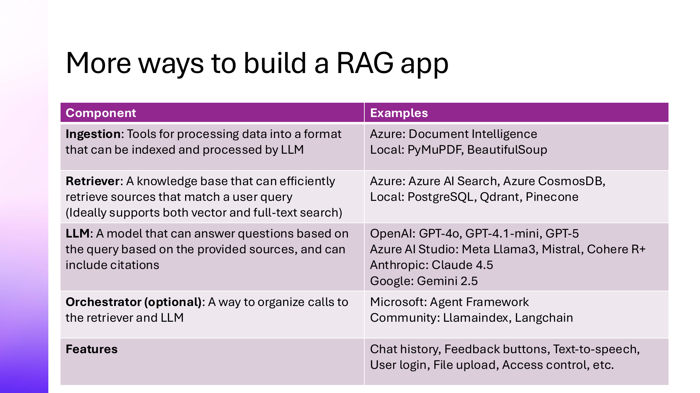
[Watch from 55:13](https://www.youtube.com/watch?v=DHebceyjCbk&t=3313s)

A RAG application has several interchangeable components. For ingestion, options include Azure Document Intelligence, PyMuPDF, and BeautifulSoup. For retrievers, choices include Azure AI Search, Azure Cosmos DB, PostgreSQL, Qdrant, and Pinecone — ideally supporting both vector and full-text search. For LLMs, GPT-5 is recommended for RAG because it is the most accurate at catching hallucinations and providing grounded answers, though GPT-4o, GPT-4.1-mini, Meta Llama3, Mistral, Cohere R+, Claude 4.5, and Gemini 2.5 are also options. Orchestrators like Microsoft Agent Framework, LlamaIndex, and LangChain can organize calls to the retriever and LLM. Additional features to consider include chat history, memory across conversations, feedback buttons, text-to-speech, user login, file upload, and data access control.

## Watch more talks about RAG

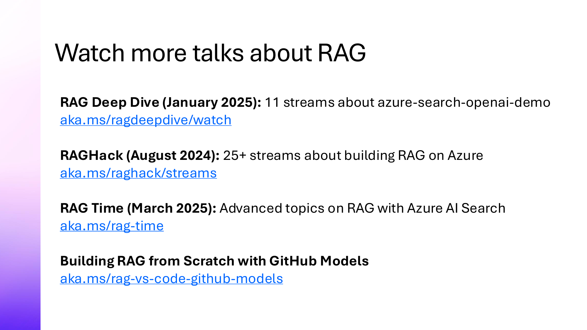
[Watch from 57:50](https://www.youtube.com/watch?v=DHebceyjCbk&t=3470s)

Additional RAG resources include the RAG Deep Dive series (11 streams covering the azure-search-openai-demo repo in depth, at [aka.ms/ragdeepdive/watch](https://aka.ms/ragdeepdive/watch)), RAGHack (25+ streams about building RAG on Azure, at [aka.ms/raghack/streams](https://aka.ms/raghack/streams)), RAG Time (advanced RAG topics with Azure AI Search, at [aka.ms/rag-time](https://aka.ms/rag-time)), and a video on building RAG from scratch with GitHub Models at [aka.ms/rag-vs-code-github-models](https://aka.ms/rag-vs-code-github-models).

## Next steps

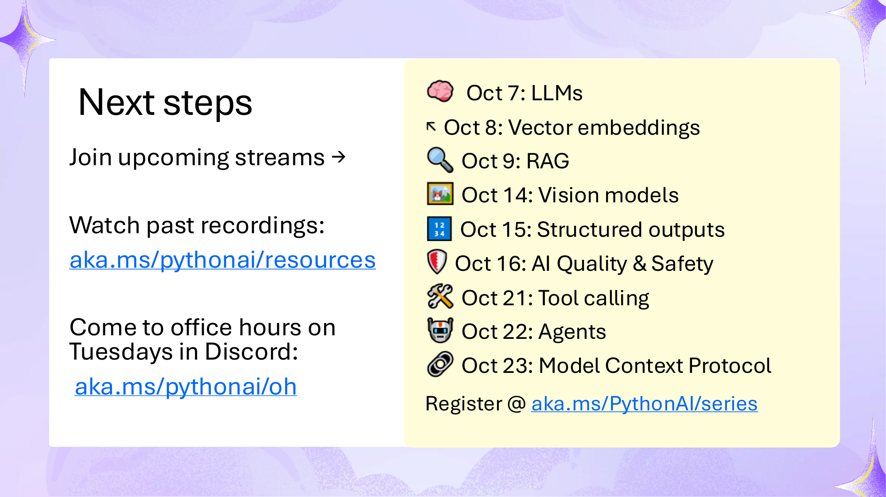
[Watch from 58:40](https://www.youtube.com/watch?v=DHebceyjCbk&t=3520s)

The series continues with vision models, structured outputs, AI quality and safety, tool calling, agents, and Model Context Protocol. All slides, code samples, and recordings are available at [aka.ms/pythonai/resources](https://aka.ms/pythonai/resources). Office hours are held on Tuesdays in the Discord at [aka.ms/pythonai/oh](https://aka.ms/pythonai/oh). Register for all sessions at [aka.ms/PythonAI/series](https://aka.ms/PythonAI/series).

## Q&A

### How do different embedding models affect retrieval accuracy?

Different embedding models have meaningful impacts on retrieval quality. The RAG on PostgreSQL template supports multiple embedding columns — for example, one for text-embedding-3-large from OpenAI and one for Nomic Embed Text (which can run locally via Ollama). To compare models, use one model (such as text-embedding-3-large with exhaustive search) as a ground truth baseline, then run the same queries with an alternative model and measure standard retrieval metrics like recall, precision, and NDCG. Each embedding column in a database should record which model and dimension count was used, since you must search with the exact same model used for embedding.

### Is it helpful to add metadata to chunks during ingestion?

Adding metadata to chunks (sometimes called content stuffing or content expansion) is a recommended technique. You can add the most recent section header, the document date, the filename, a category, or other context to each chunk. The key decision is whether that metadata should be included in what gets vectorized. Free-text metadata (section headings, descriptions) can improve vector search results. Numeric data (prices) and exact keywords (brand names) work better with keyword search and should be stored as separate searchable fields rather than embedded into the vector. Different metadata can be routed to different search modes — some included in the embedding, some only in keyword-searchable fields.

### How do you ensure reproducibility across RAG experiments?

Search results are generally deterministic — sending the same query to Azure AI Search returns consistent results. PostgreSQL with PG Vector can introduce variance when using approximation algorithms, depending on index configuration and filter settings. The bigger source of variance is the LLM itself. Setting the `seed` parameter when calling the model improves reproducibility, though hardware-level floating-point operations can still introduce minor differences. Keep all parameters constant (model, temperature, seed) and track them in evaluation configurations. Working entirely in code (rather than low-code environments) makes it easier to maintain consistency.

### How do you decide what context to send to the model?

A best practice when using Azure AI Search is to set a minimum reranker score threshold. The semantic reranker scores results on a 0–4 scale, where 4 is excellent, 3 is good, and anything below ~1.8 is likely irrelevant. Filtering out low-scoring results prevents the LLM from being distracted by irrelevant content. You can retrieve more results from the search index for comprehensiveness, as long as you drop anything below the score threshold. As LLMs get larger context windows, retrieving more high-quality results (e.g., increasing from 3 to 5 or more) is a reasonable adjustment.

### How do you analyze RAG result quality?

Create ground truth consisting of question-answer pairs that represent expected user queries and ideal answers. Run evaluations by sending each question through the current application and measuring metrics. Some metrics use an LLM as a judge (via the Azure AI Evaluation SDK) to assess groundedness. Others are simple computations — latency, answer length, and regex checks for whether citations match expected sources. Run evaluations after any major change (model updates, prompt changes) and track all parameters for consistency. The RAG Deep Dive series covers this topic in detail.

### How can you minimize Azure AI Search cost?

Azure AI Search offers a free tier (one per region) that supports basic search but not the semantic reranker. To reduce storage costs, compress vectors using binary quantization, dimension reduction, and oversampling. The [aka.ms/ragchat](https://aka.ms/ragchat) repo applies these compression techniques by default. If the budget is tight, disabling the semantic reranker and testing whether relevance remains acceptable is a practical option.

### Should RAG be used for document summarization?

RAG is not the right approach for summarizing a 300-page document because summarization requires the full content, not just relevant fragments. Instead, split the document into chapters or sections, summarize each section individually, then summarize the section summaries into a final summary. This incremental approach produces more accurate results than sending all 300 pages to the LLM at once, even if the document fits within the context window.
