# RAG with JavaScript: from concepts to code

This session covers retrieval augmented generation (RAG) end-to-end, from core concepts like vector embeddings, hybrid search, and document chunking to advanced approaches like Graph RAG and agentic RAG. It includes evaluation strategies for measuring RAG quality and concludes with a code walkthrough of an open-source JavaScript RAG application built with Cosmos DB, Azure Functions, and Langchain.js.

## Table of contents

- [The limitations of LLMs](#the-limitations-of-llms)
- [Integrating domain knowledge: fine-tuning vs RAG](#integrating-domain-knowledge-fine-tuning-vs-rag)
- [RAG in the wild](#rag-in-the-wild)
- [Simple RAG flow](#simple-rag-flow)
- [RAG flow with multi-turn support](#rag-flow-with-multi-turn-support)
- [Query rewriting for better search](#query-rewriting-for-better-search)
- [RAG data source types](#rag-data-source-types)
- [Vector embeddings](#vector-embeddings)
- [Vector embedding models](#vector-embedding-models)
- [Generating an embedding in JavaScript](#generating-an-embedding-in-javascript)
- [Measuring vector similarity](#measuring-vector-similarity)
- [Vector search](#vector-search)
- [Approximate nearest neighbor search](#approximate-nearest-neighbor-search)
- [Vector search is not enough](#vector-search-is-not-enough)
- [Hybrid search combines keyword and vector retrieval](#hybrid-search-combines-keyword-and-vector-retrieval)
- [Keyword search](#keyword-search)
- [Vector search in hybrid context](#vector-search-in-hybrid-context)
- [Reciprocal Rank Fusion](#reciprocal-rank-fusion)
- [Re-ranking](#re-ranking)
- [A complete hybrid search flow](#a-complete-hybrid-search-flow)
- [Hybrid search on Azure databases](#hybrid-search-on-azure-databases)
- [RAG document ingestion](#rag-document-ingestion)
- [Why we still need to split documents](#why-we-still-need-to-split-documents)
- [Optimal chunk size](#optimal-chunk-size)
- [Graph RAG](#graph-rag)
- [RAG with graph queries](#rag-with-graph-queries)
- [Agentic RAG across multiple sources](#agentic-rag-across-multiple-sources)
- [What affects RAG quality](#what-affects-rag-quality)
- [Are the answers high quality?](#are-the-answers-high-quality)
- [Manual evaluation](#manual-evaluation)
- [Automated evaluation](#automated-evaluation)
- [Automated evaluation frameworks](#automated-evaluation-frameworks)
- [LLM-based quality evaluation](#llm-based-quality-evaluation)
- [Review evaluation metrics](#review-evaluation-metrics)
- [Compare individual answers](#compare-individual-answers)
- [Lessons learned from evaluating RAG apps](#lessons-learned-from-evaluating-rag-apps)
- [Open source RAG solution](#open-source-rag-solution)
- [Opening the project](#opening-the-project)
- [Deploying with the Azure Developer CLI](#deploying-with-the-azure-developer-cli)
- [Data ingestion process](#data-ingestion-process)
- [Application architecture](#application-architecture)
- [Next steps](#next-steps)

## The limitations of LLMs

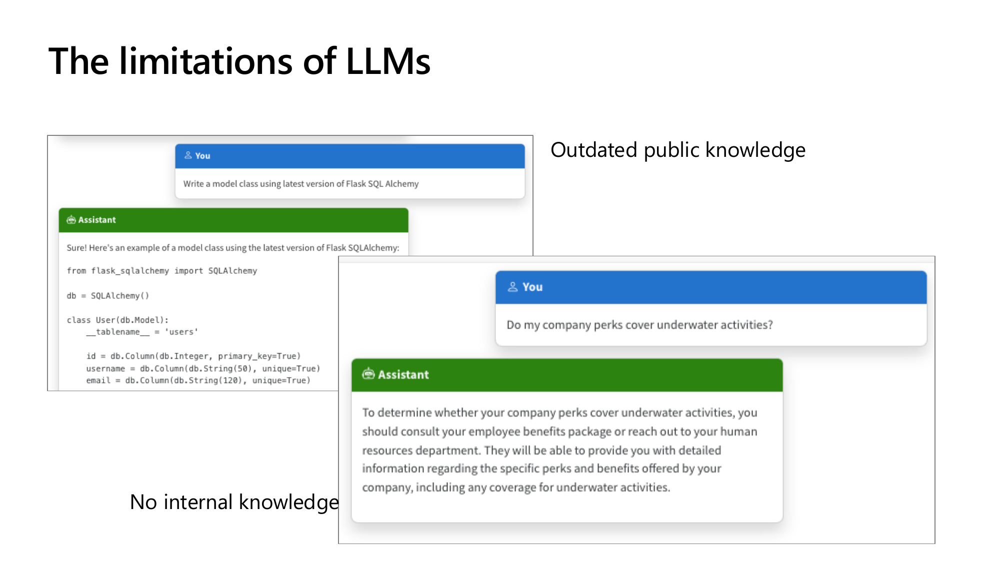
[Watch from 05:40](https://www.youtube.com/watch?v=hfx7F7lObdg&t=340s)

LLMs are trained on data at a particular point in time and know nothing past that point. If an SDK changed in the last six months, the LLM will produce wrong code without realizing it. LLMs also have no internal knowledge — they cannot answer questions specific to a company or private data because they were never trained on it. Some facts are so well-represented in training data that they are essentially baked into the model's weights (like how to bake chocolate chip cookies), but many queries cannot be reliably answered from weights alone.

## Integrating domain knowledge: fine-tuning vs RAG

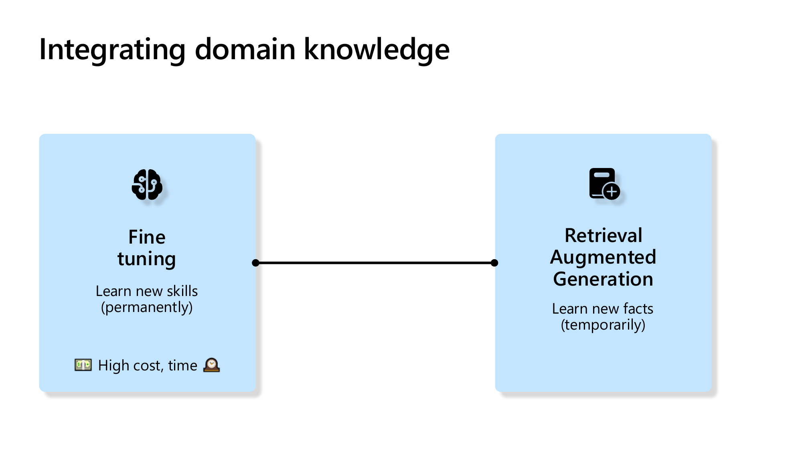
[Watch from 07:17](https://www.youtube.com/watch?v=hfx7F7lObdg&t=437s)

There are two primary ways to integrate domain knowledge into an LLM. Fine-tuning retrains the model's weights on new data so it permanently learns that information. This works well for specific domains where a general LLM struggles, but it requires thousands of training data points, significant cost and time, and results in a more expensive model to run. RAG (retrieval augmented generation) provides information temporarily at query time so the LLM has enough context to answer a question. RAG is far more common in production because it avoids the cost and complexity of fine-tuning.

## RAG in the wild

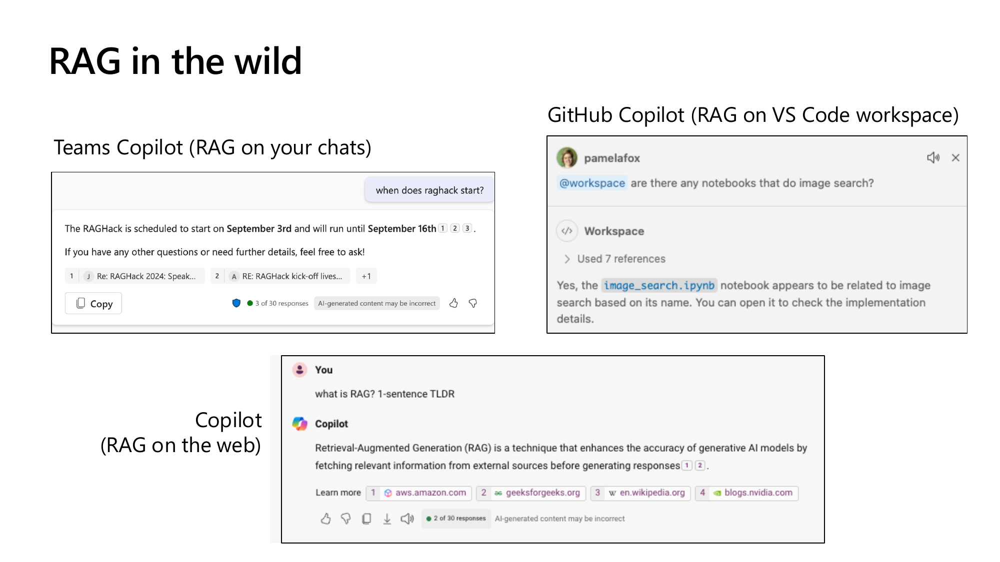
[Watch from 09:04](https://www.youtube.com/watch?v=hfx7F7lObdg&t=544s)

RAG already powers many widely used products. GitHub Copilot uses RAG on the VS Code workspace to answer questions grounded in the codebase. Teams Copilot searches chat history to answer questions. Copilot in the browser performs web searches and grounds responses in those results. All of these are chat interfaces that search a knowledge source and use the retrieved context to answer user questions.

## Simple RAG flow

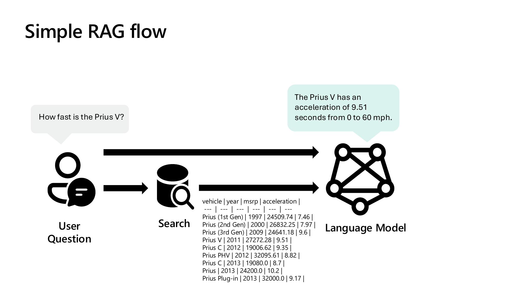
[Watch from 09:44](https://www.youtube.com/watch?v=hfx7F7lObdg&t=584s)

The simplest RAG flow starts with a user question (e.g., "How fast is the Prius V?"). That question is used to search a database of relevant information, returning matching rows or documents. Both the question and the search results are sent to the LLM with instructions to answer based only on the provided context. The prompt tells the LLM to cite its sources and to admit when it does not know the answer. Even this minimal flow is powerful — as long as there is a way to search for the user's question and return results, a RAG flow can be built.

## RAG flow with multi-turn support

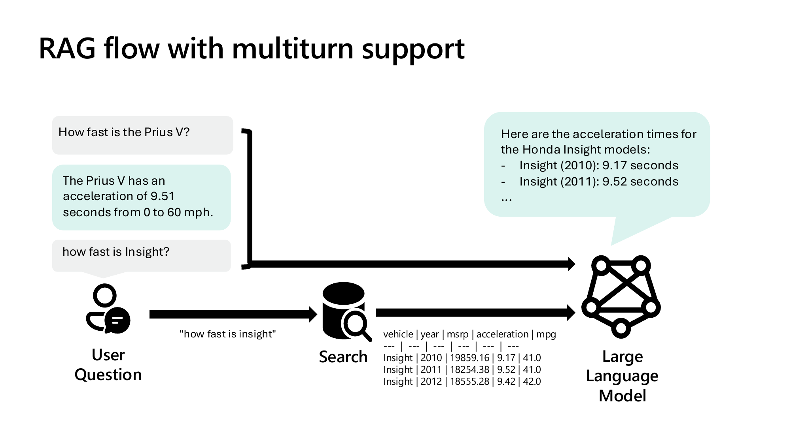
[Watch from 11:33](https://www.youtube.com/watch?v=hfx7F7lObdg&t=693s)

In practice, most RAG applications support multi-turn conversations. The user asks a question, gets a response, and asks follow-up questions. The most recent question is used to search the database, and the entire conversation history along with the search results is sent to the LLM so it can maintain context across turns.

## Query rewriting for better search

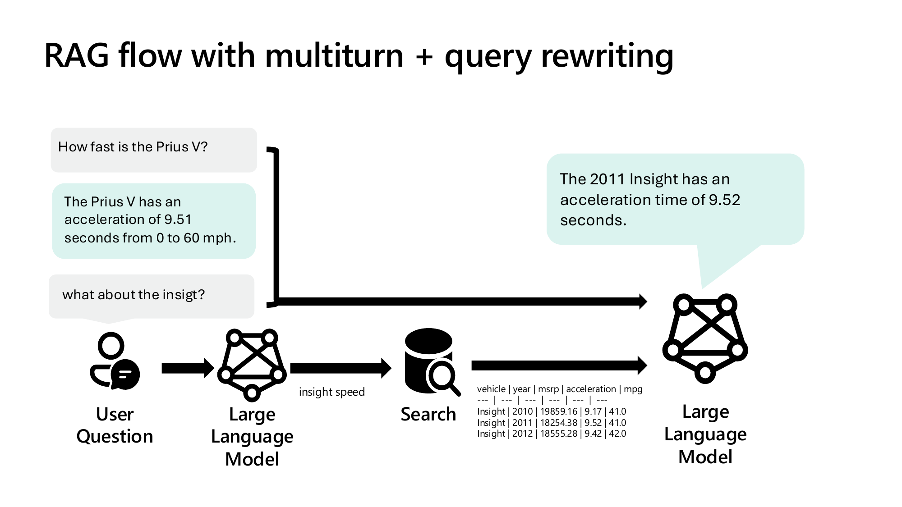
[Watch from 12:20](https://www.youtube.com/watch?v=hfx7F7lObdg&t=740s)

Follow-up questions often contain spelling errors, missing context, or vague references (e.g., "what about the insigt?" instead of "How fast is the Honda Insight?"). A query rewriting step sends the conversation to an LLM whose only job is to produce an optimized search query. This LLM corrects spelling, fills in missing nouns from conversation context, and removes filler words. The optimized query then produces much better search results. The tradeoff is added latency from an extra LLM call, which can be mitigated by using a smaller model (like a mini model) for the rewriting step.

## RAG data source types

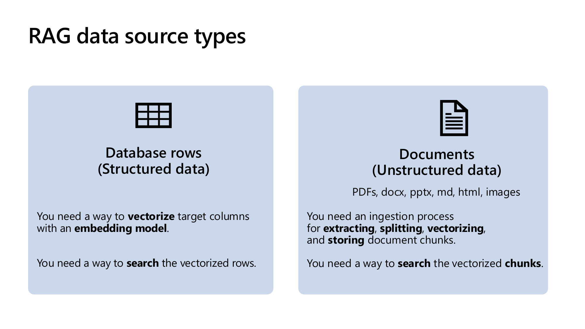
[Watch from 15:08](https://www.youtube.com/watch?v=hfx7F7lObdg&t=908s)

RAG can operate on two kinds of data. Structured data consists of database rows and columns — the typical approach is to vectorize the free-text columns with an embedding model and add a vector column for similarity search. Unstructured data includes PDFs, Word documents, PowerPoints, markdown, HTML, and images. These require an ingestion pipeline that extracts text, splits it into manageable chunks, vectorizes each chunk, and stores everything in a searchable database or search service. Both approaches benefit from vectorization.

## Vector embeddings

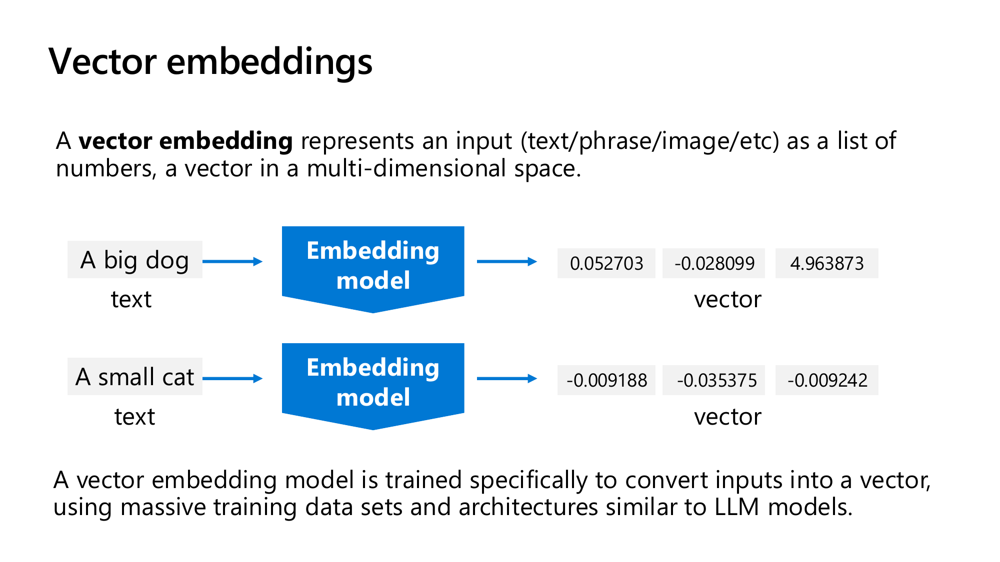
[Watch from 16:59](https://www.youtube.com/watch?v=hfx7F7lObdg&t=1019s)

A vector embedding is a list of floating-point numbers that represents an input (text, phrase, or image) as a point in a multi-dimensional space. Embedding models are trained on massive datasets to learn similarity relationships — semantically similar concepts (like "dog" and "cat") end up close together in the vector space, while unrelated concepts are far apart. These models can represent single words, entire sentences, paragraphs, and even images (with multimodal embedding models). The ability to map real-world concepts into a similarity space enables measuring how similar two inputs are, which is the foundation of vector search.

## Vector embedding models

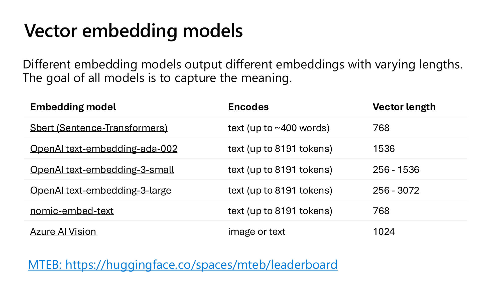
[Watch from 19:04](https://www.youtube.com/watch?v=hfx7F7lObdg&t=1144s)

Different embedding models vary in input type, maximum input length, and output vector dimensions. The most commonly used models for RAG are OpenAI text-embedding-3-small (256–1536 dimensions) and text-embedding-3-large (256–3072 dimensions), both accepting up to 8,191 tokens. The open model nomic-embed-text offers similar performance and works well locally. Azure AI Vision can encode both images and text into 1024-dimensional vectors. The [MTEB leaderboard](https://huggingface.co/spaces/mteb/leaderboard) tracks model performance, but the key is to test whether a model captures the similarity relationships that matter for your specific domain and language.

## Generating an embedding in JavaScript

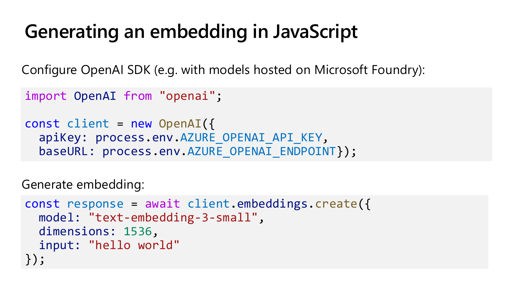
[Watch from 20:48](https://www.youtube.com/watch?v=hfx7F7lObdg&t=1248s)

To generate embeddings in JavaScript, use the OpenAI SDK configured with a Microsoft Foundry endpoint. Create an `OpenAI` client with an API key and base URL, then call `client.embeddings.create()` specifying the model (e.g., `text-embedding-3-small`), dimensions (e.g., 1536), and the input text. The input can be up to 8,191 tokens. The tokenizer determines how text is split — in English, one token roughly equals one word, but other languages may use more tokens per word. The [OpenAI tokenizer](https://platform.openai.com/tokenizer) tool lets you visualize how text is broken into tokens.

## Measuring vector similarity

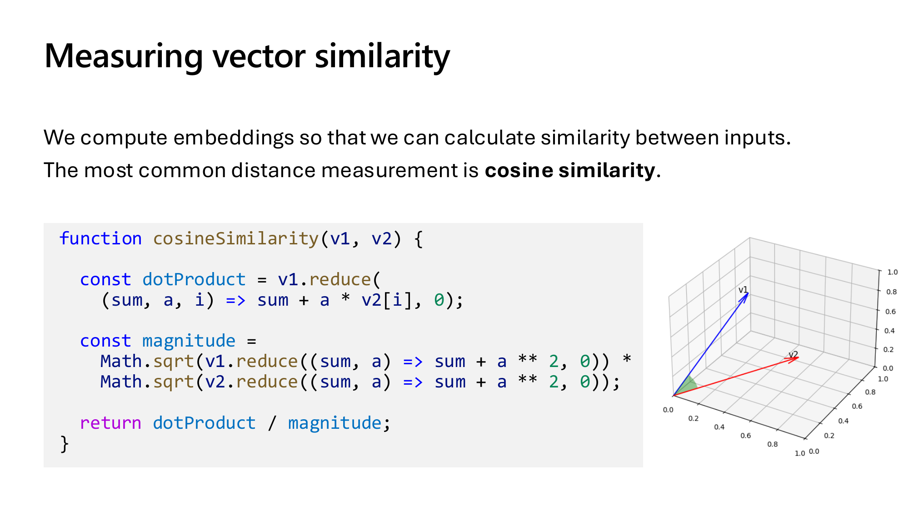
[Watch from 22:18](https://www.youtube.com/watch?v=hfx7F7lObdg&t=1338s)

Cosine similarity is the recommended metric for measuring how similar two vectors are. It computes the dot product of two vectors divided by the product of their magnitudes, effectively measuring the angle between them. This metric works well across models and is the default choice for RAG use cases. The implementation is straightforward: compute the dot product with `reduce`, calculate each vector's magnitude with `Math.sqrt`, and divide.

## Vector search

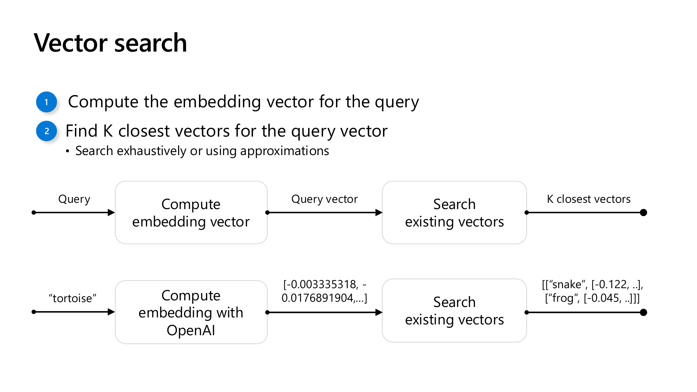
[Watch from 23:02](https://www.youtube.com/watch?v=hfx7F7lObdg&t=1382s)

Vector search converts an input query into a vector using the exact same model and dimensions that were used to encode the existing data — this is critical and cannot be mismatched across different models. Then it finds the K closest vectors to the query vector. Exhaustive search (computing cosine similarity against every vector) works for small datasets but becomes prohibitively slow as the database grows. In production, approximate nearest neighbor (ANN) algorithms are essential for searching millions or billions of vectors efficiently.

## Approximate nearest neighbor search

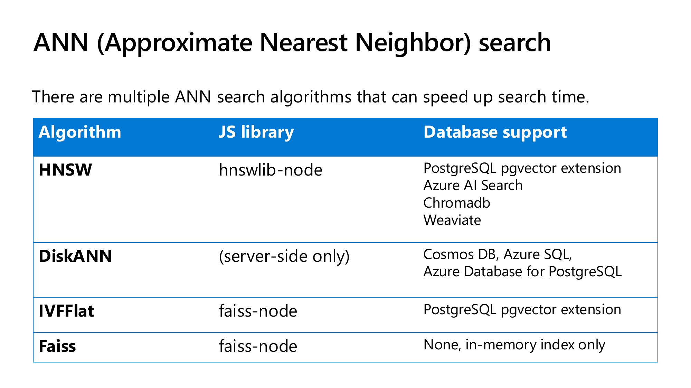
[Watch from 24:16](https://www.youtube.com/watch?v=hfx7F7lObdg&t=1456s)

HNSW (Hierarchical Navigable Small Worlds) is the most popular ANN algorithm, supported in PostgreSQL with pgvector, Azure AI Search, ChromaDB, and Weaviate. It handles new inserts efficiently, making it well suited for databases that update frequently. DiskANN, developed by Microsoft Research, optimizes for hardware and is available in Cosmos DB, Azure SQL, and Azure Database for PostgreSQL. IVFFlat works best when the index is built once without frequent updates — it is supported in PostgreSQL with pgvector. FAISS provides an in-memory index useful for prototypes and demos but not production deployments.

## Vector search is not enough

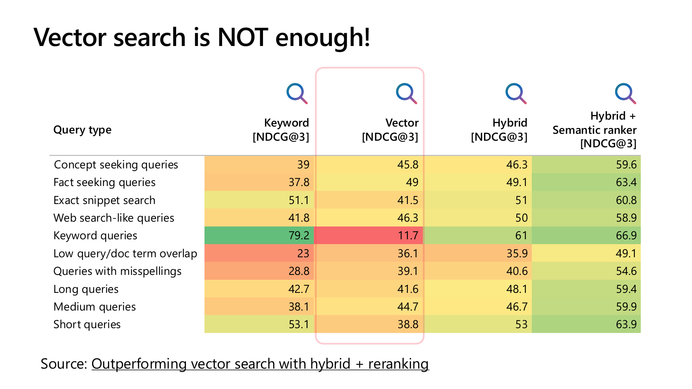
[Watch from 26:09](https://www.youtube.com/watch?v=hfx7F7lObdg&t=1569s)

Vector search alone is insufficient for production RAG. Research comparing different search strategies across query types shows that vector search fails at exact-match scenarios — keyword queries scored 11.7 with vector search versus 79.2 with keyword search. When users search for exact names, email addresses, product numbers, or specific measurements, they need exact matches, not semantic similarity. The best results across all query types come from combining hybrid search (keywords + vectors) with a semantic reranker, which consistently outperformed every other strategy.

## Hybrid search combines keyword and vector retrieval

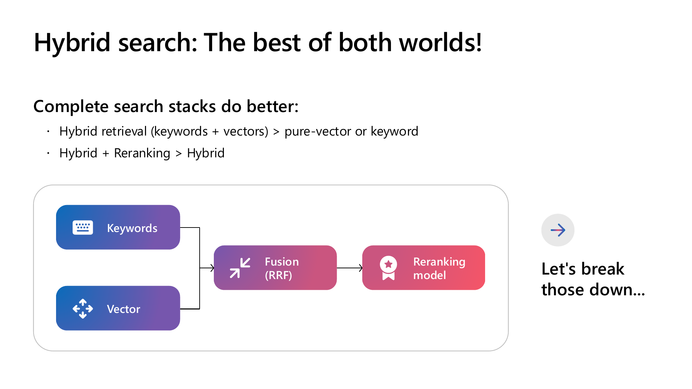
[Watch from 29:04](https://www.youtube.com/watch?v=hfx7F7lObdg&t=1744s)

A complete search stack uses hybrid retrieval (keyword search + vector search), which outperforms either approach alone. Adding a reranking model on top of hybrid search further improves results. The pipeline runs keyword search and vector search in parallel, merges results using Reciprocal Rank Fusion (RRF), and then applies a reranking model for final ordering.

## Keyword search

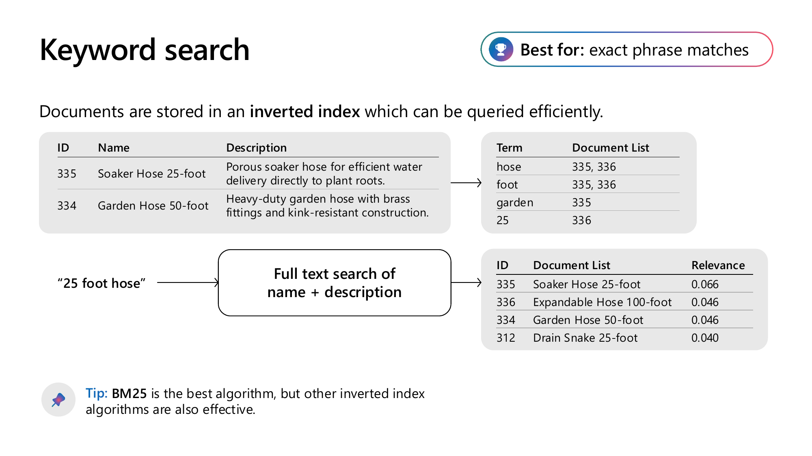
[Watch from 28:07](https://www.youtube.com/watch?v=hfx7F7lObdg&t=1687s)

Keyword search uses an inverted index that maps terms to the documents containing them. When a query arrives, the system finds documents where the query terms appear most frequently relative to document size. BM25 is the best full-text search algorithm for this purpose. Keyword search excels at exact phrase matches — searching for "25 foot hose" will correctly rank documents containing those exact terms.

## Vector search in hybrid context

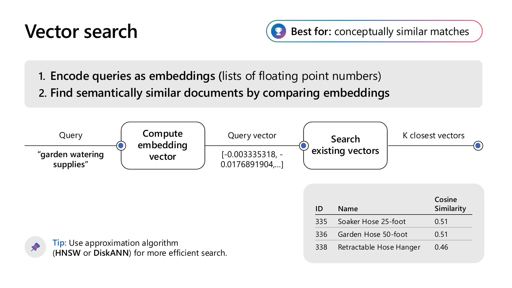
[Watch from 29:04](https://www.youtube.com/watch?v=hfx7F7lObdg&t=1744s)

In a hybrid search pipeline, vector search handles the semantic side. A query like "garden watering supplies" is encoded into a vector and compared against stored embeddings to find conceptually similar documents, even when the exact words differ. An approximation algorithm (HNSW or DiskANN) makes this efficient at scale.

## Reciprocal Rank Fusion

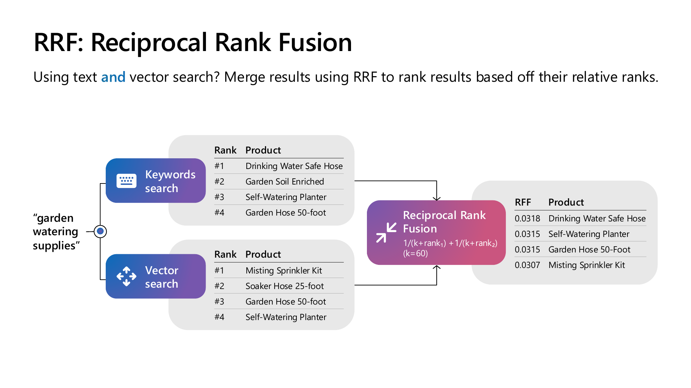
[Watch from 29:46](https://www.youtube.com/watch?v=hfx7F7lObdg&t=1786s)

Reciprocal Rank Fusion (RRF) merges results from keyword and vector search using the formula `1/(k + rank)` for each result list (with k typically set to 60). Items ranked high in both lists end up at the top; items high in one but low in the other land in the middle. RRF uses simple math — no model required — and can be implemented entirely in SQL.

## Re-ranking

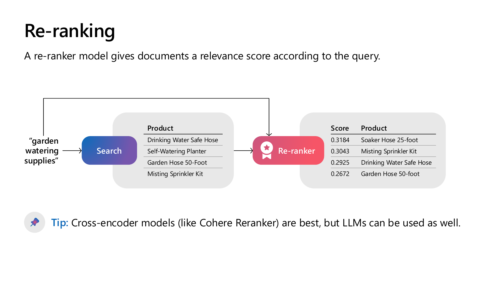
[Watch from 30:42](https://www.youtube.com/watch?v=hfx7F7lObdg&t=1842s)

A re-ranker model is a cross-encoder model specifically trained to score how relevant each document is to a given query. Unlike embedding models, cross-encoders look at the query and document together and assign a relevance score (e.g., 0.3184). Because scores are relative to the query, a threshold can be set to drop results below a certain score, filtering out noise. Both vector search and keyword search can return irrelevant results — vector search because there is always some closest vector even if it is far away, and keyword search because a document may match a keyword but be completely unrelated. The re-ranker compensates for this noise. Cross-encoder models like Cohere Reranker work best, but LLMs can also serve as re-rankers.

## A complete hybrid search flow

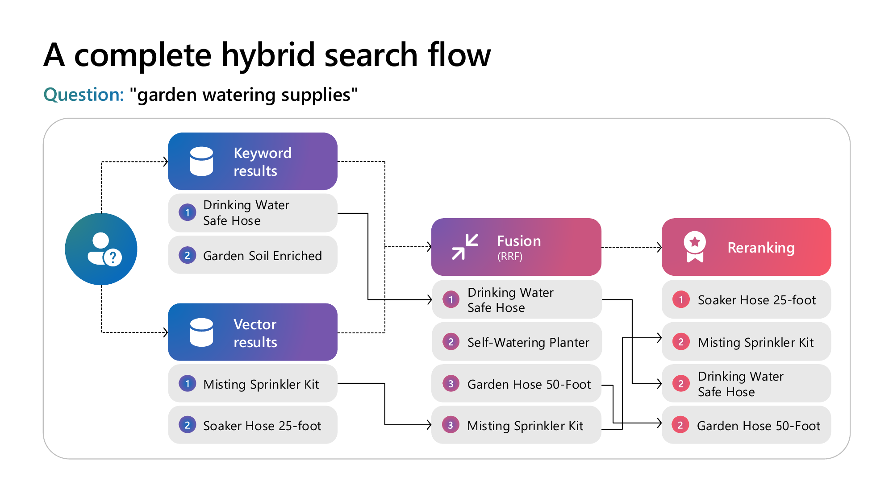
[Watch from 32:26](https://www.youtube.com/watch?v=hfx7F7lObdg&t=1946s)

The complete flow processes the query "garden watering supplies" through keyword search and vector search in parallel. RRF fusion merges the two result lists based on relative ranks. The reranking model then reorders the fused list, often surfacing results that were underranked — in this example, "Soaker Hose 25-foot" moves from unranked to the top position after reranking.

## Hybrid search on Azure databases

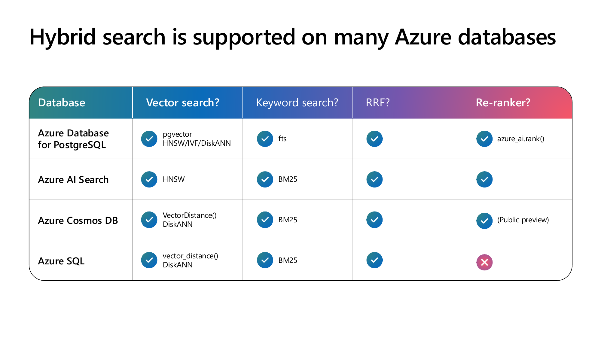
[Watch from 32:48](https://www.youtube.com/watch?v=hfx7F7lObdg&t=1968s)

Azure Database for PostgreSQL supports vector search via pgvector (HNSW, IVFFlat, DiskANN), keyword search via built-in full-text search (though not BM25 natively — community extensions can add it), and re-ranking via the `azure_ai.rank()` function with a cross-encoder model. Azure AI Search has the most complete hybrid search support with HNSW, BM25, built-in RRF, and its own reranker model. Cosmos DB supports vector search with DiskANN, BM25 keyword search, built-in RRF, and a reranker in public preview. Azure SQL supports DiskANN vector search and BM25 keyword search but does not yet have a built-in reranker.

## RAG document ingestion

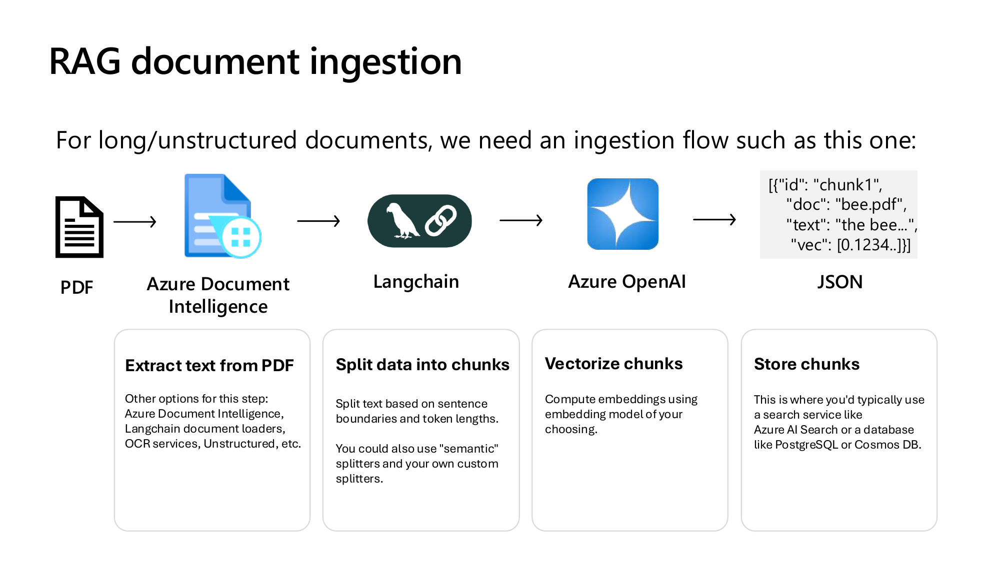
[Watch from 34:18](https://www.youtube.com/watch?v=hfx7F7lObdg&t=2058s)

For unstructured documents, the ingestion pipeline has four stages. First, extract text from the PDF using Azure Document Intelligence, Langchain document loaders, OCR services, or similar tools. Second, split the extracted text into chunks based on sentence boundaries and token lengths — semantic splitters and custom splitters are also options. Third, compute embedding vectors for each chunk using the embedding model of choice. Fourth, store the chunks with their vectors in a searchable service like Azure AI Search or a database like PostgreSQL or Cosmos DB.

## Why we still need to split documents

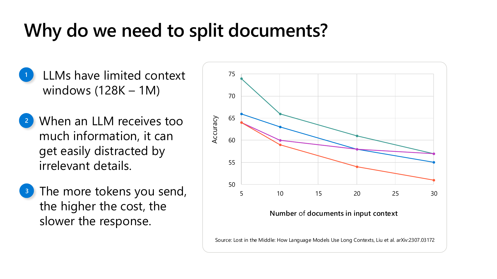
[Watch from 35:59](https://www.youtube.com/watch?v=hfx7F7lObdg&t=2159s)

Despite LLMs having context windows of 128K to 1M tokens, document splitting remains essential for three reasons. First, most production RAG databases contain far more total text than any context window can hold. Second, sending too much context causes "context rot" — research (starting with "Lost in the Middle" and continuing with newer studies) shows quality degrades significantly as context grows, with one study finding that quality drops sharply after 256K tokens even in models with 1M-token windows. Third, more tokens mean higher cost and higher latency. Splitting documents lets the search retrieve only the relevant chunks, reducing cost and improving both quality and response time. With larger context windows available now, chunks can be bigger than before (e.g., entire pages), but splitting is still recommended.

## Optimal chunk size

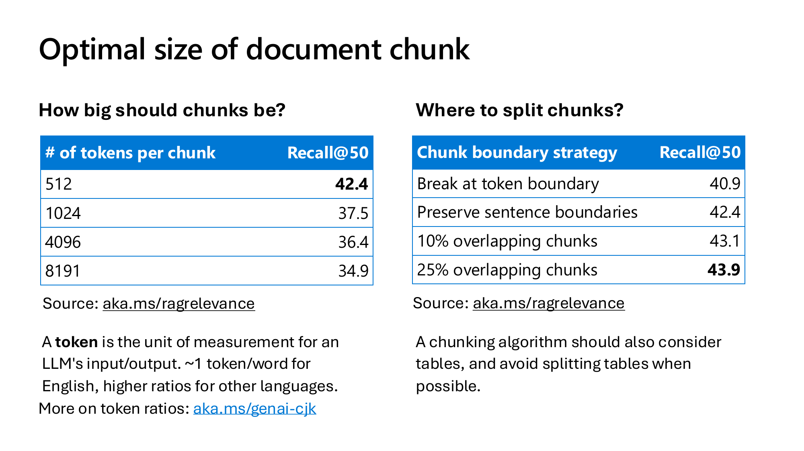
[Watch from 38:14](https://www.youtube.com/watch?v=hfx7F7lObdg&t=2294s)

Research from [aka.ms/ragrelevance](https://aka.ms/ragrelevance) found the optimal chunk size is 512 tokens (roughly 512 words in English, more tokens per word in other languages). Larger chunks (1024, 4096, 8191 tokens) all produced lower recall. For chunk boundaries, breaking at raw token boundaries performed worst (40.9 recall), preserving sentence boundaries improved results (42.4), and 25% overlapping chunks produced the best results (43.9). A practical strategy is to aim for ~500 tokens with 25% overlap while preserving sentence boundaries. Chunking algorithms should also avoid splitting tables. Writing a custom chunker is complex — using a well-tested library is recommended. More on token ratios for non-English languages: [aka.ms/genai-cjk](https://aka.ms/genai-cjk).

## Graph RAG

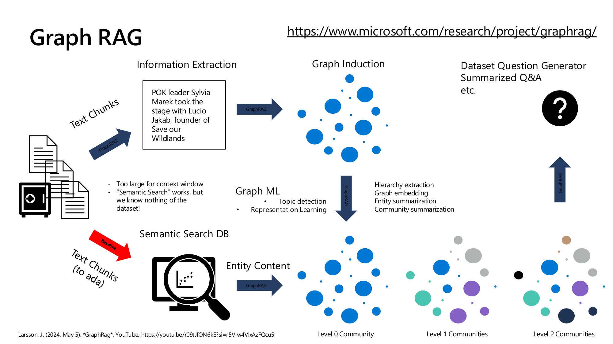
[Watch from 39:54](https://www.youtube.com/watch?v=hfx7F7lObdg&t=2394s)

[Graph RAG](https://www.microsoft.com/research/project/graphrag/) is a Microsoft Research project that builds a hierarchical knowledge graph during data ingestion. As documents are processed, an LLM extracts topics, entities, and relationships to construct an ontology. This graph organizes information into hierarchical community levels, enabling answers to high-level "zoomed out" questions that standard RAG cannot handle well. However, Graph RAG is expensive in practice — building and updating the graph is slow and costly, and queries are more expensive to execute. As of this session, no known production deployments of Graph RAG exist, though efforts continue to make it more practical.

## RAG with graph queries

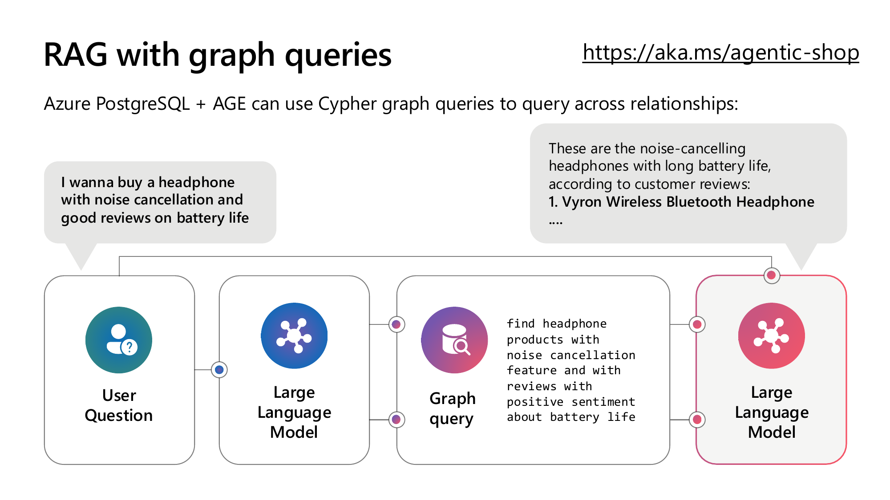
[Watch from 43:01](https://www.youtube.com/watch?v=hfx7F7lObdg&t=2581s)

A more practical alternative to full Graph RAG is using graph queries with Azure PostgreSQL and the Apache AGE extension. This approach builds a graph of relationships between products, reviews, and features, with edges labeled by sentiment. For example, querying for "headphones with noise cancellation and good battery reviews" translates into a Cypher graph query that finds products connected to positive-sentiment reviews about battery life. These graph queries execute much faster than equivalent PostgreSQL joins. The [agentic-shop repo](https://aka.ms/agentic-shop) demonstrates this pattern.

## Agentic RAG across multiple sources

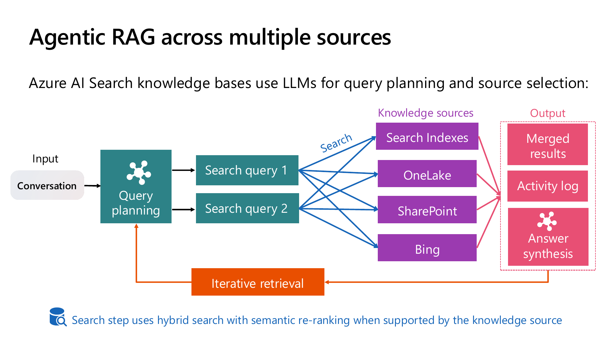
[Watch from 45:01](https://www.youtube.com/watch?v=hfx7F7lObdg&t=2701s)

Azure AI Search knowledge bases provide an agentic RAG capability that searches across multiple data sources. An LLM-based query planning step analyzes the conversation and decides which of the configured knowledge sources (search indexes, OneLake, SharePoint, Bing) to query. It generates search queries, executes them in parallel, and merges results using hybrid search with semantic reranking. An optional iterative retrieval stage uses another model to assess whether enough information was retrieved to fully answer the question, looping back if needed — particularly helpful for complex queries with dependencies.

## What affects RAG quality

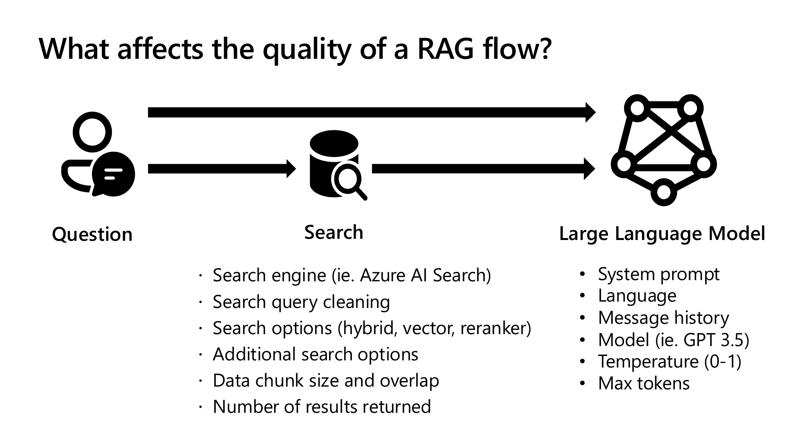
[Watch from 46:39](https://www.youtube.com/watch?v=hfx7F7lObdg&t=2799s)

RAG quality depends on many variables across two categories. On the search side: the search engine choice, query cleaning, search options (hybrid, vector, reranker), additional search options, data chunk size and overlap, and number of results returned. On the LLM side: system prompt, language, message history, model selection (which has a huge effect), temperature, and max tokens. Changing any single parameter can improve or degrade answer quality, and cost and latency must also be considered alongside quality.

## Are the answers high quality?

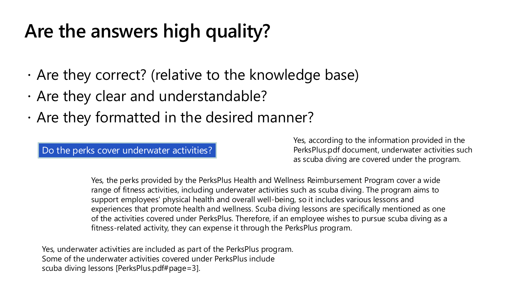
[Watch from 47:59](https://www.youtube.com/watch?v=hfx7F7lObdg&t=2879s)

High-quality RAG answers need to be correct (grounded in the knowledge base), clear and understandable, and formatted properly. This slide shows three responses to the same question about whether perks cover underwater activities. Only one answer includes a properly formatted citation (`[PerksPlus.pdf#page=3]`) that can be rendered as a clickable link for the user. The overly verbose middle answer provides excess detail, while the bottom answer strikes the right balance of brevity and citation format.

## Manual evaluation

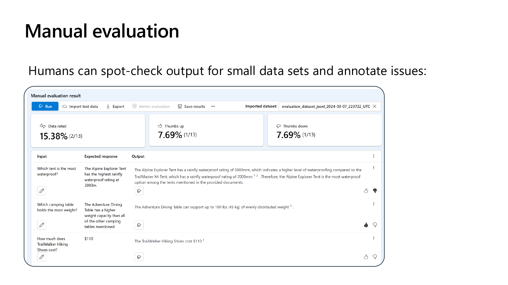
[Watch from 48:25](https://www.youtube.com/watch?v=hfx7F7lObdg&t=2905s)

Manual evaluation involves humans spot-checking RAG output on small data sets and annotating issues. This is valuable when domain experts are available to assess whether answers are correct and identify specific problems. Human reviewers can mark answers as good or bad and annotate why an answer is bad, providing actionable feedback for improvement.

## Automated evaluation

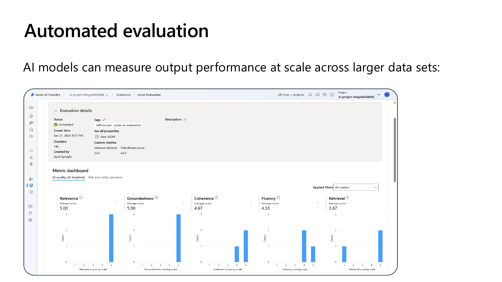
[Watch from 48:43](https://www.youtube.com/watch?v=hfx7F7lObdg&t=2923s)

Automated evaluation uses AI models to measure output performance at scale across larger data sets, overcoming the limitation of how much data humans can manually review. Building on annotations and patterns identified during manual evaluation, automated systems measure multiple metrics across hundreds or thousands of test queries.

## Automated evaluation frameworks

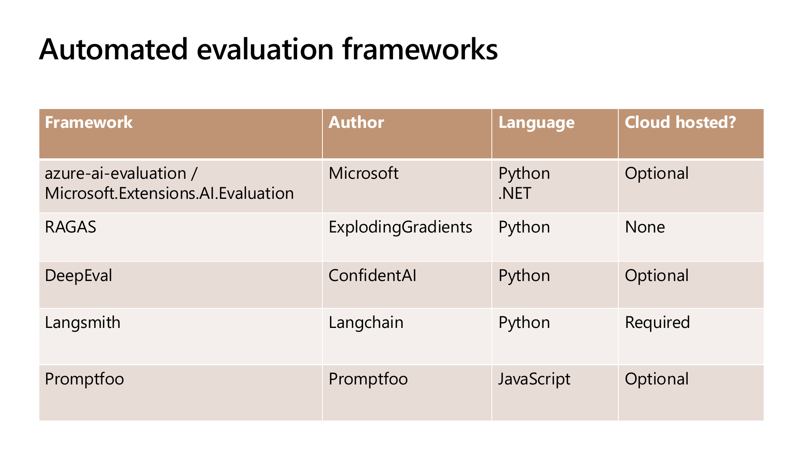
[Watch from 49:00](https://www.youtube.com/watch?v=hfx7F7lObdg&t=2940s)

Several frameworks support automated RAG evaluation. For Python: azure-ai-evaluation (Microsoft, optional cloud hosting), RAGAS (ExplodingGradients), DeepEval (ConfidentAI, optional cloud), and Langsmith (Langchain, requires cloud). For JavaScript: Promptfoo is the most popular option, with optional cloud hosting. Microsoft also offers Microsoft.Extensions.AI.Evaluation for .NET. All these frameworks perform similar core functions — they make it easy to run evaluations across bulk data sets.

## LLM-based quality evaluation

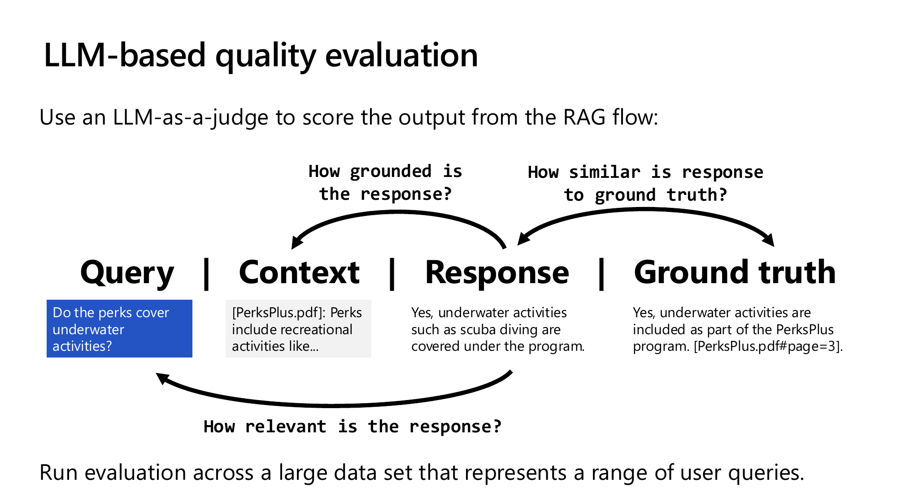
[Watch from 49:24](https://www.youtube.com/watch?v=hfx7F7lObdg&t=2964s)

LLM-as-a-judge evaluation uses an LLM to score the output from a RAG flow. For each test case (a query with its context, response, and optional ground truth), the judge evaluates three metrics: how grounded the response is in the provided context, how relevant the response is to the query, and how similar the response is to the ground truth answer. Ground truth answers enable the strongest evaluations because they provide a concrete comparison. Not everything needs an LLM judge — citation format checking works well with simple regex. The evaluation should run across a large, representative data set.

## Review evaluation metrics

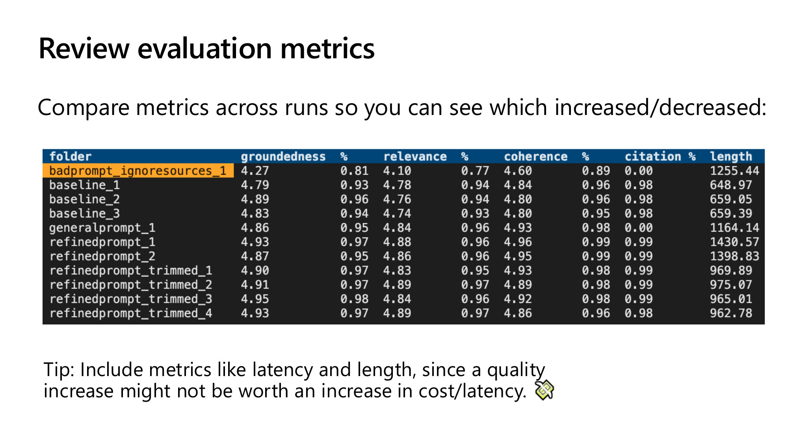
[Watch from 50:24](https://www.youtube.com/watch?v=hfx7F7lObdg&t=3024s)

Track metrics like groundedness, relevance, and citation accuracy across evaluation runs to see which increase or decrease when parameters change. Always include cost-adjacent metrics — answer length, latency, and total tokens — because a quality improvement may not be worth a significant increase in cost or response time.

## Compare individual answers

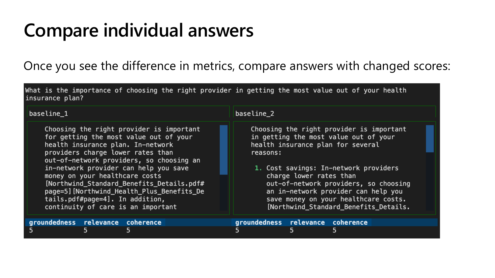
[Watch from 50:59](https://www.youtube.com/watch?v=hfx7F7lObdg&t=3059s)

When aggregate metrics shift between runs, drill into the specific answers that changed scores. Compare the old and new responses side by side to understand why a score went up or down. This analysis may reveal the need to adjust the system prompt or even recalibrate the evaluation judges themselves.

## Lessons learned from evaluating RAG apps

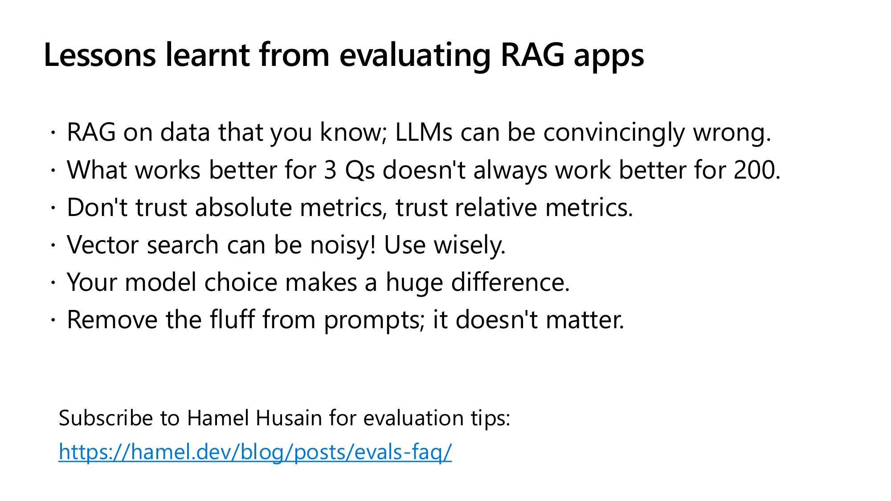
[Watch from 51:11](https://www.youtube.com/watch?v=hfx7F7lObdg&t=3071s)

Key lessons from extensive RAG evaluation: do RAG on data you know well, because LLMs can be convincingly wrong and you need to recognize hallucinations. What works for 3 test questions does not always scale to 200 — test at scale. Trust relative metrics (comparing runs) over absolute metrics. Vector search can produce noisy results, so use it as part of a hybrid strategy. Model choice makes a huge difference to answer quality. Remove fluff from prompts — it does not help. For more evaluation guidance, subscribe to [Hamel Husain's blog](https://hamel.dev/blog/posts/evals-faq/).

## Open source RAG solution

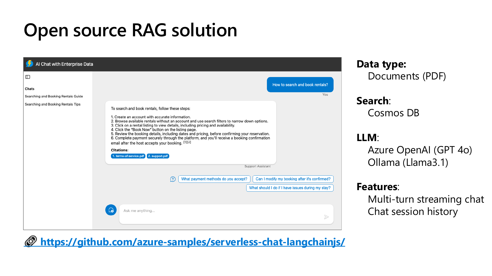
[Watch from 51:37](https://www.youtube.com/watch?v=hfx7F7lObdg&t=3097s)

The [serverless-chat-langchainjs](https://github.com/azure-samples/serverless-chat-langchainjs/) repository is an open-source RAG application that works with PDF documents. It uses Cosmos DB for vector storage, Azure OpenAI (GPT-4o) or Ollama (Llama 3.1) for the LLM, and provides multi-turn streaming chat with session history. The app shows citations that link back to the source documents, enabling users to verify answers. It can run locally or be deployed to Azure.

## Opening the project

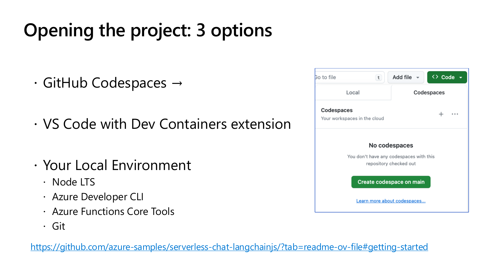
[Watch from 52:55](https://www.youtube.com/watch?v=hfx7F7lObdg&t=3175s)

The project can be opened in GitHub Codespaces (everything pre-configured), VS Code with the Dev Containers extension, or a local environment requiring Node LTS, Azure Developer CLI, Azure Functions Core Tools, and Git. Full instructions are in the [getting started guide](https://github.com/azure-samples/serverless-chat-langchainjs/?tab=readme-ov-file#getting-started).

## Deploying with the Azure Developer CLI

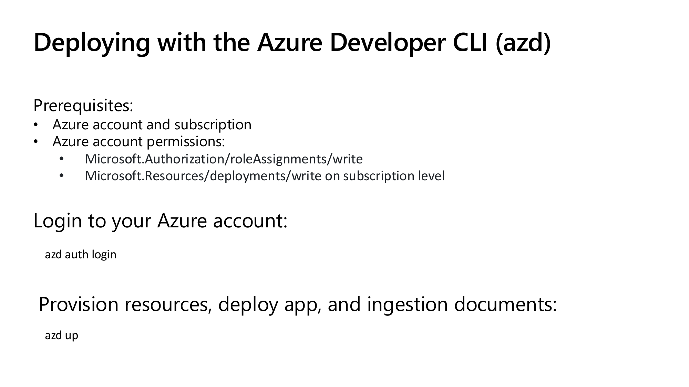
[Watch from 53:26](https://www.youtube.com/watch?v=hfx7F7lObdg&t=3206s)

Deployment requires an Azure account with `Microsoft.Authorization/roleAssignments/write` and `Microsoft.Resources/deployments/write` permissions at the subscription level. Run `azd auth login` to authenticate, then `azd up` to provision all Azure resources, deploy the application, and ingest documents in a single command.

## Data ingestion process

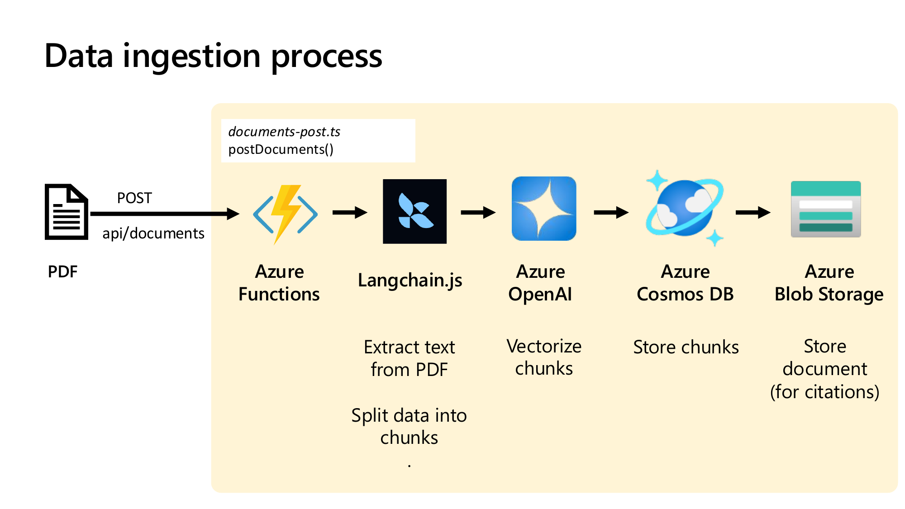
[Watch from 53:29](https://www.youtube.com/watch?v=hfx7F7lObdg&t=3209s)

The ingestion code lives in `documents-post.ts`, an Azure Function that accepts a PDF via POST request. It uses Langchain.js's PDF loader to extract text, then the `RecursiveCharacterTextSplitter` to split text into chunks (the code splits by character count, but a token-based option is available and recommended). Chunks are vectorized using Azure OpenAI with Cosmos DB, or locally using Ollama with FAISS. The original PDF is stored in Azure Blob Storage for citation rendering. Langchain's built-in functionality keeps the ingestion code short.

## Application architecture

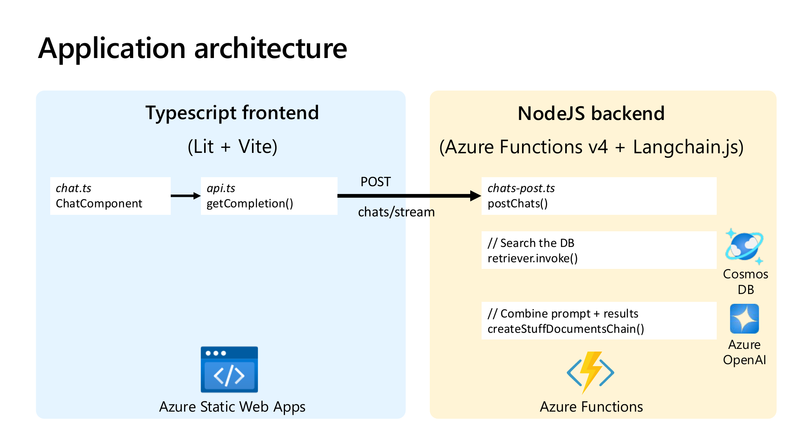
[Watch from 54:52](https://www.youtube.com/watch?v=hfx7F7lObdg&t=3292s)

The frontend is built with TypeScript using Lit components and Vite, hosted on Azure Static Web Apps. It sends POST requests to the backend at the `/chats/stream` endpoint. The backend runs on Azure Functions v4 with Langchain.js. The main handler in `chats-post.ts` sets up a system prompt instructing the LLM to answer only from provided sources and cite them in a specific format. It connects to Cosmos DB for both vector search (retrieval) and chat session history. Langchain's `createStuffDocumentsChain` combines the system prompt with retrieved documents and conversation history. The retriever fetches 3 documents, and the rag chain runs as a streaming function to return results progressively. Currently the app uses Cosmos DB with vector search only — hybrid search support exists in Cosmos DB but is not yet merged into Langchain.js.

## Next steps

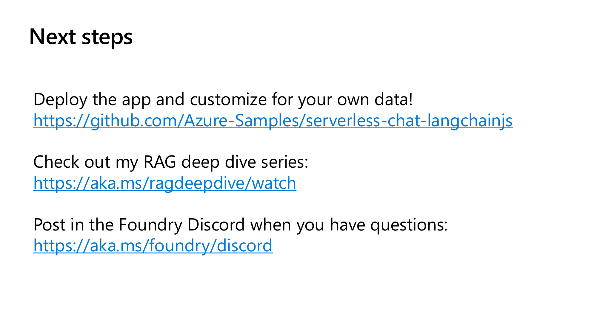
[Watch from 58:26](https://www.youtube.com/watch?v=hfx7F7lObdg&t=3506s)

Deploy the app and customize it for your own data at [github.com/Azure-Samples/serverless-chat-langchainjs](https://github.com/Azure-Samples/serverless-chat-langchainjs). Testing RAG on data you know well is the best way to learn — when you encounter hallucinations, you will know because you are familiar with the source material. For a deeper dive, check out the [11-part RAG deep dive series](https://aka.ms/ragdeepdive/watch) covering multimedia, user login, data access control, chat history, speech, private deployment, evaluation, monitoring, and function calling. For questions, join the [Foundry Discord](https://aka.ms/foundry/discord).
