## Slide 1

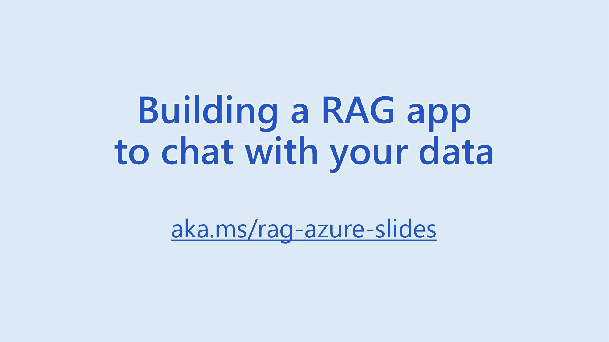

```
Building a RAG app
to chat with your data
   aka.ms/rag-azure-slides
```

## Slide 2

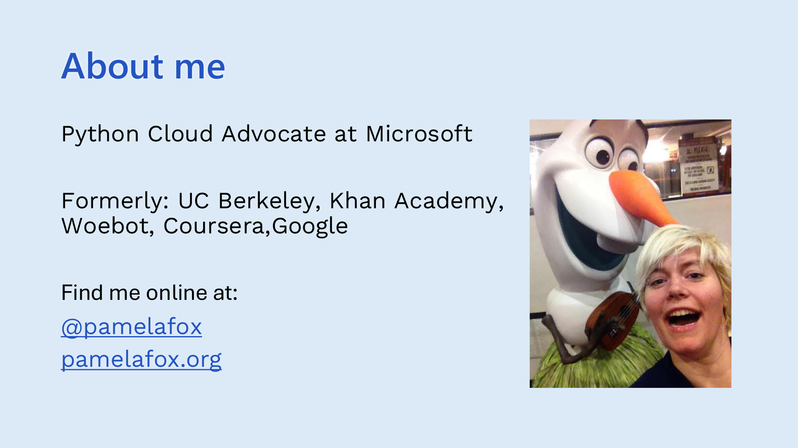

```
About me
Python Cloud Advocate at Microsoft

Formerly: UC Berkeley, Khan Academy,
Woebot, Coursera,Google

Find me online at:
@pamelafox
pamelafox.org
```

## Slide 3

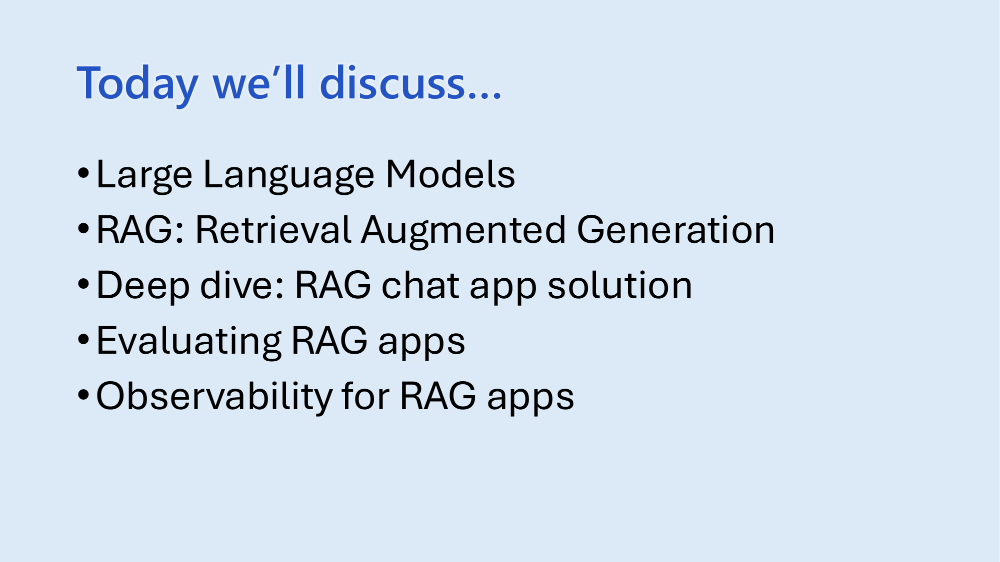

```
Today we’ll discuss…
•Large Language Models
•RAG: Retrieval Augmented Generation
•Deep dive: RAG chat app solution
•Evaluating RAG apps
•Observability for RAG apps
```

## Slide 4


```
LLMs
```

## Slide 5

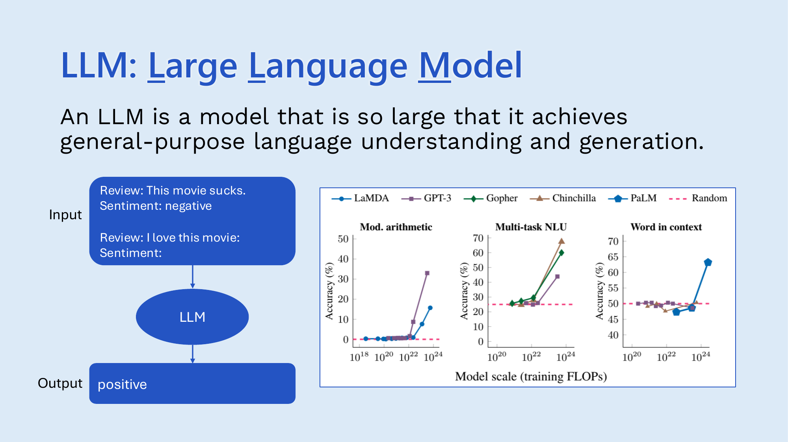

```
LLM: Large Language Model
   An LLM is a model that is so large that it achieves
   general-purpose language understanding and generation.
         Review: This movie sucks.
         Sentiment: negative
 Input
         Review: I love this movie:
         Sentiment:


                       LLM


Output   positive
```

## Slide 6

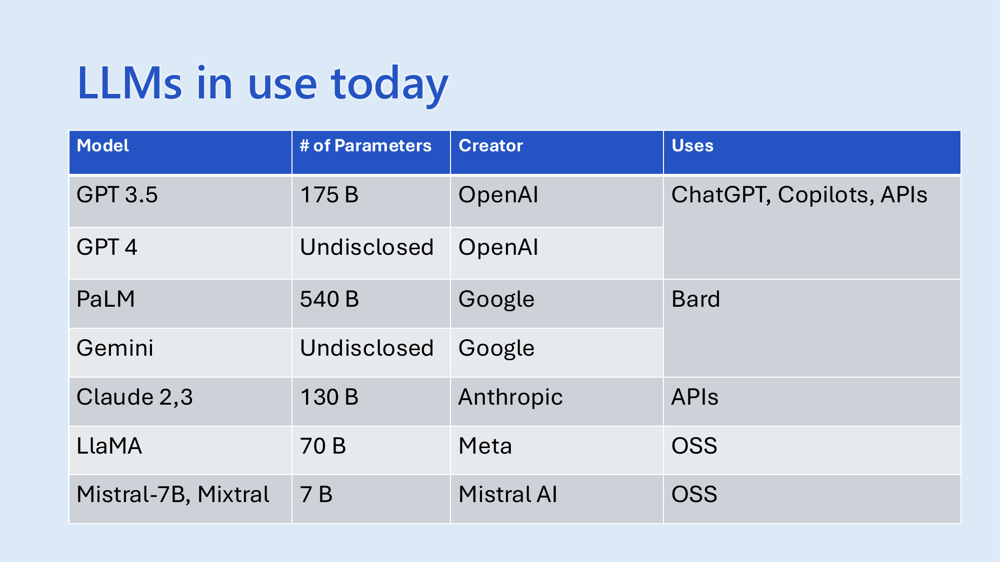

```
LLMs in use today
Model                 # of Parameters   Creator      Uses

GPT 3.5               175 B             OpenAI       ChatGPT, Copilots, APIs

GPT 4                 Undisclosed OpenAI

PaLM                  540 B             Google       Bard
Gemini                Undisclosed Google
Claude 2,3            130 B             Anthropic    APIs
LlaMA                 70 B              Meta         OSS
Mistral-7B, Mixtral   7B                Mistral AI   OSS
```

## Slide 7

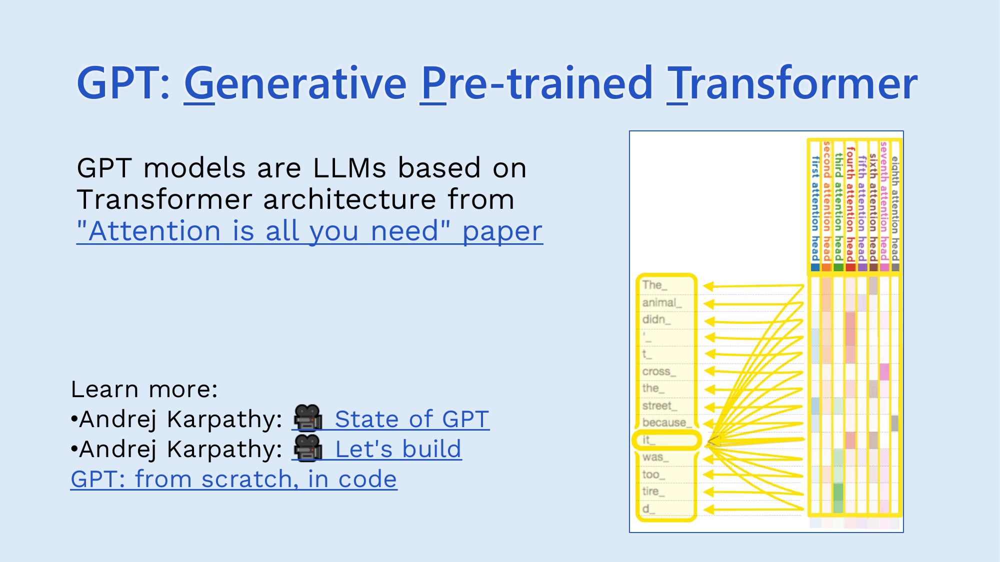

```
GPT: Generative Pre-trained Transformer
GPT models are LLMs based on
Transformer architecture from
"Attention is all you need" paper


Learn more:
•Andrej Karpathy:     State of GPT
•Andrej Karpathy:     Let's build
GPT: from scratch, in code
```

## Slide 8

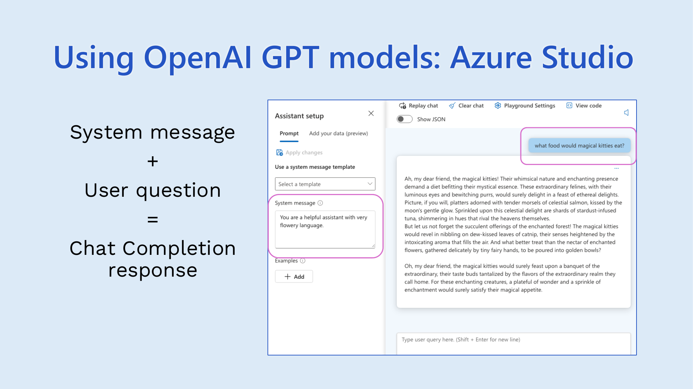

```
Using OpenAI GPT models: Azure Studio

 System message
        +
  User question
        =
 Chat Completion
    response
```

## Slide 9

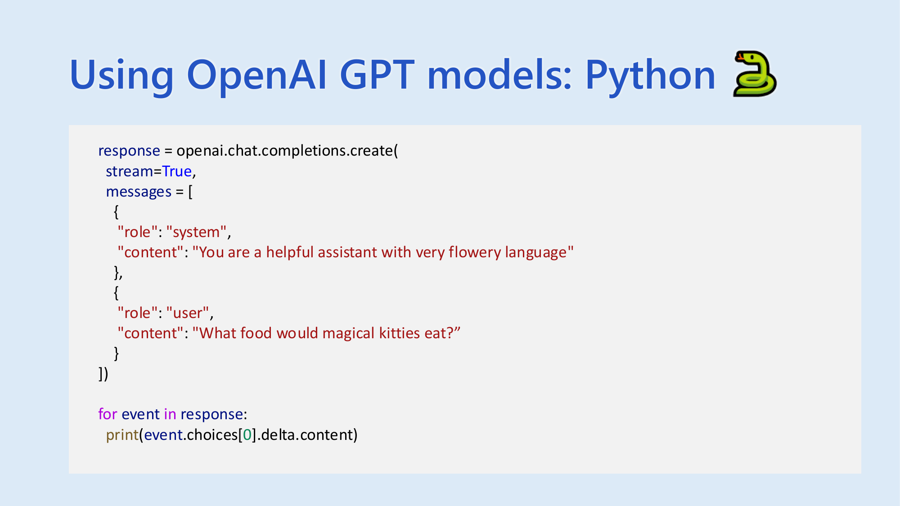

```
Using OpenAI GPT models: Python
 response = openai.chat.completions.create(
  stream=True,
  messages = [
    {
     "role": "system",
     "content": "You are a helpful assistant with very flowery language"
    },
    {
     "role": "user",
     "content": "What food would magical kitties eat?”
    }
 ])

 for event in response:
  print(event.choices[0].delta.content)
```

## Slide 10

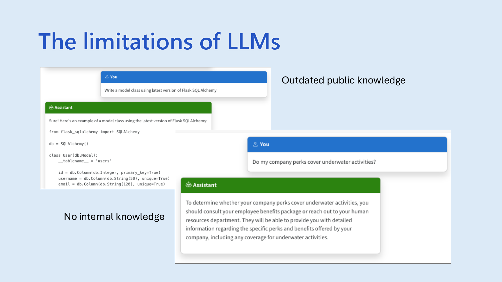

```
The limitations of LLMs
                          Outdated public knowledge


  No internal knowledge
```

## Slide 11

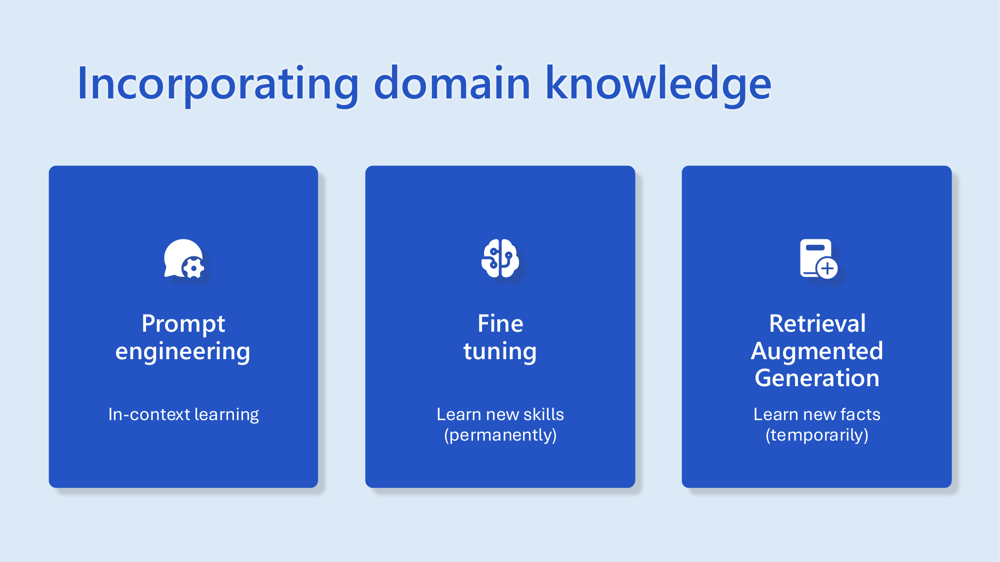

```
Incorporating domain knowledge


   Prompt                  Fine            Retrieval
 engineering              tuning          Augmented
                                          Generation
 In-context learning   Learn new skills   Learn new facts
                        (permanently)      (temporarily)
```

## Slide 12

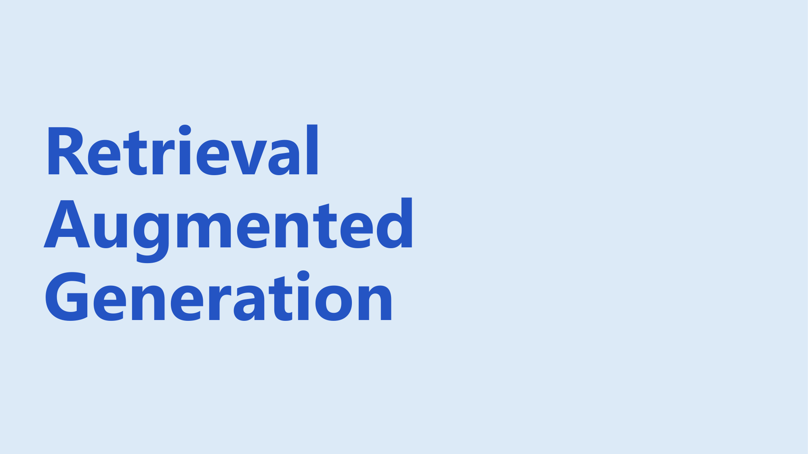

```
Retrieval
Augmented
Generation
```

## Slide 13

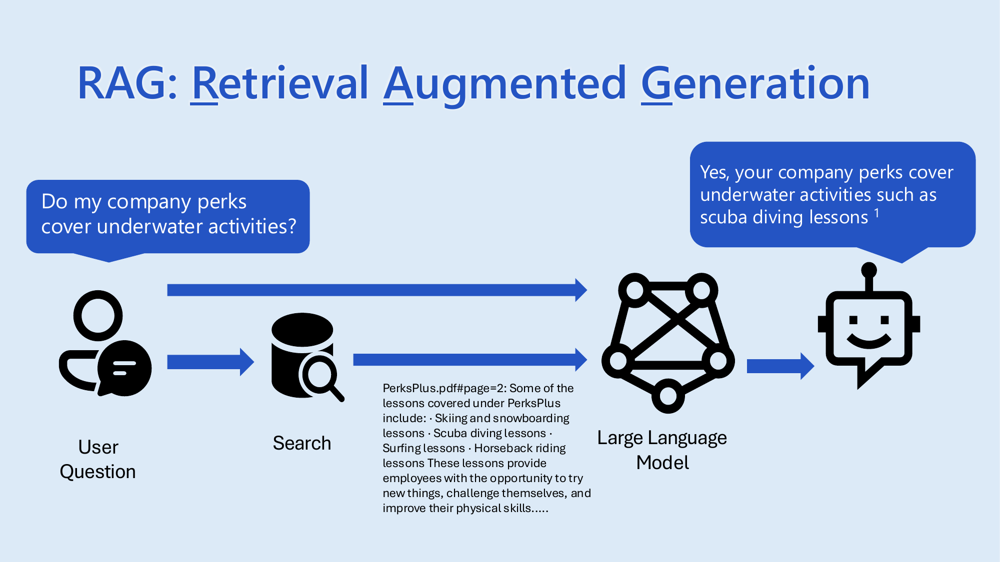

```
RAG: Retrieval Augmented Generation
                                                                                     Yes, your company perks cover
Do my company perks                                                                  underwater activities such as
                                                                                     scuba diving lessons 1
cover underwater activities?


                                  PerksPlus.pdf#page=2: Some of the
                                  lessons covered under PerksPlus
                                  include: · Skiing and snowboarding

   User                  Search
                                  lessons · Scuba diving lessons ·
                                  Surfing lessons · Horseback riding
                                                                          Large Language
  Question
                                  lessons These lessons provide               Model
                                  employees with the opportunity to try
                                  new things, challenge themselves, and
                                  improve their physical skills.….
```

## Slide 14

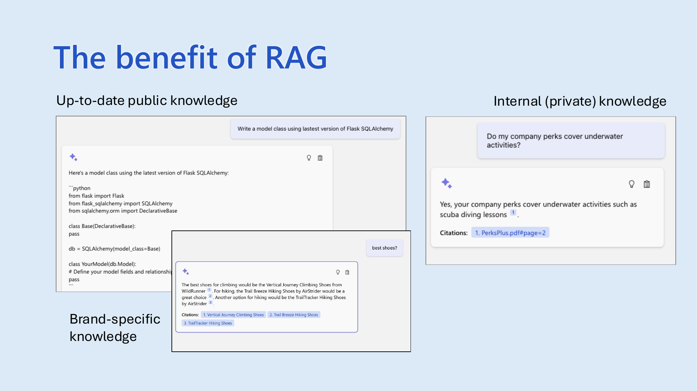

```
The benefit of RAG
Up-to-date public knowledge   Internal (private) knowledge


 Brand-specific
 knowledge
```

## Slide 15

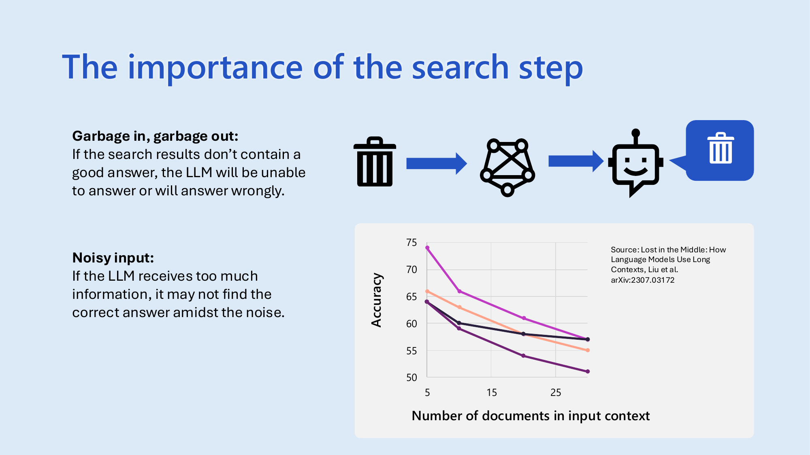

```
The importance of the search step
Garbage in, garbage out:
If the search results don’t contain a
good answer, the LLM will be unable
to answer or will answer wrongly.


                                                   75
                                                                                  Source: Lost in the Middle: How
Noisy input:                                                                      Language Models Use Long
                                                   70                             Contexts, Liu et al.
If the LLM receives too much

                                        Accuracy
                                                                                  arXiv:2307.03172
information, it may not find the                   65
correct answer amidst the noise.
                                                   60

                                                   55

                                                   50
                                                        5      15       25

                                                    Number of documents in input context
```

## Slide 16

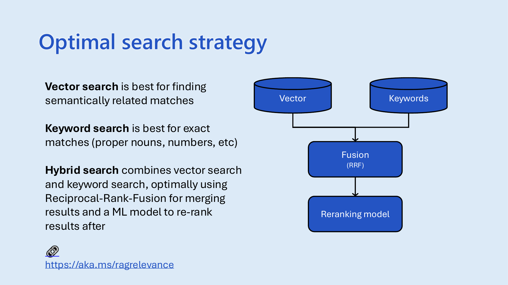

```
Optimal search strategy
Vector search is best for finding
semantically related matches           Vector                 Keywords


Keyword search is best for exact
matches (proper nouns, numbers, etc)
                                                    Fusion
                                                     (RRF)
Hybrid search combines vector search
and keyword search, optimally using
Reciprocal-Rank-Fusion for merging
results and a ML model to re-rank               Reranking model
results after


https://aka.ms/ragrelevance
```

## Slide 17

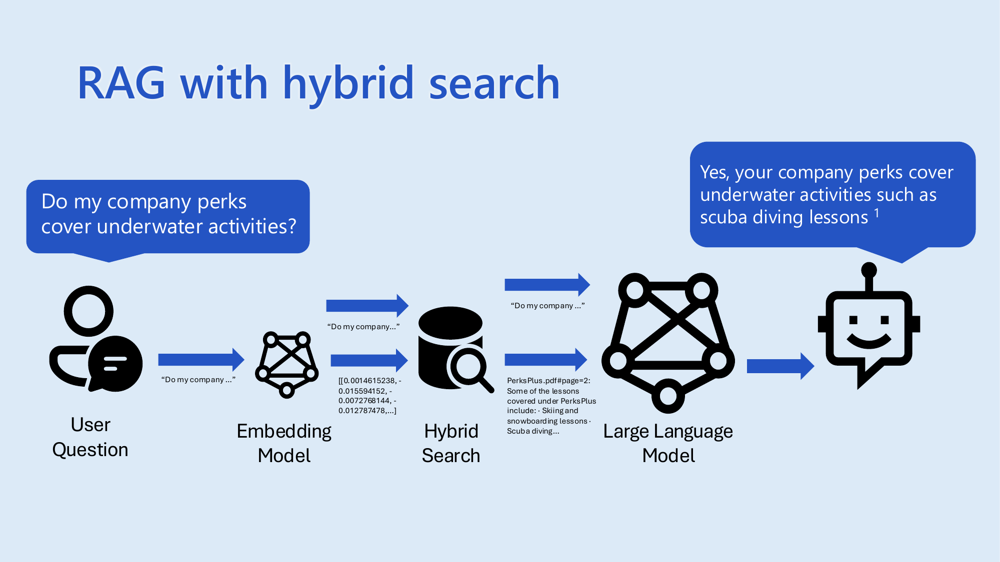

```
RAG with hybrid search
                                                                                                              Yes, your company perks cover
Do my company perks                                                                                           underwater activities such as
                                                                                                              scuba diving lessons 1
cover underwater activities?


                                                                          “Do my company …”

                                         “Do my company…”


             “Do my company …”               [[0.0014615238, -            PerksPlus.pdf#page=2:
                                             0.015594152, -               Some of the lessons
                                             0.0072768144, -              covered under PerksPlus
                                             0.012787478,…]               include: · Skiing and

  User                           Embedding                       Hybrid
                                                                          snowboarding lessons ·
                                                                          Scuba diving…             Large Language
 Question                          Model                         Search                                 Model
```

## Slide 18

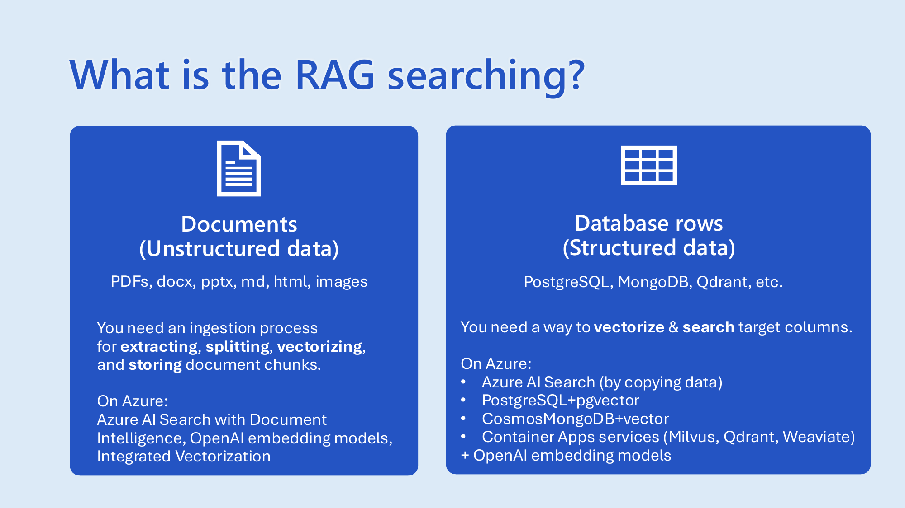

```
What is the RAG searching?


           Documents                                     Database rows
       (Unstructured data)                              (Structured data)
  PDFs, docx, pptx, md, html, images               PostgreSQL, MongoDB, Qdrant, etc.

 You need an ingestion process             You need a way to vectorize & search target columns.
 for extracting, splitting, vectorizing,
 and storing document chunks.              On Azure:
                                           • Azure AI Search (by copying data)
 On Azure:                                 • PostgreSQL+pgvector
 Azure AI Search with Document             • CosmosMongoDB+vector
 Intelligence, OpenAI embedding models,    • Container Apps services (Milvus, Qdrant, Weaviate)
 Integrated Vectorization                  + OpenAI embedding models
```

## Slide 19

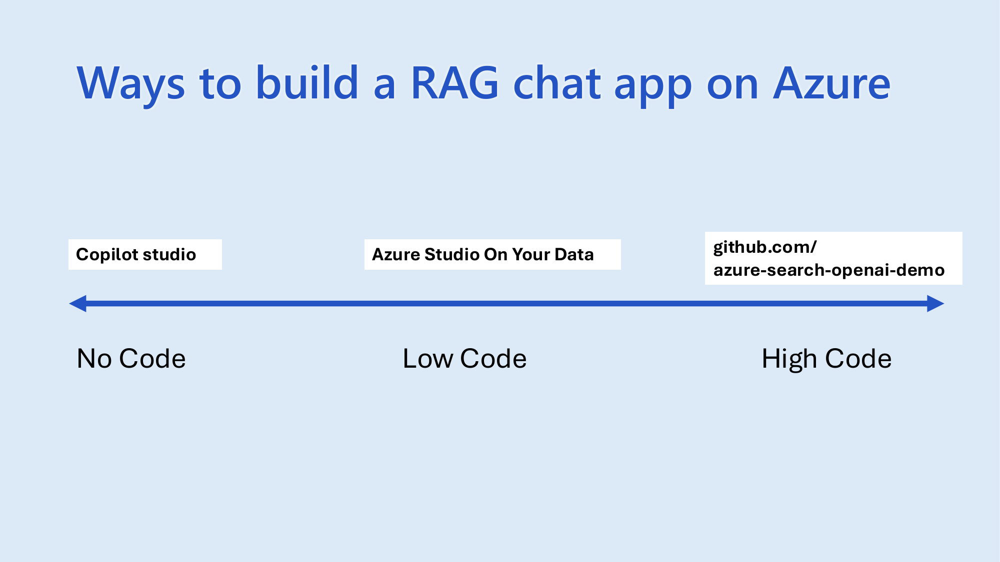

```
Ways to build a RAG chat app on Azure


Copilot studio   Azure Studio On Your Data   github.com/
                                             azure-search-openai-demo


No Code             Low Code                     High Code
```

## Slide 20

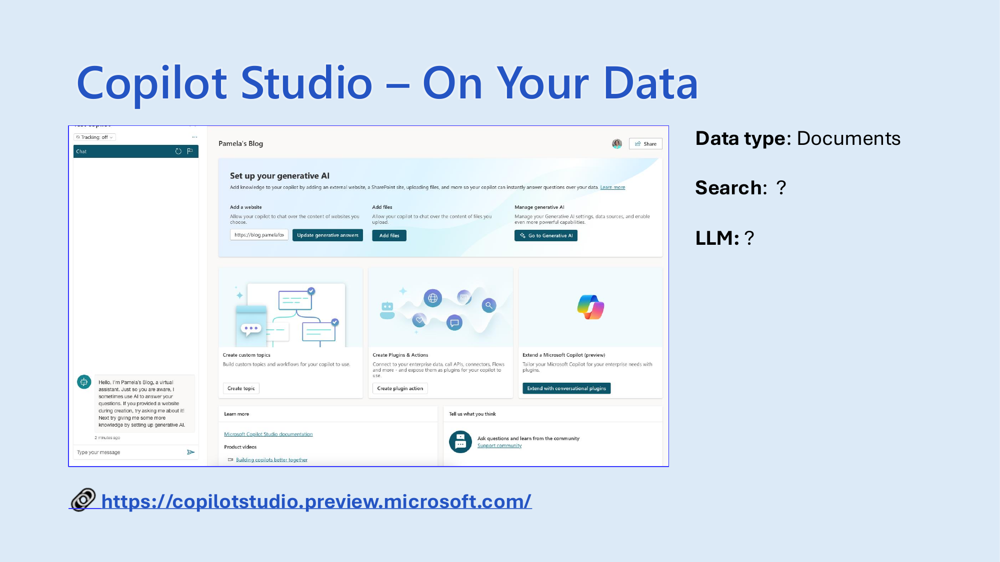

```
Copilot Studio – On Your Data
                                                Data type: Documents

                                                Search: ?

                                                LLM: ?


 https://copilotstudio.preview.microsoft.com/
```

## Slide 21

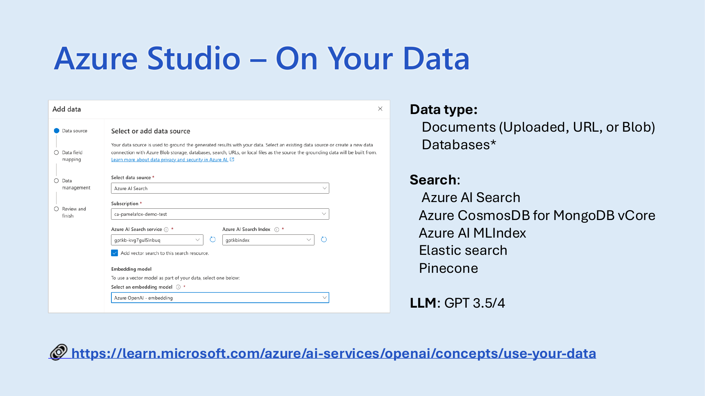

```
Azure Studio – On Your Data
                                                 Data type:
                                                  Documents (Uploaded, URL, or Blob)
                                                  Databases*

                                                 Search:
                                                  Azure AI Search
                                                  Azure CosmosDB for MongoDB vCore
                                                  Azure AI MLIndex
                                                  Elastic search
                                                  Pinecone

                                                 LLM: GPT 3.5/4


 https://learn.microsoft.com/azure/ai-services/openai/concepts/use-your-data
```

## Slide 22

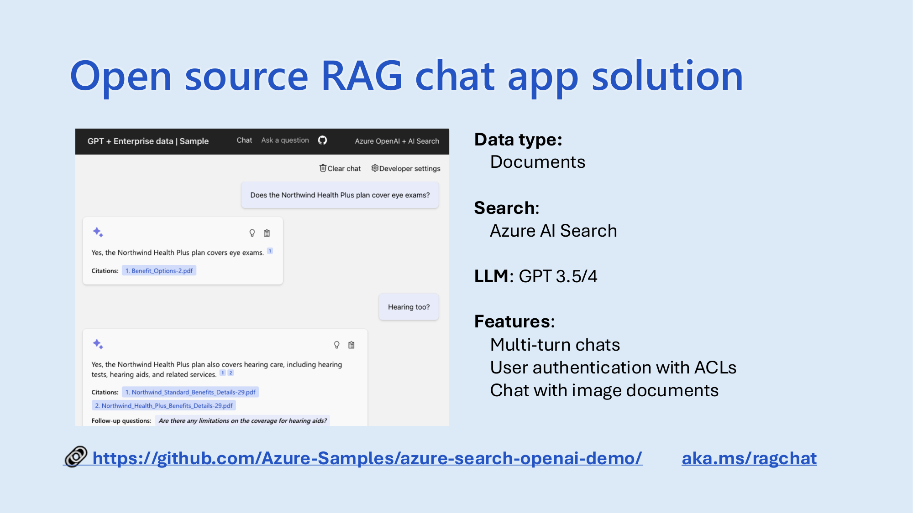

```
Open source RAG chat app solution
                                         Data type:
                                          Documents

                                         Search:
                                          Azure AI Search

                                         LLM: GPT 3.5/4

                                         Features:
                                           Multi-turn chats
                                           User authentication with ACLs
                                           Chat with image documents


 https://github.com/Azure-Samples/azure-search-openai-demo/      aka.ms/ragchat
```

## Slide 23

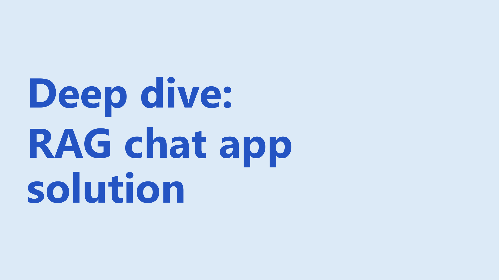

```
Deep dive:
RAG chat app
solution
```

## Slide 24

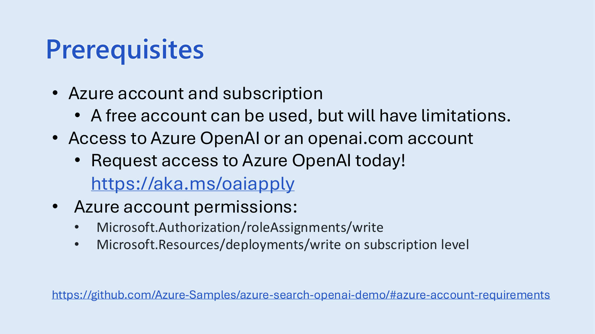

```
Prerequisites
• Azure account and subscription
   • A free account can be used, but will have limitations.
• Access to Azure OpenAI or an openai.com account
   • Request access to Azure OpenAI today!
     https://aka.ms/oaiapply
• Azure account permissions:
   •   Microsoft.Authorization/roleAssignments/write
   •   Microsoft.Resources/deployments/write on subscription level


https://github.com/Azure-Samples/azure-search-openai-demo/#azure-account-requirements
```

## Slide 25

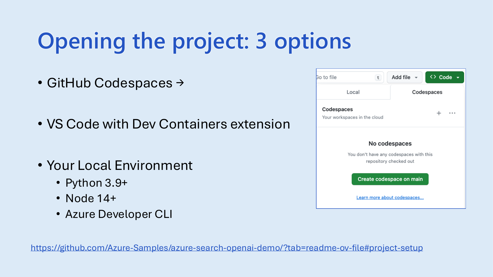

```
Opening the project: 3 options
 • GitHub Codespaces →

 • VS Code with Dev Containers extension

 • Your Local Environment
     • Python 3.9+
     • Node 14+
     • Azure Developer CLI

https://github.com/Azure-Samples/azure-search-openai-demo/?tab=readme-ov-file#project-setup
```

## Slide 26

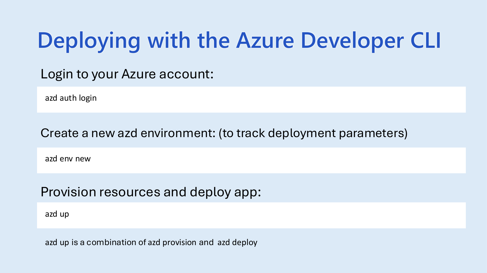

```
Deploying with the Azure Developer CLI
Login to your Azure account:
azd auth login


Create a new azd environment: (to track deployment parameters)
azd env new


Provision resources and deploy app:
azd up


azd up is a combination of azd provision and azd deploy
```

## Slide 27

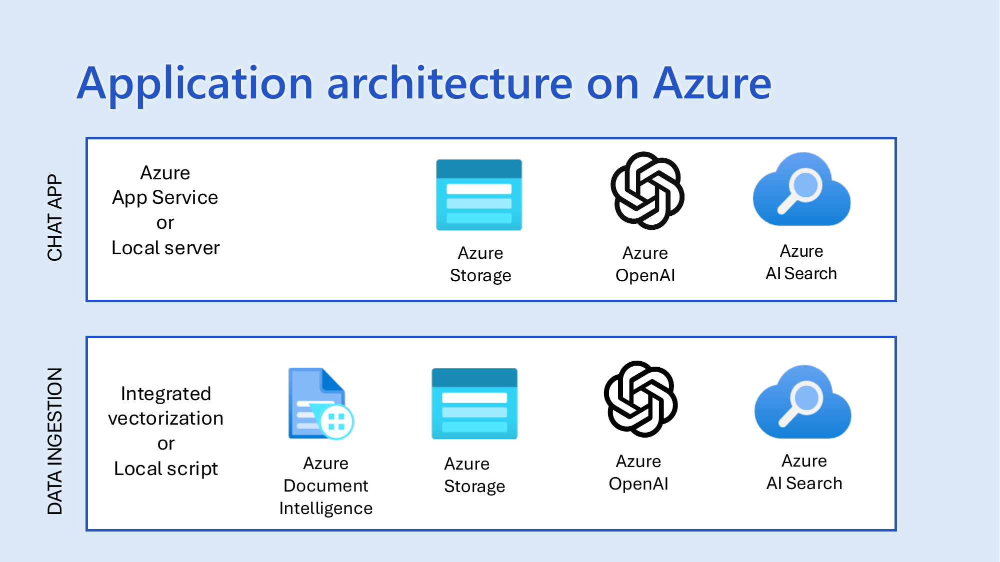

```
Application architecture on Azure
                     Azure

CHAT APP
                  App Service
                      or
                  Local server                    Azure     Azure     Azure
                                                 Storage   OpenAI   AI Search


DATA INGESTION
                    Integrated
                  vectorization
                        or
                   Local script      Azure       Azure      Azure     Azure
                                   Document      Storage   OpenAI   AI Search
                                  Intelligence
```

## Slide 28

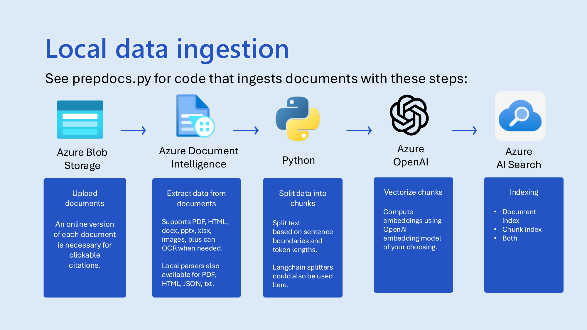

```
Local data ingestion
See prepdocs.py for code that ingests documents with these steps:


 Azure Blob          Azure Document                                 Azure              Azure
  Storage              Intelligence           Python               OpenAI            AI Search

      Upload          Extract data from      Split data into     Vectorize chunks        Indexing
    documents            documents              chunks
                                                                 Compute             • Document
                     Supports PDF, HTML,   Split text            embeddings using      index
 An online version
                     docx, pptx, xlsx,     based on sentence     OpenAI              • Chunk index
 of each document                                                embedding model     • Both
                     images, plus can      boundaries and
  is necessary for   OCR when needed.                            of your choosing.
                                           token lengths.
      clickable
      citations.     Local parsers also    Langchain splitters
                     available for PDF,    could also be used
                     HTML, JSON, txt.      here.
```

## Slide 29

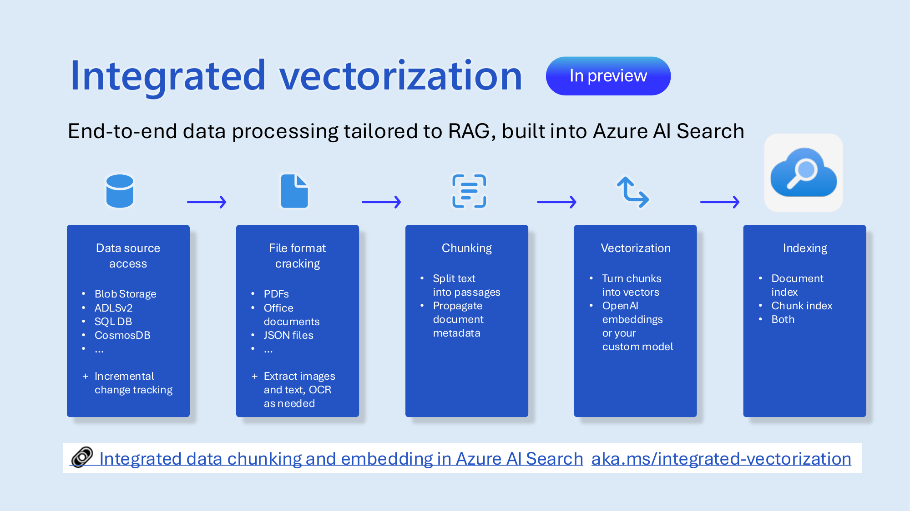

```
Integrated vectorization                                    In preview

End-to-end data processing tailored to RAG, built into Azure AI Search


     Data source         File format          Chunking          Vectorization         Indexing
       access             cracking
                                          • Split text        • Turn chunks       • Document
 •   Blob Storage     • PDFs                into passages       into vectors        index
 •   ADLSv2           • Office            • Propagate         • OpenAI            • Chunk index
 •   SQL DB             documents           document            embeddings        • Both
 •   CosmosDB         • JSON files          metadata            or your
 •   …                • …                                       custom model

 + Incremental        + Extract images
   change tracking      and text, OCR
                        as needed


     Integrated data chunking and embedding in Azure AI Search aka.ms/integrated-vectorization
```

## Slide 30

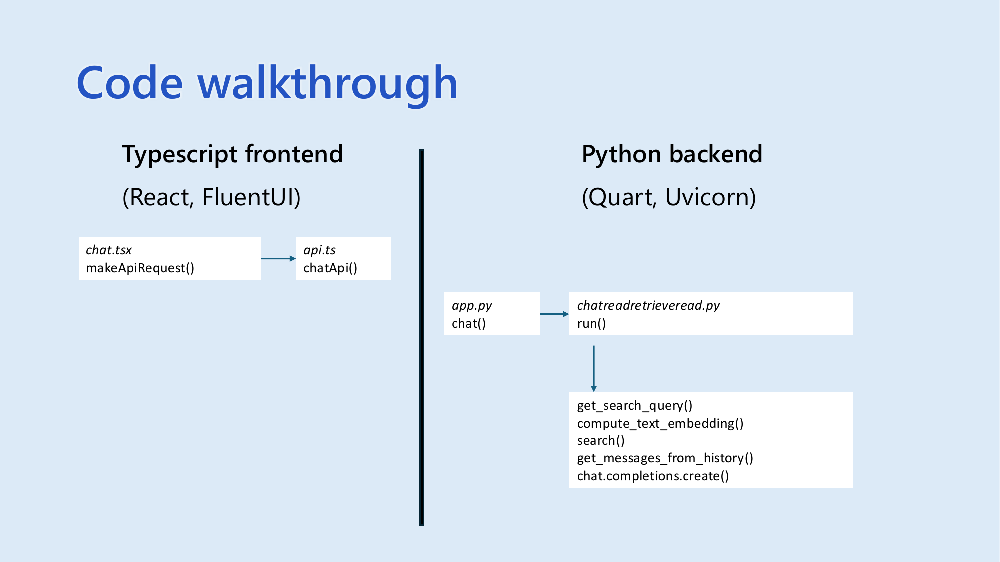

```
Code walkthrough
     Typescript frontend                      Python backend
     (React, FluentUI)                        (Quart, Uvicorn)
chat.tsx                 api.ts
makeApiRequest()         chatApi()

                                     app.py   chatreadretrieveread.py
                                     chat()   run()


                                              get_search_query()
                                              compute_text_embedding()
                                              search()
                                              get_messages_from_history()
                                              chat.completions.create()
```

## Slide 31

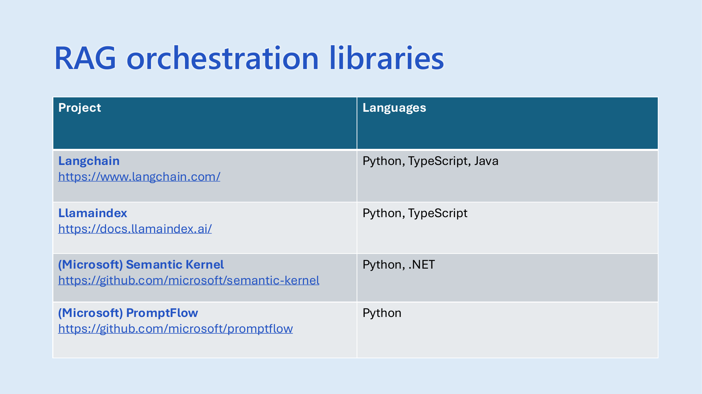

```
RAG orchestration libraries
Project                                        Languages


Langchain                                      Python, TypeScript, Java
https://www.langchain.com/

Llamaindex                                     Python, TypeScript
https://docs.llamaindex.ai/

(Microsoft) Semantic Kernel                    Python, .NET
https://github.com/microsoft/semantic-kernel

(Microsoft) PromptFlow                         Python
https://github.com/microsoft/promptflow
```

## Slide 32

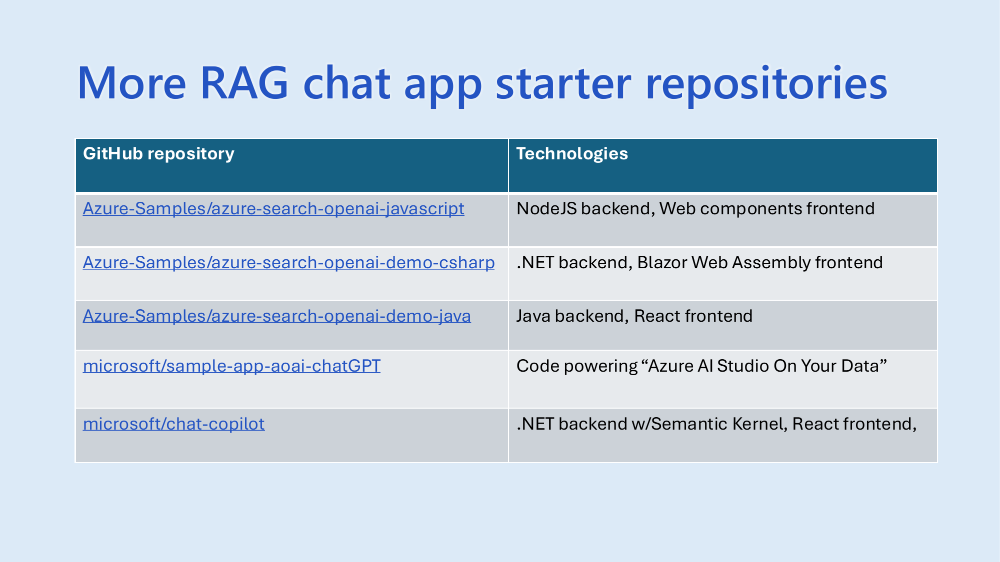

```
More RAG chat app starter repositories
GitHub repository                               Technologies

Azure-Samples/azure-search-openai-javascript    NodeJS backend, Web components frontend

Azure-Samples/azure-search-openai-demo-csharp   .NET backend, Blazor Web Assembly frontend

Azure-Samples/azure-search-openai-demo-java     Java backend, React frontend

microsoft/sample-app-aoai-chatGPT               Code powering “Azure AI Studio On Your Data”


microsoft/chat-copilot                          .NET backend w/Semantic Kernel, React frontend,
```

## Slide 33

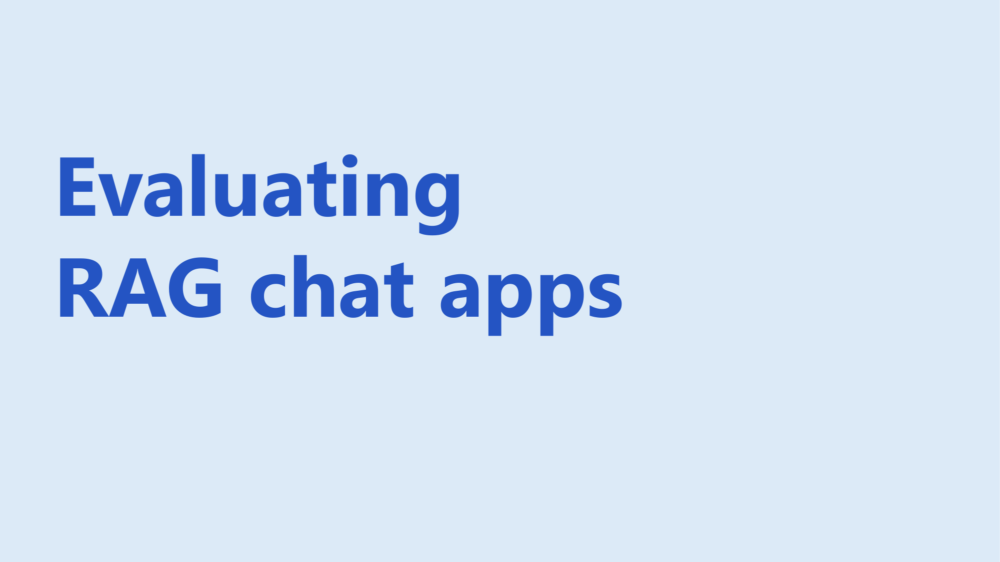

```
Evaluating
RAG chat apps
```

## Slide 34

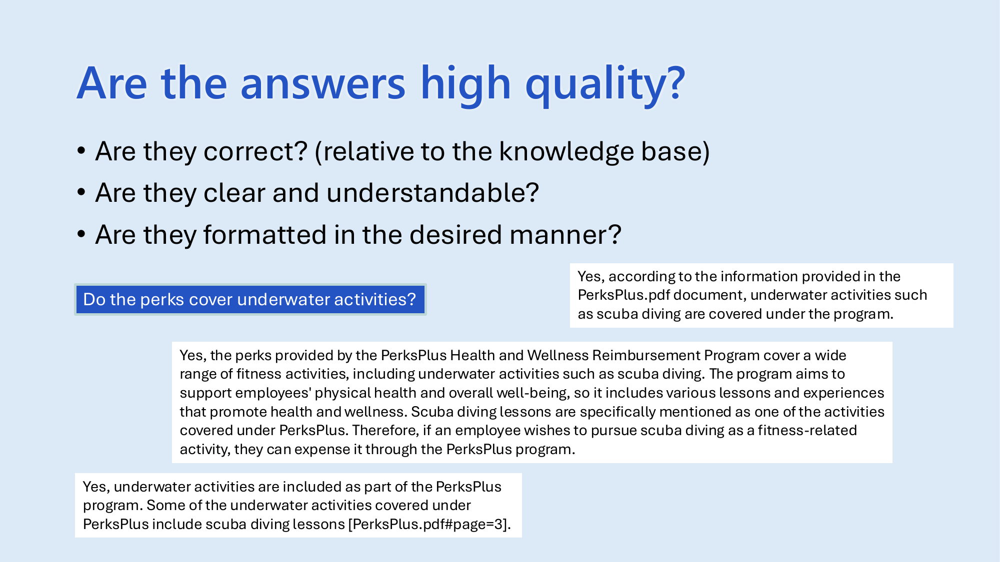

```
Are the answers high quality?
• Are they correct? (relative to the knowledge base)
• Are they clear and understandable?
• Are they formatted in the desired manner?
                                                                         Yes, according to the information provided in the
Do the perks cover underwater activities?                                PerksPlus.pdf document, underwater activities such
                                                                         as scuba diving are covered under the program.

              Yes, the perks provided by the PerksPlus Health and Wellness Reimbursement Program cover a wide
              range of fitness activities, including underwater activities such as scuba diving. The program aims to
              support employees' physical health and overall well-being, so it includes various lessons and experiences
              that promote health and wellness. Scuba diving lessons are specifically mentioned as one of the activities
              covered under PerksPlus. Therefore, if an employee wishes to pursue scuba diving as a fitness-related
              activity, they can expense it through the PerksPlus program.

Yes, underwater activities are included as part of the PerksPlus
program. Some of the underwater activities covered under
PerksPlus include scuba diving lessons [PerksPlus.pdf#page=3].
```

## Slide 35

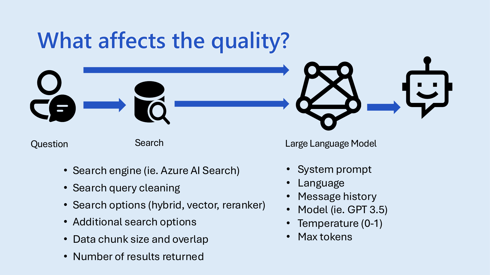

```
What affects the quality?


Question              Search                         Large Language Model

       • Search engine (ie. Azure AI Search)         • System prompt
       • Search query cleaning                       • Language
                                                     • Message history
       • Search options (hybrid, vector, reranker)   • Model (ie. GPT 3.5)
       • Additional search options                   • Temperature (0-1)
       • Data chunk size and overlap                 • Max tokens
       • Number of results returned
```

## Slide 36

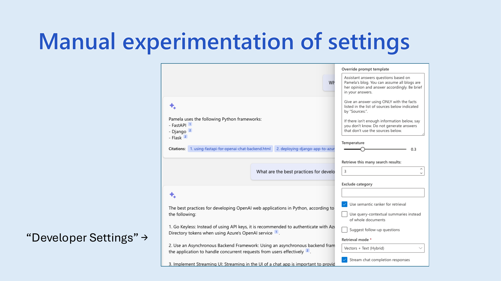

```
Manual experimentation of settings


“Developer Settings” →
```

## Slide 37

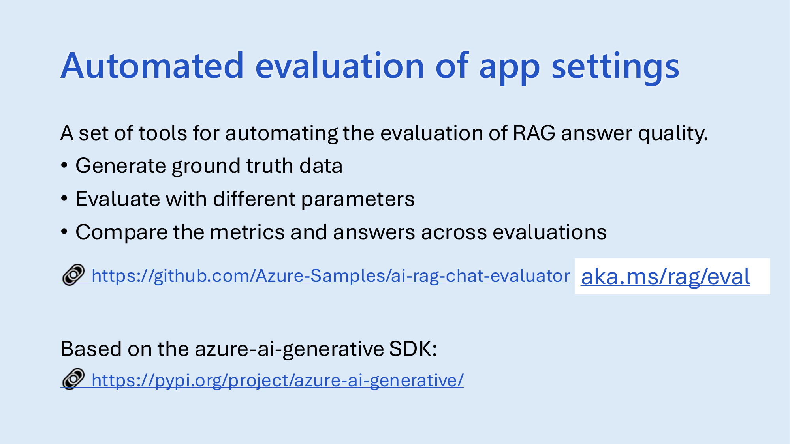

```
Automated evaluation of app settings
A set of tools for automating the evaluation of RAG answer quality.
• Generate ground truth data
• Evaluate with different parameters
• Compare the metrics and answers across evaluations
   https://github.com/Azure-Samples/ai-rag-chat-evaluator aka.ms/rag/eval


Based on the azure-ai-generative SDK:
   https://pypi.org/project/azure-ai-generative/
```

## Slide 38

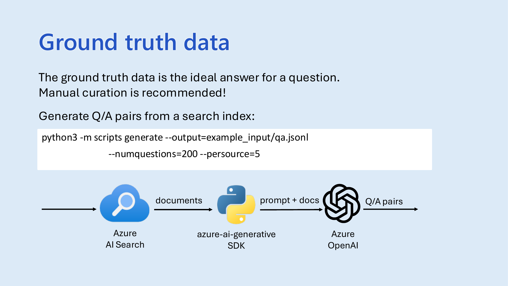

```
Ground truth data
The ground truth data is the ideal answer for a question.
Manual curation is recommended!
Generate Q/A pairs from a search index:
python3 -m scripts generate --output=example_input/qa.jsonl
              --numquestions=200 --persource=5


                          documents              prompt + docs            Q/A pairs


                Azure             azure-ai-generative             Azure
              AI Search                  SDK                     OpenAI
```

## Slide 39

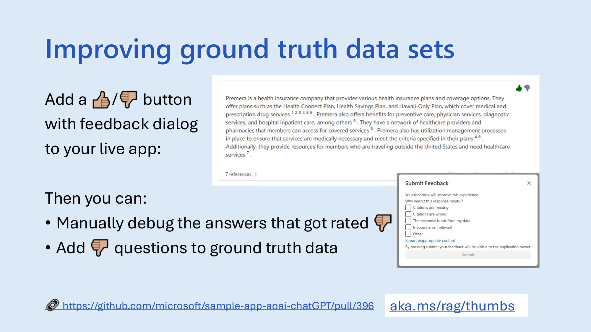

```
Improving ground truth data sets
Add a / button
with feedback dialog
to your live app:

Then you can:
• Manually debug the answers that got rated
• Add    questions to ground truth data


  https://github.com/microsoft/sample-app-aoai-chatGPT/pull/396   aka.ms/rag/thumbs
```

## Slide 40

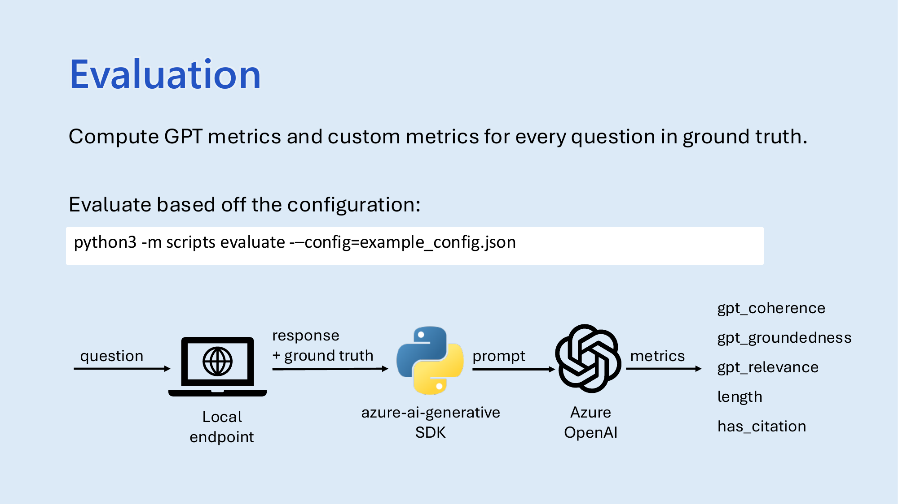

```
Evaluation
Compute GPT metrics and custom metrics for every question in ground truth.


Evaluate based off the configuration:
python3 -m scripts evaluate -–config=example_config.json


                                                                                gpt_coherence
                         response                                               gpt_groundedness
 question                + ground truth             prompt            metrics
                                                                                gpt_relevance
                                                                                length
               Local                 azure-ai-generative      Azure
                                            SDK              OpenAI             has_citation
              endpoint
```

## Slide 41

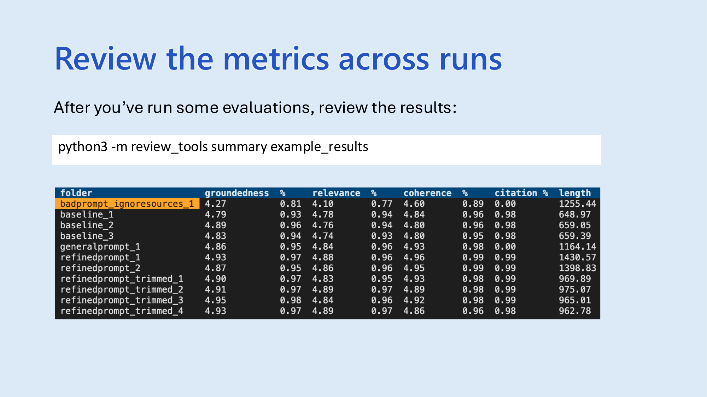

```
Review the metrics across runs
After you’ve run some evaluations, review the results:

python3 -m review_tools summary example_results
```

## Slide 42

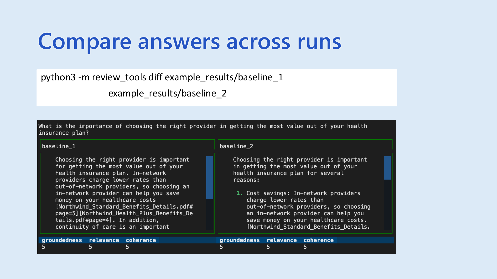

```
Compare answers across runs
python3 -m review_tools diff example_results/baseline_1
               example_results/baseline_2
```

## Slide 43

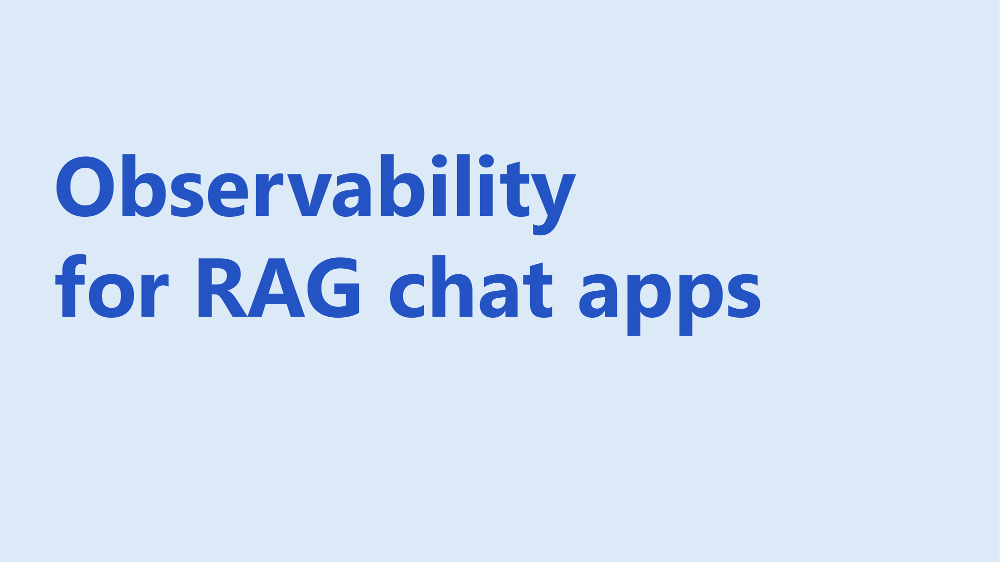

```
Observability
for RAG chat apps
```

## Slide 44

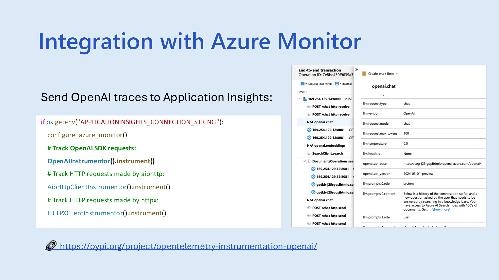

```
Integration with Azure Monitor

Send OpenAI traces to Application Insights:
if os.getenv("APPLICATIONINSIGHTS_CONNECTION_STRING"):
 configure_azure_monitor()
 # Track OpenAI SDK requests:
 OpenAIInstrumentor().instrument()
 # Track HTTP requests made by aiohttp:
 AioHttpClientInstrumentor().instrument()
 # Track HTTP requests made by httpx:
 HTTPXClientInstrumentor().instrument()


     https://pypi.org/project/opentelemetry-instrumentation-openai/
```

## Slide 45

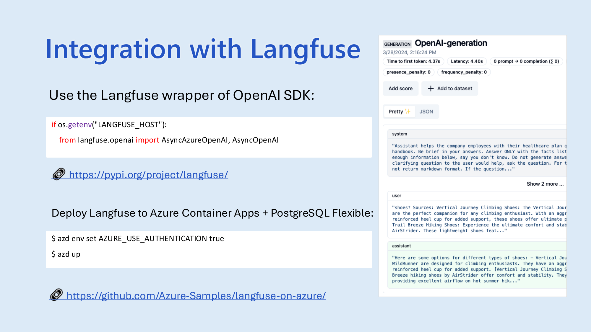

```
Integration with Langfuse
Use the Langfuse wrapper of OpenAI SDK:
if os.getenv("LANGFUSE_HOST"):
  from langfuse.openai import AsyncAzureOpenAI, AsyncOpenAI


    https://pypi.org/project/langfuse/


Deploy Langfuse to Azure Container Apps + PostgreSQL Flexible:

$ azd env set AZURE_USE_AUTHENTICATION true
$ azd up


    https://github.com/Azure-Samples/langfuse-on-azure/
```

## Slide 46

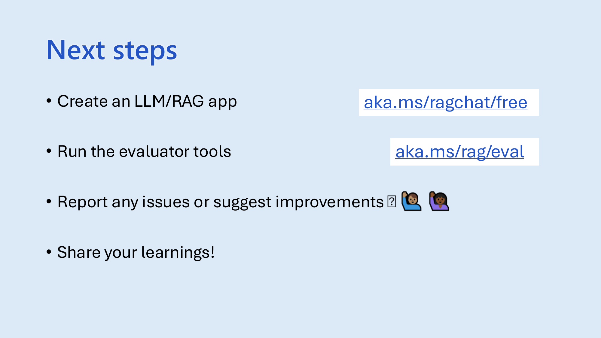

```
Next steps
• Create an LLM/RAG app                 aka.ms/ragchat/free

• Run the evaluator tools                     aka.ms/rag/eval

• Report any issues or suggest improvements

• Share your learnings!
```
