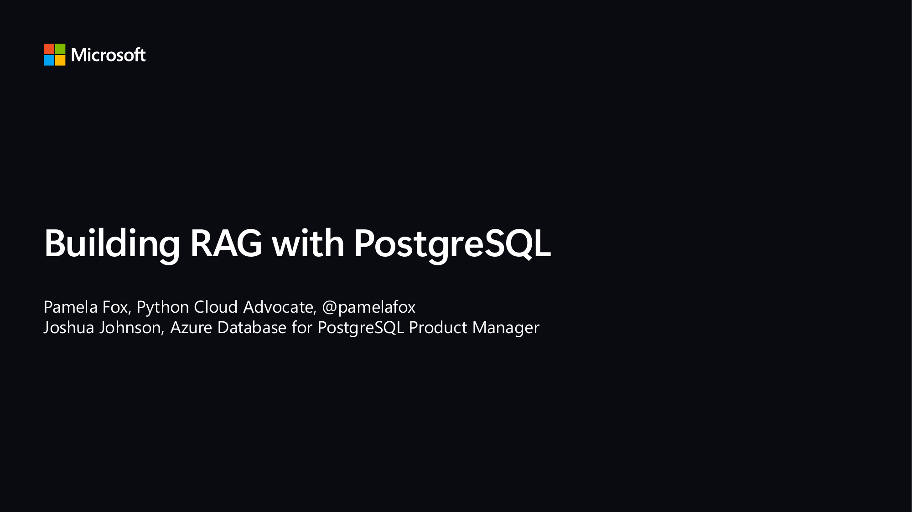
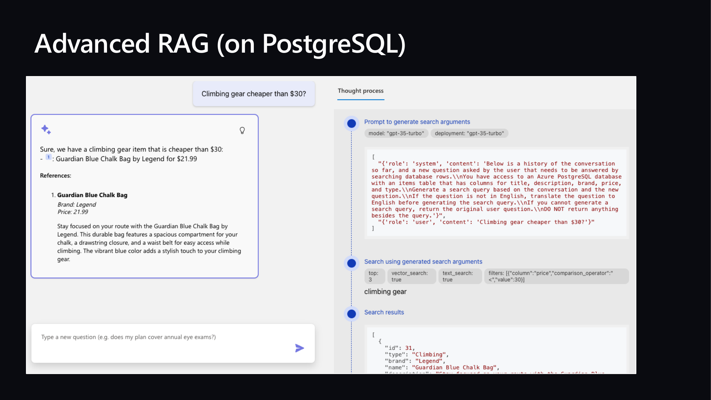
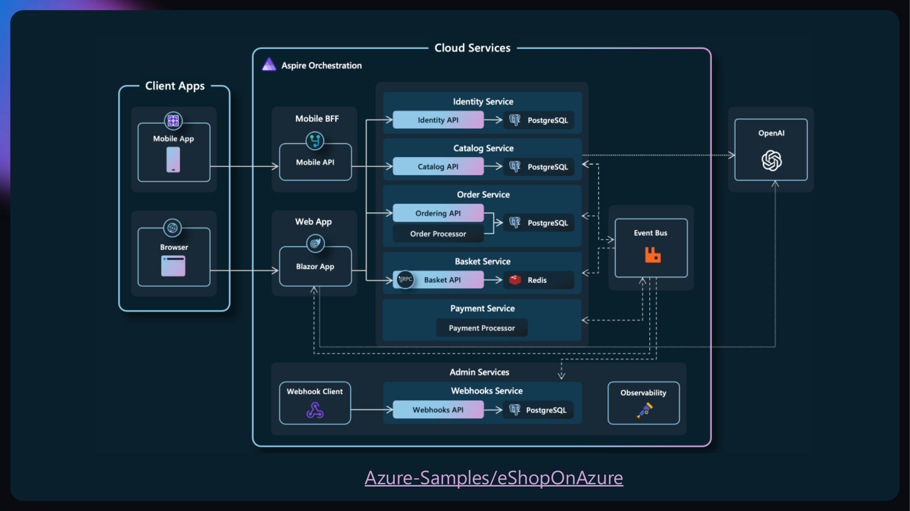
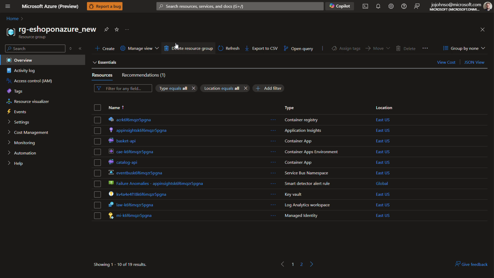
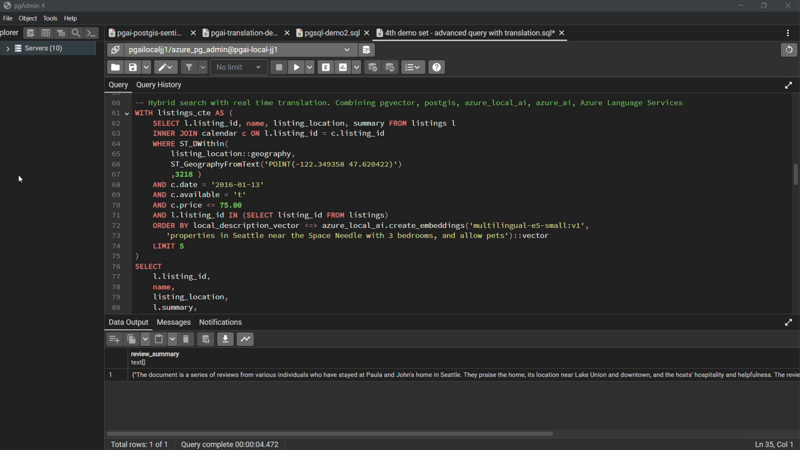
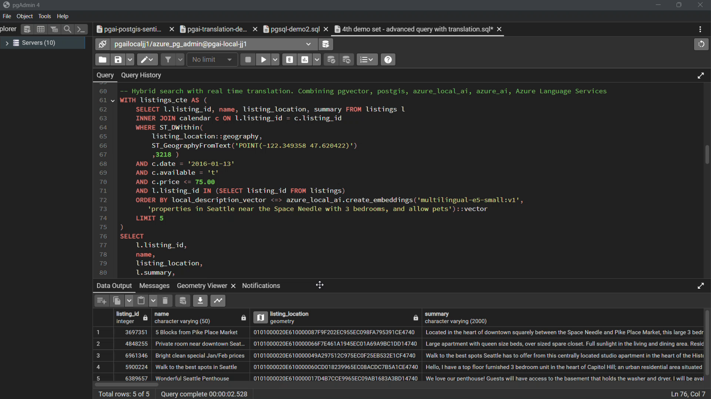

## Slide 1



```
Building RAG with PostgreSQL
Pamela Fox, Python Cloud Advocate, @pamelafox
Joshua Johnson, Azure Database for PostgreSQL Product Manager
```

## Slide 2


```
Agenda    Simple RAG with PostgreSQL
          RAG with Azure PostgreSQL solution
          AI extensions for Azure PostgreSQL
```

## Slide 3


```
RAG with PostgreSQL: Getting started
```

## Slide 4


```
Simple RAG steps

                                                                                 Consider these products:
                                                                                 Summit Climbing Harness1
                                                                                 Apex Climbing Harness2
Do you sell climbing gear?


                                 [12]:
                                 Name: Summit Climbing Harness
                                 Description: Conquer the highest

  User                  Search
                                 peaks with the Raptor Elite Summit
                                 Climbing Harness. This durable and
                                                                            Large
 Question
                                 lightweight harness, available in bold   Language
                                 red, provides maximum comfort and
                                 safety while scaling tricky routes.        Model
                                 Price:109.99
                                 …
```

## Slide 5


```
RAG search step: Go hybrid!
                                            pgvector            tsquery
Vector search is best for finding
semantically related matches                 Vector             Keywords


Keyword search is best for exact
matches (proper nouns, numbers, etc)                   Fusion
                                                        (RRF)


Hybrid search combines vector search
and keyword search, optimally using
Reciprocal-Rank-Fusion for merging
results and a ML model to re-rank results
after
```

## Slide 6


```
Simple RAG with hybrid search

                                                                                                       Consider these products:
                                                                                                       Summit Climbing Harness1
                                                                                                       Apex Climbing Harness2
Do you sell climbing gear?


                                                                      “Do you sell…”

                                     “Do you sell…”


            “Do you sell…”               [[0.0014615238, -            [12]:
                                         0.015594152, -               Name: Summit Climbing
                                         0.0072768144, -              Harness Description:
                                         0.012787478,…]               Conquer the highest

 User                        Embedding                       Hybrid
                                                                      peaks with the Raptor
                                                                      Elite Summit Climbing
                                                                                                   Large
Question
                                                                      Harness. This durable

                               Model                         Search   and lightweight harness,
                                                                      available in bold red,     Language
                                                                      provides maximum
                                                                      comfort and safety while
                                                                      scaling tricky routes.
                                                                                                   Model
                                                                      Price:109.99
                                                                      …
```

## Slide 7


```
Setting up pgvector

Install the pgvector extension:
github.com/pgvector/pgvector


Enable extension:
CREATE EXTENSION IF NOT EXISTS vector;


Tip: Try the extension in the pgvector dev container:
github.com/pamelafox/pgvector-playground
```

## Slide 8


```
Adding a vector column

Choose a vector embedding model


Add a vector embedding column:
ALTER TABLE videos ADD COLUMN embedding vector(256)


Add an index for more efficient searching:
CREATE INDEX ON videos USING hnsw (embedding vector_ip_ops)
```

## Slide 9


```
Creating an index for query efficiency
Use either HNSW or IVFflat:
CREATE INDEX ON videos USING hnsw (embedding vector_ip_ops)


Use inner product (vector_ip_ops) on normalized embeddings.
Use cosine product (vector_cosine_ops) otherwise.
```

## Slide 10


```
Computing vector embeddings

Python:
string_to_embed = row[0] + " " + row[1]
response = client.embeddings.create(
     model="text-embedding-3-small",
     input=string_to_embed,
     dimensions=256
)
embedding = response.data[0].embedding

cur.execute("UPDATE videos SET embedding = %s WHERE id = %s",
(np.array(embedding), row[0]))
```

## Slide 11


```
Vector search SQL query

 SELECT id
  FROM videos
  ORDER BY embedding <=> %(embedding)s
  LIMIT 20


The operator should match the operator used in the index creation.

Use inner product <#> on normalized embeddings.
Use cosine product <=> otherwise.
```

## Slide 12


```
Full-text search SQL query

 SELECT id FROM videos, plainto_tsquery('english', %(query)s) query
  WHERE to_tsvector('english', description) @@ query
  ORDER BY ts_rank_cd(to_tsvector('english', description), query)
  DESC LIMIT 20
```

## Slide 13


```
Hybrid search query
  WITH semantic_search AS (
        SELECT id, RANK () OVER (ORDER BY embedding <=> %(embedding)s) AS rank
        FROM videos
        ORDER BY embedding <=> %(embedding)s
        LIMIT 20
  ),
  keyword_search AS (
        SELECT id, RANK () OVER (ORDER BY ts_rank_cd(to_tsvector('english', description), query) DESC)
        FROM videos, plainto_tsquery('english', %(query)s) query
        WHERE to_tsvector('english', description) @@ query
        ORDER BY ts_rank_cd(to_tsvector('english', description), query) DESC
        LIMIT 20
  )
  SELECT
  COALESCE(semantic_search.id, keyword_search.id) AS id,
  COALESCE(1.0 / (%(k)s + semantic_search.rank), 0.0) +
  COALESCE(1.0 / (%(k)s + keyword_search.rank), 0.0) AS score
  FROM semantic_search
  FULL OUTER JOIN keyword_search ON semantic_search.id = keyword_search.id
  ORDER BY score DESC
  LIMIT 5


https://github.com/pgvector/pgvector-python/blob/master/examples/hybrid_search_rrf.py
```

## Slide 14


```
Orchestrating a RAG flow with Python
 question = "any videos on python?"

 cur.execute("SELECT ... ")
 results = cur.fetchall()
 for result in results:
  formatted_results += f"## {result[1]}\n\n{result[2]}\n"

 response = client.complete(
  messages=[
   SystemMessage(content="Answer question according to sources..."),
   UserMessage(content=question +
         "\n\nSources:\n\n" + formatted_results)],
 model="gpt-4o",
 temperature=0.3)
```

## Slide 15


```
Full RAG with PostgreSQL solution
```

## Slide 16


```
Simple RAG (on PostgreSQL)
                             Azure OpenAI +
                             Azure PostgreSQL Flexible Server +
                             Azure Container Apps


                             Code:
                             aka.ms/rag-postgres

                             Demo:
                             aka.ms/rag-postgres/demo
```

## Slide 17


```
Code walkthrough

    Typescript frontend                      Python backend
    (React, FluentUI)                        (FastAPI, Uvicorn)

 chat.tsx               api.ts
 makeApiRequest()       chatApi()
                                    app.py   simple_rag.py
                                    chat()   run()


                                             get_search_query()
                                             compute_text_embedding()
                                             search()
                                             get_messages_from_history()
                                             chat.completions.create()
```

## Slide 18


```
Advanced RAG with query re-writing

                                                                                              For great hiking shoes,
                                                                                              consider the TrekExtreme
                                                                                              Hiking Shoes 1 or the Trailblaze
                                                                                              Steel-Blue Hiking Shoes 2

what's a good shoe
for a mountain trale?


                        mountain trail shoe            [101]:
                                                       Name: TrekExtreme Hiking Shoes
  User             Large                      Search   Price: 135.99                        Large
                                                       Brand: Raptor Elite
 Question        Language                              Type: Footwear                     Language
                   Model                               Description: The Trek Extreme
                                                       hiking shoes by Raptor Elite are
                                                                                            Model
                                                       built to ensure any trail.
                                                       …
```

## Slide 19



```
Advanced RAG (on PostgreSQL)
```

## Slide 20


```
Query rewriting with function calling


Do you sell climbing gear
cheaper than $30?


                                         search_database(
                                           "climbing_gear",
                                           {"column": "price",
                                            "operator" : "<",
                              Large         "value" : "30"
 User                       Language       }
Question                    Model with   )
                             function
                              calling
```

## Slide 21


```
Advanced RAG with query rewriting via function calling

                                                                                               We offer 2 climbing bags for
                                                                                               your budget:
                                                                                               SummitStone Chalk Bag 1
Do you sell
                                                                                               Guardian Blue Chalk Bag 2
climbing gear
cheaper than $30?

                                                                   “Do you sell…”


                                       price < 30

                                                                  [12]:
           “Do you sell…”              “climbing gear”            Name: SummitStone
                                                                  Chalk Bag Price:29.99
 User                         LLM                        Search
                                                                  Brand:Grolltex
                                                                  Type:Climbing
                                                                                                LLM
Question                      with
                                                                  Description: The
                                                                  SummitStone Chalk Bag
                                                                  in forest green is a must-

                            function                              have for climbers
                                                                  seeking adventure.

                             calling
                                                                  …
```

## Slide 22


```
Code walkthrough

    Typescript frontend                      Python backend
    (React, FluentUI)                        (FastAPI, Uvicorn)

 chat.tsx               api.ts
 makeApiRequest()       chatApi()
                                    app.py   advanced_rag.py
                                    chat()   run()


                                             get_search_query()
                                             compute_text_embedding()
                                             search()
                                             get_messages_from_history()
                                             chat.completions.create()
```

## Slide 23


```
Deploying with the Azure Developer CLI

Login to your Azure account:
 azd auth login --use-device-code


Create a new azd environment: (to track deployment parameters)

 azd env new


Provision resources and deploy app:
 azd up
```

## Slide 24


```
Application architecture on Azure


                           Azure Database for PostgreSQL


    Azure Container Apps


                                  Azure OpenAI
```

## Slide 25


```
AI extensions for Azure Database for
PostgreSQL
```

## Slide 26


```
Azure Database for PostgreSQL – AI features


    Vector data type                           Azure AI extension                          Integrations
           pgvector extension                      SQL Interface to Azure OpenAI              LangChain
Native vector data type – store embeddings    Create embeddings from SQL Statements         Semantic Kernel
 Vector indexing for performant searches     SQL interface to Azure AI Language services      LlamaIndex
   Efficient ANN searches within the DB      Invoke Azure ML models from within the DB
```

## Slide 27


```
AI Services integrated into Azure Postgres
Make remote calls directly from PostgreSQL


azure_ai extension
                                                                           Azure OpenAI
                                                     Azure Database for
                                                        PostgreSQL
Exceptional simplicity out of the box
・   Azure OpenAI
                                                                              Azure AI
・   Azure AI Language Services                                            Language Services
・   Azure AI Translator
・   Azure Machine Learning

                                                                              Azure AI
                                                                             Translator
Enables developers to rapidly adopt new AI
capabilities in their solution without complex re-
architecture or refactoring
                                                                           Azure Machine
                                                                              Learning
```

## Slide 28


```
Vector Generation
Unique Remote + In-Database Embedding Models


                                                                           “Databases with vector
                SELECT * FROM <table>                                            support”
  Remote        ORDER BY
 Embedding      database_description <->
                azure_openai.create_embeddings(
  Models        ‘text-embedding-ada-002’,                                          0.001238432, …
                ‘Databases with vector support’)                  Azure Database              Azure OpenAI
                                                    Application   for PostgreSQL            Embedding Models


                SELECT * FROM <table>                                    “Databases with vector
 In-Database    ORDER BY                                                       support”
                recipe_embedding <#>
 Embedding      azure_local_ai.create_embeddings(                                              Local Embedding
                                                                                                    Models
   Models       ‘multilingual-e5-small:v1’,                                   0.001238432, …
   (Preview)    ‘Databases with vector support’)                                            (Running in Postgres VM)
                                                                  Azure Database
                                                    Application   for PostgreSQL
```

## Slide 29


```
In-Database Embedding Models
Low-latency embedding creation for OLTP workloads


                                                    Embedding Creation Time (Milliseconds)


Data Privacy, data doesn’t leave database
                                               Remote                                77


Lower latency and higher throughput


Cost predictability
                                            In-database       7


                                                          0       20   40    60      80      100
```

## Slide 30


```
RAG Pattern with Azure Database for PostgreSQL
Unstructured Data                  Embedding Model                       Vector Database                                            Large Language Models

                                            Azure                                                                                                   Azure
                                            OpenAI                                                                                                  OpenAI
                    Chunks                             Vectors
        a
                                            Azure                                                                                                   Azure
                                            ML                                                                                                      ML

                                                                           Vector data type
                                                                              & Indexes


                                                                                                                                           Get answers
                                                                                                           Prompt template:
                                                       Similarity
                                    Create Embedding     search             Get context                  Answer the question with          Get answers
                                                                                                             given context

               Question


    Does my vision insurance cover Lasik?                   5.1.1 Eligibility for LASIK Coverage                    RAG (Context)
                                                                                                                    Your insurance covers LASIK with some stipulations
                                                            The insurance plan provides coverage for
                                                            LASIK for:
                                                               • 18 or older with fully developed eyes
                                                                                                                    No RAG
                                                               • Refractive stability history for 12 months
                                                                                                                    LASIK is not typically considered medically
                                                               • Treatable range of refractive errors.              necessary, and most health insurance plans do not
                                                                                                                    cover the entire expense of the surgery
```

## Slide 31


```
eShop – Powered by Azure DB for PostgreSQL


eShop with chat assistant


.Net Aspire
Entity Framework Core
Semantic Kernel and Azure OpenAI
Azure DB for PostgreSQL
Extensions:
  •   azure_ai
  •   pgvector
```

## Slide 32



```
Azure-Samples/eShopOnAzure
```

## Slide 33


```
(no extractable text)
```

## Slide 34



```
(no extractable text)
```

## Slide 35


```
Real-time translation of listing summaries

Hybrid search with real-time
translation.

Combining,
• Vector search
• Geospatial data
• Azure AI Services
```

## Slide 36



```
(no extractable text)
```

## Slide 37



```
(no extractable text)
```
