# Building RAG with PostgreSQL

This talk explains how to build Retrieval Augmented Generation (RAG) applications using PostgreSQL. Pamela Fox covers the fundamentals of vector search, full-text search, and hybrid search with pgvector, then walks through a deployable RAG solution. Joshua Johnson demos the Azure Database for PostgreSQL AI extensions, including in-database embeddings, the azure_ai SQL interface to Azure OpenAI, and combining vector search with geospatial queries and translation.

## Table of contents

- [Agenda](#agenda)
- [RAG with PostgreSQL: getting started](#rag-with-postgresql-getting-started)
- [Simple RAG steps](#simple-rag-steps)
- [Hybrid search combines vector and keyword retrieval](#hybrid-search-combines-vector-and-keyword-retrieval)
- [Simple RAG with hybrid search](#simple-rag-with-hybrid-search)
- [Setting up pgvector](#setting-up-pgvector)
- [Adding a vector column and index](#adding-a-vector-column-and-index)
- [Choosing an index algorithm and distance operator](#choosing-an-index-algorithm-and-distance-operator)
- [Computing vector embeddings](#computing-vector-embeddings)
- [Vector search SQL query](#vector-search-sql-query)
- [Full-text search SQL query](#full-text-search-sql-query)
- [Hybrid search query with Reciprocal Rank Fusion](#hybrid-search-query-with-reciprocal-rank-fusion)
- [Orchestrating a RAG flow with Python](#orchestrating-a-rag-flow-with-python)
- [Full RAG with PostgreSQL solution](#full-rag-with-postgresql-solution)
- [Simple RAG on PostgreSQL template](#simple-rag-on-postgresql-template)
- [Code walkthrough: simple RAG](#code-walkthrough-simple-rag)
- [Advanced RAG with query rewriting](#advanced-rag-with-query-rewriting)
- [Query rewriting with function calling](#query-rewriting-with-function-calling)
- [Advanced RAG flow with function calling](#advanced-rag-flow-with-function-calling)
- [Code walkthrough: advanced RAG](#code-walkthrough-advanced-rag)
- [Deploying with the Azure Developer CLI](#deploying-with-the-azure-developer-cli)
- [Application architecture on Azure](#application-architecture-on-azure)
- [AI extensions for Azure Database for PostgreSQL](#ai-extensions-for-azure-database-for-postgresql)
- [Azure PostgreSQL AI features overview](#azure-postgresql-ai-features-overview)
- [AI services integrated into Azure PostgreSQL](#ai-services-integrated-into-azure-postgresql)
- [Remote vs in-database embedding models](#remote-vs-in-database-embedding-models)
- [In-database embedding performance](#in-database-embedding-performance)
- [RAG pattern with Azure Database for PostgreSQL](#rag-pattern-with-azure-database-for-postgresql)
- [eShop demo powered by Azure DB for PostgreSQL](#eshop-demo-powered-by-azure-db-for-postgresql)
- [eShop application in action](#eshop-application-in-action)
- [Hybrid search with geospatial data and real-time translation](#hybrid-search-with-geospatial-data-and-real-time-translation)
- [Q&A](#qa)

## Agenda

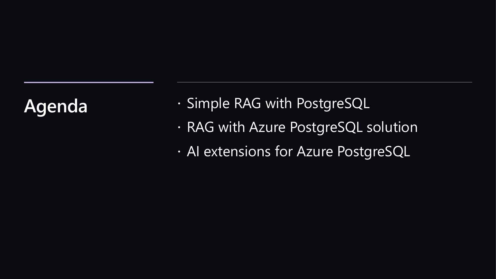
[Watch from 01:39](https://www.youtube.com/watch?v=Dk65oQjYAfo&t=99s)

The talk has three parts: simple RAG with PostgreSQL, a full RAG solution built on Azure PostgreSQL, and AI extensions specific to Azure Database for PostgreSQL.

## RAG with PostgreSQL: getting started

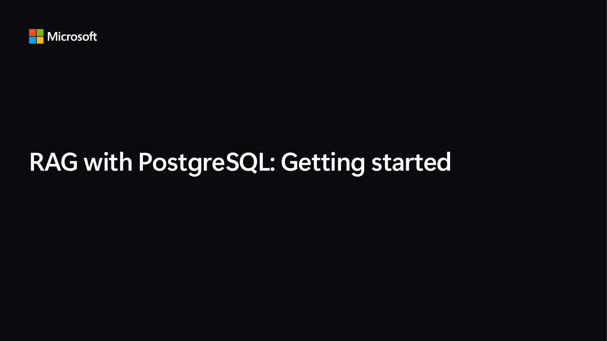
[Watch from 02:09](https://www.youtube.com/watch?v=Dk65oQjYAfo&t=129s)

The first section walks through the building blocks of RAG using PostgreSQL, starting from basic vector operations and working up to a complete hybrid search RAG flow.

## Simple RAG steps

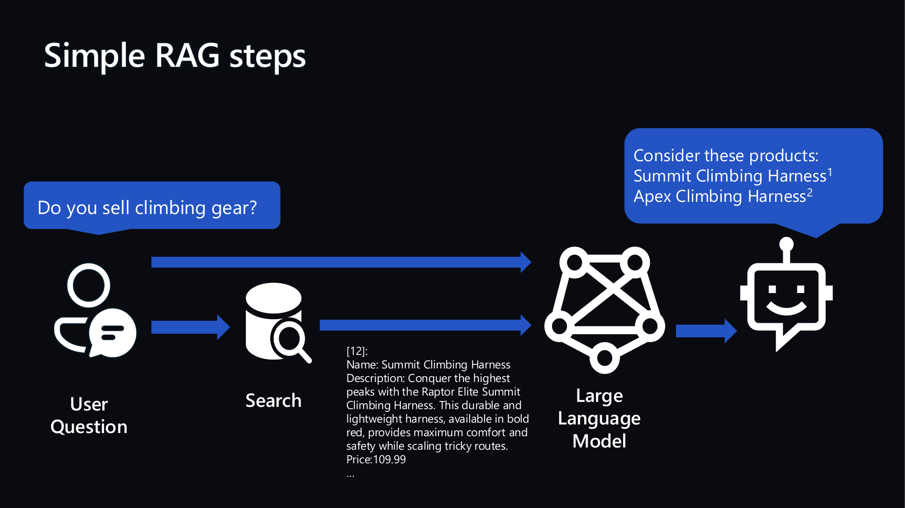
[Watch from 02:12](https://www.youtube.com/watch?v=Dk65oQjYAfo&t=132s)

RAG stands for Retrieval Augmented Generation. It gets an LLM to answer questions grounded in your own data. The flow starts with a user question, searches a database for relevant information, then sends both the question and the retrieved results to an LLM. The response comes back with citations referencing the source data. This approach is powerful when you combine a strong search mechanism with a capable LLM.

## Hybrid search combines vector and keyword retrieval

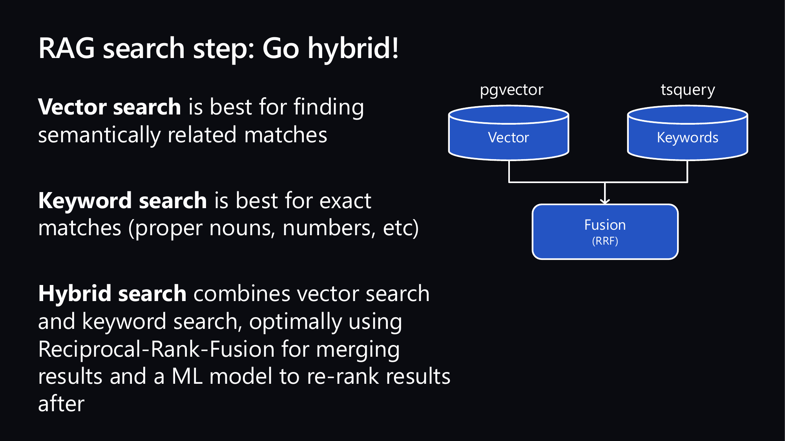
[Watch from 03:02](https://www.youtube.com/watch?v=Dk65oQjYAfo&t=182s)

Best practice for the search step is hybrid search, which combines vector search and keyword search. Vector search (via pgvector) finds semantically similar results — useful when the user's phrasing differs from the stored text. Keyword search (via PostgreSQL's built-in `tsquery`) finds exact matches, which matters for proper nouns, email addresses, and specific identifiers. The two result sets are merged using Reciprocal Rank Fusion (RRF), which ranks all results by combining their positions from each search method.

## Simple RAG with hybrid search

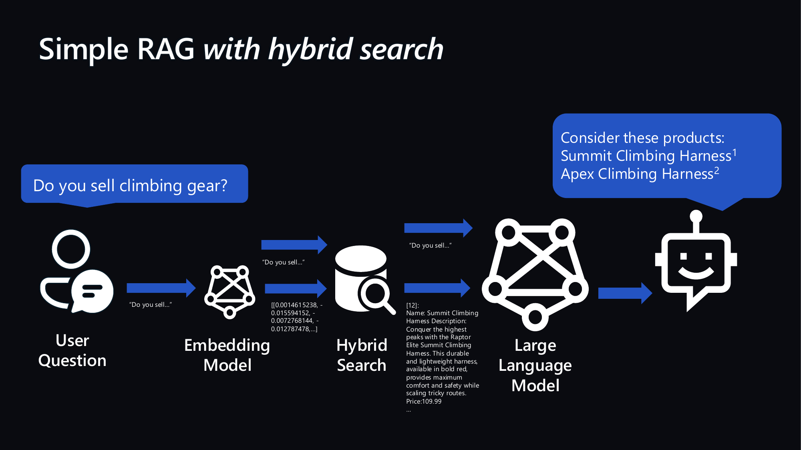
[Watch from 03:52](https://www.youtube.com/watch?v=Dk65oQjYAfo&t=232s)

Adding hybrid search to RAG introduces an embedding model. The user question gets converted to a vector embedding, and both the embedding and the original text are used for the database search. The vector embedding handles the semantic search while the original text handles keyword search. The combined results go to the LLM along with the original question to produce the final answer.

## Setting up pgvector

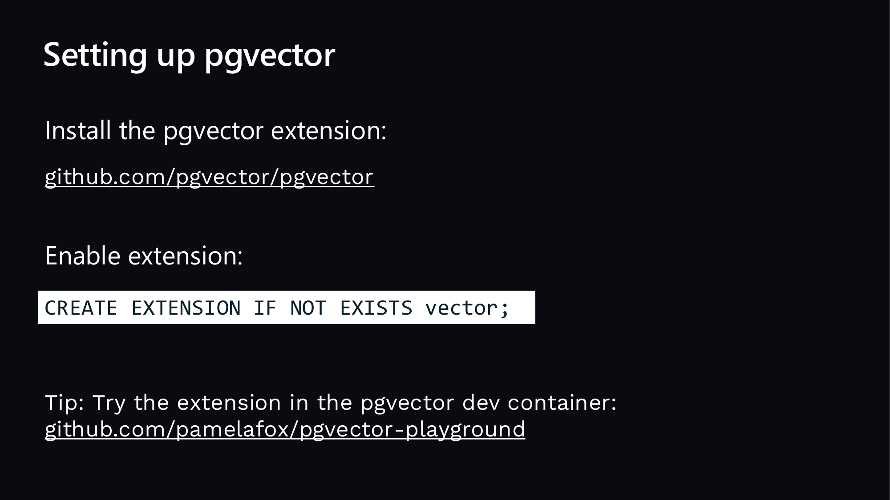
[Watch from 04:37](https://www.youtube.com/watch?v=Dk65oQjYAfo&t=277s)

The [pgvector extension](https://github.com/pgvector/pgvector) adds vector support to PostgreSQL. Install it locally or enable it on Azure. After installation, run `CREATE EXTENSION IF NOT EXISTS vector;` to initialize it in your database. For local development, there is a Docker image specifically for pgvector that bundles PostgreSQL 16 with the extension pre-installed. The [pgvector-playground](https://github.com/pamelafox/pgvector-playground) dev container sets this up automatically inside a GitHub Codespace.

## Adding a vector column and index

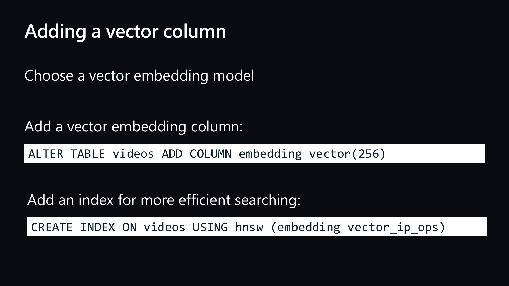
[Watch from 05:51](https://www.youtube.com/watch?v=Dk65oQjYAfo&t=351s)

After enabling pgvector, add a vector column to your table with a specified dimension length: `ALTER TABLE videos ADD COLUMN embedding vector(256)`. The dimension must match the output size of your chosen embedding model — typical models produce vectors between 256 and 3,000+ dimensions. For efficient search, create an HNSW index on the column: `CREATE INDEX ON videos USING hnsw (embedding vector_ip_ops)`.

## Choosing an index algorithm and distance operator

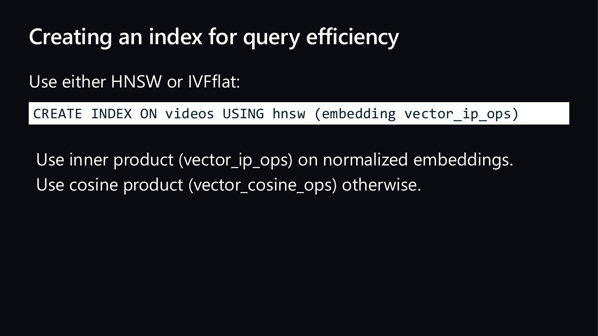
[Watch from 07:11](https://www.youtube.com/watch?v=Dk65oQjYAfo&t=431s)

pgvector supports two index algorithms: HNSW (Hierarchical Navigable Small Worlds) and IVFflat. HNSW is generally preferred because it can be created on an empty table and builds incrementally as data loads, handles inserts/updates/deletes well, and does not require setting up probe and list parameters like IVFflat. For distance operators, use inner product (`vector_ip_ops` / `<#>`) on normalized embeddings, or cosine distance (`vector_cosine_ops` / `<=>`) otherwise. The operator in the query must match the one used in the index.

## Computing vector embeddings

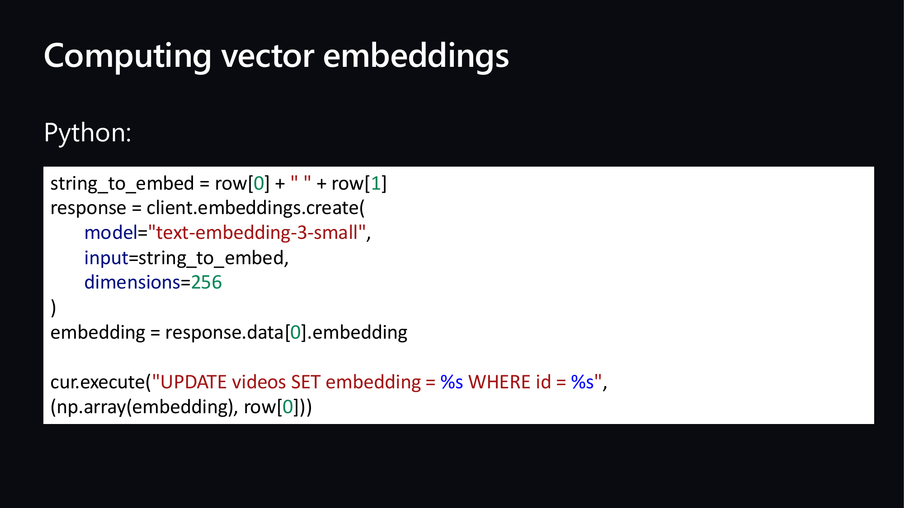
[Watch from 11:22](https://www.youtube.com/watch?v=Dk65oQjYAfo&t=682s)

To populate embeddings, concatenate the relevant text fields for each row, call an embedding model, and store the result. This example uses OpenAI's `text-embedding-3-small` with 256 dimensions. The embedding is stored as a numpy array via a SQL UPDATE. When data changes, embeddings need updating too — this can be handled with database triggers, functions, or cron jobs. The embedding model used for storage must match the one used at query time, since different models produce incompatible embedding spaces.

## Vector search SQL query

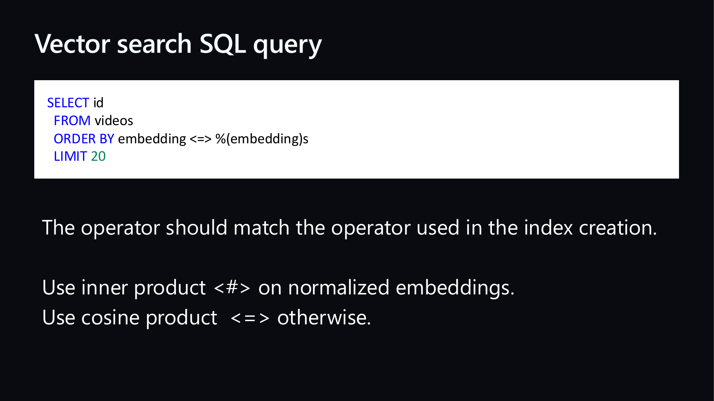
[Watch from 13:00](https://www.youtube.com/watch?v=Dk65oQjYAfo&t=780s)

A basic vector search query selects rows ordered by distance from the query embedding: `SELECT id FROM videos ORDER BY embedding <=> %(embedding)s LIMIT 20`. The `<=>` operator computes cosine distance. Vector search always returns results — even if nothing is truly relevant, it finds the closest vectors. To handle this, check the distance scores and set a threshold for what counts as close enough.

## Full-text search SQL query

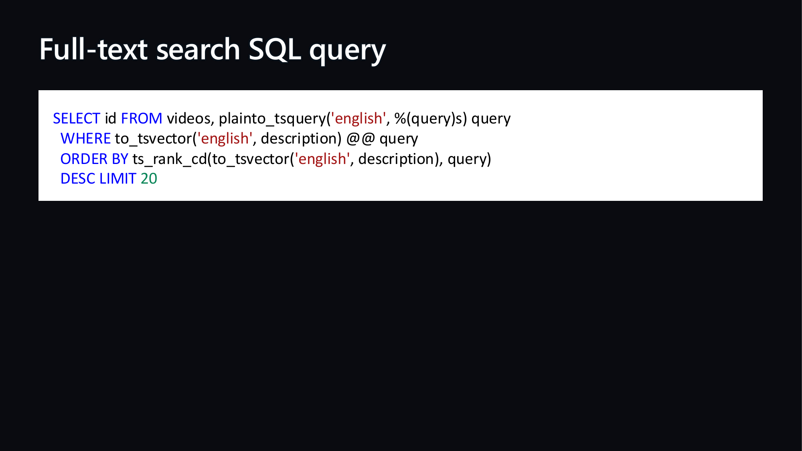
[Watch from 18:17](https://www.youtube.com/watch?v=Dk65oQjYAfo&t=1097s)

PostgreSQL's built-in full-text search uses `to_tsvector` and `plainto_tsquery`. The query converts the description column to a tsvector, matches it against the query, and ranks results by `ts_rank_cd`. Note that `tsvector` is unrelated to vector embeddings — it represents word frequencies for keyword matching. PostgreSQL's full-text search is more limited than dedicated search engines like Azure AI Search or Elasticsearch, but it is useful for exact matches on names, numbers, and identifiers without requiring an external service.

## Hybrid search query with Reciprocal Rank Fusion

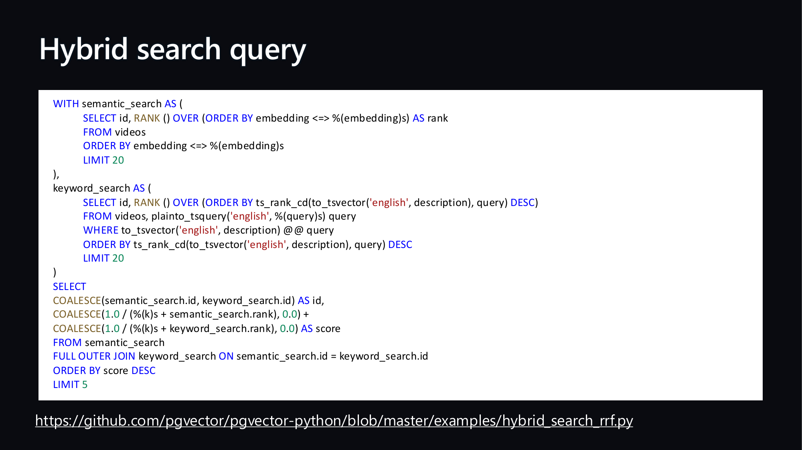
[Watch from 21:08](https://www.youtube.com/watch?v=Dk65oQjYAfo&t=1268s)

The hybrid search query uses two CTEs: one for semantic (vector) search and one for keyword search. Each CTE ranks its results independently. The outer query combines them with Reciprocal Rank Fusion: `COALESCE(1.0 / (k + semantic_rank), 0.0) + COALESCE(1.0 / (k + keyword_rank), 0.0)`. The constant `k` is typically set to 60. A `FULL OUTER JOIN` ensures results from either search are included. This query comes from the [pgvector-python examples](https://github.com/pgvector/pgvector-python/blob/master/examples/hybrid_search_rrf.py). Evaluating whether hybrid search improves answer quality over vector-only search depends on the data and types of user questions.

## Orchestrating a RAG flow with Python

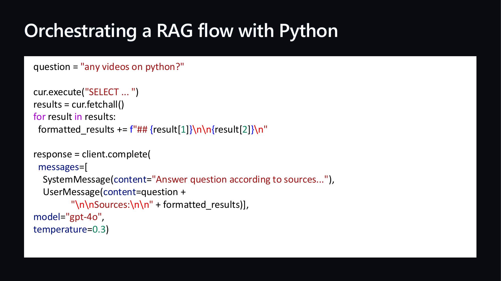
[Watch from 23:01](https://www.youtube.com/watch?v=Dk65oQjYAfo&t=1381s)

The RAG flow in Python: execute the hybrid search query, fetch results, and format them as markdown with titles and descriptions. Then send a request to the LLM with a system message instructing it to answer from the provided sources, cite video titles in square brackets, and say "I don't know" if the answer is not in the sources. The user message contains the question plus the formatted sources. A temperature of 0.3 works well for RAG — not too creative, but with some flexibility. Max tokens of 1,000 keeps responses concise.

## Full RAG with PostgreSQL solution

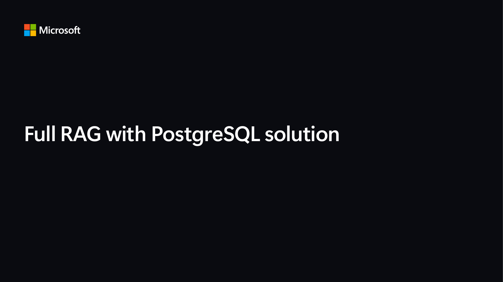
[Watch from 26:29](https://www.youtube.com/watch?v=Dk65oQjYAfo&t=1589s)

The next section covers a complete, deployable RAG application built on PostgreSQL.

## Simple RAG on PostgreSQL template

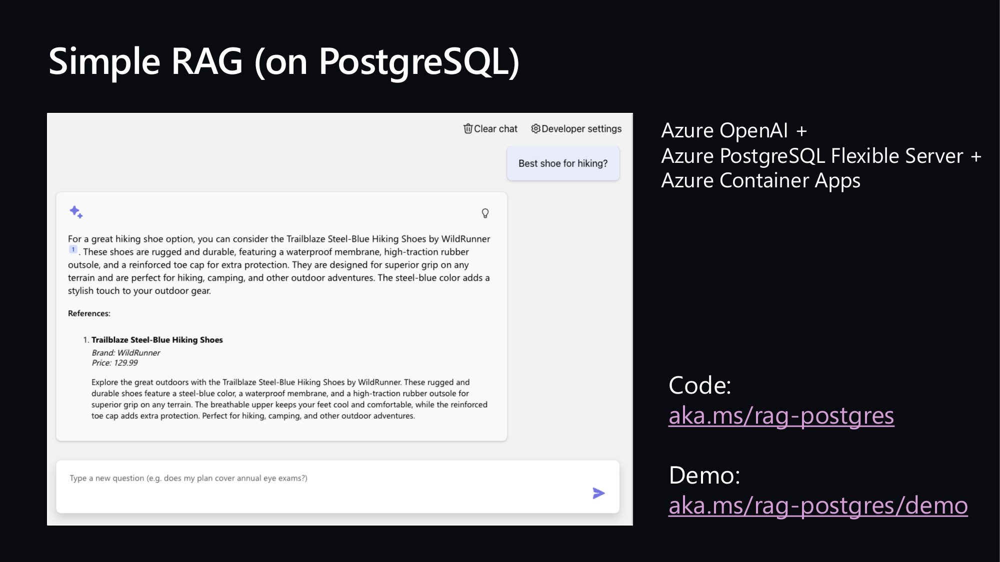
[Watch from 27:06](https://www.youtube.com/watch?v=Dk65oQjYAfo&t=1626s)

The [RAG on PostgreSQL template](https://aka.ms/rag-postgres) is an open-source solution that uses Azure OpenAI, Azure PostgreSQL Flexible Server, and Azure Container Apps. It answers questions about a product catalog of outdoor gear. The app can run entirely locally using a local PostgreSQL instance and a local model from Ollama, or deploy to Azure. The [live demo](https://aka.ms/rag-postgres/demo) shows streaming responses with citations that link back to specific database rows.

## Code walkthrough: simple RAG

[Watch from 33:04](https://www.youtube.com/watch?v=Dk65oQjYAfo&t=1984s)

The app has a TypeScript frontend using React and FluentUI, and a Python backend using FastAPI and Uvicorn. The frontend sends requests from `chat.tsx` through `api.ts`. The backend routes through `app.py` to `simple_rag.py`, which handles the full RAG pipeline: rewriting the search query, computing text embeddings, executing the hybrid search, building the message history, and calling `chat.completions.create()`.

## Advanced RAG with query rewriting

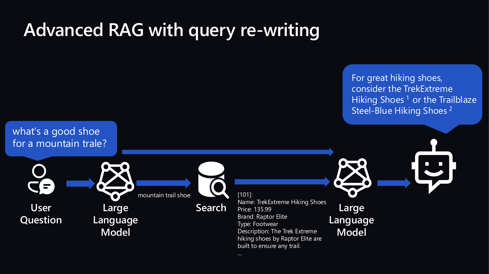
[Watch from 28:43](https://www.youtube.com/watch?v=Dk65oQjYAfo&t=1723s)

Advanced RAG adds a query rewriting step before search. The user's raw question (which may contain typos, unnecessary words, or vague phrasing) is sent to an LLM that rewrites it into a cleaner search query. For example, "what's a good shoe for a mountain trale?" becomes "mountain trail hike shoe." This improves both vector search and keyword search results by removing noise and focusing on the key terms.

## Query rewriting with function calling

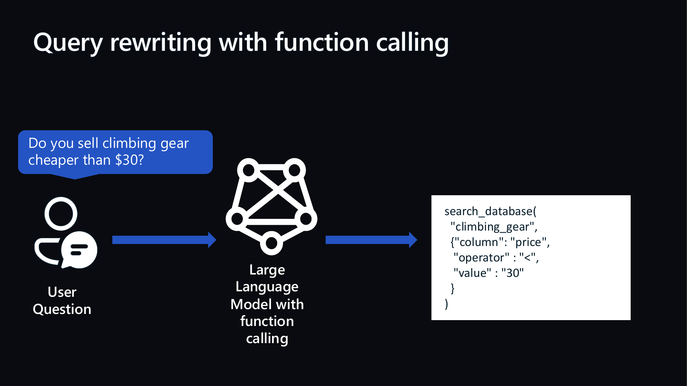
[Watch from 30:17](https://www.youtube.com/watch?v=Dk65oQjYAfo&t=1817s)

Function calling makes query rewriting even more powerful. Instead of just rewriting text, the LLM returns a structured function call with the search query and any applicable SQL filters. For a question like "do you sell climbing gear cheaper than $30?", the LLM returns `search_database("climbing_gear", {"column": "price", "operator": "<", "value": "30"})`. The filter is applied as a SQL WHERE clause before the vector and keyword search, ensuring all returned results meet the price constraint. Filters can be defined for any column — price, type, brand, etc.

## Advanced RAG flow with function calling

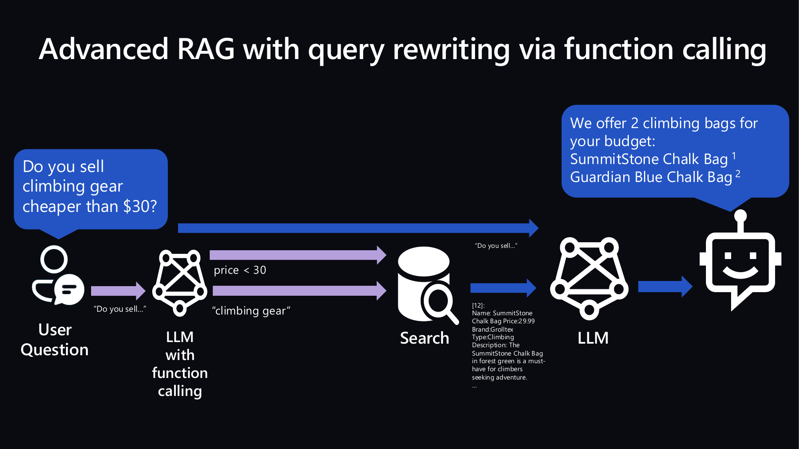
[Watch from 31:54](https://www.youtube.com/watch?v=Dk65oQjYAfo&t=1914s)

The complete advanced RAG flow: the user asks a question, the LLM extracts a search query and optional SQL filters via function calling, the database applies the filters and runs hybrid search on the remaining results, and finally the filtered results are sent to the LLM for the final answer. This approach ensures the LLM only sees results that actually match the user's constraints, producing more accurate and relevant responses.

## Code walkthrough: advanced RAG

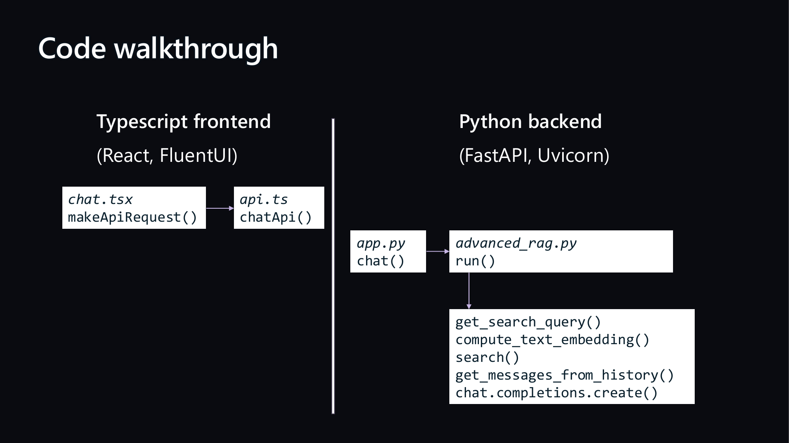
[Watch from 33:04](https://www.youtube.com/watch?v=Dk65oQjYAfo&t=1984s)

The advanced RAG version uses the same frontend but replaces `simple_rag.py` with `advanced_rag.py` in the backend. The pipeline steps are the same — `get_search_query()`, `compute_text_embedding()`, `search()`, `get_messages_from_history()`, and `chat.completions.create()` — but `get_search_query()` now uses function calling to extract both a search query and metadata filters.

## Deploying with the Azure Developer CLI

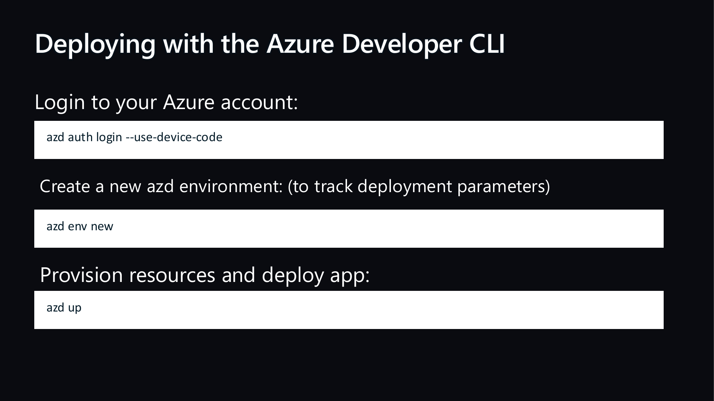
[Watch from 33:24](https://www.youtube.com/watch?v=Dk65oQjYAfo&t=2004s)

Deployment uses the Azure Developer CLI (azd). Three commands: `azd auth login --use-device-code` to authenticate, `azd env new` to create an environment for tracking deployment parameters, and `azd up` to provision all Azure resources and deploy the app. This deploys everything in one step.

## Application architecture on Azure

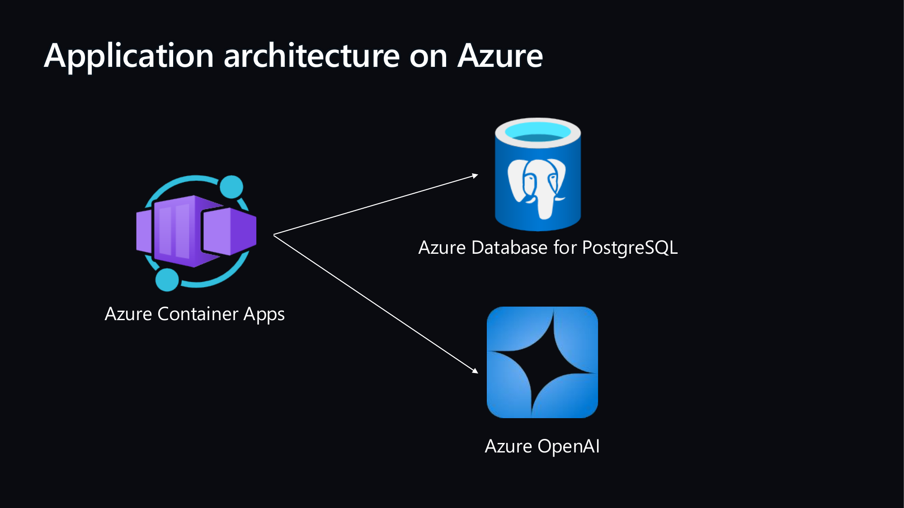
[Watch from 33:39](https://www.youtube.com/watch?v=Dk65oQjYAfo&t=2019s)

The deployed app runs on Azure Container Apps for the web server, Azure Database for PostgreSQL Flexible Server for the database, and Azure OpenAI for embeddings and chat completions. Authentication between services uses managed identity — no API keys or passwords. This keyless approach is more secure since there are no credentials to rotate or leak.

## AI extensions for Azure Database for PostgreSQL

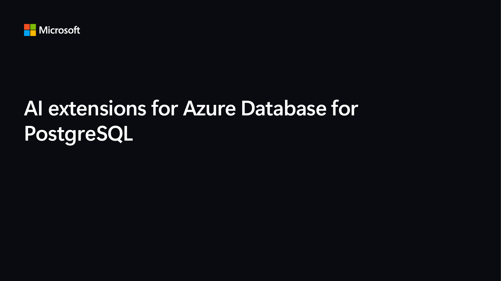
[Watch from 34:44](https://www.youtube.com/watch?v=Dk65oQjYAfo&t=2084s)

The second half of the talk covers AI extensions specific to Azure Database for PostgreSQL, presented by Joshua Johnson.

## Azure PostgreSQL AI features overview

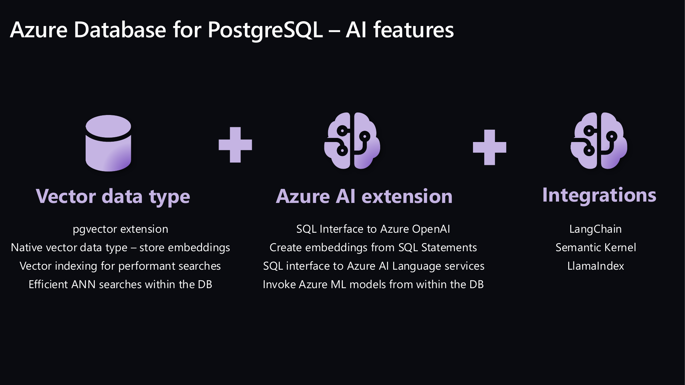
[Watch from 35:37](https://www.youtube.com/watch?v=Dk65oQjYAfo&t=2137s)

Azure Database for PostgreSQL provides three categories of AI features. First, the pgvector extension for native vector data types, indexing, and efficient approximate nearest neighbor search. Vectors are a first-class data type, so they support row-level security and all standard PostgreSQL data management features. Second, the azure_ai extension that provides a SQL interface to Azure OpenAI for creating embeddings, Azure AI Language Services for sentiment analysis and summarization, Azure AI Translator, and Azure Machine Learning for custom models. Third, integrations with LangChain, Semantic Kernel, and LlamaIndex — LangChain's official documentation now lists Azure Database for PostgreSQL under Microsoft services.

## AI services integrated into Azure PostgreSQL

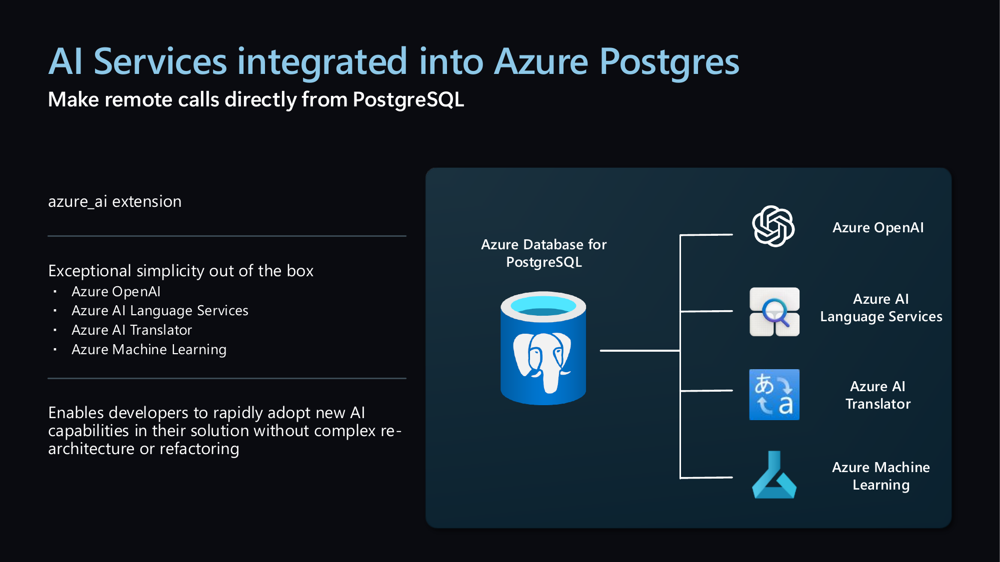
[Watch from 36:42](https://www.youtube.com/watch?v=Dk65oQjYAfo&t=2202s)

The azure_ai extension lets you make remote calls to Azure AI services directly from SQL without leaving the database. Supported services include Azure OpenAI for embeddings and completions, Azure AI Language Services for sentiment analysis and text summarization, Azure AI Translator for real-time translation across 100+ languages, and Azure Machine Learning for calling custom deployed models. This lets developers add AI capabilities to existing applications without complex re-architecture — just install the extension and call functions from SQL.

## Remote vs in-database embedding models

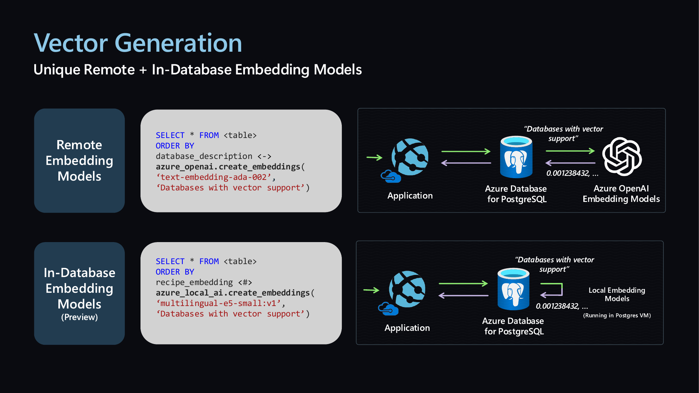
[Watch from 38:58](https://www.youtube.com/watch?v=Dk65oQjYAfo&t=2338s)

Azure PostgreSQL supports two embedding approaches. Remote embedding calls Azure OpenAI (e.g., `text-embedding-ada-002` or `text-embedding-3-small`) from SQL via `azure_openai.create_embeddings()`. The application calls PostgreSQL, which calls the OpenAI endpoint, and returns the embedding. In-database embedding uses the `azure_local_ai` extension, which deploys the `multilingual-e5-small` model (384 dimensions) in a container on the same VM as the PostgreSQL instance. This runs on memory-optimized SKUs with 4+ cores and uses about 2 GB of memory. The in-database approach keeps data within the database environment and avoids external API calls entirely.

## In-database embedding performance

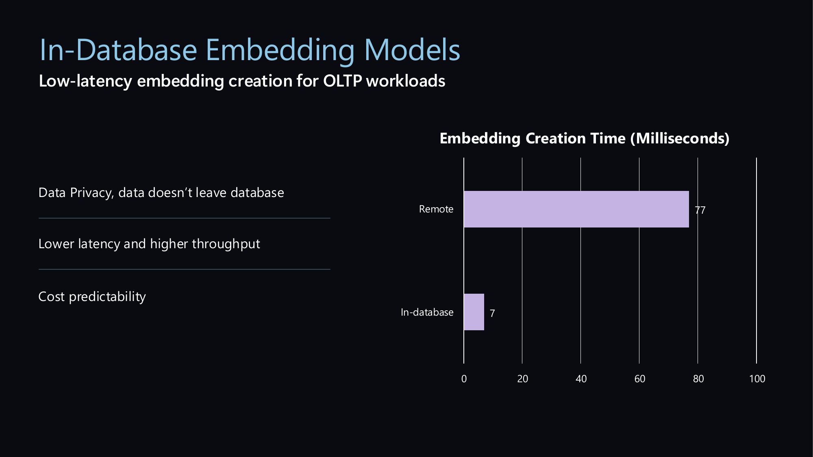
[Watch from 41:21](https://www.youtube.com/watch?v=Dk65oQjYAfo&t=2481s)

In-database embeddings are roughly 10x faster than remote embeddings: 7 milliseconds average versus 77 milliseconds for remote calls. Beyond latency, in-database embeddings provide data privacy (data never leaves the database VM), higher throughput for OLTP workloads, and cost predictability since no additional endpoint tokens are consumed — you only pay for the VM you are already running.

## RAG pattern with Azure Database for PostgreSQL

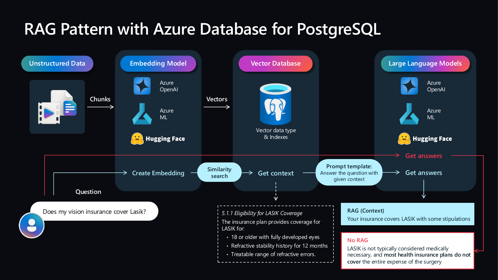
[Watch from 42:18](https://www.youtube.com/watch?v=Dk65oQjYAfo&t=2538s)

The full RAG pattern with Azure PostgreSQL: unstructured documents are chunked, sent through an embedding model (Azure OpenAI or Azure ML), and stored as vectors in PostgreSQL. At query time, the user's question is embedded, a similarity search retrieves relevant context, and the context is injected into a prompt template for the LLM. The slide contrasts RAG versus no-RAG responses using an insurance coverage question. Without RAG, GPT states LASIK is not typically covered. With RAG and actual insurance documentation as context, the model correctly responds that LASIK is covered with stipulations.

## eShop demo powered by Azure DB for PostgreSQL

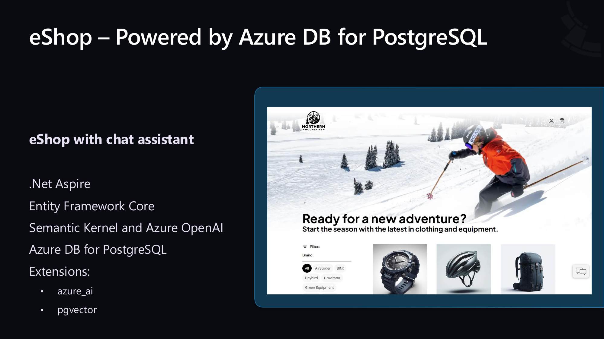
[Watch from 44:07](https://www.youtube.com/watch?v=Dk65oQjYAfo&t=2647s)

The [eShop on Azure](https://github.com/Azure-Samples/eShopOnAzure) sample is a .NET application using .NET Aspire, Entity Framework Core, Semantic Kernel, and Azure OpenAI with Azure Database for PostgreSQL. It uses both the pgvector and azure_ai extensions. The app is an online outdoor gear store with a chat assistant that can search the product catalog using vector embeddings generated from item names and descriptions. The chatbot maintains conversation history, checks inventory via the catalog API, and requires authentication before allowing items to be added to the cart. The whole stack deploys to Azure via `azd up`.

## eShop application in action

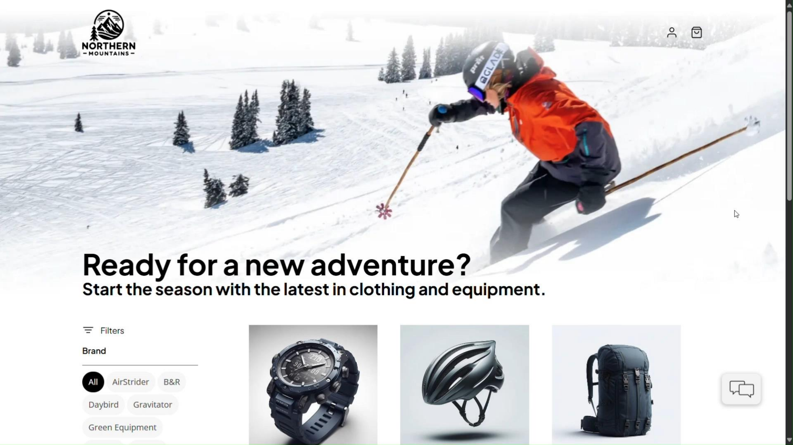
[Watch from 45:38](https://www.youtube.com/watch?v=Dk65oQjYAfo&t=2738s)

The eShop demo shows the chatbot recommending snowboarding jackets, checking stock availability, and prompting users to log in (via Entra ID) before adding items to their cart. The chat assistant personality and prompt can be customized. Product images are AI-generated. The system could be extended with multimodal search using image embeddings to handle queries about visual product attributes like color or style.

## Hybrid search with geospatial data and real-time translation

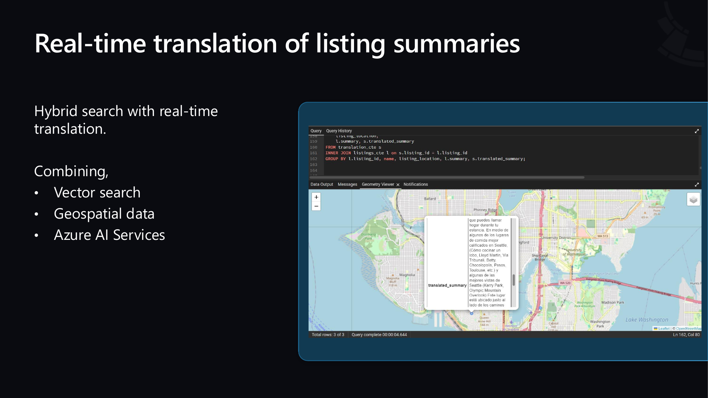
[Watch from 50:17](https://www.youtube.com/watch?v=Dk65oQjYAfo&t=3017s)

This demo combines vector search, geospatial queries, and real-time translation in a single SQL query against a Seattle Airbnb dataset of over 2,000 listings. It uses the `multilingual-e5-small` in-database embedding model for vector search, the PostGIS extension for filtering by distance from the Space Needle, and the Azure AI Translator service for translating listing summaries into other languages. The multilingual embedding model supports 100+ languages, matching the translator's coverage. Results are visualized on a map in PG Admin showing proximity to Seattle Center. The entire query runs as SQL with function calls to the AI extensions — no external application code needed.

## Q&A

### Can you deploy Azure PostgreSQL for free?

Azure Database for PostgreSQL is available as part of Azure's free trial. New Azure accounts get a free PostgreSQL Flexible Server for the first year. After that, it becomes a paid service — typical costs for a small server run about $12/month depending on region and SKU.
